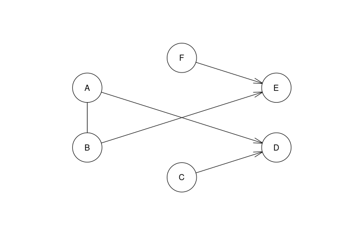
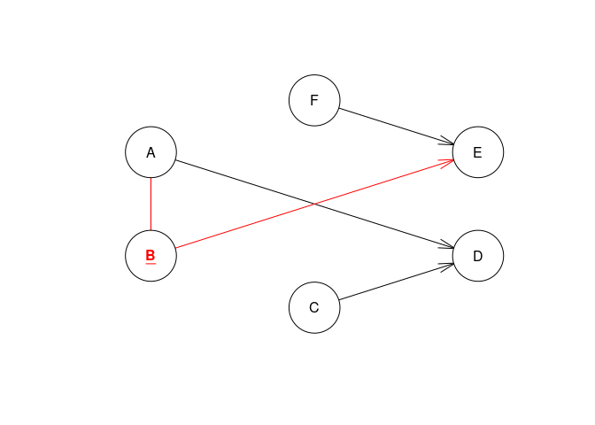
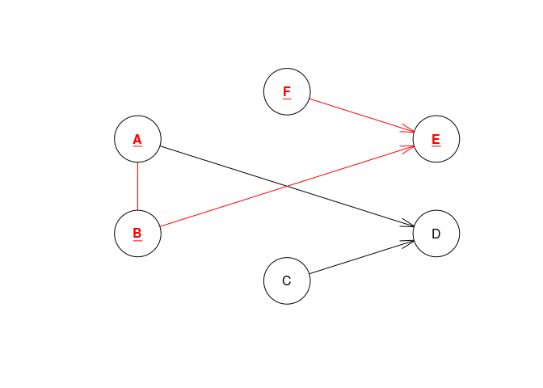

Bayes test
================

``` r
library(bnlearn)
```

    ## 
    ## Attaching package: 'bnlearn'

    ## The following object is masked from 'package:stats':
    ## 
    ##     sigma

``` r
data(learning.test)
d<-learning.test
res = gs(learning.test)

plot(res)
```



``` r
## highlight node B and related arcs.
plot(res, highlight = "B")
```



``` r
## highlight B and its Markov blanket.
plot(res, highlight = c("B", mb(res, "B")))
```


