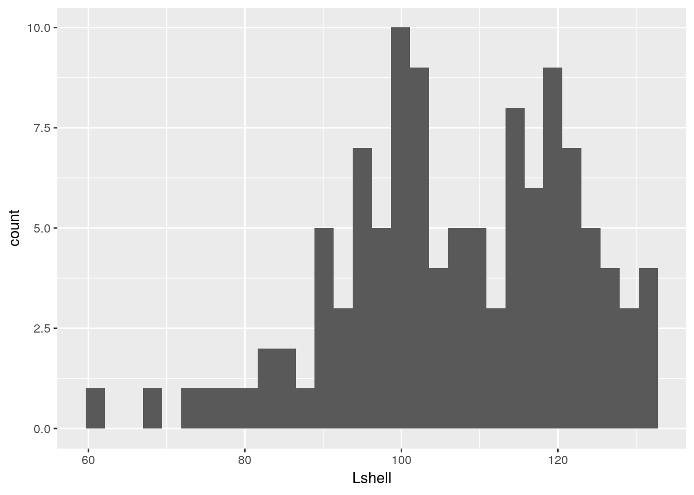
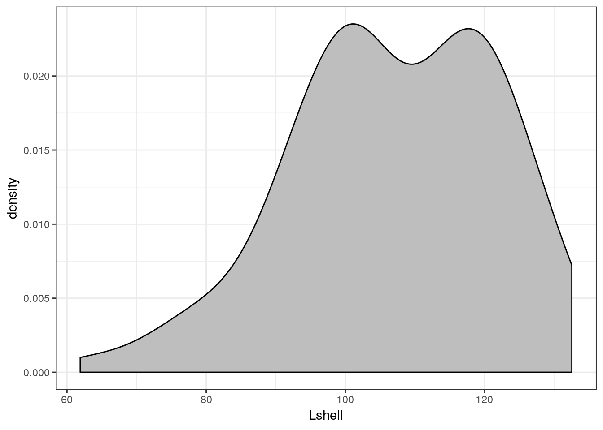
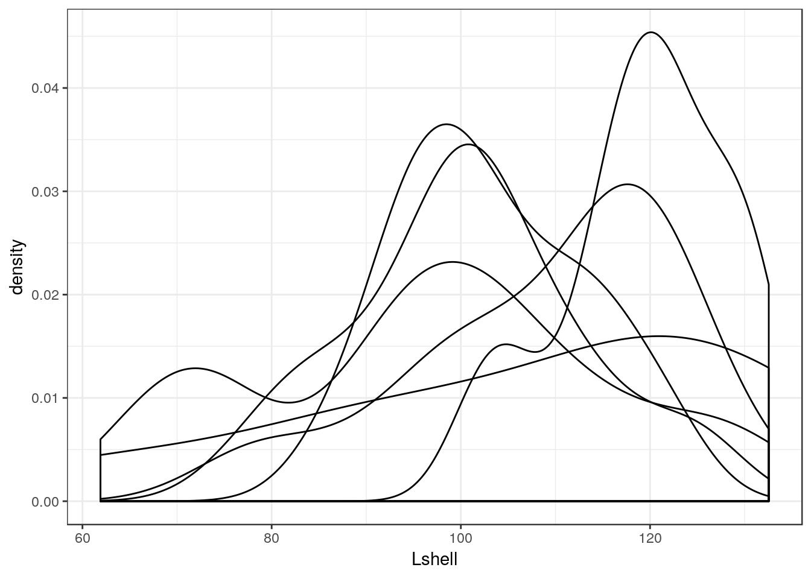
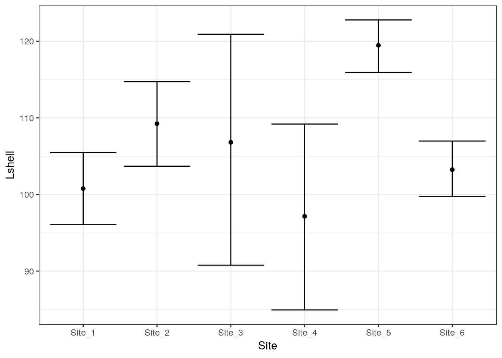
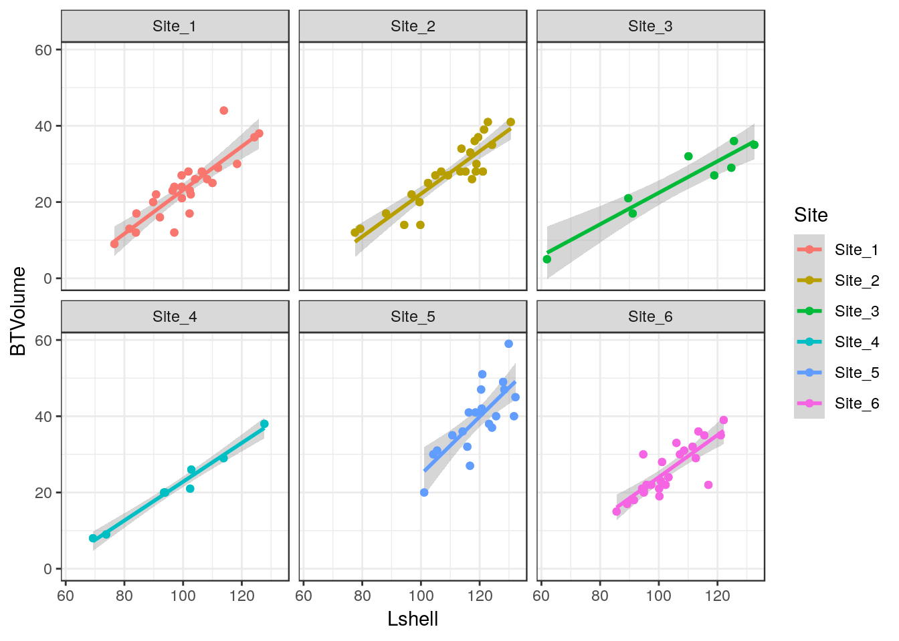
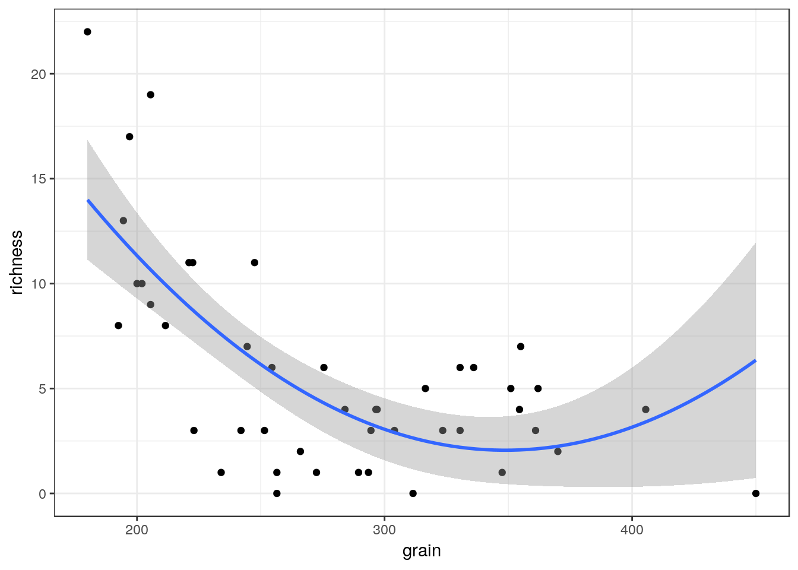
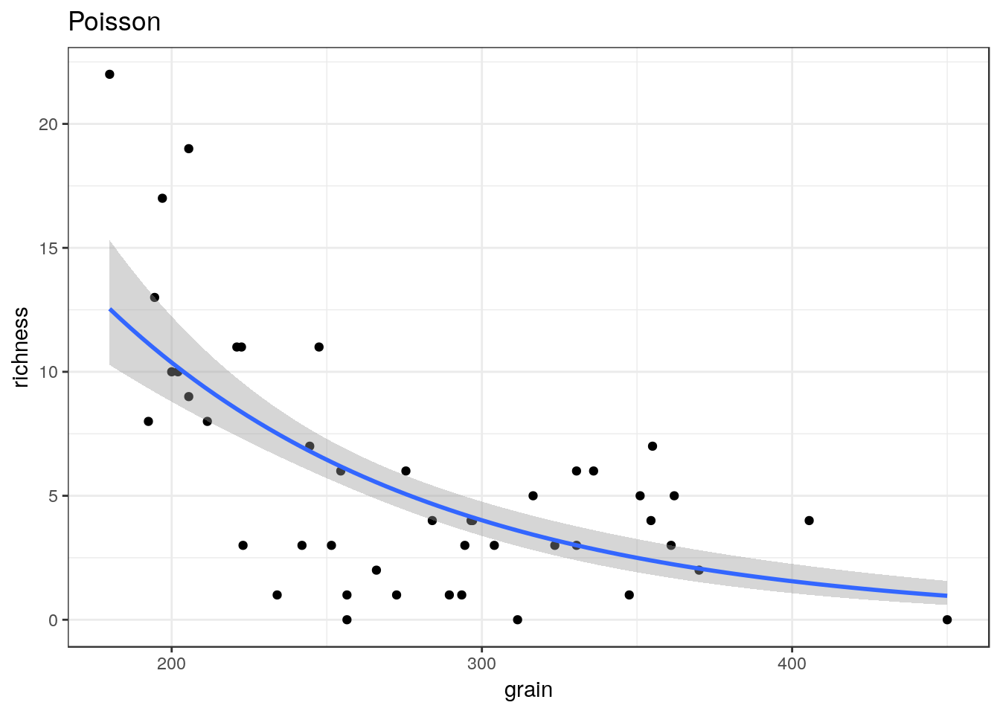
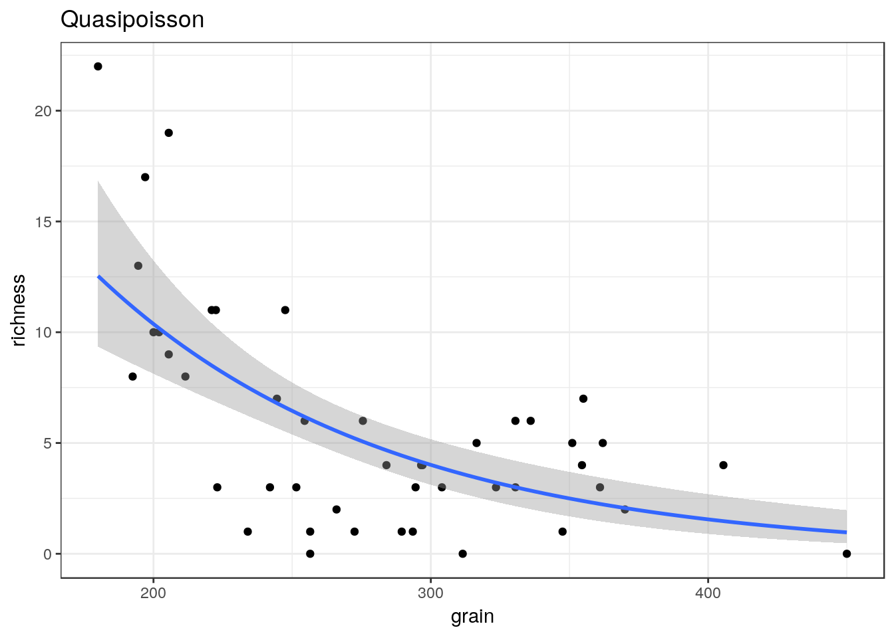
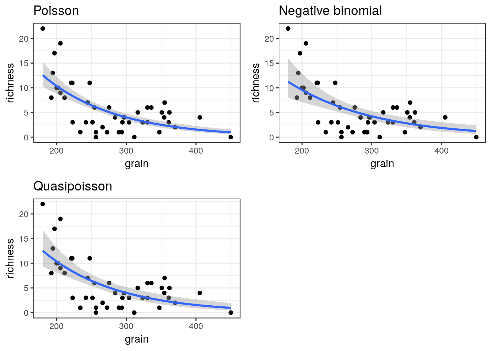

# Grammar of graphics plots

Grammar of Graphics plots (ggplots) were designed by Hadley Wickam, who also programmed dplyr. The two packages share the same aproach to high level declarative programming. The syntax differs from base R graphics syntax in various ways and can take some time to get used to. However ggplots provides an extremely elegant framework for building really nice looking figures with comparatively few lines of code. Like the older lattice plots, ggplots are quite prescriptive and will make a lot of the decisions for you, although most of the default settings can be changed.

A very useful resource is provided by the R cookbook pages.

http://www.cookbook-r.com/Graphs/

A detailed tutorial of gggplots is provided in chapter 3 of R for data science

https://r4ds.had.co.nz/data-visualisation.html

Some additional ideas are available here

http://r-statistics.co/Top50-Ggplot2-Visualizations-MasterList-R-Code.html

A flip book approach is taken here.

https://evamaerey.github.io/ggplot_flipbook/ggplot_flipbook_xaringan.html#23


## Histograms

Typical histograms use only one variable at a time, although they may be “conditioned” by some grouping variable. The aim of a histogram is to show the distribution of the variable clearly. Let’s try ggplot histograms in ggplot2 using some simple data on mussel shell length at six sites.


```r
library(ggplot2)

library(mgcv)
```

```
## Loading required package: nlme
```

```
## This is mgcv 1.8-24. For overview type 'help("mgcv-package")'.
```

```r
# devtools::install_github("dgolicher/aqm") To install aqm package If not working on the server
library(aqm)
```

```
## 
## Attaching package: 'aqm'
```

```
## The following object is masked from 'package:stats':
## 
##     dt
```

```r
data(mussels)
d<-mussels
str(d)
```

```
## 'data.frame':	113 obs. of  3 variables:
##  $ Lshell  : num  122.1 100.1 100.7 102.3 94.9 ...
##  $ BTVolume: int  39 21 23 22 20 22 21 18 21 15 ...
##  $ Site    : Factor w/ 6 levels "Site_1","Site_2",..: 6 6 6 6 6 6 6 6 6 6 ...
```

## Aesthetics

The first step when building a ggplot is to decide how the data will be mapped onto the elements that make up the plot. The term for this in ggplot speak is “aesthetics”- Personally I find the term rather odd and potentially misleading. I would instinctively assume that aesthetics refers to the colour scheme or other visual aspect of the final plot. In fact the aesthetics are the first thing to decide on, rather than the last.

The easiest way to build a plot is by first forming an invisible object which represents the mapping of data onto the page. The way these data are presented can then be changed. The only aesthetics (mappings) that you need to know about for basic usage are x,y, colour, fill and group. The x and y mappings coincide with axes, so are simple enough. Remember that a histogram maps onto the x axis. The y axis shows either frequency or density so is not mapped directly as a variable in the data. So to produce a histogram we need to provide ggplot2 with the name of the variable we are going to use. We do that like this.


```r
g0 <- ggplot(data=d,aes(x=Lshell))
```


## Default histogram

Once the mapping is established producing a histogram, or any other figure, involves deciding on the geometry used to depict the aesthetics. The default is very simple.


```r
g0 + geom_histogram()
```

```
## `stat_bin()` using `bins = 30`. Pick better value with `binwidth`.
```




There are several things to notice here. One is that the default theme has a grey background and looks rather like some of the figures in Excel. For some purposes this can be useful. However you may prefer a more traditional black and white theme. This is easy to change. You are also warned that the default binwidth may not be ideal.

My own default settings for a histogram would therefore look more like this.


```r
g1<-g0 +geom_histogram(fill="grey",colour="black",binwidth=10) + theme_bw()
g1
```


This should be self explanatory. The colour refers to the lines. It is usually a good idea to set the binwidth manually anyway. Notice that this time I have assigned the results to another object. We can then work with this to produce conditional histograms.

You can set the theme to black and white for all subsequent plots with a command.


```r
theme_set(theme_bw())
```


## Facet wrapping

Conditioning the data on one grouping variable is very simple using a facet_wrap. Facets are the term used in ggplots for the panels in a lattice plot. There are two facet functions. Facet_wrap simply wraps a one dimensional set of panels into what should be a convenient number of columns and rows. You can set the number of columns and rows if the results are not as you want.


```r
g_sites<-g1+facet_wrap(~Site)
g_sites
```


## Density plots.

Density plots are produced in similar manner to histograms.


```r
g1<-g0 +geom_density(fill="grey",colour="black")
g1
```




```r
g_sites<-g1+facet_wrap(~Site)
g_sites
```


## Adding grouping aesthetics

Adding a grouping aesthetic allow subgroups to be plotted on the same figure.


```r
g_group<-ggplot(d, aes(Lshell, group=Site)) + geom_density()
g_group
```




Colour and fill are also grouping aesthetics. So a nicer way of showing this would be use them instead.


```r
g_group<-ggplot(d, aes(Lshell, colour = Site,fill=Site)) + geom_density(alpha = 0.2)
g_group
```


## Boxplots

A grouped boxplot uses the grouping variable on the x axis. So we need to change the aesthetic mapping to reflect this.


```r
library(plotly)
```

```
## 
## Attaching package: 'plotly'
```

```
## The following object is masked from 'package:ggplot2':
## 
##     last_plot
```

```
## The following object is masked from 'package:stats':
## 
##     filter
```

```
## The following object is masked from 'package:graphics':
## 
##     layout
```

```r
g0 <- ggplot(d,aes(x=Site,y=Lshell))
g_box<-g0 + geom_boxplot(fill="grey",colour="black")+theme_bw()
ggplotly(g_box)
```

<!--html_preserve--><div id="4efb29de36c8" style="width:672px;height:480px;" class="plotly html-widget"></div>
<script type="application/json" data-for="4efb29de36c8">{"x":{"data":[{"x":[6,6,6,6,6,6,6,6,6,6,6,6,6,6,6,6,6,6,6,6,6,6,6,6,6,3,3,3,3,3,3,3,3,4,4,4,4,4,4,4,4,5,5,5,5,5,5,5,5,5,5,5,5,5,5,5,5,5,5,5,5,5,1,1,1,1,1,1,1,1,1,1,1,1,1,1,1,1,1,1,1,1,1,1,1,1,1,1,2,2,2,2,2,2,2,2,2,2,2,2,2,2,2,2,2,2,2,2,2,2,2,2,2],"y":[122.1,100.1,100.7,102.3,94.9,116.9,94.9,91.5,94.3,85.6,113.5,111.5,106,115.5,101.1,97.4,89.2,121.1,95.8,94.7,108.6,100.2,107.2,112.6,103.3,118.9,61.9,124.7,132.55,91.1,125.6,110.1,89.6,127.7,102.4,93.5,113.8,102.8,93.9,73.8,69.3,120.9,131.7,129.9,120.4,128,114.2,128.4,120.7,116.3,110.7,105.5,120.5,123.2,124.2,125.6,118.6,104.2,116.7,132.2,115.8,101.1,110,102.3,84.1,96.4,99.5,89.8,81.7,125.9,124.3,99.5,104.1,111.9,102.2,92.1,83.9,97,113.9,108.2,106.4,102.6,99.6,90.8,118.4,97,76.6,101.8,122.8,104.9,121.5,124.2,118.9,117.4,77.5,130.6,79.3,116.8,119.5,99.5,115.2,118.7,109.2,118.3,113.8,106.9,113.4,99.8,96.8,121.1,94.3,102.4,88.1],"hoverinfo":"y","type":"box","fillcolor":"rgba(190,190,190,1)","marker":{"opacity":null,"outliercolor":"rgba(0,0,0,1)","line":{"width":1.88976377952756,"color":"rgba(0,0,0,1)"},"size":5.66929133858268},"line":{"color":"rgba(0,0,0,1)","width":1.88976377952756},"showlegend":false,"xaxis":"x","yaxis":"y","frame":null}],"layout":{"margin":{"t":26.2283105022831,"r":7.30593607305936,"b":40.1826484018265,"l":43.1050228310502},"plot_bgcolor":"rgba(255,255,255,1)","paper_bgcolor":"rgba(255,255,255,1)","font":{"color":"rgba(0,0,0,1)","family":"","size":14.6118721461187},"xaxis":{"domain":[0,1],"type":"linear","autorange":false,"range":[0.4,6.6],"tickmode":"array","ticktext":["Site_1","Site_2","Site_3","Site_4","Site_5","Site_6"],"tickvals":[1,2,3,4,5,6],"categoryorder":"array","categoryarray":["Site_1","Site_2","Site_3","Site_4","Site_5","Site_6"],"nticks":null,"ticks":"outside","tickcolor":"rgba(51,51,51,1)","ticklen":3.65296803652968,"tickwidth":0.66417600664176,"showticklabels":true,"tickfont":{"color":"rgba(77,77,77,1)","family":"","size":11.689497716895},"tickangle":-0,"showline":false,"linecolor":null,"linewidth":0,"showgrid":true,"gridcolor":null,"gridwidth":0,"zeroline":false,"anchor":"y","title":"Site","titlefont":{"color":"rgba(0,0,0,1)","family":"","size":14.6118721461187},"hoverformat":".2f"},"yaxis":{"domain":[0,1],"type":"linear","autorange":false,"range":[58.3675,136.0825],"tickmode":"array","ticktext":["60","80","100","120"],"tickvals":[60,80,100,120],"categoryorder":"array","categoryarray":["60","80","100","120"],"nticks":null,"ticks":"outside","tickcolor":"rgba(51,51,51,1)","ticklen":3.65296803652968,"tickwidth":0.66417600664176,"showticklabels":true,"tickfont":{"color":"rgba(77,77,77,1)","family":"","size":11.689497716895},"tickangle":-0,"showline":false,"linecolor":null,"linewidth":0,"showgrid":true,"gridcolor":null,"gridwidth":0,"zeroline":false,"anchor":"x","title":"Lshell","titlefont":{"color":"rgba(0,0,0,1)","family":"","size":14.6118721461187},"hoverformat":".2f"},"shapes":[{"type":"rect","fillcolor":"transparent","line":{"color":"rgba(51,51,51,1)","width":0.66417600664176,"linetype":"solid"},"yref":"paper","xref":"paper","x0":0,"x1":1,"y0":0,"y1":1}],"showlegend":false,"legend":{"bgcolor":"rgba(255,255,255,1)","bordercolor":"transparent","borderwidth":1.88976377952756,"font":{"color":"rgba(0,0,0,1)","family":"","size":11.689497716895}},"hovermode":"closest","barmode":"relative"},"config":{"doubleClick":"reset","modeBarButtonsToAdd":[{"name":"Collaborate","icon":{"width":1000,"ascent":500,"descent":-50,"path":"M487 375c7-10 9-23 5-36l-79-259c-3-12-11-23-22-31-11-8-22-12-35-12l-263 0c-15 0-29 5-43 15-13 10-23 23-28 37-5 13-5 25-1 37 0 0 0 3 1 7 1 5 1 8 1 11 0 2 0 4-1 6 0 3-1 5-1 6 1 2 2 4 3 6 1 2 2 4 4 6 2 3 4 5 5 7 5 7 9 16 13 26 4 10 7 19 9 26 0 2 0 5 0 9-1 4-1 6 0 8 0 2 2 5 4 8 3 3 5 5 5 7 4 6 8 15 12 26 4 11 7 19 7 26 1 1 0 4 0 9-1 4-1 7 0 8 1 2 3 5 6 8 4 4 6 6 6 7 4 5 8 13 13 24 4 11 7 20 7 28 1 1 0 4 0 7-1 3-1 6-1 7 0 2 1 4 3 6 1 1 3 4 5 6 2 3 3 5 5 6 1 2 3 5 4 9 2 3 3 7 5 10 1 3 2 6 4 10 2 4 4 7 6 9 2 3 4 5 7 7 3 2 7 3 11 3 3 0 8 0 13-1l0-1c7 2 12 2 14 2l218 0c14 0 25-5 32-16 8-10 10-23 6-37l-79-259c-7-22-13-37-20-43-7-7-19-10-37-10l-248 0c-5 0-9-2-11-5-2-3-2-7 0-12 4-13 18-20 41-20l264 0c5 0 10 2 16 5 5 3 8 6 10 11l85 282c2 5 2 10 2 17 7-3 13-7 17-13z m-304 0c-1-3-1-5 0-7 1-1 3-2 6-2l174 0c2 0 4 1 7 2 2 2 4 4 5 7l6 18c0 3 0 5-1 7-1 1-3 2-6 2l-173 0c-3 0-5-1-8-2-2-2-4-4-4-7z m-24-73c-1-3-1-5 0-7 2-2 3-2 6-2l174 0c2 0 5 0 7 2 3 2 4 4 5 7l6 18c1 2 0 5-1 6-1 2-3 3-5 3l-174 0c-3 0-5-1-7-3-3-1-4-4-5-6z"},"click":"function(gd) { \n        // is this being viewed in RStudio?\n        if (location.search == '?viewer_pane=1') {\n          alert('To learn about plotly for collaboration, visit:\\n https://cpsievert.github.io/plotly_book/plot-ly-for-collaboration.html');\n        } else {\n          window.open('https://cpsievert.github.io/plotly_book/plot-ly-for-collaboration.html', '_blank');\n        }\n      }"}],"cloud":false},"source":"A","attrs":{"4efbe0d6bb0":{"x":{},"y":{},"type":"box"}},"cur_data":"4efbe0d6bb0","visdat":{"4efbe0d6bb0":["function (y) ","x"]},"highlight":{"on":"plotly_click","persistent":false,"dynamic":false,"selectize":false,"opacityDim":0.2,"selected":{"opacity":1}},"base_url":"https://plot.ly"},"evals":["config.modeBarButtonsToAdd.0.click"],"jsHooks":{"render":[{"code":"function(el, x) { var ctConfig = crosstalk.var('plotlyCrosstalkOpts').set({\"on\":\"plotly_click\",\"persistent\":false,\"dynamic\":false,\"selectize\":false,\"opacityDim\":0.2,\"selected\":{\"opacity\":1}}); }","data":null}]}}</script><!--/html_preserve-->


You should be able to work out that sets of boxplots could be conditioned on a third variable using faceting.

## Conditioning on two variables


```r
Species<-as.factor(rep(c("Sp_1","Sp_2"),each=20))
Site<-rep(c("Site_1","Site_2"),times=20)
resp<-rnorm(40,10,4)
d2<-data.frame(Species,resp,Site)
g_box<-ggplot(d2,aes(y=resp,x=Species))+geom_boxplot(fill="grey",colour="black")
g_box
```


```r
g_box+facet_wrap(~Site)
```


## Confidence interval plots

One important rule that you should try to follow when presenting data and carrying out any statistical test is to show confidence intervals for key parameters. Remember that boxplots show the actual data. Parameters extracted from the data are means when the data are grouped by a factor. When two or more numerical variables are combined the parameters refer to the statistical model, as in the case of regression.

Grammar of graphics provides a convenient way of adding statistical summaries to the figures. We can show the position of the mean mussel shell length for each site simply by asking to plot the mean for each y like this.


```r
g0 <- ggplot(d,aes(x=Site,y=Lshell))
g_mean<-g0+stat_summary(fun.y=mean,geom="point")
g_mean
```


This is not very useful. However you can easily add confidence intervals


```r
g_mean+stat_summary(fun.data=mean_cl_normal,geom="errorbar")
```


If you want more robust confidence intervals with no assumption of normality of the residulas then you can use bootstrapping. In this case the result should be just about identical, as the errors are approximately normally distributed.


```r
g_mean+stat_summary(fun.data=mean_cl_boot,geom="errorbar")
```



## Dynamite plots

The traditional “dynamite” plots with a confidence interval over a bar can be formed in the same way.


```r
g0 <- ggplot(d,aes(x=Site,y=Lshell))
g_mean<-g0+stat_summary(fun.y=mean,geom="bar")
g_mean+stat_summary(fun.data=mean_cl_normal,geom="errorbar")
```


Most statisticians prefer that the means are shown as points rather than bars. You may want to look at the discussion on this provided by Ben Bolker.

http://emdbolker.wikidot.com/blog:dynamite


## Inference on medians

One way to infer differences between medians is to plot boxplots with notches.


```r
g0 <- ggplot(d,aes(x=Site,y=Lshell))
g_box<-g0 + geom_boxplot(fill="grey",colour="black", notch=TRUE)+theme_bw()
g_box
```


```r
# Function included in aqm package

# median_cl_boot <- function(x, conf = 0.95) {
#   lconf <- (1 - conf)/2
#   uconf <- 1 - lconf
#   require(boot)
#   bmedian <- function(x, ind) median(x[ind])
#   bt <- boot(x, bmedian, 1000)
#   bb <- boot.ci(bt, type = "perc")
#   data.frame(y = median(x), ymin = quantile(bt$t, lconf), ymax = quantile(bt$t, 
#                                                                           uconf))
# }
```


```r
g0+ stat_summary(fun.data = aqm::median_cl_boot, geom = "errorbar") + stat_summary(fun.y = median, geom = "point")
```


## Scatterplots

Scatterplots can be built up in a similar manner. We first need to define the aesthetics. In this case there are clearly a and y coordinates that need to be mapped to the names of the variables.


```r
g0 <- ggplot(d,aes(x=Lshell,y=BTVolume))

g0+geom_point()
```


## Adding a regression line

It is very easy to add a regression line with confidence intervals to the plot.


```r
g0+geom_point()+geom_smooth(method = "lm", se = TRUE)
```


Although the syntax reads “se=TRUE” this refers to 95% confidence intervals.

## Grouping and conditioning

There are various ways of plotting regressions for each site. We could define a colour aesthetic that will automatically group the data and then plot all the lines as one figure.


```r
g0 <- ggplot(d,aes(x=Lshell,y=BTVolume,colour=Site))
g1<-g0+geom_point()+geom_smooth(method = "lm", se = TRUE)
g2<-g1+geom_point(aes(col=factor(Site)))
g2
```


This can be split into panels using facet wrapping.


```r
g2+facet_wrap(~Site)
```




## Curvilinear relationships

Many models involving two variables can be visualised using ggplot.


```r
d<-read.csv(system.file("extdata", "marineinverts.csv", package = "aqm"))
str(d)
```

```
## 'data.frame':	45 obs. of  4 variables:
##  $ richness: int  0 2 8 13 17 10 10 9 19 8 ...
##  $ grain   : num  450 370 192 194 197 ...
##  $ height  : num  2.255 0.865 1.19 -1.336 -1.334 ...
##  $ salinity: num  27.1 27.1 29.6 29.4 29.6 29.4 29.4 29.6 29.6 29.6 ...
```


```r
g0<-ggplot(d,aes(x=grain,y=richness))

g1<-g0+geom_point()+geom_smooth(method="lm", se=TRUE)
g1
```


```r
g2<-g0+geom_point()+geom_smooth(method="lm",formula=y~x+I(x^2), se=TRUE)
g2
```




```r
g3<-g0+geom_point()+geom_smooth(method="loess", se=TRUE)
g3
```


You can also use a gam directly.


```r
g4<-g0+geom_point()+stat_smooth(method = "gam", formula = y ~ s(x))
g4
```


The plots can be arranged on a single page using the multiplot function taken from a cookbook for R.


```r
multiplot(g1,g2,g3,g4,cols=2)
```


## Generalised linear models

Ggplots conveniently show the results of prediction from a generalised linear model on the response scale.


```r
glm1<-g0+geom_point()+geom_smooth(method="glm", method.args=list(family="poisson"), se=TRUE) +ggtitle("Poisson")
glm1
```




```r
glm2<-g0+geom_point()+geom_smooth(method="glm", method.args=list(family="quasipoisson"), se=TRUE) + ggtitle("Quasipoisson")
glm2
```




```r
library(MASS)
```

```
## 
## Attaching package: 'MASS'
```

```
## The following object is masked from 'package:plotly':
## 
##     select
```

```r
glm3<-g0+geom_point()+geom_smooth(method="glm.nb", se=TRUE) +ggtitle("Negative binomial")
glm3
```


```r
multiplot(glm1,glm2,glm3,cols=2)
```




## Binomial data

The same approach can be taken to binomial data.


```r
ragworm<-read.csv(system.file("extdata", "ragworm_test3.csv", package = "aqm"))
str(ragworm)
```

```
## 'data.frame':	100 obs. of  2 variables:
##  $ presence: int  1 1 0 0 1 1 1 0 1 1 ...
##  $ salinity: num  2.55 2.21 3.39 2.96 1.88 ...
```


```r
g0 <- ggplot(ragworm,aes(x=salinity,y=presence))
g1<-g0+geom_point()+stat_smooth(method="glm",formula = y~ x, method.args=list(family="binomial"))+ggtitle("Linear") 
g2<-g0+geom_point()+stat_smooth(method="glm",formula = y~ x+I(x^2), method.args=list(family="binomial"))+ggtitle("Polynomial")
g3<-g0+geom_point()+stat_smooth(method = "gam", formula = y ~ s(x), method.args=list(family="binomial"))+ggtitle("GAM")
multiplot(g1,g2,g3,cols=2)
```


