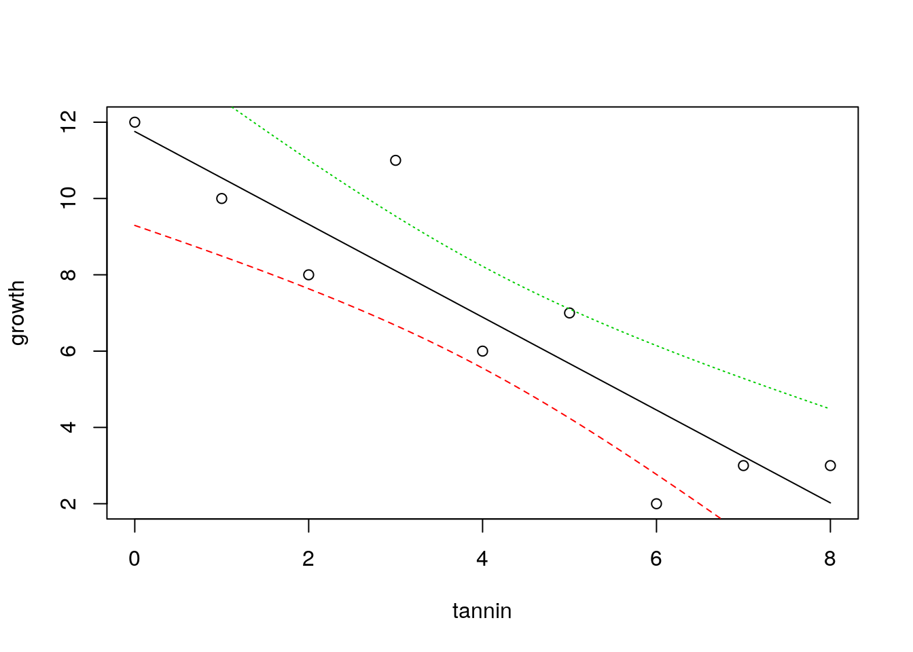

# Introduction to statistical modelling

In most cases the relationship between a traditional statistical test and the model is not explicit, although one way anova is based on an underlying statistical model. Statistical modelling can allow you to extract more information from your data. Most contemporary papers in ecology use models of some kind. Even if the nature of the data you collect limits your options, it is very important to learn to fit and interpret statistical models in order to follow the literature.


## What is a statistical model? 

To some extent statistical modelling is easier than other forms of ecological modelling. Building process based models requires a great deal of understanding of a system. Statistical models are built from the data themselves. Providing you do have some data to work with you can let the combination of data and prebuilt algorithms find a model. However there are many issues that make statistical modelling challenging.

A statistical model is a formal mathematical representation of the "sample space"", in other words the population from which measurements could have been drawn. It has two components.

*  An underlying ``deterministic'' component, that usually represents a process of interest

*  A stochastic component representing "unexplained" variability
So, a statistical model effectively partitions variability into two parts. One part represents some form of potentially interesting relationship between variables. The other part is just "random noise". Because statistics is all about variability, the "noise" component is actually very important. Variability must be looked at in some detail on order to decide on the right model. Many of the challenges involved in choosing between statistical models involves finding a way to explain the "unexplained" variability.


### Uses of models

The literature on statistical modelling frequently uses the terms
"explanation"" and "prediction"" to describe the way models are used. Although the same model can have both roles, it is worth thinking about the difference between them before fitting and interpreting any models.


#### Prediction

Models can be used to predict the values for some variable when we
are given information regarding some other variable upon which it
depends. An example is a calibration curve used in chemistry. We know that conductivity and salinity are directly related. So if we measure the conductivity of liquids with known salinities we can fit a line. We can then use the resulting model to predict salinity at any point between the two extremes that we used when finding the calibration curve. Notice that we cannot easily extrapolate beyond the range of data we have. We will see how the same concept applies to the models we use in quantiative ecology.


#### Explanation

The idea that the variability in the data can be "explained" by
some variable comes from the terminology that was used when interpretating experimental data. Experiments usually involve a manipulation and a control of some description. If values for some response differ between control and intervention then it is reasonable to assume that the difference is "explained" by the intervention. If you wish to obtain data that are simple to analyse and interpret you should always design an experiment. However, experiments can be costly. Ecological systems are often slow to respond to interventions, making experiments impossible within the time scale of a master's dissertation. We are often interested in systems that cannot be easily modified anyway on ethical or practical grounds. Thus in ecology we often have to
interpret associations between variables as evidence of process that "explain" a relationship. Correlation is not causation. Although patterns of association can provide insight into causality they are not enough to establish it. So, when you read the words "variance explained" look carefully at the sort of data that are being analysed. In an ecological setting this may only suggest close association between variables, not a true explanation in the everyday sense of the word.

## The general linear model

General linear models lie behind a large number of techniques. These have different names depending on the type of data used to explain or predict the variability in a numerical response variable.

*  Regression (Numerical variable)
*  Analysis of variance (One or more categorical variables)
*  Analysis of covariance (Categorical variable plus numerical variable)
*  Multiple regression (Multiple numerical variables)

Although these analyses are given different names and they appear in different parts of the menu in a program such as SPSS, they are all based on a similar mathematical approach to model fitting. In
R the same model syntax is used in all cases. The steps needed to build any linear model are...

*  Look at the data carefully without fitting any model. Try different ways of plotting the data. Look for patterns in the data that suggest that they are suitable for modelling. 
*  Fit a model: The standard R syntax for a simple linear regression
model is
**mod<-lm(y~x)**
However model formulae may be much more complex.
*  Look at whether the terms that have been entered in the model are significant: The simplest R syntax is \emph{anova(mod). }Again, this part of the process can be become much more involved in the case of models with many terms.
*  Summarise the model in order to understand the structure of the model. This can be achieved with*  **summary(mod)**
*  Run diagnostics to check that assumptions are adequately met. This involves a range of techniques including statistical tests and graphical diagnoses. This step is extremely important and must be addressed carefully in order to ensure that the results of the exercise are reliable.


## Regression


### Theory

The regression equation is ..

$y=a+bx+\epsilon$ where $\epsilon=N(o,\sigma^{2})$

In other words it is a straight line with a as the intercept, b as the slope, with the assumption of normally distributed errors (variability around the line)

The diagram below taken from Zuur et al (2007) illustrates the basic idea. In theory, if we had an infinite number of observations around each point in a fitted model, the variability would form a perfect normal distribution. The shape and width of the normal curves would be constant along the length of the model. These normal curves form the stochastic part of the model. The strait line is the deterministic part. This represents the relationship we are usually most interested in. The line is defines by its intercept with the axis and its slope.

```r

```


For any observed value of y there will be a fitted value (or predicted value) that falls along the line. The difference between the fitted value and the observed value is known as the residual.


```r

```


In reality we do not have infinite observed values at each point.
However if we collected all the residuals together we should get a
normal distribution.


### Example

The example is taken from Crawley's R book. It is very simplified
and idealised, but serves to explain the concepts. Crawley's own ecological research involves herbivory. Here he presents an example in which the growth of insect larvae on leaves with different concentrations of tannin has been measured. Tannin concentrations slow insect growth (Crawley unfortunately does not provide the units in which this is measured). The question is, how much is growth inhibited by an increase of 1\% in tannin concentration? The first step after loading the data is to produce a scatterplot.


```r
larvae<-read.csv("/home/aqm/data/Examples/larvae.csv")
names(larvae)
```

```
## [1] "growth" "tannin"
```

```r
attach(larvae)
plot(growth~tannin)
```


The scatterplot is produced using the syntax that we will use in the model. Growth is a function of (~) tannin.

We now fit a model and assign the results to an object in R. We can call this "mod". This contains all the information about the fitted
model.


```r
mod<-lm(growth~tannin)
```


We can now look at the properties of the model. If we ask for an "anova". R will produce the following output.


```r
anova(mod)
```

```
## Analysis of Variance Table
## 
## Response: growth
##           Df Sum Sq Mean Sq F value    Pr(>F)    
## tannin     1 88.817  88.817  30.974 0.0008461 ***
## Residuals  7 20.072   2.867                      
## ---
## Signif. codes:  0 '***' 0.001 '**' 0.01 '*' 0.05 '.' 0.1 ' ' 1
```

This is similar to the table produced for an ANOVA involving categegorical variables (factors). It can be interpreted in a similar way. Just as for an ANOVA we have an F ratio that represents the amount of variability that falls along the regression line divided by the residual variation.

The numerator degrees of freedom for a simple regression is always one. The numerator degrees of freedom is n-2 as we have estimated two parameters, the slope and the intercept. Thus we have found a very significant effect of tannin concentration on growth F(1, 7) =31, p <0.001. You should report the R² values along with the p-value.

A correlation test would have shown the same significant relationship, but without as much detail.


```r
cor.test(growth,tannin)
```

```
## 
## 	Pearson's product-moment correlation
## 
## data:  growth and tannin
## t = -5.5654, df = 7, p-value = 0.0008461
## alternative hypothesis: true correlation is not equal to 0
## 95 percent confidence interval:
##  -0.9796643 -0.5972422
## sample estimates:
##        cor 
## -0.9031408
```

The additional information that we have with a regression concerns the two elements in the regression equation. The slope and the intercept.


```r
summary(mod)
```

```
## 
## Call:
## lm(formula = growth ~ tannin)
## 
## Residuals:
##     Min      1Q  Median      3Q     Max 
## -2.4556 -0.8889 -0.2389  0.9778  2.8944 
## 
## Coefficients:
##             Estimate Std. Error t value Pr(>|t|)    
## (Intercept)  11.7556     1.0408  11.295 9.54e-06 ***
## tannin       -1.2167     0.2186  -5.565 0.000846 ***
## ---
## Signif. codes:  0 '***' 0.001 '**' 0.01 '*' 0.05 '.' 0.1 ' ' 1
## 
## Residual standard error: 1.693 on 7 degrees of freedom
## Multiple R-squared:  0.8157,	Adjusted R-squared:  0.7893 
## F-statistic: 30.97 on 1 and 7 DF,  p-value: 0.0008461
```

Remember the equation we used.

$y=a+bx+\epsilon$ 

The intercept (a) is 11.76

The slope (b) is -1.22

Which means that growth (whatever this was measured in by Crawley) is reduced by 1.22 for each increase of 1\% in tannin concentration.


### Confidence intervals

There is an issue with this way of summarising the results. If we only report the coefficients as given we have ignored the fact that there was unexplained variation in the model. This variation produces uncertainty regarding the true values of the parameters. The greater the unexplained variation (scatter or noise) around the line, the less confident we can be regarding their values. The statistical mechanism used in the calculations (that is not particularly complex, but can safely be taken on trust) allows us find confidence intervals for the parameters. If the confidence intervals do not include zero then the parameters are significant. There are only a few cases where this is very meaningful for the intercept. We are usually more interested in the slope.


```r
confint(mod)
```

```
##                 2.5 %     97.5 %
## (Intercept)  9.294457 14.2166544
## tannin      -1.733601 -0.6997325
```

So now we can go a bit further. Instead of giving a point estimate for the effect of tannin on growth we can state that the 95\% confidence interval for the effect of a 1\% increase of tannin on growth lies between -1.73 and -0.7


### Prediction

The equation can be used to predict the most likely value of y given a value of x. If we just ask R to "predict" we get the fitted values for the values of the explanatory variable that we used when fitting the model.


```r
predict(mod)
```

```
##         1         2         3         4         5         6         7         8 
## 11.755556 10.538889  9.322222  8.105556  6.888889  5.672222  4.455556  3.238889 
##         9 
##  2.022222
```


So we can plot out the data again and show the predicted values as red points and draw the regression line.


```r
plot(growth~tannin)
points(tannin,predict(mod),pch=21,bg=2)
lines(tannin,predict(mod))
```


#### Prediction with confidence intervals

As we have seen, a statistical model takes into account uncertainty that arises as a result of variability in the data. So we should not simple look at the line of best fit as summing up a regression. We should add some indication of our confidence in the result to the figure.

To achieve this nicely in R requires a couple of extra steps. After plotting the data with plot(growth~tannin) we set up a sequence of 100 x values that lie between the minimum and the maximum. Now if we pass these to the predict function in R and ask for confidence intervals (that by default are 95\%) we get the figure below.


```r
plot(growth~tannin)
x<-seq(min(tannin),max(tannin),length=100) 
matlines(x,predict(mod,list(tannin=x),interval="confidence"))
```




The confidence bands refer to the fitted model. They show uncertainty regarding the regression line and are calculated from the standard error.


## Using ggplot2 for confidence intervals.


```r
library(ggplot2)
g0<-ggplot(data=larvae, aes(x=tannin,y=growth))
g1<-g0+geom_point()
g1+geom_smooth(method="lm")
```


### Prediction intervals

There is another way to look at uncertainty. If we know the value for tannin, where would we expect a single measured value for growth to lie. Notice that this is different. The confidence bands show where the mean value migh lie if we measured growth many times. But in this case we want to know where we might expect a data point to fall. This is a much broader interval, and is based on the idea of theoretical normal curves falling around the regression line with a standard deviation estimated from the data. We cut off the tails of these curves.


```r
plot(growth~tannin)
x<-seq(min(tannin),max(tannin),length=1000) 
matlines(x,predict(mod,list(tannin=x),interval="prediction"))
```


There is a demo to ilustrate this here. 

https://sarid.shinyapps.io/intervals_demo/
### Diagnostics

It is not enough to simply fit a regression line, or any other model. We have to justify our choice of model and convince those who might use it that the assumptions have been adequately met. The question of how close the data are to meeting the assumptions requires model diagnostics.

The basic assumptions for regression

*  Normally distributed errors
*  Identically distributed errors over the range (homogeneity of variance)
*  No undue influence of points with high leverage
*  An underlying linear relationship
*  Independent errors

In this rather artificial example all the assumptions are met. However real ecological data is rarely as simple as this. In order to justify the use of a regression model you must be able to show that the assumptions are not *seriously* violated. We will come on to what "seriously"" means later. 


#### Normality

It is important to remember that the assumption of normality applies to the residuals after a model has been fitted. You do *not* test the for normality of the variable itself, as the relationship that you are modelling influences the distribution of the variable. You can look at the distribution of the residuals by plotting a histogram.


```r
hist(residuals(mod),col="grey")
```


This looks good enough. A slightly more sophisticated way of spotting deviations from normality is to use a qqplot.

If we ask R to plot a fitted model, we actually get a set of diagnostic plots. There are six of these. By default R will produce four of them. The qqplot is the second in the series. It is used as a visual check of the normality assumption. If the assumption is met the points should fall approximately along the predicted straight line.


```r
plot(mod,which=2)
```


Qqplots often have a sigmoid shape. This occurs when some of the extreme values fall further along the tail of the normal distribution than expected. Providing this effect is slight it is not a problem. However deviations from the line away from the extremes does show a major departure from the assumption. Interpretation of QQplots requires some experience, but they can be very useful. 

If you have doubts about your ability to interpret the plot you could try using a statistical test of normality.


```r
shapiro.test(residuals(mod))
```

```
## 
## 	Shapiro-Wilk normality test
## 
## data:  residuals(mod)
## W = 0.98794, p-value = 0.9926
```

The problem with this test is that it becomes more sensitive as the number of observations increase. Thus you are more likely to get a p-value below 0.05 if you have a lot of data. However violations of normality become much less serious as the number of observations increase. So it can be safe to ignore a significant test result if the QQplot and histogram do not suggest major problems providing you have more than around 30 observations. If the histogram shows clear skew then you should think about a data transform, weighted regression or using a generalised linear model. More about this later.


#### Homogeneity of variance

The assumption here is that the distance a point is likely to fall from the fitted line does not change along the x values. This is very often violated. For example if the values represent counts of individuals it is constrained to not fall below zero and will tend to be some function of the expected value. This results in residuals that follow a poisson distribution or more likely, a negative binomial. The characteristic of both these distributions is that the scatter increases as the expected value increases. 

The following lines produce some data with this characteristic in order to illustrate the pattern.


```r
set.seed(5)
```


```r
library(MASS)
x<-sample(0:10,20,rep=T)
y<-rnegbin(20,mu=x,theta=2)
plot(y~x)
```


```r
mod.negbin<-lm(y~x)
```


You should be able to spot a "fan" effect.

The third diagnostic plot in the series is used to see this effect more clearly. This plot shows the square root of the standardised residuals plotted against the fitted values. Because the square root is used all the values are positive. If there is an increasing (or decreasing) trend in the absolute size of the residuals it should show up on the plot.


```r
plot(mod.negbin,which=3)
```


The red line is meant to guide the eye, but you should look carefully at the pattern rather than the line itself.

This is the pattern for the original model, that does not have a problem with heterogeneity of variance.


```r
plot(mod,which=3,main="Growth model")
```


If you are having difficulty interpreting the results you could try a test for the significance of the trend using a correlation test between the variables shown on the diagonistic plot.


```r
cor.test(sqrt(stdres(mod.negbin)),predict(mod.negbin))
```

```
## Warning in sqrt(stdres(mod.negbin)): NaNs produced
```

```
## 
## 	Pearson's product-moment correlation
## 
## data:  sqrt(stdres(mod.negbin)) and predict(mod.negbin)
## t = 4.8093, df = 7, p-value = 0.001945
## alternative hypothesis: true correlation is not equal to 0
## 95 percent confidence interval:
##  0.5071470 0.9737071
## sample estimates:
##       cor 
## 0.8761687
```

```r
cor.test(sqrt(stdres(mod)),predict(mod))
```

```
## Warning in sqrt(stdres(mod)): NaNs produced
```

```
## 
## 	Pearson's product-moment correlation
## 
## data:  sqrt(stdres(mod)) and predict(mod)
## t = -0.50019, df = 2, p-value = 0.6666
## alternative hypothesis: true correlation is not equal to 0
## 95 percent confidence interval:
##  -0.9803574  0.9236405
## sample estimates:
##        cor 
## -0.3334484
```

The same sort of caveats apply to the literal interpretation of this test as a decision rule as the normality test. Although most violations of homogeneity of variance have to be taken seriously, large data sets may show statistically significant, but inconsequential violations.


#### Leverage

In the artificial example provided by Crawley all the points are equally spaced along the x axis. This is the "classic" form for a regression and prevents problems with leverage. However in ecology we often have to analyse data that does not have this property. Some of the x values on a scatterplot may fall a long way from the centre of the distribution. Such points potentially could have an excessive influence on the form of the fitted model.

The influence a point has on the regression is a function of leverage and distance from a line fitted using all the other points.


```r
knitr::include_graphics("figs/leverage.png")
```


To illustrate this let's add a point to the data at a high tannin density and assume that zero growth was measured at this value. How much does this new point influence the model?


```r
tannin<-c(tannin,15)
growth<-c(growth,0)
```

We can plot the new data and show the effect of this one point on the regression line. It is shown in red.


```r
new.mod<-lm(growth~tannin)
plot(growth~tannin)
lines(tannin,predict(mod,list(tannin)))
lines(tannin,predict(new.mod,list(tannin)),col=2)
```


This data point has shifted the regression quite a lot due to a combination of its distance from the others (which gives it high leverage) and the fact that it lies a long way from the fitted line (high residual deviation). These two effects are captured by a quantity known as Cook's distance. 

The diagnostic plot shows leverage on the x axis and standardised residuals on the y axis. Large residuals with low leverage do not affect the model, so the safe area with low values for Cook's distance (below 1) forms a funnel shape. Points falling outside this "safe area" can be flagged up.

There are no problem points in the original model.


```r
plot(mod,which=5)
```


However the point that we added with both a high leverage and a high deviation from the original model shows up clearly when we diagnose the model with this point included.


```r
plot(new.mod,which=5)
```


Another way of spotting this influential points is by looking at Cook's distance directly. Values over 1 are typically considered to be extreme.


```r
plot(new.mod,which=4)
```


### Lack of independence

The value and sign of the residual deviation should not be related in any way to that of the previous point. If residual values form "clusters" on one side of the line or another it is a sign of lack of independence. There are two causes of this. The most serious is intrinsic temporal or spatial autocorrelation. This is discussed in the next section. A less serious matter is that the shape of the model is not appropriate for the data. We can see this in the last example. While the strait line might have been OK for the range of data originally given by Crawley, a straight line is a poor model when an additional data point is added at a high tannin level. At some point tannin stops all growth, so the underlying model must be asymptotic. Thus the model with the extra point has correlation in the raw residuals. High tannin values have positive residual deviation as a result of the poor fit of the model. This can be seen by using the first diagnostic plot that R produces.


```r
plot(new.mod, which=1)
```


A common way of testing for lack of independence is the Durbin Watson test for serial autocorrelation.


```r
library(lmtest)
```

```
## Loading required package: zoo
```

```
## 
## Attaching package: 'zoo'
```

```
## The following objects are masked from 'package:base':
## 
##     as.Date, as.Date.numeric
```

```r
dwtest(growth~tannin)
```

```
## 
## 	Durbin-Watson test
## 
## data:  growth ~ tannin
## DW = 2.0168, p-value = 0.3679
## alternative hypothesis: true autocorrelation is greater than 0
```


#### Putting it all together

If you just ask R to plot a model you get all four plots. With some practice these should help you spot problems that need attention. Notice that to get four plots on one page you use **par(mfcol=c(2,2))**.


```r
par(mfcol=c(2,2))
plot(mod)
```


### Violations of assumptions

What do you do if your diagnostic analysis shows that there is a problem with the model? The first thing to realise is that all models are approximations of reality. As the statistician G.E. Box famously stated "All models are wrong ... but some are useful." If journal editors and referees only admitted papers which used the "correct" model ecological publishing would stop in its tracks. The important point to be aware of is that not all violations of the assumptions are equally serious. Almost all of them can be handled by more advanced modelling, but sometimes it is simply enough to point out that a minor violation was noticed, but it was not considered serious enough to prevent further analysis, together with a clearly stated justification.

*Normality of the residuals:* This is considered to be the least important assumption of the model. Slight deviations from normality will not usually affect the conclusions drawn. Furthermore some influential authors, eg Sokal and Rolf, state that the central limit theorem means that the assumption can safely be ignored for large (n>30) samples. However, be careful with this, as the assumption is that the residuals are non-normal, but homogeneous. This is unlikely to occcur.

*Fixed values of the independent variable*: This assumption is in fact nearly always violated in ecological studies. We never measure anything without error. The main point to be aware of is that it is error relative to the range that causes an issue. So, if we measure a variable such as tree height with an accuracy of 10cm and the range of values falls between 5m and 20m there is no problem. However if the range of heights were to be only between 10m and 11m an issue may arise. You should always aim to have a large range of values for the explanatory variable with respect to measurement errors.

*Homogeneity of variance*: Violations of this assumption can be quite serious. However you should be aware that fixing the problem using techniques such as weighted regression will not affect the slope of the regression line. It will affect the p-values (making them larger) and confidence intervals (making them wider). If the p-value from the uncorrected model is very small (p<0.001) then a correction for heterogeneity of variance is unlikely to result in a loss of significance. If the p-value is close to the conventional cut off (p<0.05) then the correction will almost certainly change your conclusions. In some cases the apparent heterogenity is the result of outliers that need removal. Doing this will of course change the slope.

*Incorrect model form:* A regression is a straight line. In many ecological situations the true responses take the form of a curve of some kind. Asymptotes are very commonly predicted both from theory and "common sense". For example, adding more nitrogen fertilizer beyond a certain point will not produce any more growth. The biggest problem for regression in these circumstances is not that the model does not fit. It may approximate quite well to one part of the curve. The issue is that the functional form is misleading and does not represent the underlying process.

*Influential outliers:* We have seen that an outlier does not
necessarily influence the regression unless it also has high leverage. You have to think carefully before simply removing these points. If points at the extreme ends of the x axis have high residual values it may be that the model is badly formed. We have seen the potential for this in the example above. In this case you may want to restrict a linear regression to the linear part of the relationship and remove data at the ends. Flexible models such as GAMs which we will see later can deal with the issue. You may also use a data transformation to pull the extreme values in. It may well turn out that the issue simply is due to mistaken measurements, in which case the extreme values are rejected after checking. There are also other methods to formally handle the problem such as robust regression.

*Independence of the errors:* This is the big issue. Violations of this assumption are always serious. The main problem is that if observations are not independent the model is claiming many more degrees of freedom (replication) than is justified. This means that the model cannot be generalised. The issue affects many, if not all, ecological studies to some extent. Measurements are rarely truly independent from each other in space and time. The issue affects the interpetation of the p-value and confidence intervals of the model. While the model may still be suitable for prediction within its sample space it will not generalise beyond it. In the next class we will look at an example in detail that may help to clarify this.


## Exercises

1. Climate data

When analysing time series it can be very important to take into account
serial autocorrelation. However if serial autocorrelation is not particularly
strong simple regression analysis can provide reliable insight regarding
trends.

The following data are taken from the UK Meterological office. They
represent total precipitation and mean monthly temperatures averaged
over climate stations in England. Is there any evidence of trends? 


```r
Temp<-read.csv("https://tinyurl.com/aqm-data/Temp.csv")
Prec<-read.csv("https://tinyurl.com/aqm-data/Prec.csv")
```

## Some "data wrangling"

There are now many different ways in R to reshape data frames into consistent formats. The new "tidyr" and dplyr are becoming increasingly popular. A simple way of stacking many columns into two (variable and value) is provided by the reshape package. The melt function takes the original data frame and arguments defining "id" variables and "measurement" variables.


```r
library(reshape2)
Temp2<-melt(Temp[,3:15],id="Year")
str(Temp2)
```

```
## 'data.frame':	1236 obs. of  3 variables:
##  $ Year    : int  1910 1911 1912 1913 1914 1915 1916 1917 1918 1919 ...
##  $ variable: Factor w/ 12 levels "JAN","FEB","MAR",..: 1 1 1 1 1 1 1 1 1 1 ...
##  $ value   : num  3.2 3.4 3.3 3.9 2.9 3.5 6.9 1.2 3.3 2.5 ...
```

```r
head(Temp2)
```

```
##   Year variable value
## 1 1910      JAN   3.2
## 2 1911      JAN   3.4
## 3 1912      JAN   3.3
## 4 1913      JAN   3.9
## 5 1914      JAN   2.9
## 6 1915      JAN   3.5
```

All the months can now be plotted on a single figure using ggplot2.


```r
g0<-ggplot(Temp2,aes(x=Year,y=value))
g0+geom_point()+geom_smooth(method="lm")+facet_wrap("variable")
```


## One way to run multiple analyses

Once the data are in long format it is fairly easy to loop through the factor levels and run a separate analysis for each month. Note that the value of the factor is used to subset the data. Then within the loop the same code is run multiple times. To include output in a knitted document you need to explicitly tell R to print the results.


```r
for(i in levels(Temp2$variable))
{
  d<-subset(Temp2,Temp2$variable==i)
  mod<-lm(data=d,value~Year)
  print(i)
  print(anova(mod))
  print(summary(mod))
}
```

```
## [1] "JAN"
## Analysis of Variance Table
## 
## Response: value
##            Df  Sum Sq Mean Sq F value Pr(>F)
## Year        1   4.071  4.0706  1.3876 0.2416
## Residuals 101 296.298  2.9336               
## 
## Call:
## lm(formula = value ~ Year, data = d)
## 
## Residuals:
##     Min      1Q  Median      3Q     Max 
## -5.9279 -0.8244  0.1514  1.2828  3.5863 
## 
## Coefficients:
##              Estimate Std. Error t value Pr(>|t|)
## (Intercept) -9.497250  11.132331  -0.853    0.396
## Year         0.006686   0.005676   1.178    0.242
## 
## Residual standard error: 1.713 on 101 degrees of freedom
## Multiple R-squared:  0.01355,	Adjusted R-squared:  0.003785 
## F-statistic: 1.388 on 1 and 101 DF,  p-value: 0.2416
## 
## [1] "FEB"
## Analysis of Variance Table
## 
## Response: value
##            Df Sum Sq Mean Sq F value Pr(>F)
## Year        1   2.62  2.6165  0.7436 0.3906
## Residuals 101 355.40  3.5188               
## 
## Call:
## lm(formula = value ~ Year, data = d)
## 
## Residuals:
##     Min      1Q  Median      3Q     Max 
## -5.7250 -0.9115  0.1946  1.3608  3.1445 
## 
## Coefficients:
##              Estimate Std. Error t value Pr(>|t|)
## (Intercept) -6.712280  12.192223  -0.551    0.583
## Year         0.005361   0.006217   0.862    0.391
## 
## Residual standard error: 1.876 on 101 degrees of freedom
## Multiple R-squared:  0.007308,	Adjusted R-squared:  -0.00252 
## F-statistic: 0.7436 on 1 and 101 DF,  p-value: 0.3906
## 
## [1] "MAR"
## Analysis of Variance Table
## 
## Response: value
##            Df  Sum Sq Mean Sq F value   Pr(>F)   
## Year        1  15.482  15.482   7.964 0.005747 **
## Residuals 101 196.345   1.944                    
## ---
## Signif. codes:  0 '***' 0.001 '**' 0.01 '*' 0.05 '.' 0.1 ' ' 1
## 
## Call:
## lm(formula = value ~ Year, data = d)
## 
## Residuals:
##     Min      1Q  Median      3Q     Max 
## -3.3082 -0.9820  0.1701  0.9679  3.4048 
## 
## Coefficients:
##               Estimate Std. Error t value Pr(>|t|)   
## (Intercept) -19.975905   9.062175  -2.204  0.02977 * 
## Year          0.013040   0.004621   2.822  0.00575 **
## ---
## Signif. codes:  0 '***' 0.001 '**' 0.01 '*' 0.05 '.' 0.1 ' ' 1
## 
## Residual standard error: 1.394 on 101 degrees of freedom
## Multiple R-squared:  0.07309,	Adjusted R-squared:  0.06391 
## F-statistic: 7.964 on 1 and 101 DF,  p-value: 0.005747
## 
## [1] "APR"
## Analysis of Variance Table
## 
## Response: value
##            Df  Sum Sq Mean Sq F value   Pr(>F)   
## Year        1  11.266 11.2657   9.023 0.003362 **
## Residuals 101 126.104  1.2486                    
## ---
## Signif. codes:  0 '***' 0.001 '**' 0.01 '*' 0.05 '.' 0.1 ' ' 1
## 
## Call:
## lm(formula = value ~ Year, data = d)
## 
## Residuals:
##     Min      1Q  Median      3Q     Max 
## -2.5791 -0.6621 -0.0448  0.6434  3.2429 
## 
## Coefficients:
##               Estimate Std. Error t value Pr(>|t|)   
## (Intercept) -14.011848   7.262512  -1.929  0.05650 . 
## Year          0.011123   0.003703   3.004  0.00336 **
## ---
## Signif. codes:  0 '***' 0.001 '**' 0.01 '*' 0.05 '.' 0.1 ' ' 1
## 
## Residual standard error: 1.117 on 101 degrees of freedom
## Multiple R-squared:  0.08201,	Adjusted R-squared:  0.07292 
## F-statistic: 9.023 on 1 and 101 DF,  p-value: 0.003362
## 
## [1] "MAY"
## Analysis of Variance Table
## 
## Response: value
##            Df  Sum Sq Mean Sq F value Pr(>F)
## Year        1   1.797  1.7970  1.7804 0.1851
## Residuals 101 101.944  1.0093               
## 
## Call:
## lm(formula = value ~ Year, data = d)
## 
## Residuals:
##      Min       1Q   Median       3Q      Max 
## -2.42442 -0.62451 -0.02886  0.67880  1.89335 
## 
## Coefficients:
##             Estimate Std. Error t value Pr(>|t|)
## (Intercept) 2.257157   6.529832   0.346    0.730
## Year        0.004443   0.003329   1.334    0.185
## 
## Residual standard error: 1.005 on 101 degrees of freedom
## Multiple R-squared:  0.01732,	Adjusted R-squared:  0.007593 
## F-statistic:  1.78 on 1 and 101 DF,  p-value: 0.1851
## 
## [1] "JUN"
## Analysis of Variance Table
## 
## Response: value
##            Df Sum Sq Mean Sq F value  Pr(>F)  
## Year        1  3.466  3.4664  3.7702 0.05496 .
## Residuals 101 92.860  0.9194                  
## ---
## Signif. codes:  0 '***' 0.001 '**' 0.01 '*' 0.05 '.' 0.1 ' ' 1
## 
## Call:
## lm(formula = value ~ Year, data = d)
## 
## Residuals:
##      Min       1Q   Median       3Q      Max 
## -2.50768 -0.57619  0.01828  0.61019  2.46764 
## 
## Coefficients:
##             Estimate Std. Error t value Pr(>|t|)  
## (Intercept) 1.740239   6.232143   0.279    0.781  
## Year        0.006170   0.003178   1.942    0.055 .
## ---
## Signif. codes:  0 '***' 0.001 '**' 0.01 '*' 0.05 '.' 0.1 ' ' 1
## 
## Residual standard error: 0.9589 on 101 degrees of freedom
## Multiple R-squared:  0.03599,	Adjusted R-squared:  0.02644 
## F-statistic:  3.77 on 1 and 101 DF,  p-value: 0.05496
## 
## [1] "JUL"
## Analysis of Variance Table
## 
## Response: value
##            Df  Sum Sq Mean Sq F value  Pr(>F)  
## Year        1   8.144  8.1436  6.5637 0.01188 *
## Residuals 101 125.311  1.2407                  
## ---
## Signif. codes:  0 '***' 0.001 '**' 0.01 '*' 0.05 '.' 0.1 ' ' 1
## 
## Call:
## lm(formula = value ~ Year, data = d)
## 
## Residuals:
##      Min       1Q   Median       3Q      Max 
## -2.25628 -0.83798 -0.07239  0.64977  3.15598 
## 
## Coefficients:
##              Estimate Std. Error t value Pr(>|t|)  
## (Intercept) -2.827188   7.239644  -0.391   0.6970  
## Year         0.009457   0.003691   2.562   0.0119 *
## ---
## Signif. codes:  0 '***' 0.001 '**' 0.01 '*' 0.05 '.' 0.1 ' ' 1
## 
## Residual standard error: 1.114 on 101 degrees of freedom
## Multiple R-squared:  0.06102,	Adjusted R-squared:  0.05172 
## F-statistic: 6.564 on 1 and 101 DF,  p-value: 0.01188
## 
## [1] "AUG"
## Analysis of Variance Table
## 
## Response: value
##            Df  Sum Sq Mean Sq F value   Pr(>F)   
## Year        1  11.613 11.6132  9.2353 0.003023 **
## Residuals 101 127.005  1.2575                    
## ---
## Signif. codes:  0 '***' 0.001 '**' 0.01 '*' 0.05 '.' 0.1 ' ' 1
## 
## Call:
## lm(formula = value ~ Year, data = d)
## 
## Residuals:
##      Min       1Q   Median       3Q      Max 
## -2.56001 -0.78660 -0.03558  0.62243  2.98701 
## 
## Coefficients:
##              Estimate Std. Error t value Pr(>|t|)   
## (Intercept) -6.568975   7.288419  -0.901  0.36958   
## Year         0.011294   0.003716   3.039  0.00302 **
## ---
## Signif. codes:  0 '***' 0.001 '**' 0.01 '*' 0.05 '.' 0.1 ' ' 1
## 
## Residual standard error: 1.121 on 101 degrees of freedom
## Multiple R-squared:  0.08378,	Adjusted R-squared:  0.07471 
## F-statistic: 9.235 on 1 and 101 DF,  p-value: 0.003023
## 
## [1] "SEP"
## Analysis of Variance Table
## 
## Response: value
##            Df Sum Sq Mean Sq F value   Pr(>F)   
## Year        1   9.92  9.9203  9.6765 0.002426 **
## Residuals 101 103.54  1.0252                    
## ---
## Signif. codes:  0 '***' 0.001 '**' 0.01 '*' 0.05 '.' 0.1 ' ' 1
## 
## Call:
## lm(formula = value ~ Year, data = d)
## 
## Residuals:
##     Min      1Q  Median      3Q     Max 
## -2.5740 -0.6080  0.1034  0.6420  2.7573 
## 
## Coefficients:
##              Estimate Std. Error t value Pr(>|t|)   
## (Intercept) -7.100940   6.580889  -1.079  0.28315   
## Year         0.010438   0.003355   3.111  0.00243 **
## ---
## Signif. codes:  0 '***' 0.001 '**' 0.01 '*' 0.05 '.' 0.1 ' ' 1
## 
## Residual standard error: 1.013 on 101 degrees of freedom
## Multiple R-squared:  0.08743,	Adjusted R-squared:  0.0784 
## F-statistic: 9.677 on 1 and 101 DF,  p-value: 0.002426
## 
## [1] "OCT"
## Analysis of Variance Table
## 
## Response: value
##            Df  Sum Sq Mean Sq F value    Pr(>F)    
## Year        1  16.922 16.9225   11.95 0.0008011 ***
## Residuals 101 143.030  1.4161                      
## ---
## Signif. codes:  0 '***' 0.001 '**' 0.01 '*' 0.05 '.' 0.1 ' ' 1
## 
## Call:
## lm(formula = value ~ Year, data = d)
## 
## Residuals:
##      Min       1Q   Median       3Q      Max 
## -3.05175 -0.65856  0.02091  0.60267  3.11619 
## 
## Coefficients:
##               Estimate Std. Error t value Pr(>|t|)    
## (Intercept) -16.704930   7.734564  -2.160 0.033156 *  
## Year          0.013633   0.003944   3.457 0.000801 ***
## ---
## Signif. codes:  0 '***' 0.001 '**' 0.01 '*' 0.05 '.' 0.1 ' ' 1
## 
## Residual standard error: 1.19 on 101 degrees of freedom
## Multiple R-squared:  0.1058,	Adjusted R-squared:  0.09694 
## F-statistic: 11.95 on 1 and 101 DF,  p-value: 0.0008011
## 
## [1] "NOV"
## Analysis of Variance Table
## 
## Response: value
##            Df  Sum Sq Mean Sq F value    Pr(>F)    
## Year        1  22.704 22.7043  15.115 0.0001812 ***
## Residuals 101 151.714  1.5021                      
## ---
## Signif. codes:  0 '***' 0.001 '**' 0.01 '*' 0.05 '.' 0.1 ' ' 1
## 
## Call:
## lm(formula = value ~ Year, data = d)
## 
## Residuals:
##      Min       1Q   Median       3Q      Max 
## -2.96830 -0.60514  0.06336  0.76071  2.77387 
## 
## Coefficients:
##               Estimate Std. Error t value Pr(>|t|)    
## (Intercept) -24.676785   7.965901  -3.098 0.002525 ** 
## Year          0.015791   0.004062   3.888 0.000181 ***
## ---
## Signif. codes:  0 '***' 0.001 '**' 0.01 '*' 0.05 '.' 0.1 ' ' 1
## 
## Residual standard error: 1.226 on 101 degrees of freedom
## Multiple R-squared:  0.1302,	Adjusted R-squared:  0.1216 
## F-statistic: 15.11 on 1 and 101 DF,  p-value: 0.0001812
## 
## [1] "DEC"
## Analysis of Variance Table
## 
## Response: value
##            Df Sum Sq Mean Sq F value Pr(>F)
## Year        1   0.02 0.01993  0.0084  0.927
## Residuals 101 238.63 2.36263               
## 
## Call:
## lm(formula = value ~ Year, data = d)
## 
## Residuals:
##     Min      1Q  Median      3Q     Max 
## -4.7346 -0.9670  0.3108  0.9989  3.2010 
## 
## Coefficients:
##              Estimate Std. Error t value Pr(>|t|)
## (Intercept) 3.3941682  9.9903576   0.340    0.735
## Year        0.0004679  0.0050939   0.092    0.927
## 
## Residual standard error: 1.537 on 101 degrees of freedom
## Multiple R-squared:  8.352e-05,	Adjusted R-squared:  -0.009817 
## F-statistic: 0.008436 on 1 and 101 DF,  p-value: 0.927
```

This is "quick and dirty" as no diagnostics have been run for each regresson. In order to fully justify any interesting results you would need to do more work than this. In reality a correct analysis of time series data should include an investigation of serial autocorrelation, amongst other elements. We'll be looking at this later in the course.

2.. Recall that in the primer we looked at the relationship between
measurements on mussel shell length and body tissue volume in ml.
Load the data and analyse them using linear regression.


```r
mussels<-Prec<-read.csv("https://tinyurl.com/aqm-data/mussels.csv")
attach(mussels)
```


