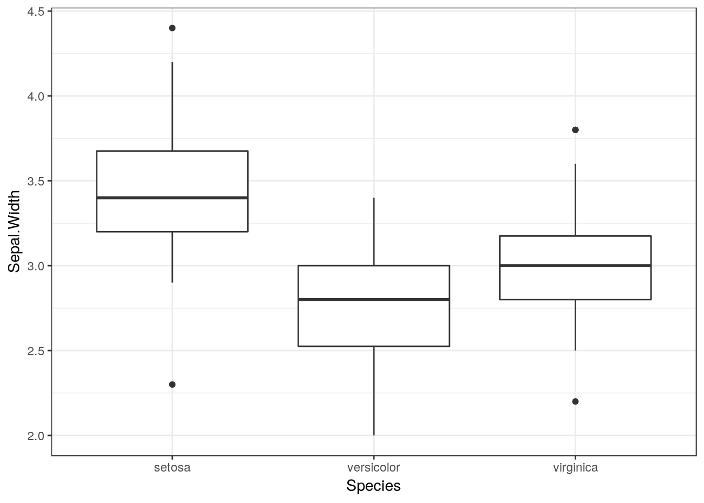
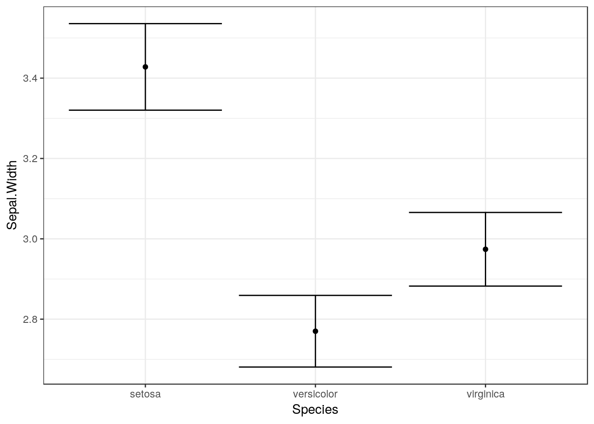
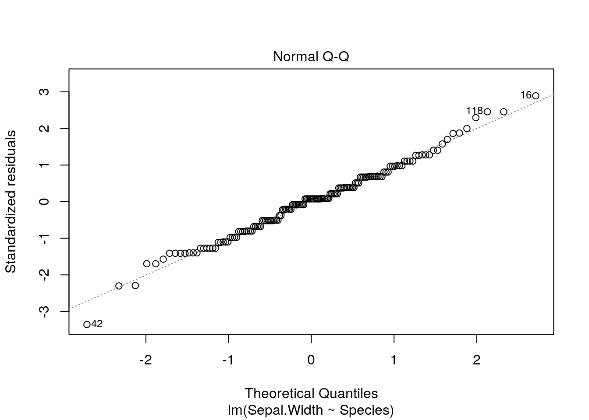

```r
library(ggplot2)
theme_set(theme_bw())
library(multcomp)
```
# Some theory on the general linear model


Mathematically the equation for a one way anova is equivalent to this too. If you think about a situation in which instead of a single value for x being multipled by a single coefficient we have a matrix of values representing which level of a factor is being taken into account when calculating a value of y we have an equation with a parameter for each factor level.


## Calculating the sum of squares

In both cases the formula that is dropped in to the call to fit a linear model in R is similar. The difference is that one way ANOVA uses a factor to predict fitted values and calculate residuals whereas regression uses a numerical variable.

In order to demonstrate the fundamental similarity between the two
models we will set up some simulated data and then calculate the sum of squares from first principles.


#### ANOVA

Let's make up a predictor variable. This is a factor with three levels, call them A, B and C. Now, let's assume that the fitted values (in other words the deterministic pattern of response to the three levels of this factor) are mean values of 10, 15 and 20. These are the expected responses if there were no variability apart from that between groups.


```r
set.seed(1)
predictor<-as.factor(rep(c("A","B","C"),each=10))
fitted<-rep(c(10,12,20),each=10)
```


Of course, there is going to be variability within each group. So let's add this in. We will assume that the variability can be modelled as a normal distribution with mean zero and standard deviation of 5.

So the results we actually get are derived by adding these two components together.


```r
residuals<-rnorm(30,mean=0,sd=5)
results<-fitted+residuals
d<-data.frame(predictor,results)
boxplot(results~predictor,data=d)
```


Of course, because this was a simulation experiment the actual means will be slightly different to the invested values. We can set up a data frame with true fitted and residual values like this. 


```r
mod<-lm(results~predictor,data=d)
d<-data.frame(predictor,results,fitted=fitted(mod),residuals=residuals(mod))
head(d)
```

```
##   predictor   results   fitted  residuals
## 1         A  6.867731 10.66101 -3.7932830
## 2         A 10.918217 10.66101  0.2572027
## 3         A  5.821857 10.66101 -4.8391570
## 4         A 17.976404 10.66101  7.3153901
## 5         A 11.647539 10.66101  0.9865250
## 6         A  5.897658 10.66101 -4.7633558
```


#### The numerator sum of squares

OK, so where do the numbers in the Anova table come from? The first step is to understand that the numerator sum of squares represents all the deterministic variability in the system. This is the variability attributable to differences between groups. The sum of squares is the sum of the squared deviations around the mean. But, which mean? In this case it is the overall mean value for the respnse.

So, look at the boxplot again, but this time remove the variability and just plot the means. We can show the difference for each mean from the grand mean using arrows.


```r
boxplot(fitted~predictor,data=d)
abline(h=mean(results),lwd=3,col=2)
arrows(1,10.66,1,mean(results),code=3)
arrows(2,13.24,2,mean(results),code=3)
arrows(3,19.33,3,mean(results),code=3)
```


OK, so for each mean there are 10 fitted values. The sum of squares is simply


```r
nsqrs<-(d$fitted-mean(results))^2
nsumsqrs<-sum(nsqrs)
```


#### Denominator sum of squares

The denominator sum of squares in an Anova table represents all the variability that can be attributed to the stochastic component of the model. In other words, the residual variablity. We produced that when simulating the data. The values are simply the residuals once the means for each group have been subtracted.


```r
g0<-ggplot(d,aes(x=predictor,y=results))
g0+geom_point(pch=21,bg=2)+stat_summary(fun.y=mean,geom="point",size=4)
```


So each residual is the distance between the red points and the large black point representing the mean for that group.


```r
dsqrs<-d$residuals^2
dsumsqrs<-sum(dsqrs)
```


```r
mod<-lm(results~predictor)
anova(mod)
```

```
## Analysis of Variance Table
## 
## Response: results
##           Df Sum Sq Mean Sq F value   Pr(>F)   
## predictor  2 396.36  198.18  8.9192 0.001062 **
## Residuals 27 599.93   22.22                    
## ---
## Signif. codes:  0 '***' 0.001 '**' 0.01 '*' 0.05 '.' 0.1 ' ' 1
```

```r
nsumsqrs
```

```
## [1] 396.3639
```

```r
dsumsqrs
```

```
## [1] 599.9315
```

The degrees of freedom for the munerator sum of squares are the number of free parameters in the model. This is one less than the number of groups because we need to calculate the grand mean from the data, and thus use up degree of freedom. In order to calculate the residuals we need to calculate three means in this case, so the denominator degree of freedom is the total sample size minus three.


### Regression

The set up for regression is, in effect, identical, apart from the fact that the fitted values are continuous rather than group means. So if we invent some data 


```r
x<-11:40
y<-10+x*2+rnorm(30,0,10)
plot(y~x)
```


```r
mod<-lm(y~x)
d<-data.frame(x,y,fitted=fitted(mod),residuals=residuals(mod))
head(d)
```

```
##    x        y   fitted  residuals
## 1 11 45.58680 32.84861  12.738183
## 2 12 32.97212 34.88166  -1.909533
## 3 13 39.87672 36.91470   2.962016
## 4 14 37.46195 38.94774  -1.485794
## 5 15 26.22940 40.98079 -14.751383
## 6 16 37.85005 43.01383  -5.163776
```

```r
plot(y~x)
points(x,fitted(mod),pch=21,bg=2)
abline(h=mean(y),lwd=4,col=3)

arrows(x,fitted(mod),x,mean(y),code=3)
```


```r
nsqrs<-(d$fitted-mean(y))^2
nsumsqrs<-sum(nsqrs)
```

### Residuals


```r
plot(y~x)
points(x,fitted(mod),pch=21,bg=2)
arrows(x,fitted(mod),x,y,code=2)
```


```r
dsqrs<-d$residuals^2
dsumsqrs<-sum(dsqrs)
```


```r
mod<-lm(y~x)
anova(mod)
```

```
## Analysis of Variance Table
## 
## Response: y
##           Df Sum Sq Mean Sq F value    Pr(>F)    
## x          1 9289.5  9289.5  141.99 1.759e-12 ***
## Residuals 28 1831.9    65.4                      
## ---
## Signif. codes:  0 '***' 0.001 '**' 0.01 '*' 0.05 '.' 0.1 ' ' 1
```

```r
nsumsqrs
```

```
## [1] 9289.517
```

```r
dsumsqrs
```

```
## [1] 1831.902
```

## Where does R squared (coefficient of determination) come from?

The "explained variability" in the data is often reported using R squared. High values suggest that a large proportion of the variability is "explained" by the model, whether the model is a regression or an ANOVA. Where does that fit in? Well the total sum of squares is the sum of all the squared distances that we have calculated.

If we divide the sum of squares attributable to the model by the total we get the proportion of the variability attributable to the model.


```r
totsumsqrs<-nsumsqrs+dsumsqrs
nsumsqrs/totsumsqrs
```

```
## [1] 0.8352817
```

We can see that this is the same as R provides by asking for a summary.


```r
summary(mod)
```

```
## 
## Call:
## lm(formula = y ~ x)
## 
## Residuals:
##     Min      1Q  Median      3Q     Max 
## -14.751  -5.120  -1.579   5.365  18.129 
## 
## Coefficients:
##             Estimate Std. Error t value Pr(>|t|)    
## (Intercept)  10.4851     4.5945   2.282   0.0303 *  
## x             2.0330     0.1706  11.916 1.76e-12 ***
## ---
## Signif. codes:  0 '***' 0.001 '**' 0.01 '*' 0.05 '.' 0.1 ' ' 1
## 
## Residual standard error: 8.089 on 28 degrees of freedom
## Multiple R-squared:  0.8353,	Adjusted R-squared:  0.8294 
## F-statistic:   142 on 1 and 28 DF,  p-value: 1.759e-12
```

## Model assumptions

Assumptions of any linear model are the same.

*  Normally distributed errors
*  Identically distributed errors over the range (homogeneity of variance)
*  Independent errors

In the case of regression we can also state that it is assumed that there is

*  No undue influence of points with high leverage (regression)
*  An underlying linear relationship (regression)


If these assumptions are not met then the p-values and R squared calculations based on the sums of squares may potentially be misleading. So testing assumptions critically is an important part of using and interpreting linear models. The best diagnostic tests involve looking carefully at the data rather than running an automated decision tool. Minor violations may be acceptable in some circumstances.

## Some practice using linear models

The best way to become comfortable fitting models in R is to fit them several times until the procedure becomes routine.

Let's look at some classic data on the morphological characteristics of iris flowers. This is a useful data set to get to know, as it is very frequently used in the R literature to illustrate a wide range on more advanced techniques, including machine learning.
We can load the data set into memory with the data command. For consistency I'll then call it d.


```r
data("iris")
d<-iris
DT:::datatable(d)
```

<!--html_preserve--><div id="htmlwidget-fd7e7b2cc17482353a98" style="width:100%;height:auto;" class="datatables html-widget"></div>
<script type="application/json" data-for="htmlwidget-fd7e7b2cc17482353a98">{"x":{"filter":"none","data":[["1","2","3","4","5","6","7","8","9","10","11","12","13","14","15","16","17","18","19","20","21","22","23","24","25","26","27","28","29","30","31","32","33","34","35","36","37","38","39","40","41","42","43","44","45","46","47","48","49","50","51","52","53","54","55","56","57","58","59","60","61","62","63","64","65","66","67","68","69","70","71","72","73","74","75","76","77","78","79","80","81","82","83","84","85","86","87","88","89","90","91","92","93","94","95","96","97","98","99","100","101","102","103","104","105","106","107","108","109","110","111","112","113","114","115","116","117","118","119","120","121","122","123","124","125","126","127","128","129","130","131","132","133","134","135","136","137","138","139","140","141","142","143","144","145","146","147","148","149","150"],[5.1,4.9,4.7,4.6,5,5.4,4.6,5,4.4,4.9,5.4,4.8,4.8,4.3,5.8,5.7,5.4,5.1,5.7,5.1,5.4,5.1,4.6,5.1,4.8,5,5,5.2,5.2,4.7,4.8,5.4,5.2,5.5,4.9,5,5.5,4.9,4.4,5.1,5,4.5,4.4,5,5.1,4.8,5.1,4.6,5.3,5,7,6.4,6.9,5.5,6.5,5.7,6.3,4.9,6.6,5.2,5,5.9,6,6.1,5.6,6.7,5.6,5.8,6.2,5.6,5.9,6.1,6.3,6.1,6.4,6.6,6.8,6.7,6,5.7,5.5,5.5,5.8,6,5.4,6,6.7,6.3,5.6,5.5,5.5,6.1,5.8,5,5.6,5.7,5.7,6.2,5.1,5.7,6.3,5.8,7.1,6.3,6.5,7.6,4.9,7.3,6.7,7.2,6.5,6.4,6.8,5.7,5.8,6.4,6.5,7.7,7.7,6,6.9,5.6,7.7,6.3,6.7,7.2,6.2,6.1,6.4,7.2,7.4,7.9,6.4,6.3,6.1,7.7,6.3,6.4,6,6.9,6.7,6.9,5.8,6.8,6.7,6.7,6.3,6.5,6.2,5.9],[3.5,3,3.2,3.1,3.6,3.9,3.4,3.4,2.9,3.1,3.7,3.4,3,3,4,4.4,3.9,3.5,3.8,3.8,3.4,3.7,3.6,3.3,3.4,3,3.4,3.5,3.4,3.2,3.1,3.4,4.1,4.2,3.1,3.2,3.5,3.6,3,3.4,3.5,2.3,3.2,3.5,3.8,3,3.8,3.2,3.7,3.3,3.2,3.2,3.1,2.3,2.8,2.8,3.3,2.4,2.9,2.7,2,3,2.2,2.9,2.9,3.1,3,2.7,2.2,2.5,3.2,2.8,2.5,2.8,2.9,3,2.8,3,2.9,2.6,2.4,2.4,2.7,2.7,3,3.4,3.1,2.3,3,2.5,2.6,3,2.6,2.3,2.7,3,2.9,2.9,2.5,2.8,3.3,2.7,3,2.9,3,3,2.5,2.9,2.5,3.6,3.2,2.7,3,2.5,2.8,3.2,3,3.8,2.6,2.2,3.2,2.8,2.8,2.7,3.3,3.2,2.8,3,2.8,3,2.8,3.8,2.8,2.8,2.6,3,3.4,3.1,3,3.1,3.1,3.1,2.7,3.2,3.3,3,2.5,3,3.4,3],[1.4,1.4,1.3,1.5,1.4,1.7,1.4,1.5,1.4,1.5,1.5,1.6,1.4,1.1,1.2,1.5,1.3,1.4,1.7,1.5,1.7,1.5,1,1.7,1.9,1.6,1.6,1.5,1.4,1.6,1.6,1.5,1.5,1.4,1.5,1.2,1.3,1.4,1.3,1.5,1.3,1.3,1.3,1.6,1.9,1.4,1.6,1.4,1.5,1.4,4.7,4.5,4.9,4,4.6,4.5,4.7,3.3,4.6,3.9,3.5,4.2,4,4.7,3.6,4.4,4.5,4.1,4.5,3.9,4.8,4,4.9,4.7,4.3,4.4,4.8,5,4.5,3.5,3.8,3.7,3.9,5.1,4.5,4.5,4.7,4.4,4.1,4,4.4,4.6,4,3.3,4.2,4.2,4.2,4.3,3,4.1,6,5.1,5.9,5.6,5.8,6.6,4.5,6.3,5.8,6.1,5.1,5.3,5.5,5,5.1,5.3,5.5,6.7,6.9,5,5.7,4.9,6.7,4.9,5.7,6,4.8,4.9,5.6,5.8,6.1,6.4,5.6,5.1,5.6,6.1,5.6,5.5,4.8,5.4,5.6,5.1,5.1,5.9,5.7,5.2,5,5.2,5.4,5.1],[0.2,0.2,0.2,0.2,0.2,0.4,0.3,0.2,0.2,0.1,0.2,0.2,0.1,0.1,0.2,0.4,0.4,0.3,0.3,0.3,0.2,0.4,0.2,0.5,0.2,0.2,0.4,0.2,0.2,0.2,0.2,0.4,0.1,0.2,0.2,0.2,0.2,0.1,0.2,0.2,0.3,0.3,0.2,0.6,0.4,0.3,0.2,0.2,0.2,0.2,1.4,1.5,1.5,1.3,1.5,1.3,1.6,1,1.3,1.4,1,1.5,1,1.4,1.3,1.4,1.5,1,1.5,1.1,1.8,1.3,1.5,1.2,1.3,1.4,1.4,1.7,1.5,1,1.1,1,1.2,1.6,1.5,1.6,1.5,1.3,1.3,1.3,1.2,1.4,1.2,1,1.3,1.2,1.3,1.3,1.1,1.3,2.5,1.9,2.1,1.8,2.2,2.1,1.7,1.8,1.8,2.5,2,1.9,2.1,2,2.4,2.3,1.8,2.2,2.3,1.5,2.3,2,2,1.8,2.1,1.8,1.8,1.8,2.1,1.6,1.9,2,2.2,1.5,1.4,2.3,2.4,1.8,1.8,2.1,2.4,2.3,1.9,2.3,2.5,2.3,1.9,2,2.3,1.8],["setosa","setosa","setosa","setosa","setosa","setosa","setosa","setosa","setosa","setosa","setosa","setosa","setosa","setosa","setosa","setosa","setosa","setosa","setosa","setosa","setosa","setosa","setosa","setosa","setosa","setosa","setosa","setosa","setosa","setosa","setosa","setosa","setosa","setosa","setosa","setosa","setosa","setosa","setosa","setosa","setosa","setosa","setosa","setosa","setosa","setosa","setosa","setosa","setosa","setosa","versicolor","versicolor","versicolor","versicolor","versicolor","versicolor","versicolor","versicolor","versicolor","versicolor","versicolor","versicolor","versicolor","versicolor","versicolor","versicolor","versicolor","versicolor","versicolor","versicolor","versicolor","versicolor","versicolor","versicolor","versicolor","versicolor","versicolor","versicolor","versicolor","versicolor","versicolor","versicolor","versicolor","versicolor","versicolor","versicolor","versicolor","versicolor","versicolor","versicolor","versicolor","versicolor","versicolor","versicolor","versicolor","versicolor","versicolor","versicolor","versicolor","versicolor","virginica","virginica","virginica","virginica","virginica","virginica","virginica","virginica","virginica","virginica","virginica","virginica","virginica","virginica","virginica","virginica","virginica","virginica","virginica","virginica","virginica","virginica","virginica","virginica","virginica","virginica","virginica","virginica","virginica","virginica","virginica","virginica","virginica","virginica","virginica","virginica","virginica","virginica","virginica","virginica","virginica","virginica","virginica","virginica","virginica","virginica","virginica","virginica","virginica","virginica"]],"container":"<table class=\"display\">\n  <thead>\n    <tr>\n      <th> <\/th>\n      <th>Sepal.Length<\/th>\n      <th>Sepal.Width<\/th>\n      <th>Petal.Length<\/th>\n      <th>Petal.Width<\/th>\n      <th>Species<\/th>\n    <\/tr>\n  <\/thead>\n<\/table>","options":{"columnDefs":[{"className":"dt-right","targets":[1,2,3,4]},{"orderable":false,"targets":0}],"order":[],"autoWidth":false,"orderClasses":false}},"evals":[],"jsHooks":[]}</script><!--/html_preserve-->

So there are three (closely related) species with measurements made on petals and sepals. 

## One way Anova

So, a reminder. The first step in any analysis is to look at the data. So if we want to look at differences in sepal width between species we can plot the data as boxplots.


```r
g0<-ggplot(d,aes(x=Species,y=Sepal.Width))
g0 +geom_boxplot()
```



### Diagnostics

The boxplots allow basic diagnostic tests for one way anova. Using them we can test for

*  Normally distributed errors
*  Identically distributed errors over the range (homogeneity of variance)

Look carefully at the boxplots. Do they look approximately symetrical? Is there a clear pattern of outliers either above or below the box? If the answers are yes and no, then the data may be approximately normally distributed.

Look at the width of the boxes for each group. Are they similar? If the answer is yes then heterogenity of variance is not likely to be a major problem.

## Statistical inference

The next step is to produce confidence intervals.


```r
g0 +stat_summary(fun.y=mean,geom="point") + stat_summary(fun.data=mean_cl_normal,geom="errorbar")
```




Remember that confidence intervals are a function of sample size. So if there are differences in the number of measurements in each group this may result in some showing narrower confidence intervals even if the underlying variances are similar.

## Fitting a linear model

There are two commonly forms of syntax for fitting a one way anova in R. We can use either oav, or lm. The aov syntax is actually just a wrapper to lm. Lm stands for linear model. The syntax is identical to that used for regression, but the second variable in the formula is a factor.


```r
mod<-lm(data=d,Sepal.Width~Species)
anova(mod)
```

```
## Analysis of Variance Table
## 
## Response: Sepal.Width
##            Df Sum Sq Mean Sq F value    Pr(>F)    
## Species     2 11.345  5.6725   49.16 < 2.2e-16 ***
## Residuals 147 16.962  0.1154                      
## ---
## Signif. codes:  0 '***' 0.001 '**' 0.01 '*' 0.05 '.' 0.1 ' ' 1
```

You should be able to interpret all the elements in the output now.


## Diagnostics

A qqplot can be the most useful of the diagnistic plots for anova. This will help in deciding if the residuals are normally distributed. Hetereogeneity of variance is best spotted using the boxplots.


```r
plot(mod,which=2)
```




If the points more or less fall along the diagonal this can be taken as a good indication that the assumption of normality is met. Minor deviations from normality are rarely important, and taken overall the assumption of "exact" normality of residuals is not the most important. Minor deviations will not invalidate the model.

You should also be very careful before talking about an "invalid" model if there are minor violations. The underlying pattern may be quite clearly shown through almost any reasonable analtsis. Finding the "best" model involves refining the way in which p-values and confidence intervals are calculated to ensure that they are justifiable. If p-values are extremely small, then refinement may be unlikely to change the overall significance of the result. If p-values are close to the traditional cut off point (0.05) then the significance of the result may be questionable, and changes in the way a model is fitted to the data may change the conclusions.


## Treatment contrasts using summary

If we ask for a summary of a one way anova the default in R is to provide a table with treatment contrasts. Treatment constrasts take the first level of the factor as the reference level.


```r
summary(mod)
```

```
## 
## Call:
## lm(formula = Sepal.Width ~ Species, data = d)
## 
## Residuals:
##    Min     1Q Median     3Q    Max 
## -1.128 -0.228  0.026  0.226  0.972 
## 
## Coefficients:
##                   Estimate Std. Error t value Pr(>|t|)    
## (Intercept)        3.42800    0.04804  71.359  < 2e-16 ***
## Speciesversicolor -0.65800    0.06794  -9.685  < 2e-16 ***
## Speciesvirginica  -0.45400    0.06794  -6.683 4.54e-10 ***
## ---
## Signif. codes:  0 '***' 0.001 '**' 0.01 '*' 0.05 '.' 0.1 ' ' 1
## 
## Residual standard error: 0.3397 on 147 degrees of freedom
## Multiple R-squared:  0.4008,	Adjusted R-squared:  0.3926 
## F-statistic: 49.16 on 2 and 147 DF,  p-value: < 2.2e-16
```

## Changing the reference leval

If the anova represented an experiment with some control group, this would be the natural choice as the reference level. We can set alternative reference levels for the summary table.


```r
contrasts(d$Species)<-contr.treatment(levels(d$Species),base=3)
mod<-lm(data=d,Sepal.Width~Species)
summary(mod)
```

```
## 
## Call:
## lm(formula = Sepal.Width ~ Species, data = d)
## 
## Residuals:
##    Min     1Q Median     3Q    Max 
## -1.128 -0.228  0.026  0.226  0.972 
## 
## Coefficients:
##                   Estimate Std. Error t value Pr(>|t|)    
## (Intercept)        2.97400    0.04804  61.908  < 2e-16 ***
## Speciessetosa      0.45400    0.06794   6.683 4.54e-10 ***
## Speciesversicolor -0.20400    0.06794  -3.003  0.00315 ** 
## ---
## Signif. codes:  0 '***' 0.001 '**' 0.01 '*' 0.05 '.' 0.1 ' ' 1
## 
## Residual standard error: 0.3397 on 147 degrees of freedom
## Multiple R-squared:  0.4008,	Adjusted R-squared:  0.3926 
## F-statistic: 49.16 on 2 and 147 DF,  p-value: < 2.2e-16
```

## Multiple comparisons

In an observational study we will often want to look at the differences between pairs of groups.
The "General Linear Hypothesis" from the multcomp package is useful for this.


```r
library(multcomp)
#plot(glht(mod, linfct = mcp(Species = "Tukey"))) ## Have to adjust the margins to show this clearly
summary(glht(mod, linfct = mcp(Species= "Tukey")))
```

```
## 
## 	 Simultaneous Tests for General Linear Hypotheses
## 
## Multiple Comparisons of Means: Tukey Contrasts
## 
## 
## Fit: lm(formula = Sepal.Width ~ Species, data = d)
## 
## Linear Hypotheses:
##                             Estimate Std. Error t value Pr(>|t|)    
## versicolor - setosa == 0    -0.65800    0.06794  -9.685  < 1e-04 ***
## virginica - setosa == 0     -0.45400    0.06794  -6.683  < 1e-04 ***
## virginica - versicolor == 0  0.20400    0.06794   3.003  0.00876 ** 
## ---
## Signif. codes:  0 '***' 0.001 '**' 0.01 '*' 0.05 '.' 0.1 ' ' 1
## (Adjusted p values reported -- single-step method)
```


## Scale location plot

This can be useful for spotting heterogeneity of variance. If heterogeniety of variance is an issue you are likely to see a trend towards larger values on the y axis as the fitted value increases.


```r
plot(mod,which=3)
```


## Example of heterogeniety


```r
set.seed(5)
library(MASS)
x<-sample(0:10,20,rep=T)
y<-rnegbin(20,mu=x,theta=2)
plot(y~x)
```


```r
mod.negbin<-lm(y~x)
plot(mod.negbin,which=3)
```


## Exercises

1. Try fitting regressions to different variables within the iris data set.


2. The statistician Francis Anscombe invented four data sets in order to demonstrate some of the pitfalls involved in running regression analysis blind (without either looking at the data or carrying out diagnostics).The four data sets are provided in R for illustration. 


```r
data(anscombe)
str(anscombe) 
```

```
## 'data.frame':	11 obs. of  8 variables:
##  $ x1: num  10 8 13 9 11 14 6 4 12 7 ...
##  $ x2: num  10 8 13 9 11 14 6 4 12 7 ...
##  $ x3: num  10 8 13 9 11 14 6 4 12 7 ...
##  $ x4: num  8 8 8 8 8 8 8 19 8 8 ...
##  $ y1: num  8.04 6.95 7.58 8.81 8.33 ...
##  $ y2: num  9.14 8.14 8.74 8.77 9.26 8.1 6.13 3.1 9.13 7.26 ...
##  $ y3: num  7.46 6.77 12.74 7.11 7.81 ...
##  $ y4: num  6.58 5.76 7.71 8.84 8.47 7.04 5.25 12.5 5.56 7.91 ...
```

```r
d<-anscombe
```

We can fit models to x1,y1, x2,y2 etc


```r
mod1<-lm(data=d,y1~x1)
mod2<-lm(data=d,y2~x2)
mod3<-lm(data=d,y3~x3)
mod4<-lm(data=d,y4~x4)
```


The summaries of the models look very similar.


```r
summary(mod1)
```

```
## 
## Call:
## lm(formula = y1 ~ x1, data = d)
## 
## Residuals:
##      Min       1Q   Median       3Q      Max 
## -1.92127 -0.45577 -0.04136  0.70941  1.83882 
## 
## Coefficients:
##             Estimate Std. Error t value Pr(>|t|)   
## (Intercept)   3.0001     1.1247   2.667  0.02573 * 
## x1            0.5001     0.1179   4.241  0.00217 **
## ---
## Signif. codes:  0 '***' 0.001 '**' 0.01 '*' 0.05 '.' 0.1 ' ' 1
## 
## Residual standard error: 1.237 on 9 degrees of freedom
## Multiple R-squared:  0.6665,	Adjusted R-squared:  0.6295 
## F-statistic: 17.99 on 1 and 9 DF,  p-value: 0.00217
```

```r
summary(mod2)
```

```
## 
## Call:
## lm(formula = y2 ~ x2, data = d)
## 
## Residuals:
##     Min      1Q  Median      3Q     Max 
## -1.9009 -0.7609  0.1291  0.9491  1.2691 
## 
## Coefficients:
##             Estimate Std. Error t value Pr(>|t|)   
## (Intercept)    3.001      1.125   2.667  0.02576 * 
## x2             0.500      0.118   4.239  0.00218 **
## ---
## Signif. codes:  0 '***' 0.001 '**' 0.01 '*' 0.05 '.' 0.1 ' ' 1
## 
## Residual standard error: 1.237 on 9 degrees of freedom
## Multiple R-squared:  0.6662,	Adjusted R-squared:  0.6292 
## F-statistic: 17.97 on 1 and 9 DF,  p-value: 0.002179
```

```r
summary(mod3)
```

```
## 
## Call:
## lm(formula = y3 ~ x3, data = d)
## 
## Residuals:
##     Min      1Q  Median      3Q     Max 
## -1.1586 -0.6146 -0.2303  0.1540  3.2411 
## 
## Coefficients:
##             Estimate Std. Error t value Pr(>|t|)   
## (Intercept)   3.0025     1.1245   2.670  0.02562 * 
## x3            0.4997     0.1179   4.239  0.00218 **
## ---
## Signif. codes:  0 '***' 0.001 '**' 0.01 '*' 0.05 '.' 0.1 ' ' 1
## 
## Residual standard error: 1.236 on 9 degrees of freedom
## Multiple R-squared:  0.6663,	Adjusted R-squared:  0.6292 
## F-statistic: 17.97 on 1 and 9 DF,  p-value: 0.002176
```

```r
summary(mod4)
```

```
## 
## Call:
## lm(formula = y4 ~ x4, data = d)
## 
## Residuals:
##    Min     1Q Median     3Q    Max 
## -1.751 -0.831  0.000  0.809  1.839 
## 
## Coefficients:
##             Estimate Std. Error t value Pr(>|t|)   
## (Intercept)   3.0017     1.1239   2.671  0.02559 * 
## x4            0.4999     0.1178   4.243  0.00216 **
## ---
## Signif. codes:  0 '***' 0.001 '**' 0.01 '*' 0.05 '.' 0.1 ' ' 1
## 
## Residual standard error: 1.236 on 9 degrees of freedom
## Multiple R-squared:  0.6667,	Adjusted R-squared:  0.6297 
## F-statistic:    18 on 1 and 9 DF,  p-value: 0.002165
```

However only one of these data sets is really suitable for linear regression. Run the appropriate diagnostics to find out which.

3. Geek of the week data

For fun I have downloaded spotify detials on tracks from three bands.


```r
library(spotifyr)
id <- "df4b4ced508a4ac39ea5357c3ed2d477"
secret<-"48e05067ee3e47a4b9fcedea97ffa5ae"

Sys.setenv(SPOTIFY_CLIENT_ID = id)
Sys.setenv(SPOTIFY_CLIENT_SECRET = secret)

library(spotifyr)
d1 <- data.frame(artist="Oasis",get_artist_audio_features('Oasis'))
d2 <- data.frame(artist="Blur",get_artist_audio_features('blur'))
d3 <- data.frame(artist="Arctic Monkeys",get_artist_audio_features('Arctic Monkeys'))
d<-rbind(d1,d2,d3)
d$track_name<-gsub("Remastered","",d$track_name)
d$album_name<-gsub("(Remastered)","",d$album_name)
library(dplyr)
d<-d[,c(1,3,8,10:21,24)]
write.csv(d,"/home/aqm/data/spotify.csv")
```

These data are rather like the Iris data in general format. 


```r
d<-read.csv("/home/aqm/data/spotify.csv")
str(d)
```

```
## 'data.frame':	381 obs. of  17 variables:
##  $ X               : int  1 2 3 4 5 6 7 8 9 10 ...
##  $ artist          : Factor w/ 3 levels "Arctic Monkeys",..: 3 3 3 3 3 3 3 3 3 3 ...
##  $ album_name      : Factor w/ 27 levels "13","All The People... Blur Live At Hyde Park 02/07/2009",..: 5 5 5 5 5 5 5 5 5 5 ...
##  $ track_name      : Factor w/ 376 levels "(Get Off Your) High Horse Lady",..: 82 204 190 279 154 310 108 94 33 15 ...
##  $ danceability    : num  0.312 0.367 0.327 0.214 0.355 0.389 0.399 0.426 0.486 0.366 ...
##  $ energy          : num  0.886 0.988 0.895 0.828 0.978 0.905 0.729 0.838 0.913 0.831 ...
##  $ key             : Factor w/ 12 levels "A","A#","B","C",..: 3 9 4 11 6 11 11 4 1 11 ...
##  $ loudness        : num  -3.24 -1.07 -3.06 -2.66 -2.33 ...
##  $ mode            : Factor w/ 2 levels "major","minor": 2 1 1 1 1 1 1 1 1 1 ...
##  $ speechiness     : num  0.0427 0.0706 0.0476 0.0383 0.0596 0.0352 0.0333 0.0362 0.0394 0.0429 ...
##  $ acousticness    : num  7.32e-05 4.25e-03 1.34e-01 1.42e-02 6.57e-04 1.27e-01 1.26e-02 5.32e-02 1.22e-02 5.72e-03 ...
##  $ instrumentalness: num  1.61e-04 7.58e-06 2.06e-03 1.61e-06 4.95e-03 0.00 3.24e-04 3.02e-06 4.98e-01 1.62e-03 ...
##  $ liveness        : num  0.0885 0.0486 0.385 0.161 0.448 0.382 0.368 0.0829 0.446 0.484 ...
##  $ valence         : num  0.251 0.327 0.295 0.388 0.19 0.315 0.181 0.182 0.308 0.339 ...
##  $ tempo           : num  80 135 148 170 137 ...
##  $ duration_ms     : int  462227 302600 439373 356600 262427 347400 412293 288600 313200 560000 ...
##  $ track_popularity: int  0 0 0 0 0 0 0 0 0 0 ...
```

Which artist's songs have the most energy? Is it sensible to test this statistically?


