# One way ANOVA

## Introduction

This is a reminder of the material covered previously, placed in context of linear models.


```r
d<-read.csv("https://tinyurl.com/aqm-data/mussels.csv")
```


### Multiple comparisons

A t-test involves comparisons between two means. You can use R to find out how many combinations of pairs of sites there would be using binomial theory.


```r
levels(d$Site)
```

```
## [1] "Site_1" "Site_2" "Site_3" "Site_4" "Site_5" "Site_6"
```

There are 6 levels. Choosing combinations of two from six.


```r
choose(6,2)
```

```
## [1] 15
```


Running 15 separate t-tests would be quite a lot of work. So in this sort of case we often ask a more general question first. We test whether there is any significant differences between any of the sites.


### Visualising between group variation using boxplots

A good first step is to look at the variation in the data for each site using boxplots. If we use the plotly library in R we obtain dynamic boxplots.


```r
library(ggplot2)
library(plotly)
```

```
## 
## Attaching package: 'plotly'
```

```
## The following object is masked from 'package:ggplot2':
## 
##     last_plot
```

```
## The following object is masked from 'package:stats':
## 
##     filter
```

```
## The following object is masked from 'package:graphics':
## 
##     layout
```

```r
theme_set(theme_bw())
g0 <- ggplot(d,aes(x=Site,y=Lshell))
g_box<-g0+ geom_boxplot()
ggplotly(g_box)
```

<!--html_preserve--><div id="4dc343bdc319" style="width:672px;height:480px;" class="plotly html-widget"></div>
<script type="application/json" data-for="4dc343bdc319">{"x":{"data":[{"x":[6,6,6,6,6,6,6,6,6,6,6,6,6,6,6,6,6,6,6,6,6,6,6,6,6,3,3,3,3,3,3,3,3,4,4,4,4,4,4,4,4,5,5,5,5,5,5,5,5,5,5,5,5,5,5,5,5,5,5,5,5,5,1,1,1,1,1,1,1,1,1,1,1,1,1,1,1,1,1,1,1,1,1,1,1,1,1,1,2,2,2,2,2,2,2,2,2,2,2,2,2,2,2,2,2,2,2,2,2,2,2,2,2],"y":[122.1,100.1,100.7,102.3,94.9,116.9,94.9,91.5,94.3,85.6,113.5,111.5,106,115.5,101.1,97.4,89.2,121.1,95.8,94.7,108.6,100.2,107.2,112.6,103.3,118.9,61.9,124.7,132.55,91.1,125.6,110.1,89.6,127.7,102.4,93.5,113.8,102.8,93.9,73.8,69.3,120.9,131.7,129.9,120.4,128,114.2,128.4,120.7,116.3,110.7,105.5,120.5,123.2,124.2,125.6,118.6,104.2,116.7,132.2,115.8,101.1,110,102.3,84.1,96.4,99.5,89.8,81.7,125.9,124.3,99.5,104.1,111.9,102.2,92.1,83.9,97,113.9,108.2,106.4,102.6,99.6,90.8,118.4,97,76.6,101.8,122.8,104.9,121.5,124.2,118.9,117.4,77.5,130.6,79.3,116.8,119.5,99.5,115.2,118.7,109.2,118.3,113.8,106.9,113.4,99.8,96.8,121.1,94.3,102.4,88.1],"hoverinfo":"y","type":"box","fillcolor":"rgba(255,255,255,1)","marker":{"opacity":null,"outliercolor":"rgba(0,0,0,1)","line":{"width":1.88976377952756,"color":"rgba(0,0,0,1)"},"size":5.66929133858268},"line":{"color":"rgba(51,51,51,1)","width":1.88976377952756},"showlegend":false,"xaxis":"x","yaxis":"y","frame":null}],"layout":{"margin":{"t":26.2283105022831,"r":7.30593607305936,"b":40.1826484018265,"l":43.1050228310502},"plot_bgcolor":"rgba(255,255,255,1)","paper_bgcolor":"rgba(255,255,255,1)","font":{"color":"rgba(0,0,0,1)","family":"","size":14.6118721461187},"xaxis":{"domain":[0,1],"type":"linear","autorange":false,"range":[0.4,6.6],"tickmode":"array","ticktext":["Site_1","Site_2","Site_3","Site_4","Site_5","Site_6"],"tickvals":[1,2,3,4,5,6],"categoryorder":"array","categoryarray":["Site_1","Site_2","Site_3","Site_4","Site_5","Site_6"],"nticks":null,"ticks":"outside","tickcolor":"rgba(51,51,51,1)","ticklen":3.65296803652968,"tickwidth":0.66417600664176,"showticklabels":true,"tickfont":{"color":"rgba(77,77,77,1)","family":"","size":11.689497716895},"tickangle":-0,"showline":false,"linecolor":null,"linewidth":0,"showgrid":true,"gridcolor":null,"gridwidth":0,"zeroline":false,"anchor":"y","title":"Site","titlefont":{"color":"rgba(0,0,0,1)","family":"","size":14.6118721461187},"hoverformat":".2f"},"yaxis":{"domain":[0,1],"type":"linear","autorange":false,"range":[58.3675,136.0825],"tickmode":"array","ticktext":["60","80","100","120"],"tickvals":[60,80,100,120],"categoryorder":"array","categoryarray":["60","80","100","120"],"nticks":null,"ticks":"outside","tickcolor":"rgba(51,51,51,1)","ticklen":3.65296803652968,"tickwidth":0.66417600664176,"showticklabels":true,"tickfont":{"color":"rgba(77,77,77,1)","family":"","size":11.689497716895},"tickangle":-0,"showline":false,"linecolor":null,"linewidth":0,"showgrid":true,"gridcolor":null,"gridwidth":0,"zeroline":false,"anchor":"x","title":"Lshell","titlefont":{"color":"rgba(0,0,0,1)","family":"","size":14.6118721461187},"hoverformat":".2f"},"shapes":[{"type":"rect","fillcolor":"transparent","line":{"color":"rgba(51,51,51,1)","width":0.66417600664176,"linetype":"solid"},"yref":"paper","xref":"paper","x0":0,"x1":1,"y0":0,"y1":1}],"showlegend":false,"legend":{"bgcolor":"rgba(255,255,255,1)","bordercolor":"transparent","borderwidth":1.88976377952756,"font":{"color":"rgba(0,0,0,1)","family":"","size":11.689497716895}},"hovermode":"closest","barmode":"relative"},"config":{"doubleClick":"reset","modeBarButtonsToAdd":[{"name":"Collaborate","icon":{"width":1000,"ascent":500,"descent":-50,"path":"M487 375c7-10 9-23 5-36l-79-259c-3-12-11-23-22-31-11-8-22-12-35-12l-263 0c-15 0-29 5-43 15-13 10-23 23-28 37-5 13-5 25-1 37 0 0 0 3 1 7 1 5 1 8 1 11 0 2 0 4-1 6 0 3-1 5-1 6 1 2 2 4 3 6 1 2 2 4 4 6 2 3 4 5 5 7 5 7 9 16 13 26 4 10 7 19 9 26 0 2 0 5 0 9-1 4-1 6 0 8 0 2 2 5 4 8 3 3 5 5 5 7 4 6 8 15 12 26 4 11 7 19 7 26 1 1 0 4 0 9-1 4-1 7 0 8 1 2 3 5 6 8 4 4 6 6 6 7 4 5 8 13 13 24 4 11 7 20 7 28 1 1 0 4 0 7-1 3-1 6-1 7 0 2 1 4 3 6 1 1 3 4 5 6 2 3 3 5 5 6 1 2 3 5 4 9 2 3 3 7 5 10 1 3 2 6 4 10 2 4 4 7 6 9 2 3 4 5 7 7 3 2 7 3 11 3 3 0 8 0 13-1l0-1c7 2 12 2 14 2l218 0c14 0 25-5 32-16 8-10 10-23 6-37l-79-259c-7-22-13-37-20-43-7-7-19-10-37-10l-248 0c-5 0-9-2-11-5-2-3-2-7 0-12 4-13 18-20 41-20l264 0c5 0 10 2 16 5 5 3 8 6 10 11l85 282c2 5 2 10 2 17 7-3 13-7 17-13z m-304 0c-1-3-1-5 0-7 1-1 3-2 6-2l174 0c2 0 4 1 7 2 2 2 4 4 5 7l6 18c0 3 0 5-1 7-1 1-3 2-6 2l-173 0c-3 0-5-1-8-2-2-2-4-4-4-7z m-24-73c-1-3-1-5 0-7 2-2 3-2 6-2l174 0c2 0 5 0 7 2 3 2 4 4 5 7l6 18c1 2 0 5-1 6-1 2-3 3-5 3l-174 0c-3 0-5-1-7-3-3-1-4-4-5-6z"},"click":"function(gd) { \n        // is this being viewed in RStudio?\n        if (location.search == '?viewer_pane=1') {\n          alert('To learn about plotly for collaboration, visit:\\n https://cpsievert.github.io/plotly_book/plot-ly-for-collaboration.html');\n        } else {\n          window.open('https://cpsievert.github.io/plotly_book/plot-ly-for-collaboration.html', '_blank');\n        }\n      }"}],"cloud":false},"source":"A","attrs":{"4dc3479ee4":{"x":{},"y":{},"type":"box"}},"cur_data":"4dc3479ee4","visdat":{"4dc3479ee4":["function (y) ","x"]},"highlight":{"on":"plotly_click","persistent":false,"dynamic":false,"selectize":false,"opacityDim":0.2,"selected":{"opacity":1}},"base_url":"https://plot.ly"},"evals":["config.modeBarButtonsToAdd.0.click"],"jsHooks":{"render":[{"code":"function(el, x) { var ctConfig = crosstalk.var('plotlyCrosstalkOpts').set({\"on\":\"plotly_click\",\"persistent\":false,\"dynamic\":false,\"selectize\":false,\"opacityDim\":0.2,\"selected\":{\"opacity\":1}}); }","data":null}]}}</script><!--/html_preserve-->

### Boxplot statistics

Hovering over the boxplots shows some key statistic for each group. The central line in the boxplot is the median. The box holds the interquartile range (i.e. 50% of the observations fall within it). The whiskers extend out to the what is, informally speaking, either the upper or lower limits to the distribution or the upper or lower limits expected if the data are normally distributed. Thus boxplots are useful as diagnostic tools to identify outliers or skewed distributions.

The problem with comparing data using boxplots is that they show all the variability in the data, so there is often a large overlap between the boxes. 


### Plotting confidence intervals for each group

The standard error for the mean and the confidence intervals for the mean that are calculated from it are a function of sample size. So we may want to plot the confidence intervals for the mean in order to spot differences more clearly. 


```r
g_mean<-g0+stat_summary(fun.y=mean,geom="point")
g_mean<-g_mean+stat_summary(fun.data=mean_cl_normal,geom="errorbar")
g_mean
```


If there is clear space between confidence intervals a significance test will be significant. If confidence intervals overlap slightly the test may, or may not be significant depending on the extent of the overlap. If the overlap is large the tests will never be significant.

Combining the two. This looks a bit messy visually, but helps to show the relationship between boxplots and confidence intervals.


```r
g_mean<-g_box+stat_summary(fun.y=mean,geom="point",col="red")
g_mean+stat_summary(fun.data=mean_cl_normal,geom="errorbar",col="red")
```

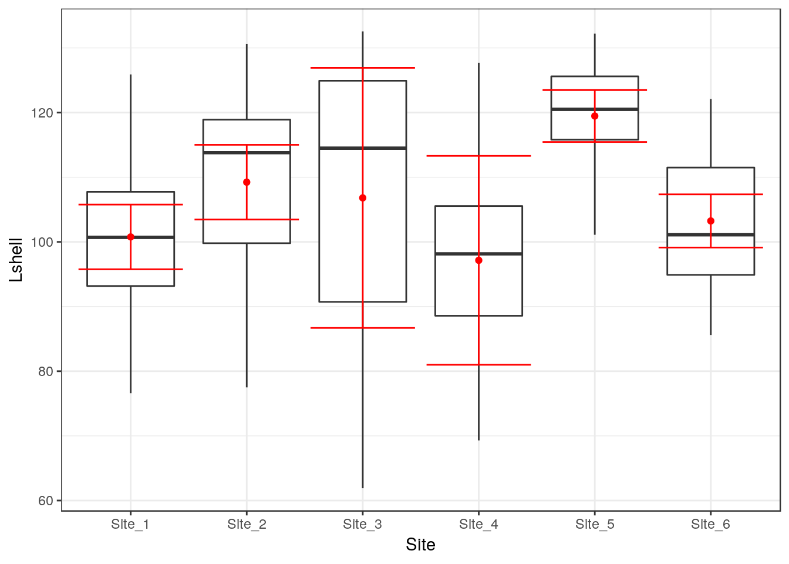


### Fitting a model

We can test a simple hypothesis using a technique called **one way ANOVA**. Could the variation in means between sites simply be due to chance? To do that we compare the variability in means to the overall variability in the data.

Crawley's R book provides an in depth explanation of the logic behind analysis of variance in chapter 9. I will not repeat all the details today. Next week we will look at where the sum of squares come from in linear models in the case of both anova and regression.

In R to fit the analysis of variance as a model we can write aov(Lshell~Site) and then ask for a summary.


```r
mod<-aov(data=d,Lshell~Site)
summary(mod)
```

```
##              Df Sum Sq Mean Sq F value   Pr(>F)    
## Site          5   5525    1105   6.173 4.58e-05 ***
## Residuals   107  19153     179                     
## ---
## Signif. codes:  0 '***' 0.001 '**' 0.01 '*' 0.05 '.' 0.1 ' ' 1
```

The result suggests that there is significant variation in mean shell length between sites, providing the assumptions of the test hold.


### The F ratio and degrees of freedom

The key to understanding analysis of variance is to understand the F ratio. The calculations produce a sum of squares and a mean square that are attributed to two sources of variation in the data. For this reason we often talk about **partitioning the variance**. The Site component is the amount of variation attributable to variations in the mean shell lengths between sites. The residual variation is the amount of variability around these mean values. You can see that the mean square for the Site term in the model is much larger than the mean square for the Residuals term. In fact it is just over **6** times larger. We know that because the table includes the **F value**, which is the **ratio** of the two mean squares. The table also contains information regarding the number of groups and the amount of replication. These are the degrees of freedom. The degrees of freedom for Site is n-1. There are six sites so there are five degrees of freedom. The degrees of freedom for the residuals are the total number of measurements minus the number of sites (factor levels). So we have 113-6=107. If you are wondering how this works, the simple explanation is that we subtract the number of mean values that we use in the calculation of the sum of squares. In the case of the site, one overall mean is used (nsites-1). In the case of the residuals the mean of each site is subtracted from the observations for each site (nobs-6).

So we can now make a formal statement that we back up with the statistical analysis. We write that **There is statistically significant variability in mean shell lengths between sites F(5, 107) = 6.17, p <0.001.**


### Homogeneity of variance

You might have spotted an issue with this test, particularly if you have been reading the text books thoroughly. The traditional analysis of variance assumes homogeneity of variances. The boxplots suggest that there is a lot of variation in between sites in the amount of variation in shell length. A test for homogeneity of variance that is often recommended is Bartlett's test


```r
bartlett.test(d$Lshell~d$Site) 
```

```
## 
## 	Bartlett test of homogeneity of variances
## 
## data:  d$Lshell by d$Site
## Bartlett's K-squared = 18.528, df = 5, p-value = 0.002352
```

As always, a low p-value suggests that the null hypothesis can be rejected, which in this case is homogeneity of variances. So on technical grounds the test we have just conducted is not quite right. One of the assumptions is not met. This can be a major issue for more complex designs. It is easy to let R make a correction for this when running a one way anova by asking for a oneway test (Welch's test).


```r
oneway.test(d$Lshell~d$Site) 
```

```
## 
## 	One-way analysis of means (not assuming equal variances)
## 
## data:  d$Lshell and d$Site
## F = 9.6559, num df = 5.000, denom df = 31.194, p-value = 1.207e-05
```

The test has now taken into account the issue and it still gives a significant result. Using Welch's procedure is a useful backup to reinforce and defend your conclusions when the assumption of homogeneity of variance is violated. We will look at this and similar issues in more detail in the course. However you still need to look at the pattern of differences more carefully.

## Alternative to the one way test

Another slightly more sophisticated way of handling homogenity of variance in R is to use a procedure called White's adjustment.


```r
library(sandwich)
library(car)
```

```
## Loading required package: carData
```

```r
mod<-lm(Lshell~Site, data=d)
Anova(mod,white.adjust='hc3')
```

```
## Coefficient covariances computed by hccm()
```

```
## Analysis of Deviance Table (Type II tests)
## 
## Response: Lshell
##            Df      F    Pr(>F)    
## Site        5 9.9682 7.541e-08 ***
## Residuals 107                     
## ---
## Signif. codes:  0 '***' 0.001 '**' 0.01 '*' 0.05 '.' 0.1 ' ' 1
```

The F ratio after making an appropriate correction is actually rather higher. 

*Write down a statement that you could include in a report that expresses this formally*

It should begin along these lines ...

"Bartlet's test showed significant heteroscedasticity in the residuals for all metals. White-corrected covariance matrices were therefore be included in a linear model in order to adjust for lack of homogeneity. Corrected one way Anova showed ..."

### Determining where the differences lie

There is a problem with the simple conclusion drawn from analysis of variance with or without correction. From a scientific perspective is it is hardly an unsurprising discovery. We would have expected some difference between sites, particularly if we look at so many different places. It is much more likely that we are really interested in **specific** differences between sites. However this raises an additional issue. If we have a hypothesis before we start regarding which site is most likely to be different we could run one single test. However if we are looking at fifteen separate comparisons that is a problem. The conventional significance value is set at 0.05. In other words one chance in twenty of obtaining the data (or more extreme) under the null hypothesis. If we run a lot of tests we increase the chances of at least one being significant even if the null holds. 

In fact it is quite easy to calculate the probability of getting at least one significant result if we run 15 tests. The easy way is to calculate the probability of all the tests being negative and subtract from 1.


```r
1-0.95^15
```

```
## [1] 0.5367088
```

So there is a 54\% chance of getting at least one significant result at the 0.05 cut off level even if the null is true for every comparison. This is a bit like buying a large number of lottery tickets. If you buy enough you increase your overall chances of winning even though the chances of any single ticket winning remains the same.

*What is the probability of getting at least one significant result at the 0.05 level if you run twenty tests? Without thinking it is tempting to say that it is one. However this is not the correct answer. Try calculating it.*

One way of reducing the number of tests is to compare all the means with a control group. This is done in an experiment with treatments, and is the contrasts are thus known as treatment contrasts. We can obtain these in R from the output of aov using summary.lm.


```r
summary.lm(mod) 
```

```
## 
## Call:
## lm(formula = Lshell ~ Site, data = d)
## 
## Residuals:
##     Min      1Q  Median      3Q     Max 
## -44.906  -8.340   1.031   9.231  30.550 
## 
## Coefficients:
##             Estimate Std. Error t value Pr(>|t|)    
## (Intercept)  100.769      2.624  38.405  < 2e-16 ***
## SiteSite_2     8.467      3.748   2.259   0.0259 *  
## SiteSite_3     6.037      5.409   1.116   0.2669    
## SiteSite_4    -3.619      5.409  -0.669   0.5049    
## SiteSite_5    18.697      3.925   4.763 6.02e-06 ***
## SiteSite_6     2.471      3.748   0.659   0.5111    
## ---
## Signif. codes:  0 '***' 0.001 '**' 0.01 '*' 0.05 '.' 0.1 ' ' 1
## 
## Residual standard error: 13.38 on 107 degrees of freedom
## Multiple R-squared:  0.2239,	Adjusted R-squared:  0.1876 
## F-statistic: 6.173 on 5 and 107 DF,  p-value: 4.579e-05
```

This shows that only site2 and site5 are significantly different from site 1. If you go back to the confidence interval plot and look at the overlap you can see how this pattern emerges.


### Bonferoni corrections

Treatment contrasts method assumes that there is a planned contrast and there is something unique about site1. Another way of looking at the issue is to effectively make comparisons between all the pairs of sites. In this case we MUST compensate in some way for all the test. There are a lot of ways of doing this. The simplest is called the Bonferoni correction. This just involves changing the critical value by dividing by the number of tests. So if we call a p-value of 0.05 significant, but run 15 tests we would look for values of 0.05/15= 0.0033 before claiming a significant result.


### Tukey's honest significant difference

A slightly more subtle method is called Tukey's Honest Significant Difference (HSD) test. We can run this in R for all pairwise comparisons and plot the results. The confidence intervals and p-values are all adjusted.

This produces a lot of output, as you would expect. It effectively runs the fifteen separate t-tests while making allowances for multiple comparisons. The output also includes 95\% confidence intervals for the differences between the means. If these confidence intervals include zero then the test will not be significant. The easiest way to see the pattern is to plot the results. 


```r
mod<-aov(data=d,Lshell~Site)
TukeyHSD(mod)
```

```
##   Tukey multiple comparisons of means
##     95% family-wise confidence level
## 
## Fit: aov(formula = Lshell ~ Site, data = d)
## 
## $Site
##                     diff        lwr       upr     p adj
## Site_2-Site_1   8.466769  -2.408905 19.342443 0.2201442
## Site_3-Site_1   6.037019  -9.660664 21.734702 0.8737518
## Site_4-Site_1  -3.619231 -19.316914 12.078452 0.9849444
## Site_5-Site_1  18.697436   7.305950 30.088922 0.0000867
## Site_6-Site_1   2.470769  -8.404905 13.346443 0.9859123
## Site_3-Site_2  -2.429750 -18.201132 13.341632 0.9976925
## Site_4-Site_2 -12.086000 -27.857382  3.685382 0.2355928
## Site_5-Site_2  10.230667  -1.262165 21.723498 0.1103764
## Site_6-Site_2  -5.996000 -16.977781  4.985781 0.6105029
## Site_4-Site_3  -9.656250 -29.069479  9.756979 0.7004668
## Site_5-Site_3  12.660417  -3.470986 28.791819 0.2123990
## Site_6-Site_3  -3.566250 -19.337632 12.205132 0.9862071
## Site_5-Site_4  22.316667   6.185264 38.448069 0.0015143
## Site_6-Site_4   6.090000  -9.681382 21.861382 0.8718474
## Site_6-Site_5 -16.226667 -27.719498 -4.733835 0.0011239
```

```r
plot(TukeyHSD(mod))
```


Notice that the comparison that we made between site1 and site2 that was significant using either a single t-test or treatment contrasts now is not shown as significant after the correction has been made for making numerous unplanned comparisons. If you really wanted to claim that the difference was significant you would have to be able to justify that you had thought that site2 ought to be particularly different before obtaining the data, and that the result was not just obtained by so called ``data dredging''.

So, there are some rather subtle aspects of data analysis. Under the more rigorous procedure only site 5 really stands out as being different from the rest. The fact that different ways of looking at the data can apparently lead to different conclusions is one of the aspects of statistics that worries many students (and researchers). Next term we will look at ways of avoiding common statistical pitfalls, together with methods to extract all the important information from a data set in order to fully address your scientific question.


### The Kruskal Wallace non parametric test.

The Kruskal Wallace test is often used in place of a one way anova when researchers are worried about the assumption of normality and want to use a non-parametric procedure. The disadvantage of a Kruskall Wallace test is that it is not easy to communicate the absolute size of any differences that are detected. The test does not lead to the development of a statistical model.


```r
kruskal.test(d$Lshell~d$Site) 
```

```
## 
## 	Kruskal-Wallis rank sum test
## 
## data:  d$Lshell by d$Site
## Kruskal-Wallis chi-squared = 27.884, df = 5, p-value = 3.835e-05
```

The differences refer to the location parameter, which is similar to the median, but not exactly the same measurement. This is difficult to communicate. Another tactic is to bootstrap the median itself. We saw how bootstrapping can be used last week. I have provided a small function to do this that can be used with a ggplot.


```r
median_cl_boot <- function(x, conf = 0.95) {
    lconf <- (1 - conf)/2
    uconf <- 1 - lconf
    require(boot)
    bmedian <- function(x, ind) median(x[ind])
    bt <- boot(x, bmedian, 1000)
    bb <- boot.ci(bt, type = "perc")
    data.frame(y = median(x), ymin = quantile(bt$t, lconf), ymax = quantile(bt$t, 
        uconf))
}

g0+stat_summary(fun.data=median_cl_boot,geom="errorbar") +  stat_summary(fun.y = median, geom = "point", colour = "red")
```

```
## Loading required package: boot
```

```
## 
## Attaching package: 'boot'
```

```
## The following object is masked from 'package:car':
## 
##     logit
```

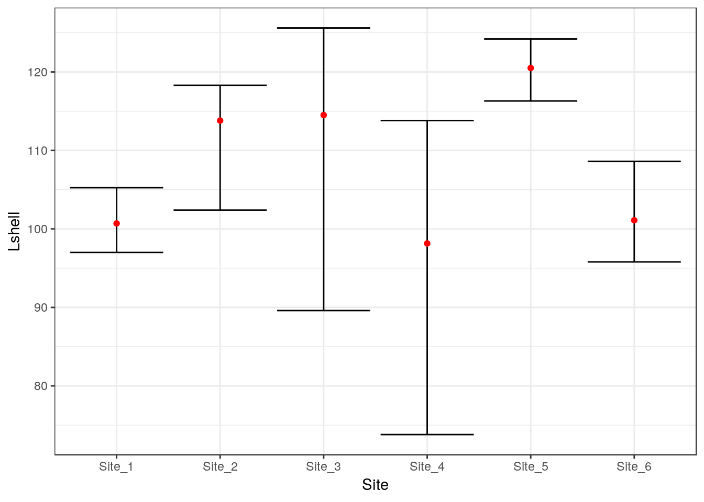

*How do you interpret this figure?*

## Power analysis

Power analysis should always be caaried out when designing any study that involves one way analysis of variance. It is very easy to do.

The idea behind a power analysis is to "reverse engineer" the analysis of variance. 

Usually when we carry out analysis of variance we want to show that there is some difference between groups. However if the sample size is too small we might not be able to reject the null hypothesis. The null hypothesis is that the observations could all have been drawn from the same population. Any difference between means is just down to chance variability that arises from variability within the groups.

Power analysis asks a "what if" question. If you have a small pilot study you might be able to provide the parameters for the question.

Let's set up a scenario involving four groups. We can either guess some rough estimates of the group means why might expect, find some literature on the subject or carry out a small pilot study to provide some data.


```r
groupmeans <- c(120, 130, 140, 150)
n<-length(groupmeans)
bvar<-var(groupmeans)
```

Notice that we need to calculate the variance between the group means and get the number of groups.

We then need to estimate the standard deviation. The best way to do this is through a short pilot study, but we can also make some informed assumptions regarding the value. The within sample variance is just this value squared.


```r
sdev<-20

wvar<-sdev^2
```


So the number of groups is 4. The variance between the the group means is calculated from the four observations and is 166.7. We estimate the standard deviation (think in terms of how far from the mean would you expect 66% of the observations to lie). 

Now we can set the power to the alpha level we want. If the power is set to 0.9 we would expect to find a significant difference in 90% of the studies, but we might obtain a type 2 error 10% of the time. A type two error is when we fail to reject the null hypothesis when it is in fact false, or in other words not find a significant difference even though it does exist.


```r
alpha<-0.9
power.anova.test(groups = n, between.var = bvar, within.var = wvar, power = alpha)
```

```
## 
##      Balanced one-way analysis of variance power calculation 
## 
##          groups = 4
##               n = 12.3635
##     between.var = 166.6667
##      within.var = 400
##       sig.level = 0.05
##           power = 0.9
## 
## NOTE: n is number in each group
```


## Bayesian methods

There is a growing tendency for Bayesian and frequentist methods to be combined for applied data analysis. This may seem odd, as there are intrinsic philosophical differences between the two approaches taken to inference [@Ellison2004]. However, in a pragmatic sense, as long as non informative priors are being used, Bayesian methods and frequentist methods produce results that can be effectively identical [@Edwards1996]. Without informative priors confidence intervals and credible intervals amount to much the same thing. As Bayesian model fitting through wrappers to MCMC algorithms have become incorporated into R, users of some libraries for fitting mixed effects models may even be unaware that they have applied a Bayesian technique.

Writing bespoke models in JAGS or Stan can be difficult and there are pitfalls. Really complex models are best left to specialist statisticians. However there are times when specifying simple models can help to solve routine problems, in combination with other methods. 


```r
library(rjags)
```

```
## Loading required package: coda
```

```
## Linked to JAGS 4.2.0
```

```
## Loaded modules: basemod,bugs
```

```r
library(tidyverse)
```

```
## ── Attaching packages ────────────────────── tidyverse 1.2.1 ──
```

```
## ✔ tibble  2.1.1          ✔ purrr   0.3.2     
## ✔ tidyr   0.8.3.9000     ✔ dplyr   0.8.0.1   
## ✔ readr   1.3.1          ✔ stringr 1.4.0     
## ✔ tibble  2.1.1          ✔ forcats 0.3.0
```

```
## ── Conflicts ───────────────────────── tidyverse_conflicts() ──
## ✖ dplyr::filter() masks plotly::filter(), stats::filter()
## ✖ dplyr::lag()    masks stats::lag()
## ✖ dplyr::recode() masks car::recode()
## ✖ purrr::some()   masks car::some()
```

```r
library(rjags)
library(ggmcmc)
library(polspline)
library(propagate)
```

```
## Loading required package: MASS
```

```
## 
## Attaching package: 'MASS'
```

```
## The following object is masked from 'package:dplyr':
## 
##     select
```

```
## The following object is masked from 'package:plotly':
## 
##     select
```

```
## Loading required package: tmvtnorm
```

```
## Loading required package: mvtnorm
```

```
## Loading required package: Matrix
```

```
## 
## Attaching package: 'Matrix'
```

```
## The following object is masked from 'package:tidyr':
## 
##     expand
```

```
## Loading required package: stats4
```

```
## Loading required package: gmm
```

```
## Loading required package: Rcpp
```

```
## Loading required package: ff
```

```
## Loading required package: bit
```

```
## Attaching package bit
```

```
## package:bit (c) 2008-2012 Jens Oehlschlaegel (GPL-2)
```

```
## creators: bit bitwhich
```

```
## coercion: as.logical as.integer as.bit as.bitwhich which
```

```
## operator: ! & | xor != ==
```

```
## querying: print length any all min max range sum summary
```

```
## bit access: length<- [ [<- [[ [[<-
```

```
## for more help type ?bit
```

```
## 
## Attaching package: 'bit'
```

```
## The following object is masked from 'package:base':
## 
##     xor
```

```
## Attaching package ff
```

```
## - getOption("fftempdir")=="/tmp/RtmpbRvjFD"
```

```
## - getOption("ffextension")=="ff"
```

```
## - getOption("ffdrop")==TRUE
```

```
## - getOption("fffinonexit")==TRUE
```

```
## - getOption("ffpagesize")==65536
```

```
## - getOption("ffcaching")=="mmnoflush"  -- consider "ffeachflush" if your system stalls on large writes
```

```
## - getOption("ffbatchbytes")==16777216 -- consider a different value for tuning your system
```

```
## - getOption("ffmaxbytes")==536870912 -- consider a different value for tuning your system
```

```
## 
## Attaching package: 'ff'
```

```
## The following objects are masked from 'package:bit':
## 
##     clone, clone.default, clone.list
```

```
## The following objects are masked from 'package:utils':
## 
##     write.csv, write.csv2
```

```
## The following objects are masked from 'package:base':
## 
##     is.factor, is.ordered
```

```
## Loading required package: minpack.lm
```

```r
library(multcomp)
```

```
## Loading required package: survival
```

```
## 
## Attaching package: 'survival'
```

```
## The following object is masked from 'package:boot':
## 
##     aml
```

```
## Loading required package: TH.data
```

```
## 
## Attaching package: 'TH.data'
```

```
## The following object is masked from 'package:MASS':
## 
##     geyser
```

```r
library(DT)
```


## The mussels data set

I have used a very simple data set for introductory classes on one way Anova. Although finding differences between measurements attributable to a factor such as site of origin does not allow direct causal inference, it is a commonly needed as a screening analysis of observational data by ecologists, It is therefore useful as a demonstration of the concepts.

### Heterogeneity of variance and unbalanced sample sizes

Note the difference in sample sizes between sites and the differences in sample standard deviations.


```r
d<-read.csv("https://tinyurl.com/aqm-data/mussels.csv")
d %>% group_by(Site) %>% summarise(n=n(),mean=round(mean(Lshell),1),sd=round(sd(Lshell),1)) %>% DT::datatable()
```

<!--html_preserve--><div id="htmlwidget-19ee2e1c9ae67d3377d9" style="width:100%;height:auto;" class="datatables html-widget"></div>
<script type="application/json" data-for="htmlwidget-19ee2e1c9ae67d3377d9">{"x":{"filter":"none","data":[["1","2","3","4","5","6"],["Site_1","Site_2","Site_3","Site_4","Site_5","Site_6"],[26,25,8,8,21,25],[100.8,109.2,106.8,97.2,119.5,103.2],[12.4,14,24.1,19.3,8.8,10]],"container":"<table class=\"display\">\n  <thead>\n    <tr>\n      <th> <\/th>\n      <th>Site<\/th>\n      <th>n<\/th>\n      <th>mean<\/th>\n      <th>sd<\/th>\n    <\/tr>\n  <\/thead>\n<\/table>","options":{"columnDefs":[{"className":"dt-right","targets":[2,3,4]},{"orderable":false,"targets":0}],"order":[],"autoWidth":false,"orderClasses":false}},"evals":[],"jsHooks":[]}</script><!--/html_preserve-->


Boxplots of the data also suggest notable heterogeneity in variances between measurements taken from different sites, although the assumption of normality seems to be reasonable.


```r
library(ggplot2)

theme_set(theme_bw())
g0 <- ggplot(d,aes(x=Site,y=Lshell))
g_box<-g0+ geom_boxplot()
g_box
```

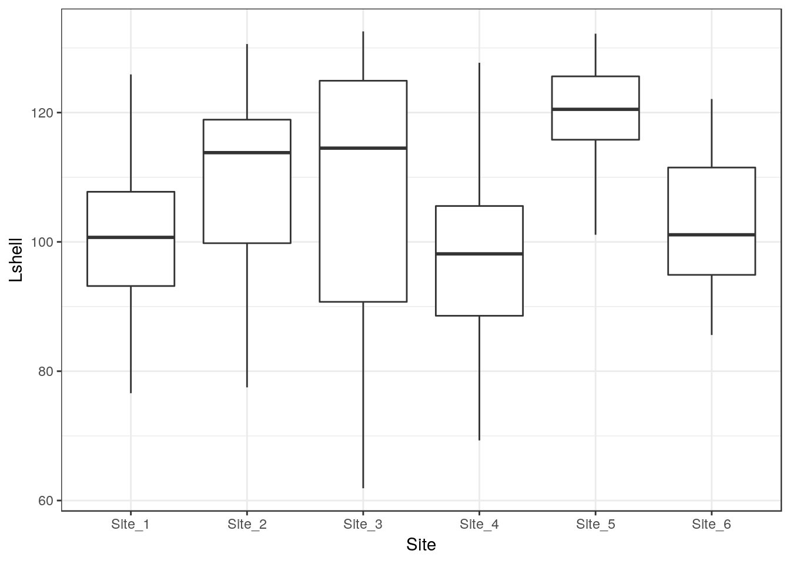

### Confidence intervals

Conventional confidence intervals based on the standard errors around the group means suggest that there are differences between sites. The conventional advice given to students is that if such confidence intervals do not overlap then an unpaired t-test between the two sites will be significant. If they do overlap, then a test may be needed to establish a significant difference. 


```r
g_mean<-g0+stat_summary(fun.y=mean,geom="point")
g_mean<-g_mean+stat_summary(fun.data=mean_cl_normal,geom="errorbar")
g_mean
```

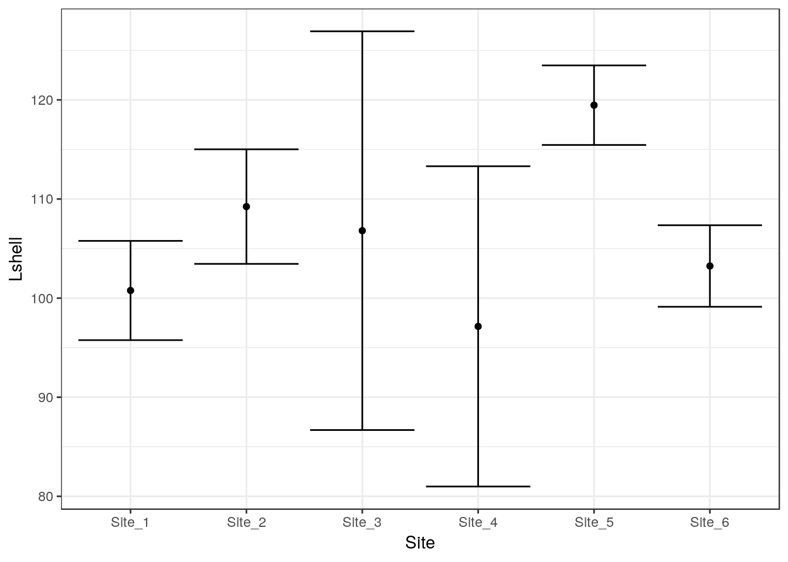

### Conventional One way ANOVA and multiple comparisons


```r
d$Site<-as.factor(as.numeric(d$Site)) ## Change to a site number for factto levels. This is for brevity in glht output
mod<-lm(data=d,Lshell~Site)

anova(lm(data=d,Lshell~Site))
```

```
## Analysis of Variance Table
## 
## Response: Lshell
##            Df Sum Sq Mean Sq F value    Pr(>F)    
## Site        5   5525    1105  6.1732 4.579e-05 ***
## Residuals 107  19153     179                      
## ---
## Signif. codes:  0 '***' 0.001 '**' 0.01 '*' 0.05 '.' 0.1 ' ' 1
```

In the introductory classes I explain the meaning of treatment contrasts and both the potential utility and the pitfalls involved in pair-wise comparisons between sites, making allowance for multiple comparisons using Tukey's adjustment. 

## Treatment contrasts

The default treatment contrasts are more suitable in the context of an experiment with a reference level.


```r
summary(mod)
```

```
## 
## Call:
## lm(formula = Lshell ~ Site, data = d)
## 
## Residuals:
##     Min      1Q  Median      3Q     Max 
## -44.906  -8.340   1.031   9.231  30.550 
## 
## Coefficients:
##             Estimate Std. Error t value Pr(>|t|)    
## (Intercept)  100.769      2.624  38.405  < 2e-16 ***
## Site2          8.467      3.748   2.259   0.0259 *  
## Site3          6.037      5.409   1.116   0.2669    
## Site4         -3.619      5.409  -0.669   0.5049    
## Site5         18.697      3.925   4.763 6.02e-06 ***
## Site6          2.471      3.748   0.659   0.5111    
## ---
## Signif. codes:  0 '***' 0.001 '**' 0.01 '*' 0.05 '.' 0.1 ' ' 1
## 
## Residual standard error: 13.38 on 107 degrees of freedom
## Multiple R-squared:  0.2239,	Adjusted R-squared:  0.1876 
## F-statistic: 6.173 on 5 and 107 DF,  p-value: 4.579e-05
```


## Multiple comparisons


```r
plot(glht(mod, linfct = mcp(Site = "Tukey")))
```

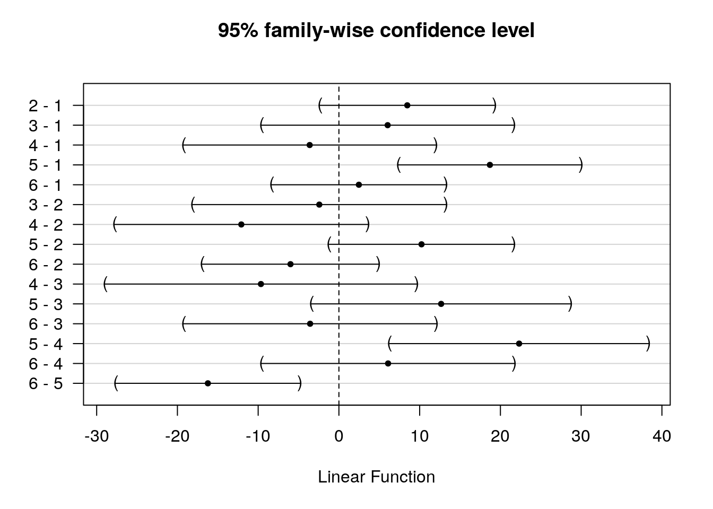

```r
summary(glht(mod, linfct = mcp(Site = "Tukey")))
```

```
## 
## 	 Simultaneous Tests for General Linear Hypotheses
## 
## Multiple Comparisons of Means: Tukey Contrasts
## 
## 
## Fit: lm(formula = Lshell ~ Site, data = d)
## 
## Linear Hypotheses:
##            Estimate Std. Error t value Pr(>|t|)    
## 2 - 1 == 0    8.467      3.748   2.259  0.21191    
## 3 - 1 == 0    6.037      5.409   1.116  0.86857    
## 4 - 1 == 0   -3.619      5.409  -0.669  0.98415    
## 5 - 1 == 0   18.697      3.925   4.763  < 0.001 ***
## 6 - 1 == 0    2.471      3.748   0.659  0.98517    
## 3 - 2 == 0   -2.430      5.435  -0.447  0.99756    
## 4 - 2 == 0  -12.086      5.435  -2.224  0.22728    
## 5 - 2 == 0   10.231      3.960   2.583  0.10534    
## 6 - 2 == 0   -5.996      3.784  -1.584  0.60000    
## 4 - 3 == 0   -9.656      6.690  -1.443  0.69112    
## 5 - 3 == 0   12.660      5.559   2.278  0.20441    
## 6 - 3 == 0   -3.566      5.435  -0.656  0.98548    
## 5 - 4 == 0   22.317      5.559   4.015  0.00139 ** 
## 6 - 4 == 0    6.090      5.435   1.121  0.86661    
## 6 - 5 == 0  -16.227      3.960  -4.097  0.00104 ** 
## ---
## Signif. codes:  0 '***' 0.001 '**' 0.01 '*' 0.05 '.' 0.1 ' ' 1
## (Adjusted p values reported -- single-step method)
```

## Sum to zero contrasts 

I would advise students not to take too much notice of individual comparisons unless there is a good underlying motive. Site 5 does seem to be distinctly different to all the other sites.A sum contrast allows the means of each site apart from the last to be compared to the overall mean.   


```r
contrasts(d$Site) <- "contr.sum"

mod<-lm(data=d,Lshell~Site)
summary(mod)
```

```
## 
## Call:
## lm(formula = Lshell ~ Site, data = d)
## 
## Residuals:
##     Min      1Q  Median      3Q     Max 
## -44.906  -8.340   1.031   9.231  30.550 
## 
## Coefficients:
##             Estimate Std. Error t value Pr(>|t|)    
## (Intercept) 106.1114     1.4384  73.773  < 2e-16 ***
## Site1        -5.3421     2.5804  -2.070   0.0408 *  
## Site2         3.1246     2.6158   1.195   0.2349    
## Site3         0.6949     4.1214   0.169   0.8664    
## Site4        -8.9614     4.1214  -2.174   0.0319 *  
## Site5        13.3553     2.7841   4.797 5.24e-06 ***
## ---
## Signif. codes:  0 '***' 0.001 '**' 0.01 '*' 0.05 '.' 0.1 ' ' 1
## 
## Residual standard error: 13.38 on 107 degrees of freedom
## Multiple R-squared:  0.2239,	Adjusted R-squared:  0.1876 
## F-statistic: 6.173 on 5 and 107 DF,  p-value: 4.579e-05
```


So that would be more or less job done in class. I would point out that in a real study we would look into the characteristics of site 5 in more detail, but could ignore the other differences.

### Heterogenity of variance

More astute students who spot the heterogeneity of variance are also shown how to run code for one-way tests and White's correction. This is not shown here.  An alternative, more advanced, approach would be to abandon the ANOVA model completely and run bootstrapped comparisons between sites using resampling from the original data. All this would probably be overkill unless the study really deserved a thorough analysis for a write up.

## Bayesian credible inference

Clearly, in a practical sense, all the useful contextual inference that can be extracted from this very small data set has been found. The most important violations of assumptions are not always visible in the numerical data and are much more likely to be attributable to faults in sampling design and lack of independence between measurements. However, if it was important to determine differences between sites it would do no harm to consider other approaches. there might just be some better interpretation.


### Pooled variance model using JAGS

A conventional pooled variance ANOVA can be written in JAGS very simply.


```r
data=list(y=d$Lshell,
          ind=as.numeric(d$Site),
          N=length(d$Lshell),
          p=length(levels(d$Site)),
          overall_mean=mean(d$Lshell))

pooled_var="
  model {
      #######  Likelihood
      for (i in 1:N) {                    # Loop through observations
        mu[i]<-Beta[ind[i]]               # The expected values are just the group means
        y[i] ~ dnorm(mu[i],tau)           # Values treated as from a single normal
       
      }
     ############## Uninformative priors
    for (j in 1:p) {
     Beta[j]~dnorm(0,0.0001)
   
     Effect[j]<-Beta[j]-overall_mean  ### Calculate difference from overall mean
     ################### Calculate pair wise differences 
      for (n in 1:(j-1)){
        Difbeta[n,j]<-Beta[n]-Beta[j]
      }
    }
    
    tau ~ dgamma(scale, rate) ## Prior for normal distribution precision.
    scale ~ dunif(0, 1)       ### Hyper parameters for tau.
    rate ~ dunif(0, 1)
    
  }
"
```

Notice that the pairwise comparisons and a measure of effect size as a difference between the group mean and the overall mean were written into the code. So if we just monitor these nodes we can produce simple caterpillar plots for the parameters of interest. A full analysis would include diagnostics for chain mixing etc, which can make Bayesian analysis more time consuming.


```r
model=jags.model(textConnection(pooled_var),data=data)
```

```
## Compiling model graph
##    Resolving undeclared variables
##    Allocating nodes
## Graph information:
##    Observed stochastic nodes: 113
##    Unobserved stochastic nodes: 9
##    Total graph size: 275
## 
## Initializing model
```

```r
update(model,n.iter=1000)
output=coda.samples(model=model,variable.names=c("Difbeta","Effect"),n.iter=100000,thin=10)

ms <-ggs(output) 
mt<-filter(ms,grepl("Difbeta",Parameter))
ggs_caterpillar(mt) +geom_vline(xintercept = 0,col="red")
```

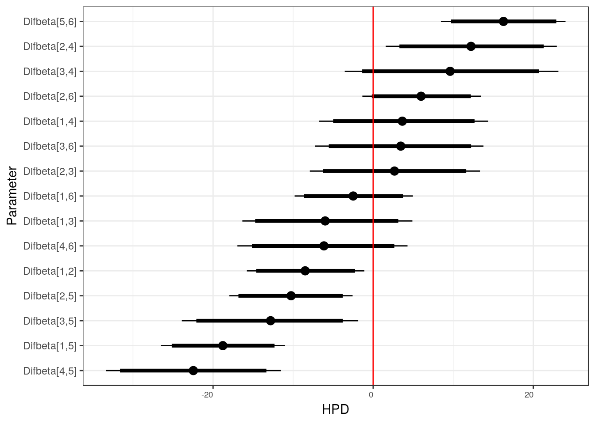


```r
mt<-filter(ms,grepl("Effect",Parameter))
ggs_caterpillar(mt) +geom_vline(xintercept = 0,col="red")
```

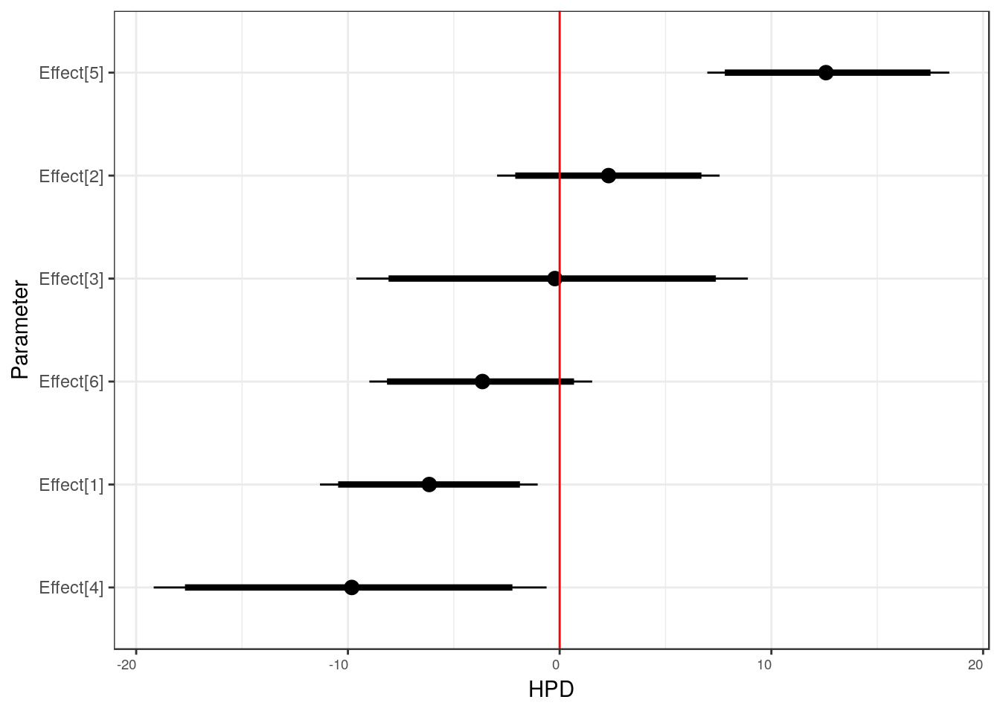


Notice that the highest posterior differences, which equate closely to 95% confidence intervals in this case, suggest more differences that do not include zero than the Tukey corrected comparisons. One reason for this is that corrections for multiple comparisons are not part of the philosophy taken to formal inference under a Bayesian framework. This could be criticised by a referee! In particular there seems to be a credible difference between sites 2 and 4, but site 4 has a lower sample size. Although we are now using Bayesin inference we have probably not finished.


## Independent variances model

As there is clear heterogeneity of variance involved it can easily be taken into account by simply not pooling variances. This does make sense, although it implies that pairwise comparisons are all independent of an overall model. 


```r
## The model is similar to the pooled variance model with some modifications noted

ind_var="
  model {
      ### Likeihood
      for (i in 1:N) {                   ## Loop through observations
        mu[i]<-Beta[ind[i]]              ## Now set an independent tau for each group
        y[i] ~ dnorm(mu[i],tau[ind[i]])
       
      }
    
    for (j in 1:p) {
     Beta[j]~dnorm(0,0.0001)            ## Set up a prior for each grous
     tau[j] ~ dgamma(scale, rate)
      Effect[j]<-Beta[j]-overall_mean 
      for (n in 1:(j-1)){
        Difbeta[n,j]<-Beta[n]-Beta[j]
      }
    }
   
    scale ~ dunif(0, 1)
    rate ~ dunif(0, 1)
    
  }
"
```


```r
model=jags.model(textConnection(ind_var),data=data)
```

```
## Compiling model graph
##    Resolving undeclared variables
##    Allocating nodes
## Graph information:
##    Observed stochastic nodes: 113
##    Unobserved stochastic nodes: 14
##    Total graph size: 280
## 
## Initializing model
```

```r
update(model,n.iter=1000)
output=coda.samples(model=model,variable.names=c("Difbeta","Effect"),n.iter=100000,thin=10)
ms <-ggs(output) 
mt<-filter(ms,grepl("Difbeta",Parameter))
ggs_caterpillar(mt) +geom_vline(xintercept = 0,col="red")
```

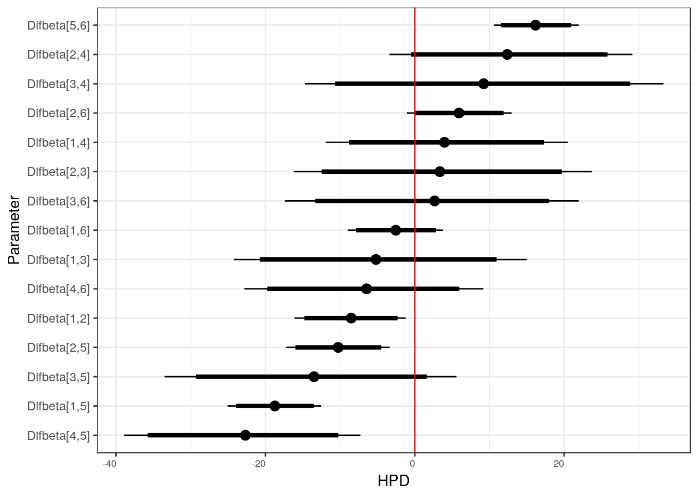


```r
mt<-filter(ms,grepl("Effect",Parameter))
ggs_caterpillar(mt) +geom_vline(xintercept = 0,col="red")
```


Notice now that the heterogeneity shown initially by the boxplots and independently calculated confidence intervals is now clearly apparent.


## Random effects model

Finally we could try something a little bit more sophisticated. As there are six sites we have just enough replication to fit a simple multi level model. We could suggest that the variability between sites forms a normal distribution. This approach follows [@Gelman2012]. Mutliple comparisons are not needed under a Bayesian approach that includes shrinkage to the mean.


```r
rand_mod="
  model {
      ### Likeihood
      for (i in 1:N) {                  ## Loop through observations
        mu[i]<-mu_r+Beta[ind[i]]        ## This time Beta is added to an overall mean
        y[i] ~ dnorm(mu[i],tau[ind[i]])  ## Set an independent tau for each group agan. A                                              pooled variance model would also work  here
       
      }
    
    for (j in 1:p) {
     Beta[j]~dnorm(0,tau_r)            ## A single tau represents the variance between group                                        #   means
     tau[j] ~ dgamma(scale, rate)
      for (n in 1:(j-1)){
        Difbeta[n,j]<-Beta[n]-Beta[j]
      }
    }
   
    scale ~ dunif(0, 1)
    rate ~ dunif(0, 1)
    tau_r ~ dgamma(scale,rate)
    sigma_r <- 1/sqrt(tau_r)
    mu_r ~ dnorm(0,0.00001)     ## Prior for the overall mean
   
  }"

model=jags.model(textConnection(rand_mod),data=data)
```

```
## Warning in jags.model(textConnection(rand_mod), data = data): Unused
## variable "overall_mean" in data
```

```
## Compiling model graph
##    Resolving undeclared variables
##    Allocating nodes
## Graph information:
##    Observed stochastic nodes: 113
##    Unobserved stochastic nodes: 16
##    Total graph size: 288
## 
## Initializing model
```

```r
update(model,n.iter=1000)
output=coda.samples(model=model,variable.names=c("sigma_r","mu_r","Difbeta","Beta"),n.iter=100000,thin=10)
```


```r
ms <-ggs(output) 
mt<-filter(ms,grepl("Beta",Parameter))
ggs_caterpillar(mt) +geom_vline(xintercept = 0,col="red")
```

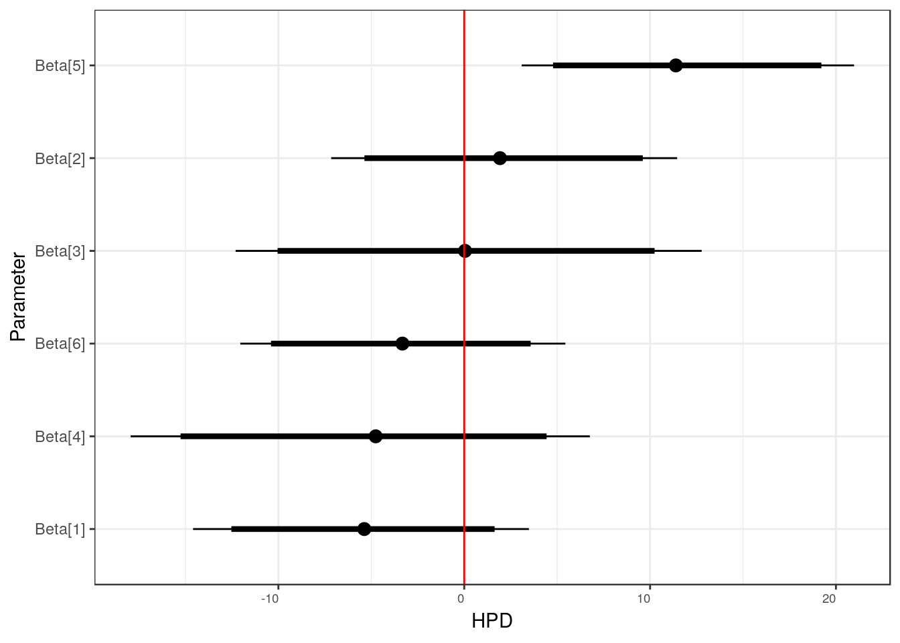


```r
ms <-ggs(output) 
mt<-filter(ms,grepl("Difbeta",Parameter))
ggs_caterpillar(mt) +geom_vline(xintercept = 0,col="red")
```

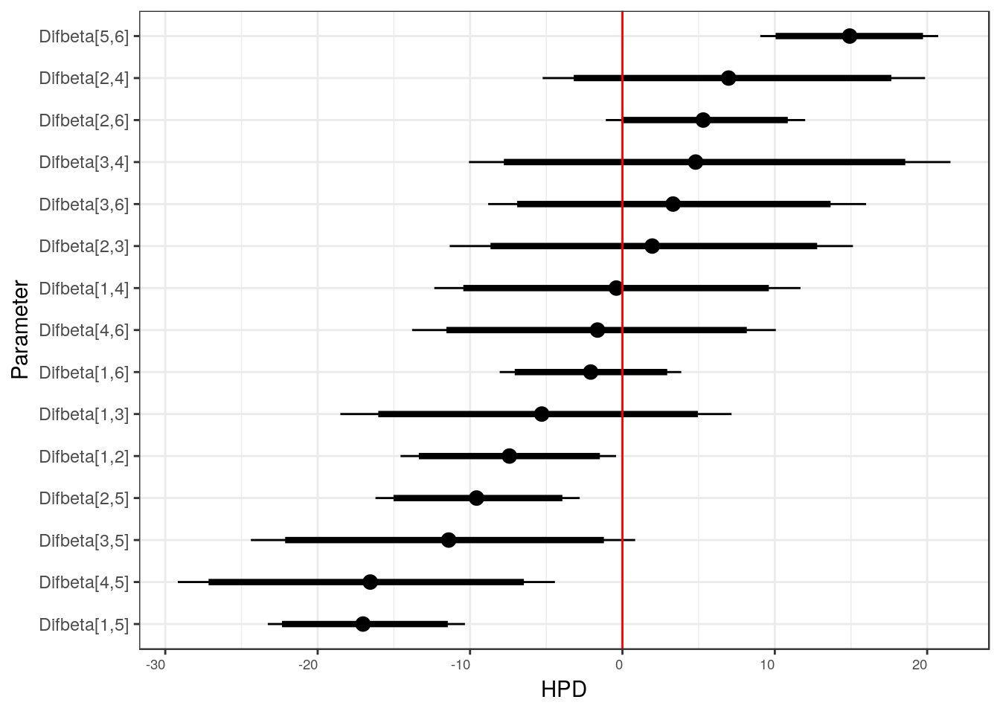


```r
mt<-filter(ms,grepl("Beta",Parameter))
ggplot(data=mt,aes(x=mt$value,col=Parameter,fill=Parameter)) + geom_density(alpha=0.2)
```

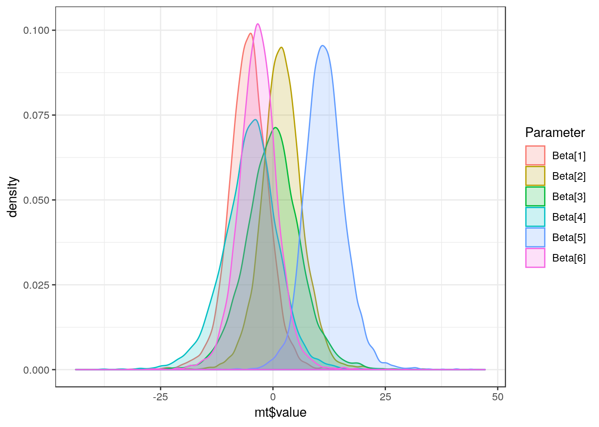

This is arguably the most appropriate analysis in this particular case. The Bayesian analysis has accounted for the unbalanced sample sizes and provided credible intervals for effect sizes based on the assumption that site means themselves form a normal distribution,. Now, only site 5 stands out as being of any interest at all.

## Extensions and conclusion

In a practical sense, adding the Bayesian analysis has not led to much insight here. However it is surprisingly easy to include it. If inferences on effect sizes are contextually important is it worth looking at them from different perspectives in order to test the importance of the assumptions being used. If all analyses lead to exactly the same conclusions then inference is strengthened. In a more advanced setting some additional considerations of random effects and potentially informative prior knowledge can be added to the Bayesian models in a bespoke, contextually appropriate, manner.

## References


Long, J. S. and Ervin, L. H. (2000) Using heteroscedasity consistent standard errors in the linear regression model. The American Statistician 54, 217–224. http://www.jstor.org/stable/2685594

White, H. (1980) A heteroskedastic consistent covariance matrix estimator and a direct test of heteroskedasticity. Econometrica 48, 817–838.

Fox, J. (2008) Applied Regression Analysis and Generalized Linear Models, Second Edition. Sage.
