# Fitting curves to data

In the previous class we have assumed that the underlying relationship between variables takes the form of a straight line. However in ecology the relationship between variables can have more complex forms. Sometimes the form can be predicted from theory. However we are often simply interested in finding a model that describes the data well and provides insight into processes. 


## Data exploration

The data we will first look at is analysed by Zuur et al (2007) but here it has been modified slightly in order to illustrate the point more clearly.

The data frame we will look at contains only two variables selected from a large number of measurements taken on sediment cores from Dutch beaches. The response variable is the richness of benthic invertebrates. The explanatory variable we are going to look at here is sediment grain size in mm. The data also contains measurements on height from mean sea level and salinity.

### Visualisation


```r
library(ggplot2)
```


```r
d<-read.csv("/home/aqm/course/data/marineinverts.csv")
DT::datatable(d)
```

<!--html_preserve--><div id="htmlwidget-d5b6ea154ced89455fc2" style="width:100%;height:auto;" class="datatables html-widget"></div>
<script type="application/json" data-for="htmlwidget-d5b6ea154ced89455fc2">{"x":{"filter":"none","data":[["1","2","3","4","5","6","7","8","9","10","11","12","13","14","15","16","17","18","19","20","21","22","23","24","25","26","27","28","29","30","31","32","33","34","35","36","37","38","39","40","41","42","43","44","45"],[0,2,8,13,17,10,10,9,19,8,11,11,3,1,3,7,11,3,6,0,1,22,2,1,6,4,1,1,3,4,4,3,0,5,3,6,3,6,1,5,4,7,3,5,4],[450,370,192.5,194.5,197,200,202,205.5,205.5,211.5,221,222.5,223,234,242,244.5,247.5,251.5,254.5,256.5,256.5,180,266,272.5,275.5,284,289.5,293.5,294.5,296.5,297,304,311.5,316.5,323.5,330.5,330.5,336,347.5,351,354.5,355,361,362,405.5],[2.255,0.865,1.19,-1.336,-1.334,-1.036,-0.684,0.82,0.061,0.635,0.616,0.045,-0.002,1.375,-0.06,-0.356,0.094,1.117,0.054,1.627,1.786,-0.503,0.883,1.494,0.729,0.367,1.367,1.768,1.671,-0.201,-0.811,-0.482,2.052,-0.375,0.167,-0.976,0.46,-0.893,2.222,-0.578,0.766,-1.005,-0.03,0.17,-0.348],[27.1,27.1,29.6,29.4,29.6,29.4,29.4,29.6,29.6,29.6,29.4,29.4,27.1,27.4,27.4,27.1,27.1,29.9,29.9,29.9,27.4,29.9,27.4,27.9,29.9,27.4,28.1,28.1,26.4,27.9,28.1,27.9,26.4,26.4,27.9,27.9,28.1,27.1,27.1,27.1,27.1,26.4,28.1,26.4,27.1]],"container":"<table class=\"display\">\n  <thead>\n    <tr>\n      <th> <\/th>\n      <th>richness<\/th>\n      <th>grain<\/th>\n      <th>height<\/th>\n      <th>salinity<\/th>\n    <\/tr>\n  <\/thead>\n<\/table>","options":{"columnDefs":[{"className":"dt-right","targets":[1,2,3,4]},{"orderable":false,"targets":0}],"order":[],"autoWidth":false,"orderClasses":false}},"evals":[],"jsHooks":[]}</script><!--/html_preserve-->

The first step in any analysis should be to look at the data.

Base graphics are good enough for a quick figure at this stage.


```r
attach(d)
plot(richness~grain)
```

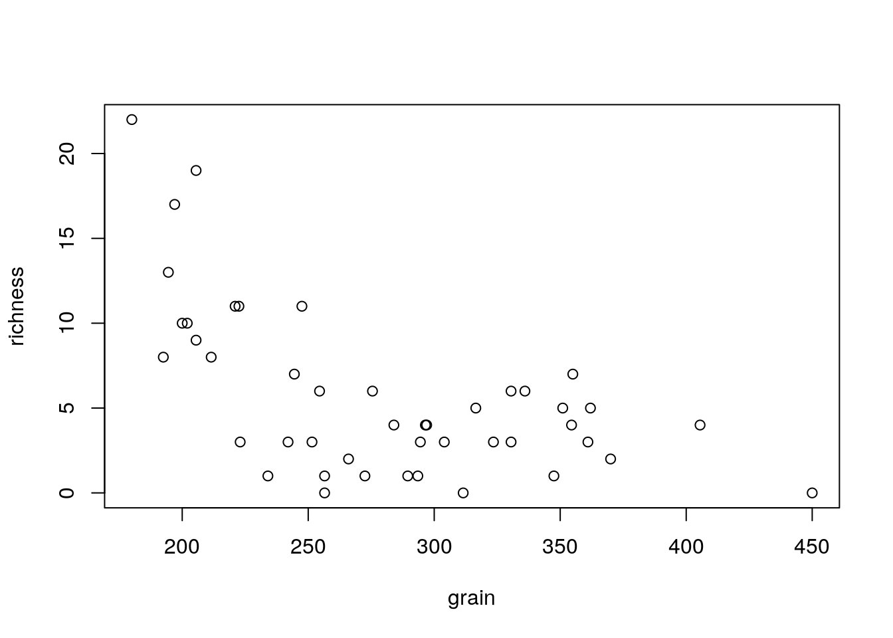

Or in ggplot


```r
theme_set(theme_bw())
g0<-ggplot(data=d,aes(x=grain,y=richness))
g1<-g0+geom_point()
g1
```

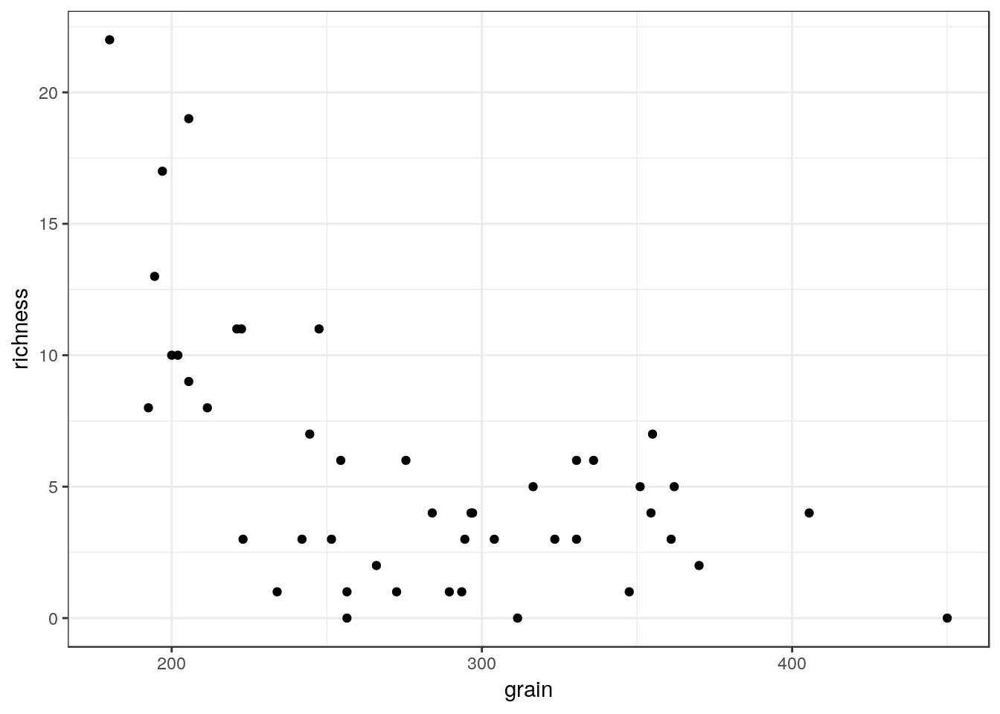

There seems to be a pattern of an intial steep decline in richness as grain size increases, followed by a plateau. Let's try fitting a linear regression to the data and plotting the results with confidence intervals.

**Note** This is **not** necessarily the correct analysis for these data. In fact there are many reasons why it is clearly an incorrect way of modelling the relationship. We will explore this as the class progresses, and in a later class we will revisit the data set in order to use a much better model. The exercise at this point is for illustrative, didactic purposes. You should think about the reasons for not using a simple model at every step, in order to understand why more advanced methods are needed.

Plotting confidence intervals using base graphics requires a few steps in base graphics, but you can see explicitly that these are constructed using the model predictions.


```r
mod<-lm(richness~grain)
plot(richness~grain)
x<-seq(min(grain),max(grain),length=100)
matlines(x,predict(mod,newdata=list(grain=x),interval="confidence"))
```


It is, of course, usually much quicker and easier to use ggplots. 


```r
g2<-g1+geom_smooth(method="lm")
g2
```

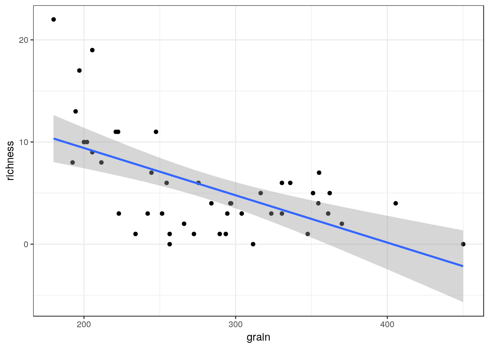

The relationship is modelled quite well by a straight line, but it does not look completely convincing. There are two many points above the line on the left hand side of the figure and too many below on the right. If look at the first diagnostic plot for the model this is also apparent. The residuals are correlated as a result of the model not being of the correct form.

Look at the diagnostic plots.


```r
anova(mod)
```

```
## Analysis of Variance Table
## 
## Response: richness
##           Df Sum Sq Mean Sq F value    Pr(>F)    
## grain      1 385.13  385.13  23.113 1.896e-05 ***
## Residuals 43 716.52   16.66                      
## ---
## Signif. codes:  0 '***' 0.001 '**' 0.01 '*' 0.05 '.' 0.1 ' ' 1
```

```r
summary(mod)
```

```
## 
## Call:
## lm(formula = richness ~ grain)
## 
## Residuals:
##     Min      1Q  Median      3Q     Max 
## -6.8386 -2.0383 -0.3526  2.5768 11.6620 
## 
## Coefficients:
##              Estimate Std. Error t value Pr(>|t|)    
## (Intercept) 18.669264   2.767726   6.745 3.01e-08 ***
## grain       -0.046285   0.009628  -4.808 1.90e-05 ***
## ---
## Signif. codes:  0 '***' 0.001 '**' 0.01 '*' 0.05 '.' 0.1 ' ' 1
## 
## Residual standard error: 4.082 on 43 degrees of freedom
## Multiple R-squared:  0.3496,	Adjusted R-squared:  0.3345 
## F-statistic: 23.11 on 1 and 43 DF,  p-value: 1.896e-05
```

```r
par(mfcol=c(2,2))
plot(mod)
```

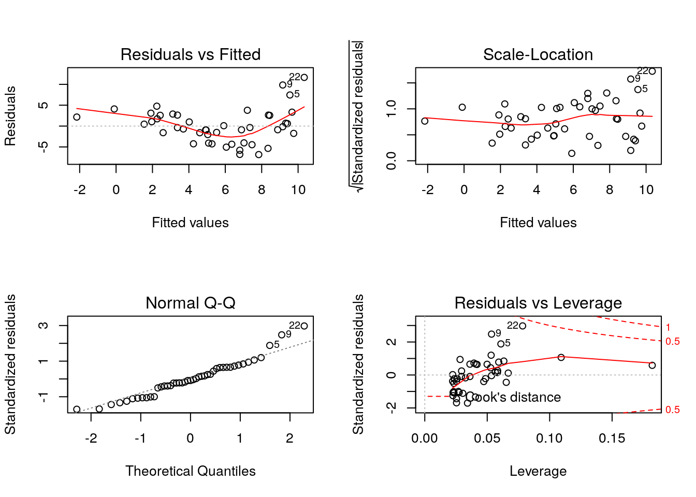

### T values and significance in summary output

An element of the R output that you should be aware of at this point is the summary table. If you look at this table you will see that for each parameter there is an estimate of its value together with a standard error. The confidence interval for the parameter is approximately plus or minus twice the standard error. The T value is a measure of how far from zero the estimated parameter value lies in units of standard error. So generally speaking t values of 2 or more will be statistically significant. This may be useful, but it certainly does **not** suggest that parameter is useful in itself. To evaluate whether a parameter should be included requires taking a "whole model" approach. 

Remember that a p-value only tells you how likely you would be to get the value of t (or any other statistic with a known distribution such as an F value) if the null model were true. It doesn't really tell you that much directly about the model you actually have.

### Testing for curvilearity

We can check whether a strait line is a good representation of the
pattern using the reset test that will have a low p-value if the linear form of the model is not a good fit.


```r
library(lmtest)
```

```
## Loading required package: zoo
```

```
## 
## Attaching package: 'zoo'
```

```
## The following objects are masked from 'package:base':
## 
##     as.Date, as.Date.numeric
```

```r
resettest(richness ~ grain)
```

```
## 
## 	RESET test
## 
## data:  richness ~ grain
## RESET = 19.074, df1 = 2, df2 = 41, p-value = 1.393e-06
```


The Durbin Watson test which helps to confirm serial autocorrelation that may be the result of a misformed model will often also be significant when residuals cluster on one side of the line.


```r
dwtest(richness~grain)
```

```
## 
## 	Durbin-Watson test
## 
## data:  richness ~ grain
## DW = 1.7809, p-value = 0.1902
## alternative hypothesis: true autocorrelation is greater than 0
```

In this case it was not, but this may be because there were too few data points.


## Polynomials

The traditional method for modelling curvilinear relationships when a functional form of the relationship is not assumed is to use polynomials. Adding quadratic, cubic or higher terms to a model gives it flexibility and allows the line to adopt different shapes. The simplest example is a quadratic relationship which takes the form of a parabola.

$y=a+bx+cx^{2} +\epsilon$ where $\epsilon=N(o,\sigma^{2})$


```r
x<-1:100
y<-10+2*x-0.02*x^2
plot(y~x,type="l")
```

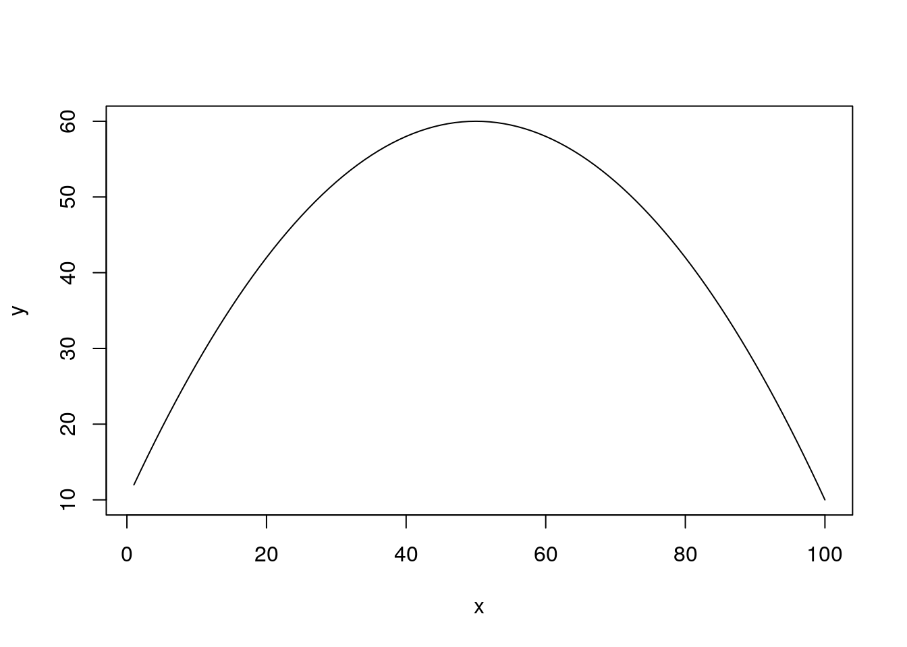

If the quadratic term has a small value the curve may look more like a hyperbola over the data range. 


```r
x<-1:100
y<-10+2*x-0.01*x^2
plot(y~x,type="l")
```

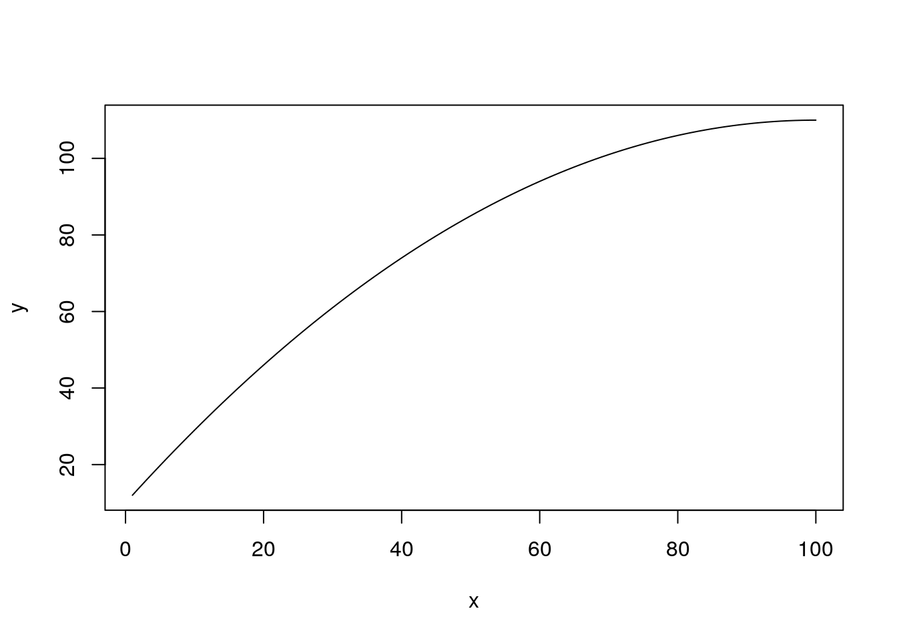

We can add a quadratic term to the model formula in R very easily.

The syntax is lm(richness ~ grain+I(grain^2)).

The "I" is used to isolate the expression so that it is interpreted literally in mathematical terms. Notice that we are still using lm, i.e. a general linear model. This is because mathematically the terms still enter in a "linear" manner. So linear models can produce curves!

We canplot the predictions explicitly using base graphics.


```r
mod2<-lm(richness~grain+I(grain^2))
plot(richness~grain)
x<-seq(min(grain),max(grain),length=100)
matlines(x,predict(mod2,newdata=list(grain=x),interval="confidence"))
```


Or using ggplot.


```r
g1+geom_smooth(method="lm",formula=y~x+I(x^2), se=TRUE)
```


```r
anova(mod2)
```

```
## Analysis of Variance Table
## 
## Response: richness
##            Df Sum Sq Mean Sq F value    Pr(>F)    
## grain       1 385.13  385.13  29.811 2.365e-06 ***
## I(grain^2)  1 173.93  173.93  13.463   0.00068 ***
## Residuals  42 542.59   12.92                      
## ---
## Signif. codes:  0 '***' 0.001 '**' 0.01 '*' 0.05 '.' 0.1 ' ' 1
```

```r
summary(mod2)
```

```
## 
## Call:
## lm(formula = richness ~ grain + I(grain^2))
## 
## Residuals:
##     Min      1Q  Median      3Q     Max 
## -6.5779 -2.5315  0.2172  2.1013  8.3415 
## 
## Coefficients:
##               Estimate Std. Error t value Pr(>|t|)    
## (Intercept) 53.0133538  9.6721492   5.481 2.21e-06 ***
## grain       -0.2921821  0.0675505  -4.325 9.19e-05 ***
## I(grain^2)   0.0004189  0.0001142   3.669  0.00068 ***
## ---
## Signif. codes:  0 '***' 0.001 '**' 0.01 '*' 0.05 '.' 0.1 ' ' 1
## 
## Residual standard error: 3.594 on 42 degrees of freedom
## Multiple R-squared:  0.5075,	Adjusted R-squared:  0.484 
## F-statistic: 21.64 on 2 and 42 DF,  p-value: 3.476e-07
```

We now have a higher value of R squared and a better fitting model.

But the shape does not look right. The quadratic is constrained in form and has started to rise at the high end of the x axis. This does not make a great deal of sense.

We can give the model more flexibility by adding another term.


```r
mod3<-lm(richness~grain+I(grain^2)+I(grain^3))
plot(richness~grain)
x<-seq(min(grain),max(grain),length=100)
matlines(x,predict(mod3,newdata=list(grain=x),interval="confidence"))
```


```r
g1+geom_smooth(method="lm",formula=y~x+I(x^2)++I(x^3), se=TRUE)
```


```r
anova(mod3)
```

```
## Analysis of Variance Table
## 
## Response: richness
##            Df Sum Sq Mean Sq F value    Pr(>F)    
## grain       1 385.13  385.13  42.542 7.820e-08 ***
## I(grain^2)  1 173.93  173.93  19.212 7.944e-05 ***
## I(grain^3)  1 171.42  171.42  18.936 8.768e-05 ***
## Residuals  41 371.17    9.05                      
## ---
## Signif. codes:  0 '***' 0.001 '**' 0.01 '*' 0.05 '.' 0.1 ' ' 1
```

```r
summary(mod3)
```

```
## 
## Call:
## lm(formula = richness ~ grain + I(grain^2) + I(grain^3))
## 
## Residuals:
##     Min      1Q  Median      3Q     Max 
## -6.5250 -1.8841 -0.2896  2.2259  7.9431 
## 
## Coefficients:
##               Estimate Std. Error t value Pr(>|t|)    
## (Intercept)  1.955e+02  3.373e+01   5.796 8.44e-07 ***
## grain       -1.784e+00  3.474e-01  -5.134 7.27e-06 ***
## I(grain^2)   5.420e-03  1.153e-03   4.700 2.93e-05 ***
## I(grain^3)  -5.386e-06  1.238e-06  -4.352 8.77e-05 ***
## ---
## Signif. codes:  0 '***' 0.001 '**' 0.01 '*' 0.05 '.' 0.1 ' ' 1
## 
## Residual standard error: 3.009 on 41 degrees of freedom
## Multiple R-squared:  0.6631,	Adjusted R-squared:  0.6384 
## F-statistic:  26.9 on 3 and 41 DF,  p-value: 8.838e-10
```

This produces a better fit statistically, but things are now getting very confusing. It is not clear what the third term is actually doing. The confidence intervals are quite wide, so we could ignore the sharp downturn, as any shape within the confidence intervals is permissible. But the model still does not look right.

The advantages of polynomials is that they do result in a formula that can be written down and provided as a predictive model. The major disadvantage is that the formula is rather complex and has no intrinisic biological or ecological basis. You must also be very careful never to use these models to predict values that fall outside the range used for fitting. Also the formulae produced by fitting polynomials are often used without regard to the confidence intervals. Uncertainty is part of the statistical model and should be taken into account.


## Splines

A commonly used alternative to polynomials is to fit a so called smoother of some description. There are many different ways to go about this, making the subject seem complicated. However for most practical purposes they produce similar results and we can rely on the software to make most of the decisions. 

The most commonly used smoothers are splines of some type. These work by fitting curves to sections of the data and then splicing the results together. This gives the curves much greater flexibility that polynomials. Almost any shape can be fitted.

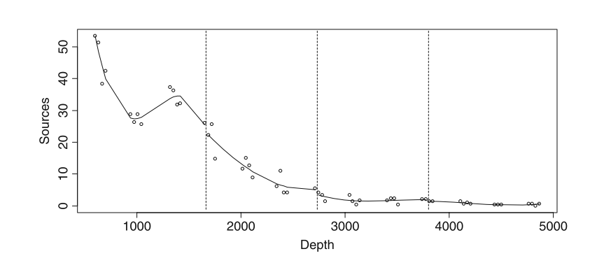

The issue with this involves complexity. If we let the curves become too flexible we could fit a line to that passed through all the data points. But this would not be useful and would leave no degrees of freedom. The degree of waviness is selected in R automatically by cross validation if we use the mgcv package. There is no guarantee that the model will be biologically meaningful, but many times the selection produces a curve that fits the data well and can be interpreted.


```r
library(mgcv)
```

```
## Loading required package: nlme
```

```
## This is mgcv 1.8-24. For overview type 'help("mgcv-package")'.
```

```r
mod4<-gam(richness~s(grain))
summary(mod4)
```

```
## 
## Family: gaussian 
## Link function: identity 
## 
## Formula:
## richness ~ s(grain)
## 
## Parametric coefficients:
##             Estimate Std. Error t value Pr(>|t|)    
## (Intercept)   5.6889     0.4601   12.36  2.6e-15 ***
## ---
## Signif. codes:  0 '***' 0.001 '**' 0.01 '*' 0.05 '.' 0.1 ' ' 1
## 
## Approximate significance of smooth terms:
##            edf Ref.df     F  p-value    
## s(grain) 3.615  4.468 15.92 3.25e-09 ***
## ---
## Signif. codes:  0 '***' 0.001 '**' 0.01 '*' 0.05 '.' 0.1 ' ' 1
## 
## R-sq.(adj) =  0.619   Deviance explained = 65.1%
## GCV = 10.616  Scale est. = 9.5269    n = 45
```


The summary gives a p-value for the term and also shows the estimated degrees of freedom. The more complex the response, the more degrees of freedom are used in fitting the model.

Unlike regression models there is no formula associated with the model. So it can be difficult to communicate the results. The usual way of presenting the model is graphically.


```r
plot(mod4)
```

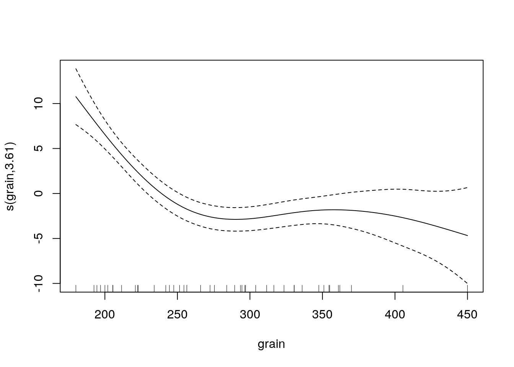

Notice that the plot shows differences from the mean value (intercept) associated with the smoothed term in the model. Splines can suffer from some of the same problems as polynomials, but they often lead to a curve that has more intrinsic meaning.


```r
g1+stat_smooth(method = "gam", formula = y ~ s(x))
```

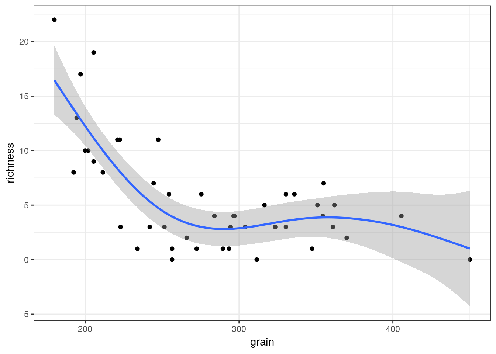


## Complex shapes

The next data set is on the Gonadosomatic index (GSI, i.e., the weight of the gonads relative to total body weight) of squid Measurements were taken from squid caught at various locations and months in Scottish
waters.


```r
squid<-read.csv("/home/aqm/course/data/squid.csv")
```

We can plot out the data using a conditional box and whisker plot.


```r
squid$month<-as.factor(squid$MONTH)
```


```r
g0<-ggplot(data=squid,aes(x=month,y=GSI))
g1<-g0+geom_boxplot()
g1+facet_wrap("Sex")
```

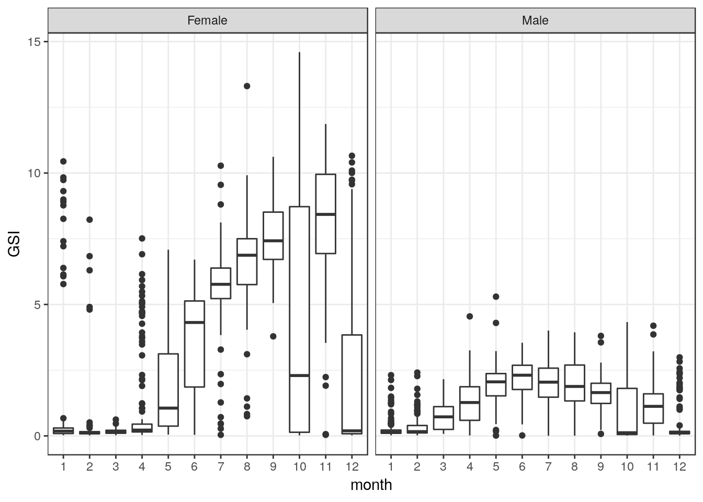

It seems sensible to split the data by gender.


```r
males<-subset(squid,Sex=="Male")
females<-subset(squid,Sex=="Female")
```

Now we can try representing the pattern of change over the year using a spline model fit using mgcv.


```r
mod1<-gam(GSI~s(MONTH),data=females) 
plot(mod1)
```


```r
summary(mod1)
```

```
## 
## Family: gaussian 
## Link function: identity 
## 
## Formula:
## GSI ~ s(MONTH)
## 
## Parametric coefficients:
##             Estimate Std. Error t value Pr(>|t|)    
## (Intercept)  3.27244    0.06651    49.2   <2e-16 ***
## ---
## Signif. codes:  0 '***' 0.001 '**' 0.01 '*' 0.05 '.' 0.1 ' ' 1
## 
## Approximate significance of smooth terms:
##           edf Ref.df     F p-value    
## s(MONTH) 8.93  8.999 156.7  <2e-16 ***
## ---
## Signif. codes:  0 '***' 0.001 '**' 0.01 '*' 0.05 '.' 0.1 ' ' 1
## 
## R-sq.(adj) =   0.53   Deviance explained = 53.4%
## GCV = 5.5387  Scale est. = 5.4944    n = 1242
```


```r
g0<-ggplot(data=females, aes(x=MONTH,y=GSI))
g1<-g0+geom_point()
g1+stat_smooth(method = "gam", formula = y ~ s(x))
```


The statistics are OK, but the biology seems wrong. The dip in the curve in October does not seem to make sense. Although the number of knots in the spline are determined by cross validation we can lower them in order to produce a simpler model.


```r
mod2<-gam(GSI~s(MONTH,k=8),data=females) 
plot(mod2)
```

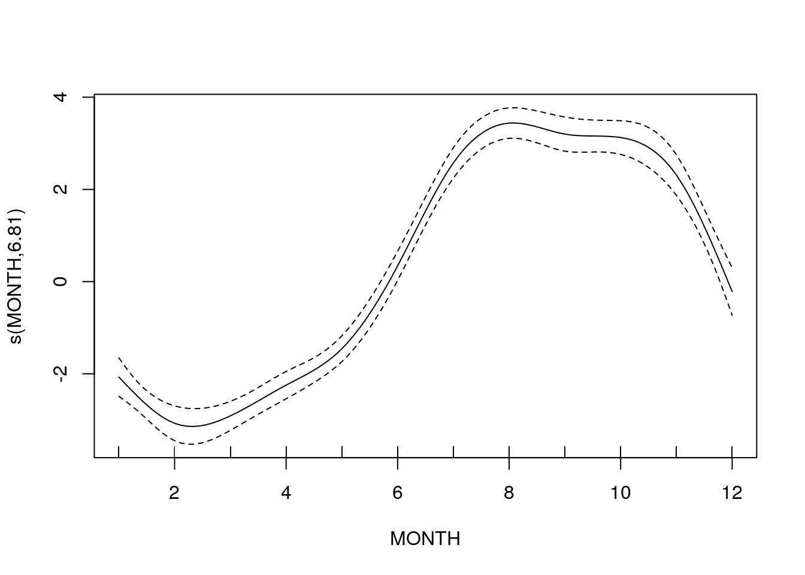

```r
summary(mod2)
```

```
## 
## Family: gaussian 
## Link function: identity 
## 
## Formula:
## GSI ~ s(MONTH, k = 8)
## 
## Parametric coefficients:
##             Estimate Std. Error t value Pr(>|t|)    
## (Intercept)  3.27244    0.06848   47.79   <2e-16 ***
## ---
## Signif. codes:  0 '***' 0.001 '**' 0.01 '*' 0.05 '.' 0.1 ' ' 1
## 
## Approximate significance of smooth terms:
##            edf Ref.df     F p-value    
## s(MONTH) 6.815  6.987 179.8  <2e-16 ***
## ---
## Signif. codes:  0 '***' 0.001 '**' 0.01 '*' 0.05 '.' 0.1 ' ' 1
## 
## R-sq.(adj) =  0.502   Deviance explained = 50.5%
## GCV = 5.8608  Scale est. = 5.8239    n = 1242
```


```r
g1+stat_smooth(method = "gam", formula = y ~ s(x,k=8))
```

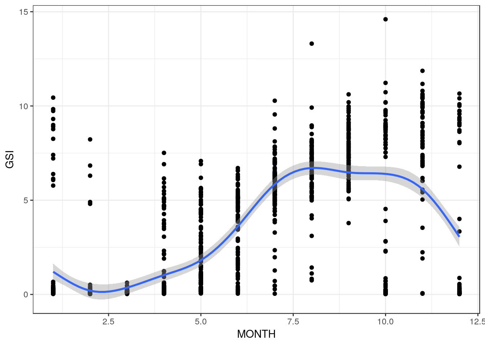


```r
mod3<-gam(GSI~s(MONTH,k=7),data=females) 
plot(mod3)
```

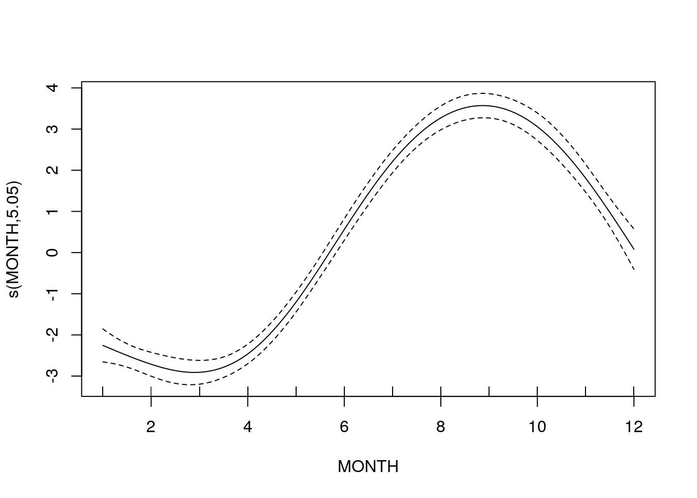

```r
summary(mod3)
```

```
## 
## Family: gaussian 
## Link function: identity 
## 
## Formula:
## GSI ~ s(MONTH, k = 7)
## 
## Parametric coefficients:
##             Estimate Std. Error t value Pr(>|t|)    
## (Intercept)  3.27244    0.06896   47.46   <2e-16 ***
## ---
## Signif. codes:  0 '***' 0.001 '**' 0.01 '*' 0.05 '.' 0.1 ' ' 1
## 
## Approximate significance of smooth terms:
##            edf Ref.df     F p-value    
## s(MONTH) 5.047  5.655 213.7  <2e-16 ***
## ---
## Signif. codes:  0 '***' 0.001 '**' 0.01 '*' 0.05 '.' 0.1 ' ' 1
## 
## R-sq.(adj) =  0.495   Deviance explained = 49.7%
## GCV = 5.9348  Scale est. = 5.9059    n = 1242
```


```r
g1+stat_smooth(method = "gam", formula = y ~ s(x,k=7))
```


By reducing the number of knots we have models which use fewer degrees of freedom. However the fit as measured by the deviance explained (R squared in this case) is reduced. 

We can test whether the first model is significantly better. We find that it is.


```r
anova(mod1,mod2,mod3,test="F")
```

```
## Analysis of Deviance Table
## 
## Model 1: GSI ~ s(MONTH)
## Model 2: GSI ~ s(MONTH, k = 8)
## Model 3: GSI ~ s(MONTH, k = 7)
##   Resid. Df Resid. Dev      Df Deviance      F    Pr(>F)    
## 1    1232.0     6769.5                                      
## 2    1234.0     7187.8 -2.0115  -418.25 37.844 < 2.2e-16 ***
## 3    1235.3     7299.4 -1.3317  -111.67 15.263 1.391e-05 ***
## ---
## Signif. codes:  0 '***' 0.001 '**' 0.01 '*' 0.05 '.' 0.1 ' ' 1
```

So we are left with a difficulty. The statistical criteria lead to a wavy model, while common sense suggest that there is some issue that has not been taken into account. In such a situation we should look for additional variables that have not been measured. Perhaps some of the squid that were caught actually came from a separate population with a different timing of reproduction. 


# Non-linear models

Statistical modelling involves measures of fit. However scientific modelling often brings in other elements, including theory that is used to propose a model for the data. These theoretical models are often non-linear in the statistical sense. The terms do not enter in a linear manner. Such models can be difficult to fit to real life data, but are often used when building process based ecological models.

## Fitting a rectangular hyperbola

For example, resource use is commonly modelled using a function with an asymptote. The equation below is a version of Holling's disk equation that has been rewriten as a generalised rectangular hyperbola. This is identical in form to the Michaelis-Menton equation for enzyme kinetics.

$$C=\frac{sR}{F+R}$$


Where 

* C is resource consumption, 
* R is the amount or density of theresource, 
* s is the asymptotic value and 
*  F represents the density of resource at which half the asymptotic consumption is expected to occur. This model is not linear in its parameters.

The data below have been simulated from this equation in order to illustrate the model fitting process.


```r
d<-read.csv("/home/aqm/course/data/Hollings.csv")
plot(d,pch=21,bg=2)
```


There are many ways to fit a theoretical non-linear model in R. One of the simplest uses least squares, so some of the assumptions made are similar to linear regression. 

It is much harder to run diagnosis on these sorts of models. Even fitting them can be tricky. Diagnostics are arguably less important, as the interest lies in finding a model that matches our understanding of how the process works, rather than fitting the data as well as possible.

We have to provide R with a list of reasonable starting values for the model. At present R does not provide confidence bands for plotting, but this is less important in the case of non linear models. It is much more interesting to look at the confidence intervals for the parameters themselves. 


```r
nlmod<-nls(Consumption~s*Resource/(F+Resource),data = d,start = list( F = 20,s=20)) 
newdata <- data.frame(Resource=seq(min(d$Resource),max(d$Resource),l=100)) 
a <- predict(nlmod, newdata = newdata)
plot(d,main="Non-linear model")
lines(newdata$Resource,a,lwd=2)
```


```r
confint(nlmod)
```

```
## Waiting for profiling to be done...
```

```
##       2.5%    97.5%
## F 33.97300 43.66697
## s 19.58576 20.32930
```


```r
g0<-ggplot(data=d,aes(x=Resource,y=Consumption))
g1<-g0+geom_point()
g1+geom_smooth(method="nls",formula=y~s*x/(F+x),method.args=list(start = c( F = 20,s=20)), se=FALSE)
```


The nice result of fitting this form of model is that we can now interpret the result in the context of the process. If the resource represented biomass of ragworm in mg m2 and consumption feeding rate of waders we could now estimate the maximum rate of feeding lies between 19.5 and 20.3 mg hr. The density at which birds feed at half this maximum rate, if the theoretical model applies, lies beyond the range of the data that we obtained (34 to 44 mg m2).

Non linear models can thus be extrapolated beyond the data range in a way that linear models, polynomials and splines cannot. However this extrapolation relies on assuming that the functional form of the model is sound.

It is common to find that parameters are estimated with very wide confidence intervals even when a model provides a good fit to the data. Reporting confidence intervals for key parameters such as the asymptote is much more important in this context than reporting R2 values. This can be especially important if the results from non linear model fitting are to be used to build process models.

You should not usually fit a non-linear model of this type to data, unless you have an underlying theory. When the data are taken from a real life situation it is always best to explore them first using other approaches before thinking about fitting a non-linear model. When we obtain data from nature we do not know that the equation really does represent the process. Even if it does, there will certainly be quite a lot of random noise around the underlying line. 


## Real data

Smart, Stillman and Norris were interested in the functional responses of farmland birds. In particular they wished to understand the feeding behaviour of the corn bunting *Miliaria calandra* L, a bird species whose decline may be linked to a reduction of food supply in stubble fields. 

The authors tested five alternative models of the functional responses of corn buntings. They concluded that Holling’s disk equation provided the most accurate fit to the observed feeding rates while remaining the most statistically simple model tested.


```r
d<-read.csv("/home/aqm/course/data/buntings.csv")
 
plot(rate~density,data=d,pch=21,bg=2)
```


The classic version of Hollings disk equation used in the article is written as

$$
R=\frac{aD}{1+aDH}
$$

 Where 
 
 * F = feeding rate (food items)
 * D = food density (food items $m^{-2}$)
 * a = searching rate ($m^{2}s^{-1}$) 
 * H = handling time (s per food item).


```r
HDmod<-nls(rate~a*density/(1+a*density*H),data = d,start = list(a =0.001,H=2)) 
confint(HDmod)
```

```
## Waiting for profiling to be done...
```

```
##          2.5%       97.5%
## a 0.002593086 0.006694939
## H 1.713495694 1.976978655
```

```r
newdata <- data.frame(density=seq(0,max(d$density),l=100)) 
HDpreds <- predict(HDmod, newdata = newdata)
plot(rate~density,data=d,pch=21,bg=2,ylim=c(0,1))
lines(newdata$density,HDpreds,lwd=2)
```

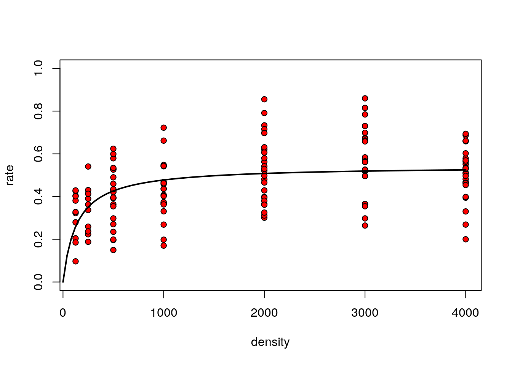


```r
g0<-ggplot(data=d,aes(x=density,y=rate))
g1<-g0+geom_point()
g1+geom_smooth(method="nls",formula=y~a*x/(1+a*x*H),method.args=list(start = c(a = 0.01,H=2)), se=FALSE)
```


The figure in the article shows the five models that were considered.


Note that models with a vigilance term could not be fit to the data directly due to lack of convergence.


### Calculating the R squared

The fit of the models in the paper is presented below.


R does not calculate R squared for non linear models by default. The reason is that statisticians do not accept this as a valid measure. However ecologists are used to seeing R squared values when models are fit. You can calculate them easily enough from a non linear model. First you need the sum of squares that is not explained by the fitted model. This is simply the variance multiplied by n-1.


```r
nullss<-(length(d$rate)-1)*var(d$rate)
nullss
```

```
## [1] 3.544056
```

We get the residual sum of squares (i.e. the unexplained variability) when we print the model


```r
HDmod
```

```
## Nonlinear regression model
##   model: rate ~ a * density/(1 + a * density * H)
##    data: d
##        a        H 
## 0.003966 1.841890 
##  residual sum-of-squares: 2.795
## 
## Number of iterations to convergence: 7 
## Achieved convergence tolerance: 3.807e-06
```

So, R squared is just one minus the ratio of the two.


```r
Rsq<-1-2.795/nullss
Rsq*100
```

```
## [1] 21.13555
```

Which agrees with the value given in the paper.


### Including the vigilance term

A very interesting aspect of this article is that the terms of the model were in fact measured independently.

Vigilance, which is defined as the proportion of the time spent being vigilant, rather than feeding, is included in most of the models which are presented in the paper as alternatives to the classic disk equation. Most of these are rather complex conditional models, but the simplest is model 2.

$$
R=\frac{(1-v)aD}{1+aDH}
$$


The vigilance parameter for model2 cannot be estimated from the data. However it was also measured independently.


Notice that vigilance is fundamentally independent of seed density within this range of densities. The measured value (approximately 0.4) can be included and the model refit with this value included.


```r
Vigmod<-nls(rate~(1-0.4)*a*density/(1+a*density*H),data = d,start = list(a =0.001,H=2)) 
confint(Vigmod)
```

```
## Waiting for profiling to be done...
```

```
##          2.5%      97.5%
## a 0.004321811 0.01115823
## H 1.028097415 1.18618719
```

When the measured vigilance is included in the model as an offset term the handling time is reduced by about a half. This makes sense. We may assume that most of the measured vigilance is in fact reducing the rate of feeding as the seed density is so high that search time is very small. However note that we could not possibly have fitted this model without some prior knowledge of the offset value.


## Quantile regression

Another way to look at the issue is to use an alternative approach to fitting statistical models. The traditional approach to fitting a model to data assumes that we are always interested in the centre of any pattern. The error term was classically assumed to be uninteresting random noise around an underlying signal. However in many situations this noise is actually part of the phenomenon we are studying. It may sometimes be attributed to *process error*, in other words variability in the process we are actually measuring, rather than error in our measurements. This may possibly be occurring here. If handling time in fact sets an upper limit on feeding rate, and if we can assume that feeding rate has been measured fairly accurately, then the upper part of the data cloud should be estimating true handling time. Birds that are feeding more slowly than this may be doing something else. For example, they may be spending time being vigilant. So there is possibly some additional information in the data that has not been used in the published paper.

We can use quantile regression to fit a non linear model around the top 10\% of the data and the bottom 10\%. 


```r
library(quantreg)
```

```
## Loading required package: SparseM
```

```
## 
## Attaching package: 'SparseM'
```

```
## The following object is masked from 'package:base':
## 
##     backsolve
```

```r
QuantMod90<-nlrq(rate~a*density/(1+a*density*H),data = d,start = list(a =0.001,H=2),tau=0.9)
QuantMod10<-nlrq(rate~a*density/(1+a*density*H),data = d,start = list(a =0.001,H=2),tau=0.1)
QuantPreds90 <- predict(QuantMod90, newdata = newdata)
QuantPreds10 <- predict(QuantMod10, newdata = newdata)
plot(rate~density,data=d,pch=21,bg=2,ylim=c(0,1))
lines(newdata$density,HDpreds,lwd=2, col=1)
lines(newdata$density,QuantPreds90,lwd=2,col=2)
lines(newdata$density,QuantPreds10,lwd=2,col=3)
```


If handling time limits the maximum rate at which seed can be consumed, then the estimate based on the upper 10\% of the data should be closer to the true handling time. So if we look at the summaries of these models we should be able to get a handle on vigilance without the prior knowledge.


```r
summary(QuantMod90)
```

```
## 
## Call: nlrq(formula = rate ~ a * density/(1 + a * density * H), data = d, 
##     start = list(a = 0.001, H = 2), tau = 0.9, control = list(
##         maxiter = 100, k = 2, InitialStepSize = 1, big = 1e+20, 
##         eps = 1e-07, beta = 0.97), trace = FALSE)
## 
## tau: [1] 0.9
## 
## Coefficients:
##   Value    Std. Error t value  Pr(>|t|)
## a  0.00821  0.00126    6.51352  0.00000
## H  1.37329  0.04688   29.29680  0.00000
```

```r
summary(QuantMod10)
```

```
## 
## Call: nlrq(formula = rate ~ a * density/(1 + a * density * H), data = d, 
##     start = list(a = 0.001, H = 2), tau = 0.1, control = list(
##         maxiter = 100, k = 2, InitialStepSize = 1, big = 1e+20, 
##         eps = 1e-07, beta = 0.97), trace = FALSE)
## 
## tau: [1] 0.1
## 
## Coefficients:
##   Value   Std. Error t value Pr(>|t|)
## a 0.00117 0.00052    2.25610 0.02557 
## H 2.64950 0.29736    8.91011 0.00000
```

The upper limit (pure handling time) is 1.37 (se= 0.047)

The lower estimate that may include time spent being vigilant is estimated using quantile regression as 2.65 (se= 0.31)

Vigilance thus could, arguably, be estimated as the difference between the upper and lower estimates of handling time divided by the upper value. As the uncertainty around these values has been provided by the quantile regression in the form of a standard error we can use a montecarlo prodedure to find confidence intervals by simulating from the distributions and finding the percentiles of the result.


```r
quantile((rnorm(10000,2.65,0.31)-rnorm(10000,1.37,0.047))/rnorm(10000,2.65,0.31),c(0.025,0.5,0.975))
```

```
##      2.5%       50%     97.5% 
## 0.2472801 0.4861285 0.7824305
```

This is within the range of the measured value.

There are some interesting elements here that could be discussed in the context of the explanation of the study methods and results.


## Summary

Many relationships in ecology do not form strait lines. If we only have data, and no underlying theory, we can fit a model to the underlying shape using traditional methods such as polynomials or more contemporary models such as splines and other forms of local weighted regression. However these models cannot be extrapolated beyond the data range.

A very different approach involves finding a model "from first principles". Often models are constrained to pass through the origin and by some fundamental limit (asymptote). Model fitting then involves finding a justifiable form for the curve lying between these two points. In some situations data can be used to "mediate" between competing models. In other situations the best we can achieve is to find justifiable estimates, with confidence intervals, for the parameters of a non linear model.


## Exercise

A researcher is interested in establishing a predicitive equation to estimate the heights of trees based on measurements of their diameter at breast height. Your task is to try to find a defensible model for three different data sets.


```r
pines1<-read.csv("https://tinyurl.com/aqm-data/pinus_allometry1.csv")
```


```r
oaks<-read.csv("https://tinyurl.com/aqm-data/quercus_allometry.csv")
```


```r
pines2<-read.csv("https://tinyurl.com/aqm-data/pinus_allometry2.csv")
```


