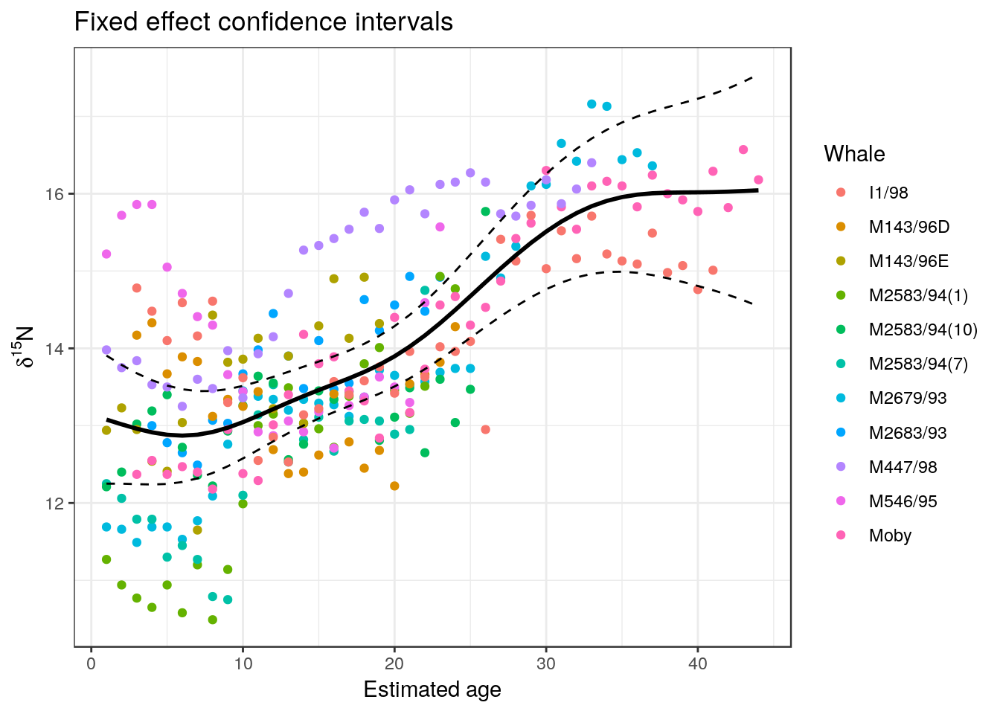

# Analysis of covariance, nested data and mixed effects


## Introduction

We've seen that regression is often not the best available technique to use for bivariate analysis.The books written by Zuur and associates show some of the big challenges involved in analysing real life ecological data. The idealised assumptions of linear regression are very rarely met in full.

Zuur writes **Always apply the simplest statistical technique on your data, but ensure it is applied correctly!** And here is a crucial problem. In ecology, the data are seldom modelled adequately by linear regression models. If they are, you are lucky. If you apply a linear regression model on your data, then you are implicitly assuming a whole series of assumptions, and once the results are obtained, you need to verify all of them. What should we do if we violate all the assumptions? The answer is simple: reject the model. But what do we do if we only violate one of the assumptions? And how much can we violate the assumptions before we are in trouble?

This sounds frightening. If model assumptions are rarely met, how can we ever trust them? Do we need the help of an expert statistician such as Alain Zuur to analyse all ecological data? Perhaps all we can use are simple tests. But do we really know that their assumptions hold?

The best advice to a student aiming to analyse data for an MSc dissertation is simply to always make the best possible attempt at diagnosing issues with the chosen analysis. Be aware of all the assumptions used and be critical at all times. But don't despair if some assumptions are not met. Always point out the problems when discussing the analysis. In many cases the issues will in fact turn out to be unimportant. The key message held within most data sets can often be extracted, even if models have minor violations of assumptions. In other cases there may be more serious problems. Sometimes a more advanced analysis than was orginally planned may be necessary. If you have spotted a problem and understand its implications, it could be easier than you think to build a slightly more complex model. You will not be the first person to have come across the issue. The biggest mistakes usually involve failing to account for lack of independence in the data. This chapter runs through an example of this in practice. The data initially seem simple enough.

An important issue arises when the same relationship between two variables is repeated multiple times in a data set. In the past you may have handled this situation by subsetting the data various times and repeating the analysis for each subset. However it is possible to build more oomprehensive models that look at a population of relationships.

## Whale teeth and isotope ratios

In Zuur et al. (2009) a rather complex analysis involving generalised additive models and correlated residuals is developed and justified as a means of ensuring that all model assumptions are met. The results of the analysis are also presented in a paper that shows how the statistical analysis was used to answer an interesting scientific question. It is well worth reading this paper before analysing the data.

The researchers aimed to piece together information regarding feeding behaviour and migration of Sperm whales, based on analysis of the composition of their teeth. Specifically they looked at carbon and nitrogen isotope ratios. N isotope ratios can be indicative of trophic position in marine communities. Trophic level is expected to be higher for larger individuals of the same species. Sperm whales are approximately 4m long at birth, with males growing to 18 m.The relative trophic position of the different stages in the life of several male sperm whales can be investigated through the use of N stable isotope ratios. It was expected that the trophic position would increase with age, as the animals become larger. 

Whale teeth have growth rings. To obtain data the researchers analysed isotope ratios from the bands of individual teeth. 


The first task in the analysis could be simply to establish that the expectation of increased N isotope ratio with age is supported by the data. We will concentrate on that before looking at more complex issues.


### Moby's tooth

Let's first look at a single tooth that was obtained from a famous whale called Moby that was washed up on the shores of the Firth of Forth in 1997 after many rescue attempts. Moby was 15.2 metres in length and weighed 38.5 tons.


Moby's bones went on display in the Royal Scottish Museum, Chamber's street soon after death. The original display failed to attract the public due to the appalling smell. 

Moby's skull has since been de-oderised and is now redisplayed. It has even been associated with a Turner prize.


Moby is clearly a star turn. But, how does his life history compare to that of other Sperm Whales? This is the topic we will analyse in this class.


```r
Whales<-read.csv("https://tinyurl.com/aqm-data/whaleteeth.csv")
Moby<-subset(Whales,Whale=="Moby")
```

## Plotting the data

We should first plot the data to look at the pattern. Notice the way a more complex label is set up for the y axis. There are many tricks such as this in R that are rather hard to discover. If you need to use Greek symbols on the axes of your own figures try adapting this code.


```r
ylabel <-expression(paste(delta^{15}, "N"))
xlabel<-"Estimated age"


library(ggplot2)
theme_set(theme_bw())
g0<-ggplot(data=Moby,aes(x=Age,y=X15N))
g1<-g0+geom_point() +xlab(xlabel) +ylab(ylabel)
g1
```


## Fitting a regression

OK, so this all looks quite simple at this stage. The data points lie more or less along a straight line. So we could fit a regression.


```r
mod<-lm(data=Moby,X15N~Age)
summary(mod)
```

```
## 
## Call:
## lm(formula = X15N ~ Age, data = Moby)
## 
## Residuals:
##      Min       1Q   Median       3Q      Max 
## -1.07102 -0.28706  0.04346  0.33820  1.13724 
## 
## Coefficients:
##              Estimate Std. Error t value Pr(>|t|)    
## (Intercept) 11.748940   0.163559   71.83   <2e-16 ***
## Age          0.113794   0.006186   18.40   <2e-16 ***
## ---
## Signif. codes:  0 '***' 0.001 '**' 0.01 '*' 0.05 '.' 0.1 ' ' 1
## 
## Residual standard error: 0.4859 on 40 degrees of freedom
## Multiple R-squared:  0.8943,	Adjusted R-squared:  0.8917 
## F-statistic: 338.4 on 1 and 40 DF,  p-value: < 2.2e-16
```


```r
g1+stat_smooth(method="lm")+labs(y = ylabel,x=xlabel)
```


### Diagnostics

Diagnostics show that most of the assumptions of a regression appear to be met. However an issue shows up when we look at the first diagnostic plot.


```r
plot(mod,which=1)
```


There is a clear pattern in the residuals.


### Testing for serial correlation

In fact the residuals are serially correlated. This can be checked using a Durbin Watson test.


```r
library(lmtest)
dwtest(Moby$X15N~Moby$Age)
```

```
## 
## 	Durbin-Watson test
## 
## data:  Moby$X15N ~ Moby$Age
## DW = 1.1458, p-value = 0.0009539
## alternative hypothesis: true autocorrelation is greater than 0
```

We can confirm this using the acf function.


```r
acf(residuals(mod))
```


If any of the lines apart from the first extends above or below the blue line the data are significantly serially correlated. In other words the last value can be used to partially predict the next value. If one residual is negative, the next is also likely to be negative and vice versa. The correlation is significant at lag 1 and lag 2.


## Interpreting the results

Does the serial correlation matter? Well in a purely statistical sense it could matter quite a lot. Zuur et al take the effect into account through the use of a rather cunning statistical trick using an ARIMA model. However most MSc students would be unlikely to be aware of this rather advanced method. In this context it is not really worth the effort. The only real difference between a model that includes autocorrelation and one that does not involves the size of the p-value and the width of the confidence bands. Providing that a straight line is a reasonable description of the underlying pattern (and we will come on to that later), the model is not changed.

There is something much more important to consider however. We have spotted the serial correlation (lack of independence) between years that occurs in the case of Moby. However, you may have realised that in reality all the data we have just analysed are totally lacking in independence anyway! They have been taken from a single whale. So, in one sense we have been conducting statistics with a sample size of one. 

In effect, the relationship that we have established applies only to Moby. It would also be really nice to have data from some other teeth from Moby to check even this. We certainly cannot generalise it to other whales. We may have found out some interesting information along the way. The researchers were interested in understanding the trophic ecology of mature sperm whales in some detail. If they are right in assuming that high levels of delta N are associated with feeding on larger prey then there may be some indication that Moby spent several years in a row feeding on prey that may have been larger than expected for his age, followed by a switch to rather smaller prey. This is quite a speculative interpretation, but it may tell us something.


## Exercise

Now try implementing an appropriate method to look at alternatives to a straight line to capture the **empirical** relationship between age and delta N measurements in Moby's tooth. Comment on your findings.

## Finding a general pattern

We actually have data for fifteen whales. So we could compare the pattern shown by Moby with the population of whale teeth.
So let's plot out the data from all fifteen whales at once.


```r
g0<-ggplot(data=Whales,aes(x=Age,y=X15N,col=Whale))
g1<-g0+geom_point() + xlab(xlabel) +ylab(ylabel)
g1
```


There is still a clear pattern, but with much more scatter this time. This is to be expected, as each whale has its own life history that contributes variability.

We can look at this by plotting out the data for each individual whale using a facet wrap to split the data.


```r
g0<-ggplot(data=Whales,aes(x=Age,y=X15N))
g1<-g0+geom_point()+geom_line()+ labs(y = ylabel,x=xlabel)
g1+facet_wrap("Whale")
```


Each whale seems to have its own pattern. Most are approximately linear, like Moby, but some show a very different pattern 

For the moment we will ignore this and continue to fit a simple regression model to all the data. Note **THIS IS THE WRONG WAY TO WORK WITH THE DATA!**


```r
mod1<-lm(X15N~Age,data=Whales)
summary(mod1)
```

```
## 
## Call:
## lm(formula = X15N ~ Age, data = Whales)
## 
## Residuals:
##     Min      1Q  Median      3Q     Max 
## -2.5041 -0.7013 -0.1141  0.6209  3.3444 
## 
## Coefficients:
##              Estimate Std. Error t value Pr(>|t|)    
## (Intercept) 12.228411   0.108598   112.6   <2e-16 ***
## Age          0.095715   0.005631    17.0   <2e-16 ***
## ---
## Signif. codes:  0 '***' 0.001 '**' 0.01 '*' 0.05 '.' 0.1 ' ' 1
## 
## Residual standard error: 0.9953 on 305 degrees of freedom
## Multiple R-squared:  0.4865,	Adjusted R-squared:  0.4848 
## F-statistic: 288.9 on 1 and 305 DF,  p-value: < 2.2e-16
```

```r
confint(mod1)
```

```
##                   2.5 %     97.5 %
## (Intercept) 12.01471479 12.4421063
## Age          0.08463424  0.1067958
```

The problem with this model is that we have far too many degrees of freedom. The model has assumed that each data point is independent, which clearly is not true. 


## Analysis of covariance

The data that we have available to predict N15 levels consists of two variables. One is Age and the other is the identity of the individual whale from which the data was obtained. This is a categorical variable. If we continue to put to one side the issue of independence of the data points within the regression for each whale we can analyse the data using a technique known as analysis of covariance. 

Analysis of covariance takes into account the differences between each group of observations. It is used to answer the following questions.

*  Does the level of a categorical factor affect the response variable?
*  Does the slope of a regression line differ between levels of the categorical
variable?

In our case the first question implies that each whale may have a different mean value for $\delta^{15}N$. If you read the paper carefully you will see that the researchers were aware that this is a rather trivial question. They looked at more subtle differences related to time of birth and life history. However we will ignore this for the moment too and carry out the analysis in order to illustrate the point.

As mentioned previously, R has a very consistent syntax that makes model fitting very easy. All we need to do to add in an effect for each whale to the model is to write lm(X15N~Age+Whale). The line of R code preceding this sets the contrasts for the model. This determines the output from the summary of the model. In this case we want to contrast the results for other whales with Moby (number 11 in the list).


```r
contrasts(Whales$Whale)<-contr.treatment(levels(Whales$Whale),base=11)
mod2<-lm(X15N~Age+Whale,data=Whales)
anova(mod2)
```

```
## Analysis of Variance Table
## 
## Response: X15N
##            Df Sum Sq Mean Sq F value    Pr(>F)    
## Age         1 286.21 286.215 431.039 < 2.2e-16 ***
## Whale      10 106.27  10.627  16.004 < 2.2e-16 ***
## Residuals 295 195.88   0.664                      
## ---
## Signif. codes:  0 '***' 0.001 '**' 0.01 '*' 0.05 '.' 0.1 ' ' 1
```

```r
summary(mod2)
```

```
## 
## Call:
## lm(formula = X15N ~ Age + Whale, data = Whales)
## 
## Residuals:
##      Min       1Q   Median       3Q      Max 
## -1.70699 -0.51434 -0.07552  0.47030  2.64139 
## 
## Coefficients:
##                    Estimate Std. Error t value Pr(>|t|)    
## (Intercept)       12.256788   0.174661  70.175  < 2e-16 ***
## Age                0.092183   0.005159  17.869  < 2e-16 ***
## WhaleI1/98        -0.010461   0.181371  -0.058  0.95404    
## WhaleM143/96D     -0.229444   0.220575  -1.040  0.29909    
## WhaleM143/96E      0.385063   0.235813   1.633  0.10355    
## WhaleM2583/94(1)  -0.936579   0.216095  -4.334 2.01e-05 ***
## WhaleM2583/94(10) -0.357032   0.209785  -1.702  0.08983 .  
## WhaleM2583/94(7)  -0.901441   0.223214  -4.038 6.87e-05 ***
## WhaleM2679/93     -0.059622   0.185189  -0.322  0.74772    
## WhaleM2683/93      0.267238   0.227314   1.176  0.24069    
## WhaleM447/98       1.210339   0.192499   6.288 1.16e-09 ***
## WhaleM546/95       0.685273   0.219544   3.121  0.00198 ** 
## ---
## Signif. codes:  0 '***' 0.001 '**' 0.01 '*' 0.05 '.' 0.1 ' ' 1
## 
## Residual standard error: 0.8149 on 295 degrees of freedom
## Multiple R-squared:  0.6671,	Adjusted R-squared:  0.6547 
## F-statistic: 53.73 on 11 and 295 DF,  p-value: < 2.2e-16
```

The anova result is very clear. There is a significant additive effect that can be attributed to the individual. So we can see that whales do differ in their baseline N15 levels. In order to interpret the model summary you need to be aware that the intercept represents the value at age zero for Moby, which was set to be the "control" or baseline for the contrasts. The other whale values are compared to the baseline. Thus if a coefficient for an individual whale is not significant it means that the intercept for that whale was not different to that of Moby. 

So, the answer to the first question, just as we would expect, is a definite yes. Six of the ten whales that we compared with Moby have significantly different levels of N15 after allowing for age.

How do we answer the second question? This involves adding an interaction term to the model. The interaction implies that each whale could have it's own intercept AND it's own slope. If the interaction term is significant then we have a very complex model that cannot be easily generalised.


```r
mod3<-lm(X15N~Age*Whale,data=Whales)
anova(mod3)
```

```
## Analysis of Variance Table
## 
## Response: X15N
##            Df  Sum Sq Mean Sq F value    Pr(>F)    
## Age         1 286.215 286.215 734.509 < 2.2e-16 ***
## Whale      10 106.266  10.627  27.271 < 2.2e-16 ***
## Age:Whale  10  84.828   8.483  21.769 < 2.2e-16 ***
## Residuals 285 111.055   0.390                      
## ---
## Signif. codes:  0 '***' 0.001 '**' 0.01 '*' 0.05 '.' 0.1 ' ' 1
```


The interaction term is highly significant. This is not suprising when we consider the lattice plot, which showed a series of very different patterns for each whale.

If we summarise the model now we will obtain even more complex output which shows how the coefficients depend on the identity of each whale.


```r
summary(mod3)
```

```
## 
## Call:
## lm(formula = X15N ~ Age * Whale, data = Whales)
## 
## Residuals:
##      Min       1Q   Median       3Q      Max 
## -1.58547 -0.40951 -0.01552  0.37746  2.41087 
## 
## Coefficients:
##                        Estimate Std. Error t value Pr(>|t|)    
## (Intercept)           11.748940   0.210125  55.914  < 2e-16 ***
## Age                    0.113794   0.007947  14.320  < 2e-16 ***
## WhaleI1/98             1.464565   0.303845   4.820 2.34e-06 ***
## WhaleM143/96D          1.905086   0.376915   5.054 7.73e-07 ***
## WhaleM143/96E          0.720710   0.364725   1.976 0.049115 *  
## WhaleM2583/94(1)      -1.517527   0.336649  -4.508 9.58e-06 ***
## WhaleM2583/94(10)      0.747337   0.328174   2.277 0.023512 *  
## WhaleM2583/94(7)      -0.559979   0.346500  -1.616 0.107179    
## WhaleM2679/93         -0.750516   0.296705  -2.529 0.011962 *  
## WhaleM2683/93          0.509286   0.412830   1.234 0.218351    
## WhaleM447/98           1.557803   0.305940   5.092 6.45e-07 ***
## WhaleM546/95           3.269282   0.341382   9.577  < 2e-16 ***
## Age:WhaleI1/98        -0.065573   0.011918  -5.502 8.36e-08 ***
## Age:WhaleM143/96D     -0.142106   0.022432  -6.335 9.23e-10 ***
## Age:WhaleM143/96E     -0.004390   0.027327  -0.161 0.872476    
## Age:WhaleM2583/94(1)   0.065493   0.020050   3.267 0.001222 ** 
## Age:WhaleM2583/94(10) -0.065797   0.018155  -3.624 0.000343 ***
## Age:WhaleM2583/94(7)  -0.007142   0.022432  -0.318 0.750421    
## Age:WhaleM2679/93      0.041481   0.012471   3.326 0.000996 ***
## Age:WhaleM2683/93     -0.001922   0.025478  -0.075 0.939929    
## Age:WhaleM447/98      -0.012176   0.013906  -0.876 0.381993    
## Age:WhaleM546/95      -0.194624   0.021171  -9.193  < 2e-16 ***
## ---
## Signif. codes:  0 '***' 0.001 '**' 0.01 '*' 0.05 '.' 0.1 ' ' 1
## 
## Residual standard error: 0.6242 on 285 degrees of freedom
## Multiple R-squared:  0.8112,	Adjusted R-squared:  0.7973 
## F-statistic: 58.33 on 21 and 285 DF,  p-value: < 2.2e-16
```

Now we can see that six of the whales do not just have a different baseline level of $\delta^{15}N$ to Moby, the change over time when modelled as a linear response is also different for these individuals.


### More about interactions

The model above could also be written in R longhand as:


```r
mod3<-lm(X15N~Age+Whale+Age:Whale,data=Whales)
```

The {*} symbol is simply short hand for this. It does not imply multiplication. The interaction component is Age:Whale. Don't confuse statistical interactions with ecological interactions such so those that occur in a food web. A statistical interaction implies that we need to know additional information in order to predict something. For example if an experiment showed an interaction between nitrogen fertilizer level and soil type we could not be sure that adding nitrogen always enhances growth in the same way. Perhaps it has no effect at all when applied to heavy clay soils, although it increases growth generally.
Finding interactions suggest complexity. This can often be interesting in itself.


### Plotting the model

The model with interactions can be plotted using ggplots as a series of individual regression lines for each whale. Notice that the slope differs between each of the panels. 


```r
g0<-ggplot(data=Whales,aes(x=Age,y=X15N,group=Whale))
g1<-g0+geom_point()+ labs(y = ylabel,x=xlabel) +geom_smooth(method="lm")
g1+facet_wrap("Whale")
```


# Introducing mixed effects modelling

Analysis of covariance is often used when there are a small number of factor levels. If we had two or three whales either subsetting for each whale or analysis of covariance would be the only appropriate methods. There would not be enough replication to think about the data as having been drawn from a larger population of whales that it could represent. Each case would be treated as being distinct. However, as we get more data analysis of covariance becomes clumsy and less appropriate as a technique. We can see that in this example. A **mixed effects** model treats each level of a factor as a **random effect**. This is a powerful technique when we have enough data as we are effectively trying to draw out some underlying population level pattern, which we may want to use when comparing the response of each individual. Mixed effects modelling also has some advantages for data sets with missing data or unbalanced numbers of observations for each group.

The example was adapted from Zuur's book on mixed effects models. Mixed effects are also known as hierarchical models. It is important to be aware of the potential usefulness of such models and the difference between fixed and random effects. The last model we fitted used a regression equation for each whale in turn. This approach assumes the identity of the whale is a fixed factor. We need to know each whale's name in order to use the model! If we want to generalise for all whales we would be much better to think of the whales as compromising a random sample from all the whales that we might have found. 

The following R code uses a mixed effects model approach to fit a separate regression line for each whale. To cut a long story short, and to simplify the overall idea, you may think of the result as being rather similar to taking the mean slope and intercept from all the individual regressions and finding confidence intervals for the pooled result. This was a traditional way of analysing data of this type and it is still used by some researchers. It is not "wrong" in essence, but modern methods are both easier to apply and more formally correct due to the manner in which unbalanced samples are handled. 
Look at the plot we produced for a regression fitted to each whale to get an idea of what the model is based on. Imagine averaging the slopes and intercepts shown in this figure in order to get an intuitive idea of the basis for the model.

## Using the nlme package

The nlme package name stands for "non linear mixed effects". It has some poweful functions for fitting non linear models with random effects. More recently the lme4 package has become more popular for linear mixed effects as the algorithm used is prefered by mathematical statisticians. In almost all applied situations the results from using either package for linear mixed effects models are identical. Plotting the models is easy using nlme as the package has a grouping function for the data and a series of default plots that use the lattice package. Lattice plots have now largely given way to ggplots when formally presenting results as ggplots are more flexible and nicer looking. However the default in nlme is easy to use and easy to interpret.

### Intercept only model


```r
library(nlme)
w<-groupedData(X15N~Age|Whale,Whales)
intercept.mod<-lme(X15N~Age,random=~1|Whale,data=w)
print(plot(augPred(intercept.mod,level=c(0,1))))
```


### Random slopes model


```r
slope.mod<-lme(fixed=X15N~Age,random=X15N~Age|Whale,data=w)
print(plot(augPred(slope.mod,level=c(0,1))))
```


The fixed effect is the underlying trend of increasing $\delta^{15}N$ levels with age. The random effect is the variation in slope and intercept between whales. We can test which model is prefered on statistical criteria by comparing them.


```r
anova(intercept.mod,slope.mod)
```

```
##               Model df      AIC      BIC    logLik   Test  L.Ratio p-value
## intercept.mod     1  4 792.3965 807.2777 -392.1982                        
## slope.mod         2  6 669.3825 691.7044 -328.6913 1 vs 2 127.0139  <.0001
```

So the slope model provides a significantly better fit to the data, just as we found when taking whale as a fixed effect.

#### Confidence intervals for the effects


```r
intervals(slope.mod)
```

```
## Approximate 95% confidence intervals
## 
##  Fixed effects:
##                   lower        est.      upper
## (Intercept) 11.60509740 12.41013148 13.2151656
## Age          0.03376861  0.07914293  0.1245172
## attr(,"label")
## [1] "Fixed effects:"
## 
##  Random Effects:
##   Level: Whale 
##                            lower        est.      upper
## sd((Intercept))       0.84344384  1.33071563  2.0994926
## sd(Age)               0.04669552  0.07443052  0.1186389
## cor((Intercept),Age) -0.97238683 -0.90157346 -0.6787395
## 
##  Within-group standard error:
##     lower      est.     upper 
## 0.5750660 0.6242716 0.6776874
```

By taking into account the lack of independence we now get a much wider confidence intervals for the coefficients than we did when we very naively fitted a regression to the pooled data without taking into account the identity of the whale from which the data was obtained. However we now have a generalisable model based on a sample of size of n=15, rather than the model with far too many degrees of freedom. The mixed model is better than the model used in the analysis of covariance, as this could only be used for prediction if you provide the identity of the particular whale that you are interested in.

Notice that the parameters estimated for the random effects are standard deviations. If you can imagine actually fitting all 15 separate models, writing down the interecept and the slope 15 times and finding the mean and standard deviation of each you have approximated the operation carried out by the mixed effects modelling.  The standard deviations are approximations, so there are also confidence intervals for these provided by the full fitted model.

There is a whole lot more to mixed effects modelling, but this result is quite simple to understand in this context. It provides a robust solution to the issue of finding confidence intervals for the mean slopes and intercepts when analysis of covariance shows that seperate regression models are needed for each level of a factor, but we do want to treat the levels of the factor as random draws from a population as there are too many factor levels to be concerned with comparisons between each one. Mixed effects also handles unbalanced samples, as if one whale has fewer observations the overall model gives the data less weight. 

Finding an underlying trend in N15 levels is only part of the story told in the paper. An issue that has been set well to one side in this still simplified example is whether a linear regression is the best approach to finding an underlying pattern. In fact Zuur et al used GAMs in order to capture the non linear relationship that some individuals seem to have.

## Using the package lme4

The alternative package to nlme is lme4. This uses a more sophisticated approach to actually fiting the model that is considered more reliable mathematically by some statisticians. In most real life situations there is little difference between the results from each package and they can usually be used interchangeably. 

A slightly unusual aspect of lme4 is that it does not provide p-values for the test of signficance of the effects by default. This was a deliberate decision made by the author of the package (Douglas Bates). The argument is that the degrees of freedom are ill-defined for many technical reasons. As p-values are only really useful if a statistic such as t is close to the boundary of significance the argument goes that there is no point in calculating them unless they are exact. A t value of 3 is going to be significant whatever and a t value of 1 will not be.  However some people demand p-values and they can be calculated quite easily. The package Lmertest adds these calculations to the output of lme4.

The syntax used to fit the models is slightly different but follows the same general pattern as nlme. A random effect for the intercept alone is written as (1|Whale).


```r
library(lmerTest)
intercept.mod2<-lmer(X15N~Age+(1|Whale),data=w)
intercept.mod2
```

```
## Linear mixed model fit by REML ['lmerModLmerTest']
## Formula: X15N ~ Age + (1 | Whale)
##    Data: w
## REML criterion at convergence: 784.3965
## Random effects:
##  Groups   Name        Std.Dev.
##  Whale    (Intercept) 0.6139  
##  Residual             0.8149  
## Number of obs: 307, groups:  Whale, 11
## Fixed Effects:
## (Intercept)          Age  
##    12.25874      0.09245
```

```r
anova(intercept.mod2)
```

```
## Type III Analysis of Variance Table with Satterthwaite's method
##     Sum Sq Mean Sq NumDF  DenDF F value    Pr(>F)    
## Age 216.11  216.11     1 301.39  325.46 < 2.2e-16 ***
## ---
## Signif. codes:  0 '***' 0.001 '**' 0.01 '*' 0.05 '.' 0.1 ' ' 1
```

The slope model can be fit in the same way.


```r
slope.mod2<-lmer(X15N~Age+(Age|Whale),data=w)
slope.mod2
```

```
## Linear mixed model fit by REML ['lmerModLmerTest']
## Formula: X15N ~ Age + (Age | Whale)
##    Data: w
## REML criterion at convergence: 657.3826
## Random effects:
##  Groups   Name        Std.Dev. Corr 
##  Whale    (Intercept) 1.33124       
##           Age         0.07446  -0.90
##  Residual             0.62427       
## Number of obs: 307, groups:  Whale, 11
## Fixed Effects:
## (Intercept)          Age  
##    12.41013      0.07914  
## convergence code 0; 1 optimizer warnings; 0 lme4 warnings
```

```r
anova(slope.mod2)
```

```
## Type III Analysis of Variance Table with Satterthwaite's method
##     Sum Sq Mean Sq NumDF  DenDF F value   Pr(>F)   
## Age 4.5882  4.5882     1 9.8319  11.773 0.006585 **
## ---
## Signif. codes:  0 '***' 0.001 '**' 0.01 '*' 0.05 '.' 0.1 ' ' 1
```

### Profile confidence intervals

A more accurate, but much slower, profiling technique is used to calculate confidence intervals in lme4. The result may be slightly different from nlme.


```r
# Note that this takes around 30 seconds to run as it is based on simulated profiling
confint.merMod(slope.mod2) 
```

```
##                   2.5 %     97.5 %
## .sig01       0.85660240  2.0833944
## .sig02      -0.97150830 -0.6859207
## .sig03       0.04712678  0.1173118
## .sigma       0.57633298  0.6792690
## (Intercept) 11.57425698 13.2460978
## Age          0.03191633  0.1262261
```

## Ggplots from lme output

The lme4 package does not include the augpred function. However it is easy to reproduce the same sort of figures using ggplots. The trick is to predict the fixed effect alone and the fixed and random effects for each data point then add the results to the figure as lines.


```r
Whales$fixed<-predict(slope.mod2,re.form=NA)
Whales$rand<-predict(slope.mod2)
```


```r
g0<-ggplot(Whales,aes(x=Age,y=X15N))
g1<-g0+geom_point()
g1<-g1+geom_line(aes(x=Age,y=fixed),colour=2,lwd=1) 
g1<-g1+geom_line(aes(x=Age,y=rand),colour=3,lwd=1) 
g1<-g1+labs(y = ylabel,x=xlabel,title="Fixed and random effects")
g1+facet_wrap("Whale") 
```


## Mixed effect gamm models

You could argue (rightly), after looking at al the data. that straight lines do not provide a good model for the pattern in the data at all. However analyses are not just about finding the best fitting model. The model has to have some underyling purpose and feed into some narrative about the data. A fitted linear trend is often used as an easily communicated baseline for comparison rather than as a perfect model for the data. So it may still be useful to be able to state how much "on avererage" you expect $\delta^{15}N$ levels to increase per year.

It is however possible to fit smoothers using a mixed effects approach. The approach could be "overkill"  for some purposes. If you just need to find the overall average change in $\delta^{15}N$ per year it would not be useful. However it could also help show the differences between the pattern for each whale and so fit the overall population level pattern if the trend is not linear.

So .. and do note that this is rather advanced stuff that is not an essential part of the course, I will show how this can be done using the gamm4 package in R.

Fitting the model uses the same syntax, but with a smooth term for the fixed effects. The interepretation of the smoother is more difficult.


```r
library(gamm4)
gamm.mod<-gamm4(X15N~s(Age),data=w,random = ~ (Age|Whale))
gamm.mod
```

```
## $mer
## Linear mixed model fit by REML ['lmerMod']
## REML criterion at convergence: 619.3
## Random effects:
##  Groups   Name        Std.Dev. Corr 
##  Whale    (Intercept) 1.35294       
##           Age         0.07361  -0.91
##  Xr       s(Age)      2.66779       
##  Residual             0.57755       
## Number of obs: 307, groups:  Whale, 11; Xr, 8
## Fixed Effects:
## X(Intercept)    Xs(Age)Fx1  
##      13.8111       -0.2626  
## 
## $gam
## 
## Family: gaussian 
## Link function: identity 
## 
## Formula:
## X15N ~ s(Age)
## 
## Estimated degrees of freedom:
## 5.66  total = 6.66 
## 
## lmer.REML score: 619.3
```

The only real way to understand any model based on a smoother is to plot it out. The effects can be extracted and added to plots.


```r
Whales$fixed<-predict(gamm.mod$gam)
Whales$rand<-predict(gamm.mod$mer)
```


```r
g0<-ggplot(Whales,aes(x=Age,y=X15N))
g1<-g0+geom_point()
g1<-g1+geom_line(aes(x=Age,y=fixed),colour=2,lwd=1) 
g1<-g1+geom_line(aes(x=Age,y=rand),colour=3,lwd=1) 
g1<-g1+labs(y = ylabel,x=xlabel,title="Fixed and random splines")
g1+facet_wrap("Whale") 
```


Notice that there is now an overall curve for the fixed effect with separate curves for each whale. The overall fixed effect model is the average of all these curves.

It is possible to go one step futher and add confidence intervals to a fixed effect plot, because the standard error for the fixed effects can also be found


```r
Whales$fixedse<-predict(gamm.mod$gam,se=T)$se
```


```r
g0<-ggplot(Whales,aes(x=Age,y=X15N))
g1<-g0+geom_point()
g1<-g1+geom_line(aes(x=Age,y=fixed),colour=2,lwd=1) 
g1<-g1+geom_line(aes(x=Age,y=fixed+2*fixedse),colour=2,lty=2) 
g1<-g1+geom_line(aes(x=Age,y=fixed-2*fixedse),colour=2,lty=2)
g1<-g1+geom_line(aes(x=Age,y=rand),colour=3,lwd=1) 
g1<-g1+labs(y = ylabel,x=xlabel,title="Fixed and random splines")
g1+facet_wrap("Whale") 
```


The real reason for all this in practice would be to compare the overall pattern with that shown by each individual whale. The overall fixed effect as fitted by a spline may be a useful model as a general description of the pattern shown by the population. The normal caveats about the representativiness of the sample apply of course. In this particular case there is also the issue that the whales may have lived at different periods.

Notice that the confidence intervals for the smoother are now much wider than you would obtain if the random effect of each whale was not included in the model. This is because the sample size is effectively only 15 and the random variability between whales is being properly taken into account. The model potentially generalises to the population from which the sample (n=15) was taken.


```r
g0<-ggplot(Whales,aes(x=Age,y=X15N,col=Whale))
g1<-g0+geom_point()
g1<-g1+geom_line(aes(x=Age,y=fixed),colour=1,lwd=1) 
g1<-g1+geom_line(aes(x=Age,y=fixed+2*fixedse),colour=1,lty=2) 
g1<-g1+geom_line(aes(x=Age,y=fixed-2*fixedse),colour=1,lty=2)
g1<-g1+labs(y = ylabel,x=xlabel,title="Fixed effect confidence intervals")
g1
```



Look at the difference between the "naive" smooth that overpredicts by just using all the points as if they were all independent and the much more robust model that is based on the population level fixed effect.


```r
g0<-ggplot(Whales,aes(x=Age,y=X15N))
g1<-g0+geom_point()
g1<-g1+geom_line(aes(x=Age,y=fixed),colour=1,lwd=1) 
g1<-g1+geom_line(aes(x=Age,y=fixed+2*fixedse),colour=1,lty=2) 
g1<-g1+geom_line(aes(x=Age,y=fixed-2*fixedse),colour=1,lty=2)
g1<-g1+labs(y = ylabel,x=xlabel,title="Fixed and random CIs")
g1+geom_smooth(method="gam",formula=y~s(x))
```


You should also notice that the general shape of the response is still very similar. The point of going through all the process of modelling the random effect is just to reveal how much (or how little) confidence we have that the shape of the response can be generalised. The appropriate model for the data takes into account the small sample of whales, even though there are many individual data points.
The message seems to be that whales begin to feed on similar sized food items overall once they reach an age of 30 years.

## Summary

This example shows that a lot can be learned about the data by first applying relatively simple (and statistically incorrect) techniques, even though the models that are first tried will later need major modification in order to prevent violations of assumptions. Once all the issues have been spotted, solutions can usually be found, although they may involve using more advanced techniques used in combination. This approach may need help from a more experienced analyst. The problem of lack of independence are very common in many data sets. You can explore the data using simple techniques in the knowledge that an ajustment may be needed before finally presenting results in order to ensure the findings are robust from a statistical perspective.

Notice that constructing the more sophisticated models doesn't necessarily change the underlying message in the data. If we divide models into an informative component, that we are most interested in, and a stochastic component (variability) that is of less scientific interest, then the statistical sophistication is largely needed mainly to produce a better model for the stochastic element. Looking at the data carefully will usually produce insight into the scientific issu. Finding the right model allows us to produce more defensible confidence intervals (or p-values), even though our basic conclusions may not change. This is a common element in statistical modelling. Don't expect complex models to necessarily "tell you more" than simpler models. 
This may look like a lot of work for little reward, but the fundamental reason for using more sophisticated models is to reduce the number of assumptions that are being violated and thus carry out truly reproducible research. In this case we end up with a generalised pattern based on the data that we are not overly confident about, but may be a useful summary of the general trend at the population level. So while we would not be suprised at all to find whale teeth that follow very different patterns to that shown in Moby's particular case, we would confidently expect that a new sample of fifteen whales would produce a similar pattern to that found using the mixed effects model, providing the sample has been drawn from the same potential population.

The example has also been used to introduce analysis of covariance, a technique that uses both a categorical variable (factor) and a numerical variable as explanatory variables in the model formula. You can now apply the technique to slightly simpler data in the examples below in order to practice.


### Exercises

1. Analysis of covariance can be used to look in more detail at the mussels data again. You first have to make sure that R treats site as a factor.


```r
Mussels<-read.csv("https://tinyurl.com/aqm-data/mussels.csv")
Mussels$Site<-as.factor(Mussels$Site) 
```

Use linear analysis of covariance.

Is there a difference in the relationship between BTvolume and shell length between sites? 
How did you reach your conclusion?

2. Soybean growth curves

Try these growth curves. They are best fit using **non-linear** mixed effects, but you could still try using the methods above for this exercise.


```r
data("Soybean")
d<-subset(Soybean,Soybean$Variety=="F")
d<-subset(d,d$Year==1990)
g0<-ggplot(d,aes(x=Time,y=weight))
g1<-g0+geom_point()
g1+facet_wrap("Plot")
```


3. Here is another similar but very difficult data set to practice on (optional). It has also been analysed by Zuur. The measurements are lengths and ash free dry weight (AFD) of 398 wedge clams (Donax hanleyanus) taken from a beach in Argentina during six different months (Ieno, unpublished data).  The main issue is the extremely unbalanced nature of the data. Can we do anything useful at all with this tricky observational data set? There are limits that even the most sophisticated statistics cannot remove.


```r
Clams<-read.table("https://tinyurl.com/aqm-data/Clams.txt",head=T)
Clams$MONTH<-as.factor(Clams$MONTH) 
```

The data frame already contains log transformed versions of the variables. Try first fitting a regression to the untransformed data and then use the transformed version. Which is most suitable for modelling using regression? Now use analysis of covariance to investigate the effect of month on the relationship. Does this work?  What would you do if faced with real life data of this sort?


