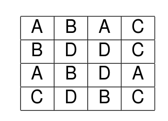
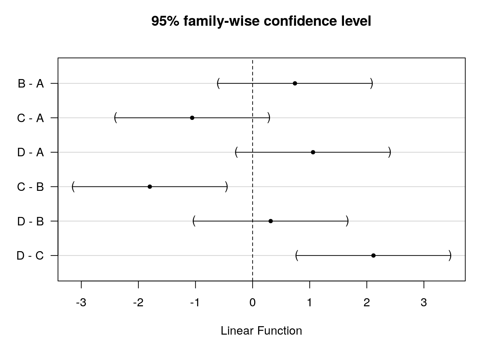
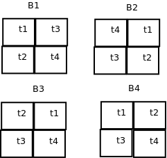
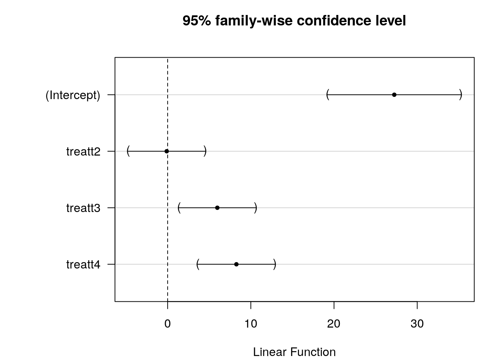
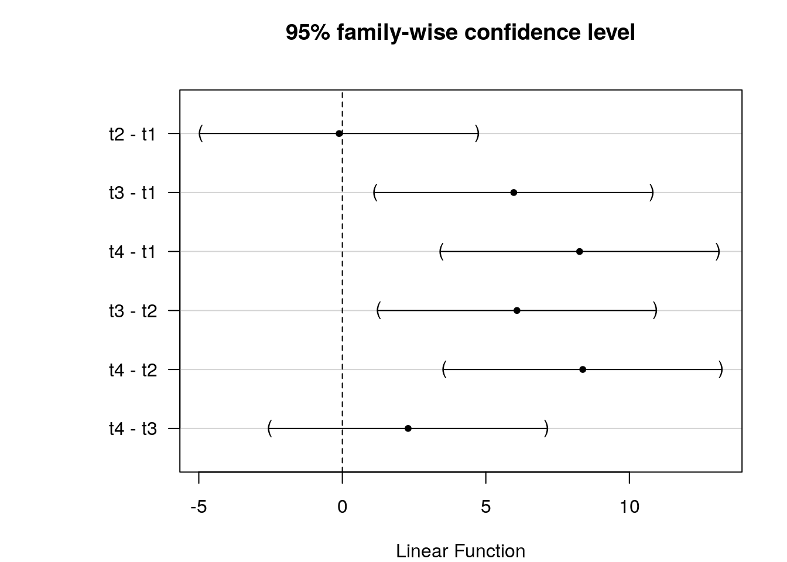
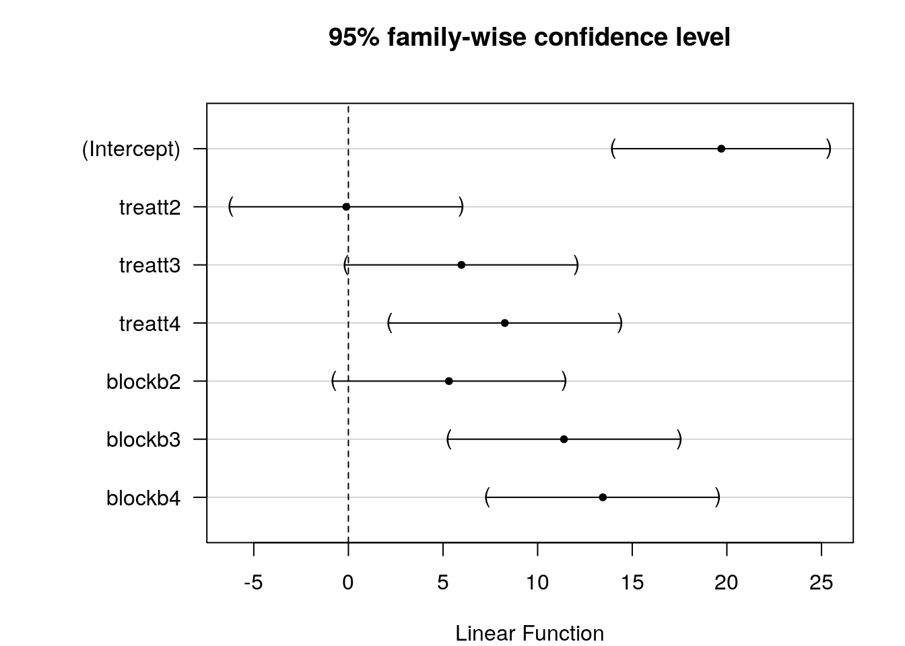
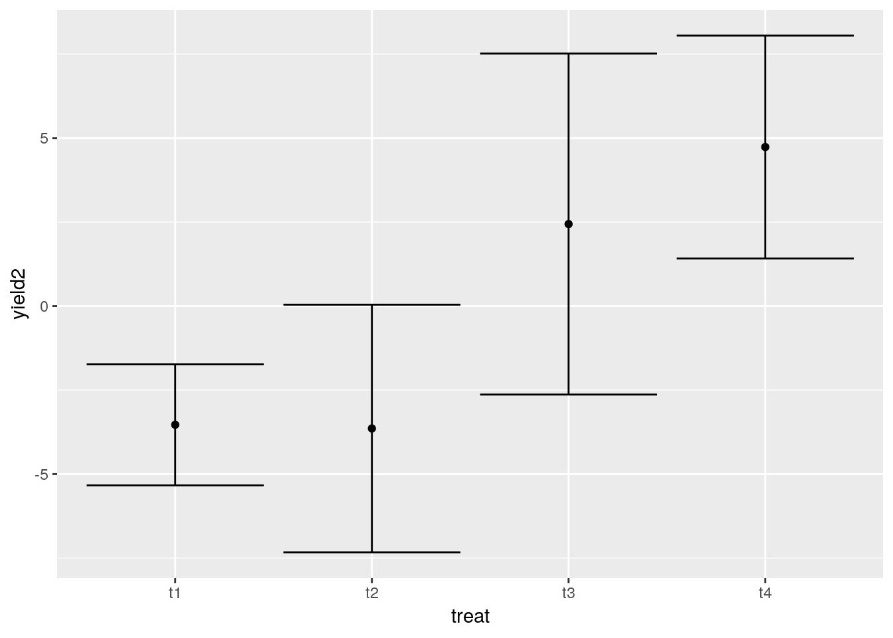
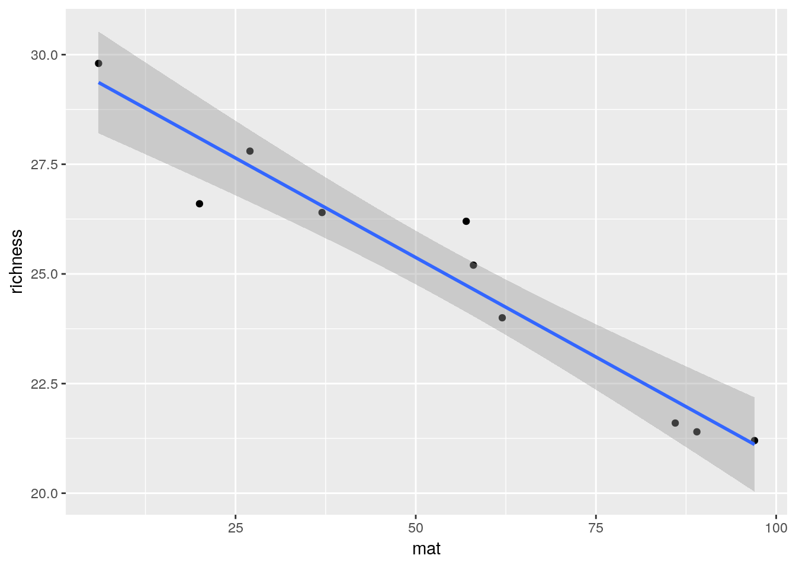
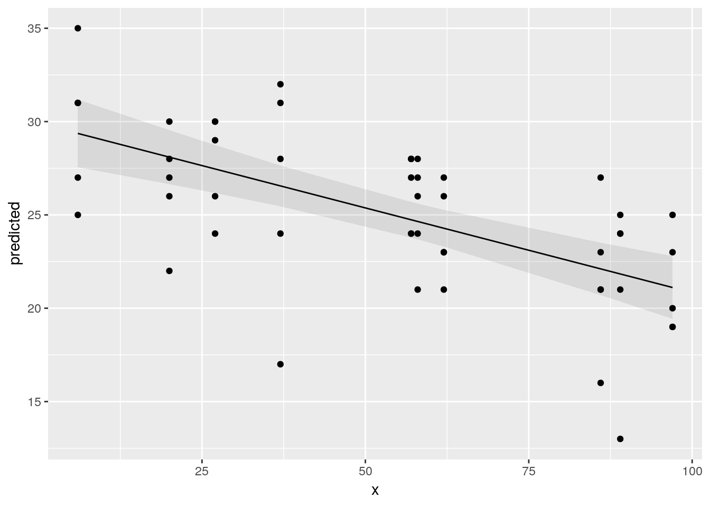

# Design and analysis of experiments part 1


## Introduction

Observational studies are much more common in environmental science and ecology than in other fields. When we analyse observational data we are seeking to gain evidence in support of scientific hypotheses. However this evidence tends to be indirect and open to a range of interpretations.
In contrast, a well designed experiment involves a planned manipulation of nature that should allow us to test hypotheses directly. A statistical hypothesis never completely coincides with the scientific hypothesis, however in an experimental setting the two concepts may be closely linked. 

Experimental studies are rare in ecology because they tend to be costly to set up, may require large areas and may need to run for many years in order to provide convincing data. So we often look for natural experiments that arise on an *ad hoc* basis to provide data. Sometimes unintentional human interventions such as oil spills, hunting, landscape fragmentation etc provide such systems that we can study. Although these rarely follow conventional experimental design, familiarity with experimental concepts may help in the selection of an appropriate analysis.

Many of the analytical methods and concepts used by experimental ecologists and environmental scientist have been derived from agricultural experiments. There are good reasons for this. The most influential statistician of all time, R A Fisher, was employed for many years at Rothamstead agricultural research centre. During that time he developed the theory and practical application of analysis of variance. The language used to describe experimental designs is based around this work. Although this helps to provide a common language it can sometimes be confusing. Terms such as "split plot" can be used for a design with no real plots, "Repeat measures" can occur when the measures are not actually taken on more than one occasion. Blocks may refer to non spatial entities.  The key to understanding experimental design is to realise that the design of the experiment and the design of the statistical model used to analyse it go hand in hand. If you can understand the structure of the data and the model used to analyse it you can either design experiments to produce appropriate data or design surveys that provide observational data that can be analysed using methods designed for experiments.

## Basic concepts of experimental design

### 1. Replication 

The most important element to recognise when designing any form of experiment that will be analysed using statistical methods is the amount of **replication** involved. This can be easy to determine if the experimental unit is well defined. For example if a treatment is applied to an animal then the number of replicates is usually going to be the number of animals used in the experiment. However if the animals share a single environment, such as a cage or enclosure, then that may become the experimental unit thus possibly reducing the number of replicates. It can be more complex when treatment is applied to plots of land due to spatial auto correlation and lack of independence. Ecological experiments have often been criticised for involving so called "pseudoreplication". This occurs when the true number of independent replicates is much lower than the number claimed by the researcher. One cause of this may be that sub samples taken from what should properly be regarded as a single experimental unit are analysed as if they constitute true replicate samples. This may become clearer after we have looked at some examples.
The amount of replication needed to establish the significance and size of the effect of some intervention depends to a large extent on the amount of natural variability in the system of study. Some laboratory based experiments can be based on extremely small numbers of replicates. For example, if drugs are administered to a set of genetically identical mice there may be no need for more than three animals in the control and treatment group in order to establish a statsitically significant effect. The reason for this is the response of all the animals without intervention would be very similar and all are likely to respond in identical ways to the treatment. However this experiment would be limited to establishing the effect of the drug on that single genotype. If a set of individuals captured at random from a wild population were used the study would have to be much larger. If the intention was to test the drug on the wild population at large it would have to be even larger in order to account for all the extraneous source of variability in the environment. 
Similarly if a researcher is interested in the effects of some treatment on plant growth and works with genetically similar plants grown on identical media in a greenhouse, for example using hydroponics or a very uniform potting compost, then the experiment may be need few replicates. However if the plants are grown in fields with varying soil conditions both within and between fields the experimental design will need to take this variability into account. Ecologists and environmental scientists face more challenges than other researcher as a result of the variability in natural systems. At the same time it may be difficult or impossible to find enough naturally ocurring independent replicates to use robust analytical methods.

### 2. Treatment levels

A second concept is that of **treatment levels**. The most basic type of experiment involves two levels of a treatment. The first level is simply no intervention (control). So, if we wanted to look at the effects of pesticides on pollinator abundance we would design an experiment with replicated units in which no pesticide was applied (control) and others in which the same level was applied. It is easy to see that the two level model could be extended to include more categories, such as high, medium and low levels of application. The classic analyses use fixed, categorical treatment levels. However in an observational context we often obtain continuous measurements. This influences the way we analyse data as we may substitute regression and analysis of covariance for a classic ANOVA. However linear statistical models have an underlying mathematical structure that can be used for either form of data. We can build models with combinations of both types of variables.

### 3. Randomisation 

The third concept to understand is **randomisation**. When designing an experiment the units should be assigned a treatment level at random which should not depend on their current status and ideally should not even be known by the experimenter. So, for example, in drug trials the participants are assigned a treatment at random. In a blind trial they themselves do not know whether they have been given a new drug or a placebo. In a double blind trial neither does the researcher. If random selection is used there should be no criteria used to choose those that receive the treatment. As you can imagine, this can sometimes raise ethical issues, but is a fundamental feature of statistically rigorous experimental design.
In many situations involving "natural" experiments there is no randomisation in the application of treatments. For example a forest fire may burn some trees and leave others intact but the selection of trees for treatment by fire is far from random. Parasites may attack hosts that are weakened by some other cause. Often spatial prximity is a key factor in selection for treatment. This leads to spatial autocorrelation and a lack of independence. Once more this makes applying the analytical methods designed for analysing true experiments more challenging when data is derived from observations of the natural system.

### 4. Interactions

We use the word **interaction** frequently in ecology to refer to effects such as competition, depredation, parasitism and other elements involved in the systems we study. However in statistics the word has a specific meaning that applies to experiments or observational studies involving more than a single factor. An interaction occurs when the effects of the factor are not additive. In other words the level of one factor influence the effect of another. Take for example an experiment in which saplings were grown at two light levels, full sun and 50% shade and two irrigation treatments applied. Let's call them high and low. Plants need both water and light to grow so we might expect the plants grown in full sun with high levels of irrigation to grow faster than those with low levels of irrigation. However what if the plants fail to respond to increased watering at low light levels, or even grow more slowly, perhaps due to waterlogged roots. In this case there would be an interaction as the two effects do not add together. The effect of irrigation is *conditional* on the level of light.

### 5. Fixed and random effects

The distinction between whether we treat factors as having **fixed** or **random** effects is rather subtle and subjective. Simply put fixed effects are those that we are most interested in while random effects represent natural variability that we may wish to quantify and control for, but which is not directly influential on our scientific hypotheses. When we analyse experimental data using R or any other statistical package we can declare some effects to be fixed and others as random. If for example we carried out the same experiment at five different sites that were selected at random from a large set of possible locations we may treat site as random effect, as we are not interested in the specific effect of any single named site. However if we deliberately selected the sites as representing different conditions that we may be interested in then the effect of site would be fixed.

When we include a variable in a model as a random effect we are only interested in the amount of variability, not the specific source of variability at the level of a single observation. So instead of looking at specfic effects we look at the variance or standard deviation of each random effect. These effects may be at a range of levels. For example we might look at the variability in yield between single plants and between fields. If no treatment has been assigned then in both cases we would only be interested in the variances. We usually fit "mixed effects" models however as we are typically interested in some form of fixed effect in addition to random variation.

It can often be rather difficult to decide which effects should be treated as random, and when it is appropriate to do so. The good news is that in many situations it doesn't really matter. The p-values and confidence intervals for the fixed effects that we are most interested in may not be influenced by the choice at all. The bad news is that in other cases the decision can be very important. Failure to declare a random effect as an error term may lead to type one errors, in other words, declaring a result to be statistically significant when it is not. In other situations, involving nested effects at different levels, the use of a mixed effects model is essential. Again, this may become clearer after looking at examples.


## Types of design

### Completely randomised design

This is the simplest form of experiment. 
In this design, all levels of the treatment or all combinations of treatment levels are assigned to experimental units completely at random. Often one of the treatment levels is considered to be a control (i.e. no intervention). If all the factor levels involve some form of treatment one of them can be considered a reference level or baseline. There must be replication of each treatment level. 

The statistical model is a simple one way Anova.

Let's look at a simple experiment of this type. We'll take an agricultural example. A researcher measured soil moisture at a certain depth following irrigation using four different techniques always using the same amount of water. The idea was to find out if there were any differences between them in order to find the most efficient technique in which less moisture was lost through evaporation.
Let's first assume that the moisture levels were measured once in each plot. The layout looks like this.




```r
library(ggplot2)
library(reshape)
library(multcomp)
```


```r
d<-read.csv("https://tinyurl.com/aqm-data/irrigation1.csv")
str(d)
```

```
## 'data.frame':	16 obs. of  3 variables:
##  $ plot      : int  1 2 3 4 5 6 7 8 9 10 ...
##  $ irrigation: Factor w/ 4 levels "A","B","C","D": 1 1 1 1 2 2 2 2 3 3 ...
##  $ moisture  : num  12.3 12.6 11.4 12.1 12.4 ...
```

## Visualising the data


```r
d$plot<-factor(d$plot)
d$irrigation<-factor(d$irrigation)
g0<-ggplot(d,aes(x=irrigation,y=moisture))
g0+geom_point()
```


Plotting the means with confidence intervals is a good way of identifying patterns that can be tested for significance.


```r
g1<-g0+stat_summary(fun.data=mean_cl_normal,geom="point")
g1+stat_summary(fun.data=mean_cl_normal,geom="errorbar",colour="black")
```


OK. So we can analyse the experiment using Anova as we have seen previously.


```r
mod<-lm(moisture~irrigation,data=d)
anova(mod)
```

```
## Analysis of Variance Table
## 
## Response: moisture
##            Df  Sum Sq Mean Sq F value   Pr(>F)   
## irrigation  3 10.6108  3.5369  6.4626 0.007504 **
## Residuals  12  6.5675  0.5473                    
## ---
## Signif. codes:  0 '***' 0.001 '**' 0.01 '*' 0.05 '.' 0.1 ' ' 1
```

Nothing new here. You should be able to interpret the table easily.

### Comparisons

The multcomp package provides a useful way of summarising the results by testing the general linear hypothesis for each treatment level. By default this will use the treatment that is lowest in alphabetical order as the "control" or baseline.


```r
plot(glht(mod))
```


```r
summary(glht(mod))
```

```
## 
## 	 Simultaneous Tests for General Linear Hypotheses
## 
## Fit: lm(formula = moisture ~ irrigation, data = d)
## 
## Linear Hypotheses:
##                  Estimate Std. Error t value Pr(>|t|)    
## (Intercept) == 0  12.0750     0.3699  32.644   <0.001 ***
## irrigationB == 0   0.7417     0.5231   1.418    0.418    
## irrigationC == 0  -1.0583     0.5231  -2.023    0.172    
## irrigationD == 0   1.0583     0.5231   2.023    0.172    
## ---
## Signif. codes:  0 '***' 0.001 '**' 0.01 '*' 0.05 '.' 0.1 ' ' 1
## (Adjusted p values reported -- single-step method)
```

So, although the anova can be reported as having detected significant variation between treatments (F 3,12 =6.4, p<0.01) there are no significant differences between treatment A and the others.

As no treatment was a natural control the best way to proceed in this case is to look at multiple comparisons to determine where the significant difference lie. We need to make an appropriate adjustment such as Tukey's.


```r
plot(glht(mod, linfct = mcp(irrigation = "Tukey")))
```


```r
summary(glht(mod, linfct = mcp(irrigation = "Tukey")))
```

```
## 
## 	 Simultaneous Tests for General Linear Hypotheses
## 
## Multiple Comparisons of Means: Tukey Contrasts
## 
## 
## Fit: lm(formula = moisture ~ irrigation, data = d)
## 
## Linear Hypotheses:
##            Estimate Std. Error t value Pr(>|t|)   
## B - A == 0   0.7417     0.5231   1.418  0.51255   
## C - A == 0  -1.0583     0.5231  -2.023  0.23295   
## D - A == 0   1.0583     0.5231   2.023  0.23316   
## C - B == 0  -1.8000     0.5231  -3.441  0.02196 * 
## D - B == 0   0.3167     0.5231   0.605  0.92839   
## D - C == 0   2.1167     0.5231   4.046  0.00737 **
## ---
## Signif. codes:  0 '***' 0.001 '**' 0.01 '*' 0.05 '.' 0.1 ' ' 1
## (Adjusted p values reported -- single-step method)
```

So it appears that treatment C leads to significantly lower soil water content than either B or D. This may be the type of irrigation method to reject an inefficient. The other methods were indistinguishable based on the results from this rather small study. A larger study would be needed to detect significant differences.

## Completely randomised design with subsampling

In this case, all levels of the treatment or all combinations of treatment levels are assigned to experimental units completely at random, but measurements are taken by sub sampling within the experimental unit. Ignoring the dependence that comes from sub sampling would lead to a form of pseudo-replication and this can result in falsely claiming significance (type one error). 

In the case of the previous example, it reality the researchers had taken three sub samples from each experimental unit. The previous analysis used the mean that had already been calculated from these three measurements. If the original data were used there may be a temptation to analyse the measurements as if they were all independent. This would be wrong. In fact the sub samples are **nested** within the experimental units.

### Wrong analyisis for the subsampling

Any form of sub sampling potentially can lead to type one errors (p-values too small) if it is not recognised for what it is. The reason for this is that the denominator degrees of freedom (the measure of the amount of independent replicatation) in the anova table is too large.

Look carefully at the structure of this data frame. Each level of the factor now has three sub samples. However these are all measures of the same quantity. 


```r
irrigation2<-read.csv("https://tinyurl.com/aqm-data/irrigation2.csv")
d<-irrigation2
```


```r
str(d)
```

```
## 'data.frame':	48 obs. of  4 variables:
##  $ irrigation: Factor w/ 4 levels "A","B","C","D": 1 1 1 1 1 1 1 1 1 1 ...
##  $ plot      : int  1 1 1 2 2 2 3 3 3 4 ...
##  $ subplot   : int  1 2 3 1 2 3 1 2 3 1 ...
##  $ moisture  : num  12.6 11.9 12.3 13 12.4 12.4 11.3 11.9 10.9 12.5 ...
```

This is what happens if we ignore the sub sampling and run an analysis using all the data.


```r
d$plot<-factor(d$plot)
mod<-lm(moisture~irrigation,data=d)
anova(mod)
```

```
## Analysis of Variance Table
## 
## Response: moisture
##            Df Sum Sq Mean Sq F value   Pr(>F)    
## irrigation  3 31.832 10.6108  18.673 5.84e-08 ***
## Residuals  44 25.002  0.5682                     
## ---
## Signif. codes:  0 '***' 0.001 '**' 0.01 '*' 0.05 '.' 0.1 ' ' 1
```

Notice that this leads to a much smaller p-value. There are too many degrees of freedom in the denominator due to the pseudoreplication.

We have already seen a good solution. Just take the means of each set of sub samples and analyse these as measures taken from each experimental unit. This is often by far the simplest approach. It is easy to understand and easy to explain to others.

Another way of dealing with sub sampling is to account for it by adding a random effect for the experimental unit from which sub-samples are taken. 

There are many different ways of doing this in R. If use the aov wrapper to fit linear models for analysis of variance we declare an error term at the plot level and add this to the model formula.


```r
mod<-aov(moisture~irrigation+Error(plot),data=d)
summary(mod)
```

```
## 
## Error: plot
##            Df Sum Sq Mean Sq F value Pr(>F)   
## irrigation  3  31.83  10.611   6.463 0.0075 **
## Residuals  12  19.70   1.642                  
## ---
## Signif. codes:  0 '***' 0.001 '**' 0.01 '*' 0.05 '.' 0.1 ' ' 1
## 
## Error: Within
##           Df Sum Sq Mean Sq F value Pr(>F)
## Residuals 32    5.3  0.1656
```

You should see that the result is almost identical to that produced through analysing the means, as it should be.

One point to be aware of is that when you have nested sub samples within a single level of the treatment, as occurs here, you can't include plot as a fixed effect in the model. If you try to do this you will find that some coefficients cannot be estimated.


```r
mod<-lm(moisture~irrigation+plot,data=d)
summary(mod)
```

```
## 
## Call:
## lm(formula = moisture ~ irrigation + plot, data = d)
## 
## Residuals:
##      Min       1Q   Median       3Q      Max 
## -0.93333 -0.26667  0.03333  0.26667  0.66667 
## 
## Coefficients: (3 not defined because of singularities)
##             Estimate Std. Error t value Pr(>|t|)    
## (Intercept)  12.2667     0.2350  52.206  < 2e-16 ***
## irrigationB   0.9667     0.3323   2.909 0.006542 ** 
## irrigationC  -1.2333     0.3323  -3.712 0.000782 ***
## irrigationD   0.9667     0.3323   2.909 0.006542 ** 
## plot2         0.3333     0.3323   1.003 0.323319    
## plot3        -0.9000     0.3323  -2.708 0.010762 *  
## plot4        -0.2000     0.3323  -0.602 0.551492    
## plot5        -0.8667     0.3323  -2.608 0.013719 *  
## plot6        -1.3333     0.3323  -4.013 0.000338 ***
## plot7         0.5333     0.3323   1.605 0.118314    
## plot8             NA         NA      NA       NA    
## plot9         0.8667     0.3323   2.608 0.013719 *  
## plot10        0.3667     0.3323   1.103 0.278059    
## plot11       -1.3000     0.3323  -3.912 0.000448 ***
## plot12            NA         NA      NA       NA    
## plot13       -0.6000     0.3323  -1.806 0.080388 .  
## plot14        0.7000     0.3323   2.107 0.043084 *  
## plot15       -0.5000     0.3323  -1.505 0.142206    
## plot16            NA         NA      NA       NA    
## ---
## Signif. codes:  0 '***' 0.001 '**' 0.01 '*' 0.05 '.' 0.1 ' ' 1
## 
## Residual standard error: 0.407 on 32 degrees of freedom
## Multiple R-squared:  0.9067,	Adjusted R-squared:  0.863 
## F-statistic: 20.74 on 15 and 32 DF,  p-value: 2.466e-12
```

The model can also be fit using either the lmer package or the older nlme package.  The differences between the two are rather technical. In general terms nlme can be more convenient for mixed effects models which involve a response to a continuous variable, particularly if the response is non-linear. The newer lme4 package can fit some very complex model involving multi-layer interactions that nlme cannot. However by default lme4 does not provide p-values due to a deliberate decision made by its author. There is a highly technical academic argument regarding the validity of the calculations. Fortunately, as we will often do want to report p-values, the relevant calculations have been added by the author of the lmerTest package. 


```r
library(lmerTest)
mod<-lmer(moisture~irrigation+(1|plot),data=d)
anova(mod)
```

```
## Type III Analysis of Variance Table with Satterthwaite's method
##            Sum Sq Mean Sq NumDF DenDF F value   Pr(>F)   
## irrigation 3.2111  1.0703     3    12  6.4625 0.007505 **
## ---
## Signif. codes:  0 '***' 0.001 '**' 0.01 '*' 0.05 '.' 0.1 ' ' 1
```

The p-values are the same as would result from using the means of the sub samples in a one way anova. So there is no obvious advantage in using the raw data rather than pooled means.

In many cases the simplest way to analyse the data is to just take the means of the sub samples and use those, as in the first example. The exception to this is if you are interested in variability **within** the sub samples. Notice that the mixed effect does provide you with an estimate of this.


```r
summary(mod)
```

```
## Linear mixed model fit by REML. t-tests use Satterthwaite's method [
## lmerModLmerTest]
## Formula: moisture ~ irrigation + (1 | plot)
##    Data: d
## 
## REML criterion at convergence: 83.2
## 
## Scaled residuals: 
##     Min      1Q  Median      3Q     Max 
## -2.6115 -0.6833  0.1057  0.5153  1.3200 
## 
## Random effects:
##  Groups   Name        Variance Std.Dev.
##  plot     (Intercept) 0.4921   0.7015  
##  Residual             0.1656   0.4070  
## Number of obs: 48, groups:  plot, 16
## 
## Fixed effects:
##             Estimate Std. Error      df t value Pr(>|t|)    
## (Intercept)  12.0750     0.3699 11.9998  32.644 4.32e-13 ***
## irrigationB   0.7417     0.5231 11.9998   1.418   0.1817    
## irrigationC  -1.0583     0.5231 11.9998  -2.023   0.0659 .  
## irrigationD   1.0583     0.5231 11.9998   2.023   0.0659 .  
## ---
## Signif. codes:  0 '***' 0.001 '**' 0.01 '*' 0.05 '.' 0.1 ' ' 1
## 
## Correlation of Fixed Effects:
##             (Intr) irrgtB irrgtC
## irrigationB -0.707              
## irrigationC -0.707  0.500       
## irrigationD -0.707  0.500  0.500
```

We can use the glht function with the output from fitting this model as before, and reach an identical conclusion.


```r
plot(glht(mod, linfct = mcp(irrigation = "Tukey")))
```



```r
summary(glht(mod, linfct = mcp(irrigation = "Tukey")))
```

```
## 
## 	 Simultaneous Tests for General Linear Hypotheses
## 
## Multiple Comparisons of Means: Tukey Contrasts
## 
## 
## Fit: lmer(formula = moisture ~ irrigation + (1 | plot), data = d)
## 
## Linear Hypotheses:
##            Estimate Std. Error z value Pr(>|z|)    
## B - A == 0   0.7417     0.5231   1.418  0.48816    
## C - A == 0  -1.0583     0.5231  -2.023  0.17930    
## D - A == 0   1.0583     0.5231   2.023  0.17937    
## C - B == 0  -1.8000     0.5231  -3.441  0.00302 ** 
## D - B == 0   0.3167     0.5231   0.605  0.93041    
## D - C == 0   2.1167     0.5231   4.046  < 0.001 ***
## ---
## Signif. codes:  0 '***' 0.001 '**' 0.01 '*' 0.05 '.' 0.1 ' ' 1
## (Adjusted p values reported -- single-step method)
```


**Always watch out for subsampling in any data set.** 

**Never treat subsamples as independent replicates**

## Randomized Complete Block Design

Blocks occur when the variability between the response  within sets of experimental units is expected to be lower than the variability between sets of units. 
The term block comes from agricultural experiments and is easiest to understand in this context. If different fields have different inherent fertility levels we would expect the yield of wheat from parcels placed within each field to be similar. However the yield would vary between fields. The idea of blocking is to account for this variability in the design of the experiment. This can increase statistical power and reduce the number of experimental units needed. 

Here is an example of a randomised complete block design. Four fields are chosen for an experiment. In each field four plots are selected and allocated a treatment level at random. Let's say the treatment involves planting four different varieties of maize and recording the total yield.  

The fields are blocks. Each field may have a different soil type and thus a different intrinsic fertility. In the case of a blocked experiment we are not interested in the effect of the block. It is a confounding variable. However it adds to the variability between treatment levels and thus may make it harder to spot real differences between them. 



Block effects need to be taken into account as if they are not the analysis may have too high a p-value (reduced power or type 2 error). The situation is rather complicated conceptually as we can only estimate the effects of the blocks. We don't really know what they are. 


```r
RCB<-read.csv("https://tinyurl.com/aqm-data/RCB.csv")
d<-RCB
```


```r
str(d)
```

```
## 'data.frame':	16 obs. of  3 variables:
##  $ block: Factor w/ 4 levels "b1","b2","b3",..: 1 1 1 1 2 2 2 2 3 3 ...
##  $ treat: Factor w/ 4 levels "t1","t2","t3",..: 1 2 3 4 1 2 3 4 1 2 ...
##  $ yield: num  18.1 22.6 21.5 30.8 26 ...
```

### Wrong analysis ignoring the effect of block

Let's first look at all the sources of variability combined at the level of the treatments.


```r
g1<-g0+stat_summary(fun.data=mean_cl_normal,geom="point")
g1+stat_summary(fun.data=mean_cl_normal,geom="errorbar",colour="black")
```


We can fit a model ignoring the blocking effects.


```r
mod<-lm(yield~treat,data=d)
anova(mod)
```

```
## Analysis of Variance Table
## 
## Response: yield
##           Df Sum Sq Mean Sq F value Pr(>F)
## treat      3 216.45  72.150  1.6991 0.2201
## Residuals 12 509.56  42.463
```

Notice that this suggests that there is no significant effect of the treatments.

### Treating block as a random effect

This time we will fit a model with an error term at the block level using aov.


```r
mod<-aov(yield~treat+Error(block),data=d)
summary(mod)
```

```
## 
## Error: block
##           Df Sum Sq Mean Sq F value Pr(>F)
## Residuals  3  446.1   148.7               
## 
## Error: Within
##           Df Sum Sq Mean Sq F value  Pr(>F)   
## treat      3 216.45   72.15   10.23 0.00294 **
## Residuals  9  63.49    7.05                   
## ---
## Signif. codes:  0 '***' 0.001 '**' 0.01 '*' 0.05 '.' 0.1 ' ' 1
```

Again, the same result can be obtained using the more powerful lmerTest package.


```r
mod<-lmer(yield~treat+(1|block),data=d)
anova(mod)
```

```
## Type III Analysis of Variance Table with Satterthwaite's method
##       Sum Sq Mean Sq NumDF  DenDF F value   Pr(>F)   
## treat 216.45   72.15     3 9.0001  10.227 0.002941 **
## ---
## Signif. codes:  0 '***' 0.001 '**' 0.01 '*' 0.05 '.' 0.1 ' ' 1
```

Just as previously we can look at the pattern of effects using the glht function from the multcomp package.


```r
par(mar=c(4,8,4,2)) 
plot(glht(mod))
```



```r
par(mar=c(4,8,4,2)) 
plot(glht(mod, linfct = mcp(treat = "Tukey")))
```



### Treating block as a fixed effect

If we treat block as fixed we obtain identical results for the treatment effects. It may be advantageous to treat the blocks as fixed if we wish to identify differences between them. For example one field may have a very different soil fertility to the others. As blocking effects confound detection of treatment effects even when we allow for them in the statistical model we might decide not to use this block in further trials in order to have a more homogeneous set of initial conditions. The difference between using a fixed and random effect in this situation is arbitrary and depends on circumstances.


```r
mod<-aov(yield~treat+block,data=d)
anova(mod)
```

```
## Analysis of Variance Table
## 
## Response: yield
##           Df Sum Sq Mean Sq F value    Pr(>F)    
## treat      3 216.45  72.150  10.227 0.0029416 ** 
## block      3 446.06 148.688  21.076 0.0002086 ***
## Residuals  9  63.49   7.055                      
## ---
## Signif. codes:  0 '***' 0.001 '**' 0.01 '*' 0.05 '.' 0.1 ' ' 1
```

```r
summary(mod)
```

```
##             Df Sum Sq Mean Sq F value   Pr(>F)    
## treat        3  216.5   72.15   10.23 0.002942 ** 
## block        3  446.1  148.69   21.08 0.000209 ***
## Residuals    9   63.5    7.05                     
## ---
## Signif. codes:  0 '***' 0.001 '**' 0.01 '*' 0.05 '.' 0.1 ' ' 1
```

```r
par(mar=c(4,8,4,2)) 
plot(glht(mod))
```



```r
par(mar=c(4,8,4,2)) 
plot(glht(mod, linfct = mcp(treat = "Tukey")))
```


```r
par(mar=c(4,8,4,2)) 
plot(glht(mod, linfct = mcp(block = "Tukey")))
```


## Illustation of how block effects work

We could handle the block effect "by hand". Each block of four treatments has a mean yield that we can calculate in R and add to our data frame.


```r
d$block_mean<-rep(with(d,tapply(yield,block,mean)),each=4)
```

Look at the results of this in the data table. Now we can subtract the block mean from the yields and re-plot our confidence intervals.


```r
d$yield2<-d$yield-d$block_mean
g0<-ggplot(d,aes(x=treat,y=yield2))
g0+geom_boxplot()
```


```r
g1<-g0+stat_summary(fun.data=mean_cl_normal,geom="point")
g1+stat_summary(fun.data=mean_cl_normal,geom="errorbar",colour="black")
```



The pattern that we detected using the analysis which took into account blocks is now clearly shown.

Now if we run an Anova you can see that the sum of squares and the mean squares are correct. The residual sum of squares is also correct. The difference is that the denominator degrees of freedom is too high as we have not compensated for the fact that the block means were estimated, by reducing the df by three, The mean squares in the denominator of the F Ratio is therefore slightly too low. Looking closely at the table should help you understand the logic. 


```r
mod<-lm(yield2~treat,data=d)
anova(mod)
```

```
## Analysis of Variance Table
## 
## Response: yield2
##           Df  Sum Sq Mean Sq F value    Pr(>F)    
## treat      3 216.451  72.150  13.636 0.0003583 ***
## Residuals 12  63.494   5.291                      
## ---
## Signif. codes:  0 '***' 0.001 '**' 0.01 '*' 0.05 '.' 0.1 ' ' 1
```

Although this produces an identical result in terms of the sum of squares it is preferable to declare the block effect as either an additional additive fixed effect or a random effect in order to clearly show that the block effects are estimated by the model and thus lead to reduced degrees of freedom.

## An observational example of sub-sampling


A researcher wants to establish if algal mat cover has an effect on species richness. The mat cover is measured once but richness five times at each site. 

This is an examle of a regression with sub-sampling. The issue to be dealt with is the difference in the amount of replication of the measure of algal mat and the measure of richness. It can be handled either by taking means or by using a model with a random effect included to handle nested observations.


```r
set.seed(1)
mat<-rep(sample(1:100,10),each=5)
mat
```

```
##  [1] 27 27 27 27 27 37 37 37 37 37 57 57 57 57 57 89 89 89 89 89 20 20 20 20 20
## [26] 86 86 86 86 86 97 97 97 97 97 62 62 62 62 62 58 58 58 58 58  6  6  6  6  6
```

```r
site<-rep(1:10,each=5)
richness<-round(30-0.1*mat+rnorm(50,0,4),0)
richness
```

```
##  [1] 24 29 30 30 26 32 28 24 17 31 24 24 28 28 27 25 24 21 13 24 28 27 22 26 30
## [26] 27 21 23 21 16 19 19 20 25 23 23 23 27 26 21 21 26 27 24 28 31 27 31 25 35
```

```r
plot(mat,richness)
```


```r
d<-data.frame(site,mat,richness)
```

### Plot the raw data


```r
g0<-ggplot(d,aes(x=mat,y=richness))
g0+geom_point()+geom_smooth(method="lm")
```


```r
mod1<-lm(richness~mat,data=d)
summary(mod1)
```

```
## 
## Call:
## lm(formula = richness ~ mat, data = d)
## 
## Residuals:
##     Min      1Q  Median      3Q     Max 
## -9.5530 -1.9363  0.3984  2.3292  5.6351 
## 
## Coefficients:
##             Estimate Std. Error t value Pr(>|t|)    
## (Intercept) 29.90919    1.01005  29.611  < 2e-16 ***
## mat         -0.09071    0.01645  -5.515 1.37e-06 ***
## ---
## Signif. codes:  0 '***' 0.001 '**' 0.01 '*' 0.05 '.' 0.1 ' ' 1
## 
## Residual standard error: 3.423 on 48 degrees of freedom
## Multiple R-squared:  0.3879,	Adjusted R-squared:  0.3752 
## F-statistic: 30.42 on 1 and 48 DF,  p-value: 1.366e-06
```

### Group to take mean richness at each site with same algal coverage


```r
library (dplyr)
```

```
## 
## Attaching package: 'dplyr'
```

```
## The following object is masked from 'package:MASS':
## 
##     select
```

```
## The following object is masked from 'package:reshape':
## 
##     rename
```

```
## The following objects are masked from 'package:stats':
## 
##     filter, lag
```

```
## The following objects are masked from 'package:base':
## 
##     intersect, setdiff, setequal, union
```

```r
d %>% group_by(site,mat) %>% summarise(richness=mean(richness)) ->d2


g0<-ggplot(d2,aes(x=mat,y=richness))
g0+geom_point()+geom_smooth(method="lm")
```



```r
mod2<-lm(richness~mat,data=d2)
summary(mod2)
```

```
## 
## Call:
## lm(formula = richness ~ mat, data = d2)
## 
## Residuals:
##      Min       1Q   Median       3Q      Max 
## -1.49502 -0.39841 -0.03172  0.41128  1.46120 
## 
## Coefficients:
##              Estimate Std. Error t value Pr(>|t|)    
## (Intercept) 29.909188   0.549077   54.47 1.43e-11 ***
## mat         -0.090708   0.008941  -10.15 7.62e-06 ***
## ---
## Signif. codes:  0 '***' 0.001 '**' 0.01 '*' 0.05 '.' 0.1 ' ' 1
## 
## Residual standard error: 0.8322 on 8 degrees of freedom
## Multiple R-squared:  0.9279,	Adjusted R-squared:  0.9189 
## F-statistic: 102.9 on 1 and 8 DF,  p-value: 7.618e-06
```
### Use raw data with a random effect for site


```r
library(nlme)
```

```
## 
## Attaching package: 'nlme'
```

```
## The following object is masked from 'package:dplyr':
## 
##     collapse
```

```
## The following object is masked from 'package:lme4':
## 
##     lmList
```

```r
library(merTools)
```

```
## Loading required package: arm
```

```
## 
## arm (Version 1.10-1, built: 2018-4-12)
```

```
## Working directory is /home/rstudio/webpages/books/AQM_book
```

```r
library(ggeffects)

mod3<-lme4::lmer(richness~mat +(1|site),data=d)
```

```
## boundary (singular) fit: see ?isSingular
```

```r
fit<-ggpredict(mod3, terms = "mat")
ggplot(fit, aes(x, predicted)) + geom_point(data=d,aes(y=richness,x=mat)) + geom_line() +
  geom_ribbon(aes(ymin = conf.low, ymax = conf.high), alpha = .1)
```




```r
library(lmerTest)
mod4<-lmer(richness~mat+(1|site),data=d)
```

```
## boundary (singular) fit: see ?isSingular
```

```r
summary(mod4)
```

```
## Linear mixed model fit by REML. t-tests use Satterthwaite's method [
## lmerModLmerTest]
## Formula: richness ~ mat + (1 | site)
##    Data: d
## 
## REML criterion at convergence: 268.9
## 
## Scaled residuals: 
##     Min      1Q  Median      3Q     Max 
## -2.7906 -0.5656  0.1164  0.6804  1.6461 
## 
## Random effects:
##  Groups   Name        Variance Std.Dev.
##  site     (Intercept)  0.00    0.000   
##  Residual             11.72    3.423   
## Number of obs: 50, groups:  site, 10
## 
## Fixed effects:
##             Estimate Std. Error       df t value Pr(>|t|)    
## (Intercept) 29.90919    1.01005 48.00000  29.611  < 2e-16 ***
## mat         -0.09071    0.01645 48.00000  -5.515 1.37e-06 ***
## ---
## Signif. codes:  0 '***' 0.001 '**' 0.01 '*' 0.05 '.' 0.1 ' ' 1
## 
## Correlation of Fixed Effects:
##     (Intr)
## mat -0.878
## convergence code: 0
## boundary (singular) fit: see ?isSingular
```

```r
anova(mod4)
```

```
## Type III Analysis of Variance Table with Satterthwaite's method
##     Sum Sq Mean Sq NumDF DenDF F value    Pr(>F)    
## mat 356.48  356.48     1    48  30.419 1.366e-06 ***
## ---
## Signif. codes:  0 '***' 0.001 '**' 0.01 '*' 0.05 '.' 0.1 ' ' 1
```

## Summary

Including random effects can allow for subsampling which leads to non-independent repllication. It often will lead to similar results to the simpler technique of taking means of the subsamples. If the number of subsamples actually varies at each observational point then a random effects model is better than one using means, as the mean will be based on a different number of observations and may vary in reliability. A random effects model can take this into account. In other situations the result will be very similar.
Blocking differs from subsampling as the treatment is repeated within the block (which it isn't in a nested subsampling design). Blocks can be treated as **either** fixed or random effects. The result will be the same. Treat blocks as **fixed** effects if you are interested in them for some reason. Treat them as random effects if you never want to look at individual blocks as such.

**Watch out for subsampling which leads to different amounts of repication for each variable in observational studies!** This often occurs and it can lead to erroneous conclusions.


## Exercises

A researcher is interested in whether dark corrugated iron strips are used more frequently by sand lizards than plain corrugated iron. The researcher has 20 pieces of iron of each type and places them on five different sites at Arne. The strips are inspected every day for two weeks in spring. The total number of sandlizards found under each strip is recorded each day as the response variable (data may also be collected on weather conditions etc.. but you can ignore this).

Design a fake data set that could be used as the template for a simple analysis of the data using an appropriate analysis of variance. Run an analysis on the fake data.

Answer the folowing questions.

1. What feature of the design may be considered to lead to blocking?
2. How many levels of the factor are there?
3. How might subsampling be handled?
4. Which feature of the response variable may cause particular difficulties when working with real life data?


