# Repeat measures designs

Repeated measures on the same experimental subject can occur for many reasons. 
The typical situation is when the measures are repeated in time, but repeated measures can also arise in other ways. The key to understanding when a design involves repeated measures is to realise that measures which involve different levels of the fixed factor of interest are taken from the same experimental unit. A blocked design is therefore an example of repeated measures in space if a block is regarded as an experimental unit. However blocks are usually thought of in terms of groups of experimental units. The terminology in the literature can be slightly confusing in this respect as it may depend on the discipline involved and blocked designs can be called repeated measures in some circumstances. 

Let's think of a simple example of a repeated measurement in a laboratory setting. The blood pressure of ten rats was measured before and after the injection of a drug.


```r
library(lmerTest)
library(ggplot2)
library(effects)
library(reshape)
library(multcomp)
library(dplyr)
```


```r
d<-read.csv("https://tinyurl.com/aqm-data/rats.csv")
```

Repeat measures such as these lead to a situation that is fundamentally similar to a design with blocks. Each treatment level is replicated once within each subject. However the total variability also has a between subject component as each rat may have a different baseline blood pressure. This needs to be taken into account.


```r
g0<-ggplot(d,aes(x=time,y=resp))
g0+geom_boxplot()
```

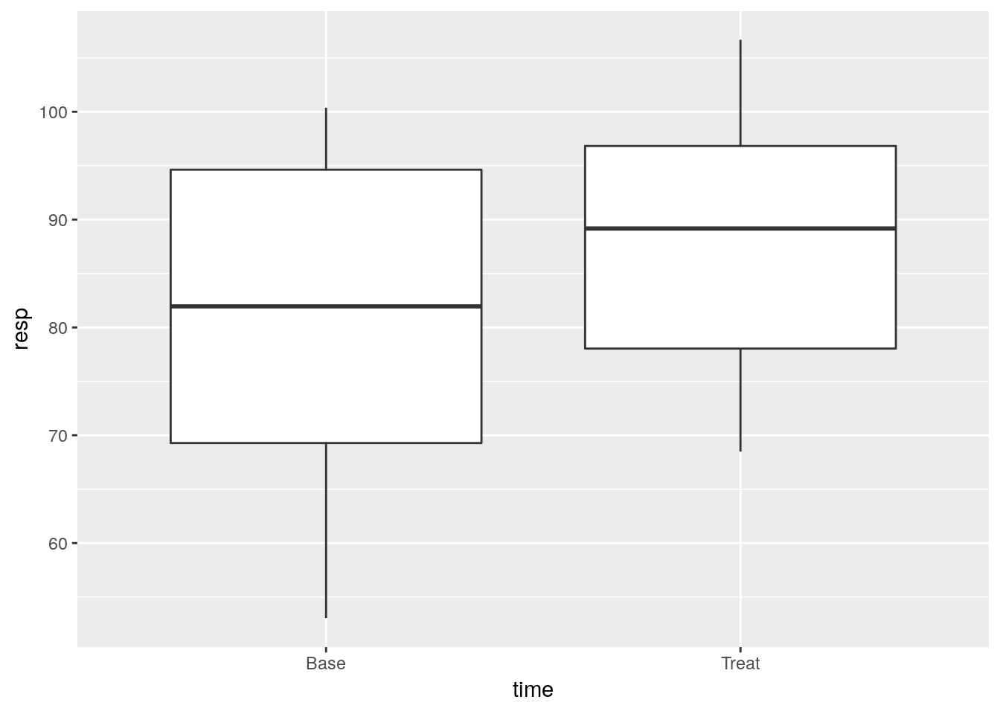

```r
g1<- g0+stat_summary(fun.data=mean_cl_normal,geom="point")
g1+stat_summary(fun.data=mean_cl_normal,geom="errorbar",colour="black")
```

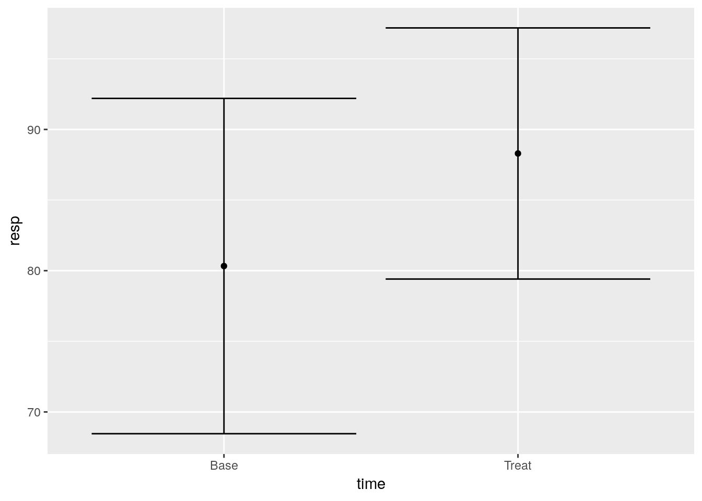

## Paired t-test

Just as in the blocked design failure to take into account between subject variability reduces the power of the analysis. We can see this by running two t-tests. The first is unpaired. The second is paired.


```r
d2<-melt(d,id=1:2,m="resp")
d2<-cast(d2,id~time)
t.test(d2$Base,d2$Treat)
```

```
## 
## 	Welch Two Sample t-test
## 
## data:  d2$Base and d2$Treat
## t = -1.2157, df = 16.68, p-value = 0.241
## alternative hypothesis: true difference in means is not equal to 0
## 95 percent confidence interval:
##  -21.820632   5.881527
## sample estimates:
## mean of x mean of y 
##  80.32928  88.29883
```

```r
t.test(d2$Base,d2$Treat,paired=TRUE)
```

```
## 
## 	Paired t-test
## 
## data:  d2$Base and d2$Treat
## t = -4.3212, df = 9, p-value = 0.00193
## alternative hypothesis: true difference in means is not equal to 0
## 95 percent confidence interval:
##  -12.141652  -3.797453
## sample estimates:
## mean of the differences 
##               -7.969552
```

## Mixed effects model

The design can be analysed using a mixed effect model with rat id as a random effect.

First let's see what happens if we don't include the random effect.


```r
mod<-lm(resp~time,data=d)
anova(mod)
```

```
## Analysis of Variance Table
## 
## Response: resp
##           Df Sum Sq Mean Sq F value Pr(>F)
## time       1  317.6  317.57   1.478 0.2398
## Residuals 18 3867.7  214.87
```

You should see that the p-value is the same as we got from the unpaired t-test.

Now making rat id a random effect.


```r
mod<-lmer(resp~time+(1|id),data=d)
summary(mod)
```

```
## Linear mixed model fit by REML. t-tests use Satterthwaite's method [
## lmerModLmerTest]
## Formula: resp ~ time + (1 | id)
##    Data: d
## 
## REML criterion at convergence: 135.4
## 
## Scaled residuals: 
##      Min       1Q   Median       3Q      Max 
## -1.42938 -0.49183  0.06957  0.55204  1.08978 
## 
## Random effects:
##  Groups   Name        Variance Std.Dev.
##  id       (Intercept) 197.86   14.066  
##  Residual              17.01    4.124  
## Number of obs: 20, groups:  id, 10
## 
## Fixed effects:
##             Estimate Std. Error     df t value Pr(>|t|)    
## (Intercept)   80.329      4.635  9.740  17.329 1.21e-08 ***
## timeTreat      7.970      1.844  9.000   4.321  0.00193 ** 
## ---
## Signif. codes:  0 '***' 0.001 '**' 0.01 '*' 0.05 '.' 0.1 ' ' 1
## 
## Correlation of Fixed Effects:
##           (Intr)
## timeTreat -0.199
```

```r
par(mar=c(4,8,4,2)) 
plot(glht(mod))
```

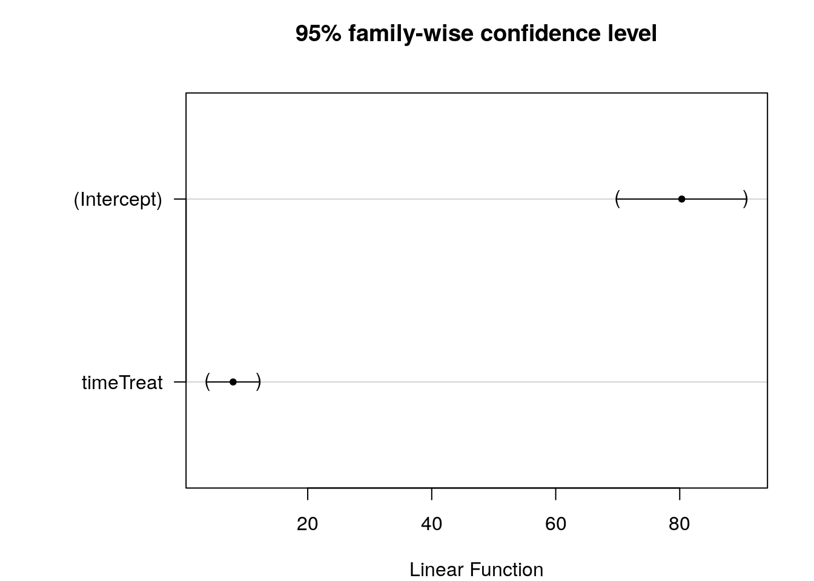

Now the p-value is the same as that obtained by a paired t-test.
Alternatively code this achieve the same result.


```r
mod<-aov(resp~time+Error(id),data=d)
summary(mod)
```

```
## 
## Error: id
##           Df Sum Sq Mean Sq F value Pr(>F)
## Residuals  9   3715   412.7               
## 
## Error: Within
##           Df Sum Sq Mean Sq F value  Pr(>F)   
## time       1  317.6   317.6   18.67 0.00193 **
## Residuals  9  153.1    17.0                   
## ---
## Signif. codes:  0 '***' 0.001 '**' 0.01 '*' 0.05 '.' 0.1 ' ' 1
```

You should also be able to see the fundamental similarity between this situation and one involving blocking with respect to the specification of the model. However in a classic block design the blocks are considered to be **groups** of experimental units rather than individual experimental units. This can lead to confusion and model mispecification if you are not careful. A block design must have repeated measures with different levels of treatment **within** each block, just as a repeat measure design has different treatment levels within each subject.  These simple examples can be extended to produce more complex designs.

## Repeat measures with subsampling

One way the repeat measures design can be extended is with sub sampling. Take this example. A researcher is interested in the impact of sewage treatment plants outfalls on the diversity of river invertebrates. In order to produce a paired design kick samples are taken 100m above the outfall and 100m below the outfall in five rivers. This leads to a total of ten sites. At each site three kicks are obtained. These three measurements are thus sub-samples.


```r
d<-read.csv("https://tinyurl.com/aqm-data/river.csv")
g0<-ggplot(d,aes(x=sewage,y=nspecies))
```

### Visualising the data

If we pool all the data points taken below and above the sewage outfall we would not be taking into account the variability between rivers. We would also not be taking into account the potential for "pseudo-replication" as a result of the sub-sampling. 


```r
g0+geom_boxplot()
```

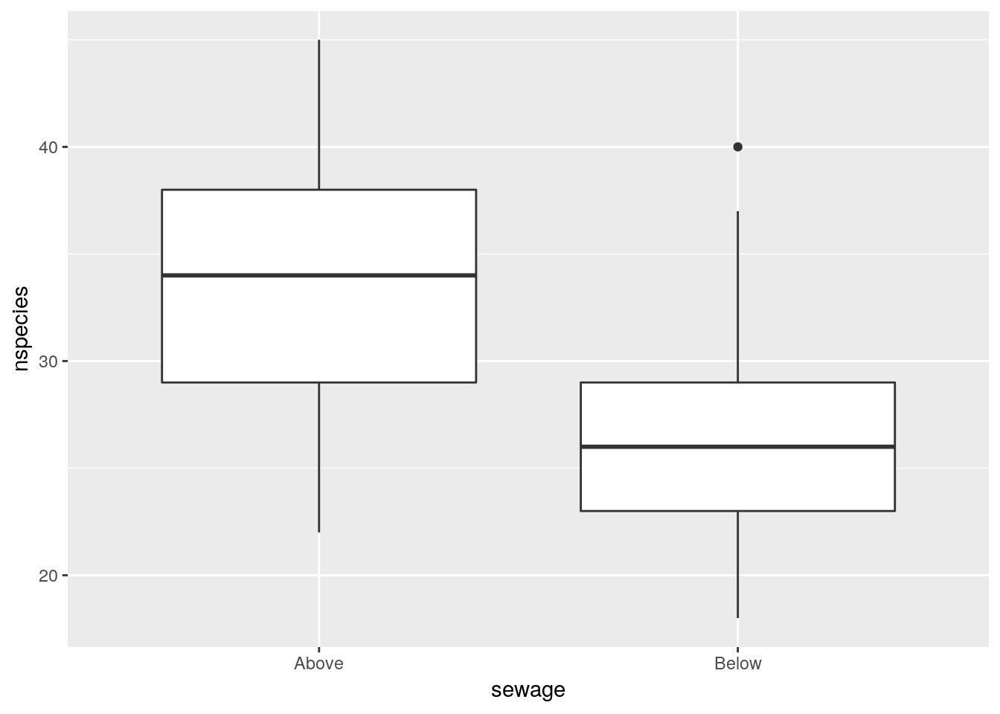

We can still obtain confidence intervals, but they would be based on a simplistic model that does not take into account the true data structure.


```r
g1<-g0+stat_summary(fun.data=mean_cl_normal,geom="point")+stat_summary(fun.data=mean_cl_normal,geom="errorbar",colour="black")
g1
```

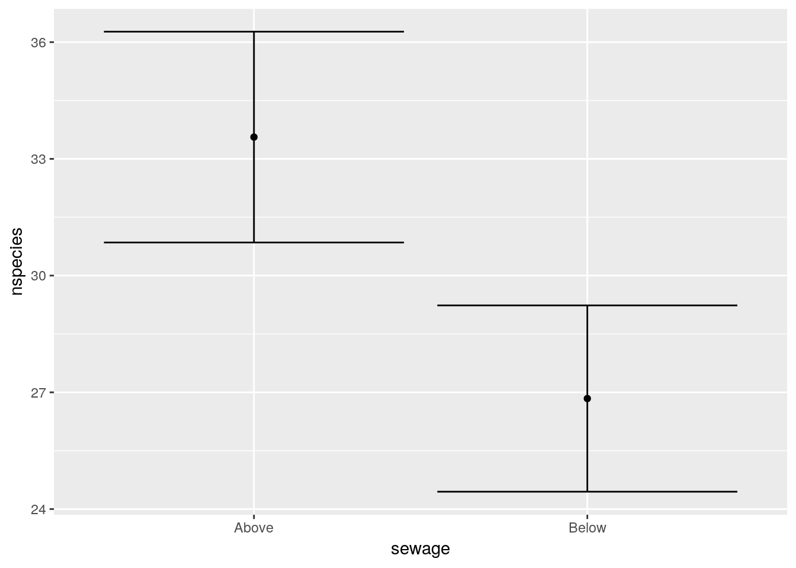

We could try splitting the data by river in order to visualise the pattern of differences.


```r
g1+facet_wrap(~id)
```

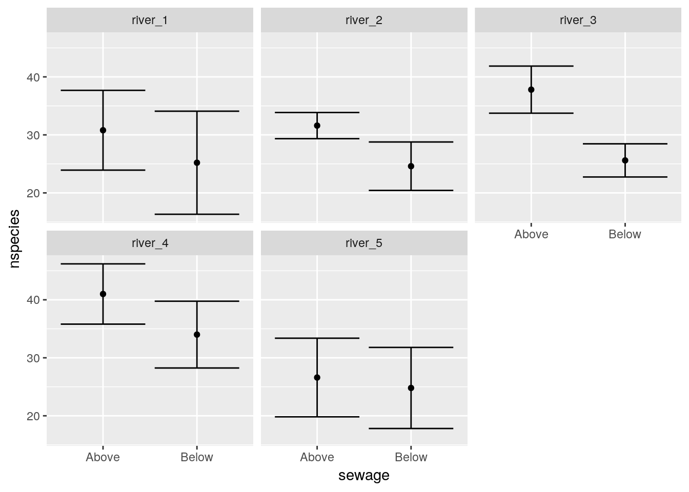

### Incorrect model specification.

We could think of river id as a fixed effect. This may be reasonable if we are interested in differences between rivers. However it does not take into account the fact that the data consists of sub samples at each site. So the model below would be wrong.


```r
mod<-lm(nspecies~sewage+id,data=d)
anova(mod)
```

```
## Analysis of Variance Table
## 
## Response: nspecies
##           Df Sum Sq Mean Sq F value    Pr(>F)    
## sewage     1 564.48  564.48 25.0596 9.454e-06 ***
## id         4 850.40  212.60  9.4382 1.344e-05 ***
## Residuals 44 991.12   22.53                      
## ---
## Signif. codes:  0 '***' 0.001 '**' 0.01 '*' 0.05 '.' 0.1 ' ' 1
```


### Mixed effect model

The data could be modelled as nested random effects. There is random variability between rivers and there is also random variability between sites at each river. The fixed effect that we are most interested in concerns whether the site is above or below the sewage outfall.


```r
mod<-lmer(nspecies~sewage+(1|id/site),data=d)
summary(mod)
```

```
## Linear mixed model fit by REML. t-tests use Satterthwaite's method [
## lmerModLmerTest]
## Formula: nspecies ~ sewage + (1 | id/site)
##    Data: d
## 
## REML criterion at convergence: 300.6
## 
## Scaled residuals: 
##      Min       1Q   Median       3Q      Max 
## -1.59547 -0.71758 -0.05326  0.60059  2.36669 
## 
## Random effects:
##  Groups   Name        Variance Std.Dev.
##  site:id  (Intercept)  2.694   1.641   
##  id       (Intercept) 17.789   4.218   
##  Residual             21.300   4.615   
## Number of obs: 50, groups:  site:id, 10; id, 5
## 
## Fixed effects:
##             Estimate Std. Error     df t value Pr(>|t|)    
## (Intercept)   33.560      2.225  5.272  15.086 1.54e-05 ***
## sewageBelow   -6.720      1.668  4.001  -4.029   0.0157 *  
## ---
## Signif. codes:  0 '***' 0.001 '**' 0.01 '*' 0.05 '.' 0.1 ' ' 1
## 
## Correlation of Fixed Effects:
##             (Intr)
## sewageBelow -0.375
```

```r
par(mar=c(4,8,4,2)) 
plot(glht(mod))
```

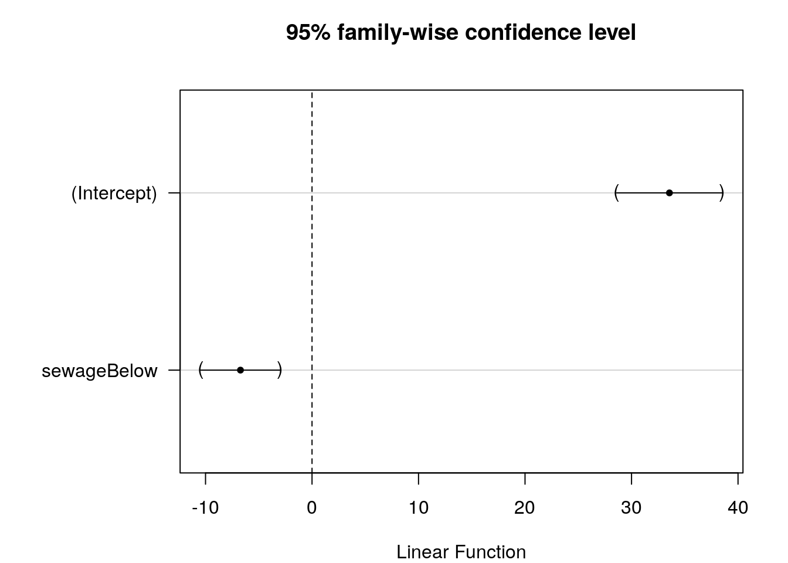

We could also treat river as a fixed effect if we are specifically interested in differences between rivers.


```r
mod<-lmer(nspecies~sewage+id+(1|site),data=d)
anova(mod)
```

```
## Type III Analysis of Variance Table with Satterthwaite's method
##        Sum Sq Mean Sq NumDF DenDF F value  Pr(>F)  
## sewage  345.7   345.7     1     4 16.2300 0.01575 *
## id      520.8   130.2     4     4  6.1127 0.05374 .
## ---
## Signif. codes:  0 '***' 0.001 '**' 0.01 '*' 0.05 '.' 0.1 ' ' 1
```

```r
summary(mod)
```

```
## Linear mixed model fit by REML. t-tests use Satterthwaite's method [
## lmerModLmerTest]
## Formula: nspecies ~ sewage + id + (1 | site)
##    Data: d
## 
## REML criterion at convergence: 275.4
## 
## Scaled residuals: 
##      Min       1Q   Median       3Q      Max 
## -1.54770 -0.70432 -0.04561  0.61090  2.41441 
## 
## Random effects:
##  Groups   Name        Variance Std.Dev.
##  site     (Intercept)  2.696   1.642   
##  Residual             21.300   4.615   
## Number of obs: 50, groups:  site, 10
## 
## Fixed effects:
##             Estimate Std. Error     df t value Pr(>|t|)    
## (Intercept)   31.360      2.043  4.000  15.350 0.000105 ***
## sewageBelow   -6.720      1.668  4.000  -4.029 0.015751 *  
## idriver_2      0.100      2.637  4.000   0.038 0.971572    
## idriver_3      3.700      2.637  4.000   1.403 0.233304    
## idriver_4      9.500      2.637  4.000   3.602 0.022718 *  
## idriver_5     -2.300      2.637  4.000  -0.872 0.432392    
## ---
## Signif. codes:  0 '***' 0.001 '**' 0.01 '*' 0.05 '.' 0.1 ' ' 1
## 
## Correlation of Fixed Effects:
##             (Intr) swgBlw idrv_2 idrv_3 idrv_4
## sewageBelow -0.408                            
## idriver_2   -0.645  0.000                     
## idriver_3   -0.645  0.000  0.500              
## idriver_4   -0.645  0.000  0.500  0.500       
## idriver_5   -0.645  0.000  0.500  0.500  0.500
```

```r
par(mar=c(4,8,4,2)) 
plot(glht(mod))
```

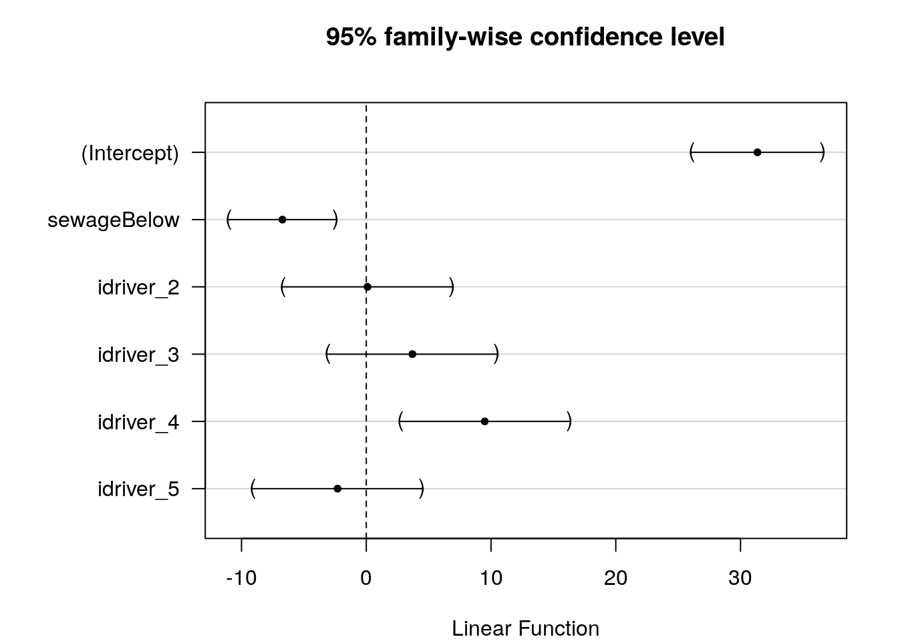

Notice that both models provide the same p-value for the effect of the sewage outfalls.

Using nested random effects produces an almost identical result to that which would be obtained by taking the means of the sub samples, as we have seen in previous examples.


```r
# dd<-melt(d,m="nspecies") reshape method of aggregation
# dd1<-cast(dd,id+sewage~variable,mean)
## Dplyr method
d %>% group_by(id,sewage) %>% summarise(nspecies=mean(nspecies)) ->dd
mod<-lm(nspecies~id+sewage,data=dd)
anova(mod)
```

```
## Analysis of Variance Table
## 
## Response: nspecies
##           Df  Sum Sq Mean Sq F value  Pr(>F)  
## id         4 170.080  42.520  6.1127 0.05374 .
## sewage     1 112.896 112.896 16.2300 0.01575 *
## Residuals  4  27.824   6.956                  
## ---
## Signif. codes:  0 '***' 0.001 '**' 0.01 '*' 0.05 '.' 0.1 ' ' 1
```

# Factorial designs

Factorial designs refer to situations in which more than one factor is of interest. There are various reasons to use more than one factor in an experiment. In some cases it may save time and money to measure the effects of two factors simultaneously. This makes sense if the factors are additive, with no interactions. In other situations we may actually be interested in looking for interactions between two factors. Altering the level of one factor may alter the effect of another. 

Let's look at an example. An experimenter was interested in the effect of irrigation on the yield of two varieties of wheat. The design involved assigning variety and irrigation treatment at random to 24 plots in order to have 6 replicates of each combination of treatment levels (v1:i1,v1:i2,v2:i1 and v2:i2)

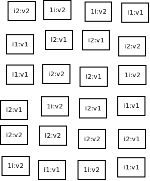

For the moment let's ignore the possibilities of setting up the experiment within blocks and assume that the experimental units are uniform prior to treatment and are independent of each other.


```r
d<-read.csv("https://tinyurl.com/aqm-data/factorial.csv")
```

We can look at the results as box plots by conditioning on one of the factors using facet wrapping.


```r
g0<-ggplot(d,aes(x=irrigation,y=yield))
g0+geom_boxplot()+facet_wrap(~variety)
```

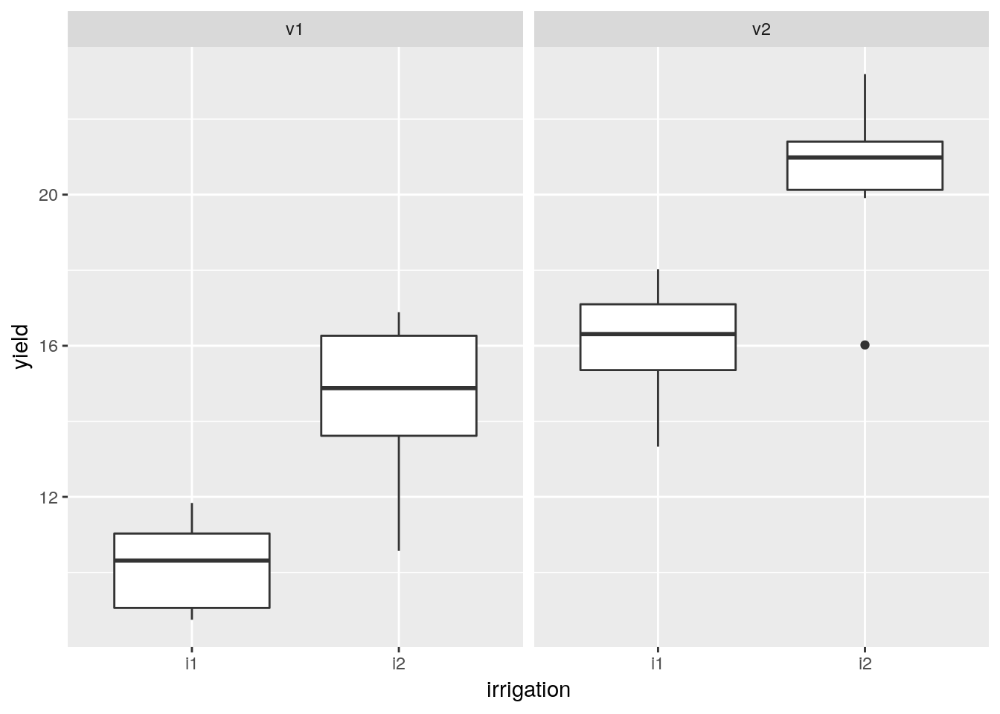

We can also look at confidence intervals.


```r
g1<-g0+stat_summary(fun.data=mean_cl_normal,geom="point")
g1<-g1+stat_summary(fun.data=mean_cl_normal,geom="errorbar",colour="black")
g1+facet_wrap(~variety)
```

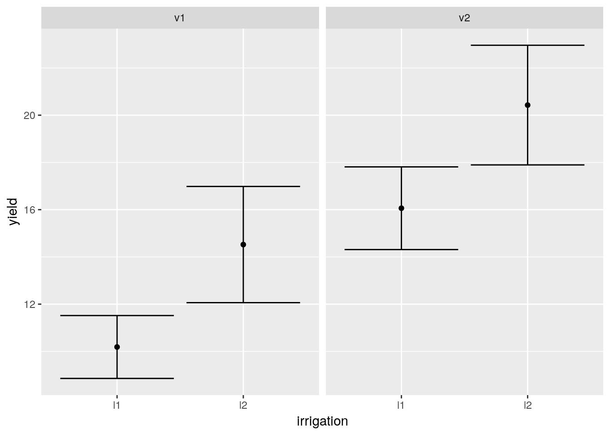

## Model fitting

There are no random effects in this design, so a simple linear model can be used. Typing an asterix (*) in the model formula fits a model with main effects and an interaction.


```r
mod<-lm(yield~irrigation*variety,data=d)
anova(mod)
```

```
## Analysis of Variance Table
## 
## Response: yield
##                    Df  Sum Sq Mean Sq F value    Pr(>F)    
## irrigation          1 113.600 113.600 28.9293 2.897e-05 ***
## variety             1 208.128 208.128 53.0020 4.845e-07 ***
## irrigation:variety  1   0.001   0.001  0.0003    0.9854    
## Residuals          20  78.536   3.927                      
## ---
## Signif. codes:  0 '***' 0.001 '**' 0.01 '*' 0.05 '.' 0.1 ' ' 1
```

```r
summary(mod)
```

```
## 
## Call:
## lm(formula = yield ~ irrigation * variety, data = d)
## 
## Residuals:
##     Min      1Q  Median      3Q     Max 
## -4.4064 -0.9752  0.4121  1.0838  2.7629 
## 
## Coefficients:
##                        Estimate Std. Error t value Pr(>|t|)    
## (Intercept)            10.18679    0.80899  12.592 5.78e-11 ***
## irrigationi2            4.33623    1.14409   3.790  0.00115 ** 
## varietyv2               5.87464    1.14409   5.135 5.05e-05 ***
## irrigationi2:varietyv2  0.03003    1.61798   0.019  0.98538    
## ---
## Signif. codes:  0 '***' 0.001 '**' 0.01 '*' 0.05 '.' 0.1 ' ' 1
## 
## Residual standard error: 1.982 on 20 degrees of freedom
## Multiple R-squared:  0.8038,	Adjusted R-squared:  0.7744 
## F-statistic: 27.31 on 3 and 20 DF,  p-value: 2.836e-07
```

You should be able to see that the interaction term in this case is not significant. The effects package allows us to look at the pattern of effects visually.


```r
e <- Effect(c("irrigation","variety"), mod)
plot(e)
```

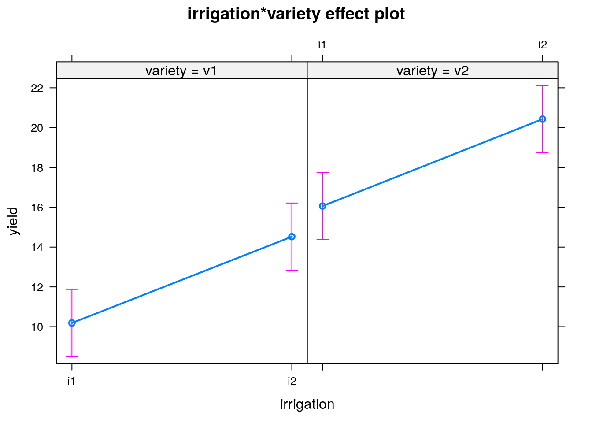

You can see that the lines between the two levels of the factors follow the same slope but are moved up. This is indicative of additive effects. We could therefore fit a simpler model


```r
mod<-lm(yield~irrigation+variety,data=d)
anova(mod)
```

```
## Analysis of Variance Table
## 
## Response: yield
##            Df  Sum Sq Mean Sq F value    Pr(>F)    
## irrigation  1 113.600  113.60  30.375 1.811e-05 ***
## variety     1 208.128  208.13  55.651 2.478e-07 ***
## Residuals  21  78.537    3.74                      
## ---
## Signif. codes:  0 '***' 0.001 '**' 0.01 '*' 0.05 '.' 0.1 ' ' 1
```

```r
summary(mod)
```

```
## 
## Call:
## lm(formula = yield ~ irrigation + variety, data = d)
## 
## Residuals:
##     Min      1Q  Median      3Q     Max 
## -4.3989 -0.9827  0.4196  1.0876  2.7704 
## 
## Coefficients:
##              Estimate Std. Error t value Pr(>|t|)    
## (Intercept)   10.1793     0.6837  14.888 1.24e-12 ***
## irrigationi2   4.3512     0.7895   5.511 1.81e-05 ***
## varietyv2      5.8897     0.7895   7.460 2.48e-07 ***
## ---
## Signif. codes:  0 '***' 0.001 '**' 0.01 '*' 0.05 '.' 0.1 ' ' 1
## 
## Residual standard error: 1.934 on 21 degrees of freedom
## Multiple R-squared:  0.8038,	Adjusted R-squared:  0.7851 
## F-statistic: 43.01 on 2 and 21 DF,  p-value: 3.747e-08
```


## Experiment with interactions

Let's look at data from the same experimental set up, but in this case there **is** an interaction.


```r
d<-read.csv("https://tinyurl.com/aqm-data/factorial2.csv")
head(d)
```

```
##   variety irrigation     yield
## 1      v1         i1  8.747092
## 2      v1         i2  7.367287
## 3      v2         i1 13.328743
## 4      v2         i2 23.190562
## 5      v1         i1 10.659016
## 6      v1         i2  5.359063
```

The pattern is apparent in the box plots.


```r
g0<-ggplot(d,aes(x=irrigation,y=yield))
g0+geom_boxplot()+facet_wrap(~variety)
```

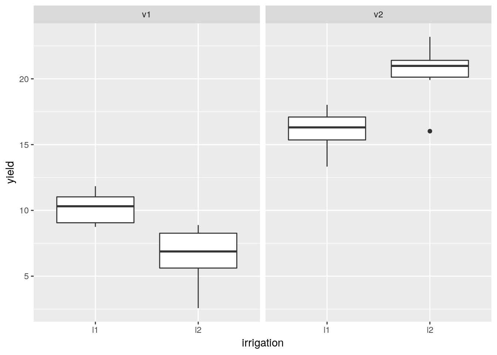


```r
g1<-g0+stat_summary(fun.data=mean_cl_normal,geom="point")
g1<-g1+stat_summary(fun.data=mean_cl_normal,geom="errorbar",colour="black")
g1+facet_wrap(~variety)
```

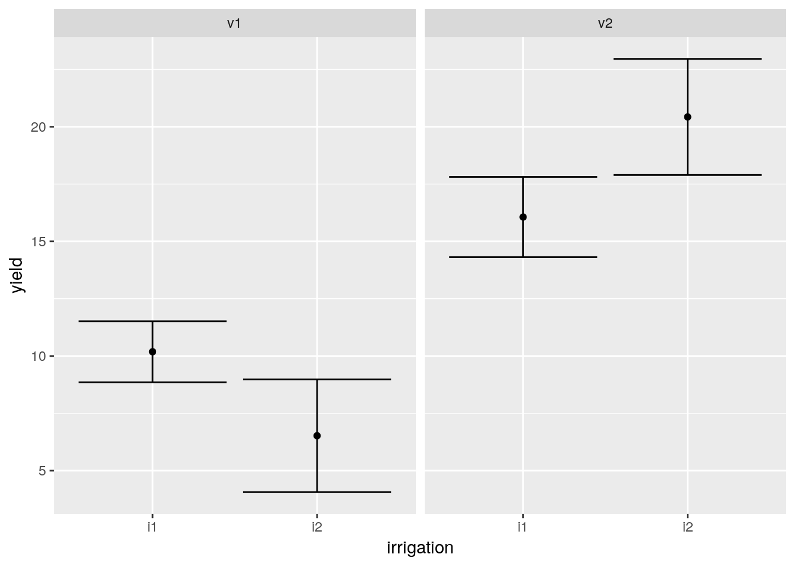

Now if we fit a model we will find a very significant interaction.


```r
mod<-lm(yield~irrigation*variety,data=d)
anova(mod)
```

```
## Analysis of Variance Table
## 
## Response: yield
##                    Df Sum Sq Mean Sq  F value    Pr(>F)    
## irrigation          1   0.74    0.74   0.1885    0.6688    
## variety             1 586.83  586.83 149.4427 9.789e-11 ***
## irrigation:variety  1  96.72   96.72  24.6313 7.484e-05 ***
## Residuals          20  78.54    3.93                       
## ---
## Signif. codes:  0 '***' 0.001 '**' 0.01 '*' 0.05 '.' 0.1 ' ' 1
```

```r
summary(mod)
```

```
## 
## Call:
## lm(formula = yield ~ irrigation * variety, data = d)
## 
## Residuals:
##     Min      1Q  Median      3Q     Max 
## -4.4064 -0.9752  0.4121  1.0838  2.7629 
## 
## Coefficients:
##                        Estimate Std. Error t value Pr(>|t|)    
## (Intercept)              10.187      0.809  12.592 5.78e-11 ***
## irrigationi2             -3.664      1.144  -3.202  0.00447 ** 
## varietyv2                 5.875      1.144   5.135 5.05e-05 ***
## irrigationi2:varietyv2    8.030      1.618   4.963 7.48e-05 ***
## ---
## Signif. codes:  0 '***' 0.001 '**' 0.01 '*' 0.05 '.' 0.1 ' ' 1
## 
## Residual standard error: 1.982 on 20 degrees of freedom
## Multiple R-squared:  0.897,	Adjusted R-squared:  0.8816 
## F-statistic: 58.09 on 3 and 20 DF,  p-value: 4.713e-10
```

The first variety does not respond positively to irrigation. In fact yield may be reduced through over watering. In this case the effects are not additive. They are conditional on the level of one of the factors. In this situation the main effects of irrigation or variety can be difficult to interpret as they represent the average effect taken over both levels of the other factor. 


```r
e <- Effect(c("irrigation","variety"), mod)
plot(e)
```

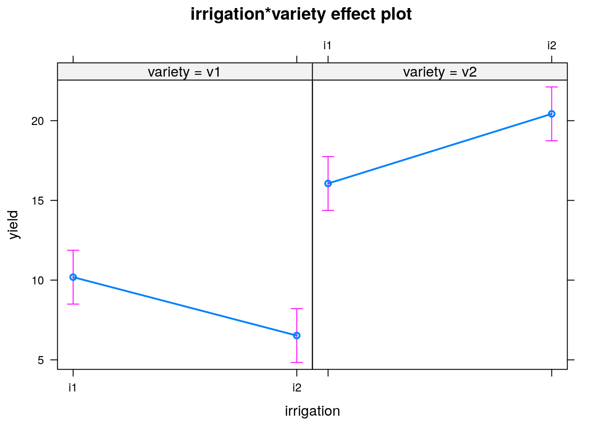

Interactions are very common in many ecological situations. Although some textbooks on experimental design treat interactive effects as undesirable, finding interactions is an interesting result. In this case the discussion of the results could concentrate on finding an explanation for the difference in response between the two varieties.

## Full factorial with blocking

The previous example treated each experimental unit as independent. In many situations there is some spatial dependence between experimental units. 

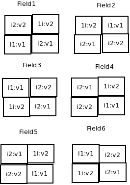


```r
d<-read.csv("https://tinyurl.com/aqm-data/factorial_block.csv")
head(d)
```

```
##   variety   field field_effect irrigation     yield
## 1      v1 field_1   -2.5058152         i1  8.469043
## 2      v1 field_1   -2.5058152         i2 13.970834
## 3      v2 field_1   -2.5058152         i1 13.645747
## 4      v2 field_1   -2.5058152         i2 16.883408
## 5      v1 field_2    0.7345733         i1 13.758136
## 6      v1 field_2    0.7345733         i2 16.514260
```

Once again, the potential advantage of taking into account blocking is to increase the power of the analysis. If the intrinsic variability between blocks is contributing to the variability in the response of the experimental units then accounting for it in the statistical model will increase power.

This can be seen in this example by first plotting the raw data.


```r
g0<-ggplot(d,aes(x=irrigation,y=yield))
g0+geom_boxplot()+facet_wrap(~variety)
```

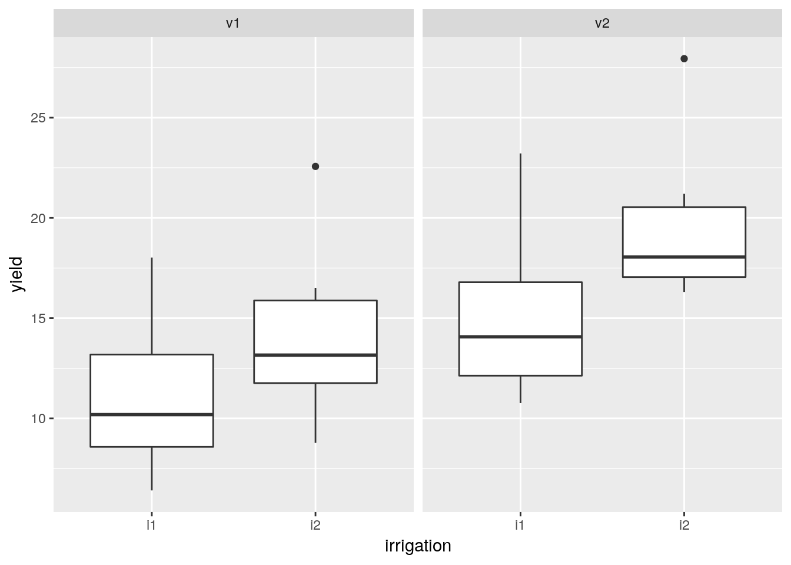


```r
g1<-g0+stat_summary(fun.data=mean_cl_normal,geom="point")
g1<-g1+stat_summary(fun.data=mean_cl_normal,geom="errorbar",colour="black")
g1+facet_wrap(~variety)
```

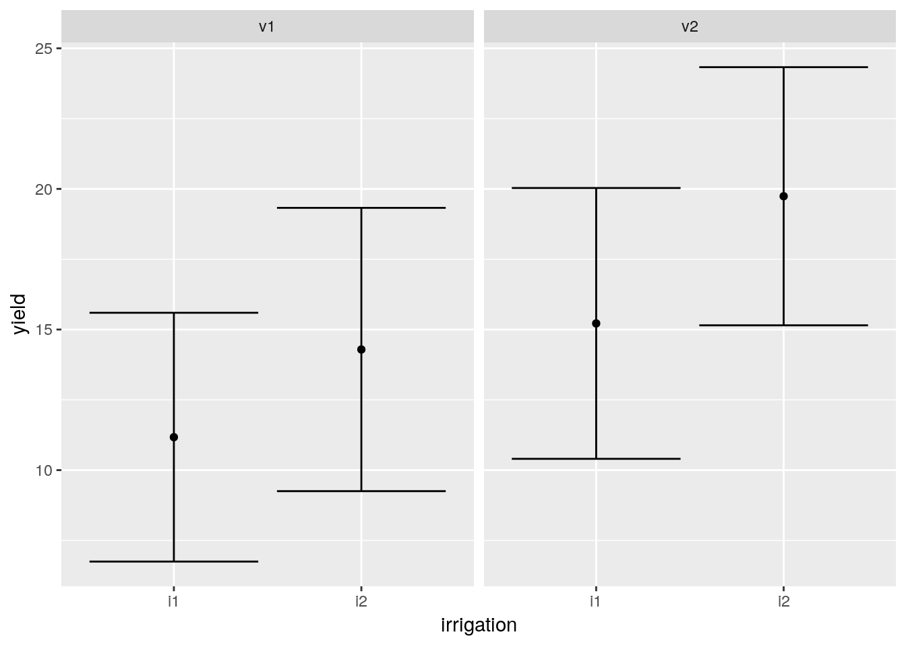

### Model not taking into account blocks

If we don't take into account the variability attributable to the blocks in the model we lose statistical power.


```r
mod<-lm(yield~variety*irrigation,data=d)
anova(mod)
```

```
## Analysis of Variance Table
## 
## Response: yield
##                    Df Sum Sq Mean Sq F value  Pr(>F)  
## variety             1 135.24 135.238  6.6790 0.01772 *
## irrigation          1  87.57  87.567  4.3246 0.05064 .
## variety:irrigation  1   2.96   2.962  0.1463 0.70614  
## Residuals          20 404.97  20.248                  
## ---
## Signif. codes:  0 '***' 0.001 '**' 0.01 '*' 0.05 '.' 0.1 ' ' 1
```

Effects plot.


```r
e <- Effect(c("irrigation","variety"), mod)
plot(e)
```

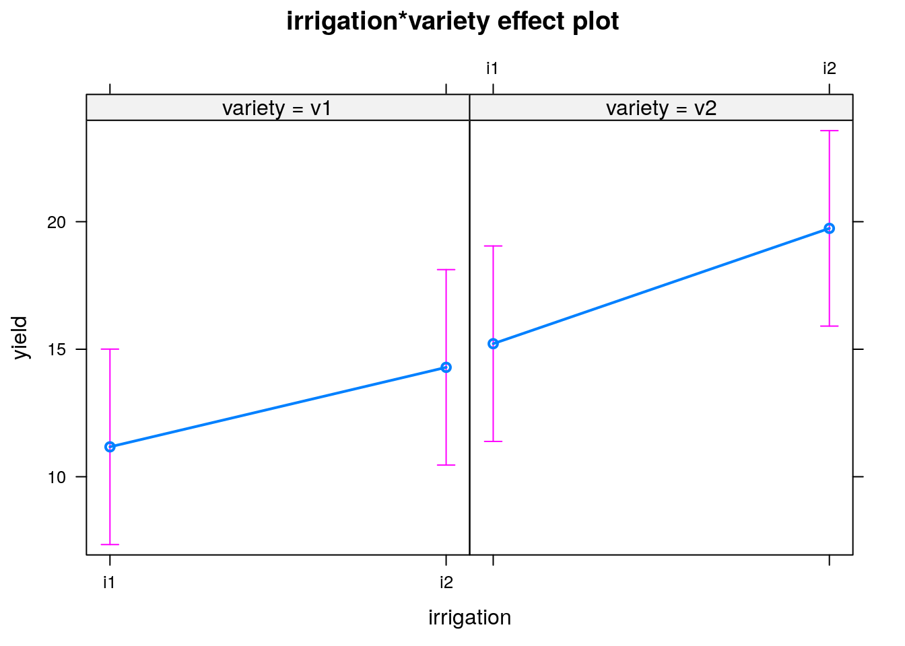

### Model with block as a random effect.

Block can be fitted as a random effect using lmer.


```r
mod<-lmer(yield~variety*irrigation+(1|field),data=d)
summary(mod)
```

```
## Linear mixed model fit by REML. t-tests use Satterthwaite's method [
## lmerModLmerTest]
## Formula: yield ~ variety * irrigation + (1 | field)
##    Data: d
## 
## REML criterion at convergence: 103
## 
## Scaled residuals: 
##      Min       1Q   Median       3Q      Max 
## -1.98922 -0.49404 -0.04189  0.55337  1.34688 
## 
## Random effects:
##  Groups   Name        Variance Std.Dev.
##  field    (Intercept) 16.991   4.122   
##  Residual              3.257   1.805   
## Number of obs: 24, groups:  field, 6
## 
## Fixed effects:
##                        Estimate Std. Error     df t value Pr(>|t|)    
## (Intercept)              11.172      1.837  6.426   6.082 0.000695 ***
## varietyv2                 4.045      1.042 15.000   3.882 0.001474 ** 
## irrigationi2              3.118      1.042 15.000   2.992 0.009119 ** 
## varietyv2:irrigationi2    1.405      1.474 15.000   0.954 0.355380    
## ---
## Signif. codes:  0 '***' 0.001 '**' 0.01 '*' 0.05 '.' 0.1 ' ' 1
## 
## Correlation of Fixed Effects:
##             (Intr) vrtyv2 irrgt2
## varietyv2   -0.284              
## irrigation2 -0.284  0.500       
## vrtyv2:rrg2  0.201 -0.707 -0.707
```

Now notice how the effects plot shows more effects of the treatment.


```r
e <- Effect(c("irrigation","variety"), mod)
plot(e)
```


## Split plot

In all the previous examples there have been alternatives available to the use of mixed models with random and fixed effects. In the case of situations involving sub sampling the dependence between sub samples can be dealt with by taking means for each experimental unit. In the cases in which variability occurs between blocks it is possible to include blocks in a model as a fixed effect. Repeat measures designs can use differences within subjects as responses. However there are some more complex situations in which the sum of squares attributed to the variability attributed to different treatments should be compared with different error terms. A classic example is the split plot design in agriculture.
The split plot design arose simply as a form of reducing the cost and difficulty of setting up field experiments. When treating field plots it can sometimes be much easier to set up some treatments for larger areas than a smaller one. Imagine the case in the yield experiment we have been looking at in which whole fields are planted with single varieties of wheat and each field is split into two forms of irrigation treatment.


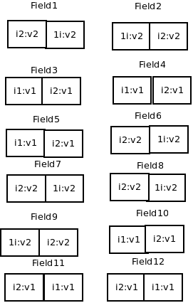

In some respects you could argue that not much has changed from the block design. However if each main field has a different response then the error term for variety will have fewer degrees of freedom than that for irrigation as the same variety has been planted in each field which is then "split" into two levels of irrigation. So effectively there is less independent replication of variety than of irrigation.

If this is not taken into account there may be an accusation of "pseudo replication" with respect to the effect of variety as the anlysis would potentially treat all subplots as independent replicates without taking into account the fact that they are nested within field. However this is a problem if there are shared effects at the field level. If it were possible to ensure as much independence between subplots within the same field as between subplots as a whole it wouldn't matter.  

Here is a dataframe with results from the split plot experiment shown above.


```r
d<-read.csv("https://tinyurl.com/aqm-data/split_plot.csv")
str(d)
```

```
## 'data.frame':	24 obs. of  5 variables:
##  $ variety     : Factor w/ 2 levels "v1","v2": 1 1 2 2 1 1 2 2 1 1 ...
##  $ field       : Factor w/ 12 levels "field_1","field_10",..: 1 1 5 5 6 6 7 7 8 8 ...
##  $ field_effect: num  -2.506 -2.506 0.735 0.735 -3.343 ...
##  $ irrigation  : Factor w/ 2 levels "i1","i2": 1 2 1 2 1 2 1 2 1 2 ...
##  $ yield       : num  6.25 8.06 17.98 20.64 6.63 ...
```

### Visualising the data

We can look at the data as boxplots.


```r
g0<-ggplot(d,aes(x=irrigation,y=yield))
g0+geom_boxplot()+facet_wrap(~variety)
```

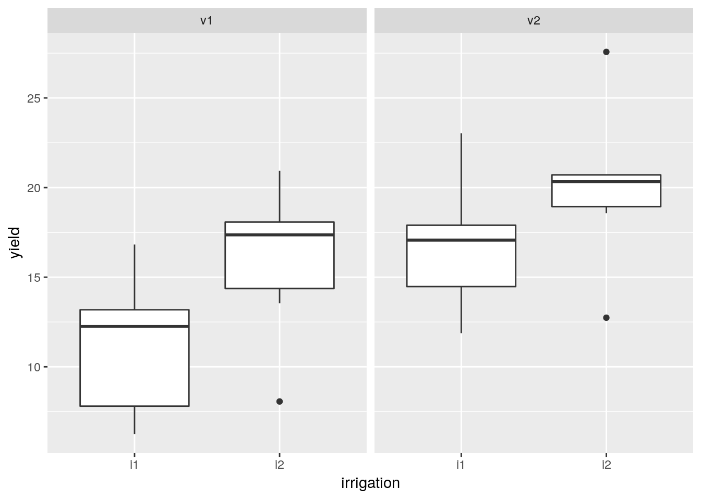


```r
g1<-g0+stat_summary(fun.data=mean_cl_normal,geom="point")
g1<- g1+stat_summary(fun.data=mean_cl_normal,geom="errorbar",colour="black")
g1+facet_wrap(~variety)
```

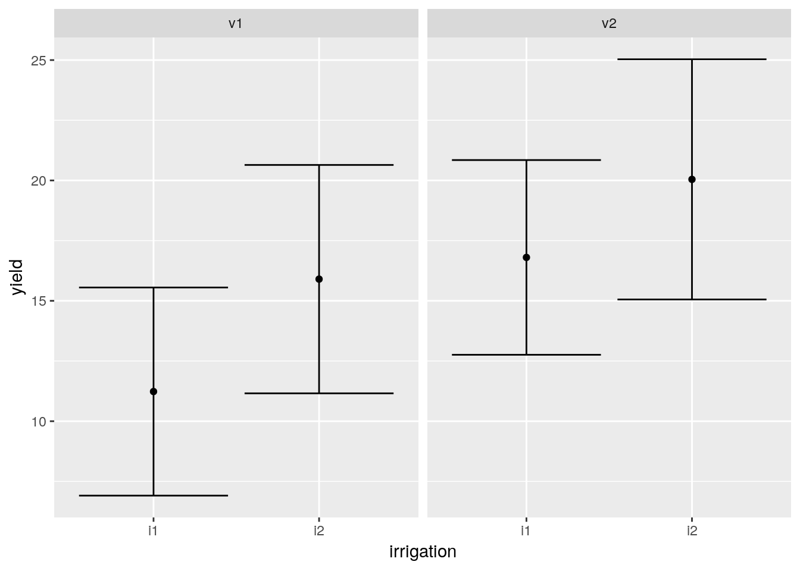

### Incorrect model

The naive way of analysing the data would overlook the potential for a field effect.


```r
mod<-lm(yield~variety*irrigation,data=d)
anova(mod)
```

```
## Analysis of Variance Table
## 
## Response: yield
##                    Df Sum Sq Mean Sq F value  Pr(>F)  
## variety             1 141.55 141.550  7.5656 0.01233 *
## irrigation          1  93.88  93.875  5.0175 0.03661 *
## variety:irrigation  1   3.06   3.059  0.1635 0.69027  
## Residuals          20 374.19  18.710                  
## ---
## Signif. codes:  0 '***' 0.001 '**' 0.01 '*' 0.05 '.' 0.1 ' ' 1
```

### Correct model


```r
mod<-lmer(yield~variety*irrigation+(1|field),data=d)
anova(mod)
```

```
## Type III Analysis of Variance Table with Satterthwaite's method
##                    Sum Sq Mean Sq NumDF DenDF F value    Pr(>F)    
## variety             8.503   8.503     1    10  4.0100   0.07308 .  
## irrigation         93.875  93.875     1    10 44.2701 5.684e-05 ***
## variety:irrigation  3.059   3.059     1    10  1.4424   0.25743    
## ---
## Signif. codes:  0 '***' 0.001 '**' 0.01 '*' 0.05 '.' 0.1 ' ' 1
```


```r
summary(mod)
```

```
## Linear mixed model fit by REML. t-tests use Satterthwaite's method [
## lmerModLmerTest]
## Formula: yield ~ variety * irrigation + (1 | field)
##    Data: d
## 
## REML criterion at convergence: 107.1
## 
## Scaled residuals: 
##      Min       1Q   Median       3Q      Max 
## -1.31217 -0.32739  0.08055  0.44805  1.21676 
## 
## Random effects:
##  Groups   Name        Variance Std.Dev.
##  field    (Intercept) 16.589   4.073   
##  Residual              2.121   1.456   
## Number of obs: 24, groups:  field, 12
## 
## Fixed effects:
##                        Estimate Std. Error      df t value Pr(>|t|)    
## (Intercept)             11.2319     1.7659 11.1971   6.361 4.95e-05 ***
## varietyv2                5.5711     2.4973 11.1971   2.231 0.047051 *  
## irrigationi2             4.6695     0.8407 10.0000   5.554 0.000243 ***
## varietyv2:irrigationi2  -1.4279     1.1890 10.0000  -1.201 0.257430    
## ---
## Signif. codes:  0 '***' 0.001 '**' 0.01 '*' 0.05 '.' 0.1 ' ' 1
## 
## Correlation of Fixed Effects:
##             (Intr) vrtyv2 irrgt2
## varietyv2   -0.707              
## irrigation2 -0.238  0.168       
## vrtyv2:rrg2  0.168 -0.238 -0.707
```

```r
par(mar=c(4,12,4,2)) 
plot(glht(mod))
```

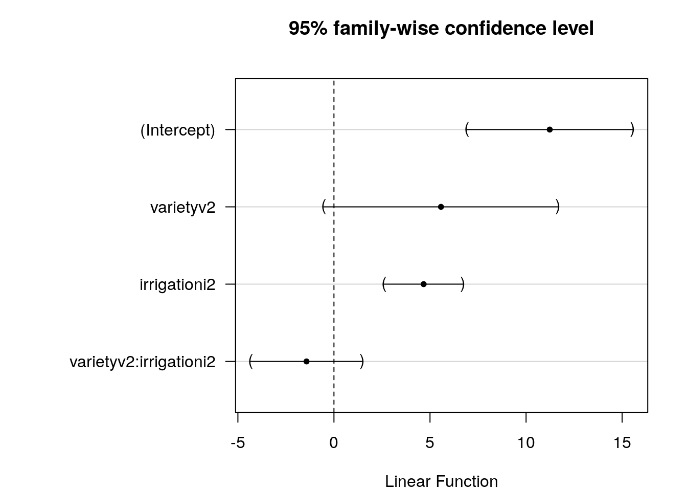


```r
mod<-aov(yield~variety*irrigation+Error(field),data=d)
summary(mod)
```

```
## 
## Error: field
##           Df Sum Sq Mean Sq F value Pr(>F)  
## variety    1  141.5   141.6    4.01 0.0731 .
## Residuals 10  353.0    35.3                 
## ---
## Signif. codes:  0 '***' 0.001 '**' 0.01 '*' 0.05 '.' 0.1 ' ' 1
## 
## Error: Within
##                    Df Sum Sq Mean Sq F value   Pr(>F)    
## irrigation          1  93.88   93.88  44.270 5.68e-05 ***
## variety:irrigation  1   3.06    3.06   1.442    0.257    
## Residuals          10  21.21    2.12                     
## ---
## Signif. codes:  0 '***' 0.001 '**' 0.01 '*' 0.05 '.' 0.1 ' ' 1
```

