# Generalised linear models


So far we have assumed throughout that the variability in our models takes an approximately normal form. This is the assumption used in the classical parametric statistical tests and in regression, ANOVA and ANCOVA. Violations of the assumption often lead to the adoption of simple non parametric tests instead of more informative model based procedures due to worries about not meeting the assumptions needed for parametric modelling. However the set of models, known as Generalised
Linear Models (GLMs) can use any known distribution for the errors.
These are very powerful techniques. They are not much more difficult to apply using R than the methods that you have already seen. However careful thought is required in order to find the correct form for the model.


## Poisson regression

Let's look at the marine invertebrates data that we saw earlier.


```r
d<-read.csv("https://tinyurl.com/aqm-data/marineinverts.csv")
str(d)
```

```
## 'data.frame':	45 obs. of  4 variables:
##  $ richness: int  0 2 8 13 17 10 10 9 19 8 ...
##  $ grain   : num  450 370 192 194 197 ...
##  $ height  : num  2.255 0.865 1.19 -1.336 -1.334 ...
##  $ salinity: num  27.1 27.1 29.6 29.4 29.6 29.4 29.4 29.6 29.6 29.6 ...
```

Plotting species richness against grain size again.


```r
attach(d)
plot(d$richness~d$grain)
```

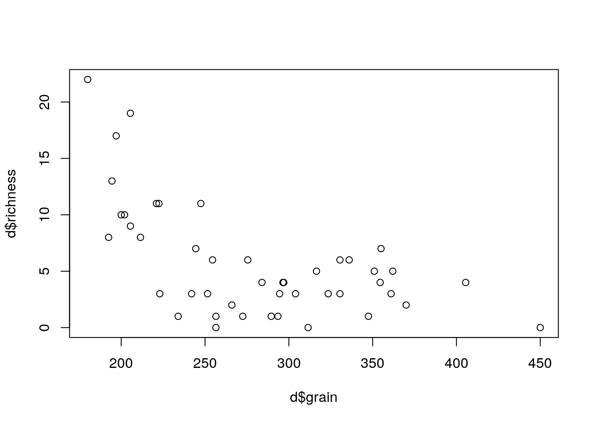


In the previous analysis we looked at how allowing the model to adopt a curved form led to a better fit. However the issue of the inappropriate use of the normal distribution to represent the error term was ignored. 

One way of thinking about the situation is to remember that the description of a regression line includes some statement about the errors.

$y=a+bx+\epsilon$ where $\epsilon=N(o,\sigma^{2})$

This equation should be able to describe the process that leads to
each data point. The model has a deterministic component (the regression line) and a stochastic component (the error term). However when the points are counts a continuous error term is incorrect. Although the mean value (trend) does not have to be an integer value, the actual data values do. So the errors around the trend should be discrete. 

The poisson distribution can represent this. For any value of lambda (which is continuous) the probability distribution of values is discrete. The poisson distribution automatically builds in heterogeniety of variance as the variance of a poisson distribution is in fact equal to lambda.


```r
par(mfcol=c(2,2))
barplot(dpois(0:5,lambda=0.1),names=0:5,main="Lambda=0.1")
barplot(dpois(0:5,lambda=0.5),names=0:5,main="Lambda=0.5")
barplot(dpois(0:5,lambda=1),names=0:5,main="Lambda=1")
barplot(dpois(0:5,lambda=2),names=0:5,main="Lambda=2")
```

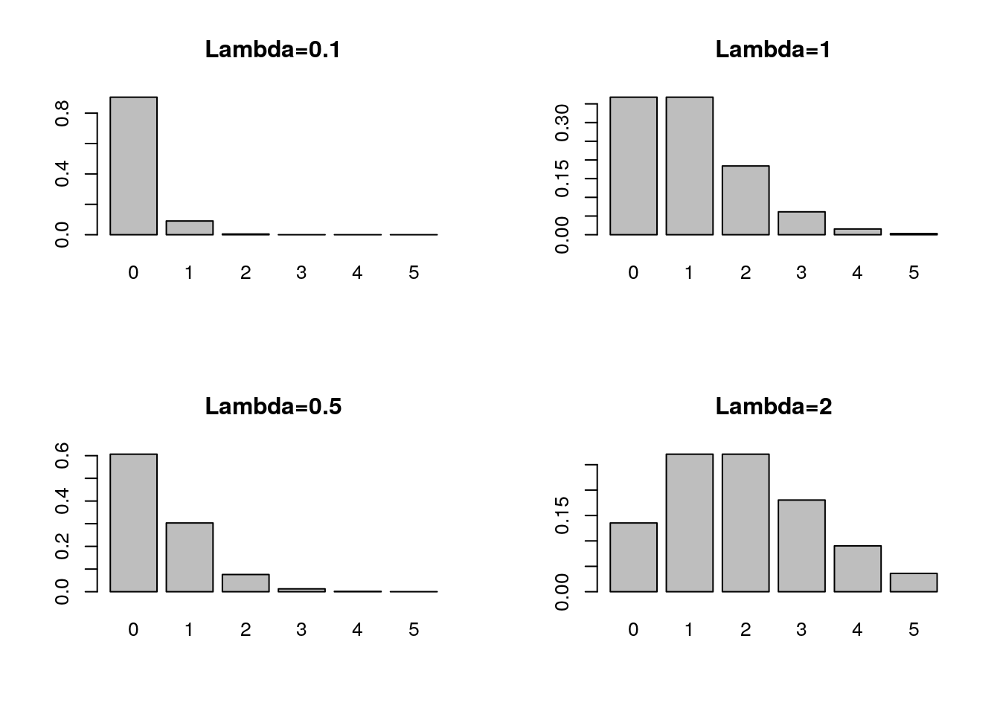

Let's think of a regression line with poisson errors with a=0, and
b=1.

$y=a+bx+\epsilon$ where $\epsilon=poisson(lambda=y)$

Something interesting happens in this case. Lambda is a measure of
the central tendency, but for most of the regression line no observations can actually take the value of lambda. A point can only fall on the line when lambda happens to be an integer.


```r
lambda<-seq(0,10,length=200)
plot(lambda,rpois(200,lambda),pch=21,bg=2)
lines(lambda,lambda,lwd=2)
abline(v=0:10,lty=2)
```

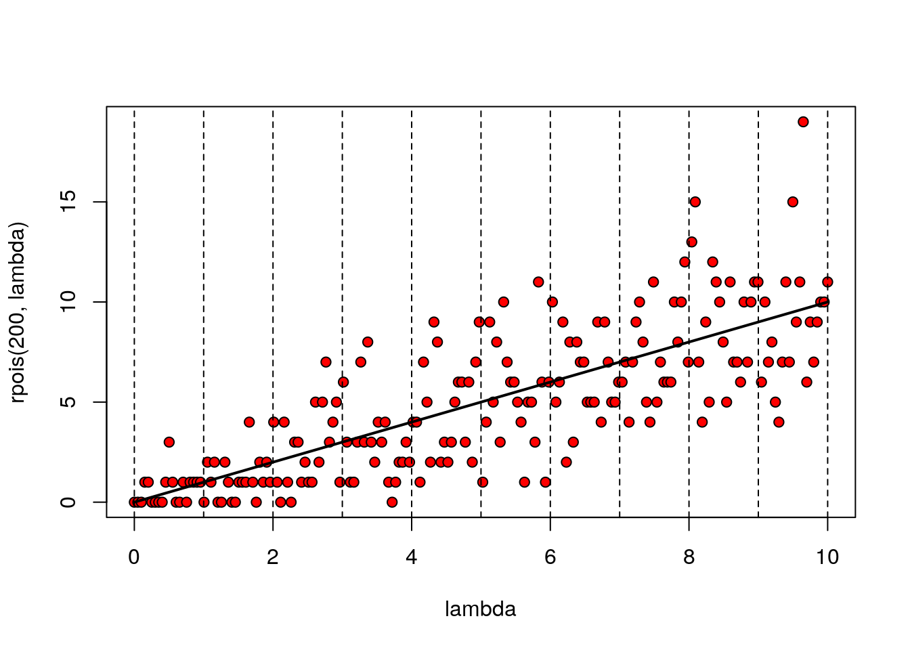


This is the motive for fitting using maximum likelihood. A point that falls a long way away from the deterministic component of a model contributes more to the model's deviance than one that is close. A model with a low total deviance has a higher likelihood than one with a high deviance. The probabilities (that contribute to the deviance) are determined from assumptions regarding the form of the stochastic component of the model. The normal distribution is only one form of determining these probabilities. There are many other possible distributions for the error term.

So let's fit the model again, this time using poisson regression.
By default this uses a log link function. This is usually appropriate for count data that cannot fall below zero. In this case the logarithmic link function also deals nicely with the problem of curvilinearity of the response.


```r
mod1<-glm(data=d,richness ~ grain,family=poisson)
summary(mod1)
```

```
## 
## Call:
## glm(formula = richness ~ grain, family = poisson, data = d)
## 
## Deviance Residuals: 
##     Min       1Q   Median       3Q      Max  
## -3.4828  -1.3897  -0.0732   0.8644   2.5838  
## 
## Coefficients:
##              Estimate Std. Error z value Pr(>|z|)    
## (Intercept)  4.238393   0.299033  14.174  < 2e-16 ***
## grain       -0.009496   0.001179  -8.052 8.16e-16 ***
## ---
## Signif. codes:  0 '***' 0.001 '**' 0.01 '*' 0.05 '.' 0.1 ' ' 1
## 
## (Dispersion parameter for poisson family taken to be 1)
## 
##     Null deviance: 179.75  on 44  degrees of freedom
## Residual deviance: 105.35  on 43  degrees of freedom
## AIC: 251.35
## 
## Number of Fisher Scoring iterations: 5
```

```r
confint(mod1)
```

```
## Waiting for profiling to be done...
```

```
##                   2.5 %       97.5 %
## (Intercept)  3.65451714  4.827458978
## grain       -0.01185141 -0.007224939
```

Plotting the model shows it's form. Note that with when fitting a
GLM in R we can ask for the standard errors and produce approximate confidence intervals using them.


```r
plot(d$richness ~ d$grain)
x<-seq(min(d$grain),max(d$grain),length=100)
a<-predict(mod1,newdata=list(grain=x),type="response",se=T) 
lines(x,a$fit-2*a$se.fit,lty=2)
lines(x,a$fit+2*a$se.fit,lty=2)
lines(x,a$fit)
```

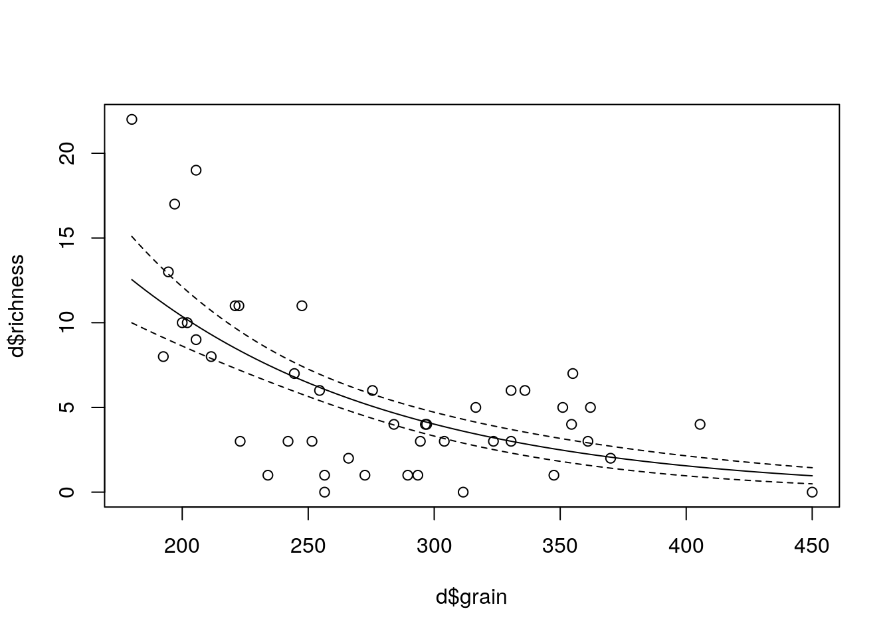

## GGplot

Its easy to add a glm to a ggplot scatterplot. However be careful to add in the methods.args.


```r
library(ggplot2)
g0<-ggplot(d,aes(x=grain,y=richness))
glm1<-g0+geom_point()+stat_smooth(method="glm",method.args=list( family="poisson"), se=TRUE) +ggtitle("Poisson regression with log link function")
glm1
```

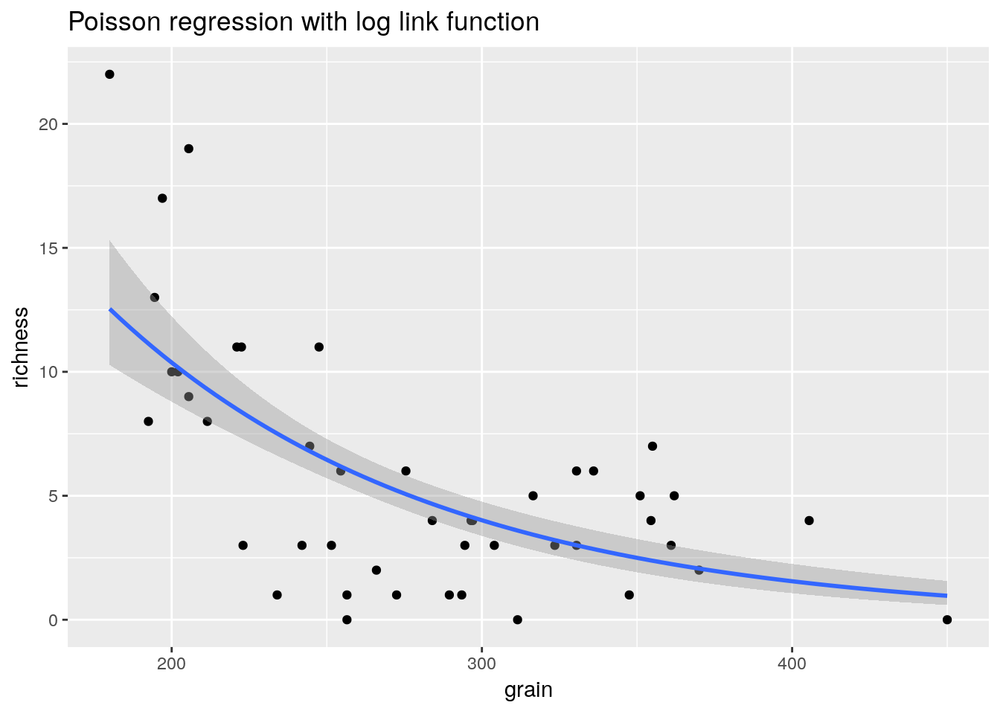


## Showing the results with logged y

This is **not** a good approach, as the zeros are lost, but it demonstrates the idea. 


```r
plot(d$richness ~d$grain, log="y")
```

```
## Warning in xy.coords(x, y, xlabel, ylabel, log): 3 y values <= 0 omitted from
## logarithmic plot
```

```r
x<-seq(min(grain),max(grain),length=100)
a<-predict(mod1,newdata=list(grain=x),type="response",se=T) 
lines(x,a$fit-2*a$se.fit,lty=2)
lines(x,a$fit+2*a$se.fit,lty=2)
lines(x,a$fit)
```

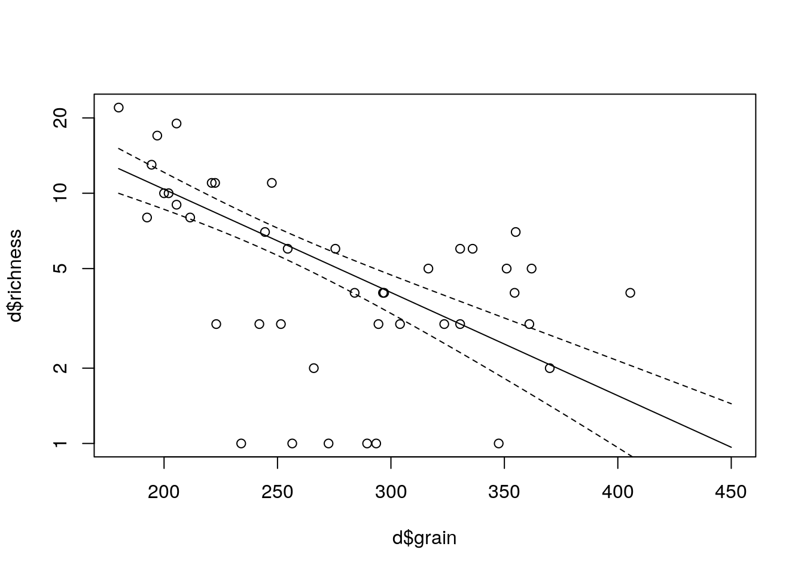


## Log link function explained

The coefficients of the model when we ask for a summary are rather hard to undertand.


```r
summary(mod1)
```

```
## 
## Call:
## glm(formula = richness ~ grain, family = poisson, data = d)
## 
## Deviance Residuals: 
##     Min       1Q   Median       3Q      Max  
## -3.4828  -1.3897  -0.0732   0.8644   2.5838  
## 
## Coefficients:
##              Estimate Std. Error z value Pr(>|z|)    
## (Intercept)  4.238393   0.299033  14.174  < 2e-16 ***
## grain       -0.009496   0.001179  -8.052 8.16e-16 ***
## ---
## Signif. codes:  0 '***' 0.001 '**' 0.01 '*' 0.05 '.' 0.1 ' ' 1
## 
## (Dispersion parameter for poisson family taken to be 1)
## 
##     Null deviance: 179.75  on 44  degrees of freedom
## Residual deviance: 105.35  on 43  degrees of freedom
## AIC: 251.35
## 
## Number of Fisher Scoring iterations: 5
```

The slope is given as -0.009. 
What does this mean? Unlike a regeression slope it is **NOT** the change in y for a unit change in x, as we are using a logarithmic link function.

In generalized linear models, there is always some sort of link function, which is the link between the mean of Y on the left and the predictor variable on the right. It is possible to use the identity link, which leaves the result the same, but typically some other link function is used. The identity link is not a good choice for data with many zeros.

Formally the link function is ..

$f(y|x ) = a + bx$

I.e. Some function of the conditional value of y on x, ignoring the residual error, is predicted by a regression equation rather than simply y.

The log link function exponentiates the linear predictors. It **does not** actually involve a log transform of the outcome variable.

$y = exp(a + bx)$

Which could be also written as ..

$y = e^{a +bx}$

As the logarithm used is the natural logarithm this implies that expected value of y is **multiplied** by $exp(b)$ as we increase the value of x by 1 unit. 

This is not intuitive.

Exponentiating the coefficients in R for the model above produces this result..


```r
exp(coef(mod1))
```

```
## (Intercept)       grain 
##  69.2963902   0.9905485
```

So, the intercept,for a grain size of zero is 69.3 and for each unit increase in grain size the diversity is changed by  99.055 % of the previous value. This is a process of exponential decay, as the richness is falling away steadily with each unti increase in grain size, but the model never leads to a predicted species richness below zero.

One way to make all this a little more understandable is to divide the natural logarithm of 2 (0.69) by the raw slope coefficient, which was found to be  -0.009.


```r
log(2)/(coef(mod1)[2])
```

```
##     grain 
## -72.99001
```

This is using the formula for the half life, or doubling time, in an expenential decay or growth model.

So, in order to double the expected species richness we therefore would have to change the grain size by -72.99 units.

When presenting the results to a mathematically sophisticated audience you can safely place the coefficients within the equation and expect the audience to make sense of it.

$y = e^{a +bx}$

When explaining the result in words you can say that a change in grain size of -72.99 leads to doubling of expected species richness.

Showing a scatterplot with the fitted line is usually the easiest way to visualise the model and to make sense of it intuitively.

### Likelihood and deviance

In order to fully understand all the elements used when analysing a GLM we also need at least an intuitive understanding of the concepts of likelihood and  deviance. 

Models are fit by maximising the likelihood. But, what is the likelihood?

To try to inderstand this, let's first obtain some simple count data. We can simulate the counts from a poisson distribution.


```r
set.seed(1)
x<-rpois(10,lambda=2)
x
```

```
##  [1] 1 1 2 4 1 4 4 2 2 0
```


```r
barplot(table(x))
```

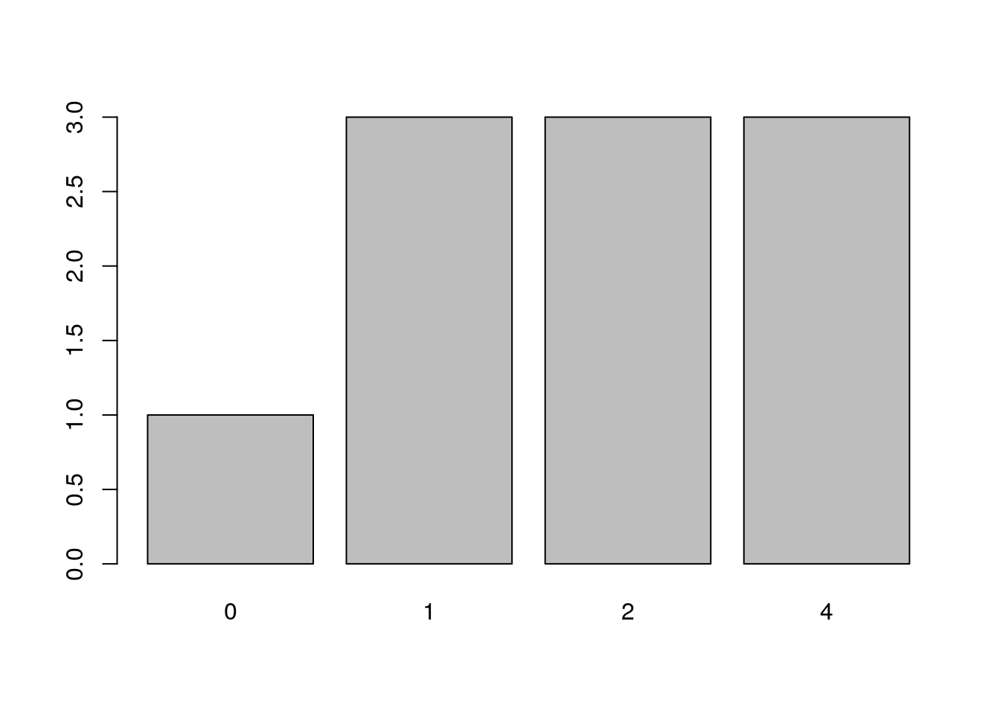

We can fit a simple model that just involves the intercept (mean)
using R. This is.


```r
mod<-glm(x~1,poisson(link="identity"))
summary(mod)
```

```
## 
## Call:
## glm(formula = x ~ 1, family = poisson(link = "identity"))
## 
## Deviance Residuals: 
##      Min        1Q    Median        3Q       Max  
## -2.04939  -0.84624  -0.06957   0.85560   1.16398  
## 
## Coefficients:
##             Estimate Std. Error z value Pr(>|z|)    
## (Intercept)   2.1000     0.4583   4.583 4.59e-06 ***
## ---
## Signif. codes:  0 '***' 0.001 '**' 0.01 '*' 0.05 '.' 0.1 ' ' 1
## 
## (Dispersion parameter for poisson family taken to be 1)
## 
##     Null deviance: 10.427  on 9  degrees of freedom
## Residual deviance: 10.427  on 9  degrees of freedom
## AIC: 36.066
## 
## Number of Fisher Scoring iterations: 3
```

```r
coef(mod)
```

```
## (Intercept) 
##         2.1
```

```r
confint(mod)
```

```
## Waiting for profiling to be done...
```

```
##    2.5 %   97.5 % 
## 1.325155 3.130620
```

```r
lam<-coef(mod)
```

Now, under the poisson model we can calculate a probability of getting any integer from a poisson distribution with a mean of lambda using a standard formula that is built into R. So the probability of getting a zero is dpois(0,lambda=2.1)

dpois(0,lambda=2.1)=0.122

dpois(1,lambda=2.1)=0.257

dpois(2,lambda=2.1)= 0.27

dpois(3,lambda=2.1)=0.189

dpois(4,lambda=2.1)=0.099

What this means is that we have a probability (likelihood) for each of the data points given the model parameter (lambda). We can look at this as a barplot of counts of each probability value.


```r
dx<-dpois(x,lambda=lam)
dx
```

```
##  [1] 0.25715850 0.25715850 0.27001642 0.09923104 0.25715850 0.09923104
##  [7] 0.09923104 0.27001642 0.27001642 0.12245643
```

```r
barplot(table(round(dx,3)))
```

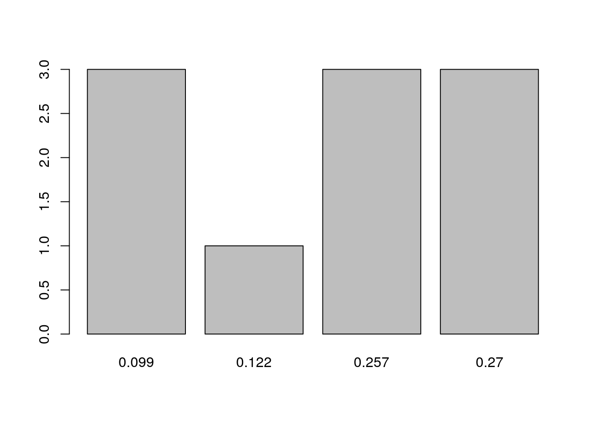

The probability of getting **EXACTLY** the data that we have is the product of all these probabilities, as we find the combined probability of independent events by multiplying them together. Because this is going to result in very small numbers it is usually easier to work with logarithmns and add them together. Hence the term log likelihood that you will see used in all treatments of GLMs.


```r
loglik<-sum(log(dx))
loglik
```

```
## [1] -17.03292
```

```r
logLik(mod)
```

```
## 'log Lik.' -17.03292 (df=1)
```

OK, so that was not too difficult. Notice as well that this calculation gave us the maximum likelihood. If we had used any other value as an estimate for lambda we would have got a lower value expressed as a negative value.


```r
sum(log(dpois(x,lambda=1)))
```

```
## [1] -21.6136
```

```r
sum(log(dpois(x,lambda=lam)))
```

```
## [1] -17.03292
```

```r
sum(log(dpois(x,lambda=3)))
```

```
## [1] -18.54274
```

In order to simplify matters further we remove the sign and work with -2 log likelihood. 


```r
-2*sum(log(dpois(x,lambda=lam)))
```

```
## [1] 34.06584
```

The AIC which we will look at later in the course as a way of comparing two models combines the -2 log likelihood with the number of parameters (k). In this case we have just one parameter so AIC adds 2 to the number we previously calculated.

AIC=2k-2ln(L)


```r
AIC(mod)
```

```
## [1] 36.06584
```


Now finally, what does the deviance refer to?

Well, even a model which has a separate parameter for each data point will still have a likelihood below one. The deviance refers to the difference in -2 log likelihood between the fully saturated model and the actual model. We can get the -2 log likelihood for this model as well.


```r
dpois(x,lambda=x)
```

```
##  [1] 0.3678794 0.3678794 0.2706706 0.1953668 0.3678794 0.1953668 0.1953668
##  [8] 0.2706706 0.2706706 1.0000000
```

```r
satmod<--2*sum(log(dpois(x,lambda=x)))
satmod
```

```
## [1] 23.63838
```

Just to confirm, this should give us the deviance.


```r
-2*loglik-satmod
```

```
## [1] 10.42746
```

```r
deviance(mod)
```

```
## [1] 10.42746
```

Notice that we had ten data points (residual degrees of freedom = n-1 = 9) and a residual deviance that is around 10. This is an indication that the assumption of Poisson distributed residuals is a reasonable one as for mathematical reasons that we need not go into we would expect an addition of just under 1 to the deviance for each additional data point.

Going back to the summary of the model 


```r
summary(mod)
```

```
## 
## Call:
## glm(formula = x ~ 1, family = poisson(link = "identity"))
## 
## Deviance Residuals: 
##      Min        1Q    Median        3Q       Max  
## -2.04939  -0.84624  -0.06957   0.85560   1.16398  
## 
## Coefficients:
##             Estimate Std. Error z value Pr(>|z|)    
## (Intercept)   2.1000     0.4583   4.583 4.59e-06 ***
## ---
## Signif. codes:  0 '***' 0.001 '**' 0.01 '*' 0.05 '.' 0.1 ' ' 1
## 
## (Dispersion parameter for poisson family taken to be 1)
## 
##     Null deviance: 10.427  on 9  degrees of freedom
## Residual deviance: 10.427  on 9  degrees of freedom
## AIC: 36.066
## 
## Number of Fisher Scoring iterations: 3
```


We can see that in this artificial case the null deviance and the residual deviance are identical. This is because the null is "true". There is nothing to report in the model apart from the intercept, i.e. a single value for lambda. If we use this concept in a model with a predictor variable we should see a difference between these two numbers. The larger the diffence, the more of the deviance is "explained" by our predictor. We want to reduce the deviance bt fitting a model,  so if there is a relationship the residual deviance should always be lower than the null deviance.

#### Overdispersion

If the residual deviance is larger than residual degrees of freedom we have overdispersion (extra, unexplained variation in the response).


```r
summary(mod1)
```

```
## 
## Call:
## glm(formula = richness ~ grain, family = poisson, data = d)
## 
## Deviance Residuals: 
##     Min       1Q   Median       3Q      Max  
## -3.4828  -1.3897  -0.0732   0.8644   2.5838  
## 
## Coefficients:
##              Estimate Std. Error z value Pr(>|z|)    
## (Intercept)  4.238393   0.299033  14.174  < 2e-16 ***
## grain       -0.009496   0.001179  -8.052 8.16e-16 ***
## ---
## Signif. codes:  0 '***' 0.001 '**' 0.01 '*' 0.05 '.' 0.1 ' ' 1
## 
## (Dispersion parameter for poisson family taken to be 1)
## 
##     Null deviance: 179.75  on 44  degrees of freedom
## Residual deviance: 105.35  on 43  degrees of freedom
## AIC: 251.35
## 
## Number of Fisher Scoring iterations: 5
```


This means that in fact the measured variance in the data, after taking into account the regression line, is still larger than the lambda values over the range of the regression. This is extra variability that goes beyond that expected under the assumption that the residuals are poisson distributed. 

This is the diagnostic tool which is used in Poisson regression. The point is that under a poisson distribution the variance is fixed. It is always identical to the mean (lamda). This may not be a reasonable assumption, but it is the assumption being made. If it is not met we will need to make some compensation for this in order to produce a more justifiable model.

#### Quasi-poisson regression

A simple way of dealing with over dispersion is to use so called quasi-poisson regression. This finds a weight so that instead of assuming that the variance is equal to lambda the assumption is made that it is equal to some multiple of lambda. The multiple is estimated from the data. The effect is to reduce the significance of the regression term and widen the confidence intervals. It is a rather outdated technique that has some problems, but we'll try it anyway.


```r
mod2<-glm(data=d,richness ~ grain,family=quasipoisson)
summary(mod2)
```

```
## 
## Call:
## glm(formula = richness ~ grain, family = quasipoisson, data = d)
## 
## Deviance Residuals: 
##     Min       1Q   Median       3Q      Max  
## -3.4828  -1.3897  -0.0732   0.8644   2.5838  
## 
## Coefficients:
##              Estimate Std. Error t value Pr(>|t|)    
## (Intercept)  4.238393   0.441806   9.593 3.00e-12 ***
## grain       -0.009496   0.001743  -5.450 2.29e-06 ***
## ---
## Signif. codes:  0 '***' 0.001 '**' 0.01 '*' 0.05 '.' 0.1 ' ' 1
## 
## (Dispersion parameter for quasipoisson family taken to be 2.182862)
## 
##     Null deviance: 179.75  on 44  degrees of freedom
## Residual deviance: 105.35  on 43  degrees of freedom
## AIC: NA
## 
## Number of Fisher Scoring iterations: 5
```

```r
AIC(mod2)
```

```
## [1] NA
```

```r
confint(mod2)
```

```
## Waiting for profiling to be done...
```

```
##                 2.5 %      97.5 %
## (Intercept)  3.376924  5.11119746
## grain       -0.013008 -0.00616704
```

Notice that the confidence intervals are wider. However we cannot obtain a value for AIC from a quasi model as the likelihood function is not fully defined. This limits the application of quasi poisson models, so we'll pass on quickly to a rather more useful approach..


```r
glm2<-g0+geom_point()+geom_smooth(method="glm", method.args=list(family="quasipoisson"), se=TRUE) + ggtitle("Quasipoisson regression")
glm2
```

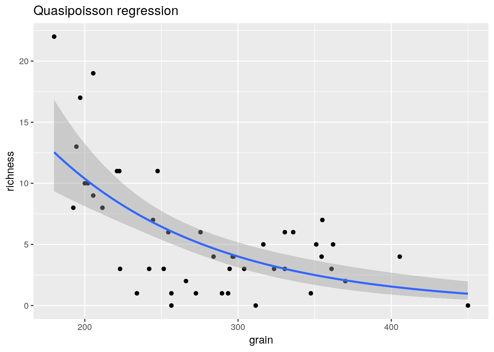


### Negative binomial regression

As we have seen, there is a problem with quasi poisson regression.There is no defined form for the likelihood. Therefore it is impossible to calculate AIC. This makes it difficult to run model comparisons using quasi poisson models. An alternative is to fit the model assuming a negative binomial distribution for the error terms. This is a well defined model for over dispersed count data. 


```r
library(MASS)
mod3<-glm.nb(data=d,richness ~ grain)
summary(mod3)
```

```
## 
## Call:
## glm.nb(formula = richness ~ grain, data = d, init.theta = 4.008462461, 
##     link = log)
## 
## Deviance Residuals: 
##     Min       1Q   Median       3Q      Max  
## -2.7113  -1.0326  -0.1109   0.5508   1.5622  
## 
## Coefficients:
##              Estimate Std. Error z value Pr(>|z|)    
## (Intercept)  3.886804   0.467175   8.320  < 2e-16 ***
## grain       -0.008155   0.001713  -4.762 1.92e-06 ***
## ---
## Signif. codes:  0 '***' 0.001 '**' 0.01 '*' 0.05 '.' 0.1 ' ' 1
## 
## (Dispersion parameter for Negative Binomial(4.0085) family taken to be 1)
## 
##     Null deviance: 79.302  on 44  degrees of freedom
## Residual deviance: 51.719  on 43  degrees of freedom
## AIC: 235.37
## 
## Number of Fisher Scoring iterations: 1
## 
## 
##               Theta:  4.01 
##           Std. Err.:  1.66 
## 
##  2 x log-likelihood:  -229.37
```

```r
confint(mod3)
```

```
## Waiting for profiling to be done...
```

```
##                   2.5 %       97.5 %
## (Intercept)  3.04704214  4.753670460
## grain       -0.01133949 -0.005064891
```

Notice that the AIC for the negative binomial model is much lower than that for the (incorrect) poisson model. The residual deviance is now not much larger than the residual degrees of freedom. It is very important to include the overdispersion rather than use the assumption that the variance is equal to lambda that is built into poisson regression.


```r
AIC(mod1)
```

```
## [1] 251.3523
```

```r
AIC(mod3)
```

```
## [1] 235.3695
```

The variance of the negative binomial is

$var=\mu+\frac{\mu^{2}}{\theta}$

So theta controls the excess variability compared to Poisson. The smaller the value of theta the more skewed the distribution becomes.


```r
par(mfcol=c(2,2))
hist(rnegbin(n=10000,mu=10,theta=100),main="Theta=100",col="grey")
hist(rnegbin(n=10000,mu=10,theta=10),main="Theta=10",col="grey")
hist(rnegbin(n=10000,mu=10,theta=1),main="Theta=1",col="grey")
hist(rnegbin(n=10000,mu=10,theta=0.1),main="Theta=0.1",col="grey")
```

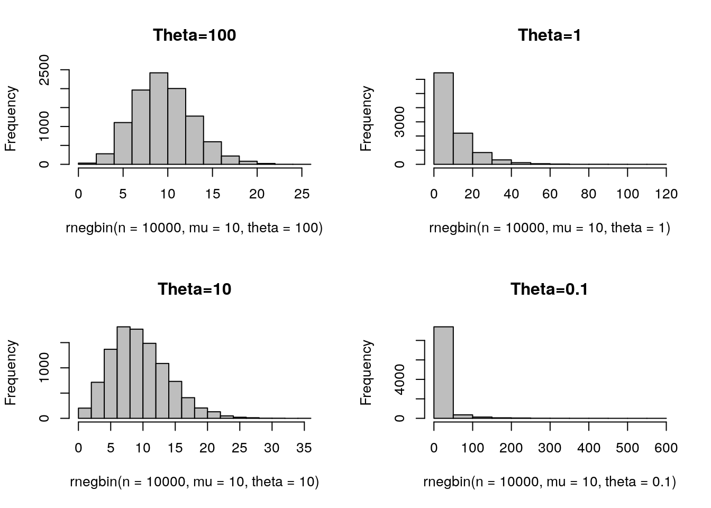

Plotting the model produces a very similar result to that shown by the quasipoisson model.


```r
glm3<-g0+geom_point()+geom_smooth(method="glm.nb", se=TRUE) +ggtitle("Negative binomial regression")
glm3
```

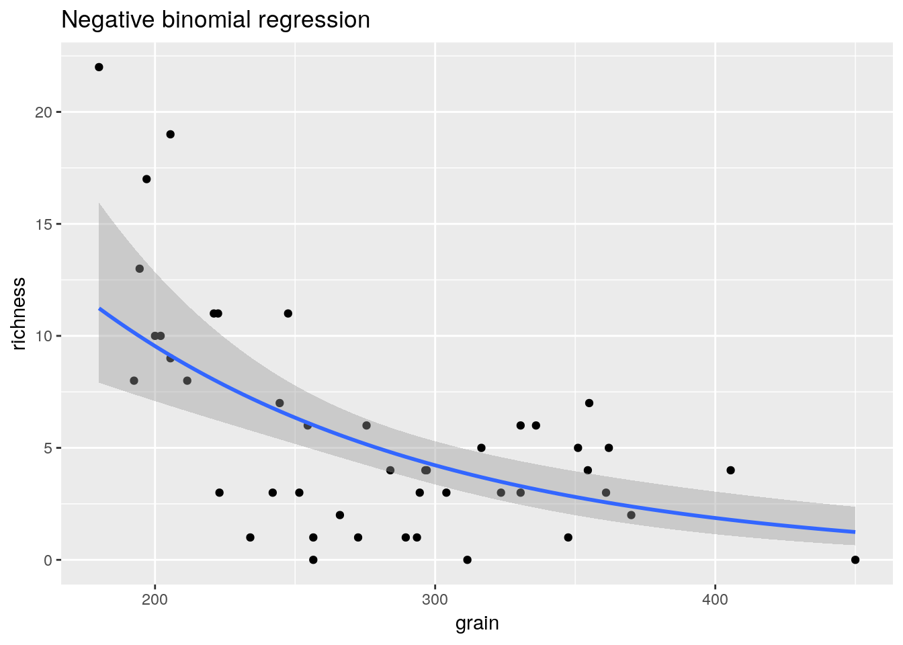


## Comparing the results


```r
library(ggplot2)
g0<-ggplot(d,aes(x=grain,y=richness))
glm1<-g0+geom_point()+stat_smooth(method="glm",method.args=list( family="poisson"), se=TRUE) 
glm3<-glm1+geom_point()+geom_smooth(method="glm.nb", se=TRUE,color="red") 
glm3
```

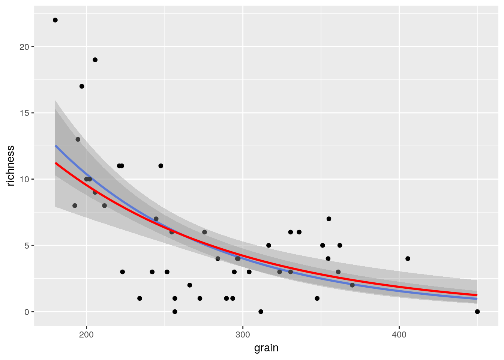


```r
library(pscl)
```

```
## Classes and Methods for R developed in the
## Political Science Computational Laboratory
## Department of Political Science
## Stanford University
## Simon Jackman
## hurdle and zeroinfl functions by Achim Zeileis
```

```r
modh<-hurdle(d$richness~grain,dist="negbin")
summary(modh)
```

```
## 
## Call:
## hurdle(formula = d$richness ~ grain, dist = "negbin")
## 
## Pearson residuals:
##     Min      1Q  Median      3Q     Max 
## -1.5804 -0.8495 -0.1085  0.6236  2.0657 
## 
## Count model coefficients (truncated negbin with log link):
##              Estimate Std. Error z value Pr(>|z|)    
## (Intercept)  3.915924   0.458802   8.535  < 2e-16 ***
## grain       -0.008220   0.001724  -4.767 1.87e-06 ***
## Log(theta)   1.510256   0.510987   2.956  0.00312 ** 
## Zero hurdle model coefficients (binomial with logit link):
##             Estimate Std. Error z value Pr(>|z|)  
## (Intercept)  7.34139    3.39460   2.163   0.0306 *
## grain       -0.01531    0.01005  -1.524   0.1275  
## ---
## Signif. codes:  0 '***' 0.001 '**' 0.01 '*' 0.05 '.' 0.1 ' ' 1 
## 
## Theta: count = 4.5279
## Number of iterations in BFGS optimization: 13 
## Log-likelihood: -114.5 on 5 Df
```

```r
AIC(modh)
```

```
## [1] 238.9305
```

```r
AIC(mod3)
```

```
## [1] 235.3695
```

```r
confint(modh)
```

```
##                         2.5 %       97.5 %
## count_(Intercept)  3.01668827  4.815159689
## count_grain       -0.01159973 -0.004840422
## zero_(Intercept)   0.68811013 13.994679574
## zero_grain        -0.03500187  0.004381010
```


```r
modzi <- zeroinfl(data=d,richness~grain,dist="negbin")
summary(modzi)
```

```
## 
## Call:
## zeroinfl(formula = richness ~ grain, data = d, dist = "negbin")
## 
## Pearson residuals:
##     Min      1Q  Median      3Q     Max 
## -1.5740 -0.8408 -0.1085  0.6161  2.0427 
## 
## Count model coefficients (negbin with log link):
##              Estimate Std. Error z value Pr(>|z|)    
## (Intercept)  3.896314   0.446411   8.728  < 2e-16 ***
## grain       -0.008132   0.001659  -4.902 9.49e-07 ***
## Log(theta)   1.514259   0.514694   2.942  0.00326 ** 
## 
## Zero-inflation model coefficients (binomial with logit link):
##             Estimate Std. Error z value Pr(>|z|)
## (Intercept) -5.37854   11.19100  -0.481    0.631
## grain        0.00447    0.03878   0.115    0.908
## ---
## Signif. codes:  0 '***' 0.001 '**' 0.01 '*' 0.05 '.' 0.1 ' ' 1 
## 
## Theta = 4.5461 
## Number of iterations in BFGS optimization: 35 
## Log-likelihood: -114.6 on 5 Df
```

```r
AIC(modh)
```

```
## [1] 238.9305
```

```r
AIC(modzi)
```

```
## [1] 239.1852
```

```r
AIC(mod3)
```

```
## [1] 235.3695
```


## Models with binomial errors 

The most commonly used GL is probably logistic regression. In this particular model the response can only take values of zero or one. Thus it is clear from the outset that errors cannot be normal. Let's set up a simple simulated data set to show how this works. Imagine we are interested in mortality of pine trees following a ground fire. We might assume that the population of tree diameters are log normally distributed with a mean of twenty.


```r
set.seed(1)
diam<-sort(rlnorm(500,mean=log(20),sd=0.5))
summary(diam)
```

```
##    Min. 1st Qu.  Median    Mean 3rd Qu.    Max. 
##   4.445  14.660  19.636  23.018  28.079 134.407
```

```r
hist(diam,col="grey",breaks=10)
```

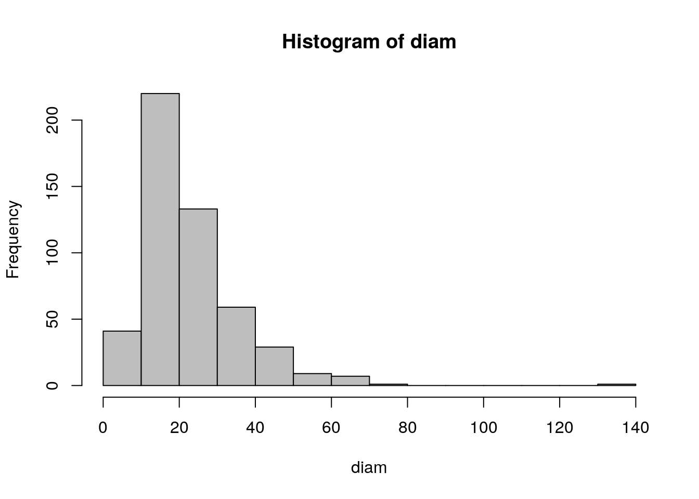


Let's simulate some response data based on an extremely simple underlying pattern for tree mortality. We might assume that trees with diameters of over 40 cm have bark that has reached a thickness that prevents the tree being killed by the fire. We might also assume a simple linear relationship between diameter and mortality up to this threshold and build a simple rule based vector of the probability that a tree survives the fire as a function of its diameter.


```r
p<-diam/50 
p[p>1]<-1 
plot(diam,p,ylab="Survival probability",xlab="Diameter",type="l",lwd=3)
```

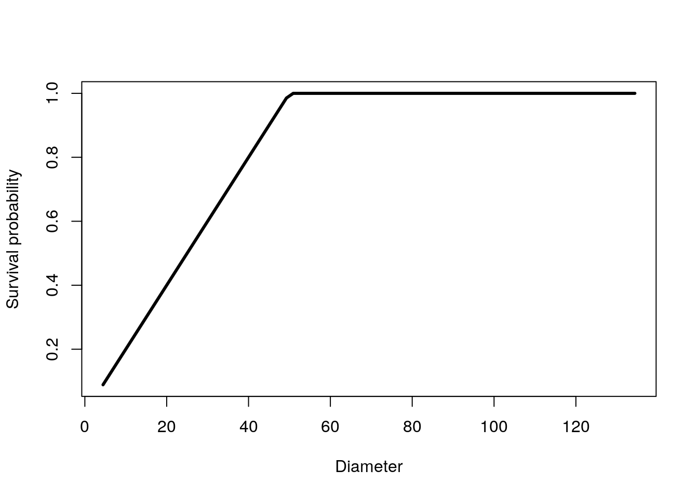

Although we have a very simple underlying deterministic model, we
will not see this directly when we collect data. Any individual tree will be either alive or dead. Thus our response will be zeros and ones. This is the problem that logistic regression deals with very neatly without the need to calculate proportions explicitly.


```r
f<-function(x)rbinom(1,1,x)
response<-as.vector(sapply(p,f))
head(response)
```

```
## [1] 0 0 0 1 0 0
```

```r
d<-data.frame(diam,response)
plot(diam,response)
lines(diam,p,lwd=3)
```

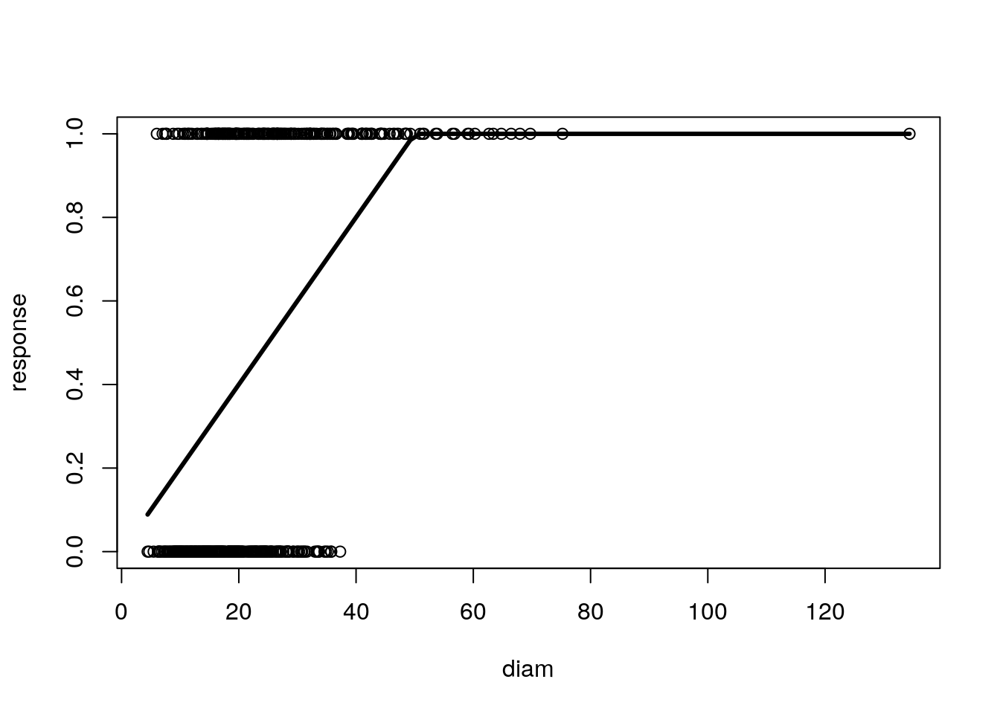

The task for the statistical model is to take this input and turn it back into a response model. Generalised linear models do this using a link function. In R it is very easy to specify the model. We simply write a model using the same syntax as for a linear model (one with gaussian errors) but we state the family of models we wish to use as binomial.


```r
mod1<-glm(response~diam,family="binomial")
summary(mod1)
```

```
## 
## Call:
## glm(formula = response ~ diam, family = "binomial")
## 
## Deviance Residuals: 
##     Min       1Q   Median       3Q      Max  
## -1.8202  -0.8891  -0.6053   1.0175   2.0428  
## 
## Coefficients:
##             Estimate Std. Error z value Pr(>|z|)    
## (Intercept) -2.60771    0.28033  -9.302   <2e-16 ***
## diam         0.10869    0.01217   8.929   <2e-16 ***
## ---
## Signif. codes:  0 '***' 0.001 '**' 0.01 '*' 0.05 '.' 0.1 ' ' 1
## 
## (Dispersion parameter for binomial family taken to be 1)
## 
##     Null deviance: 688.91  on 499  degrees of freedom
## Residual deviance: 565.51  on 498  degrees of freedom
## AIC: 569.51
## 
## Number of Fisher Scoring iterations: 5
```

We can see that R does find a model that matches the underlying pattern very well by using the model for prediction. Again we visualise the model in order to understand it. This is always preferable to trying to understand a model from a table of numbers. Visualisation is particularly important for models with parameters expressed on a logit scale as this is not intuitive.


```r
g0 <- ggplot(d,aes(x=diam,y=response))
g1<-g0+geom_point()+stat_smooth(method="glm",method.args=list(family="binomial")) 
g1
```

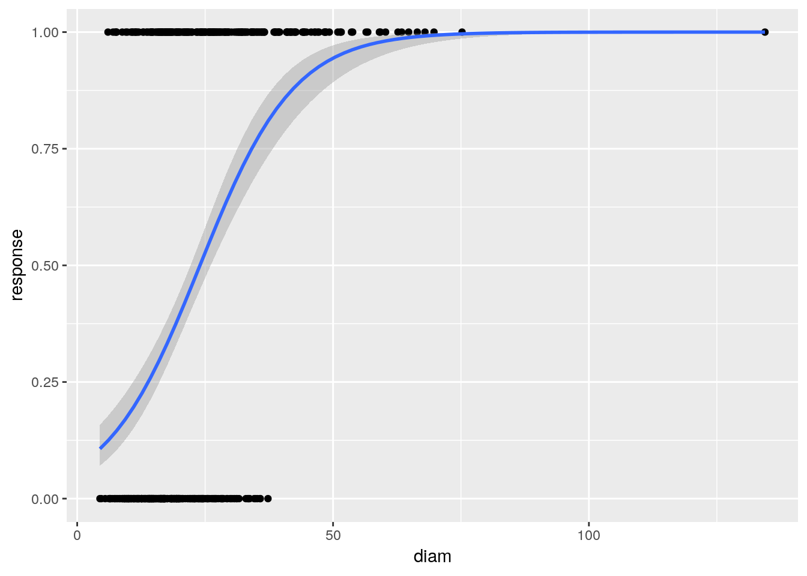

If we wanted to check whether there was a response shape that differed from that assumed by the general linear model we could try a general additive model with a smoother. 


```r
library(mgcv)
```

```
## Loading required package: nlme
```

```
## This is mgcv 1.8-24. For overview type 'help("mgcv-package")'.
```

```r
g1<-g0+geom_point()+stat_smooth(method="gam",method.args=list(family="binomial"),formula=y~s(x)) 
g1
```

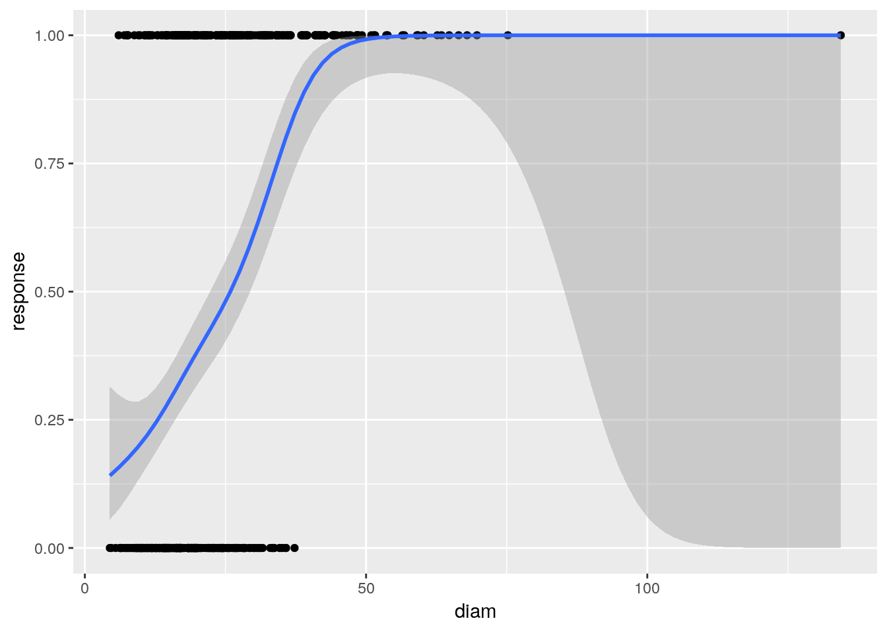

The curve is very similar. Note that as the smoother uses a form of "local" regression the confidence intervals expand in areas where there is little data.


In some cases the response would take a different form. This could happen if there were some optimum point at which some response occurred, for example the occurence of a species along an altitudinal gradient or shoreline. In this case the gam model would fit the data better than the linear model. We will look at how this can be tested formally later. A quick test is to calculate the AIC. If this is much lower for the gam it indicates that the gam may be a better fit.


```r
glm_mod<-glm(data=d, response~diam, family=binomial)
gam_mod<-gam(data=d, response~s(diam), family=binomial)

AIC(glm_mod)
```

```
## [1] 569.5078
```

```r
AIC(gam_mod)
```

```
## [1] 566.4594
```

In this case it is very slightly lower, but not enough to suggest the use of a gam.

## The logit link function

The logit link function used in binomial glms makes the slope of the line quite difficult to understand. In most cases this doesn't matter much, as you can concentrate on the sign and signficance of the parameter and show the line as a figure. However when analysing differences in response as a function of levels of a factor you do need to understand the logit link.

To illustrate let's take a very simple example. Ten leaves are classified as being taken from shade or sun and classified for presence of rust.


```r
library(purrr)
set.seed(1)
light<-rep(c("shade","sun"),each=10)
presence<-1*c(rbernoulli(10,p=0.5),rbernoulli(10,p=0.1))
d<-data.frame(light,presence)
```

We can get a table of the results easily.


```r
table(d)
```

```
##        presence
## light   0 1
##   shade 4 6
##   sun   9 1
```

So 6 of the leaves in the shade had rust present and 4 did not. The odds of rust are therefore 6 to 4.
Odds are used in the logit transform rather than simple proportions because odds can take values between 0 and infinity, while proportions are bounded to lie between zero and one.  Taking the logarithm of the odds leads to an additive model.

There are two factor levels, shade and sun. The default reference when a model is fitted will be the factor that is first in alphabetical order, i.e. shade. So after fitting a model the intercept will be the log of the odds in the shade. The effect of light will be the log odds in the sun minus the log odds in the shade.


```r
odds_shade<-6/4
odds_sun<-1/9
log(odds_shade)
```

```
## [1] 0.4054651
```

```r
log(odds_sun)-log(odds_shade)
```

```
## [1] -2.60269
```

We can see that this coincides with the model output.


```r
mod<-glm(data=d,presence~light,family="binomial")
summary(mod)
```

```
## 
## Call:
## glm(formula = presence ~ light, family = "binomial", data = d)
## 
## Deviance Residuals: 
##    Min      1Q  Median      3Q     Max  
## -1.354  -0.459  -0.459   1.011   2.146  
## 
## Coefficients:
##             Estimate Std. Error z value Pr(>|z|)  
## (Intercept)   0.4055     0.6455   0.628   0.5299  
## lightsun     -2.6027     1.2360  -2.106   0.0352 *
## ---
## Signif. codes:  0 '***' 0.001 '**' 0.01 '*' 0.05 '.' 0.1 ' ' 1
## 
## (Dispersion parameter for binomial family taken to be 1)
## 
##     Null deviance: 25.898  on 19  degrees of freedom
## Residual deviance: 19.962  on 18  degrees of freedom
## AIC: 23.962
## 
## Number of Fisher Scoring iterations: 4
```

If the coeficients are exponentiated then the first coeficient represents the baseline odds and the second coeficient represesnts this value divided by the odds for the "treatment". As binomial models are often used in epidemiology this explains why we could hear statements such as "eating processed meat increases the odds of contracting bowel cancer by a factor of 2". This is a literal interpretation of the exponentiated coeficient.


```r
exp(coef(mod))
```

```
## (Intercept)    lightsun 
##  1.50000000  0.07407408
```

```r
odds_shade
```

```
## [1] 1.5
```

```r
odds_sun/odds_shade
```

```
## [1] 0.07407407
```

To convert the odds into proportions divide the odds by 1 plus the odds.


```r
odds_shade/(1+odds_shade)
```

```
## [1] 0.6
```

```r
odds_sun/(1+odds_sun)
```

```
## [1] 0.1
```

So this gives the proportions as estimated by the model.


```r
exp(coef(mod)[1])/(1+exp(coef(mod)[1]))
```

```
## (Intercept) 
##         0.6
```

```r
exp(coef(mod)[1] + coef(mod)[2])/(1+exp(coef(mod)[1] + coef(mod)[2]))
```

```
## (Intercept) 
##         0.1
```


## Exercises

1. GLMS can also be used when the explanatory variable is a factor. Here is a very simple data set that consists of counts of ragworm in two types of substrate, classified simply into mud and sand. Analyse the data using both a **general** linear model and a **generalised** linear model. Comment on the differences between the two aproaches.


```r
d<-read.csv("/home/aqm/course/data/HedisteCounts.csv")
```

2. Binomial (prensence/absence) model

In some cases the actual numbers of organisms counted can be a poor choice of response variable. If organisms are highly aggregated then presence vs absence is a better choice. Reanalyse the ragworm data, this time using presence as the response.


```r
d$pres<-1*(d$Count>0) ## This sets up a variable consisting of ones and zeros
```

3. Leafminers and leaf exposure to light

The number of leaf miners were counted on 200 leaves exposed to different levels of ambient light, measured as a percentage of full exposure.

Analyse these data using an appropriate GLM.


```r
d<-read.csv("/home/aqm/course/data/leafminers.csv")
```


```r
plot(d)
```

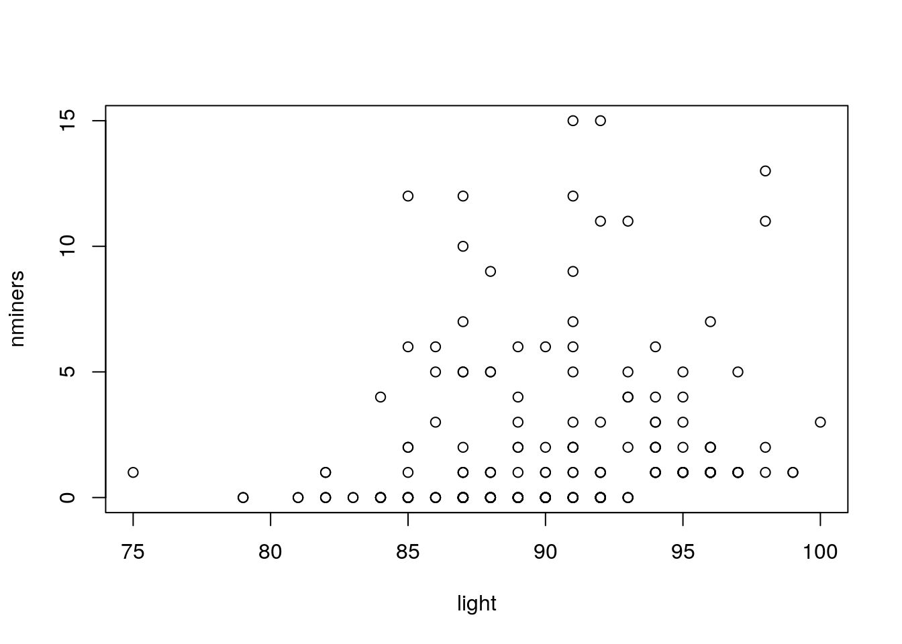


```r
library(plotly)
```

```
## 
## Attaching package: 'plotly'
```

```
## The following object is masked from 'package:MASS':
## 
##     select
```

```
## The following object is masked from 'package:ggplot2':
## 
##     last_plot
```

```
## The following object is masked from 'package:stats':
## 
##     filter
```

```
## The following object is masked from 'package:graphics':
## 
##     layout
```

```r
g0<-ggplot(d,aes(x=light,y=nminers))
glm1<-g0+geom_point()+stat_smooth(method="glm",method.args=list( family="poisson"), se=TRUE) +ggtitle("Poisson regression with log link function")
ggplotly(glm1)
```

<!--html_preserve--><div id="505a43846758" style="width:672px;height:480px;" class="plotly html-widget"></div>
<script type="application/json" data-for="505a43846758">{"x":{"data":[{"x":[86,87,90,79,91,87,87,86,87,91,94,91,95,90,93,92,89,84,86,87,89,86,91,98,88,89,90,95,84,85,94,89,95,87,82,86,97,89,89,92,90,87,89,97,89,91,91,91,91,87,91,95,88,95,90,87,87,82,89,93,98,90,79,91,90,88,85,84,90,94,96,85,92,88,90,88,91,87,97,85,88,87,84,85,85,95,99,88,90,87,84,96,91,91,96,90,88,88,95,85,96,85,91,88,87,96,86,96,95,90,88,87,87,75,95,93,93,94,84,98,93,92,92,87,82,83,96,91,81,94,94,85,94,91,92,85,97,94,89,87,92,100,87,89,97,89,89,96,91,88,96,82,81,94,90,83,95,87,99,90,82,94,92,88,92,88,94,93,84,93,92,88,96,87,95,91,92,92,87,89,92,96,89,98,92,89,96,86,97,85,88,92,88,92,96,96,87,85,93,87],"y":[6,1,6,0,0,0,5,0,0,0,1,12,2,1,0,11,0,0,0,0,2,3,1,11,1,0,0,1,0,2,2,6,1,7,0,0,1,1,0,0,0,2,0,5,0,2,3,1,2,0,0,1,0,4,0,0,0,0,0,0,2,0,0,0,1,1,2,4,0,6,1,0,1,0,2,9,0,0,1,0,0,1,0,12,0,1,1,0,0,0,0,1,5,15,1,0,5,0,5,0,7,1,6,0,0,1,5,1,1,0,0,12,1,1,1,11,0,1,0,1,2,3,1,10,1,0,1,0,0,3,2,6,1,7,0,0,1,2,0,0,0,3,0,4,1,2,3,2,2,0,1,0,0,4,0,0,1,0,1,0,1,1,0,0,1,1,3,4,0,5,0,0,2,0,3,9,0,0,0,0,0,2,0,13,0,0,1,0,1,0,0,0,5,15,1,1,5,0,4,0],"text":["~light:  86<br />~nminers:  6","~light:  87<br />~nminers:  1","~light:  90<br />~nminers:  6","~light:  79<br />~nminers:  0","~light:  91<br />~nminers:  0","~light:  87<br />~nminers:  0","~light:  87<br />~nminers:  5","~light:  86<br />~nminers:  0","~light:  87<br />~nminers:  0","~light:  91<br />~nminers:  0","~light:  94<br />~nminers:  1","~light:  91<br />~nminers: 12","~light:  95<br />~nminers:  2","~light:  90<br />~nminers:  1","~light:  93<br />~nminers:  0","~light:  92<br />~nminers: 11","~light:  89<br />~nminers:  0","~light:  84<br />~nminers:  0","~light:  86<br />~nminers:  0","~light:  87<br />~nminers:  0","~light:  89<br />~nminers:  2","~light:  86<br />~nminers:  3","~light:  91<br />~nminers:  1","~light:  98<br />~nminers: 11","~light:  88<br />~nminers:  1","~light:  89<br />~nminers:  0","~light:  90<br />~nminers:  0","~light:  95<br />~nminers:  1","~light:  84<br />~nminers:  0","~light:  85<br />~nminers:  2","~light:  94<br />~nminers:  2","~light:  89<br />~nminers:  6","~light:  95<br />~nminers:  1","~light:  87<br />~nminers:  7","~light:  82<br />~nminers:  0","~light:  86<br />~nminers:  0","~light:  97<br />~nminers:  1","~light:  89<br />~nminers:  1","~light:  89<br />~nminers:  0","~light:  92<br />~nminers:  0","~light:  90<br />~nminers:  0","~light:  87<br />~nminers:  2","~light:  89<br />~nminers:  0","~light:  97<br />~nminers:  5","~light:  89<br />~nminers:  0","~light:  91<br />~nminers:  2","~light:  91<br />~nminers:  3","~light:  91<br />~nminers:  1","~light:  91<br />~nminers:  2","~light:  87<br />~nminers:  0","~light:  91<br />~nminers:  0","~light:  95<br />~nminers:  1","~light:  88<br />~nminers:  0","~light:  95<br />~nminers:  4","~light:  90<br />~nminers:  0","~light:  87<br />~nminers:  0","~light:  87<br />~nminers:  0","~light:  82<br />~nminers:  0","~light:  89<br />~nminers:  0","~light:  93<br />~nminers:  0","~light:  98<br />~nminers:  2","~light:  90<br />~nminers:  0","~light:  79<br />~nminers:  0","~light:  91<br />~nminers:  0","~light:  90<br />~nminers:  1","~light:  88<br />~nminers:  1","~light:  85<br />~nminers:  2","~light:  84<br />~nminers:  4","~light:  90<br />~nminers:  0","~light:  94<br />~nminers:  6","~light:  96<br />~nminers:  1","~light:  85<br />~nminers:  0","~light:  92<br />~nminers:  1","~light:  88<br />~nminers:  0","~light:  90<br />~nminers:  2","~light:  88<br />~nminers:  9","~light:  91<br />~nminers:  0","~light:  87<br />~nminers:  0","~light:  97<br />~nminers:  1","~light:  85<br />~nminers:  0","~light:  88<br />~nminers:  0","~light:  87<br />~nminers:  1","~light:  84<br />~nminers:  0","~light:  85<br />~nminers: 12","~light:  85<br />~nminers:  0","~light:  95<br />~nminers:  1","~light:  99<br />~nminers:  1","~light:  88<br />~nminers:  0","~light:  90<br />~nminers:  0","~light:  87<br />~nminers:  0","~light:  84<br />~nminers:  0","~light:  96<br />~nminers:  1","~light:  91<br />~nminers:  5","~light:  91<br />~nminers: 15","~light:  96<br />~nminers:  1","~light:  90<br />~nminers:  0","~light:  88<br />~nminers:  5","~light:  88<br />~nminers:  0","~light:  95<br />~nminers:  5","~light:  85<br />~nminers:  0","~light:  96<br />~nminers:  7","~light:  85<br />~nminers:  1","~light:  91<br />~nminers:  6","~light:  88<br />~nminers:  0","~light:  87<br />~nminers:  0","~light:  96<br />~nminers:  1","~light:  86<br />~nminers:  5","~light:  96<br />~nminers:  1","~light:  95<br />~nminers:  1","~light:  90<br />~nminers:  0","~light:  88<br />~nminers:  0","~light:  87<br />~nminers: 12","~light:  87<br />~nminers:  1","~light:  75<br />~nminers:  1","~light:  95<br />~nminers:  1","~light:  93<br />~nminers: 11","~light:  93<br />~nminers:  0","~light:  94<br />~nminers:  1","~light:  84<br />~nminers:  0","~light:  98<br />~nminers:  1","~light:  93<br />~nminers:  2","~light:  92<br />~nminers:  3","~light:  92<br />~nminers:  1","~light:  87<br />~nminers: 10","~light:  82<br />~nminers:  1","~light:  83<br />~nminers:  0","~light:  96<br />~nminers:  1","~light:  91<br />~nminers:  0","~light:  81<br />~nminers:  0","~light:  94<br />~nminers:  3","~light:  94<br />~nminers:  2","~light:  85<br />~nminers:  6","~light:  94<br />~nminers:  1","~light:  91<br />~nminers:  7","~light:  92<br />~nminers:  0","~light:  85<br />~nminers:  0","~light:  97<br />~nminers:  1","~light:  94<br />~nminers:  2","~light:  89<br />~nminers:  0","~light:  87<br />~nminers:  0","~light:  92<br />~nminers:  0","~light: 100<br />~nminers:  3","~light:  87<br />~nminers:  0","~light:  89<br />~nminers:  4","~light:  97<br />~nminers:  1","~light:  89<br />~nminers:  2","~light:  89<br />~nminers:  3","~light:  96<br />~nminers:  2","~light:  91<br />~nminers:  2","~light:  88<br />~nminers:  0","~light:  96<br />~nminers:  1","~light:  82<br />~nminers:  0","~light:  81<br />~nminers:  0","~light:  94<br />~nminers:  4","~light:  90<br />~nminers:  0","~light:  83<br />~nminers:  0","~light:  95<br />~nminers:  1","~light:  87<br />~nminers:  0","~light:  99<br />~nminers:  1","~light:  90<br />~nminers:  0","~light:  82<br />~nminers:  1","~light:  94<br />~nminers:  1","~light:  92<br />~nminers:  0","~light:  88<br />~nminers:  0","~light:  92<br />~nminers:  1","~light:  88<br />~nminers:  1","~light:  94<br />~nminers:  3","~light:  93<br />~nminers:  4","~light:  84<br />~nminers:  0","~light:  93<br />~nminers:  5","~light:  92<br />~nminers:  0","~light:  88<br />~nminers:  0","~light:  96<br />~nminers:  2","~light:  87<br />~nminers:  0","~light:  95<br />~nminers:  3","~light:  91<br />~nminers:  9","~light:  92<br />~nminers:  0","~light:  92<br />~nminers:  0","~light:  87<br />~nminers:  0","~light:  89<br />~nminers:  0","~light:  92<br />~nminers:  0","~light:  96<br />~nminers:  2","~light:  89<br />~nminers:  0","~light:  98<br />~nminers: 13","~light:  92<br />~nminers:  0","~light:  89<br />~nminers:  0","~light:  96<br />~nminers:  1","~light:  86<br />~nminers:  0","~light:  97<br />~nminers:  1","~light:  85<br />~nminers:  0","~light:  88<br />~nminers:  0","~light:  92<br />~nminers:  0","~light:  88<br />~nminers:  5","~light:  92<br />~nminers: 15","~light:  96<br />~nminers:  1","~light:  96<br />~nminers:  1","~light:  87<br />~nminers:  5","~light:  85<br />~nminers:  0","~light:  93<br />~nminers:  4","~light:  87<br />~nminers:  0"],"type":"scatter","mode":"markers","marker":{"autocolorscale":false,"color":"rgba(0,0,0,1)","opacity":1,"size":5.66929133858268,"symbol":"circle","line":{"width":1.88976377952756,"color":"rgba(0,0,0,1)"}},"hoveron":"points","showlegend":false,"xaxis":"x","yaxis":"y","hoverinfo":"text","frame":null},{"x":[75,75.3164556962025,75.6329113924051,75.9493670886076,76.2658227848101,76.5822784810127,76.8987341772152,77.2151898734177,77.5316455696203,77.8481012658228,78.1645569620253,78.4810126582279,78.7974683544304,79.1139240506329,79.4303797468354,79.746835443038,80.0632911392405,80.379746835443,80.6962025316456,81.0126582278481,81.3291139240506,81.6455696202532,81.9620253164557,82.2784810126582,82.5949367088608,82.9113924050633,83.2278481012658,83.5443037974684,83.8607594936709,84.1772151898734,84.4936708860759,84.8101265822785,85.126582278481,85.4430379746835,85.7594936708861,86.0759493670886,86.3924050632911,86.7088607594937,87.0253164556962,87.3417721518987,87.6582278481013,87.9746835443038,88.2911392405063,88.6075949367089,88.9240506329114,89.2405063291139,89.5569620253165,89.873417721519,90.1898734177215,90.5063291139241,90.8227848101266,91.1392405063291,91.4556962025316,91.7721518987342,92.0886075949367,92.4050632911392,92.7215189873418,93.0379746835443,93.3544303797468,93.6708860759494,93.9873417721519,94.3037974683544,94.620253164557,94.9367088607595,95.253164556962,95.5696202531646,95.8860759493671,96.2025316455696,96.5189873417721,96.8354430379747,97.1518987341772,97.4683544303797,97.7848101265823,98.1012658227848,98.4177215189873,98.7341772151899,99.0506329113924,99.3670886075949,99.6835443037975,100],"y":[0.663802487182636,0.677833796192177,0.69216169588392,0.706792455525595,0.721732476903314,0.736988297122718,0.752566591469329,0.768474176329369,0.784718012172307,0.801305206596472,0.818243017439014,0.835538855951634,0.853200290043413,0.871235047592213,0.889651019826051,0.908456264775966,0.927659010801859,0.947267660192871,0.967290792843854,0.98773717000957,1.00861573813822,1.02993563278606,1.05170618261466,1.07393691347278,1.09663755256446,1.11981803270518,1.14348849666808,1.16765930162198,1.19234102366321,1.21754446244329,1.24328064589434,1.26956083505448,1.2963965289951,1.32379946985245,1.3517816479654,1.38035530712196,1.40953294991656,1.43932734322074,1.46975152376927,1.50081880386456,1.53254277720146,1.56493732481535,1.59801662115581,1.63179514028879,1.66628766222982,1.70150927941111,1.73747540328531,1.77420177106897,1.81170445262836,1.84999985751104,1.88910474212591,1.92903621707512,1.96981175464091,2.01144919643071,2.05396676118389,2.09738305274347,2.14171706819635,2.18698820618563,2.23321627539859,2.28042150323413,2.3286245446534,2.37784649121751,2.42810888031632,2.47943370459217,2.53184342156305,2.58536096344889,2.64000974720582,2.69581368477234,2.75279719353221,2.81098520699835,2.87040318572279,2.93107712843696,2.99303358342774,3.05629966015374,3.12090304110729,3.18687199392704,3.25423538376674,3.32302268592526,3.39326399874382,3.46499005677563],"text":["~light:  75.00000<br />~nminers: 0.6638025","~light:  75.31646<br />~nminers: 0.6778338","~light:  75.63291<br />~nminers: 0.6921617","~light:  75.94937<br />~nminers: 0.7067925","~light:  76.26582<br />~nminers: 0.7217325","~light:  76.58228<br />~nminers: 0.7369883","~light:  76.89873<br />~nminers: 0.7525666","~light:  77.21519<br />~nminers: 0.7684742","~light:  77.53165<br />~nminers: 0.7847180","~light:  77.84810<br />~nminers: 0.8013052","~light:  78.16456<br />~nminers: 0.8182430","~light:  78.48101<br />~nminers: 0.8355389","~light:  78.79747<br />~nminers: 0.8532003","~light:  79.11392<br />~nminers: 0.8712350","~light:  79.43038<br />~nminers: 0.8896510","~light:  79.74684<br />~nminers: 0.9084563","~light:  80.06329<br />~nminers: 0.9276590","~light:  80.37975<br />~nminers: 0.9472677","~light:  80.69620<br />~nminers: 0.9672908","~light:  81.01266<br />~nminers: 0.9877372","~light:  81.32911<br />~nminers: 1.0086157","~light:  81.64557<br />~nminers: 1.0299356","~light:  81.96203<br />~nminers: 1.0517062","~light:  82.27848<br />~nminers: 1.0739369","~light:  82.59494<br />~nminers: 1.0966376","~light:  82.91139<br />~nminers: 1.1198180","~light:  83.22785<br />~nminers: 1.1434885","~light:  83.54430<br />~nminers: 1.1676593","~light:  83.86076<br />~nminers: 1.1923410","~light:  84.17722<br />~nminers: 1.2175445","~light:  84.49367<br />~nminers: 1.2432806","~light:  84.81013<br />~nminers: 1.2695608","~light:  85.12658<br />~nminers: 1.2963965","~light:  85.44304<br />~nminers: 1.3237995","~light:  85.75949<br />~nminers: 1.3517816","~light:  86.07595<br />~nminers: 1.3803553","~light:  86.39241<br />~nminers: 1.4095329","~light:  86.70886<br />~nminers: 1.4393273","~light:  87.02532<br />~nminers: 1.4697515","~light:  87.34177<br />~nminers: 1.5008188","~light:  87.65823<br />~nminers: 1.5325428","~light:  87.97468<br />~nminers: 1.5649373","~light:  88.29114<br />~nminers: 1.5980166","~light:  88.60759<br />~nminers: 1.6317951","~light:  88.92405<br />~nminers: 1.6662877","~light:  89.24051<br />~nminers: 1.7015093","~light:  89.55696<br />~nminers: 1.7374754","~light:  89.87342<br />~nminers: 1.7742018","~light:  90.18987<br />~nminers: 1.8117045","~light:  90.50633<br />~nminers: 1.8499999","~light:  90.82278<br />~nminers: 1.8891047","~light:  91.13924<br />~nminers: 1.9290362","~light:  91.45570<br />~nminers: 1.9698118","~light:  91.77215<br />~nminers: 2.0114492","~light:  92.08861<br />~nminers: 2.0539668","~light:  92.40506<br />~nminers: 2.0973831","~light:  92.72152<br />~nminers: 2.1417171","~light:  93.03797<br />~nminers: 2.1869882","~light:  93.35443<br />~nminers: 2.2332163","~light:  93.67089<br />~nminers: 2.2804215","~light:  93.98734<br />~nminers: 2.3286245","~light:  94.30380<br />~nminers: 2.3778465","~light:  94.62025<br />~nminers: 2.4281089","~light:  94.93671<br />~nminers: 2.4794337","~light:  95.25316<br />~nminers: 2.5318434","~light:  95.56962<br />~nminers: 2.5853610","~light:  95.88608<br />~nminers: 2.6400097","~light:  96.20253<br />~nminers: 2.6958137","~light:  96.51899<br />~nminers: 2.7527972","~light:  96.83544<br />~nminers: 2.8109852","~light:  97.15190<br />~nminers: 2.8704032","~light:  97.46835<br />~nminers: 2.9310771","~light:  97.78481<br />~nminers: 2.9930336","~light:  98.10127<br />~nminers: 3.0562997","~light:  98.41772<br />~nminers: 3.1209030","~light:  98.73418<br />~nminers: 3.1868720","~light:  99.05063<br />~nminers: 3.2542354","~light:  99.36709<br />~nminers: 3.3230227","~light:  99.68354<br />~nminers: 3.3932640","~light: 100.00000<br />~nminers: 3.4649901"],"type":"scatter","mode":"lines","name":"fitted values","line":{"width":3.77952755905512,"color":"rgba(51,102,255,1)","dash":"solid"},"hoveron":"points","showlegend":false,"xaxis":"x","yaxis":"y","hoverinfo":"text","frame":null},{"x":[75,75.3164556962025,75.6329113924051,75.9493670886076,76.2658227848101,76.5822784810127,76.8987341772152,77.2151898734177,77.5316455696203,77.8481012658228,78.1645569620253,78.4810126582279,78.7974683544304,79.1139240506329,79.4303797468354,79.746835443038,80.0632911392405,80.379746835443,80.6962025316456,81.0126582278481,81.3291139240506,81.6455696202532,81.9620253164557,82.2784810126582,82.5949367088608,82.9113924050633,83.2278481012658,83.5443037974684,83.8607594936709,84.1772151898734,84.4936708860759,84.8101265822785,85.126582278481,85.4430379746835,85.7594936708861,86.0759493670886,86.3924050632911,86.7088607594937,87.0253164556962,87.3417721518987,87.6582278481013,87.9746835443038,88.2911392405063,88.6075949367089,88.9240506329114,89.2405063291139,89.5569620253165,89.873417721519,90.1898734177215,90.5063291139241,90.8227848101266,91.1392405063291,91.4556962025316,91.7721518987342,92.0886075949367,92.4050632911392,92.7215189873418,93.0379746835443,93.3544303797468,93.6708860759494,93.9873417721519,94.3037974683544,94.620253164557,94.9367088607595,95.253164556962,95.5696202531646,95.8860759493671,96.2025316455696,96.5189873417721,96.8354430379747,97.1518987341772,97.4683544303797,97.7848101265823,98.1012658227848,98.4177215189873,98.7341772151899,99.0506329113924,99.3670886075949,99.6835443037975,100,100,100,99.6835443037975,99.3670886075949,99.0506329113924,98.7341772151899,98.4177215189873,98.1012658227848,97.7848101265823,97.4683544303797,97.1518987341772,96.8354430379747,96.5189873417721,96.2025316455696,95.8860759493671,95.5696202531646,95.253164556962,94.9367088607595,94.620253164557,94.3037974683544,93.9873417721519,93.6708860759494,93.3544303797468,93.0379746835443,92.7215189873418,92.4050632911392,92.0886075949367,91.7721518987342,91.4556962025316,91.1392405063291,90.8227848101266,90.5063291139241,90.1898734177215,89.873417721519,89.5569620253165,89.2405063291139,88.9240506329114,88.6075949367089,88.2911392405063,87.9746835443038,87.6582278481013,87.3417721518987,87.0253164556962,86.7088607594937,86.3924050632911,86.0759493670886,85.7594936708861,85.4430379746835,85.126582278481,84.8101265822785,84.4936708860759,84.1772151898734,83.8607594936709,83.5443037974684,83.2278481012658,82.9113924050633,82.5949367088608,82.2784810126582,81.9620253164557,81.6455696202532,81.3291139240506,81.0126582278481,80.6962025316456,80.379746835443,80.0632911392405,79.746835443038,79.4303797468354,79.1139240506329,78.7974683544304,78.4810126582279,78.1645569620253,77.8481012658228,77.5316455696203,77.2151898734177,76.8987341772152,76.5822784810127,76.2658227848101,75.9493670886076,75.6329113924051,75.3164556962025,75,75],"y":[0.446590097962592,0.459327897361429,0.472424413380346,0.485889343197164,0.49973260477217,0.513964336884264,0.528594898379626,0.543634866498608,0.55909503412507,0.574986405777243,0.591320192129689,0.608107802821362,0.625360837264021,0.64309107311744,0.661310452041304,0.680031062267227,0.699265117455585,0.719024931209147,0.739322886505662,0.760171399182135,0.781582874450512,0.80356965524443,0.826143960984793,0.849317815103915,0.873102959378767,0.897510752789395,0.922552052235319,0.948237072010134,0.974575218455736,1.00157489570386,1.02924327788658,1.0575860427012,1.08660706081952,1.11630803544991,1.14668808656937,1.17774327520201,1.20946606500679,1.24184472186658,1.27486265782101,1.3084977343758,1.3427215528321,1.3774987765364,1.41278655201525,1.44853412173773,1.48468274745743,1.52116608323444,1.55791114111668,1.59483996709991,1.63187207828679,1.6689275996853,1.70593089236165,1.74281431625554,1.77952166970493,1.81601084090304,1.8522553149793,1.88824438170831,1.92398212244697,1.95948544928286,1.99478157460843,2.02990529477928,2.06489640116915,2.09979742543868,2.13465181927996,2.16950258447297,2.2043913143004,2.23935757962829,2.27443858512224,2.30966902544168,2.34508108163303,2.38070451014822,2.41656678855525,2.45269329196559,2.48910748215723,2.52583109741922,2.56288433556891,2.60028602572586,2.63805378657777,2.67620417030259,2.71475279222563,2.75371444684379,2.75371444684379,4.35998587555621,4.24135877054618,4.12617239510743,4.01434117334562,3.9057830581701,3.80041957290695,3.69817586860816,3.5989807976321,3.50276700351769,3.40947102626258,3.31903342068757,3.23139888342019,3.14651638089838,3.06433926637204,2.98482536783378,2.90793702085805,2.83364101037062,2.76190837373171,2.69271400531135,2.62603599235875,2.5618546075954,2.50015089180084,2.44090478739993,2.38409283885122,2.32968556006278,2.27764467561827,2.227920549092,2.18045018207891,2.13515616212202,2.09194683248989,2.05071776237401,2.01135436248121,1.97373528968444,1.93773617592697,1.9032332234007,1.87010630928001,1.83824139170138,1.80753215540422,1.77788094792947,1.74919912397211,1.72140694084423,1.69443314412727,1.66821436244381,1.64269440407105,1.61782352234016,1.59355769470229,1.56985794308587,1.54668971055922,1.52402230062297,1.50182837980682,1.48008354081653,1.45876592159091,1.43785587476985,1.41733568186644,1.39718930661764,1.37740218238436,1.35796102896809,1.3388536947379,1.32006902047558,1.30159672182598,1.28342728767247,1.26555189214114,1.2479623182722,1.23065089168636,1.2136104228227,1.19683415653636,1.18031572802503,1.1640491242064,1.14802864979854,1.13224889746512,1.11670472148061,1.10139121444943,1.08630368667977,1.07143764786965,1.05678879081089,1.04235297685744,1.02812622293959,1.01410468993522,1.00028467223441,0.986662588355829,0.446590097962592],"text":["~light:  75.00000<br />~nminers: 0.6638025","~light:  75.31646<br />~nminers: 0.6778338","~light:  75.63291<br />~nminers: 0.6921617","~light:  75.94937<br />~nminers: 0.7067925","~light:  76.26582<br />~nminers: 0.7217325","~light:  76.58228<br />~nminers: 0.7369883","~light:  76.89873<br />~nminers: 0.7525666","~light:  77.21519<br />~nminers: 0.7684742","~light:  77.53165<br />~nminers: 0.7847180","~light:  77.84810<br />~nminers: 0.8013052","~light:  78.16456<br />~nminers: 0.8182430","~light:  78.48101<br />~nminers: 0.8355389","~light:  78.79747<br />~nminers: 0.8532003","~light:  79.11392<br />~nminers: 0.8712350","~light:  79.43038<br />~nminers: 0.8896510","~light:  79.74684<br />~nminers: 0.9084563","~light:  80.06329<br />~nminers: 0.9276590","~light:  80.37975<br />~nminers: 0.9472677","~light:  80.69620<br />~nminers: 0.9672908","~light:  81.01266<br />~nminers: 0.9877372","~light:  81.32911<br />~nminers: 1.0086157","~light:  81.64557<br />~nminers: 1.0299356","~light:  81.96203<br />~nminers: 1.0517062","~light:  82.27848<br />~nminers: 1.0739369","~light:  82.59494<br />~nminers: 1.0966376","~light:  82.91139<br />~nminers: 1.1198180","~light:  83.22785<br />~nminers: 1.1434885","~light:  83.54430<br />~nminers: 1.1676593","~light:  83.86076<br />~nminers: 1.1923410","~light:  84.17722<br />~nminers: 1.2175445","~light:  84.49367<br />~nminers: 1.2432806","~light:  84.81013<br />~nminers: 1.2695608","~light:  85.12658<br />~nminers: 1.2963965","~light:  85.44304<br />~nminers: 1.3237995","~light:  85.75949<br />~nminers: 1.3517816","~light:  86.07595<br />~nminers: 1.3803553","~light:  86.39241<br />~nminers: 1.4095329","~light:  86.70886<br />~nminers: 1.4393273","~light:  87.02532<br />~nminers: 1.4697515","~light:  87.34177<br />~nminers: 1.5008188","~light:  87.65823<br />~nminers: 1.5325428","~light:  87.97468<br />~nminers: 1.5649373","~light:  88.29114<br />~nminers: 1.5980166","~light:  88.60759<br />~nminers: 1.6317951","~light:  88.92405<br />~nminers: 1.6662877","~light:  89.24051<br />~nminers: 1.7015093","~light:  89.55696<br />~nminers: 1.7374754","~light:  89.87342<br />~nminers: 1.7742018","~light:  90.18987<br />~nminers: 1.8117045","~light:  90.50633<br />~nminers: 1.8499999","~light:  90.82278<br />~nminers: 1.8891047","~light:  91.13924<br />~nminers: 1.9290362","~light:  91.45570<br />~nminers: 1.9698118","~light:  91.77215<br />~nminers: 2.0114492","~light:  92.08861<br />~nminers: 2.0539668","~light:  92.40506<br />~nminers: 2.0973831","~light:  92.72152<br />~nminers: 2.1417171","~light:  93.03797<br />~nminers: 2.1869882","~light:  93.35443<br />~nminers: 2.2332163","~light:  93.67089<br />~nminers: 2.2804215","~light:  93.98734<br />~nminers: 2.3286245","~light:  94.30380<br />~nminers: 2.3778465","~light:  94.62025<br />~nminers: 2.4281089","~light:  94.93671<br />~nminers: 2.4794337","~light:  95.25316<br />~nminers: 2.5318434","~light:  95.56962<br />~nminers: 2.5853610","~light:  95.88608<br />~nminers: 2.6400097","~light:  96.20253<br />~nminers: 2.6958137","~light:  96.51899<br />~nminers: 2.7527972","~light:  96.83544<br />~nminers: 2.8109852","~light:  97.15190<br />~nminers: 2.8704032","~light:  97.46835<br />~nminers: 2.9310771","~light:  97.78481<br />~nminers: 2.9930336","~light:  98.10127<br />~nminers: 3.0562997","~light:  98.41772<br />~nminers: 3.1209030","~light:  98.73418<br />~nminers: 3.1868720","~light:  99.05063<br />~nminers: 3.2542354","~light:  99.36709<br />~nminers: 3.3230227","~light:  99.68354<br />~nminers: 3.3932640","~light: 100.00000<br />~nminers: 3.4649901","~light: 100.00000<br />~nminers: 3.4649901","~light: 100.00000<br />~nminers: 3.4649901","~light:  99.68354<br />~nminers: 3.3932640","~light:  99.36709<br />~nminers: 3.3230227","~light:  99.05063<br />~nminers: 3.2542354","~light:  98.73418<br />~nminers: 3.1868720","~light:  98.41772<br />~nminers: 3.1209030","~light:  98.10127<br />~nminers: 3.0562997","~light:  97.78481<br />~nminers: 2.9930336","~light:  97.46835<br />~nminers: 2.9310771","~light:  97.15190<br />~nminers: 2.8704032","~light:  96.83544<br />~nminers: 2.8109852","~light:  96.51899<br />~nminers: 2.7527972","~light:  96.20253<br />~nminers: 2.6958137","~light:  95.88608<br />~nminers: 2.6400097","~light:  95.56962<br />~nminers: 2.5853610","~light:  95.25316<br />~nminers: 2.5318434","~light:  94.93671<br />~nminers: 2.4794337","~light:  94.62025<br />~nminers: 2.4281089","~light:  94.30380<br />~nminers: 2.3778465","~light:  93.98734<br />~nminers: 2.3286245","~light:  93.67089<br />~nminers: 2.2804215","~light:  93.35443<br />~nminers: 2.2332163","~light:  93.03797<br />~nminers: 2.1869882","~light:  92.72152<br />~nminers: 2.1417171","~light:  92.40506<br />~nminers: 2.0973831","~light:  92.08861<br />~nminers: 2.0539668","~light:  91.77215<br />~nminers: 2.0114492","~light:  91.45570<br />~nminers: 1.9698118","~light:  91.13924<br />~nminers: 1.9290362","~light:  90.82278<br />~nminers: 1.8891047","~light:  90.50633<br />~nminers: 1.8499999","~light:  90.18987<br />~nminers: 1.8117045","~light:  89.87342<br />~nminers: 1.7742018","~light:  89.55696<br />~nminers: 1.7374754","~light:  89.24051<br />~nminers: 1.7015093","~light:  88.92405<br />~nminers: 1.6662877","~light:  88.60759<br />~nminers: 1.6317951","~light:  88.29114<br />~nminers: 1.5980166","~light:  87.97468<br />~nminers: 1.5649373","~light:  87.65823<br />~nminers: 1.5325428","~light:  87.34177<br />~nminers: 1.5008188","~light:  87.02532<br />~nminers: 1.4697515","~light:  86.70886<br />~nminers: 1.4393273","~light:  86.39241<br />~nminers: 1.4095329","~light:  86.07595<br />~nminers: 1.3803553","~light:  85.75949<br />~nminers: 1.3517816","~light:  85.44304<br />~nminers: 1.3237995","~light:  85.12658<br />~nminers: 1.2963965","~light:  84.81013<br />~nminers: 1.2695608","~light:  84.49367<br />~nminers: 1.2432806","~light:  84.17722<br />~nminers: 1.2175445","~light:  83.86076<br />~nminers: 1.1923410","~light:  83.54430<br />~nminers: 1.1676593","~light:  83.22785<br />~nminers: 1.1434885","~light:  82.91139<br />~nminers: 1.1198180","~light:  82.59494<br />~nminers: 1.0966376","~light:  82.27848<br />~nminers: 1.0739369","~light:  81.96203<br />~nminers: 1.0517062","~light:  81.64557<br />~nminers: 1.0299356","~light:  81.32911<br />~nminers: 1.0086157","~light:  81.01266<br />~nminers: 0.9877372","~light:  80.69620<br />~nminers: 0.9672908","~light:  80.37975<br />~nminers: 0.9472677","~light:  80.06329<br />~nminers: 0.9276590","~light:  79.74684<br />~nminers: 0.9084563","~light:  79.43038<br />~nminers: 0.8896510","~light:  79.11392<br />~nminers: 0.8712350","~light:  78.79747<br />~nminers: 0.8532003","~light:  78.48101<br />~nminers: 0.8355389","~light:  78.16456<br />~nminers: 0.8182430","~light:  77.84810<br />~nminers: 0.8013052","~light:  77.53165<br />~nminers: 0.7847180","~light:  77.21519<br />~nminers: 0.7684742","~light:  76.89873<br />~nminers: 0.7525666","~light:  76.58228<br />~nminers: 0.7369883","~light:  76.26582<br />~nminers: 0.7217325","~light:  75.94937<br />~nminers: 0.7067925","~light:  75.63291<br />~nminers: 0.6921617","~light:  75.31646<br />~nminers: 0.6778338","~light:  75.00000<br />~nminers: 0.6638025","~light:  75.00000<br />~nminers: 0.6638025"],"type":"scatter","mode":"lines","line":{"width":3.77952755905512,"color":"transparent","dash":"solid"},"fill":"toself","fillcolor":"rgba(153,153,153,0.4)","hoveron":"points","hoverinfo":"x+y","showlegend":false,"xaxis":"x","yaxis":"y","frame":null}],"layout":{"margin":{"t":43.7625570776256,"r":7.30593607305936,"b":40.1826484018265,"l":37.2602739726027},"plot_bgcolor":"rgba(235,235,235,1)","paper_bgcolor":"rgba(255,255,255,1)","font":{"color":"rgba(0,0,0,1)","family":"","size":14.6118721461187},"title":"Poisson regression with log link function","titlefont":{"color":"rgba(0,0,0,1)","family":"","size":17.5342465753425},"xaxis":{"domain":[0,1],"type":"linear","autorange":false,"range":[73.75,101.25],"tickmode":"array","ticktext":["75","80","85","90","95","100"],"tickvals":[75,80,85,90,95,100],"categoryorder":"array","categoryarray":["75","80","85","90","95","100"],"nticks":null,"ticks":"outside","tickcolor":"rgba(51,51,51,1)","ticklen":3.65296803652968,"tickwidth":0.66417600664176,"showticklabels":true,"tickfont":{"color":"rgba(77,77,77,1)","family":"","size":11.689497716895},"tickangle":-0,"showline":false,"linecolor":null,"linewidth":0,"showgrid":true,"gridcolor":null,"gridwidth":0,"zeroline":false,"anchor":"y","title":"light","titlefont":{"color":"rgba(0,0,0,1)","family":"","size":14.6118721461187},"hoverformat":".2f"},"yaxis":{"domain":[0,1],"type":"linear","autorange":false,"range":[-0.75,15.75],"tickmode":"array","ticktext":["0","5","10","15"],"tickvals":[0,5,10,15],"categoryorder":"array","categoryarray":["0","5","10","15"],"nticks":null,"ticks":"outside","tickcolor":"rgba(51,51,51,1)","ticklen":3.65296803652968,"tickwidth":0.66417600664176,"showticklabels":true,"tickfont":{"color":"rgba(77,77,77,1)","family":"","size":11.689497716895},"tickangle":-0,"showline":false,"linecolor":null,"linewidth":0,"showgrid":true,"gridcolor":null,"gridwidth":0,"zeroline":false,"anchor":"x","title":"nminers","titlefont":{"color":"rgba(0,0,0,1)","family":"","size":14.6118721461187},"hoverformat":".2f"},"shapes":[{"type":"rect","fillcolor":null,"line":{"color":null,"width":0,"linetype":[]},"yref":"paper","xref":"paper","x0":0,"x1":1,"y0":0,"y1":1}],"showlegend":false,"legend":{"bgcolor":"rgba(255,255,255,1)","bordercolor":"transparent","borderwidth":1.88976377952756,"font":{"color":"rgba(0,0,0,1)","family":"","size":11.689497716895}},"hovermode":"closest","barmode":"relative"},"config":{"doubleClick":"reset","modeBarButtonsToAdd":[{"name":"Collaborate","icon":{"width":1000,"ascent":500,"descent":-50,"path":"M487 375c7-10 9-23 5-36l-79-259c-3-12-11-23-22-31-11-8-22-12-35-12l-263 0c-15 0-29 5-43 15-13 10-23 23-28 37-5 13-5 25-1 37 0 0 0 3 1 7 1 5 1 8 1 11 0 2 0 4-1 6 0 3-1 5-1 6 1 2 2 4 3 6 1 2 2 4 4 6 2 3 4 5 5 7 5 7 9 16 13 26 4 10 7 19 9 26 0 2 0 5 0 9-1 4-1 6 0 8 0 2 2 5 4 8 3 3 5 5 5 7 4 6 8 15 12 26 4 11 7 19 7 26 1 1 0 4 0 9-1 4-1 7 0 8 1 2 3 5 6 8 4 4 6 6 6 7 4 5 8 13 13 24 4 11 7 20 7 28 1 1 0 4 0 7-1 3-1 6-1 7 0 2 1 4 3 6 1 1 3 4 5 6 2 3 3 5 5 6 1 2 3 5 4 9 2 3 3 7 5 10 1 3 2 6 4 10 2 4 4 7 6 9 2 3 4 5 7 7 3 2 7 3 11 3 3 0 8 0 13-1l0-1c7 2 12 2 14 2l218 0c14 0 25-5 32-16 8-10 10-23 6-37l-79-259c-7-22-13-37-20-43-7-7-19-10-37-10l-248 0c-5 0-9-2-11-5-2-3-2-7 0-12 4-13 18-20 41-20l264 0c5 0 10 2 16 5 5 3 8 6 10 11l85 282c2 5 2 10 2 17 7-3 13-7 17-13z m-304 0c-1-3-1-5 0-7 1-1 3-2 6-2l174 0c2 0 4 1 7 2 2 2 4 4 5 7l6 18c0 3 0 5-1 7-1 1-3 2-6 2l-173 0c-3 0-5-1-8-2-2-2-4-4-4-7z m-24-73c-1-3-1-5 0-7 2-2 3-2 6-2l174 0c2 0 5 0 7 2 3 2 4 4 5 7l6 18c1 2 0 5-1 6-1 2-3 3-5 3l-174 0c-3 0-5-1-7-3-3-1-4-4-5-6z"},"click":"function(gd) { \n        // is this being viewed in RStudio?\n        if (location.search == '?viewer_pane=1') {\n          alert('To learn about plotly for collaboration, visit:\\n https://cpsievert.github.io/plotly_book/plot-ly-for-collaboration.html');\n        } else {\n          window.open('https://cpsievert.github.io/plotly_book/plot-ly-for-collaboration.html', '_blank');\n        }\n      }"}],"cloud":false},"source":"A","attrs":{"505a5637dd25":{"x":{},"y":{},"type":"scatter"},"505a770e866f":{"x":{},"y":{}}},"cur_data":"505a5637dd25","visdat":{"505a5637dd25":["function (y) ","x"],"505a770e866f":["function (y) ","x"]},"highlight":{"on":"plotly_click","persistent":false,"dynamic":false,"selectize":false,"opacityDim":0.2,"selected":{"opacity":1}},"base_url":"https://plot.ly"},"evals":["config.modeBarButtonsToAdd.0.click"],"jsHooks":{"render":[{"code":"function(el, x) { var ctConfig = crosstalk.var('plotlyCrosstalkOpts').set({\"on\":\"plotly_click\",\"persistent\":false,\"dynamic\":false,\"selectize\":false,\"opacityDim\":0.2,\"selected\":{\"opacity\":1}}); }","data":null}]}}</script><!--/html_preserve-->


```r
mod<-glm(data=d,nminers~light,family="poisson")
summary(mod)
```

```
## 
## Call:
## glm(formula = nminers ~ light, family = "poisson", data = d)
## 
## Deviance Residuals: 
##     Min       1Q   Median       3Q      Max  
## -2.0888  -1.7275  -1.1676   0.0864   5.9691  
## 
## Coefficients:
##             Estimate Std. Error z value Pr(>|z|)    
## (Intercept) -5.36721    1.09865  -4.885 1.03e-06 ***
## light        0.06610    0.01203   5.496 3.88e-08 ***
## ---
## Signif. codes:  0 '***' 0.001 '**' 0.01 '*' 0.05 '.' 0.1 ' ' 1
## 
## (Dispersion parameter for poisson family taken to be 1)
## 
##     Null deviance: 751.31  on 199  degrees of freedom
## Residual deviance: 720.43  on 198  degrees of freedom
## AIC: 1025.3
## 
## Number of Fisher Scoring iterations: 6
```


```r
log(2)/coef(mod)[2]
```

```
##    light 
## 10.48647
```


