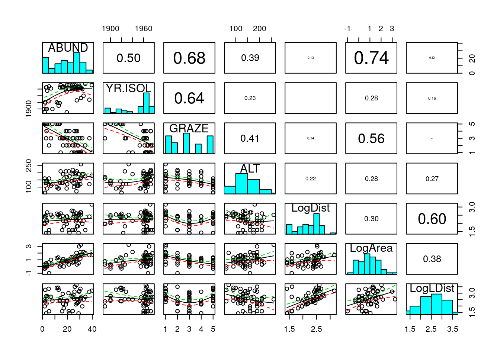
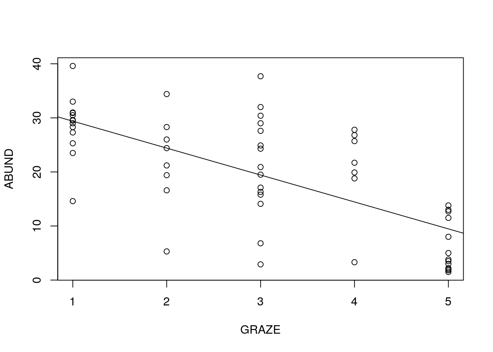
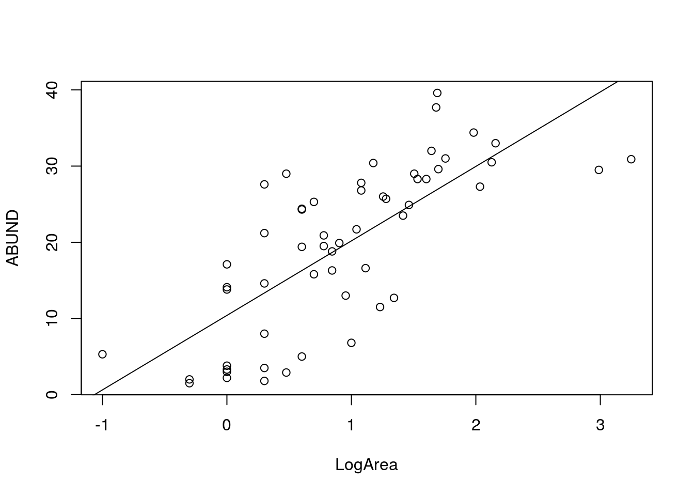
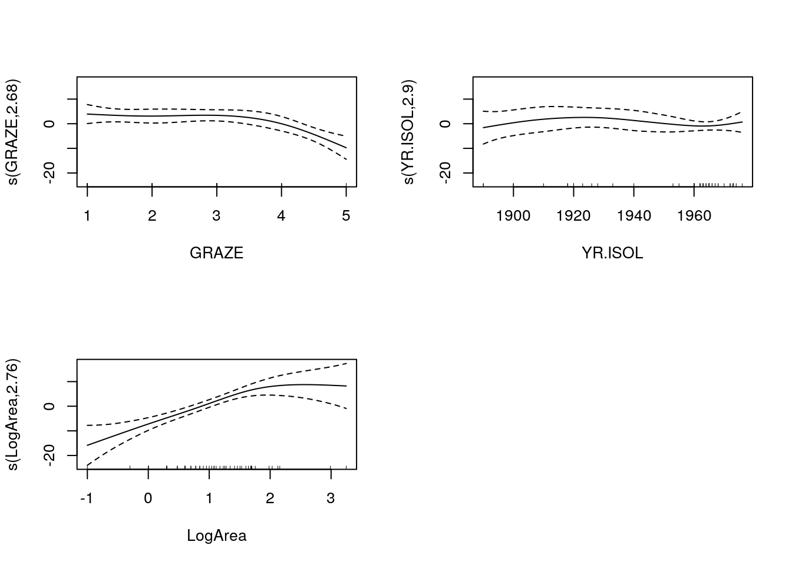
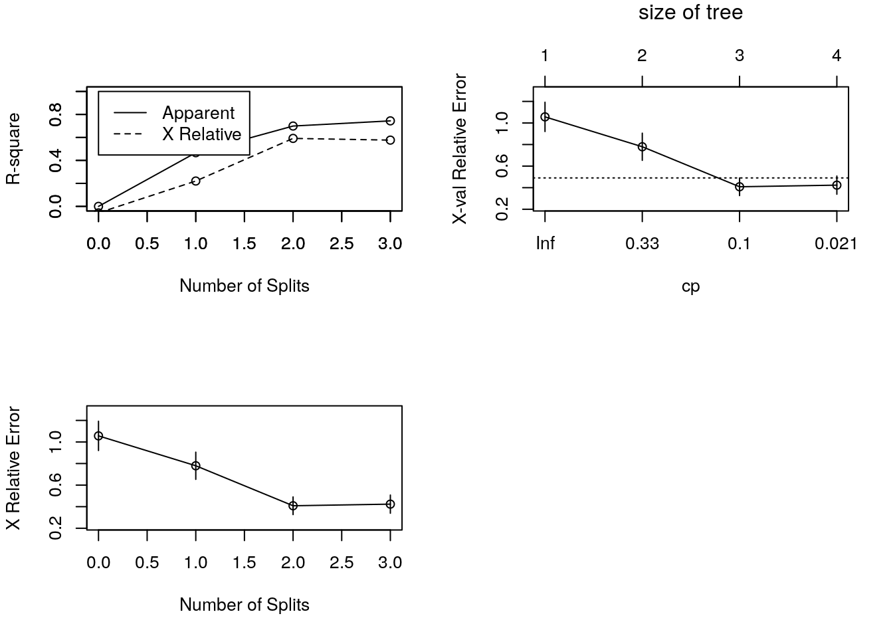
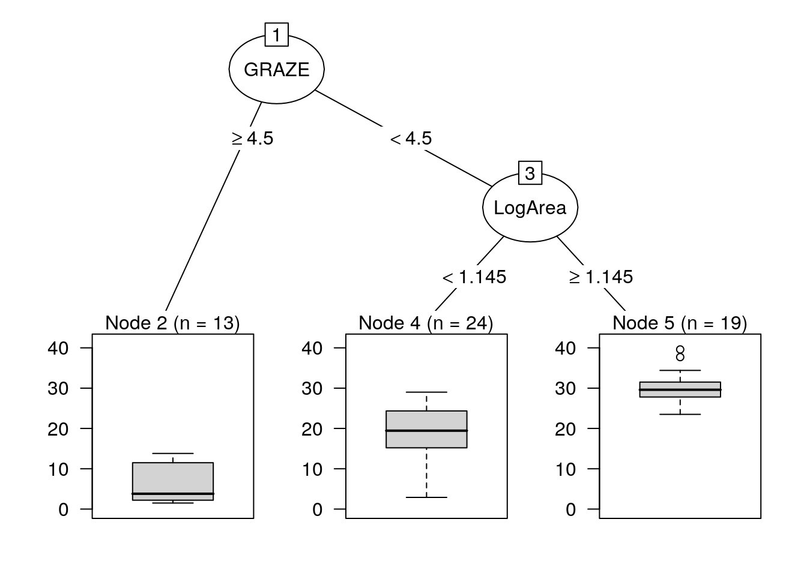
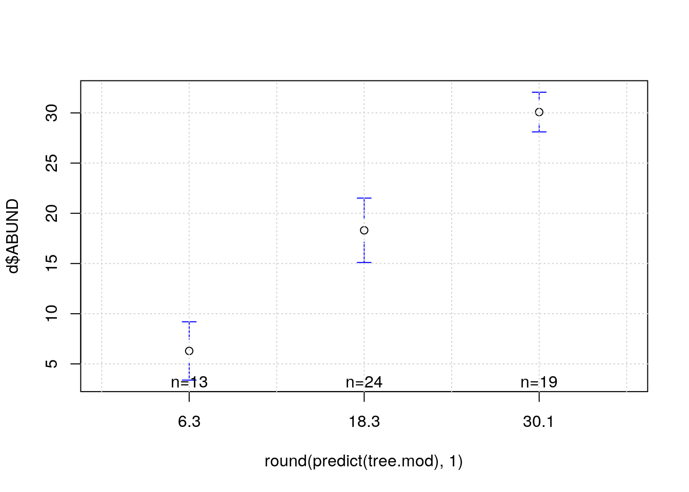

# Modelling with multiple variables


## Introduction

When looking at simple regression models we have used a single numerical variable to explain and/or predict the variability in a second variable. Analysis of co-variance,  uses one numerical variable and a factor. What if we have two or more numerical variables that could explain and/or predict some variable that we are interested in. Can we build models from them? 

From a mathematical perspective using more variables in the model is straightforward. However as we have seen, the complex nature of ecological data has to be considered carefully.

Multiple regression implies all the same assumptions as regression. Simple intepretation of multiple regression models also relies on an aditional assumption. That is that the explanatory variables do not display a high degree of multiple co-linearity. In other words they should not be correlated with each other. This is rarely the case in ecology. Multiple co-linearity does not prevent the use of such models, but it does raise some very tricky issues.


## Example data

The effect of fragmentation of habitat as a result of human activities is a common theme in ecology. We will look at an example presented by Zuur et al (2010). Forest bird abundances expressed as an index (details of how this was measured are not given) were observed in 56 forest patches in south-eastern Victoria, Australia. The aim of the study was to relate the index of forest bird abundance to six habitat variables; size of the forest patch, distance to the nearest patch, distance to the nearest larger patch, mean altitude of the patch, year of isolation by clearing, and an index of stock grazing history (1 = light, 5 = intensive).

Zuur's analysis is given in the appendix of the book. In our analysis the grazing index will be treated as a numerical variable on an ordinal scale. Zuur treats it as a factor. This does not alter the main conclusions of the analysis, and helps to clarify and illustrate some addional issues.


```r
d<-read.csv("https://tinyurl.com/aqm-data/loyn.csv")
```


## Muliple regression

The three steps in building a regression model with many explanatory variables are.

1. Look at the distributions of the explanatory and response variables with particular attention to influential outliers.

2. Look for collinearity of the explanatory variables.

3. Investigate the relationship between the response variable and
the explanatory variables


### Analysis of the distribution of variability

The first step in any analysis involving regression is to investigate the distribution of each variable and look for potential issues with influential outliers. Rembember that the assumption of normality in regression aplies to the residuals, not the explanatory variables themselves. Equally spaced observations (i.e. forming a flat, uniform distribution) would be ideal. We more or less have this for grazing, although the range is slightly limited and the measurements will have error due to the subjective judgment of grazing intensity. A symetrical,more or less normal distribution would also be suitable. However highly skewed distributions cause serious problems. 

Let's first look at the histograms.


```r
par(mfcol=c(2,3))
hist(d$ABUND)
hist(d$AREA)
hist(d$DIST)
hist(d$LDIST)
hist(d$YR.ISOL)
hist(d$ALT)
```


There are issues with both the measures of distance and area. However in this case the outliers are not the result of errors. A few forest patches are much larger than the rest. This type of pattern is very common. We do not usually want to remove these sort of outliers, as they are part of the phenomenon that we are studying. However if a single observation falls in the tail for several of the variables at once it will have very high leverage and potentially exert a great deal of influence over the result. 

Another way of looking for patterns in the outliers is to form Cleveland dotplots. These are very simple diagnostic tools. The value of the observation is simply plotted against the order of the data. This can help to show points that fall far from the rest of the values for several variables.


```r
par(mfrow = c(3, 2), mar = c(3, 3, 3, 1))
dotchart(d$ABUND, main = "ABUND")
dotchart(d$AREA, main = "AREA")
dotchart(d$DIST, main = "DIST") 
dotchart(d$LDIST, main = "LDIST")
dotchart(d$YR.ISOL, main = "YR.ISOL")
dotchart(d$ALT, main = "ALT")
```


We can see that there are two observations with high AREA values, one observation with a high DIST value, and a couple of observations with high LDIST values. These are all different forest patches. If the same patch had much larger values of all variables, then it probably should be dropped from the analysis, as it could exert too much influence on the results. At the very least the analysis should be conducted twice, once with the oulier included and then with the outler removed.


### Transformation

The alternative to dropping outliers is to apply a transformation. This is aimed at "pulling in"" the tail of the distribution in order to give the variables better statistical properties for modelling. We will try a log transformation and look at the results. 


```r
par(mfcol=c(3,2))
d$LogDist<-log10(d$DIST)
d$LogArea<-log10(d$AREA)
d$LogLDist<-log10(d$LDIST)
hist(d$LogDist)
hist(d$LogArea)
hist(d$LogLDist)
dotchart(d$LogDist,main="Log Dist")
dotchart(d$LogArea,main="Log Area")
dotchart(d$LogLDist,main="Log LDist")
```


The transformations seem to have effectively neutralised the outliers, so we can proceed to the next step using all the data.


## Collinearity

To assess collinearity, we will use three tools: Pairwise scatterplots, correlation coefficients, and variance inflation factors (VIF). The first two can be combined in one graph with some R code that is modified from the pairs help file. The modified function can be loaded as a script from the course site. 


```r
library(aqm)
```


We first select the variables that we are interested in. You may want to look at the data frame again with str to check the order. We can quickly subset the data to only include the 2nd and the 6th to 11th columns using the command below.


```r
d1<-d[,c(2,6:11)]
str(d1)
```

```
## 'data.frame':	56 obs. of  7 variables:
##  $ ABUND   : num  5.3 2 1.5 17.1 13.8 14.1 3.8 2.2 3.3 3 ...
##  $ YR.ISOL : int  1968 1920 1900 1966 1918 1965 1955 1920 1965 1900 ...
##  $ GRAZE   : int  2 5 5 3 5 3 5 5 4 5 ...
##  $ ALT     : int  160 60 140 160 140 130 90 60 130 130 ...
##  $ LogDist : num  1.59 2.37 2.02 1.82 2.39 ...
##  $ LogArea : num  -1 -0.301 -0.301 0 0 ...
##  $ LogLDist: num  1.59 2.37 2.49 1.82 2.39 ...
```

Now the function we have loaded produces a scatterplot of each variable against each of the rest, and shows the correlation coefficient in a font that is proportional to its size.


```r
Xpairs(d1)
```



So there is a strong correlation between abundance, grazing and the logarithm of area. There is a weaker correlation with the year of isolation. These are the relationships we are interested in. However there are also correlations between the logarithm of the distance to the nearest patch and the logarithm of the distance to the nearest large patch. This is not suprising if the nearest patch is also a large patch. We will only need to worry about this if either of the terms are included in a model.

Grazing is also correlated with year of isolation and log area. The problem with these correlations is that they potentially confound the interpretation. The degree of confounding depends on the strengthof the correlation. If, for example, all the fragments  that are heavily grazed were also small it would be very hard to clearly attribute low abundance to grazing or to area. 

You can look at the significance of the correlations using the function cor.prob that was also included in the script loaded above. This places the correlation coeficient below the diagonal in the matrix and its significance above. In this particular data set correlation coeficients of above 0.3 (log Area with Altitude) are significant.


```r
round(cor.prob(d1),2)
```

```
##          ABUND YR.ISOL GRAZE   ALT LogDist LogArea LogLDist
## ABUND     1.00    0.00  0.00  0.00    0.35    0.00     0.39
## YR.ISOL   0.50    1.00  0.00  0.08    0.89    0.04     0.24
## GRAZE    -0.68   -0.64  1.00  0.00    0.29    0.00     0.80
## ALT       0.39    0.23 -0.41  1.00    0.10    0.04     0.04
## LogDist   0.13   -0.02 -0.14 -0.22    1.00    0.02     0.00
## LogArea   0.74    0.28 -0.56  0.28    0.30    1.00     0.00
## LogLDist  0.12   -0.16 -0.03 -0.27    0.60    0.38     1.00
```

We will look at the variance inflation factor after fitting some models.


## Model selection

One of the most interesting uses of multiple regression is to establish how many variables might be involved in determining the response. Every time we use regression with observational data such as these we need to remember that correlation is not causation. We cannot unequivocally attribute a cause to the effect. However we can analyse the strength of the association and interpret this carefully. In order to achieve this we need to be aware of some of the pitfalls that arise as a result of multiple colinearity. Let's first look at the grazing and area effects.

We can fit an additive model simply by typing the names of the terms. We can then test their significance using anova.


```r
lm.mod1<-lm(ABUND~GRAZE+LogArea,data=d1)
anova(lm.mod1)
```

```
## Analysis of Variance Table
## 
## Response: ABUND
##           Df Sum Sq Mean Sq F value    Pr(>F)    
## GRAZE      1 2952.3 2952.35  71.094 2.301e-11 ***
## LogArea    1 1184.6 1184.64  28.527 1.977e-06 ***
## Residuals 53 2200.9   41.53                      
## ---
## Signif. codes:  0 '***' 0.001 '**' 0.01 '*' 0.05 '.' 0.1 ' ' 1
```

Grazing and LogArea are quite closely correlated. So we have a problem. If we type the model formula in a different order we get different p-values for the terms!


```r
lm.mod2<-lm(ABUND~LogArea+GRAZE,data=d1)
anova(lm.mod2)
```

```
## Analysis of Variance Table
## 
## Response: ABUND
##           Df Sum Sq Mean Sq F value    Pr(>F)    
## LogArea    1 3471.0  3471.0  83.583 1.757e-12 ***
## GRAZE      1  666.0   666.0  16.038 0.0001946 ***
## Residuals 53 2200.9    41.5                      
## ---
## Signif. codes:  0 '***' 0.001 '**' 0.01 '*' 0.05 '.' 0.1 ' ' 1
```

Both terms are still significant, but the result is quite different.

Why is this? 

Let's break down the analysis in steps. First let's look at the relationship with grazing alone.


```r
plot(ABUND~GRAZE,data=d1)
lm.mod.g<-lm(ABUND~GRAZE,data=d1)
anova(lm.mod.g)
```

```
## Analysis of Variance Table
## 
## Response: ABUND
##           Df Sum Sq Mean Sq F value    Pr(>F)    
## GRAZE      1 2952.3  2952.3   47.09 6.897e-09 ***
## Residuals 54 3385.6    62.7                      
## ---
## Signif. codes:  0 '***' 0.001 '**' 0.01 '*' 0.05 '.' 0.1 ' ' 1
```

```r
abline(lm.mod.g)
```



Now, imagine that we first looked at the strongest relationship that was apparent from the pairs plot. This is the relationship with log area. We could fit a simple regression model.


```r
plot(ABUND~LogArea,data=d1)
lm.mod.a<-lm(ABUND~LogArea,data=d1)
anova(lm.mod.a)
```

```
## Analysis of Variance Table
## 
## Response: ABUND
##           Df Sum Sq Mean Sq F value    Pr(>F)    
## LogArea    1 3471.0  3471.0  65.377 7.178e-11 ***
## Residuals 54 2866.9    53.1                      
## ---
## Signif. codes:  0 '***' 0.001 '**' 0.01 '*' 0.05 '.' 0.1 ' ' 1
```

```r
abline(lm.mod.a)
```



The residuals from the regression is the variability that is not explained by area. We could then take this unexplained variability and see if any of this could still be explained by grazing. This would involve fitting a second model.


```r
plot(residuals(lm.mod.a)~GRAZE,data=d1)
lm.mod.g2<-lm(residuals(lm.mod.a)~GRAZE,data=d1)
abline(lm.mod.g2)
```


```r
anova(lm.mod.g2)
```

```
## Analysis of Variance Table
## 
## Response: residuals(lm.mod.a)
##           Df  Sum Sq Mean Sq F value   Pr(>F)   
## GRAZE      1  457.82  457.82  10.262 0.002279 **
## Residuals 54 2409.12   44.61                    
## ---
## Signif. codes:  0 '***' 0.001 '**' 0.01 '*' 0.05 '.' 0.1 ' ' 1
```


The significance of grazing is greatly reduced after we have taken into account the effect of area. The first variable "soaks up"" a lot of the variablity that is also correlated with grazing. So less of the variability in the residuals can be explained by grazing. So, the order in which we analyse the variables is important. Although the sum of squares and the p-values are slightly different when we fit both terms together using the model formula for multiple regression, the general effect is the same. This does not occur if the variables are completely uncorrelated (orthogonal). Hence there is a need to look at the data very carefully whenever you build a multiple regression model.


### Dropping terms

In the simple case of two explanatory variables we can get around the problem by dropping each of the terms in turn, refitting the model and looking at the difference. The results for mod1 (grazing first) and mod2 (log area first) are now identical. 


```r
drop1(lm.mod1,test="F")
```

```
## Single term deletions
## 
## Model:
## ABUND ~ GRAZE + LogArea
##         Df Sum of Sq    RSS    AIC F value    Pr(>F)    
## <none>               2200.9 211.59                      
## GRAZE    1     666.0 2866.9 224.40  16.038 0.0001946 ***
## LogArea  1    1184.6 3385.6 233.71  28.527 1.977e-06 ***
## ---
## Signif. codes:  0 '***' 0.001 '**' 0.01 '*' 0.05 '.' 0.1 ' ' 1
```

```r
drop1(lm.mod2,test="F")
```

```
## Single term deletions
## 
## Model:
## ABUND ~ LogArea + GRAZE
##         Df Sum of Sq    RSS    AIC F value    Pr(>F)    
## <none>               2200.9 211.59                      
## LogArea  1    1184.6 3385.6 233.71  28.527 1.977e-06 ***
## GRAZE    1     666.0 2866.9 224.40  16.038 0.0001946 ***
## ---
## Signif. codes:  0 '***' 0.001 '**' 0.01 '*' 0.05 '.' 0.1 ' ' 1
```


### Stepwise model selection

The question underlying the analysis is to find out which of the set of explanatory variables are most closely associated with bird abundance. In one sense we already have an answer from the pairs plot. Some of the variables are clearly associated with abundance when used in a model on their own. But we want to explain as much of the variability as possible. How many terms are useful?

One way of addressing this is to fit a model with all the terms and then drop each in turn to check for significance.


```r
lm.mod.full<-lm(ABUND~.,data=d1)
drop1(lm.mod.full,test="F")
```

```
## Single term deletions
## 
## Model:
## ABUND ~ YR.ISOL + GRAZE + ALT + LogDist + LogArea + LogLDist
##          Df Sum of Sq    RSS    AIC F value    Pr(>F)    
## <none>                1996.8 214.14                      
## YR.ISOL   1    108.83 2105.7 215.11  2.6705   0.10864    
## GRAZE     1    131.07 2127.9 215.70  3.2163   0.07908 .  
## ALT       1     27.02 2023.9 212.90  0.6630   0.41945    
## LogDist   1      4.68 2001.5 212.27  0.1149   0.73609    
## LogArea   1   1059.75 3056.6 235.98 26.0049 5.494e-06 ***
## LogLDist  1      3.80 2000.7 212.25  0.0933   0.76130    
## ---
## Signif. codes:  0 '***' 0.001 '**' 0.01 '*' 0.05 '.' 0.1 ' ' 1
```

However, again there is a problem with this if there is any collinearity. This initial analysis suggests that we can drop any one of the variables from the model with the exception of log Area without significantly reducing the amount of variance explained. However the problem is that if we dropped more variables from the model some of these variables would become significant again as they picked up variability that was explained by the lost variables.


### The variance inflation factor

The variables that are more closely correlated with all the rest are those that are likely to have the least significance when dropped from the full model. We can rank the variables according to their colinearity with the rest by calculating the variance inflation factor.


```r
library(car)
sort(vif(lm.mod.full))
```

```
##      ALT  LogDist  YR.ISOL  LogArea LogLDist    GRAZE 
## 1.467937 1.654553 1.804769 1.911514 2.009749 2.524814
```

The variance inflation factor is quite a simple measure to understand. If we remove abundance from the data frame we are left only with the explanatory variables.


```r
expl<-d1[,-1]
```

If we fit a model using all these variables in order to explain the variability in any one of the other explanatory variables we can get a value for R2. If the variable is closely correlated with all the rest this will be large. If we subtract this from one
we get the ammount of variability not explained. The vif is simply the reciprocal of this.

For example for grazing.


```r
vif.mod<-lm(GRAZE~.,data=expl)
Rsq<-summary(vif.mod)$r.squared
Rsq
```

```
## [1] 0.6039312
```

```r
vif<-1/(1-Rsq)
vif
```

```
## [1] 2.524814
```

High values of vif are problematical, but there is no concensus of what is a high value. Zuur (2007) states that some statisticians suggest that values higher than 5 or 10 are too high (Montgomery and Peck 1992). In this case none of the vif values are that large, but the problem of lack of explanatory power in the presence of other variables is still apparent. Therefore a good approach is to rank the vif values as we have done here and think about the problem in context. Variables that do not explain much of the variability in the response variable are not going to be important whatever their vif. However a variable with a high vif value could explain a lot of the variability when used on its own in a model, but very little in combination with others. Grazing seems to be this sort of variable. The point here is that from an ecological perspective we would suspect that high grazing values should have an effect on bird density by altering habitat.
So we would not want to drop the term from the model as a result of artefacts arising as a result of collinearity.

An alternative to using p-values for model selection is the use of AIC. AIC is quite conservative, in other words it tends to allow models to retain more parameters than some other methods for model selection.

We can use AIC for backward model selection using the step function in R. Backwards model selection using AIC is based on the same principle as the drop1 function, but terms are retained if they reduce AIC by more than 2 points. The process is repeated until dropping any further terms does not reduce AIC by more than 2 points.


```r
lm.mod.step<-step(lm.mod.full,test="F")
```

```
## Start:  AIC=214.14
## ABUND ~ YR.ISOL + GRAZE + ALT + LogDist + LogArea + LogLDist
## 
##            Df Sum of Sq    RSS    AIC F value    Pr(>F)    
## - LogLDist  1      3.80 2000.7 212.25  0.0933   0.76130    
## - LogDist   1      4.68 2001.5 212.27  0.1149   0.73609    
## - ALT       1     27.02 2023.9 212.90  0.6630   0.41945    
## <none>                  1996.8 214.14                      
## - YR.ISOL   1    108.83 2105.7 215.11  2.6705   0.10864    
## - GRAZE     1    131.07 2127.9 215.70  3.2163   0.07908 .  
## - LogArea   1   1059.75 3056.6 235.98 26.0049 5.494e-06 ***
## ---
## Signif. codes:  0 '***' 0.001 '**' 0.01 '*' 0.05 '.' 0.1 ' ' 1
## 
## Step:  AIC=212.25
## ABUND ~ YR.ISOL + GRAZE + ALT + LogDist + LogArea
## 
##           Df Sum of Sq    RSS    AIC F value    Pr(>F)    
## - LogDist  1     12.64 2013.3 210.60  0.3159   0.57661    
## - ALT      1     35.12 2035.8 211.22  0.8778   0.35331    
## <none>                 2000.7 212.25                      
## - YR.ISOL  1    121.64 2122.3 213.55  3.0399   0.08739 .  
## - GRAZE    1    132.44 2133.1 213.84  3.3098   0.07486 .  
## - LogArea  1   1193.04 3193.7 236.44 29.8161 1.489e-06 ***
## ---
## Signif. codes:  0 '***' 0.001 '**' 0.01 '*' 0.05 '.' 0.1 ' ' 1
## 
## Step:  AIC=210.6
## ABUND ~ YR.ISOL + GRAZE + ALT + LogArea
## 
##           Df Sum of Sq    RSS    AIC F value    Pr(>F)    
## - ALT      1     57.84 2071.1 210.19  1.4653   0.23167    
## <none>                 2013.3 210.60                      
## - GRAZE    1    123.48 2136.8 211.94  3.1280   0.08294 .  
## - YR.ISOL  1    134.89 2148.2 212.23  3.4169   0.07033 .  
## - LogArea  1   1227.11 3240.4 235.25 31.0846 9.412e-07 ***
## ---
## Signif. codes:  0 '***' 0.001 '**' 0.01 '*' 0.05 '.' 0.1 ' ' 1
## 
## Step:  AIC=210.19
## ABUND ~ YR.ISOL + GRAZE + LogArea
## 
##           Df Sum of Sq    RSS    AIC F value    Pr(>F)    
## <none>                 2071.1 210.19                      
## - YR.ISOL  1    129.81 2200.9 211.59  3.2590   0.07682 .  
## - GRAZE    1    188.45 2259.6 213.06  4.7315   0.03418 *  
## - LogArea  1   1262.97 3334.1 234.85 31.7094 7.316e-07 ***
## ---
## Signif. codes:  0 '***' 0.001 '**' 0.01 '*' 0.05 '.' 0.1 ' ' 1
```

```r
summary(lm.mod.step)
```

```
## 
## Call:
## lm(formula = ABUND ~ YR.ISOL + GRAZE + LogArea, data = d1)
## 
## Residuals:
##      Min       1Q   Median       3Q      Max 
## -14.5159  -3.8136   0.2027   3.1271  14.5542 
## 
## Coefficients:
##               Estimate Std. Error t value Pr(>|t|)    
## (Intercept) -134.26065   86.39085  -1.554   0.1262    
## YR.ISOL        0.07835    0.04340   1.805   0.0768 .  
## GRAZE         -1.90216    0.87447  -2.175   0.0342 *  
## LogArea        7.16617    1.27260   5.631 7.32e-07 ***
## ---
## Signif. codes:  0 '***' 0.001 '**' 0.01 '*' 0.05 '.' 0.1 ' ' 1
## 
## Residual standard error: 6.311 on 52 degrees of freedom
## Multiple R-squared:  0.6732,	Adjusted R-squared:  0.6544 
## F-statistic: 35.71 on 3 and 52 DF,  p-value: 1.135e-12
```

Notice how grazing became significant once more once altitude was dropped. This is probably because fragments that are more heavily grazed are in the valleys. We do have a useful model. But we need to be careful in the intepretation of the intercept. Because we used year of isolation in the model the intercept refers to the value at year zero, altitude zero, grazing zero and log area zero. This is not really helpful. However the slopes are interpretable. They represent the expected change in bird density for each unit change in the variables, when holding all other variables constant. We should report these values along with their confidence intervals, or standard errors.


```r
confint(lm.mod.step)
```

```
##                     2.5 %     97.5 %
## (Intercept) -3.076166e+02 39.0952733
## YR.ISOL     -8.739958e-03  0.1654462
## GRAZE       -3.656915e+00 -0.1473963
## LogArea      4.612500e+00  9.7198311
```

Notice that although the stepwise procedure based on AIC retained year of isolation in the model, the confidence interval includes zero and we cannot be sure if the effect is positive or negative at the 95\% level. This is another way of looking at statistical significance. This term is not significant at the usual 0.05 cutoff. You might consider dropping it from the model. More on this later.

### Diagnostics

Once the model has been decided on the usual diagnostics should be conducted.


```r
par(mfcol=c(2,2))
plot(lm.mod.step)
```


The plots suggest that the main assumptions are not seriously violated. However you should be aware that spatial data such as these could lack independence due to autocorrelation. In order to analyse this we would need the coordinates, which are not provided in this data set.

## Generalised Additive Models

In a previous class we looked at how flexible models can be fitted todata in order to capture more complex responses that are not well modelled by regression. General additive models can be used in a very similar way to multiple regression. They will show up any non linear response when plotted. 

### Fitting a gam with multiple variables


```r
library(mgcv)
gam.mod1<-gam(ABUND~s(GRAZE,k=4)+s(LogArea)+s(YR.ISOL),data=d1)
summary(gam.mod1)
```

```
## 
## Family: gaussian 
## Link function: identity 
## 
## Formula:
## ABUND ~ s(GRAZE, k = 4) + s(LogArea) + s(YR.ISOL)
## 
## Parametric coefficients:
##             Estimate Std. Error t value Pr(>|t|)    
## (Intercept)  19.5143     0.7369   26.48   <2e-16 ***
## ---
## Signif. codes:  0 '***' 0.001 '**' 0.01 '*' 0.05 '.' 0.1 ' ' 1
## 
## Approximate significance of smooth terms:
##              edf Ref.df      F  p-value    
## s(GRAZE)   2.682  2.909  6.078  0.00141 ** 
## s(LogArea) 2.760  3.479 11.485 3.12e-06 ***
## s(YR.ISOL) 2.900  3.542  0.842  0.55123    
## ---
## Signif. codes:  0 '***' 0.001 '**' 0.01 '*' 0.05 '.' 0.1 ' ' 1
## 
## R-sq.(adj) =  0.736   Deviance explained = 77.6%
## GCV = 36.499  Scale est. = 30.41     n = 56
```

Note that in the case of grazing it was necessary to set the number of knots to four. This is because the default in mgcv is to begin with 10 and reduce the complexity through crossvalidation. We can't have 10 knots for grazing as there are only 5 values.


```r
par(mfcol=c(2,2))
plot(gam.mod1)
```




### Quick model selection for Gams

The cross validation algorithm used when fitting gams does not allow stepwise term deletion to be carried out. One quick method of model selection is to add "select=T"" when fitting a model with all the terms. This allows the smoother to reduce to having no knots, which effectively eliminates a term from the model.


```r
gam.mod.sel<-gam(ABUND~s(YR.ISOL)+s(GRAZE,k=4)+s(ALT)+s(LogDist)+s(LogArea)+s(LogLDist),select=T,data=d1)
anova(gam.mod.sel)
```

```
## 
## Family: gaussian 
## Link function: identity 
## 
## Formula:
## ABUND ~ s(YR.ISOL) + s(GRAZE, k = 4) + s(ALT) + s(LogDist) + 
##     s(LogArea) + s(LogLDist)
## 
## Approximate significance of smooth terms:
##                   edf    Ref.df     F  p-value
## s(YR.ISOL)  1.104e-11 9.000e+00 0.000    0.710
## s(GRAZE)    2.181e+00 3.000e+00 8.207 1.36e-05
## s(ALT)      6.048e-01 3.000e+00 0.492    0.118
## s(LogDist)  4.183e-11 9.000e+00 0.000    1.000
## s(LogArea)  2.247e+00 8.000e+00 5.729 2.63e-09
## s(LogLDist) 8.506e-12 9.000e+00 0.000    0.962
```


### Akaike weighting, relative strength of evidence approach.

As mentioned previously, in recent years information criteria (AIC) based approaches have become increasingly used for model selection by ecologists. This has been largely due to a string of influential papers by Burnham and Anderson. AIC is used in the automated stepwise procedure that we have seen already. However the popularity of the Burnham and Anderson model comparison approach arises as a result of the underlying philosophy. Burnham and Anderson do not like stepwise procedures, which are carried out without thought. They insist that simply letting the computer decide on a best model is a poor strategy. The alternative is to suggest a small subset of candidate models that make sense within the context of the study. AIC is then used to evaluate the strength of the evidence provided by the data for each model. 

AIC stands for "Akaike's Information Criteria". To simplify a long story AIC is based on the concept of penalised likelihood. The (-2log) likelihood is a measure of the fit of the model, as is R2, and the penalty paid is 2 points for each parameter used in the model. All other things being equal models with lower AIC scores are better than those with high AIC scores, and a difference of 2 points in the (-2log) likelihood is worth paying for one parameter. 

To use AIC in model selection using the protocol laid out by Burnham and Anderson there are a number of things to keep in mind.

*  All the models in the set of candidates must use exactly the same set of observations and therefore be based on the same sample size n.
*  All the models must use exactly the same response variable. For example do not compare one model using abundance with another using log(abundance)
*  Models must use the same methods to calculate likelihoods. This is a technical issue, but in cases where normally distributed errors are asumed this can be taken as true.

### The method.

*  Choose a subset of models which can be justified as good candidates for the best model on both statistical and biological grounds.
*  Calculate AIC for all models. Burnham and Anderson suggest using an adjusted value called AICc if AIC is small. In fact this could be used for all analyses.
*  Identify the model with the smallest AIC. Denote its AIC as $AIC_{min}$. This is the best model. We could stop at this point but there is more information to extract from the models.
*  Calculate the AIC differences, for each model.$\Delta_{i}=AIC_{i}-AIC_{min}$
*  Compute the relative likelihood for each model. $RL_{i}=exp(-0.5\Delta_{i})$
*  Compute Akaike weights for each model. These are the normalized relative likelihoods. $w_{i}=\frac{RL_{i}}{\sum RL}$. The Akaike weights can be interpreted as probabilities that the given model is the best model.If we were to go back and obtain more data from the population and refit the same models again, then the Akaike weight gives the probability that a given model would be judged the best model on repeated sampling.

The package MuMIn in R will do steps 2 to 6 for us.


```r
library(MuMIn)
gam.mod1<-gam(ABUND~s(GRAZE,k=4)+s(LogArea),data=d1)
gam.mod2<-gam(ABUND~s(GRAZE,k=4)+s(LogArea)+s(YR.ISOL),data=d1)
gam.mod3<-gam(ABUND~s(GRAZE,k=4)+s(LogArea)+s(ALT),data=d1)
gam.mod4<-gam(ABUND~s(YR.ISOL)+s(GRAZE,k=4)+s(ALT)+s(LogDist)+s(LogArea)+s(LogLDist),data=d1)
model.sel(gam.mod1,gam.mod2,gam.mod3,gam.mod4)
```

```
## Model selection table 
##          (Int) s(GRA,4) s(LgA) s(YR.ISO) s(ALT) s(LgD) s(LLD) df   logLik  AICc
## gam.mod1 19.51        +      +                                 6 -173.231 361.9
## gam.mod3 19.51        +      +                +                8 -171.390 362.3
## gam.mod2 19.51        +      +         +                      10 -169.964 365.9
## gam.mod4 19.51        +      +         +      +      +      + 13 -167.720 372.9
##          delta weight
## gam.mod1  0.00  0.510
## gam.mod3  0.40  0.417
## gam.mod2  3.95  0.071
## gam.mod4 10.98  0.002
## Models ranked by AICc(x)
```

So, if we take this information theoretic approach the gam model which includes only grazing and log area has a 51\% probabliity of being the best within the set of models we proposed, while the model with an additional term for altitude has a 42\% probability.

We can also compare GAM's with linear models, as the likelihoods are calculated in the same way.


```r
model.sel(gam.mod1,lm.mod.step)
```

```
## Model selection table 
##               (Int) s(GRA,4) s(LgA)    GRA   LgA  YR.ISO class df   logLik
## gam.mod1      19.51        +      +                        gam  6 -173.231
## lm.mod.step -134.30                 -1.902 7.166 0.07835    lm  5 -180.555
##              AICc delta weight
## gam.mod1    361.9   0.0  0.995
## lm.mod.step 372.3  10.4  0.005
## Models ranked by AICc(x)
```

The GAM wins easily. This is as a result of the GAM finding the correct form for the grazing response rather than assuming a straight line.


## Tree models

One of the problems with multiple regression and generalised additive models is that possible interactions between variables are not included. Zuur et al suggest that grazing could be included as a categorical factor, which allows some interactive effects to be looked at by taking a similar approach to the one we used for analysis of covariance. However interactions between two numerical variables cannot be easily captured. One easy way around this is to use tree models. The idea behind a tree model is to find a series of binary splitting rules that divide the response data into the most homogeneous subsets. The easiest way to follow this is with an example.


### Fitting and plotting a tree model


```r
library(rpart)
tree.mod<-rpart(ABUND~.,data=d1)
par(xpd=T)
plot(tree.mod)
text(tree.mod,use.n=T,digits=3)
```


This has a direct interpretation. We read the tree as a set of rules. If a rule is true we take the left hand branch, if it is false the right hand branch. The first split is based on the variable that can explain most of the deviance when used in this way. This is grazing. So if grazing is >=4.5 i.e. takes values of 5 on the ordinal scale we do not need to consider any other variables. The mean abundance
levels for these sites is 6.3 based on 13 observations. If grazing pressure is low, some more explanatory variables are important. Large fragments with an area over log10(1.145)= 14 hectares have a mean abundance of 30.1. The final split for smaller fragments is less easy to explain. Fragments isolated after 1964 have a slightly lower mean abundance than those isolated earlier. However R starts off using an arbitrary degree of complexity. Maybe this tree has overfit to the data? We can test this by seeing if the tree can be pruned.


### Pruning the tree

The theory behind tree models is presented in Zuur and Crawley. The most difficult element to understand is how to select an optimum tree based on the complexity parameter. The method has some similarity to the use of AIC for model selection. It is based on penalised likelihood (measured as the deviance). We want a tree that fits the data as well as possible, but uses as few parameters (splits) as possible. The default stopping rule that produced the first tree we looked at may have gone too far. We can get an R squared value (variability, or deviance explained) for each split along with the relative error calculated directly or as a result of cross validation. Relative error is 1-R squared. Cross validation produces confidence intervals for this error.
We do not need to go into any more gory details regarding how cross validation is run, apart from mentioning that the cross validation error will always be higher than the apparent error as it is based on simulations using part of the data to fit a model and the rest to validate it. 


```r
par(mfcol=c(2,2))
rsq.rpart(tree.mod)
```

```
## 
## Regression tree:
## rpart(formula = ABUND ~ ., data = d1)
## 
## Variables actually used in tree construction:
## [1] GRAZE   LogArea YR.ISOL
## 
## Root node error: 6337.9/56 = 113.18
## 
## n= 56 
## 
##         CP nsplit rel error  xerror     xstd
## 1 0.466991      0   1.00000 1.05667 0.135782
## 2 0.232025      1   0.53301 0.77947 0.126016
## 3 0.044967      2   0.30098 0.40851 0.081904
## 4 0.010000      3   0.25602 0.42353 0.084239
```

```r
plotcp(tree.mod)
```




It should be apparent from the figures that adding a third split does not result in much gain in variance explained (R squared) or much reduction in relative error. So we can prune the tree using a complexity parameter of 0.1 (see the third figure above). We can also get a nicer figure using the partykit library.


```r
tree.mod<-prune(tree.mod,cp=0.1)
library(partykit)
plot(as.party(tree.mod), digits=3) 
```




We can also look at confidence intervals for the node values. These should not overlap if the splits are significant.


```r
library(gplots)
plotmeans(d$ABUND~round(predict(tree.mod),1),connect=F)
grid()
```



So, the analysis leads to similar conclusions regarding the importance of the variables as multiple regresion. Date of isolation does not seem to be worth keeping in the model. While conservative fitting procedures may retain this term, the effect is not strong enough to be considered important. It is also ambiguous and hard to interpret in a meaningful way. 

A point to be aware of is that the deviance is calculated using the sum of squares. Outliers and points with high leverage can still influence the results of the analysis. Homogeneity of variance is not assumed, as variance explained is calculated for each split separately. However it is a good idea to carry out some basic diagnistics in order to identify problematic observations that are not well predicted by the model and to check that the residuals are at least approximately normally distributed.


```r
par(mfcol=c(2,2))
plot(residuals(tree.mod)~predict(tree.mod))
boxplot(residuals(tree.mod)~round(predict(tree.mod),1))
hist(residuals(tree.mod))
qqnorm(residuals(tree.mod))
qqline(residuals(tree.mod))
```


The R squared of the tree model is 1-0.3= 0.7. This is comparable to the value we got using GAM and it is higher than the value for conventional multiple regression. The GAM and tree models show clearly that the effect of grazing is only important at the highest level of the index. The tree model also points out a possible interaction. At high levels of grazing there seems to be no further effect of area on abundance. This may be because high levels of grazing have altered the forest habitat so much that it is no longer suitable for many types of forest bird.

Tree models are particularly useful for quickly establishing which variables are most important in large data sets. Sometimes only a single split is found. If the same variable is used to split the data repeatedly the tree is effectively carrying out a regression on that variable, but with a series of steps instead of a smooth line. 


## Which technique to use?

The three techniques led to more or less the same conclusion regarding the relative importance of the explanatory variables. The only slight point of contention was whether altitude or year since isolation could have some effect. The GAM model and the tree model point out that the effect of grazing is only important at the highest level. This might also have been identified if we had used grazing as a factor in a linear model, which we did not try here. You may want to read Zuur et als analysis of these data.

Each of the modelling techniques have their own strengths and weaknesses.

*  Multiple regression is a classic methodology that is understood by most researchers. It is simple to report the results in a conventional style (see this paper by the researcher who collected the data we have just analysed for an example). Many relationships are approximated by a straight line, so regression coefficients form a useful summary of effects. Using linear regression forces you to investigate the nature of the data thoroughly in order to ensure that the assumptions of the technique are not severely violated. With care, data sets with a high degree of multiple colinearity can be analysed, providing the consequences of colinearity are recognised when selecting the model. However the technique can lead to curvilinear responses being missed, along with interactions.

*  Generalised additive models have become very popular in the ecological literature over the last few years. They allow complex responses to be identified. The relative importance of each explanatory variable can be assessed using GAMS just as in multiple regression. Linear regression can fail to spot curvilinear responses which can sometimes lead to misspecified models that do not capture an important element in the data. However GAM models are difficult to communicate to others.
They can only really be plotted. So unless the data and the fitted model are provided they cannot be used for predicting new cases after the report has been written up.
*  Tree models are simple to interpret, make relatively few assumptions and can show up interactions. Providing trees are not too complex the results can be easily communicated as a set of verbal rules. However the assumption that responses take the form of clear break points is often very misleading. Although tree models find the best break points, they are often still arbitrary and do not necessarily represent any real process.

There is no particular reason to prefer a single method over the others. In fact, until you have looked carefully at your data you are unlikely to know which technique will produce the most insight. It is important to end up with a defensible model which most closely meets the assumptions.

This class has shown that with practice and a little guidance it can be possible to combine all three techniques in order to find out as much as possible about the data. This is a sensible approach to take, even though it requires a bit more work. A write up of the analysis would sumarise the main findings from the technique that produced the most defensible model in the main body of the report, and include appendices showing the key results from alternative approaches. Ideally the data and R code used to fit the models would also be supplied so that a reader could check the validity of the conclusions.

Do be aware that none of these methods (with the possible exception of tree models) will work well in the case of data with large numbers of zeros, or with large and heterogeneous variability.


## References

Anderson, D. R., Burnham, K. P. (2001). Kullback-Leibler information as a basis for strong inference in ecological studies. Wildlife Research,
28(2), 111-120. 

Burnham, K. P, Anderson, D. R., Link, W. A., Johnson, D. H. (2001).
Suggestions for presenting the results of data analyses. Journal of Wildlife Management, 65(3), 373-378. 

Thompson, W. L., Anderson, D. R., Burnham, K. P. (2000). Null hypothesis testing: problems, prevalence, and an alternative. The Journal of Wildlife Management, 912-923.

