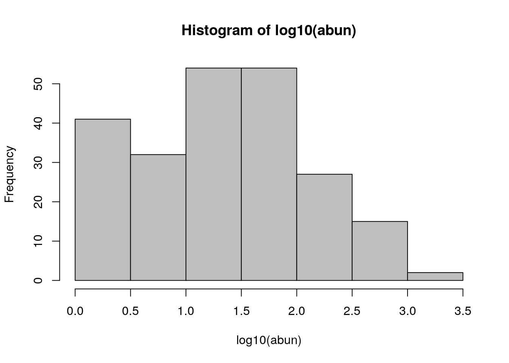
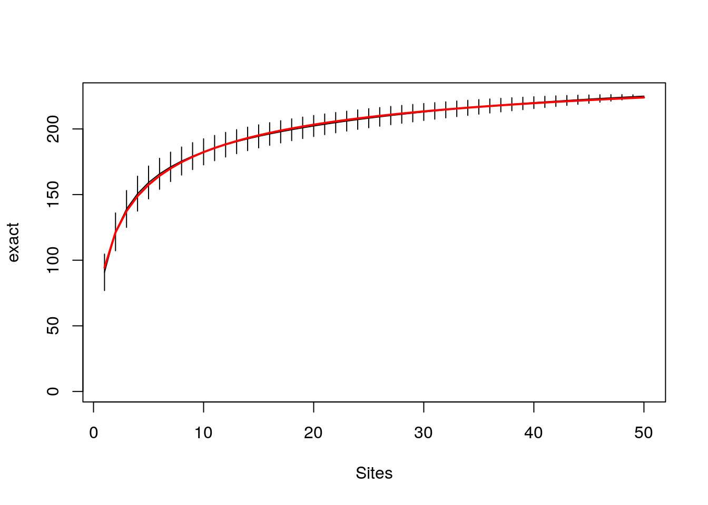
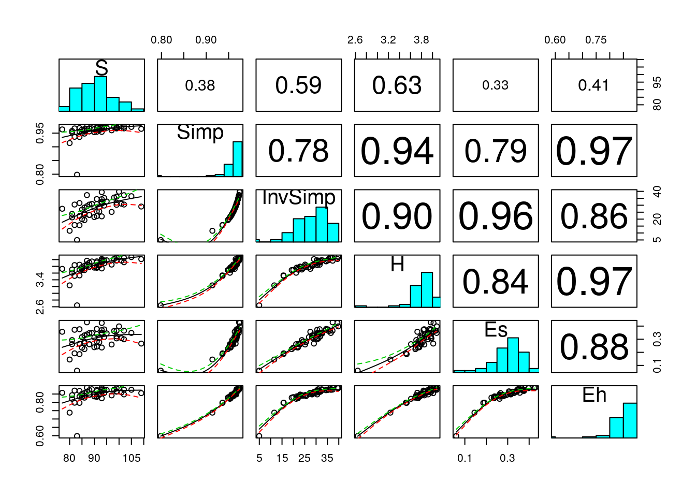

# Analysis of multi-species data


One of the commonest tasks that quantitative ecologists face is the analysis of site by species matrices. Such data are routinely produced as a result of many types of ecological survey. Because multiple species are involved such data is always challenging to analyse. There are a lot of questions that can be addressed with multispecies data. Many of these involve analysis of species diversity in some respect.

Species diversity is classically regarded as consisting of three components. 

$gamma=alpha+beta$

Alpha diversity is measured at the scale of some sampling unit (i.e. plot or quadrat). Gamma diversity is the overall diversity over the whole area that is being measured. Beta diversity is the difference between the two. Or is it? The issues involved in analysing diversity are extremely complex and could form the basis of a whole taught unit.

For the moment let's accept this simplified version of the issue for the pragmatic purpose of finding some methods that will allow us to work with a sites by species matrix.


## Working with the sites by species matrix

One approach to working with the species by sites matrix would be to produce a measure that could be used as a response variable in some other model. In this class we will look at some simple measures of species diversity. The next class will apply some more complex methods in order to look at species composition.
However you first need to become familiar with the format of the matrix in order to work with the data comfortably.


### BCI data

Let's look at some realistically complex data from a classic study of tropical diversity. The Smithsonian institute has a permanent sample plot of 50 hectares of tropical forest located on the Island of Barro Colorado in Panama. 

The data set consists of a grid of completely censused plot of 100m x 100m within which all trees over 5cm in diameter were counted and identified to species.


```r
library(rgdal)
x<- rep(seq(625754, 626654, by=100),each=5)
y<- rep(seq(1011569,  1011969, by=100),len=50) 
coords<-data.frame(x,y)
dd<-data.frame(coords,id=1:100)
coordinates(dd)<-~x+y
proj4string(dd)<-CRS("+init=epsg:32617")
dd<-spTransform(dd, CRS("+init=epsg:4326"))
library(mapview)
m<-mapview(dd)
library(leaflet.extras)
m@map %>% addFullscreenControl()
```

<!--html_preserve--><div id="htmlwidget-0456481a80691a4d8682" style="width:672px;height:480px;" class="leaflet html-widget"></div>
<script type="application/json" data-for="htmlwidget-0456481a80691a4d8682">{"x":{"options":{"minZoom":1,"maxZoom":100,"crs":{"crsClass":"L.CRS.EPSG3857","code":null,"proj4def":null,"projectedBounds":null,"options":{}},"preferCanvas":false,"bounceAtZoomLimits":false,"maxBounds":[[[-90,-370]],[[90,370]]],"fullscreenControl":{"position":"topleft","pseudoFullscreen":false}},"calls":[{"method":"addProviderTiles","args":["CartoDB.Positron",1,"CartoDB.Positron",{"errorTileUrl":"","noWrap":false,"detectRetina":false}]},{"method":"addProviderTiles","args":["CartoDB.DarkMatter",2,"CartoDB.DarkMatter",{"errorTileUrl":"","noWrap":false,"detectRetina":false}]},{"method":"addProviderTiles","args":["OpenStreetMap",3,"OpenStreetMap",{"errorTileUrl":"","noWrap":false,"detectRetina":false}]},{"method":"addProviderTiles","args":["Esri.WorldImagery",4,"Esri.WorldImagery",{"errorTileUrl":"","noWrap":false,"detectRetina":false}]},{"method":"addProviderTiles","args":["OpenTopoMap",5,"OpenTopoMap",{"errorTileUrl":"","noWrap":false,"detectRetina":false}]},{"method":"createMapPane","args":["point",440]},{"method":"addCircleMarkers","args":[[9.1493979389932,9.15030225903923,9.15120657903935,9.15211089899354,9.15301521890182,9.14939506507475,9.15029938483203,9.1512037045434,9.15210802420883,9.15301234382835,9.14939218887337,9.15029650834167,9.15120082776405,9.1521051471405,9.15300946647103,9.14938931038906,9.15029362956815,9.15119794870132,9.15210226778856,9.15300658682986,9.14938642962182,9.15029074851147,9.15119506735519,9.15209938615299,9.15300370490485,9.14938354657166,9.15028786517164,9.15119218372569,9.15209650223382,9.15300082069601,9.14938066123859,9.15028497954867,9.15118929781282,9.15209361603103,9.15299793420332,9.1493777736226,9.15028209164254,9.15118640961657,9.15209072754465,9.1529950454268,9.1493748837237,9.15027920145329,9.15118351913694,9.15208783677467,9.15299215436646,9.14937199154189,9.15027630898089,9.15118062637396,9.15208494372109,9.15298926102229,9.1493979389932,9.15030225903923,9.15120657903935,9.15211089899354,9.15301521890182,9.14939506507475,9.15029938483203,9.1512037045434,9.15210802420883,9.15301234382835,9.14939218887337,9.15029650834167,9.15120082776405,9.1521051471405,9.15300946647103,9.14938931038906,9.15029362956815,9.15119794870132,9.15210226778856,9.15300658682986,9.14938642962182,9.15029074851147,9.15119506735519,9.15209938615299,9.15300370490485,9.14938354657166,9.15028786517164,9.15119218372569,9.15209650223382,9.15300082069601,9.14938066123859,9.15028497954867,9.15118929781282,9.15209361603103,9.15299793420332,9.1493777736226,9.15028209164254,9.15118640961657,9.15209072754465,9.1529950454268,9.1493748837237,9.15027920145329,9.15118351913694,9.15208783677467,9.15299215436646,9.14937199154189,9.15027630898089,9.15118062637396,9.15208494372109,9.15298926102229],[-79.8554864789929,-79.8554835880359,-79.8554806967809,-79.8554778052281,-79.8554749133773,-79.8545764830636,-79.8545735898092,-79.8545706962567,-79.854567802406,-79.8545649082572,-79.8536664874324,-79.8536635918807,-79.8536606960305,-79.853657799882,-79.8536549034351,-79.8527564920996,-79.8527535942505,-79.8527506961028,-79.8527477976564,-79.8527448989115,-79.8518464970654,-79.851843596919,-79.8518406964737,-79.8518377957295,-79.8518348946865,-79.8509365023301,-79.8509335998862,-79.8509306971434,-79.8509277941014,-79.8509248907603,-79.8500265078938,-79.8500236031526,-79.8500206981122,-79.8500177927724,-79.8500148871333,-79.8491165137568,-79.8491136067183,-79.8491106993803,-79.8491077917427,-79.8491048838055,-79.8482065199194,-79.8482036105836,-79.8482007009479,-79.8481977910125,-79.8481948807773,-79.8472965263817,-79.8472936147486,-79.8472907028154,-79.8472877905822,-79.847284878049,-79.8554864789929,-79.8554835880359,-79.8554806967809,-79.8554778052281,-79.8554749133773,-79.8545764830636,-79.8545735898092,-79.8545706962567,-79.854567802406,-79.8545649082572,-79.8536664874324,-79.8536635918807,-79.8536606960305,-79.853657799882,-79.8536549034351,-79.8527564920996,-79.8527535942505,-79.8527506961028,-79.8527477976564,-79.8527448989115,-79.8518464970654,-79.851843596919,-79.8518406964737,-79.8518377957295,-79.8518348946865,-79.8509365023301,-79.8509335998862,-79.8509306971434,-79.8509277941014,-79.8509248907603,-79.8500265078938,-79.8500236031526,-79.8500206981122,-79.8500177927724,-79.8500148871333,-79.8491165137568,-79.8491136067183,-79.8491106993803,-79.8491077917427,-79.8491048838055,-79.8482065199194,-79.8482036105836,-79.8482007009479,-79.8481977910125,-79.8481948807773,-79.8472965263817,-79.8472936147486,-79.8472907028154,-79.8472877905822,-79.847284878049],6,null,"dd",{"crs":{"crsClass":"L.CRS.EPSG3857","code":null,"proj4def":null,"projectedBounds":null,"options":{}},"pane":"point","stroke":true,"color":"#333333","weight":2,"opacity":[0.9,0.9,0.9,0.9,0.9,0.9,0.9,0.9,0.9,0.9,0.9,0.9,0.9,0.9,0.9,0.9,0.9,0.9,0.9,0.9,0.9,0.9,0.9,0.9,0.9,0.9,0.9,0.9,0.9,0.9,0.9,0.9,0.9,0.9,0.9,0.9,0.9,0.9,0.9,0.9,0.9,0.9,0.9,0.9,0.9,0.9,0.9,0.9,0.9,0.9,0.9,0.9,0.9,0.9,0.9,0.9,0.9,0.9,0.9,0.9,0.9,0.9,0.9,0.9,0.9,0.9,0.9,0.9,0.9,0.9,0.9,0.9,0.9,0.9,0.9,0.9,0.9,0.9,0.9,0.9,0.9,0.9,0.9,0.9,0.9,0.9,0.9,0.9,0.9,0.9,0.9,0.9,0.9,0.9,0.9,0.9,0.9,0.9,0.9,0.9],"fill":true,"fillColor":["#481769","#481B6D","#481B6D","#481E70","#482173","#482576","#482878","#472C7A","#472F7C","#46327E","#453581","#453581","#453882","#443B84","#433E85","#424186","#404587","#3F4788","#3E4A89","#3E4A89","#3D4D8A","#3C508B","#3B528B","#39558C","#38598C","#375B8D","#355E8D","#34608D","#34608D","#33638D","#32658E","#31688E","#2F6B8E","#2E6D8E","#2D708E","#2C718E","#2B748E","#2B748E","#2A768E","#29798E","#287C8E","#277E8E","#26818E","#26828E","#25858E","#24878E","#24878E","#238A8D","#228D8D","#218F8D","#20928C","#20938C","#1F968B","#1F998A","#1F998A","#1E9B8A","#1F9E89","#1FA088","#1FA287","#20A486","#22A785","#24AA83","#25AC82","#25AC82","#28AE80","#2BB07F","#2EB37C","#31B67B","#35B779","#39BA76","#3DBC74","#41BE71","#41BE71","#47C06F","#4CC26C","#51C56A","#56C667","#5BC863","#61CA60","#67CC5C","#6DCD59","#6DCD59","#73D056","#78D152","#7FD34E","#85D54A","#8CD646","#92D741","#99D83D","#99D83D","#A0DA39","#A7DB35","#ADDC30","#B4DE2C","#BBDE28","#C2DF23","#C9E020","#D0E11C","#D0E11C","#D7E219"],"fillOpacity":[0.6,0.6,0.6,0.6,0.6,0.6,0.6,0.6,0.6,0.6,0.6,0.6,0.6,0.6,0.6,0.6,0.6,0.6,0.6,0.6,0.6,0.6,0.6,0.6,0.6,0.6,0.6,0.6,0.6,0.6,0.6,0.6,0.6,0.6,0.6,0.6,0.6,0.6,0.6,0.6,0.6,0.6,0.6,0.6,0.6,0.6,0.6,0.6,0.6,0.6,0.6,0.6,0.6,0.6,0.6,0.6,0.6,0.6,0.6,0.6,0.6,0.6,0.6,0.6,0.6,0.6,0.6,0.6,0.6,0.6,0.6,0.6,0.6,0.6,0.6,0.6,0.6,0.6,0.6,0.6,0.6,0.6,0.6,0.6,0.6,0.6,0.6,0.6,0.6,0.6,0.6,0.6,0.6,0.6,0.6,0.6,0.6,0.6,0.6,0.6]},null,null,["<html><head><link rel=\"stylesheet\" type=\"text/css\" href=\"lib/popup/popup.css\"><\/head><body><div class=\"scrollableContainer\"><table class=\"popup scrollable\" id=\"popup\"><tr class='coord'><td><\/td><td><b>Feature ID<\/b><\/td><td align='right'>1&emsp;<\/td><\/tr><tr class='alt'><td>1<\/td><td><b>id&emsp;<\/b><\/td><td align='right'>1&emsp;<\/td><\/tr><tr><td>2<\/td><td><b>geometry&emsp;<\/b><\/td><td align='right'>sfc_POINT&emsp;<\/td><\/tr><\/table><\/div><\/body><\/html>","<html><head><link rel=\"stylesheet\" type=\"text/css\" href=\"lib/popup/popup.css\"><\/head><body><div class=\"scrollableContainer\"><table class=\"popup scrollable\" id=\"popup\"><tr class='coord'><td><\/td><td><b>Feature ID<\/b><\/td><td align='right'>2&emsp;<\/td><\/tr><tr class='alt'><td>1<\/td><td><b>id&emsp;<\/b><\/td><td align='right'>2&emsp;<\/td><\/tr><tr><td>2<\/td><td><b>geometry&emsp;<\/b><\/td><td align='right'>sfc_POINT&emsp;<\/td><\/tr><\/table><\/div><\/body><\/html>","<html><head><link rel=\"stylesheet\" type=\"text/css\" href=\"lib/popup/popup.css\"><\/head><body><div class=\"scrollableContainer\"><table class=\"popup scrollable\" id=\"popup\"><tr class='coord'><td><\/td><td><b>Feature ID<\/b><\/td><td align='right'>3&emsp;<\/td><\/tr><tr class='alt'><td>1<\/td><td><b>id&emsp;<\/b><\/td><td align='right'>3&emsp;<\/td><\/tr><tr><td>2<\/td><td><b>geometry&emsp;<\/b><\/td><td align='right'>sfc_POINT&emsp;<\/td><\/tr><\/table><\/div><\/body><\/html>","<html><head><link rel=\"stylesheet\" type=\"text/css\" href=\"lib/popup/popup.css\"><\/head><body><div class=\"scrollableContainer\"><table class=\"popup scrollable\" id=\"popup\"><tr class='coord'><td><\/td><td><b>Feature ID<\/b><\/td><td align='right'>4&emsp;<\/td><\/tr><tr class='alt'><td>1<\/td><td><b>id&emsp;<\/b><\/td><td align='right'>4&emsp;<\/td><\/tr><tr><td>2<\/td><td><b>geometry&emsp;<\/b><\/td><td align='right'>sfc_POINT&emsp;<\/td><\/tr><\/table><\/div><\/body><\/html>","<html><head><link rel=\"stylesheet\" type=\"text/css\" href=\"lib/popup/popup.css\"><\/head><body><div class=\"scrollableContainer\"><table class=\"popup scrollable\" id=\"popup\"><tr class='coord'><td><\/td><td><b>Feature ID<\/b><\/td><td align='right'>5&emsp;<\/td><\/tr><tr class='alt'><td>1<\/td><td><b>id&emsp;<\/b><\/td><td align='right'>5&emsp;<\/td><\/tr><tr><td>2<\/td><td><b>geometry&emsp;<\/b><\/td><td align='right'>sfc_POINT&emsp;<\/td><\/tr><\/table><\/div><\/body><\/html>","<html><head><link rel=\"stylesheet\" type=\"text/css\" href=\"lib/popup/popup.css\"><\/head><body><div class=\"scrollableContainer\"><table class=\"popup scrollable\" id=\"popup\"><tr class='coord'><td><\/td><td><b>Feature ID<\/b><\/td><td align='right'>6&emsp;<\/td><\/tr><tr class='alt'><td>1<\/td><td><b>id&emsp;<\/b><\/td><td align='right'>6&emsp;<\/td><\/tr><tr><td>2<\/td><td><b>geometry&emsp;<\/b><\/td><td align='right'>sfc_POINT&emsp;<\/td><\/tr><\/table><\/div><\/body><\/html>","<html><head><link rel=\"stylesheet\" type=\"text/css\" href=\"lib/popup/popup.css\"><\/head><body><div class=\"scrollableContainer\"><table class=\"popup scrollable\" id=\"popup\"><tr class='coord'><td><\/td><td><b>Feature ID<\/b><\/td><td align='right'>7&emsp;<\/td><\/tr><tr class='alt'><td>1<\/td><td><b>id&emsp;<\/b><\/td><td align='right'>7&emsp;<\/td><\/tr><tr><td>2<\/td><td><b>geometry&emsp;<\/b><\/td><td align='right'>sfc_POINT&emsp;<\/td><\/tr><\/table><\/div><\/body><\/html>","<html><head><link rel=\"stylesheet\" type=\"text/css\" href=\"lib/popup/popup.css\"><\/head><body><div class=\"scrollableContainer\"><table class=\"popup scrollable\" id=\"popup\"><tr class='coord'><td><\/td><td><b>Feature ID<\/b><\/td><td align='right'>8&emsp;<\/td><\/tr><tr class='alt'><td>1<\/td><td><b>id&emsp;<\/b><\/td><td align='right'>8&emsp;<\/td><\/tr><tr><td>2<\/td><td><b>geometry&emsp;<\/b><\/td><td align='right'>sfc_POINT&emsp;<\/td><\/tr><\/table><\/div><\/body><\/html>","<html><head><link rel=\"stylesheet\" type=\"text/css\" href=\"lib/popup/popup.css\"><\/head><body><div class=\"scrollableContainer\"><table class=\"popup scrollable\" id=\"popup\"><tr class='coord'><td><\/td><td><b>Feature ID<\/b><\/td><td align='right'>9&emsp;<\/td><\/tr><tr class='alt'><td>1<\/td><td><b>id&emsp;<\/b><\/td><td align='right'>9&emsp;<\/td><\/tr><tr><td>2<\/td><td><b>geometry&emsp;<\/b><\/td><td align='right'>sfc_POINT&emsp;<\/td><\/tr><\/table><\/div><\/body><\/html>","<html><head><link rel=\"stylesheet\" type=\"text/css\" href=\"lib/popup/popup.css\"><\/head><body><div class=\"scrollableContainer\"><table class=\"popup scrollable\" id=\"popup\"><tr class='coord'><td><\/td><td><b>Feature ID<\/b><\/td><td align='right'>10&emsp;<\/td><\/tr><tr class='alt'><td>1<\/td><td><b>id&emsp;<\/b><\/td><td align='right'>10&emsp;<\/td><\/tr><tr><td>2<\/td><td><b>geometry&emsp;<\/b><\/td><td align='right'>sfc_POINT&emsp;<\/td><\/tr><\/table><\/div><\/body><\/html>","<html><head><link rel=\"stylesheet\" type=\"text/css\" href=\"lib/popup/popup.css\"><\/head><body><div class=\"scrollableContainer\"><table class=\"popup scrollable\" id=\"popup\"><tr class='coord'><td><\/td><td><b>Feature ID<\/b><\/td><td align='right'>11&emsp;<\/td><\/tr><tr class='alt'><td>1<\/td><td><b>id&emsp;<\/b><\/td><td align='right'>11&emsp;<\/td><\/tr><tr><td>2<\/td><td><b>geometry&emsp;<\/b><\/td><td align='right'>sfc_POINT&emsp;<\/td><\/tr><\/table><\/div><\/body><\/html>","<html><head><link rel=\"stylesheet\" type=\"text/css\" href=\"lib/popup/popup.css\"><\/head><body><div class=\"scrollableContainer\"><table class=\"popup scrollable\" id=\"popup\"><tr class='coord'><td><\/td><td><b>Feature ID<\/b><\/td><td align='right'>12&emsp;<\/td><\/tr><tr class='alt'><td>1<\/td><td><b>id&emsp;<\/b><\/td><td align='right'>12&emsp;<\/td><\/tr><tr><td>2<\/td><td><b>geometry&emsp;<\/b><\/td><td align='right'>sfc_POINT&emsp;<\/td><\/tr><\/table><\/div><\/body><\/html>","<html><head><link rel=\"stylesheet\" type=\"text/css\" href=\"lib/popup/popup.css\"><\/head><body><div class=\"scrollableContainer\"><table class=\"popup scrollable\" id=\"popup\"><tr class='coord'><td><\/td><td><b>Feature ID<\/b><\/td><td align='right'>13&emsp;<\/td><\/tr><tr class='alt'><td>1<\/td><td><b>id&emsp;<\/b><\/td><td align='right'>13&emsp;<\/td><\/tr><tr><td>2<\/td><td><b>geometry&emsp;<\/b><\/td><td align='right'>sfc_POINT&emsp;<\/td><\/tr><\/table><\/div><\/body><\/html>","<html><head><link rel=\"stylesheet\" type=\"text/css\" href=\"lib/popup/popup.css\"><\/head><body><div class=\"scrollableContainer\"><table class=\"popup scrollable\" id=\"popup\"><tr class='coord'><td><\/td><td><b>Feature ID<\/b><\/td><td align='right'>14&emsp;<\/td><\/tr><tr class='alt'><td>1<\/td><td><b>id&emsp;<\/b><\/td><td align='right'>14&emsp;<\/td><\/tr><tr><td>2<\/td><td><b>geometry&emsp;<\/b><\/td><td align='right'>sfc_POINT&emsp;<\/td><\/tr><\/table><\/div><\/body><\/html>","<html><head><link rel=\"stylesheet\" type=\"text/css\" href=\"lib/popup/popup.css\"><\/head><body><div class=\"scrollableContainer\"><table class=\"popup scrollable\" id=\"popup\"><tr class='coord'><td><\/td><td><b>Feature ID<\/b><\/td><td align='right'>15&emsp;<\/td><\/tr><tr class='alt'><td>1<\/td><td><b>id&emsp;<\/b><\/td><td align='right'>15&emsp;<\/td><\/tr><tr><td>2<\/td><td><b>geometry&emsp;<\/b><\/td><td align='right'>sfc_POINT&emsp;<\/td><\/tr><\/table><\/div><\/body><\/html>","<html><head><link rel=\"stylesheet\" type=\"text/css\" href=\"lib/popup/popup.css\"><\/head><body><div class=\"scrollableContainer\"><table class=\"popup scrollable\" id=\"popup\"><tr class='coord'><td><\/td><td><b>Feature ID<\/b><\/td><td align='right'>16&emsp;<\/td><\/tr><tr class='alt'><td>1<\/td><td><b>id&emsp;<\/b><\/td><td align='right'>16&emsp;<\/td><\/tr><tr><td>2<\/td><td><b>geometry&emsp;<\/b><\/td><td align='right'>sfc_POINT&emsp;<\/td><\/tr><\/table><\/div><\/body><\/html>","<html><head><link rel=\"stylesheet\" type=\"text/css\" href=\"lib/popup/popup.css\"><\/head><body><div class=\"scrollableContainer\"><table class=\"popup scrollable\" id=\"popup\"><tr class='coord'><td><\/td><td><b>Feature ID<\/b><\/td><td align='right'>17&emsp;<\/td><\/tr><tr class='alt'><td>1<\/td><td><b>id&emsp;<\/b><\/td><td align='right'>17&emsp;<\/td><\/tr><tr><td>2<\/td><td><b>geometry&emsp;<\/b><\/td><td align='right'>sfc_POINT&emsp;<\/td><\/tr><\/table><\/div><\/body><\/html>","<html><head><link rel=\"stylesheet\" type=\"text/css\" href=\"lib/popup/popup.css\"><\/head><body><div class=\"scrollableContainer\"><table class=\"popup scrollable\" id=\"popup\"><tr class='coord'><td><\/td><td><b>Feature ID<\/b><\/td><td align='right'>18&emsp;<\/td><\/tr><tr class='alt'><td>1<\/td><td><b>id&emsp;<\/b><\/td><td align='right'>18&emsp;<\/td><\/tr><tr><td>2<\/td><td><b>geometry&emsp;<\/b><\/td><td align='right'>sfc_POINT&emsp;<\/td><\/tr><\/table><\/div><\/body><\/html>","<html><head><link rel=\"stylesheet\" type=\"text/css\" href=\"lib/popup/popup.css\"><\/head><body><div class=\"scrollableContainer\"><table class=\"popup scrollable\" id=\"popup\"><tr class='coord'><td><\/td><td><b>Feature ID<\/b><\/td><td align='right'>19&emsp;<\/td><\/tr><tr class='alt'><td>1<\/td><td><b>id&emsp;<\/b><\/td><td align='right'>19&emsp;<\/td><\/tr><tr><td>2<\/td><td><b>geometry&emsp;<\/b><\/td><td align='right'>sfc_POINT&emsp;<\/td><\/tr><\/table><\/div><\/body><\/html>","<html><head><link rel=\"stylesheet\" type=\"text/css\" href=\"lib/popup/popup.css\"><\/head><body><div class=\"scrollableContainer\"><table class=\"popup scrollable\" id=\"popup\"><tr class='coord'><td><\/td><td><b>Feature ID<\/b><\/td><td align='right'>20&emsp;<\/td><\/tr><tr class='alt'><td>1<\/td><td><b>id&emsp;<\/b><\/td><td align='right'>20&emsp;<\/td><\/tr><tr><td>2<\/td><td><b>geometry&emsp;<\/b><\/td><td align='right'>sfc_POINT&emsp;<\/td><\/tr><\/table><\/div><\/body><\/html>","<html><head><link rel=\"stylesheet\" type=\"text/css\" href=\"lib/popup/popup.css\"><\/head><body><div class=\"scrollableContainer\"><table class=\"popup scrollable\" id=\"popup\"><tr class='coord'><td><\/td><td><b>Feature ID<\/b><\/td><td align='right'>21&emsp;<\/td><\/tr><tr class='alt'><td>1<\/td><td><b>id&emsp;<\/b><\/td><td align='right'>21&emsp;<\/td><\/tr><tr><td>2<\/td><td><b>geometry&emsp;<\/b><\/td><td align='right'>sfc_POINT&emsp;<\/td><\/tr><\/table><\/div><\/body><\/html>","<html><head><link rel=\"stylesheet\" type=\"text/css\" href=\"lib/popup/popup.css\"><\/head><body><div class=\"scrollableContainer\"><table class=\"popup scrollable\" id=\"popup\"><tr class='coord'><td><\/td><td><b>Feature ID<\/b><\/td><td align='right'>22&emsp;<\/td><\/tr><tr class='alt'><td>1<\/td><td><b>id&emsp;<\/b><\/td><td align='right'>22&emsp;<\/td><\/tr><tr><td>2<\/td><td><b>geometry&emsp;<\/b><\/td><td align='right'>sfc_POINT&emsp;<\/td><\/tr><\/table><\/div><\/body><\/html>","<html><head><link rel=\"stylesheet\" type=\"text/css\" href=\"lib/popup/popup.css\"><\/head><body><div class=\"scrollableContainer\"><table class=\"popup scrollable\" id=\"popup\"><tr class='coord'><td><\/td><td><b>Feature ID<\/b><\/td><td align='right'>23&emsp;<\/td><\/tr><tr class='alt'><td>1<\/td><td><b>id&emsp;<\/b><\/td><td align='right'>23&emsp;<\/td><\/tr><tr><td>2<\/td><td><b>geometry&emsp;<\/b><\/td><td align='right'>sfc_POINT&emsp;<\/td><\/tr><\/table><\/div><\/body><\/html>","<html><head><link rel=\"stylesheet\" type=\"text/css\" href=\"lib/popup/popup.css\"><\/head><body><div class=\"scrollableContainer\"><table class=\"popup scrollable\" id=\"popup\"><tr class='coord'><td><\/td><td><b>Feature ID<\/b><\/td><td align='right'>24&emsp;<\/td><\/tr><tr class='alt'><td>1<\/td><td><b>id&emsp;<\/b><\/td><td align='right'>24&emsp;<\/td><\/tr><tr><td>2<\/td><td><b>geometry&emsp;<\/b><\/td><td align='right'>sfc_POINT&emsp;<\/td><\/tr><\/table><\/div><\/body><\/html>","<html><head><link rel=\"stylesheet\" type=\"text/css\" href=\"lib/popup/popup.css\"><\/head><body><div class=\"scrollableContainer\"><table class=\"popup scrollable\" id=\"popup\"><tr class='coord'><td><\/td><td><b>Feature ID<\/b><\/td><td align='right'>25&emsp;<\/td><\/tr><tr class='alt'><td>1<\/td><td><b>id&emsp;<\/b><\/td><td align='right'>25&emsp;<\/td><\/tr><tr><td>2<\/td><td><b>geometry&emsp;<\/b><\/td><td align='right'>sfc_POINT&emsp;<\/td><\/tr><\/table><\/div><\/body><\/html>","<html><head><link rel=\"stylesheet\" type=\"text/css\" href=\"lib/popup/popup.css\"><\/head><body><div class=\"scrollableContainer\"><table class=\"popup scrollable\" id=\"popup\"><tr class='coord'><td><\/td><td><b>Feature ID<\/b><\/td><td align='right'>26&emsp;<\/td><\/tr><tr class='alt'><td>1<\/td><td><b>id&emsp;<\/b><\/td><td align='right'>26&emsp;<\/td><\/tr><tr><td>2<\/td><td><b>geometry&emsp;<\/b><\/td><td align='right'>sfc_POINT&emsp;<\/td><\/tr><\/table><\/div><\/body><\/html>","<html><head><link rel=\"stylesheet\" type=\"text/css\" href=\"lib/popup/popup.css\"><\/head><body><div class=\"scrollableContainer\"><table class=\"popup scrollable\" id=\"popup\"><tr class='coord'><td><\/td><td><b>Feature ID<\/b><\/td><td align='right'>27&emsp;<\/td><\/tr><tr class='alt'><td>1<\/td><td><b>id&emsp;<\/b><\/td><td align='right'>27&emsp;<\/td><\/tr><tr><td>2<\/td><td><b>geometry&emsp;<\/b><\/td><td align='right'>sfc_POINT&emsp;<\/td><\/tr><\/table><\/div><\/body><\/html>","<html><head><link rel=\"stylesheet\" type=\"text/css\" href=\"lib/popup/popup.css\"><\/head><body><div class=\"scrollableContainer\"><table class=\"popup scrollable\" id=\"popup\"><tr class='coord'><td><\/td><td><b>Feature ID<\/b><\/td><td align='right'>28&emsp;<\/td><\/tr><tr class='alt'><td>1<\/td><td><b>id&emsp;<\/b><\/td><td align='right'>28&emsp;<\/td><\/tr><tr><td>2<\/td><td><b>geometry&emsp;<\/b><\/td><td align='right'>sfc_POINT&emsp;<\/td><\/tr><\/table><\/div><\/body><\/html>","<html><head><link rel=\"stylesheet\" type=\"text/css\" href=\"lib/popup/popup.css\"><\/head><body><div class=\"scrollableContainer\"><table class=\"popup scrollable\" id=\"popup\"><tr class='coord'><td><\/td><td><b>Feature ID<\/b><\/td><td align='right'>29&emsp;<\/td><\/tr><tr class='alt'><td>1<\/td><td><b>id&emsp;<\/b><\/td><td align='right'>29&emsp;<\/td><\/tr><tr><td>2<\/td><td><b>geometry&emsp;<\/b><\/td><td align='right'>sfc_POINT&emsp;<\/td><\/tr><\/table><\/div><\/body><\/html>","<html><head><link rel=\"stylesheet\" type=\"text/css\" href=\"lib/popup/popup.css\"><\/head><body><div class=\"scrollableContainer\"><table class=\"popup scrollable\" id=\"popup\"><tr class='coord'><td><\/td><td><b>Feature ID<\/b><\/td><td align='right'>30&emsp;<\/td><\/tr><tr class='alt'><td>1<\/td><td><b>id&emsp;<\/b><\/td><td align='right'>30&emsp;<\/td><\/tr><tr><td>2<\/td><td><b>geometry&emsp;<\/b><\/td><td align='right'>sfc_POINT&emsp;<\/td><\/tr><\/table><\/div><\/body><\/html>","<html><head><link rel=\"stylesheet\" type=\"text/css\" href=\"lib/popup/popup.css\"><\/head><body><div class=\"scrollableContainer\"><table class=\"popup scrollable\" id=\"popup\"><tr class='coord'><td><\/td><td><b>Feature ID<\/b><\/td><td align='right'>31&emsp;<\/td><\/tr><tr class='alt'><td>1<\/td><td><b>id&emsp;<\/b><\/td><td align='right'>31&emsp;<\/td><\/tr><tr><td>2<\/td><td><b>geometry&emsp;<\/b><\/td><td align='right'>sfc_POINT&emsp;<\/td><\/tr><\/table><\/div><\/body><\/html>","<html><head><link rel=\"stylesheet\" type=\"text/css\" href=\"lib/popup/popup.css\"><\/head><body><div class=\"scrollableContainer\"><table class=\"popup scrollable\" id=\"popup\"><tr class='coord'><td><\/td><td><b>Feature ID<\/b><\/td><td align='right'>32&emsp;<\/td><\/tr><tr class='alt'><td>1<\/td><td><b>id&emsp;<\/b><\/td><td align='right'>32&emsp;<\/td><\/tr><tr><td>2<\/td><td><b>geometry&emsp;<\/b><\/td><td align='right'>sfc_POINT&emsp;<\/td><\/tr><\/table><\/div><\/body><\/html>","<html><head><link rel=\"stylesheet\" type=\"text/css\" href=\"lib/popup/popup.css\"><\/head><body><div class=\"scrollableContainer\"><table class=\"popup scrollable\" id=\"popup\"><tr class='coord'><td><\/td><td><b>Feature ID<\/b><\/td><td align='right'>33&emsp;<\/td><\/tr><tr class='alt'><td>1<\/td><td><b>id&emsp;<\/b><\/td><td align='right'>33&emsp;<\/td><\/tr><tr><td>2<\/td><td><b>geometry&emsp;<\/b><\/td><td align='right'>sfc_POINT&emsp;<\/td><\/tr><\/table><\/div><\/body><\/html>","<html><head><link rel=\"stylesheet\" type=\"text/css\" href=\"lib/popup/popup.css\"><\/head><body><div class=\"scrollableContainer\"><table class=\"popup scrollable\" id=\"popup\"><tr class='coord'><td><\/td><td><b>Feature ID<\/b><\/td><td align='right'>34&emsp;<\/td><\/tr><tr class='alt'><td>1<\/td><td><b>id&emsp;<\/b><\/td><td align='right'>34&emsp;<\/td><\/tr><tr><td>2<\/td><td><b>geometry&emsp;<\/b><\/td><td align='right'>sfc_POINT&emsp;<\/td><\/tr><\/table><\/div><\/body><\/html>","<html><head><link rel=\"stylesheet\" type=\"text/css\" href=\"lib/popup/popup.css\"><\/head><body><div class=\"scrollableContainer\"><table class=\"popup scrollable\" id=\"popup\"><tr class='coord'><td><\/td><td><b>Feature ID<\/b><\/td><td align='right'>35&emsp;<\/td><\/tr><tr class='alt'><td>1<\/td><td><b>id&emsp;<\/b><\/td><td align='right'>35&emsp;<\/td><\/tr><tr><td>2<\/td><td><b>geometry&emsp;<\/b><\/td><td align='right'>sfc_POINT&emsp;<\/td><\/tr><\/table><\/div><\/body><\/html>","<html><head><link rel=\"stylesheet\" type=\"text/css\" href=\"lib/popup/popup.css\"><\/head><body><div class=\"scrollableContainer\"><table class=\"popup scrollable\" id=\"popup\"><tr class='coord'><td><\/td><td><b>Feature ID<\/b><\/td><td align='right'>36&emsp;<\/td><\/tr><tr class='alt'><td>1<\/td><td><b>id&emsp;<\/b><\/td><td align='right'>36&emsp;<\/td><\/tr><tr><td>2<\/td><td><b>geometry&emsp;<\/b><\/td><td align='right'>sfc_POINT&emsp;<\/td><\/tr><\/table><\/div><\/body><\/html>","<html><head><link rel=\"stylesheet\" type=\"text/css\" href=\"lib/popup/popup.css\"><\/head><body><div class=\"scrollableContainer\"><table class=\"popup scrollable\" id=\"popup\"><tr class='coord'><td><\/td><td><b>Feature ID<\/b><\/td><td align='right'>37&emsp;<\/td><\/tr><tr class='alt'><td>1<\/td><td><b>id&emsp;<\/b><\/td><td align='right'>37&emsp;<\/td><\/tr><tr><td>2<\/td><td><b>geometry&emsp;<\/b><\/td><td align='right'>sfc_POINT&emsp;<\/td><\/tr><\/table><\/div><\/body><\/html>","<html><head><link rel=\"stylesheet\" type=\"text/css\" href=\"lib/popup/popup.css\"><\/head><body><div class=\"scrollableContainer\"><table class=\"popup scrollable\" id=\"popup\"><tr class='coord'><td><\/td><td><b>Feature ID<\/b><\/td><td align='right'>38&emsp;<\/td><\/tr><tr class='alt'><td>1<\/td><td><b>id&emsp;<\/b><\/td><td align='right'>38&emsp;<\/td><\/tr><tr><td>2<\/td><td><b>geometry&emsp;<\/b><\/td><td align='right'>sfc_POINT&emsp;<\/td><\/tr><\/table><\/div><\/body><\/html>","<html><head><link rel=\"stylesheet\" type=\"text/css\" href=\"lib/popup/popup.css\"><\/head><body><div class=\"scrollableContainer\"><table class=\"popup scrollable\" id=\"popup\"><tr class='coord'><td><\/td><td><b>Feature ID<\/b><\/td><td align='right'>39&emsp;<\/td><\/tr><tr class='alt'><td>1<\/td><td><b>id&emsp;<\/b><\/td><td align='right'>39&emsp;<\/td><\/tr><tr><td>2<\/td><td><b>geometry&emsp;<\/b><\/td><td align='right'>sfc_POINT&emsp;<\/td><\/tr><\/table><\/div><\/body><\/html>","<html><head><link rel=\"stylesheet\" type=\"text/css\" href=\"lib/popup/popup.css\"><\/head><body><div class=\"scrollableContainer\"><table class=\"popup scrollable\" id=\"popup\"><tr class='coord'><td><\/td><td><b>Feature ID<\/b><\/td><td align='right'>40&emsp;<\/td><\/tr><tr class='alt'><td>1<\/td><td><b>id&emsp;<\/b><\/td><td align='right'>40&emsp;<\/td><\/tr><tr><td>2<\/td><td><b>geometry&emsp;<\/b><\/td><td align='right'>sfc_POINT&emsp;<\/td><\/tr><\/table><\/div><\/body><\/html>","<html><head><link rel=\"stylesheet\" type=\"text/css\" href=\"lib/popup/popup.css\"><\/head><body><div class=\"scrollableContainer\"><table class=\"popup scrollable\" id=\"popup\"><tr class='coord'><td><\/td><td><b>Feature ID<\/b><\/td><td align='right'>41&emsp;<\/td><\/tr><tr class='alt'><td>1<\/td><td><b>id&emsp;<\/b><\/td><td align='right'>41&emsp;<\/td><\/tr><tr><td>2<\/td><td><b>geometry&emsp;<\/b><\/td><td align='right'>sfc_POINT&emsp;<\/td><\/tr><\/table><\/div><\/body><\/html>","<html><head><link rel=\"stylesheet\" type=\"text/css\" href=\"lib/popup/popup.css\"><\/head><body><div class=\"scrollableContainer\"><table class=\"popup scrollable\" id=\"popup\"><tr class='coord'><td><\/td><td><b>Feature ID<\/b><\/td><td align='right'>42&emsp;<\/td><\/tr><tr class='alt'><td>1<\/td><td><b>id&emsp;<\/b><\/td><td align='right'>42&emsp;<\/td><\/tr><tr><td>2<\/td><td><b>geometry&emsp;<\/b><\/td><td align='right'>sfc_POINT&emsp;<\/td><\/tr><\/table><\/div><\/body><\/html>","<html><head><link rel=\"stylesheet\" type=\"text/css\" href=\"lib/popup/popup.css\"><\/head><body><div class=\"scrollableContainer\"><table class=\"popup scrollable\" id=\"popup\"><tr class='coord'><td><\/td><td><b>Feature ID<\/b><\/td><td align='right'>43&emsp;<\/td><\/tr><tr class='alt'><td>1<\/td><td><b>id&emsp;<\/b><\/td><td align='right'>43&emsp;<\/td><\/tr><tr><td>2<\/td><td><b>geometry&emsp;<\/b><\/td><td align='right'>sfc_POINT&emsp;<\/td><\/tr><\/table><\/div><\/body><\/html>","<html><head><link rel=\"stylesheet\" type=\"text/css\" href=\"lib/popup/popup.css\"><\/head><body><div class=\"scrollableContainer\"><table class=\"popup scrollable\" id=\"popup\"><tr class='coord'><td><\/td><td><b>Feature ID<\/b><\/td><td align='right'>44&emsp;<\/td><\/tr><tr class='alt'><td>1<\/td><td><b>id&emsp;<\/b><\/td><td align='right'>44&emsp;<\/td><\/tr><tr><td>2<\/td><td><b>geometry&emsp;<\/b><\/td><td align='right'>sfc_POINT&emsp;<\/td><\/tr><\/table><\/div><\/body><\/html>","<html><head><link rel=\"stylesheet\" type=\"text/css\" href=\"lib/popup/popup.css\"><\/head><body><div class=\"scrollableContainer\"><table class=\"popup scrollable\" id=\"popup\"><tr class='coord'><td><\/td><td><b>Feature ID<\/b><\/td><td align='right'>45&emsp;<\/td><\/tr><tr class='alt'><td>1<\/td><td><b>id&emsp;<\/b><\/td><td align='right'>45&emsp;<\/td><\/tr><tr><td>2<\/td><td><b>geometry&emsp;<\/b><\/td><td align='right'>sfc_POINT&emsp;<\/td><\/tr><\/table><\/div><\/body><\/html>","<html><head><link rel=\"stylesheet\" type=\"text/css\" href=\"lib/popup/popup.css\"><\/head><body><div class=\"scrollableContainer\"><table class=\"popup scrollable\" id=\"popup\"><tr class='coord'><td><\/td><td><b>Feature ID<\/b><\/td><td align='right'>46&emsp;<\/td><\/tr><tr class='alt'><td>1<\/td><td><b>id&emsp;<\/b><\/td><td align='right'>46&emsp;<\/td><\/tr><tr><td>2<\/td><td><b>geometry&emsp;<\/b><\/td><td align='right'>sfc_POINT&emsp;<\/td><\/tr><\/table><\/div><\/body><\/html>","<html><head><link rel=\"stylesheet\" type=\"text/css\" href=\"lib/popup/popup.css\"><\/head><body><div class=\"scrollableContainer\"><table class=\"popup scrollable\" id=\"popup\"><tr class='coord'><td><\/td><td><b>Feature ID<\/b><\/td><td align='right'>47&emsp;<\/td><\/tr><tr class='alt'><td>1<\/td><td><b>id&emsp;<\/b><\/td><td align='right'>47&emsp;<\/td><\/tr><tr><td>2<\/td><td><b>geometry&emsp;<\/b><\/td><td align='right'>sfc_POINT&emsp;<\/td><\/tr><\/table><\/div><\/body><\/html>","<html><head><link rel=\"stylesheet\" type=\"text/css\" href=\"lib/popup/popup.css\"><\/head><body><div class=\"scrollableContainer\"><table class=\"popup scrollable\" id=\"popup\"><tr class='coord'><td><\/td><td><b>Feature ID<\/b><\/td><td align='right'>48&emsp;<\/td><\/tr><tr class='alt'><td>1<\/td><td><b>id&emsp;<\/b><\/td><td align='right'>48&emsp;<\/td><\/tr><tr><td>2<\/td><td><b>geometry&emsp;<\/b><\/td><td align='right'>sfc_POINT&emsp;<\/td><\/tr><\/table><\/div><\/body><\/html>","<html><head><link rel=\"stylesheet\" type=\"text/css\" href=\"lib/popup/popup.css\"><\/head><body><div class=\"scrollableContainer\"><table class=\"popup scrollable\" id=\"popup\"><tr class='coord'><td><\/td><td><b>Feature ID<\/b><\/td><td align='right'>49&emsp;<\/td><\/tr><tr class='alt'><td>1<\/td><td><b>id&emsp;<\/b><\/td><td align='right'>49&emsp;<\/td><\/tr><tr><td>2<\/td><td><b>geometry&emsp;<\/b><\/td><td align='right'>sfc_POINT&emsp;<\/td><\/tr><\/table><\/div><\/body><\/html>","<html><head><link rel=\"stylesheet\" type=\"text/css\" href=\"lib/popup/popup.css\"><\/head><body><div class=\"scrollableContainer\"><table class=\"popup scrollable\" id=\"popup\"><tr class='coord'><td><\/td><td><b>Feature ID<\/b><\/td><td align='right'>50&emsp;<\/td><\/tr><tr class='alt'><td>1<\/td><td><b>id&emsp;<\/b><\/td><td align='right'>50&emsp;<\/td><\/tr><tr><td>2<\/td><td><b>geometry&emsp;<\/b><\/td><td align='right'>sfc_POINT&emsp;<\/td><\/tr><\/table><\/div><\/body><\/html>","<html><head><link rel=\"stylesheet\" type=\"text/css\" href=\"lib/popup/popup.css\"><\/head><body><div class=\"scrollableContainer\"><table class=\"popup scrollable\" id=\"popup\"><tr class='coord'><td><\/td><td><b>Feature ID<\/b><\/td><td align='right'>51&emsp;<\/td><\/tr><tr class='alt'><td>1<\/td><td><b>id&emsp;<\/b><\/td><td align='right'>51&emsp;<\/td><\/tr><tr><td>2<\/td><td><b>geometry&emsp;<\/b><\/td><td align='right'>sfc_POINT&emsp;<\/td><\/tr><\/table><\/div><\/body><\/html>","<html><head><link rel=\"stylesheet\" type=\"text/css\" href=\"lib/popup/popup.css\"><\/head><body><div class=\"scrollableContainer\"><table class=\"popup scrollable\" id=\"popup\"><tr class='coord'><td><\/td><td><b>Feature ID<\/b><\/td><td align='right'>52&emsp;<\/td><\/tr><tr class='alt'><td>1<\/td><td><b>id&emsp;<\/b><\/td><td align='right'>52&emsp;<\/td><\/tr><tr><td>2<\/td><td><b>geometry&emsp;<\/b><\/td><td align='right'>sfc_POINT&emsp;<\/td><\/tr><\/table><\/div><\/body><\/html>","<html><head><link rel=\"stylesheet\" type=\"text/css\" href=\"lib/popup/popup.css\"><\/head><body><div class=\"scrollableContainer\"><table class=\"popup scrollable\" id=\"popup\"><tr class='coord'><td><\/td><td><b>Feature ID<\/b><\/td><td align='right'>53&emsp;<\/td><\/tr><tr class='alt'><td>1<\/td><td><b>id&emsp;<\/b><\/td><td align='right'>53&emsp;<\/td><\/tr><tr><td>2<\/td><td><b>geometry&emsp;<\/b><\/td><td align='right'>sfc_POINT&emsp;<\/td><\/tr><\/table><\/div><\/body><\/html>","<html><head><link rel=\"stylesheet\" type=\"text/css\" href=\"lib/popup/popup.css\"><\/head><body><div class=\"scrollableContainer\"><table class=\"popup scrollable\" id=\"popup\"><tr class='coord'><td><\/td><td><b>Feature ID<\/b><\/td><td align='right'>54&emsp;<\/td><\/tr><tr class='alt'><td>1<\/td><td><b>id&emsp;<\/b><\/td><td align='right'>54&emsp;<\/td><\/tr><tr><td>2<\/td><td><b>geometry&emsp;<\/b><\/td><td align='right'>sfc_POINT&emsp;<\/td><\/tr><\/table><\/div><\/body><\/html>","<html><head><link rel=\"stylesheet\" type=\"text/css\" href=\"lib/popup/popup.css\"><\/head><body><div class=\"scrollableContainer\"><table class=\"popup scrollable\" id=\"popup\"><tr class='coord'><td><\/td><td><b>Feature ID<\/b><\/td><td align='right'>55&emsp;<\/td><\/tr><tr class='alt'><td>1<\/td><td><b>id&emsp;<\/b><\/td><td align='right'>55&emsp;<\/td><\/tr><tr><td>2<\/td><td><b>geometry&emsp;<\/b><\/td><td align='right'>sfc_POINT&emsp;<\/td><\/tr><\/table><\/div><\/body><\/html>","<html><head><link rel=\"stylesheet\" type=\"text/css\" href=\"lib/popup/popup.css\"><\/head><body><div class=\"scrollableContainer\"><table class=\"popup scrollable\" id=\"popup\"><tr class='coord'><td><\/td><td><b>Feature ID<\/b><\/td><td align='right'>56&emsp;<\/td><\/tr><tr class='alt'><td>1<\/td><td><b>id&emsp;<\/b><\/td><td align='right'>56&emsp;<\/td><\/tr><tr><td>2<\/td><td><b>geometry&emsp;<\/b><\/td><td align='right'>sfc_POINT&emsp;<\/td><\/tr><\/table><\/div><\/body><\/html>","<html><head><link rel=\"stylesheet\" type=\"text/css\" href=\"lib/popup/popup.css\"><\/head><body><div class=\"scrollableContainer\"><table class=\"popup scrollable\" id=\"popup\"><tr class='coord'><td><\/td><td><b>Feature ID<\/b><\/td><td align='right'>57&emsp;<\/td><\/tr><tr class='alt'><td>1<\/td><td><b>id&emsp;<\/b><\/td><td align='right'>57&emsp;<\/td><\/tr><tr><td>2<\/td><td><b>geometry&emsp;<\/b><\/td><td align='right'>sfc_POINT&emsp;<\/td><\/tr><\/table><\/div><\/body><\/html>","<html><head><link rel=\"stylesheet\" type=\"text/css\" href=\"lib/popup/popup.css\"><\/head><body><div class=\"scrollableContainer\"><table class=\"popup scrollable\" id=\"popup\"><tr class='coord'><td><\/td><td><b>Feature ID<\/b><\/td><td align='right'>58&emsp;<\/td><\/tr><tr class='alt'><td>1<\/td><td><b>id&emsp;<\/b><\/td><td align='right'>58&emsp;<\/td><\/tr><tr><td>2<\/td><td><b>geometry&emsp;<\/b><\/td><td align='right'>sfc_POINT&emsp;<\/td><\/tr><\/table><\/div><\/body><\/html>","<html><head><link rel=\"stylesheet\" type=\"text/css\" href=\"lib/popup/popup.css\"><\/head><body><div class=\"scrollableContainer\"><table class=\"popup scrollable\" id=\"popup\"><tr class='coord'><td><\/td><td><b>Feature ID<\/b><\/td><td align='right'>59&emsp;<\/td><\/tr><tr class='alt'><td>1<\/td><td><b>id&emsp;<\/b><\/td><td align='right'>59&emsp;<\/td><\/tr><tr><td>2<\/td><td><b>geometry&emsp;<\/b><\/td><td align='right'>sfc_POINT&emsp;<\/td><\/tr><\/table><\/div><\/body><\/html>","<html><head><link rel=\"stylesheet\" type=\"text/css\" href=\"lib/popup/popup.css\"><\/head><body><div class=\"scrollableContainer\"><table class=\"popup scrollable\" id=\"popup\"><tr class='coord'><td><\/td><td><b>Feature ID<\/b><\/td><td align='right'>60&emsp;<\/td><\/tr><tr class='alt'><td>1<\/td><td><b>id&emsp;<\/b><\/td><td align='right'>60&emsp;<\/td><\/tr><tr><td>2<\/td><td><b>geometry&emsp;<\/b><\/td><td align='right'>sfc_POINT&emsp;<\/td><\/tr><\/table><\/div><\/body><\/html>","<html><head><link rel=\"stylesheet\" type=\"text/css\" href=\"lib/popup/popup.css\"><\/head><body><div class=\"scrollableContainer\"><table class=\"popup scrollable\" id=\"popup\"><tr class='coord'><td><\/td><td><b>Feature ID<\/b><\/td><td align='right'>61&emsp;<\/td><\/tr><tr class='alt'><td>1<\/td><td><b>id&emsp;<\/b><\/td><td align='right'>61&emsp;<\/td><\/tr><tr><td>2<\/td><td><b>geometry&emsp;<\/b><\/td><td align='right'>sfc_POINT&emsp;<\/td><\/tr><\/table><\/div><\/body><\/html>","<html><head><link rel=\"stylesheet\" type=\"text/css\" href=\"lib/popup/popup.css\"><\/head><body><div class=\"scrollableContainer\"><table class=\"popup scrollable\" id=\"popup\"><tr class='coord'><td><\/td><td><b>Feature ID<\/b><\/td><td align='right'>62&emsp;<\/td><\/tr><tr class='alt'><td>1<\/td><td><b>id&emsp;<\/b><\/td><td align='right'>62&emsp;<\/td><\/tr><tr><td>2<\/td><td><b>geometry&emsp;<\/b><\/td><td align='right'>sfc_POINT&emsp;<\/td><\/tr><\/table><\/div><\/body><\/html>","<html><head><link rel=\"stylesheet\" type=\"text/css\" href=\"lib/popup/popup.css\"><\/head><body><div class=\"scrollableContainer\"><table class=\"popup scrollable\" id=\"popup\"><tr class='coord'><td><\/td><td><b>Feature ID<\/b><\/td><td align='right'>63&emsp;<\/td><\/tr><tr class='alt'><td>1<\/td><td><b>id&emsp;<\/b><\/td><td align='right'>63&emsp;<\/td><\/tr><tr><td>2<\/td><td><b>geometry&emsp;<\/b><\/td><td align='right'>sfc_POINT&emsp;<\/td><\/tr><\/table><\/div><\/body><\/html>","<html><head><link rel=\"stylesheet\" type=\"text/css\" href=\"lib/popup/popup.css\"><\/head><body><div class=\"scrollableContainer\"><table class=\"popup scrollable\" id=\"popup\"><tr class='coord'><td><\/td><td><b>Feature ID<\/b><\/td><td align='right'>64&emsp;<\/td><\/tr><tr class='alt'><td>1<\/td><td><b>id&emsp;<\/b><\/td><td align='right'>64&emsp;<\/td><\/tr><tr><td>2<\/td><td><b>geometry&emsp;<\/b><\/td><td align='right'>sfc_POINT&emsp;<\/td><\/tr><\/table><\/div><\/body><\/html>","<html><head><link rel=\"stylesheet\" type=\"text/css\" href=\"lib/popup/popup.css\"><\/head><body><div class=\"scrollableContainer\"><table class=\"popup scrollable\" id=\"popup\"><tr class='coord'><td><\/td><td><b>Feature ID<\/b><\/td><td align='right'>65&emsp;<\/td><\/tr><tr class='alt'><td>1<\/td><td><b>id&emsp;<\/b><\/td><td align='right'>65&emsp;<\/td><\/tr><tr><td>2<\/td><td><b>geometry&emsp;<\/b><\/td><td align='right'>sfc_POINT&emsp;<\/td><\/tr><\/table><\/div><\/body><\/html>","<html><head><link rel=\"stylesheet\" type=\"text/css\" href=\"lib/popup/popup.css\"><\/head><body><div class=\"scrollableContainer\"><table class=\"popup scrollable\" id=\"popup\"><tr class='coord'><td><\/td><td><b>Feature ID<\/b><\/td><td align='right'>66&emsp;<\/td><\/tr><tr class='alt'><td>1<\/td><td><b>id&emsp;<\/b><\/td><td align='right'>66&emsp;<\/td><\/tr><tr><td>2<\/td><td><b>geometry&emsp;<\/b><\/td><td align='right'>sfc_POINT&emsp;<\/td><\/tr><\/table><\/div><\/body><\/html>","<html><head><link rel=\"stylesheet\" type=\"text/css\" href=\"lib/popup/popup.css\"><\/head><body><div class=\"scrollableContainer\"><table class=\"popup scrollable\" id=\"popup\"><tr class='coord'><td><\/td><td><b>Feature ID<\/b><\/td><td align='right'>67&emsp;<\/td><\/tr><tr class='alt'><td>1<\/td><td><b>id&emsp;<\/b><\/td><td align='right'>67&emsp;<\/td><\/tr><tr><td>2<\/td><td><b>geometry&emsp;<\/b><\/td><td align='right'>sfc_POINT&emsp;<\/td><\/tr><\/table><\/div><\/body><\/html>","<html><head><link rel=\"stylesheet\" type=\"text/css\" href=\"lib/popup/popup.css\"><\/head><body><div class=\"scrollableContainer\"><table class=\"popup scrollable\" id=\"popup\"><tr class='coord'><td><\/td><td><b>Feature ID<\/b><\/td><td align='right'>68&emsp;<\/td><\/tr><tr class='alt'><td>1<\/td><td><b>id&emsp;<\/b><\/td><td align='right'>68&emsp;<\/td><\/tr><tr><td>2<\/td><td><b>geometry&emsp;<\/b><\/td><td align='right'>sfc_POINT&emsp;<\/td><\/tr><\/table><\/div><\/body><\/html>","<html><head><link rel=\"stylesheet\" type=\"text/css\" href=\"lib/popup/popup.css\"><\/head><body><div class=\"scrollableContainer\"><table class=\"popup scrollable\" id=\"popup\"><tr class='coord'><td><\/td><td><b>Feature ID<\/b><\/td><td align='right'>69&emsp;<\/td><\/tr><tr class='alt'><td>1<\/td><td><b>id&emsp;<\/b><\/td><td align='right'>69&emsp;<\/td><\/tr><tr><td>2<\/td><td><b>geometry&emsp;<\/b><\/td><td align='right'>sfc_POINT&emsp;<\/td><\/tr><\/table><\/div><\/body><\/html>","<html><head><link rel=\"stylesheet\" type=\"text/css\" href=\"lib/popup/popup.css\"><\/head><body><div class=\"scrollableContainer\"><table class=\"popup scrollable\" id=\"popup\"><tr class='coord'><td><\/td><td><b>Feature ID<\/b><\/td><td align='right'>70&emsp;<\/td><\/tr><tr class='alt'><td>1<\/td><td><b>id&emsp;<\/b><\/td><td align='right'>70&emsp;<\/td><\/tr><tr><td>2<\/td><td><b>geometry&emsp;<\/b><\/td><td align='right'>sfc_POINT&emsp;<\/td><\/tr><\/table><\/div><\/body><\/html>","<html><head><link rel=\"stylesheet\" type=\"text/css\" href=\"lib/popup/popup.css\"><\/head><body><div class=\"scrollableContainer\"><table class=\"popup scrollable\" id=\"popup\"><tr class='coord'><td><\/td><td><b>Feature ID<\/b><\/td><td align='right'>71&emsp;<\/td><\/tr><tr class='alt'><td>1<\/td><td><b>id&emsp;<\/b><\/td><td align='right'>71&emsp;<\/td><\/tr><tr><td>2<\/td><td><b>geometry&emsp;<\/b><\/td><td align='right'>sfc_POINT&emsp;<\/td><\/tr><\/table><\/div><\/body><\/html>","<html><head><link rel=\"stylesheet\" type=\"text/css\" href=\"lib/popup/popup.css\"><\/head><body><div class=\"scrollableContainer\"><table class=\"popup scrollable\" id=\"popup\"><tr class='coord'><td><\/td><td><b>Feature ID<\/b><\/td><td align='right'>72&emsp;<\/td><\/tr><tr class='alt'><td>1<\/td><td><b>id&emsp;<\/b><\/td><td align='right'>72&emsp;<\/td><\/tr><tr><td>2<\/td><td><b>geometry&emsp;<\/b><\/td><td align='right'>sfc_POINT&emsp;<\/td><\/tr><\/table><\/div><\/body><\/html>","<html><head><link rel=\"stylesheet\" type=\"text/css\" href=\"lib/popup/popup.css\"><\/head><body><div class=\"scrollableContainer\"><table class=\"popup scrollable\" id=\"popup\"><tr class='coord'><td><\/td><td><b>Feature ID<\/b><\/td><td align='right'>73&emsp;<\/td><\/tr><tr class='alt'><td>1<\/td><td><b>id&emsp;<\/b><\/td><td align='right'>73&emsp;<\/td><\/tr><tr><td>2<\/td><td><b>geometry&emsp;<\/b><\/td><td align='right'>sfc_POINT&emsp;<\/td><\/tr><\/table><\/div><\/body><\/html>","<html><head><link rel=\"stylesheet\" type=\"text/css\" href=\"lib/popup/popup.css\"><\/head><body><div class=\"scrollableContainer\"><table class=\"popup scrollable\" id=\"popup\"><tr class='coord'><td><\/td><td><b>Feature ID<\/b><\/td><td align='right'>74&emsp;<\/td><\/tr><tr class='alt'><td>1<\/td><td><b>id&emsp;<\/b><\/td><td align='right'>74&emsp;<\/td><\/tr><tr><td>2<\/td><td><b>geometry&emsp;<\/b><\/td><td align='right'>sfc_POINT&emsp;<\/td><\/tr><\/table><\/div><\/body><\/html>","<html><head><link rel=\"stylesheet\" type=\"text/css\" href=\"lib/popup/popup.css\"><\/head><body><div class=\"scrollableContainer\"><table class=\"popup scrollable\" id=\"popup\"><tr class='coord'><td><\/td><td><b>Feature ID<\/b><\/td><td align='right'>75&emsp;<\/td><\/tr><tr class='alt'><td>1<\/td><td><b>id&emsp;<\/b><\/td><td align='right'>75&emsp;<\/td><\/tr><tr><td>2<\/td><td><b>geometry&emsp;<\/b><\/td><td align='right'>sfc_POINT&emsp;<\/td><\/tr><\/table><\/div><\/body><\/html>","<html><head><link rel=\"stylesheet\" type=\"text/css\" href=\"lib/popup/popup.css\"><\/head><body><div class=\"scrollableContainer\"><table class=\"popup scrollable\" id=\"popup\"><tr class='coord'><td><\/td><td><b>Feature ID<\/b><\/td><td align='right'>76&emsp;<\/td><\/tr><tr class='alt'><td>1<\/td><td><b>id&emsp;<\/b><\/td><td align='right'>76&emsp;<\/td><\/tr><tr><td>2<\/td><td><b>geometry&emsp;<\/b><\/td><td align='right'>sfc_POINT&emsp;<\/td><\/tr><\/table><\/div><\/body><\/html>","<html><head><link rel=\"stylesheet\" type=\"text/css\" href=\"lib/popup/popup.css\"><\/head><body><div class=\"scrollableContainer\"><table class=\"popup scrollable\" id=\"popup\"><tr class='coord'><td><\/td><td><b>Feature ID<\/b><\/td><td align='right'>77&emsp;<\/td><\/tr><tr class='alt'><td>1<\/td><td><b>id&emsp;<\/b><\/td><td align='right'>77&emsp;<\/td><\/tr><tr><td>2<\/td><td><b>geometry&emsp;<\/b><\/td><td align='right'>sfc_POINT&emsp;<\/td><\/tr><\/table><\/div><\/body><\/html>","<html><head><link rel=\"stylesheet\" type=\"text/css\" href=\"lib/popup/popup.css\"><\/head><body><div class=\"scrollableContainer\"><table class=\"popup scrollable\" id=\"popup\"><tr class='coord'><td><\/td><td><b>Feature ID<\/b><\/td><td align='right'>78&emsp;<\/td><\/tr><tr class='alt'><td>1<\/td><td><b>id&emsp;<\/b><\/td><td align='right'>78&emsp;<\/td><\/tr><tr><td>2<\/td><td><b>geometry&emsp;<\/b><\/td><td align='right'>sfc_POINT&emsp;<\/td><\/tr><\/table><\/div><\/body><\/html>","<html><head><link rel=\"stylesheet\" type=\"text/css\" href=\"lib/popup/popup.css\"><\/head><body><div class=\"scrollableContainer\"><table class=\"popup scrollable\" id=\"popup\"><tr class='coord'><td><\/td><td><b>Feature ID<\/b><\/td><td align='right'>79&emsp;<\/td><\/tr><tr class='alt'><td>1<\/td><td><b>id&emsp;<\/b><\/td><td align='right'>79&emsp;<\/td><\/tr><tr><td>2<\/td><td><b>geometry&emsp;<\/b><\/td><td align='right'>sfc_POINT&emsp;<\/td><\/tr><\/table><\/div><\/body><\/html>","<html><head><link rel=\"stylesheet\" type=\"text/css\" href=\"lib/popup/popup.css\"><\/head><body><div class=\"scrollableContainer\"><table class=\"popup scrollable\" id=\"popup\"><tr class='coord'><td><\/td><td><b>Feature ID<\/b><\/td><td align='right'>80&emsp;<\/td><\/tr><tr class='alt'><td>1<\/td><td><b>id&emsp;<\/b><\/td><td align='right'>80&emsp;<\/td><\/tr><tr><td>2<\/td><td><b>geometry&emsp;<\/b><\/td><td align='right'>sfc_POINT&emsp;<\/td><\/tr><\/table><\/div><\/body><\/html>","<html><head><link rel=\"stylesheet\" type=\"text/css\" href=\"lib/popup/popup.css\"><\/head><body><div class=\"scrollableContainer\"><table class=\"popup scrollable\" id=\"popup\"><tr class='coord'><td><\/td><td><b>Feature ID<\/b><\/td><td align='right'>81&emsp;<\/td><\/tr><tr class='alt'><td>1<\/td><td><b>id&emsp;<\/b><\/td><td align='right'>81&emsp;<\/td><\/tr><tr><td>2<\/td><td><b>geometry&emsp;<\/b><\/td><td align='right'>sfc_POINT&emsp;<\/td><\/tr><\/table><\/div><\/body><\/html>","<html><head><link rel=\"stylesheet\" type=\"text/css\" href=\"lib/popup/popup.css\"><\/head><body><div class=\"scrollableContainer\"><table class=\"popup scrollable\" id=\"popup\"><tr class='coord'><td><\/td><td><b>Feature ID<\/b><\/td><td align='right'>82&emsp;<\/td><\/tr><tr class='alt'><td>1<\/td><td><b>id&emsp;<\/b><\/td><td align='right'>82&emsp;<\/td><\/tr><tr><td>2<\/td><td><b>geometry&emsp;<\/b><\/td><td align='right'>sfc_POINT&emsp;<\/td><\/tr><\/table><\/div><\/body><\/html>","<html><head><link rel=\"stylesheet\" type=\"text/css\" href=\"lib/popup/popup.css\"><\/head><body><div class=\"scrollableContainer\"><table class=\"popup scrollable\" id=\"popup\"><tr class='coord'><td><\/td><td><b>Feature ID<\/b><\/td><td align='right'>83&emsp;<\/td><\/tr><tr class='alt'><td>1<\/td><td><b>id&emsp;<\/b><\/td><td align='right'>83&emsp;<\/td><\/tr><tr><td>2<\/td><td><b>geometry&emsp;<\/b><\/td><td align='right'>sfc_POINT&emsp;<\/td><\/tr><\/table><\/div><\/body><\/html>","<html><head><link rel=\"stylesheet\" type=\"text/css\" href=\"lib/popup/popup.css\"><\/head><body><div class=\"scrollableContainer\"><table class=\"popup scrollable\" id=\"popup\"><tr class='coord'><td><\/td><td><b>Feature ID<\/b><\/td><td align='right'>84&emsp;<\/td><\/tr><tr class='alt'><td>1<\/td><td><b>id&emsp;<\/b><\/td><td align='right'>84&emsp;<\/td><\/tr><tr><td>2<\/td><td><b>geometry&emsp;<\/b><\/td><td align='right'>sfc_POINT&emsp;<\/td><\/tr><\/table><\/div><\/body><\/html>","<html><head><link rel=\"stylesheet\" type=\"text/css\" href=\"lib/popup/popup.css\"><\/head><body><div class=\"scrollableContainer\"><table class=\"popup scrollable\" id=\"popup\"><tr class='coord'><td><\/td><td><b>Feature ID<\/b><\/td><td align='right'>85&emsp;<\/td><\/tr><tr class='alt'><td>1<\/td><td><b>id&emsp;<\/b><\/td><td align='right'>85&emsp;<\/td><\/tr><tr><td>2<\/td><td><b>geometry&emsp;<\/b><\/td><td align='right'>sfc_POINT&emsp;<\/td><\/tr><\/table><\/div><\/body><\/html>","<html><head><link rel=\"stylesheet\" type=\"text/css\" href=\"lib/popup/popup.css\"><\/head><body><div class=\"scrollableContainer\"><table class=\"popup scrollable\" id=\"popup\"><tr class='coord'><td><\/td><td><b>Feature ID<\/b><\/td><td align='right'>86&emsp;<\/td><\/tr><tr class='alt'><td>1<\/td><td><b>id&emsp;<\/b><\/td><td align='right'>86&emsp;<\/td><\/tr><tr><td>2<\/td><td><b>geometry&emsp;<\/b><\/td><td align='right'>sfc_POINT&emsp;<\/td><\/tr><\/table><\/div><\/body><\/html>","<html><head><link rel=\"stylesheet\" type=\"text/css\" href=\"lib/popup/popup.css\"><\/head><body><div class=\"scrollableContainer\"><table class=\"popup scrollable\" id=\"popup\"><tr class='coord'><td><\/td><td><b>Feature ID<\/b><\/td><td align='right'>87&emsp;<\/td><\/tr><tr class='alt'><td>1<\/td><td><b>id&emsp;<\/b><\/td><td align='right'>87&emsp;<\/td><\/tr><tr><td>2<\/td><td><b>geometry&emsp;<\/b><\/td><td align='right'>sfc_POINT&emsp;<\/td><\/tr><\/table><\/div><\/body><\/html>","<html><head><link rel=\"stylesheet\" type=\"text/css\" href=\"lib/popup/popup.css\"><\/head><body><div class=\"scrollableContainer\"><table class=\"popup scrollable\" id=\"popup\"><tr class='coord'><td><\/td><td><b>Feature ID<\/b><\/td><td align='right'>88&emsp;<\/td><\/tr><tr class='alt'><td>1<\/td><td><b>id&emsp;<\/b><\/td><td align='right'>88&emsp;<\/td><\/tr><tr><td>2<\/td><td><b>geometry&emsp;<\/b><\/td><td align='right'>sfc_POINT&emsp;<\/td><\/tr><\/table><\/div><\/body><\/html>","<html><head><link rel=\"stylesheet\" type=\"text/css\" href=\"lib/popup/popup.css\"><\/head><body><div class=\"scrollableContainer\"><table class=\"popup scrollable\" id=\"popup\"><tr class='coord'><td><\/td><td><b>Feature ID<\/b><\/td><td align='right'>89&emsp;<\/td><\/tr><tr class='alt'><td>1<\/td><td><b>id&emsp;<\/b><\/td><td align='right'>89&emsp;<\/td><\/tr><tr><td>2<\/td><td><b>geometry&emsp;<\/b><\/td><td align='right'>sfc_POINT&emsp;<\/td><\/tr><\/table><\/div><\/body><\/html>","<html><head><link rel=\"stylesheet\" type=\"text/css\" href=\"lib/popup/popup.css\"><\/head><body><div class=\"scrollableContainer\"><table class=\"popup scrollable\" id=\"popup\"><tr class='coord'><td><\/td><td><b>Feature ID<\/b><\/td><td align='right'>90&emsp;<\/td><\/tr><tr class='alt'><td>1<\/td><td><b>id&emsp;<\/b><\/td><td align='right'>90&emsp;<\/td><\/tr><tr><td>2<\/td><td><b>geometry&emsp;<\/b><\/td><td align='right'>sfc_POINT&emsp;<\/td><\/tr><\/table><\/div><\/body><\/html>","<html><head><link rel=\"stylesheet\" type=\"text/css\" href=\"lib/popup/popup.css\"><\/head><body><div class=\"scrollableContainer\"><table class=\"popup scrollable\" id=\"popup\"><tr class='coord'><td><\/td><td><b>Feature ID<\/b><\/td><td align='right'>91&emsp;<\/td><\/tr><tr class='alt'><td>1<\/td><td><b>id&emsp;<\/b><\/td><td align='right'>91&emsp;<\/td><\/tr><tr><td>2<\/td><td><b>geometry&emsp;<\/b><\/td><td align='right'>sfc_POINT&emsp;<\/td><\/tr><\/table><\/div><\/body><\/html>","<html><head><link rel=\"stylesheet\" type=\"text/css\" href=\"lib/popup/popup.css\"><\/head><body><div class=\"scrollableContainer\"><table class=\"popup scrollable\" id=\"popup\"><tr class='coord'><td><\/td><td><b>Feature ID<\/b><\/td><td align='right'>92&emsp;<\/td><\/tr><tr class='alt'><td>1<\/td><td><b>id&emsp;<\/b><\/td><td align='right'>92&emsp;<\/td><\/tr><tr><td>2<\/td><td><b>geometry&emsp;<\/b><\/td><td align='right'>sfc_POINT&emsp;<\/td><\/tr><\/table><\/div><\/body><\/html>","<html><head><link rel=\"stylesheet\" type=\"text/css\" href=\"lib/popup/popup.css\"><\/head><body><div class=\"scrollableContainer\"><table class=\"popup scrollable\" id=\"popup\"><tr class='coord'><td><\/td><td><b>Feature ID<\/b><\/td><td align='right'>93&emsp;<\/td><\/tr><tr class='alt'><td>1<\/td><td><b>id&emsp;<\/b><\/td><td align='right'>93&emsp;<\/td><\/tr><tr><td>2<\/td><td><b>geometry&emsp;<\/b><\/td><td align='right'>sfc_POINT&emsp;<\/td><\/tr><\/table><\/div><\/body><\/html>","<html><head><link rel=\"stylesheet\" type=\"text/css\" href=\"lib/popup/popup.css\"><\/head><body><div class=\"scrollableContainer\"><table class=\"popup scrollable\" id=\"popup\"><tr class='coord'><td><\/td><td><b>Feature ID<\/b><\/td><td align='right'>94&emsp;<\/td><\/tr><tr class='alt'><td>1<\/td><td><b>id&emsp;<\/b><\/td><td align='right'>94&emsp;<\/td><\/tr><tr><td>2<\/td><td><b>geometry&emsp;<\/b><\/td><td align='right'>sfc_POINT&emsp;<\/td><\/tr><\/table><\/div><\/body><\/html>","<html><head><link rel=\"stylesheet\" type=\"text/css\" href=\"lib/popup/popup.css\"><\/head><body><div class=\"scrollableContainer\"><table class=\"popup scrollable\" id=\"popup\"><tr class='coord'><td><\/td><td><b>Feature ID<\/b><\/td><td align='right'>95&emsp;<\/td><\/tr><tr class='alt'><td>1<\/td><td><b>id&emsp;<\/b><\/td><td align='right'>95&emsp;<\/td><\/tr><tr><td>2<\/td><td><b>geometry&emsp;<\/b><\/td><td align='right'>sfc_POINT&emsp;<\/td><\/tr><\/table><\/div><\/body><\/html>","<html><head><link rel=\"stylesheet\" type=\"text/css\" href=\"lib/popup/popup.css\"><\/head><body><div class=\"scrollableContainer\"><table class=\"popup scrollable\" id=\"popup\"><tr class='coord'><td><\/td><td><b>Feature ID<\/b><\/td><td align='right'>96&emsp;<\/td><\/tr><tr class='alt'><td>1<\/td><td><b>id&emsp;<\/b><\/td><td align='right'>96&emsp;<\/td><\/tr><tr><td>2<\/td><td><b>geometry&emsp;<\/b><\/td><td align='right'>sfc_POINT&emsp;<\/td><\/tr><\/table><\/div><\/body><\/html>","<html><head><link rel=\"stylesheet\" type=\"text/css\" href=\"lib/popup/popup.css\"><\/head><body><div class=\"scrollableContainer\"><table class=\"popup scrollable\" id=\"popup\"><tr class='coord'><td><\/td><td><b>Feature ID<\/b><\/td><td align='right'>97&emsp;<\/td><\/tr><tr class='alt'><td>1<\/td><td><b>id&emsp;<\/b><\/td><td align='right'>97&emsp;<\/td><\/tr><tr><td>2<\/td><td><b>geometry&emsp;<\/b><\/td><td align='right'>sfc_POINT&emsp;<\/td><\/tr><\/table><\/div><\/body><\/html>","<html><head><link rel=\"stylesheet\" type=\"text/css\" href=\"lib/popup/popup.css\"><\/head><body><div class=\"scrollableContainer\"><table class=\"popup scrollable\" id=\"popup\"><tr class='coord'><td><\/td><td><b>Feature ID<\/b><\/td><td align='right'>98&emsp;<\/td><\/tr><tr class='alt'><td>1<\/td><td><b>id&emsp;<\/b><\/td><td align='right'>98&emsp;<\/td><\/tr><tr><td>2<\/td><td><b>geometry&emsp;<\/b><\/td><td align='right'>sfc_POINT&emsp;<\/td><\/tr><\/table><\/div><\/body><\/html>","<html><head><link rel=\"stylesheet\" type=\"text/css\" href=\"lib/popup/popup.css\"><\/head><body><div class=\"scrollableContainer\"><table class=\"popup scrollable\" id=\"popup\"><tr class='coord'><td><\/td><td><b>Feature ID<\/b><\/td><td align='right'>99&emsp;<\/td><\/tr><tr class='alt'><td>1<\/td><td><b>id&emsp;<\/b><\/td><td align='right'>99&emsp;<\/td><\/tr><tr><td>2<\/td><td><b>geometry&emsp;<\/b><\/td><td align='right'>sfc_POINT&emsp;<\/td><\/tr><\/table><\/div><\/body><\/html>","<html><head><link rel=\"stylesheet\" type=\"text/css\" href=\"lib/popup/popup.css\"><\/head><body><div class=\"scrollableContainer\"><table class=\"popup scrollable\" id=\"popup\"><tr class='coord'><td><\/td><td><b>Feature ID<\/b><\/td><td align='right'>100&emsp;<\/td><\/tr><tr class='alt'><td>1<\/td><td><b>id&emsp;<\/b><\/td><td align='right'>100&emsp;<\/td><\/tr><tr><td>2<\/td><td><b>geometry&emsp;<\/b><\/td><td align='right'>sfc_POINT&emsp;<\/td><\/tr><\/table><\/div><\/body><\/html>"],{"maxWidth":800,"minWidth":50,"autoPan":true,"keepInView":false,"closeButton":true,"closeOnClick":true,"className":""},["1","2","3","4","5","6","7","8","9","10","11","12","13","14","15","16","17","18","19","20","21","22","23","24","25","26","27","28","29","30","31","32","33","34","35","36","37","38","39","40","41","42","43","44","45","46","47","48","49","50","51","52","53","54","55","56","57","58","59","60","61","62","63","64","65","66","67","68","69","70","71","72","73","74","75","76","77","78","79","80","81","82","83","84","85","86","87","88","89","90","91","92","93","94","95","96","97","98","99","100"],{"interactive":false,"permanent":false,"direction":"auto","opacity":1,"offset":[0,0],"textsize":"10px","textOnly":false,"className":"","sticky":true},null]},{"method":"addScaleBar","args":[{"maxWidth":100,"metric":true,"imperial":true,"updateWhenIdle":true,"position":"bottomleft"}]},{"method":"addHomeButton","args":[-79.8554864789929,9.14937199154189,-79.847284878049,9.15301521890182,"Zoom to dd","<strong> dd <\/strong>","bottomright"]},{"method":"addLayersControl","args":[["CartoDB.Positron","CartoDB.DarkMatter","OpenStreetMap","Esri.WorldImagery","OpenTopoMap"],"dd",{"collapsed":true,"autoZIndex":true,"position":"topleft"}]},{"method":"addLegend","args":[{"colors":["#440154 , #424186 19.1919191919192%, #2A768E 39.3939393939394%, #22A785 59.5959595959596%, #78D152 79.7979797979798%, #FDE725 100%, #FDE725 "],"labels":["20","40","60","80","100"],"na_color":null,"na_label":"NA","opacity":1,"position":"topright","type":"numeric","title":"dd","extra":{"p_1":0.191919191919192,"p_n":1},"layerId":null,"className":"info legend","group":"dd"}]}],"limits":{"lat":[9.14937199154189,9.15301521890182],"lng":[-79.8554864789929,-79.847284878049]}},"evals":[],"jsHooks":{"render":[{"code":"function(el, x, data) {\n  return (\n      function(el, x, data) {\n      // get the leaflet map\n      var map = this; //HTMLWidgets.find('#' + el.id);\n      // we need a new div element because we have to handle\n      // the mouseover output separately\n      // debugger;\n      function addElement () {\n      // generate new div Element\n      var newDiv = $(document.createElement('div'));\n      // append at end of leaflet htmlwidget container\n      $(el).append(newDiv);\n      //provide ID and style\n      newDiv.addClass('lnlt');\n      newDiv.css({\n      'position': 'relative',\n      'bottomleft':  '0px',\n      'background-color': 'rgba(255, 255, 255, 0.7)',\n      'box-shadow': '0 0 2px #bbb',\n      'background-clip': 'padding-box',\n      'margin': '0',\n      'padding-left': '5px',\n      'color': '#333',\n      'font': '9px/1.5 \"Helvetica Neue\", Arial, Helvetica, sans-serif',\n      'z-index': '700',\n      });\n      return newDiv;\n      }\n\n\n      // check for already existing lnlt class to not duplicate\n      var lnlt = $(el).find('.lnlt');\n\n      if(!lnlt.length) {\n      lnlt = addElement();\n\n      // grab the special div we generated in the beginning\n      // and put the mousmove output there\n\n      map.on('mousemove', function (e) {\n      if (e.originalEvent.ctrlKey) {\n      if (document.querySelector('.lnlt') === null) lnlt = addElement();\n      lnlt.text(\n                           ' lon: ' + (e.latlng.lng).toFixed(5) +\n                           ' | lat: ' + (e.latlng.lat).toFixed(5) +\n                           ' | zoom: ' + map.getZoom() +\n                           ' | x: ' + L.CRS.EPSG3857.project(e.latlng).x.toFixed(0) +\n                           ' | y: ' + L.CRS.EPSG3857.project(e.latlng).y.toFixed(0) +\n                           ' | epsg: 3857 ' +\n                           ' | proj4: +proj=merc +a=6378137 +b=6378137 +lat_ts=0.0 +lon_0=0.0 +x_0=0.0 +y_0=0 +k=1.0 +units=m +nadgrids=@null +no_defs ');\n      } else {\n      if (document.querySelector('.lnlt') === null) lnlt = addElement();\n      lnlt.text(\n                      ' lon: ' + (e.latlng.lng).toFixed(5) +\n                      ' | lat: ' + (e.latlng.lat).toFixed(5) +\n                      ' | zoom: ' + map.getZoom() + ' ');\n      }\n      });\n\n      // remove the lnlt div when mouse leaves map\n      map.on('mouseout', function (e) {\n      var strip = document.querySelector('.lnlt');\n      strip.remove();\n      });\n\n      };\n\n      //$(el).keypress(67, function(e) {\n      map.on('preclick', function(e) {\n      if (e.originalEvent.ctrlKey) {\n      if (document.querySelector('.lnlt') === null) lnlt = addElement();\n      lnlt.text(\n                      ' lon: ' + (e.latlng.lng).toFixed(5) +\n                      ' | lat: ' + (e.latlng.lat).toFixed(5) +\n                      ' | zoom: ' + map.getZoom() + ' ');\n      var txt = document.querySelector('.lnlt').textContent;\n      console.log(txt);\n      //txt.innerText.focus();\n      //txt.select();\n      setClipboardText('\"' + txt + '\"');\n      }\n      });\n\n      //map.on('click', function (e) {\n      //  var txt = document.querySelector('.lnlt').textContent;\n      //  console.log(txt);\n      //  //txt.innerText.focus();\n      //  //txt.select();\n      //  setClipboardText(txt);\n      //});\n\n      function setClipboardText(text){\n      var id = 'mycustom-clipboard-textarea-hidden-id';\n      var existsTextarea = document.getElementById(id);\n\n      if(!existsTextarea){\n      console.log('Creating textarea');\n      var textarea = document.createElement('textarea');\n      textarea.id = id;\n      // Place in top-left corner of screen regardless of scroll position.\n      textarea.style.position = 'fixed';\n      textarea.style.top = 0;\n      textarea.style.left = 0;\n\n      // Ensure it has a small width and height. Setting to 1px / 1em\n      // doesn't work as this gives a negative w/h on some browsers.\n      textarea.style.width = '1px';\n      textarea.style.height = '1px';\n\n      // We don't need padding, reducing the size if it does flash render.\n      textarea.style.padding = 0;\n\n      // Clean up any borders.\n      textarea.style.border = 'none';\n      textarea.style.outline = 'none';\n      textarea.style.boxShadow = 'none';\n\n      // Avoid flash of white box if rendered for any reason.\n      textarea.style.background = 'transparent';\n      document.querySelector('body').appendChild(textarea);\n      console.log('The textarea now exists :)');\n      existsTextarea = document.getElementById(id);\n      }else{\n      console.log('The textarea already exists :3')\n      }\n\n      existsTextarea.value = text;\n      existsTextarea.select();\n\n      try {\n      var status = document.execCommand('copy');\n      if(!status){\n      console.error('Cannot copy text');\n      }else{\n      console.log('The text is now on the clipboard');\n      }\n      } catch (err) {\n      console.log('Unable to copy.');\n      }\n      }\n\n\n      }\n      ).call(this.getMap(), el, x, data);\n}","data":null}]}}</script><!--/html_preserve-->


```r
library(vegan)
library(reshape)
data(BCI)
```

You can look at this matrix using 


```r
str(BCI)
```

```
## 'data.frame':	50 obs. of  225 variables:
##  $ Abarema.macradenia              : int  0 0 0 0 0 0 0 0 0 1 ...
##  $ Vachellia.melanoceras           : int  0 0 0 0 0 0 0 0 0 0 ...
##  $ Acalypha.diversifolia           : int  0 0 0 0 0 0 0 0 0 0 ...
##  $ Acalypha.macrostachya           : int  0 0 0 0 0 0 0 0 0 0 ...
##  $ Adelia.triloba                  : int  0 0 0 3 1 0 0 0 5 0 ...
##  $ Aegiphila.panamensis            : int  0 0 0 0 1 0 1 0 0 1 ...
##  $ Alchornea.costaricensis         : int  2 1 2 18 3 2 0 2 2 2 ...
##  $ Alchornea.latifolia             : int  0 0 0 0 0 1 0 0 0 0 ...
##  $ Alibertia.edulis                : int  0 0 0 0 0 0 0 0 0 0 ...
##  $ Allophylus.psilospermus         : int  0 0 0 0 1 0 0 0 0 0 ...
##  $ Alseis.blackiana                : int  25 26 18 23 16 14 18 14 16 14 ...
##  $ Amaioua.corymbosa               : int  0 0 0 0 0 0 0 0 0 0 ...
##  $ Anacardium.excelsum             : int  0 0 0 0 0 0 0 1 0 0 ...
##  $ Andira.inermis                  : int  0 0 0 0 1 1 0 0 1 0 ...
##  $ Annona.spraguei                 : int  1 0 1 0 0 0 0 1 1 0 ...
##  $ Apeiba.glabra                   : int  13 12 6 3 4 10 5 4 5 5 ...
##  $ Apeiba.tibourbou                : int  2 0 1 1 0 0 0 1 0 0 ...
##  $ Aspidosperma.desmanthum         : int  0 0 0 1 1 1 0 0 0 1 ...
##  $ Astrocaryum.standleyanum        : int  0 2 1 5 6 2 2 0 2 1 ...
##  $ Astronium.graveolens            : int  6 0 1 3 0 1 2 2 0 0 ...
##  $ Attalea.butyracea               : int  0 1 0 0 0 1 1 0 0 0 ...
##  $ Banara.guianensis               : int  0 0 0 0 0 0 0 0 0 0 ...
##  $ Beilschmiedia.pendula           : int  4 5 7 5 8 6 5 9 11 14 ...
##  $ Brosimum.alicastrum             : int  5 2 4 3 2 2 6 4 3 6 ...
##  $ Brosimum.guianense              : int  0 0 0 0 0 0 0 0 0 0 ...
##  $ Calophyllum.longifolium         : int  0 2 0 2 1 2 2 2 2 0 ...
##  $ Casearia.aculeata               : int  0 0 0 0 0 0 0 1 0 0 ...
##  $ Casearia.arborea                : int  1 1 3 2 4 1 2 3 9 7 ...
##  $ Casearia.commersoniana          : int  0 0 1 0 1 0 0 0 1 0 ...
##  $ Casearia.guianensis             : int  0 0 0 0 0 0 0 0 0 0 ...
##  $ Casearia.sylvestris             : int  2 1 0 0 0 3 1 0 1 1 ...
##  $ Cassipourea.guianensis          : int  2 0 1 1 3 4 4 0 2 1 ...
##  $ Cavanillesia.platanifolia       : int  0 0 0 0 0 0 0 0 0 0 ...
##  $ Cecropia.insignis               : int  12 5 7 17 21 4 0 7 2 16 ...
##  $ Cecropia.obtusifolia            : int  0 0 0 0 1 0 0 2 0 2 ...
##  $ Cedrela.odorata                 : int  0 0 0 0 0 0 0 0 0 0 ...
##  $ Ceiba.pentandra                 : int  0 1 1 0 1 0 0 1 0 1 ...
##  $ Celtis.schippii                 : int  0 0 0 2 2 0 1 0 0 0 ...
##  $ Cespedesia.spathulata           : int  0 0 0 0 0 0 0 0 0 0 ...
##  $ Chamguava.schippii              : int  0 0 0 0 0 0 0 0 0 0 ...
##  $ Chimarrhis.parviflora           : int  0 0 0 0 0 0 0 0 0 0 ...
##  $ Maclura.tinctoria               : int  0 0 0 0 0 0 0 0 0 0 ...
##  $ Chrysochlamys.eclipes           : int  0 0 0 0 0 0 0 0 0 0 ...
##  $ Chrysophyllum.argenteum         : int  4 1 2 2 6 2 3 2 4 2 ...
##  $ Chrysophyllum.cainito           : int  0 0 0 0 0 0 1 0 0 0 ...
##  $ Coccoloba.coronata              : int  0 0 0 1 2 0 0 1 2 1 ...
##  $ Coccoloba.manzinellensis        : int  0 0 0 0 0 0 0 2 0 0 ...
##  $ Colubrina.glandulosa            : int  0 0 0 0 0 0 0 0 0 0 ...
##  $ Cordia.alliodora                : int  2 3 3 7 1 1 2 0 0 2 ...
##  $ Cordia.bicolor                  : int  12 14 35 23 13 7 5 10 7 13 ...
##  $ Cordia.lasiocalyx               : int  8 6 6 11 7 6 6 3 0 4 ...
##  $ Coussarea.curvigemma            : int  0 0 0 1 0 2 1 0 1 1 ...
##  $ Croton.billbergianus            : int  2 2 0 11 6 0 0 4 2 0 ...
##  $ Cupania.cinerea                 : int  0 0 0 0 0 0 0 0 0 0 ...
##  $ Cupania.latifolia               : int  0 0 0 1 0 0 0 0 0 0 ...
##  $ Cupania.rufescens               : int  0 0 0 0 0 0 0 0 0 0 ...
##  $ Cupania.seemannii               : int  2 2 1 0 3 0 1 2 2 0 ...
##  $ Dendropanax.arboreus            : int  0 3 6 0 5 2 1 6 1 3 ...
##  $ Desmopsis.panamensis            : int  0 0 4 0 0 0 0 0 0 1 ...
##  $ Diospyros.artanthifolia         : int  1 1 1 1 0 0 0 0 0 1 ...
##  $ Dipteryx.oleifera               : int  1 1 3 0 0 0 0 2 1 2 ...
##  $ Drypetes.standleyi              : int  2 1 2 0 0 0 0 0 0 0 ...
##  $ Elaeis.oleifera                 : int  0 0 0 0 0 0 0 0 0 0 ...
##  $ Enterolobium.schomburgkii       : int  0 0 0 0 0 0 0 0 0 0 ...
##  $ Erythrina.costaricensis         : int  0 0 0 0 0 3 0 0 1 0 ...
##  $ Erythroxylum.macrophyllum       : int  0 1 0 0 0 0 0 1 1 1 ...
##  $ Eugenia.florida                 : int  0 1 0 7 2 0 0 1 1 3 ...
##  $ Eugenia.galalonensis            : int  0 0 0 0 0 0 0 1 0 0 ...
##  $ Eugenia.nesiotica               : int  0 0 1 0 0 0 5 4 3 0 ...
##  $ Eugenia.oerstediana             : int  3 2 5 1 5 2 2 3 3 3 ...
##  $ Faramea.occidentalis            : int  14 36 39 39 22 16 38 41 33 42 ...
##  $ Ficus.colubrinae                : int  0 1 0 0 0 0 0 0 0 0 ...
##  $ Ficus.costaricana               : int  0 0 0 0 0 0 0 0 0 0 ...
##  $ Ficus.insipida                  : int  0 0 0 0 0 0 0 0 0 0 ...
##  $ Ficus.maxima                    : int  1 0 0 0 0 0 0 0 0 0 ...
##  $ Ficus.obtusifolia               : int  0 0 0 0 0 0 0 0 0 0 ...
##  $ Ficus.popenoei                  : int  0 0 0 0 0 0 1 0 0 0 ...
##  $ Ficus.tonduzii                  : int  0 0 1 2 1 0 0 0 0 0 ...
##  $ Ficus.trigonata                 : int  0 0 0 0 0 0 0 0 0 0 ...
##  $ Ficus.yoponensis                : int  1 0 0 0 0 1 1 0 0 0 ...
##  $ Garcinia.intermedia             : int  0 1 1 3 2 1 2 2 1 0 ...
##  $ Garcinia.madruno                : int  4 0 0 0 1 0 0 0 0 1 ...
##  $ Genipa.americana                : int  0 0 1 0 0 0 1 0 1 1 ...
##  $ Guapira.myrtiflora              : int  3 1 0 1 1 7 3 1 1 1 ...
##  $ Guarea.fuzzy                    : int  1 1 0 1 3 0 0 2 0 3 ...
##  $ Guarea.grandifolia              : int  0 0 0 0 0 0 0 1 0 0 ...
##  $ Guarea.guidonia                 : int  2 6 2 5 3 4 4 0 1 5 ...
##  $ Guatteria.dumetorum             : int  6 16 6 3 9 7 8 6 2 2 ...
##  $ Guazuma.ulmifolia               : int  0 0 0 1 0 0 0 0 0 0 ...
##  $ Guettarda.foliacea              : int  1 5 1 2 1 0 0 4 1 3 ...
##  $ Gustavia.superba                : int  10 5 0 1 3 1 8 4 4 4 ...
##  $ Hampea.appendiculata            : int  0 0 1 0 0 0 0 0 2 1 ...
##  $ Hasseltia.floribunda            : int  5 9 4 11 9 2 7 6 3 4 ...
##  $ Heisteria.acuminata             : int  0 0 0 0 1 1 0 0 0 0 ...
##  $ Heisteria.concinna              : int  4 5 4 6 4 8 2 5 1 5 ...
##  $ Hirtella.americana              : int  0 0 0 0 0 0 0 0 0 0 ...
##  $ Hirtella.triandra               : int  21 14 5 4 6 6 7 14 8 7 ...
##  $ Hura.crepitans                  : int  0 0 0 0 0 2 1 1 0 0 ...
##  $ Hieronyma.alchorneoides         : int  0 2 0 0 0 0 0 0 1 0 ...
##   [list output truncated]
##  - attr(*, "original.names")= chr  "Abarema.macradenium" "Acacia.melanoceras" "Acalypha.diversifolia" "Acalypha.macrostachya" ...
```


```r
dim(BCI)
```

```
## [1]  50 225
```


The researchers therefore found 225 species in the 50 plots. The area is quite homogeneous, but there is a very high diversity of tree species. There are over 3000 species of tree in Panama.

Whether 225 is considered as a measure of gamma diversity (for the 50 plots) or alpha diversity (for 50 ha plots within an area with a higher gamma diversity clearly depends on the scale at which diversity is being observed and studies. There are complex issues here. 

### Reshaping the site by species matrix

Note that there are many zeros in the site by species matrix. As we have seen before, this is not strictly a "raw" data format, as it can be derived from a more compact table format. Here is how to interchange the two formats using the reshape package.


```r
# Make a data frame with Site ID as one of the columns
bci<-data.frame(Site=1:50,BCI)
#Melt the data frame using the Site ID as the identifier.
bci<-melt(bci,id="Site")
# Remove zeros
bci<-bci[bci$value>0,]
```

To reshape this long format back into a sites by species matrix form, with a column for the site name you can run this line of code.


```r
bci2<-data.frame(cast(bci,Site~variable,fill=0))
```

Check the format. You may often have to remove some of the columns in order to work with a matrix that only consists of species abundence. In this case 


```r
bcimat<-as.matrix(bci2[,-1])
```

Let's look at how many species are found in each plot. We can produce a vector of species richness using the specnumber function.


```r
S<-specnumber(BCI)
summary(S)
```

```
##    Min. 1st Qu.  Median    Mean 3rd Qu.    Max. 
##   77.00   86.00   91.00   90.78   94.00  109.00
```

```r
hist(S,col="grey")
```


So, species number could perhaps be used as a response variable if we had some explanatory variables for each sub plot. We will come back to this issue later.

### Working with apply

Many of the methods for working with quadrat type data work directly on the broad, site by species matrix. 

Although it is usually possible to use data frame objects in R for matrix based operations there is a difference between a data frame and a true matrix. A matrix can only hold numbers, while a data frame can hold any type of values. The "apply" command will work on any matrix, but would produce odd results on some data frames. 

When you ask R to apply a function to a matrix it is like writing a function at the end of a set of columns or rows on an Excel spreadsheet and then dragging them across. This is only going to work if all the columns or rows contain the same sort of values. If we want to apply a function (say sum) to rows of a matrix (say BCI) we use a 1 to refer to rows and write apply(BCI,1,sum). If we want to apply the function to the columns we write apply(BCI,2,sum)
So, for example to find the abundances of the species. We can sum over all the subplots to produce a vector of abundances.


```r
abun<-apply(BCI,2,sum)
```

A few abundant species contribute a relatively large number of individuals to the total.


```r
head(sort(abun,dec=T))
```

```
##   Faramea.occidentalis  Trichilia.tuberculata       Alseis.blackiana 
##                   1717                   1681                    983 
##      Oenocarpus.mapora       Poulsenia.armata Quararibea.asterolepis 
##                    788                    755                    724
```

### Working with the long format data frame

It can be more convenient to use dplyr to produce tables. To do this we need to work with the reshaped long data.  When the matrix was put into the "molten" database form by the reshape operation species name became the variable and the count of individual trees the value. So this code will produce a table.


```r
library(dplyr)
library(DT)
bci %>% group_by(variable) %>% summarise(occur=n(),abun=sum(value)) -> abunds
datatable(abunds)
```

<!--html_preserve--><div id="htmlwidget-3f32e3e00d4a6bb9f267" style="width:100%;height:auto;" class="datatables html-widget"></div>
<script type="application/json" data-for="htmlwidget-3f32e3e00d4a6bb9f267">{"x":{"filter":"none","data":[["1","2","3","4","5","6","7","8","9","10","11","12","13","14","15","16","17","18","19","20","21","22","23","24","25","26","27","28","29","30","31","32","33","34","35","36","37","38","39","40","41","42","43","44","45","46","47","48","49","50","51","52","53","54","55","56","57","58","59","60","61","62","63","64","65","66","67","68","69","70","71","72","73","74","75","76","77","78","79","80","81","82","83","84","85","86","87","88","89","90","91","92","93","94","95","96","97","98","99","100","101","102","103","104","105","106","107","108","109","110","111","112","113","114","115","116","117","118","119","120","121","122","123","124","125","126","127","128","129","130","131","132","133","134","135","136","137","138","139","140","141","142","143","144","145","146","147","148","149","150","151","152","153","154","155","156","157","158","159","160","161","162","163","164","165","166","167","168","169","170","171","172","173","174","175","176","177","178","179","180","181","182","183","184","185","186","187","188","189","190","191","192","193","194","195","196","197","198","199","200","201","202","203","204","205","206","207","208","209","210","211","212","213","214","215","216","217","218","219","220","221","222","223","224","225"],["Abarema.macradenia","Vachellia.melanoceras","Acalypha.diversifolia","Acalypha.macrostachya","Adelia.triloba","Aegiphila.panamensis","Alchornea.costaricensis","Alchornea.latifolia","Alibertia.edulis","Allophylus.psilospermus","Alseis.blackiana","Amaioua.corymbosa","Anacardium.excelsum","Andira.inermis","Annona.spraguei","Apeiba.glabra","Apeiba.tibourbou","Aspidosperma.desmanthum","Astrocaryum.standleyanum","Astronium.graveolens","Attalea.butyracea","Banara.guianensis","Beilschmiedia.pendula","Brosimum.alicastrum","Brosimum.guianense","Calophyllum.longifolium","Casearia.aculeata","Casearia.arborea","Casearia.commersoniana","Casearia.guianensis","Casearia.sylvestris","Cassipourea.guianensis","Cavanillesia.platanifolia","Cecropia.insignis","Cecropia.obtusifolia","Cedrela.odorata","Ceiba.pentandra","Celtis.schippii","Cespedesia.spathulata","Chamguava.schippii","Chimarrhis.parviflora","Maclura.tinctoria","Chrysochlamys.eclipes","Chrysophyllum.argenteum","Chrysophyllum.cainito","Coccoloba.coronata","Coccoloba.manzinellensis","Colubrina.glandulosa","Cordia.alliodora","Cordia.bicolor","Cordia.lasiocalyx","Coussarea.curvigemma","Croton.billbergianus","Cupania.cinerea","Cupania.latifolia","Cupania.rufescens","Cupania.seemannii","Dendropanax.arboreus","Desmopsis.panamensis","Diospyros.artanthifolia","Dipteryx.oleifera","Drypetes.standleyi","Elaeis.oleifera","Enterolobium.schomburgkii","Erythrina.costaricensis","Erythroxylum.macrophyllum","Eugenia.florida","Eugenia.galalonensis","Eugenia.nesiotica","Eugenia.oerstediana","Faramea.occidentalis","Ficus.colubrinae","Ficus.costaricana","Ficus.insipida","Ficus.maxima","Ficus.obtusifolia","Ficus.popenoei","Ficus.tonduzii","Ficus.trigonata","Ficus.yoponensis","Garcinia.intermedia","Garcinia.madruno","Genipa.americana","Guapira.myrtiflora","Guarea.fuzzy","Guarea.grandifolia","Guarea.guidonia","Guatteria.dumetorum","Guazuma.ulmifolia","Guettarda.foliacea","Gustavia.superba","Hampea.appendiculata","Hasseltia.floribunda","Heisteria.acuminata","Heisteria.concinna","Hirtella.americana","Hirtella.triandra","Hura.crepitans","Hieronyma.alchorneoides","Inga.acuminata","Inga.cocleensis","Inga.goldmanii","Inga.laurina","Inga.semialata","Inga.nobilis","Inga.oerstediana","Inga.pezizifera","Inga.punctata","Inga.ruiziana","Inga.sapindoides","Inga.spectabilis","Inga.umbellifera","Jacaranda.copaia","Lacistema.aggregatum","Lacmellea.panamensis","Laetia.procera","Laetia.thamnia","Lafoensia.punicifolia","Licania.hypoleuca","Licania.platypus","Lindackeria.laurina","Lonchocarpus.heptaphyllus","Luehea.seemannii","Macrocnemum.roseum","Maquira.guianensis.costaricana","Margaritaria.nobilis","Marila.laxiflora","Maytenus.schippii","Miconia.affinis","Miconia.argentea","Miconia.elata","Miconia.hondurensis","Mosannona.garwoodii","Myrcia.gatunensis","Myrospermum.frutescens","Nectandra.cissiflora","Nectandra.lineata","Nectandra.purpurea","Ochroma.pyramidale","Ocotea.cernua","Ocotea.oblonga","Ocotea.puberula","Ocotea.whitei","Oenocarpus.mapora","Ormosia.amazonica","Ormosia.coccinea","Ormosia.macrocalyx","Pachira.quinata","Pachira.sessilis","Perebea.xanthochyma","Cinnamomum.triplinerve","Picramnia.latifolia","Piper.reticulatum","Platymiscium.pinnatum","Platypodium.elegans","Posoqueria.latifolia","Poulsenia.armata","Pourouma.bicolor","Pouteria.fossicola","Pouteria.reticulata","Pouteria.stipitata","Prioria.copaifera","Protium.costaricense","Protium.panamense","Protium.tenuifolium","Pseudobombax.septenatum","Psidium.friedrichsthalianum","Psychotria.grandis","Pterocarpus.rohrii","Quararibea.asterolepis","Quassia.amara","Randia.armata","Sapium.broadleaf","Sapium.glandulosum","Schizolobium.parahyba","Senna.dariensis","Simarouba.amara","Siparuna.guianensis","Siparuna.pauciflora","Sloanea.terniflora","Socratea.exorrhiza","Solanum.hayesii","Sorocea.affinis","Spachea.membranacea","Spondias.mombin","Spondias.radlkoferi","Sterculia.apetala","Swartzia.simplex.var.grandiflora","Swartzia.simplex.continentalis","Symphonia.globulifera","Handroanthus.guayacan","Tabebuia.rosea","Tabernaemontana.arborea","Tachigali.versicolor","Talisia.nervosa","Talisia.princeps","Terminalia.amazonia","Terminalia.oblonga","Tetragastris.panamensis","Tetrathylacium.johansenii","Theobroma.cacao","Thevetia.ahouai","Tocoyena.pittieri","Trattinnickia.aspera","Trema.micrantha","Trichanthera.gigantea","Trichilia.pallida","Trichilia.tuberculata","Trichospermum.galeottii","Triplaris.cumingiana","Trophis.caucana","Trophis.racemosa","Turpinia.occidentalis","Unonopsis.pittieri","Virola.multiflora","Virola.sebifera","Virola.surinamensis","Vismia.baccifera","Vochysia.ferruginea","Xylopia.macrantha","Zanthoxylum.ekmanii","Zanthoxylum.juniperinum","Zanthoxylum.panamense","Zanthoxylum.setulosum","Zuelania.guidonia"],[1,2,2,1,27,18,44,1,1,18,50,2,13,21,16,49,18,26,46,20,22,1,45,48,1,31,16,37,3,2,31,35,16,44,16,2,28,26,2,2,1,1,2,41,19,18,10,1,27,47,48,21,31,1,9,3,30,34,10,12,23,36,4,2,17,17,40,10,30,48,50,1,6,3,4,6,3,17,5,6,37,9,19,44,35,9,48,46,23,36,49,12,48,7,48,2,50,32,24,11,18,32,8,37,32,2,7,8,3,38,12,12,47,25,33,11,17,2,13,8,28,45,39,12,45,2,3,18,8,23,1,5,14,5,4,18,9,4,3,19,26,14,33,50,1,5,3,1,1,8,14,25,8,31,28,9,46,7,2,49,19,43,39,27,50,7,4,1,42,49,2,49,3,15,2,1,46,9,13,39,31,10,21,2,16,35,20,43,41,19,18,32,48,43,1,3,15,10,50,5,11,2,5,22,12,2,30,50,1,35,13,22,28,38,14,47,45,1,7,27,40,23,34,1,8],[1,3,2,1,92,23,156,1,1,27,983,3,22,28,27,236,21,52,201,39,33,1,294,188,1,55,23,100,3,2,54,87,19,264,25,2,39,38,2,3,1,1,2,85,25,22,13,1,63,325,364,55,98,1,12,4,47,88,13,16,33,285,21,2,26,18,81,12,55,177,1717,1,7,3,4,7,3,23,5,6,92,12,23,99,68,10,376,244,38,85,644,13,229,7,288,5,681,101,41,26,52,49,10,98,67,2,20,10,5,76,14,14,236,33,51,12,27,5,14,10,64,121,93,25,167,2,10,21,8,70,1,7,15,5,7,33,10,4,5,29,36,22,184,788,1,5,3,1,9,21,16,45,9,61,43,15,755,13,2,203,31,345,111,50,381,8,4,2,80,724,4,248,3,17,2,1,289,13,16,78,346,12,28,8,29,63,26,218,118,26,30,68,322,98,1,3,28,43,379,7,12,2,5,40,15,2,82,1681,1,147,33,32,58,163,25,617,164,1,12,143,149,45,67,1,10]],"container":"<table class=\"display\">\n  <thead>\n    <tr>\n      <th> <\/th>\n      <th>variable<\/th>\n      <th>occur<\/th>\n      <th>abun<\/th>\n    <\/tr>\n  <\/thead>\n<\/table>","options":{"columnDefs":[{"className":"dt-right","targets":[2,3]},{"orderable":false,"targets":0}],"order":[],"autoWidth":false,"orderClasses":false}},"evals":[],"jsHooks":[]}</script><!--/html_preserve-->

We can calculate the relative abundances of these top ten species as percentages using R


```r
round(100*head(sort(abun,dec=T))/sum(abun),2)
```

```
##   Faramea.occidentalis  Trichilia.tuberculata       Alseis.blackiana 
##                   8.00                   7.83                   4.58 
##      Oenocarpus.mapora       Poulsenia.armata Quararibea.asterolepis 
##                   3.67                   3.52                   3.37
```

So even though there are 225 species recorded, 20% of the observations are from only three species. 


```r
summary(abun)
```

```
##    Min. 1st Qu.  Median    Mean 3rd Qu.    Max. 
##    1.00    7.00   25.00   95.36   82.00 1717.00
```

The median abundance is 25. 50% of the species have 25 or fewer individuals. This is a very typical pattern in diversity data, whether in the tropics or elsewhere. Most *individuals* belong to a handful of common species. However, most *species* have few individuals. To put it in a delberately perverse way common species turn out to be rare and rare species are common!

This has generated a huge literature based on attempts to describe this pattern mathematically and find underlying reasons for it. If we plot a histogram of abundances we can see the pattern.


```r
hist(abun,col="grey")
```


Taking logarithms 


```r
hist(log10(abun),col="grey")
```



This may explain why there is a difference between the number of species found in each subplot and the total number of species. It is simply chance. As there are so many rare species you would not expect eachsubplot to contain all the species. We can look at the pattern ofaccumulation of species that we obtain if we aggregate plots randomly into larger units using the specaccum function.


```r
AcCurve<-specaccum(BCI,"random")
plot(AcCurve,ci.type="poly", col="red", lwd=2, ci.lty=0, ci.col="grey")
boxplot(AcCurve, col="blue", pch="+",add=T)
```


```r
specpool(BCI)
```

```
##     Species     chao chao.se  jack1 jack1.se    jack2     boot  boot.se  n
## All     225 236.3732 6.54361 245.58 5.650522 247.8722 235.6862 3.468888 50
```

So species richness accumulates in a non linear manner. This has been modelled as a hyperbolic function in order to estimate the asymptotic(maximum) species richness. Fitting a Lomolino curve actually produces an estimate of the maximum number of species.


```r
## Fit Lomolino model to the exact accumulation
AcCurve<-specaccum(BCI,"exact")
mod1 <- fitspecaccum(AcCurve, "lomolino")
coef(mod1)
```

```
##       Asym       xmid      slope 
## 258.440682   2.442061   1.858694
```

```r
plot(AcCurve)
## Add Lomolino model using argument 'add'
plot(mod1, add = TRUE, col=2, lwd=2)
```




There are a range of "non parametric" estimators of species richness that claim to do the same thing.


```r
pool<-apply(BCI,2,sum)
estimateR(pool)
```

```
##      S.obs    S.chao1   se.chao1      S.ACE     se.ACE 
## 225.000000 237.214286   7.434824 238.217659   7.118588
```


However if we look at the accumulation on a log scale we may be less convinced that it is flattening off at all.


```r
plot(AcCurve, ci.type="poly", col="red", lwd=2, ci.lty=0, ci.col="grey",log="x")
```


The practical implications are that when planning field work you may quickly observe at least half the species that you are going to find in any given area. However rare species will continue to add to the list, and there may be no real limit to this process. 

Because the accumulation is more or less linear on a logarithmic scale there are clearly diminishing returns. If, say, six more species are added by doubling the number of sites, four times the number of sites will be needed to add six more, eight more for the next six and so on.

In this case you should notice that you expect to find around half the total number of species if you draw two sites at random from the data set and count the numbers of species. This may be useful when designing future studies.

The dune meadows data set found in the vegan package uses quadrat cover classes, so the numbers do not represent counts. The default settings will be OK for this sort of data.


```r
data(dune)
AcCurve<-specaccum(dune)
plot(AcCurve)
```


## Resampling individuals 

Some of the methods for resampling species accumulation curves (eg. Colemans, and rarefaction) are based on individuals. 
We can try an alternative form of resampling at the level of each plot.


```r
resamp2 <-
function(X, rep=1,plot=FALSE) {
 require(vegan)
  Samp <- function(size, Indivs) {  length(table(sample(Indivs, size,
          replace=F)))  }
   N<-X[X>0]
   TotSp <- length(N)
   TotInds<-sum(N)#### Accumulation curve up to the maximum number of
   #individuals
   Sp <- 1:TotSp
   Inds <- rep(1:TotSp, N)
   Size <- rep(floor(TotInds*0.25):TotInds, rep) ###Note its(TotInds*0.25):TotInds
   sp.count <- sapply(Size, Samp, Inds)
   if(plot)plot(Size,sp.count,xlab="Number of individuals",ylab="Number of species",log="x")
   Sp.Ac1<-lm(sp.count~log(Size))
   Sp.Ac2<-lm(sp.count~log2(Size))
   fa<-fisher.alpha(N)
   res<-list(Logslope=Sp.Ac1$coefficients[2],Log2slope=Sp.Ac2$coefficients[2],Alpha=fa)
   return(res)
}
```


```r
resamp2(BCI[1,],plot=TRUE)
```


```
## $Logslope
## log(Size) 
##  30.85559 
## 
## $Log2slope
## log2(Size) 
##   21.38747 
## 
## $Alpha
## [1] 35.67297
```


```r
ans<-apply(BCI,1,resamp2)
res<-do.call("rbind",ans)
datatable(res) %>% formatRound(columns=c(1:3), digits=1)
```

<!--html_preserve--><div id="htmlwidget-ce0c55120e085e144d7e" style="width:100%;height:auto;" class="datatables html-widget"></div>
<script type="application/json" data-for="htmlwidget-ce0c55120e085e144d7e">{"x":{"filter":"none","data":[["1","2","3","4","5","6","7","8","9","10","11","12","13","14","15","16","17","18","19","20","21","22","23","24","25","26","27","28","29","30","31","32","33","34","35","36","37","38","39","40","41","42","43","44","45","46","47","48","49","50"],[29.8295521651823,27.1503556524566,30.8591841378256,29.7723363609805,34.2380136196603,30.3111792163709,26.7200311150269,28.3474538871767,33.1697938268719,31.4743956143749,29.9455649227161,31.4159550844874,31.0821717820344,33.8874958018826,30.9071342028978,32.7212030864647,37.3829548361722,32.6798619258543,40.7339761652336,35.0904384935078,36.69913261039,33.1832114614135,38.7171959733488,33.8605638706641,37.8633112127352,31.8113444984125,35.2740590604922,30.3034050552343,32.2120259850113,34.5200062074928,25.6044590071025,28.2413686377499,30.3071320237388,31.3589445388246,33.2459749716399,33.4645551477658,29.7110303540374,29.2642452925618,30.6797631755188,28.9144631321134,38.7370562005931,27.7115040858796,30.5094613338118,27.6409463689843,28.3516372322411,29.7571665544348,39.9951657963853,31.3986753076547,33.4310645629388,33.4890849673552],[20.6762699806619,18.8191924717001,21.389956479514,20.636611007296,23.7319826084405,21.0101084132747,18.5209142318549,19.6489577379496,22.9915490708509,21.8163885799322,20.7566838964554,21.7758806914103,21.544519736397,23.4890221713119,21.4231929319265,22.6806096639124,25.9118897456925,22.6519541549942,28.2346407319277,24.3228385063871,25.4379002978874,23.0008494664032,26.8367152281136,23.4703543791208,26.2448474137711,22.0499437488957,24.4501145846852,21.0047197754017,22.3276749916343,23.9274449756354,17.7476585705358,19.5754250464104,21.0073031131126,21.7363639924219,23.0443538165587,23.1958620493667,20.594116921432,20.2844291157539,21.2655913453577,20.0419785974289,26.8504812886333,19.2081509262028,21.1475471039343,19.1592440436701,19.6518574117863,20.6260960986592,27.722536407792,21.763903262818,23.1726481449185,23.2128648246547],[35.6729741177961,30.9909126110778,33.3203283546927,33.9220878208122,37.9642295032581,32.4937416117501,30.5838277394364,33.4498070978758,35.6723649139865,34.8231969850481,34.2058967945755,34.120408666445,37.5697352924546,39.2183718770125,35.0792554803343,36.1692742334603,39.2105692130468,38.7144221758308,46.8516984556978,40.9963421580402,41.5872795981911,35.8484731689066,46.9276422867511,39.8765846215039,43.5398250097871,36.4022207401833,41.036487550061,33.6545058456339,35.5436250714148,36.8741737392296,27.622975434937,32.344652328273,32.0871846512748,35.1234811940739,26.1106483708105,35.8877536032519,33.2823488795343,29.4613568022609,31.4142509572743,27.171379924148,44.0638603492501,33.5982214114807,33.31373851466,30.2866632145084,29.0204116289656,32.3259794386303,42.560106958179,35.9961805299941,35.4194203511917,36.4042640135268]],"container":"<table class=\"display\">\n  <thead>\n    <tr>\n      <th> <\/th>\n      <th>Logslope<\/th>\n      <th>Log2slope<\/th>\n      <th>Alpha<\/th>\n    <\/tr>\n  <\/thead>\n<\/table>","options":{"order":[],"autoWidth":false,"orderClasses":false,"columnDefs":[{"orderable":false,"targets":0}],"rowCallback":"function(row, data) {\nDTWidget.formatRound(this, row, data, 1, 1, 3, ',', '.');\nDTWidget.formatRound(this, row, data, 2, 1, 3, ',', '.');\nDTWidget.formatRound(this, row, data, 3, 1, 3, ',', '.');\n}"}},"evals":["options.rowCallback"],"jsHooks":[]}</script><!--/html_preserve-->

Once more, this pattern has some useful practical implications and some deeper theoretical ones. By looking at the slope after log transforming to base 2 we obtain an estimate of the number of new species which would be added each time we double the number of individuals counted.


### Simpson's and Shannon's indices

Ok, we have seen that species abundance distributions tend to be very highly skewed, with a few common species and many more rare species. The counts of individuals in any one sampling unit will reflect this. Intuitively there is a difference between a sampling unit that contains 10 individuals of species A, 10 of species B and 10 of species C when it is compared to a sampling unit that has 28 of species A and only one individual of each of the other species.

There is a very long tradition in Ecology of measuring diversity using indices that combine measures of both species richness and equitability. There are two widely used indices of diversity, and around 30 that are less well known.


#### Simpson's index

The simplest diversity index to understand is Simpson's index.

Let's take the example of an equitable community with ten individuals of five species. The proportional abundance for each species is 0.2.


```r
eq<-c(10,10,10,10,10)
prop<-eq/sum(eq)
prop
```

```
## [1] 0.2 0.2 0.2 0.2 0.2
```


Now imagine we draw an individual at random from the community. It could be of any one of the five species with an equal probability of 0.2. Let's say that it is species A. If we replace the individual and draw another, what is the probability that it will also be of
species A? The answer must also be 0.2. So the probability of drawing two individuals of species A is 0.2 x 0.2 = 0.2
= 0.04.

The same applies to all the other species.

So the overall probability of drawing two individuals of the same species is given by the sum of p. We can call this D. If we subtract D from 1 we have the probability of drawing two individuals at random that are of different species. Alternatively we can find the reciprocal of D which represents the number of equally abundant species that would provide the probability obtained.

$D=\sum p^{2}$

$simp=1-D$

$invsimp=\frac{1}{D}$


```r
sprop<-prop^2
sprop
```

```
## [1] 0.04 0.04 0.04 0.04 0.04
```

```r
D<-sum(sprop)
1-D
```

```
## [1] 0.8
```

```r
D
```

```
## [1] 0.2
```

Now what do we find for a much less equitable community?


```r
uneq<-c(100,10,2,2,1)
prop<-uneq/sum(uneq)
prop
```

```
## [1] 0.869565217 0.086956522 0.017391304 0.017391304 0.008695652
```


In this case we are much more likely to draw an individual of the common species first. We are then very likely to draw another. So the probability of getting two individuals of the same species is much higher. 


```r
sprop<-prop^2
sprop
```

```
## [1] 7.561437e-01 7.561437e-03 3.024575e-04 3.024575e-04 7.561437e-05
```

```r
D<-sum(sprop)
1-D
```

```
## [1] 0.2356144
```

```r
1/D
```

```
## [1] 1.30824
```

The probability of obtaining two individuals of the same species is higher, as we are likely to draw two individuals of the very common species. Thus the ``effective'' number of species as measured by the inverse of Simpson's index is lower.

Simpson's index is influenced by both the number of species and the equitability of the distribution.

We can obtain a measure of pure equitability that takes a value between zero and 1 by dividing the inverse of simpsons's by the number of species.


```r
Simp<-diversity(BCI,"simp")
Simp
```

```
##         1         2         3         4         5         6         7         8 
## 0.9746293 0.9683393 0.9646078 0.9716117 0.9678267 0.9627557 0.9672014 0.9671998 
##         9        10        11        12        13        14        15        16 
## 0.9534257 0.9663808 0.9658398 0.9550599 0.9692075 0.9718626 0.9709057 0.9686598 
##        17        18        19        20        21        22        23        24 
## 0.9545126 0.9676685 0.9655820 0.9748589 0.9686058 0.9548316 0.9723529 0.9694268 
##        25        26        27        28        29        30        31        32 
## 0.9726152 0.9709567 0.9669962 0.9499296 0.9481041 0.9602659 0.9635807 0.9565267 
##        33        34        35        36        37        38        39        40 
## 0.9586946 0.9607876 0.7983976 0.9648567 0.9565015 0.9365144 0.9360204 0.9137131 
##        41        42        43        44        45        46        47        48 
## 0.9731442 0.9731849 0.9569632 0.9578733 0.9528853 0.9646728 0.9672083 0.9676412 
##        49        50 
## 0.9609552 0.9679784
```

```r
InvSimp<-diversity(BCI,"invsimp")
InvSimp
```

```
##         1         2         3         4         5         6         7         8 
## 39.415554 31.584877 28.254778 35.225771 31.081658 26.849731 30.489077 30.487609 
##         9        10        11        12        13        14        15        16 
## 21.471056 29.744868 29.273803 22.251827 32.475442 35.539830 34.371014 31.907937 
##        17        18        19        20        21        22        23        24 
## 21.984098 30.929617 29.054548 39.775448 31.853042 22.139382 36.170213 32.708387 
##        25        26        27        28        29        30        31        32 
## 36.516636 34.431303 30.299530 19.971863 19.269343 25.167317 27.457940 23.002620 
##        33        34        35        36        37        38        39        40 
## 24.209883 25.502106  4.960258 28.454909 22.989309 15.751596 15.629977 11.589250 
##        41        42        43        44        45        46        47        48 
## 37.235945 37.292428 23.235938 23.737903 21.224806 28.306797 30.495526 30.903463 
##        49        50 
## 25.611603 31.228916
```

```r
Es<-InvSimp/specnumber(BCI)
Es
```

```
##          1          2          3          4          5          6          7 
## 0.42382316 0.37601044 0.31394198 0.37474225 0.30773918 0.31587919 0.37181801 
##          8          9         10         11         12         13         14 
## 0.34645010 0.23856729 0.31643477 0.33648049 0.26490271 0.34919830 0.36265132 
##         15         16         17         18         19         20         21 
## 0.36958080 0.34309609 0.23638815 0.34752379 0.26655549 0.39775448 0.32174790 
##         22         23         24         25         26         27         28 
## 0.24328991 0.36535568 0.34429881 0.34777748 0.37836597 0.30605585 0.23496309 
##         29         30         31         32         33         34         35 
## 0.22406212 0.25945688 0.35659662 0.26139341 0.28151027 0.27719680 0.05976214 
##         36         37         38         39         40         41         42 
## 0.30929249 0.26124214 0.19209264 0.18607116 0.14486563 0.36505828 0.42864860 
##         43         44         45         46         47         48         49 
## 0.27018532 0.29306053 0.26203464 0.32914881 0.29897574 0.33959850 0.28144618 
##         50 
## 0.33579479
```


#### Shannon's index

Shannon's index (sometimes called the Shannon-Wienner index) is a commonly used diversity index that is rather similar in practice to Simpson's index. Unfortunately very few users of the index have an intuitive idea of it's meaning, as it is based on some rather obscure information theory.


$H=-\sum p.log(p)$


The values that H can take tend to vary between 0.8 and 4. Values above 2.5 are high, but there is no simple rule. Fortunately Shannon's index can easily be converted into an index of equitability (or evenness) in a rather similar way to Simpson's by dividing it by the maximum value that it could take, which in this case is log(S). The index downweights rare species rather more than does Simpson's index.

The two indices basically measure the same thing. Simpson's is much simpler to understand and can be used by default. Shannon's is used by tradition as it was thought to be the better measure for many years. Shannon's is therefore always worth calculating and reporting for comparative purposes.

Simpson's and Shannon's indices are always highly correlated. An empirical correlation between species richness per se and evenness also tends to occur, but this is not automatic.


```r
H<-diversity(BCI,"shannon")
Eh<-H/log(specnumber(BCI))
div<-data.frame(S,Simp,InvSimp,H,Es,Eh)
source("https://tinyurl.com/aqm-data/QEScript")
Xpairs(div)
```




The main reason that quantitative ecologists calculte diversity indices in most cases is to relate them to environmental variables. The two components of diversity are species richness and equitability (evenness). Either or both of these can take be modelled as functions of environmental variables. A significant reduction in evenness can, in appropriate circumstances, be taken as a symptom of environmental degradation. Low evenness scores can be the result of a community being dominated by a few species that are tolerant to, or favoured by, anthropogenic pollution or disturbance. However scores must be placed in context. The size of the site (quadrat or soil core) can have a great influence on diversity indices and this must always be taken into account.

### Exercises

#### Mexican trees

The first exercise involves data taken from three forest types in Mexico. The abundances are counts of individual trees. What differences are there in species diversity between the forest types?


```r
#mexveg<- read.csv("http://tinyurl.com/QEcol2013/mexveg.csv")
#mexmat<-mexveg[,-c(1,2)]
```

