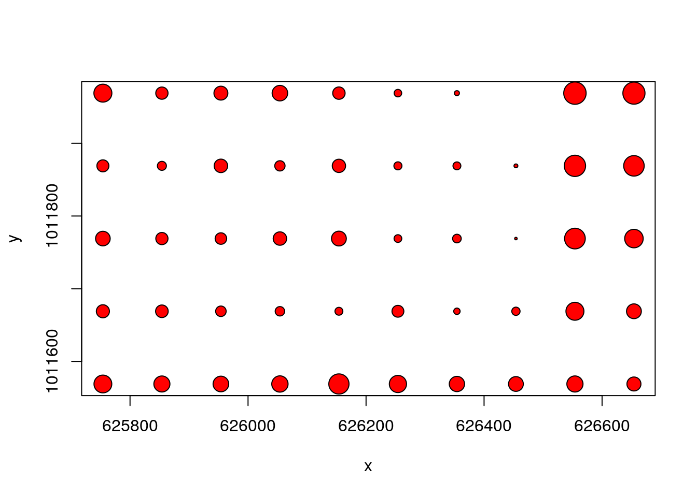
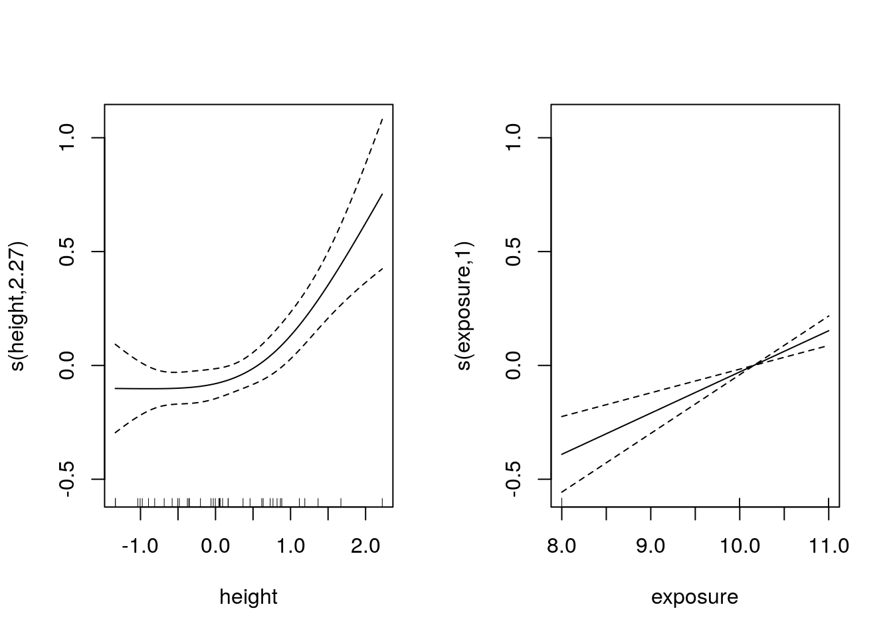
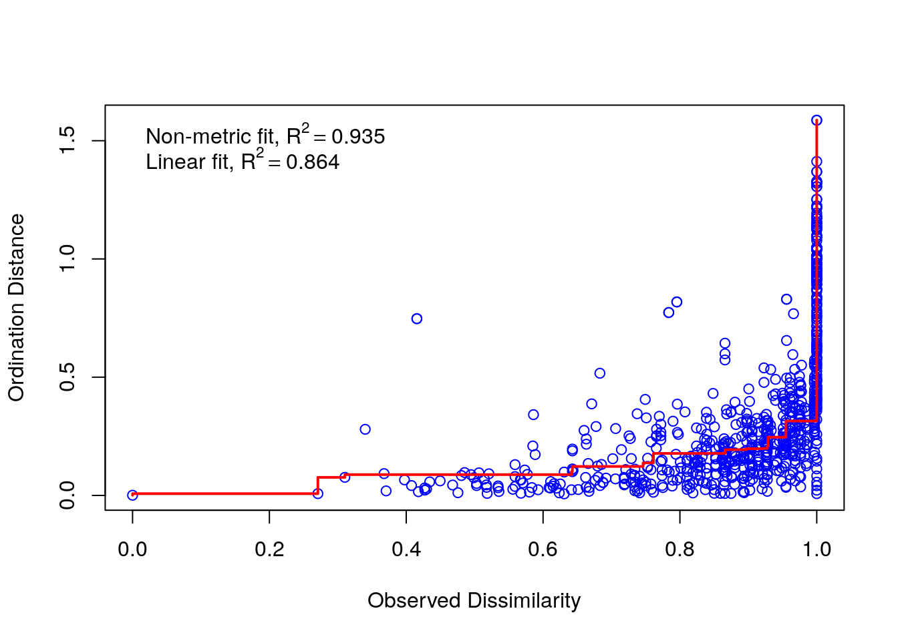
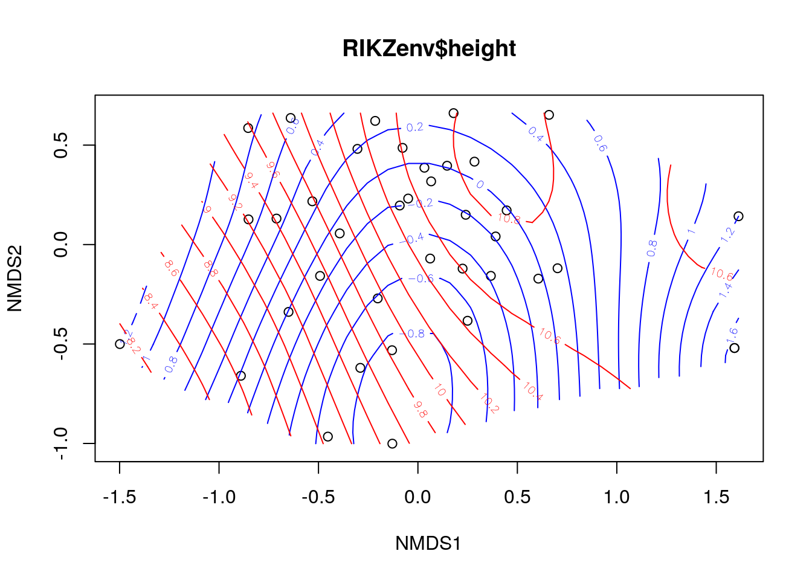
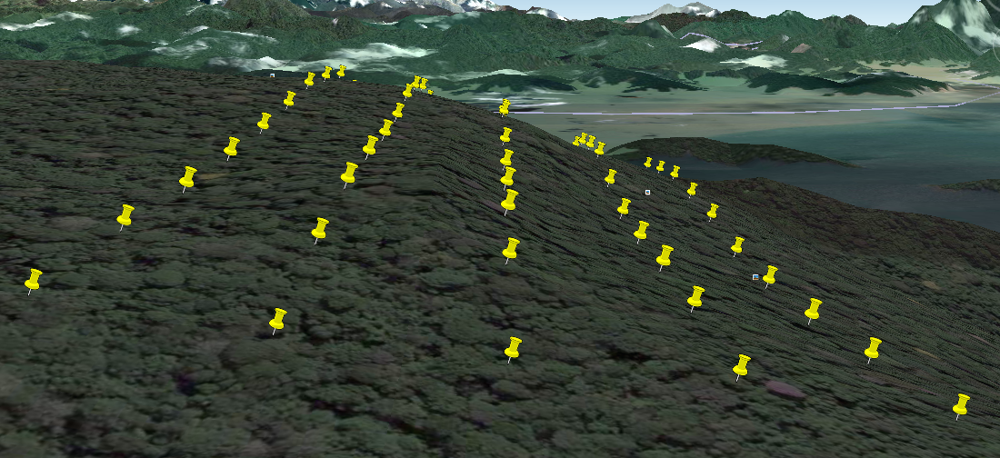
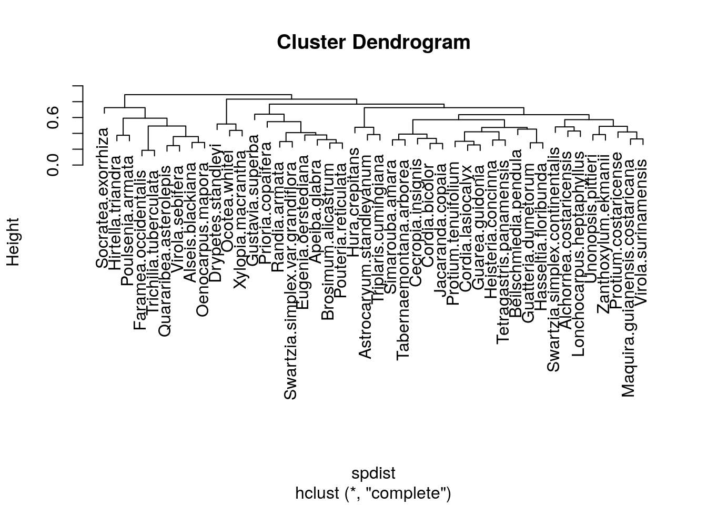
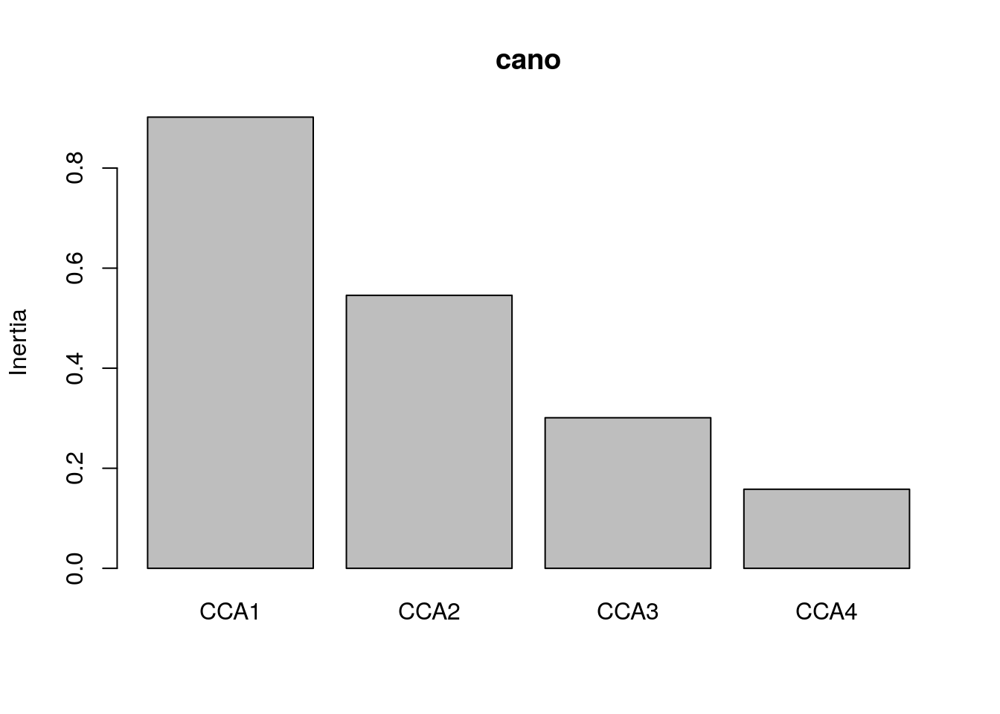

# Analysing patterns in species composition


In many ecological settings multivariate analysis is concerned with looking at gradients of species composition or finding methods to classify sites based on their species composition. 

If you think about the methods that you have seen so far you may "reinvent" one of the earliest methods of analysing species composition. 

You could think about finding the correlation (or rank correlation) between the occurrence of one species and another.

If you do this for all possible pairs then you will obtain a matrix like this


```r
data(BCI)
cmat<-cor(BCI,method="spearman")
```

This is data "overload" for a data set such as the BCI plots. Although you could possibly tease out some relationships from this for a few species that you know well, it is difficult to spot any pattern. A data reduction technique that can be applied to any correlation matrix is principal components analysis.  This could be used if the number of species were small in relation to the number of sites. The technique is often useful when dealing with multi-colinearity of environmental variables. However principal components analysis will not work in a meaningful sense with so many  variables.

Let's try PCA using only the most common species.


```r
selected<-names(sort(apply(BCI,2,sum),dec=T)[1:5])
selected
```

```
## [1] "Faramea.occidentalis"  "Trichilia.tuberculata" "Alseis.blackiana"     
## [4] "Oenocarpus.mapora"     "Poulsenia.armata"
```

```r
BCIcommon<-BCI[,names(BCI)%in%selected]
```


```r
cor(BCIcommon)
```

```
##                       Alseis.blackiana Faramea.occidentalis Oenocarpus.mapora
## Alseis.blackiana             1.0000000           0.30314087       -0.25984312
## Faramea.occidentalis         0.3031409           1.00000000       -0.09437266
## Oenocarpus.mapora           -0.2598431          -0.09437266        1.00000000
## Poulsenia.armata            -0.3643551          -0.64995053       -0.25869865
## Trichilia.tuberculata        0.3747695           0.45599388       -0.28713347
##                       Poulsenia.armata Trichilia.tuberculata
## Alseis.blackiana            -0.3643551             0.3747695
## Faramea.occidentalis        -0.6499505             0.4559939
## Oenocarpus.mapora           -0.2586987            -0.2871335
## Poulsenia.armata             1.0000000            -0.3482301
## Trichilia.tuberculata       -0.3482301             1.0000000
```

```r
Xpairs(BCIcommon)
```


```r
pca<-princomp(BCIcommon,cor=F,scores=T)
plot(pca)
```


```r
summary(pca)
```

```
## Importance of components:
##                           Comp.1     Comp.2     Comp.3     Comp.4     Comp.5
## Standard deviation     23.380136 13.9622989 12.3222552 9.47657946 5.31946450
## Proportion of Variance  0.540407  0.1927262  0.1501092 0.08878306 0.02797453
## Cumulative Proportion   0.540407  0.7331332  0.8832424 0.97202547 1.00000000
```

Let's take this output a step at a time. The scree plot shows how much of the variability is captured by each principal component. If we want to reduce the number of variables effectively we would like to see a steep scree plot. This would show a high degree of muktiple colinearity, which would in this sort of case be useful (the abundance of one species is a good predictor of the abundance of others).

The summary shows how much of the "explainable" variability is captured by each axes.  When we have as many axes as variables the cumulative variance explained will be 1. This does NOT mean that all the variability in the data is captured by five axes, simply that all the explainable variability has been.

If you have variables that are measured on different scales you should either transform them onto a common scale before running PCA or use the version of PCA that takes the correlation matrix. In this case I used cor=FALSE. PCA provides a set of loadings for each variable. If cor=FALSE the loadings correspond to a simple linear equation of the form

$score1=loading1*var1+loading2*var2 .. etc$


```r
loadings(pca)
```

```
## 
## Loadings:
##                       Comp.1 Comp.2 Comp.3 Comp.4 Comp.5
## Alseis.blackiana       0.393  0.514  0.734  0.112  0.173
## Faramea.occidentalis   0.571 -0.358 -0.210  0.674  0.218
## Oenocarpus.mapora            -0.301        -0.384  0.868
## Poulsenia.armata      -0.529  0.496 -0.236  0.510  0.398
## Trichilia.tuberculata  0.488  0.520 -0.595 -0.356  0.102
## 
##                Comp.1 Comp.2 Comp.3 Comp.4 Comp.5
## SS loadings       1.0    1.0    1.0    1.0    1.0
## Proportion Var    0.2    0.2    0.2    0.2    0.2
## Cumulative Var    0.2    0.4    0.6    0.8    1.0
```


```r
normalise<-function(x){
  (max(x)-x)/(max(x)-min(x))
}
normalise(scores(pca)[,1])
```

```
##         1         2         3         4         5         6         7         8 
## 0.7945789 0.5852645 0.6533543 0.5378946 0.8021029 0.7168187 0.5633315 0.5450559 
##         9        10        11        12        13        14        15        16 
## 0.4030080 0.5486166 0.6991813 0.4694122 0.5160359 0.6038255 0.6228736 0.7280851 
##        17        18        19        20        21        22        23        24 
## 0.4224111 0.6011511 0.4608798 0.6949454 0.9023451 0.3527045 0.6629439 0.5952049 
##        25        26        27        28        29        30        31        32 
## 0.5544068 0.7672981 0.5302189 0.3453368 0.3596322 0.3364153 0.6831697 0.2855110 
##        33        34        35        36        37        38        39        40 
## 0.3862426 0.3524696 0.2225161 0.6620093 0.3698350 0.1141841 0.1723414 0.0000000 
##        41        42        43        44        45        46        47        48 
## 0.7207904 0.8027668 0.9235511 0.9514009 1.0000000 0.6266537 0.6623081 0.8261893 
##        49        50 
## 0.9160899 0.9879240
```

The data provided in the vegan package does not include any information
on measured local environmental variability (micro topography, soil, moisture etc). However the position of the plots are provided, as they were placed on a rectangular grid.  If we design a plot to show one of the PCA axes we might pick up a spatial pattern (based only on the five commonest species)


```r
x<- rep(seq(625754, 626654, by=100),each=5)
y<- rep(seq(1011569,  1011969, by=100),len=50) 
coords<-data.frame(x,y)
plot(coords,pch=21,bg=2,cex=3*normalise(scores(pca)[,1]))
```




```r
str(pca)
library(rgl)
spheres3d(pca$scores[,1:3],radius=5,col="red")
rgl.bbox()
```


## Differences between sites


Another way of condensing the sites by species matrix into a simpler form is based on an investigation of total compositional difference. This can be conducted on completely*a priori* grounds. A simple example is when species have been classified into taxonomic or functional groups. The proportional abundance in each group can then form a response variable. An example may be pioneer species and species of mature forest, or soft bodied invertebrates compared to hard bodied invertebrates.

However there is often a need to look at compositional differences that are derived from the data themselves. The starting point for many analyses involves calculating differences (or similarities) between sites. As we have seen, PCA does this, but it assumes linearity and is based on the same assumptions as simple linear regresion, which may not be appropriate in many cases. It is not a suitable method for data sets representing long ecological gradients with high species turnover.

The issue of how best to measure differences between sites is a potentially difficult one. It all depends upon what you mean be a difference.

Let's first take the simplest case in which only presence or absence
of species are considered.

Imagine just two sites. Site one has species A, B, C and D present. But site 2 has species A,B, E, F and G.


```r
library(limma)


Venn1<-function(vec1,vec2,names=c("Site 1","Site 2")){
  d1<-data.frame(id=sitea,abun1=1)
  d2<-data.frame(id=siteb,abun2=1)
	d<-merge(d1,d2,all=T)
	d[is.na(d)]<-0
	g <- cbind(d$abun1, d$abun2)
	vennDiagram(vennCounts(g),names=names)
	t(g)
}


Venn2<-function(g){
	vennDiagram(vennCounts(t(g)))
}
```


```r
#Example
sitea<-c("a","b","c","d")
siteb<-c("a","b","e","f","g")
Venn1(sitea,siteb)
```


```
##      [,1] [,2] [,3] [,4] [,5] [,6] [,7]
## [1,]    1    1    1    1    0    0    0
## [2,]    1    1    0    0    1    1    1
```


One way of measuring the difference (or similarity) between the two sites would therfore be to look at the ratio of the number of shared species (2) against the total number of records made of species presences (4+5). This is known as Sorenson's index. 

$Sorenson=\frac{2c}{A+B}$

Where c= number of shared species, A = number of presence records for site A and B =number of presence records for site B. 

So the difference is 2*2/4+5

This can be extended to count data by simply weighting the values by the number of individuals. The index is then commonly known as the Bray Curtis index.

There are some important issues to be aware of when thinking about differences. What happens if site 1 has species A and B, while site 2 has species A,B,C,D, E and F?


```r
sitea<-c("a","b")
siteb<-c("a","b","c","d","e","f")
Venn1(sitea,siteb)
```


```
##      [,1] [,2] [,3] [,4] [,5] [,6]
## [1,]    1    1    0    0    0    0
## [2,]    1    1    1    1    1    1
```

In one respect the sites could be considered to be identical, as the species in site 1 are just a nested sub set of those in site 2. In another sense they are quite different because species richness is clearly not the same. There are a range of other difference indices available in addition to Sorenson's. These weight such situations in different ways, and can result in quite different outcomes. You
should be aware of this issue if you go on to use these methods in a dissertation. 

You may need to look in more depth at other indices, depending on the questions you wish to adress. For our purposes we will use Sorenson's (Bray-Curtis) dissimilarity as an acceptable measure of differences between sites.

Assuming that we have decided on a way of measuring the difference between
two sites another question then arises. Why would we want to do this at all? If we have fifty sites there are 1225 paired comparisons between them. How can we possibly interpret the results?

A common reason for calculating differences between sites is to look for patterns of change in species composition. This can be achieved in many different ways. 

The BCI data appeared to come from a rather homogeneous area of tropical
forest, with high species diversity. So we might expect that any differences
between sites may be just the result of sampling issues. The plots
simply are not large enough to include all the species. Can we look
at this? 


## Mantel tests

One way to look for a pattern in species composition is to relate differences between sites in species composition to other differences between sites. The simplest measure of a difference between two sites is simply the distance between them. The so called first law of geography (that has been attributed to Tobler) is *Everything is related to everything else, but near things are more related than distant things.* This is generally true, but can we **test** this?

Well first let's extract the Bray Curtis difference between sites in the BCI data.


```r
compdist<-vegdist(BCI)
geodist<-dist(coords,"euclidean")
plot(compdist~geodist)
```


There seems to be a relationship, although there is a lot of noise.
However we can't simply use correlation or regression analysis to
test the significance of the difference because a difference matrix
has a lot of duplicated information. Instead we use a permutation
based procedure called a Mantel test.


```r
mantel(compdist,geodist)
```

```
## 
## Mantel statistic based on Pearson's product-moment correlation 
## 
## Call:
## mantel(xdis = compdist, ydis = geodist) 
## 
## Mantel statistic r: 0.4078 
##       Significance: 0.001 
## 
## Upper quantiles of permutations (null model):
##    90%    95%  97.5%    99% 
## 0.0710 0.0884 0.1074 0.1231 
## Permutation: free
## Number of permutations: 999
```


There is a significant, and quite high, correlation between differences in composition and geographical distance.


## Correlation with environmental variables

The previous example did not use any environmental variables. It only allowed us to conclude that the sites showed some spatial dependence. Mapping the position of sites with similar composition may help to show the pattern. We will come on to that later. How could we use Mantel tests to look at the relationship with environmental variability? One issue is that if we want to use Euclidean distances the environmental variables should be on the same scale. The function bioenv cleverly finds the best subset of environmental variables, so that the Euclidean distances of scaled environmental variables have the maximum (rank) correlation with community dissimilarities. 

The example below uses the RIKZ data discussed by Zuur. You should look carefully at the data and Zuur's example analysis.


```r
RIKZsp<-read.csv("/home/aqm/data/Examples/RIKZsp.csv")
RIKZenv<-read.csv("/home/aqm/data/Examples/RIKZenv.csv")
bioenv(RIKZsp ~., RIKZenv)
```

```
## 
## Call:
## bioenv(formula = RIKZsp ~ ., data = RIKZenv) 
## 
## Subset of environmental variables with best correlation to community data.
## 
## Correlations:    spearman 
## Dissimilarities: bray 
## Metric:          euclidean 
## 
## Best model has 2 parameters (max. 4 allowed):
## height exposure
## with correlation  0.5887359
```

This technique may be particularly useful for screening variables for further work.


## Ordination

One of the goals when analysing a sites by species matrix is to attempt to place sites in some sort of logical order based on their composition. The expectation is that the order of sites will reflect one or more environmental gradients. Therefore the techniques are used in direct and indirect gradient analysis. Indirect gradient analysis attempts to ordinate the sites first, and then explain the results in terms
of environmental gradients. Traditionally the techniques used for this include correspondence analysis and detrended correspondence analysis. These are forms of eigenanalyses that are conducted on the sites by species matrix. One of the issues with these technqies is the so called arch effect. This is an artefect that is removed by detrending. As detrending is a rather ``ad hoc'' procedure some influential authors and editors (particularly Jari Oksanen) recommend multi dimensional scaling instead. So we will look at this first.


## Non-metric multi dimensional scaling NMDS

Difference matrices are hard to understand because of the large number of dimensions. Multidimensional scaling tries to find one or more axes for the data that produce a configuration of the points in such a way that the distances between them are as close as possible to the actual distances in the distance matrix. For non-metric MDS, only the rank order of entries in the data matrix (not the actual dissimilarities) is assumed to contain the key information. So in this case, the distances of the final configuration should as far as possible be in the same rank order as the original data. 


## Single gradient NMDS

A straightforward way of using NMDS is to ask the algorithm to line up the species along one single axis. Some information is lost by doing this, and the technique may introduce some artefacts. However it is then easy to use the variable in other models (such as regression, or GAM's) as a simple measure of change in species composition.


```r
library(mgcv)
nmds<-metaMDS(RIKZsp,k=1)
```

```
## Square root transformation
## Wisconsin double standardization
## Run 0 stress 0.2843762 
## Run 1 stress 0.2837468 
## ... New best solution
## ... Procrustes: rmse 0.04975478  max resid 0.1904147 
## Run 2 stress 0.2641231 
## ... New best solution
## ... Procrustes: rmse 0.1095776  max resid 0.3320365 
## Run 3 stress 0.2736419 
## Run 4 stress 0.2848651 
## Run 5 stress 0.2585569 
## ... New best solution
## ... Procrustes: rmse 0.04905002  max resid 0.228782 
## Run 6 stress 0.2848723 
## Run 7 stress 0.2629673 
## Run 8 stress 0.2549915 
## ... New best solution
## ... Procrustes: rmse 0.02175033  max resid 0.1185243 
## Run 9 stress 0.2628508 
## Run 10 stress 0.2629189 
## Run 11 stress 0.2765355 
## Run 12 stress 0.2891089 
## Run 13 stress 0.2578624 
## Run 14 stress 0.2795548 
## Run 15 stress 0.2719987 
## Run 16 stress 0.2877859 
## Run 17 stress 0.2850045 
## Run 18 stress 0.2831328 
## Run 19 stress 0.2819743 
## Run 20 stress 0.2840513 
## *** No convergence -- monoMDS stopping criteria:
##     20: stress ratio > sratmax
```

```r
grad<-scores(nmds,"sites")
mod<-gam(grad~s(height,k=4)+s(exposure,k=3),data=RIKZenv)
anova(mod)
```

```
## 
## Family: gaussian 
## Link function: identity 
## 
## Formula:
## grad ~ s(height, k = 4) + s(exposure, k = 3)
## 
## Approximate significance of smooth terms:
##              edf Ref.df      F  p-value
## s(height)   2.27   2.65  8.829 0.000216
## s(exposure) 1.00   1.00 22.129 3.56e-05
```

```r
par(mfcol=c(1,2))
plot(mod)
```




The stress of an NMDS is a measure of how close to the true rank order the scaled values are. The lower the stress the better. There is no clear rule governing how much stress is tolerable, but Kruskall advised that ordinations with stress values of over 0.2 are likely to be unreliable. This ordination just falls just above this level.

It can sometimes be useful to look at a Shephard diagram for the ordination. This shows graphically how the stress arises by plotting the distance between the points in ordination space against observed dissimilarity.


```r
stressplot(nmds)
```




## Multiple axis NMDS

The more axes that are used in an NMDS the lower the overall stress. One of the reasons to use several axes is to look at the configuration of the points with respect to environmental variables and attempt to explain the resulting patterns. Understanding the results may require some further thought and work, as it is harder to see patterns in two or more dimensions.


```r
nmds<-metaMDS(RIKZsp,k=2)
```

```
## Square root transformation
## Wisconsin double standardization
## Run 0 stress 0.169786 
## Run 1 stress 0.1710791 
## Run 2 stress 0.2002069 
## Run 3 stress 0.173308 
## Run 4 stress 0.1700876 
## ... Procrustes: rmse 0.008924239  max resid 0.02894342 
## Run 5 stress 0.173412 
## Run 6 stress 0.1749756 
## Run 7 stress 0.1697888 
## ... Procrustes: rmse 0.001114526  max resid 0.002818072 
## ... Similar to previous best
## Run 8 stress 0.1700916 
## ... Procrustes: rmse 0.008992612  max resid 0.02866552 
## Run 9 stress 0.1700971 
## ... Procrustes: rmse 0.01028124  max resid 0.04722189 
## Run 10 stress 0.169786 
## ... New best solution
## ... Procrustes: rmse 0.0002504292  max resid 0.0006553166 
## ... Similar to previous best
## Run 11 stress 0.1697862 
## ... Procrustes: rmse 0.0001865756  max resid 0.0004629947 
## ... Similar to previous best
## Run 12 stress 0.173412 
## Run 13 stress 0.1733055 
## Run 14 stress 0.1998082 
## Run 15 stress 0.1697889 
## ... Procrustes: rmse 0.001335313  max resid 0.003557728 
## ... Similar to previous best
## Run 16 stress 0.1697862 
## ... Procrustes: rmse 0.0002993492  max resid 0.0008210701 
## ... Similar to previous best
## Run 17 stress 0.173305 
## Run 18 stress 0.1950252 
## Run 19 stress 0.1697869 
## ... Procrustes: rmse 0.0004946049  max resid 0.001266879 
## ... Similar to previous best
## Run 20 stress 0.1940953 
## *** Solution reached
```

```r
stressplot(nmds)
```


One way to look at the pattern of dissimilarites in two dimensional space that is produced by NMDS is to plot contours representing the smoothed (using gam) mean values of environmental variables. For example we can plot the NMDS results with contours for height above sea level (blue) and exposure value (red).


```r
ordisurf(nmds,RIKZenv$height,col="blue")
```

```
## 
## Family: gaussian 
## Link function: identity 
## 
## Formula:
## y ~ s(x1, x2, k = 10, bs = "tp", fx = FALSE)
## 
## Estimated degrees of freedom:
## 5.81  total = 6.81 
## 
## REML score: 36.39946
```

```r
ordisurf(nmds,RIKZenv$exposure,col="red",add=T)
```



```
## 
## Family: gaussian 
## Link function: identity 
## 
## Formula:
## y ~ s(x1, x2, k = 10, bs = "tp", fx = FALSE)
## 
## Estimated degrees of freedom:
## 5.08  total = 6.08 
## 
## REML score: 42.63227
```


A more traditional way of looking at this is to assume linearity and show the strength and direction of the linear relationship as vectors on the ordination plot. This may hide the shape of the relationship, but emphasises the size of the linear correlation.


```r
fit <- envfit(nmds~height+exposure, data=RIKZenv, perm = 999)
plot(nmds)
plot(fit)
```


## Clustering

Another way of working with the distance matrix is to attempt to group the data. Looking at the BCI data again.


```r
vdist<-vegdist(BCI)
clus<-hclust(vdist)
plot(clus)
```


There seems to be two main divisions. This may be useful in tracing the spatial pattern that we observed. We can cut the tree to find a grouping variable.


```r
grp<-cutree(clus,2)
plot(coords,pch=21,bg=grp,cex=2)
```


The results may be related to a slight ridge that appears along the middle of the plot. Or it may indicate disturbance of some kind.




## Clam test

The clam function may help in finding which species are specialists within the groups of sites.


```r
clam<-clamtest(BCI, grp==1, alpha=0.005)
##clam
plot(clam)
```


In this case the division is not very convincing. However notice that the group contains comparatively high abundance of *Socratea exorrhiza*, the so called ``walking palm''. This may be indicative of recent disturbance. Thus the technique may have located a past forest opening due perhaps to logging. *Poulsenia armata* is another pioneer species found in this group.


## Simper

Another way of looking at which species are responsible for the grouping is to run a Simper analysis. This provides measures of the contribution of individual species to the overall Bray-Curtis dissimilarity between two sites. If the species are placed in order the analysis helps to find species that discriminate between the groups.


```r
simp<-simper(BCI, grp)
## summary(simp,ordered=T)
```


```r
head(summary(simp,ordered=T)[[1]],15)
```

```
##                            average          sd     ratio       ava       avb
## Faramea.occidentalis   0.028345590 0.017562085 1.6140218 25.419355 48.894737
## Gustavia.superba       0.022816427 0.052073612 0.4381572  5.483871 24.947368
## Poulsenia.armata       0.022236536 0.017492076 1.2712348 21.967742  3.894737
## Trichilia.tuberculata  0.022154916 0.019967568 1.1095450 27.838710 43.052632
## Alseis.blackiana       0.018448477 0.019468124 0.9476248 14.032258 28.842105
## Hirtella.triandra      0.013510798 0.011082365 1.2191259 16.903226  8.263158
## Socratea.exorrhiza     0.011101236 0.013918844 0.7975688  9.677419  2.421053
## Oenocarpus.mapora      0.010109309 0.007309825 1.3829755 16.870968 13.947368
## Quararibea.asterolepis 0.009835408 0.007011586 1.4027364 13.483871 16.105263
## Prioria.copaifera      0.009740702 0.008321527 1.1705427  5.677419  8.894737
## Drypetes.standleyi     0.008327951 0.009723961 0.8564361  7.096774  3.421053
## Guarea.guidonia        0.007609609 0.006879644 1.1061049  6.903226  8.526316
## Virola.sebifera        0.007518728 0.005622919 1.3371575 13.322581 10.736842
## Cordia.bicolor         0.007385838 0.007516220 0.9826532  8.419355  3.368421
## Beilschmiedia.pendula  0.006962698 0.008382180 0.8306548  6.741935  4.473684
##                            cumsum
## Faramea.occidentalis   0.05956732
## Gustavia.superba       0.10751528
## Poulsenia.armata       0.15424462
## Trichilia.tuberculata  0.20080244
## Alseis.blackiana       0.23957130
## Hirtella.triandra      0.26796380
## Socratea.exorrhiza     0.29129268
## Oenocarpus.mapora      0.31253705
## Quararibea.asterolepis 0.33320584
## Prioria.copaifera      0.35367560
## Drypetes.standleyi     0.37117651
## Guarea.guidonia        0.38716785
## Virola.sebifera        0.40296821
## Cordia.bicolor         0.41848930
## Beilschmiedia.pendula  0.43312118
```


## Clustering by species

Species can also be clustered by transposing the matrix. This should cluster species that co-occur in the same sites together. In the case of the large number of species found in the BCI data interpretation is a major task! It is only worth looking at the commonest species.


```r
BCI2<-BCI[,apply(BCI,2,sum)>100]
spdist<-vegdist(t(BCI2))
clus<-hclust(spdist)
plot(clus)
```




## Anosim

Although we may be able to find ways to group sites, we should use a statistical test of some kind in order to establish whether the differences between groups are significant.

If we can divide the data by groups (factors), such as sediment type, we can run an equivalent of a multiple analysis of variance (MANOVA) using the distance matrix as input. This technique is known as Anosim. It is particularly widely used by marine ecologists as a result of early implementation in the software Primer.

Anosim tests whether compositional dissimilarities between groups is greater than those within the groups. Plotting the results in R produces a notched boxplot that can be interpreted in the usual way (if the notches do not overlap then the median dissmilarity is significantly different).

We could use Anosim to test whether there really is a significant difference between the two groups of sites we obtained by cutting the cluster analysis of the BCI data.


```r
aa<-anosim(BCI,as.factor(grp))
aa
```

```
## 
## Call:
## anosim(x = BCI, grouping = as.factor(grp)) 
## Dissimilarity: bray 
## 
## ANOSIM statistic R: 0.2698 
##       Significance: 0.001 
## 
## Permutation: free
## Number of permutations: 999
```

```r
plot(aa)
```


## Adonis

Using Adonis is rather like fitting a multiple linear models to all the species in the matrix. It is also based on permutation tests and partitions the sums of squares of a multivariate data set in an analogous to MANOVA (multivariate analysis of variance). The inputs are linear predictors with the response being a matrix of more than two columns. 

Adonis tends to be very (too) powerful. In other words it will show significant relationships where other methods fail. This is because it only really needs one of the multiple species in the data set to have a strong relationship for the method to produce significance. Whether you can intepret the results easily is another matter.


```r
mod<-adonis(RIKZsp~.,data=RIKZenv)
mod
```

```
## 
## Call:
## adonis(formula = RIKZsp ~ ., data = RIKZenv) 
## 
## Permutation: free
## Number of permutations: 999
## 
## Terms added sequentially (first to last)
## 
##           Df SumsOfSqs MeanSqs F.Model      R2 Pr(>F)    
## salinity   1    0.8701 0.87013  2.8108 0.06384  0.001 ***
## height     1    1.2030 1.20299  3.8861 0.08826  0.001 ***
## grain      1    0.6368 0.63676  2.0570 0.04672  0.009 ** 
## exposure   1    0.7044 0.70441  2.2755 0.05168  0.005 ** 
## Residuals 33   10.2156 0.30956         0.74950           
## Total     37   13.6299                 1.00000           
## ---
## Signif. codes:  0 '***' 0.001 '**' 0.01 '*' 0.05 '.' 0.1 ' ' 1
```


Asking for coefficents will produce a long list of the coefficents for each species (not shown).


```r
#coefficents(mod)
```


```r
library(rgdal)
```

```
## Loading required package: sp
```

```
## rgdal: version: 1.4-3, (SVN revision 828)
##  Geospatial Data Abstraction Library extensions to R successfully loaded
##  Loaded GDAL runtime: GDAL 2.1.2, released 2016/10/24
##  Path to GDAL shared files: /usr/share/gdal/2.1
##  GDAL binary built with GEOS: TRUE 
##  Loaded PROJ.4 runtime: Rel. 4.9.3, 15 August 2016, [PJ_VERSION: 493]
##  Path to PROJ.4 shared files: (autodetected)
##  Linking to sp version: 1.3-1
```

```r
dd<-data.frame(coords,grp)
coordinates(dd)<-~x+y
```


## Canonical Correspondence Analysis

Canonical correspondence analysis is a rather complex technique that combines ordination with regression in one algorithm. The technique ordinates sites and species along axes that are constrained to be linear combinations of environmental variables. For this reason the proximity of sites on a bi-plot may not reflect similarity in species composition as well as NMDS. 

A screeplot shows the eigenvalues for each axis. The total ``inertia''
o  the ordination is the sum of all the eigenvalues, not just those shown on the screeplot. In order to 


```r
cano<-cca(RIKZsp~.,data=RIKZenv)
screeplot(cano)
```




The technique can be used instead of Adonis in order to look at which species-environment relationships are most important. One way to do this is to treat the model rather like a multiple regression.

In R the AIC is calculated for the model. Thus backwards stepwise methods can be used to drop variables from the model. Burnham and Anderson type approaches could also be used for model selection, although there is no package in R that automates this.


```r
cano<-step(cano)
```

```
## Start:  AIC=251.79
## RIKZsp ~ salinity + height + grain + exposure
## 
##            Df    AIC
## - grain     1 250.94
## - salinity  1 250.96
## <none>        251.79
## - exposure  1 252.38
## - height    1 252.83
## 
## Step:  AIC=250.94
## RIKZsp ~ salinity + height + exposure
## 
##            Df    AIC
## - salinity  1 250.63
## <none>        250.94
## - exposure  1 251.68
## - height    1 251.91
## 
## Step:  AIC=250.64
## RIKZsp ~ height + exposure
## 
##            Df    AIC
## <none>        250.63
## - height    1 251.53
## - exposure  1 252.72
```

```r
cano
```

```
## Call: cca(formula = RIKZsp ~ height + exposure, data = RIKZenv)
## 
##               Inertia Proportion Rank
## Total           8.126      1.000     
## Constrained     1.422      0.175    2
## Unconstrained   6.704      0.825   32
## Inertia is scaled Chi-square 
## 
## Eigenvalues for constrained axes:
##   CCA1   CCA2 
## 0.9006 0.5217 
## 
## Eigenvalues for unconstrained axes:
##    CA1    CA2    CA3    CA4    CA5    CA6    CA7    CA8 
## 0.7666 0.7621 0.6101 0.5545 0.5121 0.4519 0.4474 0.4267 
## (Showing 8 of 32 unconstrained eigenvalues)
```


After deciding on the model we can get a measure of the variance explained by looking at the proportion of the inertia that is attributed to the constrained axis. In this case it is 17.5\%.

Notice that because the axes are constrained to be **linear** combinations of environmental variables, they will tend to show clear orthogonality. In the case of the RIKZ data we have already seen that the relationship with height above sea level is not truly linear, thus the CCA has introduced some distortion.


```r
ordisurf(cano,RIKZenv$height,col="blue")
```

```
## 
## Family: gaussian 
## Link function: identity 
## 
## Formula:
## y ~ s(x1, x2, k = 10, bs = "tp", fx = FALSE)
## 
## Estimated degrees of freedom:
## 1.98  total = 2.98 
## 
## REML score: 29.72099
```

```r
ordisurf(cano,RIKZenv$exposure,col="red",add=T)
```


```
## 
## Family: gaussian 
## Link function: identity 
## 
## Formula:
## y ~ s(x1, x2, k = 10, bs = "tp", fx = FALSE)
## 
## Estimated degrees of freedom:
## 1.99  total = 2.99 
## 
## REML score: 27.47425
```

The ordiplot function can be used to produce a dynamic biplot which allows labelling of species or sites. This avoids clutter.


```r
fig <- ordiplot(cano)
identify(fig, "spec") 
```


