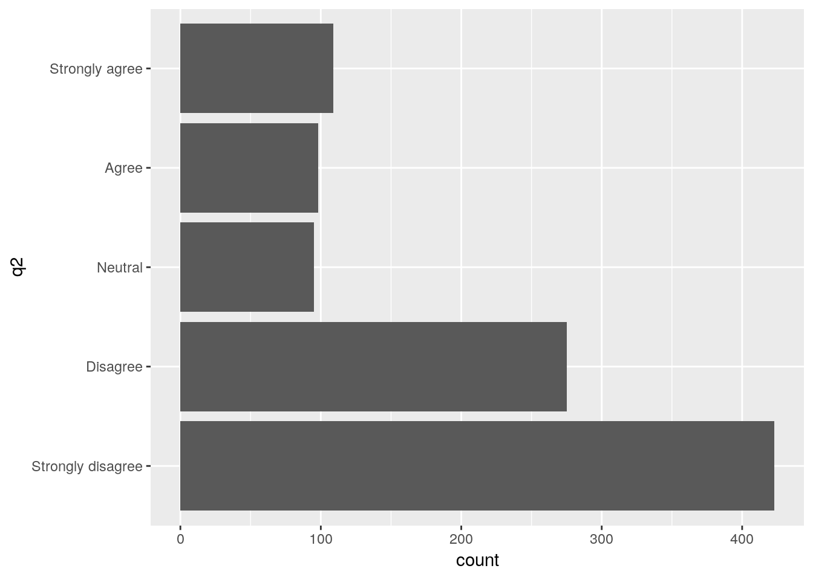

# Simulating and analysing data from questionnaires


## Introduction

The Likert scale is very commonly chosen for measuring the degree of agreement with statements in questionnaires. We can use the example of Likert scale data to look at a range of technical aspects regarding the way data is handled in R. The data collected from questionnaires is best handled using the approach used in relational data bases. At least three linked tables are usually needed.  
Likert data can be analysed using a range of multivariate analyses. In this example we will look at latent factor analysis which is closely related to principal components analysis.

### Packages used


```r
## Load the packages
library(dplyr)
library(aqm)
library(ggplot2)
library(tidyr)
library(MASS)
library(psych)
```


## Simulating a single vector of Likert data

To simulate responses from the Likert scale with known expected proportions we can write a function that takes the number of simulated responses required and a vector of proportion responding in each class. The following chunk builds a function that will by default return 1000 responses, which in this case will tend to be positive.


```r
rand_likert<-function(n=1000, p=c(1,2,3,5,10))
{
  ## Form a vector of responses
  lscale<-c("Strongly disagree","Disagree","Neutral","Agree","Strongly agree")
  ## Sample 1000 times with replacement and unequal probability
  lik<-sample(lscale,n,replace=TRUE,prob=p)
  ## Turn the response into an ordered factor
  lik<-factor(lik,lscale,ordered=TRUE) 
  lik
}
```

Notice that the function works in the following way ..

1. The "lscale" object is a vector of categorical responses.
2. The second command samples responses from this vector with a probability given by the numbers in a second vector. If this is not provided then all the values have an equal probability of being chosen. So we can simulate responses that tend to be positive by providing a vector with high values on the right hand side (as in the default for the function)
3. The result of sampling is a character vector. We can form the character vector into an ordered factor by providing a list of values in order. The lscale vector is such a list, so the function returned an ordered factor.

The function has been included in the aqm package on the server.


```r
# If working offf the server the aqm package can be installed by running
# devtools::install_github("dgolicher/aqm")
```


### Character vectors and factors

The example provides another opportunity to explain the difference between character vectors and factors. The function returns an ordered factor


```r
q1<-rand_likert(100)
str(q1)
```

```
##  Ord.factor w/ 5 levels "Strongly disagree"<..: 5 5 4 2 5 2 2 4 4 5 ...
```

The vector actually consists of numerical values between 1 and 5 with the factor levels as labels. 
If we coerce the factor to a character vector then the vector will just contains text. 


```r
q1<-as.character(q1)
str(q1)
```

```
##  chr [1:100] "Strongly agree" "Strongly agree" "Agree" "Disagree" ...
```

It is important to be aware that if data held in the form of text is read into R from a data file using read.csv then R will silently coerce the character vector to a factor. This behaviour differs from that of the read_csv function in the readr package which keeps the data as a character vector unless other instructions are provided.

Notice that when we coerce a character vector for Likert scale text into a factor it will **not** automatically be in the order we would like. The default order will simply be the alphabetical order.


```r
q1<-as.factor(q1)
str(q1)
```

```
##  Factor w/ 5 levels "Agree","Disagree",..: 4 4 1 2 4 2 2 1 1 4 ...
```

```r
levels(q1)
```

```
## [1] "Agree"             "Disagree"          "Neutral"          
## [4] "Strongly agree"    "Strongly disagree"
```

This is not what we want for analysis, as the factor is not in the right order.

To produce an ordered factor we need to look at the levels of the factor which are produced by default and then place them in a more logical order. This step requires a little care, as there is the possibility for errors if  text has not been used consistently when scoring the results.


```r
q1<-factor(q1,levels(q1)[c(5,2,3,1,4)],ordered=TRUE) 
str(q1)
```

```
##  Ord.factor w/ 5 levels "Strongly disagree"<..: 5 5 4 2 5 2 2 4 4 5 ...
```


## Numerical vectors to Likert vectors

When collecting the real life data and capturing it in a spreadsheet the Likert scale may often be scored as numbers on a scale of 1 to 5. When the data is read into R the numbers will appear as integers. This can be changed 


```r
num_to_likert<-function(x){
  lscale<-c("Strongly disagree","Disagree","Neutral","Agree","Strongly agree")
  lik<-factor(x,1:5,ordered=TRUE)
  levels(lik)<-lscale
  lik
}
x<-sample(1:5, 10,replace=TRUE)
x
```

```
##  [1] 4 2 2 5 4 2 1 3 5 3
```

```r
num_to_likert(x)
```

```
##  [1] Agree             Disagree          Disagree          Strongly agree   
##  [5] Agree             Disagree          Strongly disagree Neutral          
##  [9] Strongly agree    Neutral          
## 5 Levels: Strongly disagree < Disagree < Neutral < ... < Strongly agree
```

The function can be applied to all the columns of a data frame read into R by using the mutate_all function in dplyr.

Notice that the inverse operation is very easy. Just coerce the vector to numeric.


```r
as.numeric(x)
```

```
##  [1] 4 2 2 5 4 2 1 3 5 3
```


### Forming a data frame

Let's now simulate the responses of one thousand people to four questions. Notice that the first question takes the default vector of probabilities. The second question provokes more negative responses. The third question is more neutral and the final question has a "marmite" type response.


```r
q1<-rand_likert()
q2<-rand_likert(p=c(4,3,1,1,1))
q3<-rand_likert(p=c(1,2,5,2,1))
q4<-rand_likert(p=c(5,1,1,1,4))
q5<- beta_likert(n=1000) ## Using the beta_likert explained later in the text
d<-data.frame(id=1:1000,q1,q2,q3,q4,q5)
```


Looking at the raw data..


```r
dt(d)
```

<!--html_preserve--><div id="htmlwidget-8da163afad5b225d7564" style="width:100%;height:auto;" class="datatables html-widget"></div>
<script type="application/json" data-for="htmlwidget-8da163afad5b225d7564">{"x":{"filter":"top","filterHTML":"<tr>\n  <td><\/td>\n  <td data-type=\"integer\" style=\"vertical-align: top;\">\n    <div class=\"form-group has-feedback\" style=\"margin-bottom: auto;\">\n      <input type=\"search\" placeholder=\"All\" class=\"form-control\" style=\"width: 100%;\"/>\n      <span class=\"glyphicon glyphicon-remove-circle form-control-feedback\"><\/span>\n    <\/div>\n    <div style=\"display: none; position: absolute; width: 200px;\">\n      <div data-min=\"1\" data-max=\"1000\"><\/div>\n      <span style=\"float: left;\"><\/span>\n      <span style=\"float: right;\"><\/span>\n    <\/div>\n  <\/td>\n  <td data-type=\"factor\" style=\"vertical-align: top;\">\n    <div class=\"form-group has-feedback\" style=\"margin-bottom: auto;\">\n      <input type=\"search\" placeholder=\"All\" class=\"form-control\" style=\"width: 100%;\"/>\n      <span class=\"glyphicon glyphicon-remove-circle form-control-feedback\"><\/span>\n    <\/div>\n    <div style=\"width: 100%; display: none;\">\n      <select multiple=\"multiple\" style=\"width: 100%;\" data-options=\"[&quot;Strongly disagree&quot;,&quot;Disagree&quot;,&quot;Neutral&quot;,&quot;Agree&quot;,&quot;Strongly agree&quot;]\"><\/select>\n    <\/div>\n  <\/td>\n  <td data-type=\"factor\" style=\"vertical-align: top;\">\n    <div class=\"form-group has-feedback\" style=\"margin-bottom: auto;\">\n      <input type=\"search\" placeholder=\"All\" class=\"form-control\" style=\"width: 100%;\"/>\n      <span class=\"glyphicon glyphicon-remove-circle form-control-feedback\"><\/span>\n    <\/div>\n    <div style=\"width: 100%; display: none;\">\n      <select multiple=\"multiple\" style=\"width: 100%;\" data-options=\"[&quot;Strongly disagree&quot;,&quot;Disagree&quot;,&quot;Neutral&quot;,&quot;Agree&quot;,&quot;Strongly agree&quot;]\"><\/select>\n    <\/div>\n  <\/td>\n  <td data-type=\"factor\" style=\"vertical-align: top;\">\n    <div class=\"form-group has-feedback\" style=\"margin-bottom: auto;\">\n      <input type=\"search\" placeholder=\"All\" class=\"form-control\" style=\"width: 100%;\"/>\n      <span class=\"glyphicon glyphicon-remove-circle form-control-feedback\"><\/span>\n    <\/div>\n    <div style=\"width: 100%; display: none;\">\n      <select multiple=\"multiple\" style=\"width: 100%;\" data-options=\"[&quot;Strongly disagree&quot;,&quot;Disagree&quot;,&quot;Neutral&quot;,&quot;Agree&quot;,&quot;Strongly agree&quot;]\"><\/select>\n    <\/div>\n  <\/td>\n  <td data-type=\"factor\" style=\"vertical-align: top;\">\n    <div class=\"form-group has-feedback\" style=\"margin-bottom: auto;\">\n      <input type=\"search\" placeholder=\"All\" class=\"form-control\" style=\"width: 100%;\"/>\n      <span class=\"glyphicon glyphicon-remove-circle form-control-feedback\"><\/span>\n    <\/div>\n    <div style=\"width: 100%; display: none;\">\n      <select multiple=\"multiple\" style=\"width: 100%;\" data-options=\"[&quot;Strongly disagree&quot;,&quot;Disagree&quot;,&quot;Neutral&quot;,&quot;Agree&quot;,&quot;Strongly agree&quot;]\"><\/select>\n    <\/div>\n  <\/td>\n  <td data-type=\"factor\" style=\"vertical-align: top;\">\n    <div class=\"form-group has-feedback\" style=\"margin-bottom: auto;\">\n      <input type=\"search\" placeholder=\"All\" class=\"form-control\" style=\"width: 100%;\"/>\n      <span class=\"glyphicon glyphicon-remove-circle form-control-feedback\"><\/span>\n    <\/div>\n    <div style=\"width: 100%; display: none;\">\n      <select multiple=\"multiple\" style=\"width: 100%;\" data-options=\"[&quot;Strongly disagree&quot;,&quot;Disagree&quot;,&quot;Neutral&quot;,&quot;Agree&quot;,&quot;Strongly agree&quot;]\"><\/select>\n    <\/div>\n  <\/td>\n<\/tr>","extensions":["Buttons"],"data":[["1","2","3","4","5","6","7","8","9","10","11","12","13","14","15","16","17","18","19","20","21","22","23","24","25","26","27","28","29","30","31","32","33","34","35","36","37","38","39","40","41","42","43","44","45","46","47","48","49","50","51","52","53","54","55","56","57","58","59","60","61","62","63","64","65","66","67","68","69","70","71","72","73","74","75","76","77","78","79","80","81","82","83","84","85","86","87","88","89","90","91","92","93","94","95","96","97","98","99","100","101","102","103","104","105","106","107","108","109","110","111","112","113","114","115","116","117","118","119","120","121","122","123","124","125","126","127","128","129","130","131","132","133","134","135","136","137","138","139","140","141","142","143","144","145","146","147","148","149","150","151","152","153","154","155","156","157","158","159","160","161","162","163","164","165","166","167","168","169","170","171","172","173","174","175","176","177","178","179","180","181","182","183","184","185","186","187","188","189","190","191","192","193","194","195","196","197","198","199","200","201","202","203","204","205","206","207","208","209","210","211","212","213","214","215","216","217","218","219","220","221","222","223","224","225","226","227","228","229","230","231","232","233","234","235","236","237","238","239","240","241","242","243","244","245","246","247","248","249","250","251","252","253","254","255","256","257","258","259","260","261","262","263","264","265","266","267","268","269","270","271","272","273","274","275","276","277","278","279","280","281","282","283","284","285","286","287","288","289","290","291","292","293","294","295","296","297","298","299","300","301","302","303","304","305","306","307","308","309","310","311","312","313","314","315","316","317","318","319","320","321","322","323","324","325","326","327","328","329","330","331","332","333","334","335","336","337","338","339","340","341","342","343","344","345","346","347","348","349","350","351","352","353","354","355","356","357","358","359","360","361","362","363","364","365","366","367","368","369","370","371","372","373","374","375","376","377","378","379","380","381","382","383","384","385","386","387","388","389","390","391","392","393","394","395","396","397","398","399","400","401","402","403","404","405","406","407","408","409","410","411","412","413","414","415","416","417","418","419","420","421","422","423","424","425","426","427","428","429","430","431","432","433","434","435","436","437","438","439","440","441","442","443","444","445","446","447","448","449","450","451","452","453","454","455","456","457","458","459","460","461","462","463","464","465","466","467","468","469","470","471","472","473","474","475","476","477","478","479","480","481","482","483","484","485","486","487","488","489","490","491","492","493","494","495","496","497","498","499","500","501","502","503","504","505","506","507","508","509","510","511","512","513","514","515","516","517","518","519","520","521","522","523","524","525","526","527","528","529","530","531","532","533","534","535","536","537","538","539","540","541","542","543","544","545","546","547","548","549","550","551","552","553","554","555","556","557","558","559","560","561","562","563","564","565","566","567","568","569","570","571","572","573","574","575","576","577","578","579","580","581","582","583","584","585","586","587","588","589","590","591","592","593","594","595","596","597","598","599","600","601","602","603","604","605","606","607","608","609","610","611","612","613","614","615","616","617","618","619","620","621","622","623","624","625","626","627","628","629","630","631","632","633","634","635","636","637","638","639","640","641","642","643","644","645","646","647","648","649","650","651","652","653","654","655","656","657","658","659","660","661","662","663","664","665","666","667","668","669","670","671","672","673","674","675","676","677","678","679","680","681","682","683","684","685","686","687","688","689","690","691","692","693","694","695","696","697","698","699","700","701","702","703","704","705","706","707","708","709","710","711","712","713","714","715","716","717","718","719","720","721","722","723","724","725","726","727","728","729","730","731","732","733","734","735","736","737","738","739","740","741","742","743","744","745","746","747","748","749","750","751","752","753","754","755","756","757","758","759","760","761","762","763","764","765","766","767","768","769","770","771","772","773","774","775","776","777","778","779","780","781","782","783","784","785","786","787","788","789","790","791","792","793","794","795","796","797","798","799","800","801","802","803","804","805","806","807","808","809","810","811","812","813","814","815","816","817","818","819","820","821","822","823","824","825","826","827","828","829","830","831","832","833","834","835","836","837","838","839","840","841","842","843","844","845","846","847","848","849","850","851","852","853","854","855","856","857","858","859","860","861","862","863","864","865","866","867","868","869","870","871","872","873","874","875","876","877","878","879","880","881","882","883","884","885","886","887","888","889","890","891","892","893","894","895","896","897","898","899","900","901","902","903","904","905","906","907","908","909","910","911","912","913","914","915","916","917","918","919","920","921","922","923","924","925","926","927","928","929","930","931","932","933","934","935","936","937","938","939","940","941","942","943","944","945","946","947","948","949","950","951","952","953","954","955","956","957","958","959","960","961","962","963","964","965","966","967","968","969","970","971","972","973","974","975","976","977","978","979","980","981","982","983","984","985","986","987","988","989","990","991","992","993","994","995","996","997","998","999","1000"],[1,2,3,4,5,6,7,8,9,10,11,12,13,14,15,16,17,18,19,20,21,22,23,24,25,26,27,28,29,30,31,32,33,34,35,36,37,38,39,40,41,42,43,44,45,46,47,48,49,50,51,52,53,54,55,56,57,58,59,60,61,62,63,64,65,66,67,68,69,70,71,72,73,74,75,76,77,78,79,80,81,82,83,84,85,86,87,88,89,90,91,92,93,94,95,96,97,98,99,100,101,102,103,104,105,106,107,108,109,110,111,112,113,114,115,116,117,118,119,120,121,122,123,124,125,126,127,128,129,130,131,132,133,134,135,136,137,138,139,140,141,142,143,144,145,146,147,148,149,150,151,152,153,154,155,156,157,158,159,160,161,162,163,164,165,166,167,168,169,170,171,172,173,174,175,176,177,178,179,180,181,182,183,184,185,186,187,188,189,190,191,192,193,194,195,196,197,198,199,200,201,202,203,204,205,206,207,208,209,210,211,212,213,214,215,216,217,218,219,220,221,222,223,224,225,226,227,228,229,230,231,232,233,234,235,236,237,238,239,240,241,242,243,244,245,246,247,248,249,250,251,252,253,254,255,256,257,258,259,260,261,262,263,264,265,266,267,268,269,270,271,272,273,274,275,276,277,278,279,280,281,282,283,284,285,286,287,288,289,290,291,292,293,294,295,296,297,298,299,300,301,302,303,304,305,306,307,308,309,310,311,312,313,314,315,316,317,318,319,320,321,322,323,324,325,326,327,328,329,330,331,332,333,334,335,336,337,338,339,340,341,342,343,344,345,346,347,348,349,350,351,352,353,354,355,356,357,358,359,360,361,362,363,364,365,366,367,368,369,370,371,372,373,374,375,376,377,378,379,380,381,382,383,384,385,386,387,388,389,390,391,392,393,394,395,396,397,398,399,400,401,402,403,404,405,406,407,408,409,410,411,412,413,414,415,416,417,418,419,420,421,422,423,424,425,426,427,428,429,430,431,432,433,434,435,436,437,438,439,440,441,442,443,444,445,446,447,448,449,450,451,452,453,454,455,456,457,458,459,460,461,462,463,464,465,466,467,468,469,470,471,472,473,474,475,476,477,478,479,480,481,482,483,484,485,486,487,488,489,490,491,492,493,494,495,496,497,498,499,500,501,502,503,504,505,506,507,508,509,510,511,512,513,514,515,516,517,518,519,520,521,522,523,524,525,526,527,528,529,530,531,532,533,534,535,536,537,538,539,540,541,542,543,544,545,546,547,548,549,550,551,552,553,554,555,556,557,558,559,560,561,562,563,564,565,566,567,568,569,570,571,572,573,574,575,576,577,578,579,580,581,582,583,584,585,586,587,588,589,590,591,592,593,594,595,596,597,598,599,600,601,602,603,604,605,606,607,608,609,610,611,612,613,614,615,616,617,618,619,620,621,622,623,624,625,626,627,628,629,630,631,632,633,634,635,636,637,638,639,640,641,642,643,644,645,646,647,648,649,650,651,652,653,654,655,656,657,658,659,660,661,662,663,664,665,666,667,668,669,670,671,672,673,674,675,676,677,678,679,680,681,682,683,684,685,686,687,688,689,690,691,692,693,694,695,696,697,698,699,700,701,702,703,704,705,706,707,708,709,710,711,712,713,714,715,716,717,718,719,720,721,722,723,724,725,726,727,728,729,730,731,732,733,734,735,736,737,738,739,740,741,742,743,744,745,746,747,748,749,750,751,752,753,754,755,756,757,758,759,760,761,762,763,764,765,766,767,768,769,770,771,772,773,774,775,776,777,778,779,780,781,782,783,784,785,786,787,788,789,790,791,792,793,794,795,796,797,798,799,800,801,802,803,804,805,806,807,808,809,810,811,812,813,814,815,816,817,818,819,820,821,822,823,824,825,826,827,828,829,830,831,832,833,834,835,836,837,838,839,840,841,842,843,844,845,846,847,848,849,850,851,852,853,854,855,856,857,858,859,860,861,862,863,864,865,866,867,868,869,870,871,872,873,874,875,876,877,878,879,880,881,882,883,884,885,886,887,888,889,890,891,892,893,894,895,896,897,898,899,900,901,902,903,904,905,906,907,908,909,910,911,912,913,914,915,916,917,918,919,920,921,922,923,924,925,926,927,928,929,930,931,932,933,934,935,936,937,938,939,940,941,942,943,944,945,946,947,948,949,950,951,952,953,954,955,956,957,958,959,960,961,962,963,964,965,966,967,968,969,970,971,972,973,974,975,976,977,978,979,980,981,982,983,984,985,986,987,988,989,990,991,992,993,994,995,996,997,998,999,1000],["Strongly disagree","Neutral","Strongly agree","Strongly agree","Strongly agree","Strongly agree","Neutral","Strongly agree","Strongly agree","Agree","Strongly disagree","Agree","Agree","Strongly agree","Neutral","Strongly agree","Agree","Strongly agree","Strongly agree","Agree","Agree","Strongly agree","Strongly agree","Agree","Disagree","Agree","Agree","Agree","Strongly disagree","Agree","Agree","Agree","Strongly agree","Strongly agree","Neutral","Strongly agree","Strongly agree","Neutral","Strongly agree","Disagree","Agree","Agree","Strongly agree","Strongly agree","Agree","Strongly agree","Agree","Strongly agree","Strongly agree","Strongly agree","Strongly agree","Disagree","Strongly agree","Neutral","Disagree","Strongly agree","Strongly agree","Strongly agree","Neutral","Strongly agree","Agree","Neutral","Neutral","Strongly agree","Strongly agree","Disagree","Agree","Neutral","Agree","Disagree","Strongly agree","Strongly agree","Disagree","Agree","Disagree","Strongly agree","Neutral","Neutral","Disagree","Agree","Agree","Strongly agree","Strongly agree","Disagree","Strongly agree","Agree","Strongly agree","Neutral","Strongly agree","Neutral","Strongly agree","Strongly agree","Agree","Strongly agree","Strongly agree","Agree","Agree","Strongly agree","Strongly agree","Neutral","Strongly disagree","Strongly agree","Neutral","Disagree","Neutral","Strongly agree","Agree","Strongly disagree","Strongly disagree","Strongly agree","Strongly agree","Strongly agree","Strongly agree","Agree","Disagree","Agree","Strongly agree","Strongly agree","Strongly agree","Neutral","Strongly agree","Strongly agree","Strongly agree","Agree","Strongly agree","Agree","Agree","Agree","Strongly agree","Strongly agree","Strongly agree","Agree","Disagree","Strongly agree","Strongly agree","Strongly agree","Strongly agree","Strongly agree","Strongly agree","Disagree","Neutral","Disagree","Strongly agree","Agree","Agree","Strongly agree","Strongly agree","Agree","Strongly agree","Disagree","Agree","Strongly agree","Strongly agree","Neutral","Agree","Strongly agree","Strongly agree","Neutral","Agree","Strongly agree","Strongly agree","Strongly agree","Strongly agree","Strongly agree","Strongly agree","Strongly agree","Strongly agree","Strongly agree","Agree","Neutral","Strongly agree","Agree","Disagree","Strongly agree","Strongly agree","Strongly agree","Strongly agree","Strongly agree","Strongly agree","Strongly agree","Strongly agree","Strongly agree","Strongly disagree","Strongly agree","Agree","Agree","Strongly agree","Strongly agree","Strongly agree","Disagree","Agree","Strongly agree","Agree","Strongly agree","Strongly agree","Strongly disagree","Strongly agree","Neutral","Strongly agree","Strongly agree","Strongly agree","Strongly agree","Neutral","Neutral","Strongly agree","Agree","Strongly agree","Strongly agree","Strongly disagree","Agree","Agree","Strongly agree","Strongly agree","Strongly disagree","Neutral","Strongly disagree","Neutral","Neutral","Strongly agree","Neutral","Strongly disagree","Strongly agree","Strongly agree","Neutral","Strongly agree","Strongly agree","Strongly agree","Strongly agree","Agree","Strongly disagree","Strongly disagree","Strongly agree","Agree","Strongly agree","Agree","Strongly agree","Strongly agree","Strongly agree","Strongly agree","Neutral","Agree","Strongly agree","Neutral","Strongly agree","Strongly disagree","Strongly agree","Neutral","Strongly agree","Disagree","Strongly agree","Strongly agree","Strongly agree","Neutral","Strongly agree","Agree","Neutral","Strongly agree","Agree","Agree","Strongly agree","Strongly agree","Agree","Disagree","Strongly agree","Strongly agree","Strongly agree","Strongly agree","Disagree","Strongly agree","Agree","Strongly agree","Agree","Agree","Strongly disagree","Strongly agree","Strongly agree","Neutral","Neutral","Strongly agree","Strongly disagree","Strongly agree","Strongly agree","Disagree","Agree","Strongly agree","Strongly agree","Agree","Strongly agree","Strongly agree","Strongly agree","Agree","Strongly agree","Strongly disagree","Disagree","Disagree","Neutral","Strongly agree","Neutral","Strongly agree","Disagree","Strongly disagree","Strongly agree","Neutral","Neutral","Agree","Strongly agree","Agree","Strongly agree","Agree","Neutral","Strongly agree","Agree","Agree","Strongly agree","Strongly agree","Strongly agree","Strongly agree","Disagree","Neutral","Disagree","Disagree","Strongly agree","Strongly agree","Agree","Strongly agree","Neutral","Neutral","Strongly agree","Agree","Disagree","Strongly agree","Strongly agree","Agree","Agree","Strongly agree","Strongly agree","Strongly agree","Disagree","Strongly agree","Strongly agree","Strongly disagree","Strongly agree","Strongly agree","Strongly agree","Strongly agree","Agree","Agree","Strongly disagree","Agree","Strongly agree","Strongly agree","Strongly agree","Strongly agree","Strongly agree","Strongly agree","Disagree","Neutral","Strongly agree","Strongly agree","Agree","Strongly agree","Strongly disagree","Agree","Strongly agree","Strongly agree","Strongly agree","Disagree","Strongly agree","Agree","Agree","Neutral","Strongly agree","Neutral","Disagree","Agree","Agree","Strongly agree","Strongly agree","Disagree","Strongly agree","Strongly agree","Disagree","Strongly agree","Strongly agree","Strongly agree","Strongly agree","Strongly agree","Agree","Neutral","Strongly agree","Agree","Agree","Agree","Agree","Strongly agree","Strongly disagree","Strongly agree","Neutral","Neutral","Agree","Disagree","Strongly agree","Strongly agree","Neutral","Neutral","Strongly agree","Agree","Agree","Strongly agree","Agree","Neutral","Agree","Strongly agree","Strongly agree","Strongly agree","Disagree","Neutral","Neutral","Strongly disagree","Strongly disagree","Agree","Strongly agree","Strongly agree","Strongly agree","Strongly agree","Strongly agree","Strongly agree","Strongly agree","Strongly agree","Agree","Strongly agree","Strongly disagree","Agree","Strongly agree","Strongly agree","Strongly agree","Strongly disagree","Strongly agree","Agree","Neutral","Disagree","Agree","Strongly agree","Disagree","Neutral","Strongly agree","Strongly agree","Strongly agree","Neutral","Neutral","Agree","Strongly agree","Strongly agree","Neutral","Disagree","Agree","Strongly agree","Agree","Strongly agree","Strongly disagree","Strongly agree","Strongly agree","Strongly agree","Strongly agree","Neutral","Agree","Agree","Strongly agree","Neutral","Neutral","Strongly agree","Disagree","Agree","Strongly agree","Agree","Strongly agree","Strongly agree","Agree","Strongly disagree","Agree","Agree","Strongly agree","Neutral","Agree","Neutral","Agree","Agree","Agree","Strongly agree","Strongly agree","Neutral","Disagree","Strongly agree","Neutral","Strongly disagree","Strongly disagree","Strongly agree","Strongly agree","Disagree","Strongly agree","Disagree","Strongly agree","Agree","Agree","Neutral","Strongly agree","Strongly agree","Strongly agree","Agree","Strongly agree","Neutral","Strongly agree","Agree","Strongly agree","Strongly agree","Agree","Strongly agree","Agree","Agree","Disagree","Disagree","Strongly agree","Strongly agree","Neutral","Strongly agree","Strongly agree","Strongly agree","Strongly agree","Agree","Agree","Disagree","Strongly agree","Disagree","Strongly agree","Neutral","Strongly agree","Strongly agree","Disagree","Agree","Disagree","Agree","Neutral","Strongly agree","Strongly agree","Agree","Strongly agree","Strongly agree","Agree","Neutral","Disagree","Strongly agree","Neutral","Strongly agree","Agree","Strongly agree","Agree","Disagree","Strongly agree","Strongly agree","Agree","Neutral","Agree","Neutral","Agree","Agree","Strongly agree","Strongly agree","Strongly agree","Strongly agree","Strongly agree","Neutral","Neutral","Strongly agree","Agree","Agree","Agree","Strongly agree","Strongly agree","Strongly agree","Disagree","Strongly agree","Agree","Neutral","Agree","Strongly agree","Agree","Neutral","Strongly agree","Strongly disagree","Strongly agree","Disagree","Disagree","Neutral","Agree","Agree","Strongly agree","Strongly agree","Agree","Disagree","Agree","Neutral","Strongly agree","Strongly agree","Neutral","Strongly agree","Strongly agree","Strongly agree","Strongly agree","Strongly agree","Neutral","Strongly agree","Agree","Disagree","Agree","Strongly agree","Neutral","Strongly agree","Agree","Strongly agree","Strongly agree","Neutral","Agree","Neutral","Strongly agree","Neutral","Strongly agree","Strongly agree","Neutral","Strongly agree","Strongly agree","Strongly agree","Agree","Agree","Strongly agree","Strongly agree","Strongly agree","Strongly agree","Neutral","Strongly agree","Agree","Agree","Disagree","Agree","Strongly agree","Strongly agree","Strongly agree","Strongly agree","Strongly agree","Strongly disagree","Strongly agree","Neutral","Strongly agree","Disagree","Strongly agree","Strongly agree","Strongly agree","Agree","Neutral","Disagree","Agree","Agree","Neutral","Strongly agree","Strongly disagree","Agree","Strongly agree","Strongly agree","Neutral","Strongly agree","Strongly disagree","Disagree","Agree","Neutral","Strongly agree","Disagree","Strongly agree","Agree","Strongly agree","Strongly agree","Strongly agree","Strongly agree","Strongly agree","Disagree","Strongly agree","Agree","Agree","Strongly agree","Agree","Neutral","Strongly agree","Disagree","Strongly agree","Strongly disagree","Neutral","Strongly agree","Agree","Strongly agree","Disagree","Strongly agree","Strongly agree","Strongly agree","Strongly agree","Strongly agree","Strongly disagree","Strongly agree","Agree","Disagree","Disagree","Strongly agree","Neutral","Strongly agree","Agree","Neutral","Neutral","Disagree","Strongly agree","Strongly agree","Strongly agree","Strongly agree","Neutral","Agree","Disagree","Neutral","Neutral","Strongly agree","Agree","Strongly agree","Disagree","Strongly disagree","Agree","Disagree","Strongly agree","Strongly agree","Agree","Strongly agree","Strongly agree","Strongly agree","Agree","Neutral","Strongly agree","Disagree","Neutral","Strongly agree","Strongly disagree","Strongly agree","Strongly agree","Strongly agree","Neutral","Strongly agree","Strongly agree","Strongly agree","Strongly agree","Agree","Strongly agree","Strongly agree","Strongly agree","Agree","Agree","Neutral","Strongly agree","Strongly agree","Strongly disagree","Neutral","Strongly agree","Agree","Strongly agree","Strongly agree","Strongly agree","Neutral","Strongly disagree","Strongly agree","Disagree","Strongly disagree","Disagree","Agree","Neutral","Neutral","Agree","Agree","Strongly agree","Strongly agree","Strongly agree","Strongly agree","Strongly agree","Strongly agree","Strongly agree","Agree","Strongly agree","Strongly agree","Strongly agree","Neutral","Neutral","Strongly agree","Strongly agree","Strongly agree","Strongly agree","Strongly agree","Strongly agree","Strongly agree","Strongly agree","Agree","Neutral","Agree","Strongly agree","Strongly agree","Strongly agree","Strongly agree","Neutral","Agree","Disagree","Strongly agree","Strongly disagree","Strongly disagree","Strongly agree","Disagree","Neutral","Neutral","Strongly agree","Agree","Strongly agree","Agree","Disagree","Strongly agree","Strongly agree","Neutral","Neutral","Disagree","Strongly agree","Disagree","Strongly agree","Strongly agree","Disagree","Strongly agree","Strongly agree","Strongly agree","Strongly agree","Agree","Neutral","Disagree","Neutral","Strongly agree","Strongly agree","Agree","Disagree","Agree","Strongly agree","Disagree","Strongly agree","Agree","Strongly agree","Strongly agree","Strongly agree","Strongly agree","Agree","Strongly agree","Strongly agree","Strongly agree","Disagree","Strongly disagree","Neutral","Strongly disagree","Agree","Strongly agree","Strongly disagree","Strongly agree","Strongly agree","Strongly agree","Agree","Agree","Neutral","Strongly agree","Strongly agree","Strongly disagree","Strongly agree","Strongly agree","Agree","Agree","Strongly agree","Strongly disagree","Agree","Strongly agree","Strongly agree","Agree","Strongly agree","Strongly agree","Neutral","Agree","Strongly agree","Strongly agree","Strongly agree","Agree","Agree","Strongly agree","Strongly disagree","Strongly agree","Strongly agree","Agree","Agree","Neutral","Agree","Disagree","Agree","Strongly agree","Strongly disagree","Strongly agree","Disagree","Disagree","Strongly agree","Strongly agree","Strongly agree","Strongly agree","Neutral","Strongly agree","Neutral","Strongly agree","Neutral","Agree","Strongly agree","Strongly agree","Agree","Agree","Strongly agree","Strongly agree","Strongly disagree","Agree","Strongly agree","Strongly agree","Agree","Disagree","Strongly agree","Strongly agree","Strongly agree","Agree","Agree","Strongly agree","Strongly agree","Agree","Strongly agree","Agree","Disagree","Strongly agree","Agree","Strongly agree","Disagree","Disagree","Strongly agree","Neutral","Strongly agree","Agree","Strongly agree","Strongly agree","Disagree","Disagree","Strongly agree","Agree","Disagree","Strongly agree","Strongly agree","Disagree","Strongly agree","Strongly agree","Strongly agree","Agree","Strongly agree","Disagree","Agree","Neutral","Strongly agree","Strongly agree","Strongly agree","Strongly agree","Strongly agree","Agree","Strongly agree","Agree","Neutral","Agree","Strongly agree","Disagree","Strongly agree","Strongly agree","Agree","Strongly agree","Strongly agree","Agree","Neutral","Strongly agree","Agree","Agree","Disagree","Agree","Strongly agree","Strongly agree","Strongly agree","Strongly agree","Agree","Strongly agree","Strongly agree","Disagree","Strongly agree"],["Strongly disagree","Disagree","Strongly disagree","Disagree","Neutral","Disagree","Strongly disagree","Neutral","Strongly disagree","Neutral","Strongly disagree","Neutral","Disagree","Strongly agree","Neutral","Agree","Strongly disagree","Disagree","Strongly disagree","Strongly disagree","Strongly agree","Strongly disagree","Disagree","Disagree","Disagree","Strongly disagree","Strongly disagree","Disagree","Strongly agree","Disagree","Strongly disagree","Strongly disagree","Strongly agree","Strongly disagree","Neutral","Disagree","Strongly disagree","Strongly disagree","Strongly agree","Strongly disagree","Strongly agree","Strongly disagree","Neutral","Strongly agree","Agree","Strongly disagree","Strongly disagree","Strongly disagree","Strongly disagree","Strongly disagree","Strongly disagree","Strongly disagree","Disagree","Strongly disagree","Agree","Strongly disagree","Agree","Strongly disagree","Disagree","Strongly disagree","Strongly agree","Neutral","Disagree","Disagree","Disagree","Strongly disagree","Disagree","Neutral","Strongly disagree","Strongly disagree","Strongly disagree","Strongly disagree","Disagree","Strongly disagree","Agree","Strongly disagree","Strongly disagree","Disagree","Strongly disagree","Strongly disagree","Neutral","Agree","Strongly disagree","Disagree","Strongly disagree","Agree","Strongly agree","Neutral","Strongly disagree","Strongly disagree","Strongly disagree","Neutral","Agree","Disagree","Neutral","Strongly agree","Neutral","Strongly agree","Disagree","Disagree","Strongly disagree","Neutral","Strongly disagree","Strongly disagree","Disagree","Agree","Agree","Strongly disagree","Disagree","Strongly disagree","Disagree","Strongly disagree","Disagree","Strongly agree","Strongly disagree","Strongly disagree","Strongly disagree","Strongly disagree","Agree","Disagree","Strongly disagree","Strongly disagree","Strongly disagree","Strongly disagree","Strongly disagree","Strongly agree","Disagree","Disagree","Disagree","Neutral","Strongly disagree","Disagree","Strongly disagree","Strongly disagree","Agree","Agree","Agree","Neutral","Neutral","Strongly disagree","Strongly disagree","Strongly disagree","Neutral","Agree","Disagree","Strongly disagree","Strongly disagree","Disagree","Agree","Strongly disagree","Strongly disagree","Neutral","Strongly disagree","Neutral","Strongly disagree","Strongly disagree","Disagree","Agree","Strongly disagree","Strongly disagree","Strongly disagree","Strongly disagree","Neutral","Strongly agree","Disagree","Disagree","Strongly disagree","Strongly agree","Neutral","Agree","Strongly disagree","Disagree","Strongly disagree","Neutral","Neutral","Strongly disagree","Strongly disagree","Disagree","Disagree","Strongly disagree","Strongly disagree","Strongly agree","Strongly agree","Disagree","Strongly disagree","Disagree","Strongly disagree","Disagree","Strongly disagree","Strongly disagree","Disagree","Strongly disagree","Strongly disagree","Agree","Agree","Neutral","Strongly disagree","Disagree","Disagree","Disagree","Strongly disagree","Disagree","Disagree","Disagree","Disagree","Neutral","Strongly disagree","Strongly disagree","Neutral","Disagree","Disagree","Strongly disagree","Strongly agree","Strongly disagree","Strongly disagree","Disagree","Strongly disagree","Strongly disagree","Strongly disagree","Strongly agree","Strongly disagree","Strongly agree","Strongly disagree","Disagree","Neutral","Disagree","Disagree","Agree","Agree","Strongly disagree","Strongly disagree","Strongly disagree","Strongly agree","Strongly disagree","Strongly disagree","Strongly disagree","Strongly disagree","Strongly disagree","Neutral","Disagree","Strongly disagree","Strongly disagree","Strongly disagree","Strongly disagree","Strongly disagree","Disagree","Disagree","Strongly disagree","Strongly disagree","Agree","Strongly agree","Agree","Strongly disagree","Strongly disagree","Disagree","Strongly disagree","Disagree","Strongly disagree","Strongly disagree","Disagree","Strongly disagree","Strongly disagree","Strongly disagree","Strongly disagree","Strongly agree","Neutral","Agree","Strongly agree","Strongly disagree","Disagree","Strongly agree","Disagree","Disagree","Strongly disagree","Strongly disagree","Strongly disagree","Strongly disagree","Strongly agree","Disagree","Disagree","Disagree","Strongly disagree","Strongly disagree","Agree","Neutral","Strongly disagree","Neutral","Strongly agree","Strongly disagree","Neutral","Strongly disagree","Disagree","Agree","Strongly disagree","Disagree","Strongly agree","Disagree","Strongly disagree","Strongly disagree","Strongly disagree","Strongly disagree","Disagree","Strongly disagree","Disagree","Strongly disagree","Disagree","Agree","Strongly disagree","Agree","Strongly disagree","Agree","Disagree","Agree","Strongly disagree","Disagree","Strongly disagree","Strongly disagree","Disagree","Strongly disagree","Strongly agree","Strongly disagree","Strongly agree","Strongly disagree","Strongly disagree","Agree","Disagree","Disagree","Agree","Strongly agree","Strongly disagree","Disagree","Disagree","Strongly disagree","Disagree","Agree","Strongly disagree","Disagree","Strongly disagree","Strongly disagree","Neutral","Disagree","Strongly disagree","Strongly disagree","Disagree","Strongly agree","Strongly disagree","Disagree","Strongly disagree","Strongly disagree","Neutral","Strongly disagree","Disagree","Strongly agree","Strongly disagree","Strongly disagree","Strongly disagree","Strongly disagree","Strongly agree","Disagree","Strongly disagree","Strongly disagree","Strongly agree","Strongly agree","Strongly disagree","Disagree","Disagree","Strongly agree","Disagree","Disagree","Neutral","Strongly disagree","Strongly disagree","Strongly disagree","Strongly disagree","Agree","Disagree","Neutral","Neutral","Strongly disagree","Strongly agree","Strongly disagree","Strongly disagree","Strongly agree","Disagree","Strongly disagree","Disagree","Agree","Strongly agree","Agree","Disagree","Strongly disagree","Strongly agree","Strongly disagree","Disagree","Strongly disagree","Strongly disagree","Neutral","Disagree","Strongly disagree","Disagree","Strongly disagree","Disagree","Agree","Strongly agree","Strongly agree","Strongly disagree","Neutral","Disagree","Strongly disagree","Disagree","Disagree","Strongly agree","Neutral","Agree","Strongly disagree","Strongly agree","Disagree","Strongly agree","Disagree","Agree","Agree","Strongly disagree","Neutral","Strongly disagree","Agree","Strongly disagree","Disagree","Disagree","Strongly disagree","Disagree","Strongly disagree","Strongly disagree","Strongly disagree","Strongly agree","Strongly agree","Disagree","Agree","Disagree","Disagree","Disagree","Strongly disagree","Strongly disagree","Strongly agree","Strongly disagree","Disagree","Strongly agree","Strongly disagree","Agree","Strongly agree","Neutral","Strongly disagree","Neutral","Strongly agree","Strongly disagree","Strongly disagree","Strongly agree","Disagree","Strongly agree","Strongly agree","Strongly disagree","Strongly disagree","Disagree","Disagree","Strongly agree","Disagree","Agree","Neutral","Strongly disagree","Strongly disagree","Strongly agree","Disagree","Agree","Agree","Strongly agree","Disagree","Disagree","Neutral","Disagree","Disagree","Disagree","Strongly disagree","Strongly agree","Disagree","Strongly disagree","Strongly disagree","Strongly disagree","Strongly disagree","Strongly disagree","Strongly agree","Strongly disagree","Strongly disagree","Strongly disagree","Strongly disagree","Agree","Strongly agree","Strongly disagree","Disagree","Strongly disagree","Strongly disagree","Strongly disagree","Disagree","Disagree","Strongly disagree","Neutral","Strongly agree","Strongly agree","Neutral","Strongly disagree","Strongly disagree","Strongly agree","Disagree","Disagree","Neutral","Strongly disagree","Neutral","Strongly agree","Strongly disagree","Agree","Disagree","Neutral","Agree","Strongly disagree","Neutral","Strongly disagree","Strongly disagree","Disagree","Strongly disagree","Strongly disagree","Disagree","Strongly disagree","Disagree","Neutral","Strongly agree","Strongly disagree","Disagree","Strongly disagree","Disagree","Strongly disagree","Disagree","Agree","Disagree","Strongly disagree","Strongly disagree","Strongly disagree","Agree","Neutral","Strongly disagree","Disagree","Disagree","Strongly disagree","Strongly disagree","Disagree","Agree","Disagree","Strongly agree","Agree","Strongly disagree","Disagree","Disagree","Strongly disagree","Strongly agree","Strongly agree","Agree","Strongly disagree","Disagree","Neutral","Strongly disagree","Strongly agree","Strongly disagree","Strongly disagree","Agree","Disagree","Strongly disagree","Strongly agree","Agree","Strongly agree","Strongly disagree","Agree","Strongly disagree","Agree","Disagree","Disagree","Strongly agree","Strongly disagree","Disagree","Strongly disagree","Strongly disagree","Neutral","Disagree","Strongly disagree","Disagree","Disagree","Neutral","Strongly disagree","Strongly disagree","Strongly disagree","Strongly disagree","Disagree","Strongly disagree","Strongly disagree","Strongly disagree","Strongly disagree","Strongly disagree","Strongly disagree","Strongly disagree","Agree","Strongly disagree","Strongly disagree","Strongly disagree","Disagree","Neutral","Strongly disagree","Strongly agree","Agree","Strongly disagree","Disagree","Strongly disagree","Agree","Disagree","Strongly agree","Agree","Strongly disagree","Disagree","Disagree","Strongly disagree","Neutral","Disagree","Disagree","Disagree","Strongly disagree","Agree","Agree","Disagree","Disagree","Strongly disagree","Strongly disagree","Strongly disagree","Strongly agree","Strongly disagree","Disagree","Disagree","Disagree","Disagree","Strongly disagree","Strongly agree","Strongly disagree","Disagree","Disagree","Strongly disagree","Neutral","Strongly disagree","Disagree","Neutral","Disagree","Disagree","Disagree","Disagree","Disagree","Strongly agree","Strongly disagree","Agree","Strongly disagree","Strongly disagree","Strongly disagree","Agree","Strongly disagree","Strongly disagree","Strongly disagree","Disagree","Strongly disagree","Disagree","Strongly disagree","Strongly disagree","Strongly disagree","Agree","Strongly disagree","Strongly disagree","Strongly disagree","Neutral","Agree","Disagree","Disagree","Strongly disagree","Disagree","Strongly agree","Disagree","Strongly disagree","Strongly disagree","Strongly disagree","Strongly disagree","Strongly disagree","Strongly disagree","Disagree","Disagree","Disagree","Disagree","Strongly disagree","Agree","Neutral","Strongly disagree","Strongly disagree","Strongly disagree","Neutral","Strongly disagree","Disagree","Strongly disagree","Neutral","Agree","Strongly disagree","Disagree","Disagree","Strongly agree","Strongly disagree","Disagree","Strongly disagree","Disagree","Disagree","Disagree","Agree","Neutral","Strongly disagree","Agree","Disagree","Strongly agree","Neutral","Disagree","Disagree","Disagree","Agree","Strongly disagree","Neutral","Strongly agree","Agree","Agree","Disagree","Strongly disagree","Strongly disagree","Disagree","Disagree","Strongly disagree","Strongly disagree","Strongly disagree","Strongly disagree","Strongly agree","Disagree","Strongly agree","Strongly agree","Agree","Disagree","Disagree","Neutral","Strongly disagree","Strongly agree","Disagree","Disagree","Strongly disagree","Strongly disagree","Disagree","Neutral","Disagree","Agree","Disagree","Disagree","Neutral","Strongly disagree","Strongly disagree","Strongly disagree","Strongly disagree","Strongly disagree","Disagree","Disagree","Strongly agree","Neutral","Strongly disagree","Strongly agree","Strongly disagree","Disagree","Strongly disagree","Strongly disagree","Strongly disagree","Neutral","Strongly disagree","Agree","Strongly disagree","Agree","Neutral","Strongly disagree","Strongly disagree","Disagree","Disagree","Strongly agree","Strongly disagree","Disagree","Strongly agree","Neutral","Strongly disagree","Disagree","Strongly agree","Disagree","Strongly disagree","Disagree","Disagree","Strongly agree","Strongly disagree","Disagree","Strongly disagree","Strongly disagree","Agree","Strongly disagree","Strongly disagree","Strongly disagree","Agree","Disagree","Disagree","Strongly disagree","Strongly disagree","Agree","Neutral","Strongly disagree","Strongly agree","Strongly disagree","Disagree","Agree","Disagree","Strongly disagree","Agree","Neutral","Strongly disagree","Strongly disagree","Disagree","Disagree","Neutral","Strongly agree","Strongly disagree","Strongly disagree","Strongly disagree","Strongly disagree","Agree","Strongly disagree","Strongly disagree","Strongly disagree","Strongly disagree","Disagree","Disagree","Disagree","Strongly disagree","Agree","Strongly disagree","Disagree","Strongly disagree","Disagree","Strongly disagree","Disagree","Strongly agree","Strongly disagree","Disagree","Neutral","Strongly disagree","Disagree","Agree","Disagree","Agree","Strongly disagree","Strongly disagree","Disagree","Disagree","Neutral","Strongly disagree","Neutral","Strongly agree","Strongly disagree","Neutral","Strongly disagree","Strongly disagree","Disagree","Disagree","Strongly agree","Disagree","Disagree","Strongly agree","Strongly disagree","Strongly disagree","Strongly disagree","Strongly agree","Strongly disagree","Neutral","Strongly disagree","Strongly disagree","Strongly disagree","Strongly disagree","Strongly agree","Agree","Strongly agree","Disagree","Strongly disagree","Strongly disagree","Disagree","Strongly disagree","Disagree","Disagree","Strongly disagree","Disagree","Neutral","Disagree","Strongly disagree","Strongly disagree","Strongly disagree","Strongly disagree","Strongly agree","Strongly disagree","Strongly disagree","Strongly agree","Disagree","Strongly disagree","Strongly disagree","Neutral","Strongly disagree","Strongly disagree","Disagree","Disagree","Disagree","Strongly disagree","Strongly disagree","Neutral","Strongly disagree","Strongly disagree","Strongly disagree","Disagree","Agree","Strongly disagree","Strongly disagree","Strongly disagree","Neutral","Strongly disagree","Neutral","Strongly disagree","Neutral","Strongly disagree","Disagree","Agree","Strongly disagree","Neutral","Strongly disagree","Strongly disagree","Neutral","Disagree","Strongly disagree","Strongly disagree","Neutral","Strongly disagree","Strongly disagree","Disagree","Strongly disagree","Agree","Strongly disagree","Disagree","Disagree","Disagree","Strongly agree","Strongly disagree","Disagree","Strongly agree","Disagree","Strongly agree","Strongly agree","Strongly disagree","Agree","Disagree","Disagree","Strongly disagree","Disagree","Disagree","Disagree","Strongly disagree","Strongly disagree","Strongly agree","Strongly disagree","Disagree","Agree","Disagree","Strongly agree","Disagree","Neutral","Strongly disagree","Disagree","Strongly disagree","Disagree","Agree","Disagree","Disagree","Disagree","Disagree","Disagree","Strongly disagree","Strongly disagree","Agree","Agree","Strongly disagree","Neutral","Disagree"],["Neutral","Neutral","Strongly agree","Strongly agree","Neutral","Neutral","Strongly disagree","Strongly agree","Neutral","Strongly agree","Neutral","Neutral","Strongly disagree","Neutral","Strongly agree","Agree","Neutral","Neutral","Neutral","Agree","Neutral","Agree","Neutral","Agree","Neutral","Neutral","Neutral","Strongly disagree","Disagree","Neutral","Agree","Neutral","Neutral","Neutral","Neutral","Neutral","Disagree","Neutral","Strongly disagree","Disagree","Neutral","Disagree","Neutral","Neutral","Neutral","Neutral","Agree","Neutral","Disagree","Neutral","Agree","Strongly disagree","Neutral","Neutral","Agree","Agree","Disagree","Neutral","Disagree","Neutral","Neutral","Neutral","Strongly agree","Disagree","Neutral","Neutral","Agree","Disagree","Disagree","Disagree","Strongly disagree","Agree","Agree","Neutral","Neutral","Strongly disagree","Disagree","Neutral","Neutral","Neutral","Neutral","Strongly agree","Strongly disagree","Strongly agree","Strongly agree","Neutral","Neutral","Agree","Agree","Neutral","Disagree","Strongly disagree","Neutral","Disagree","Strongly disagree","Neutral","Neutral","Neutral","Disagree","Neutral","Agree","Agree","Neutral","Disagree","Neutral","Agree","Disagree","Neutral","Agree","Neutral","Disagree","Disagree","Agree","Neutral","Disagree","Neutral","Agree","Neutral","Neutral","Agree","Agree","Neutral","Neutral","Neutral","Neutral","Agree","Disagree","Neutral","Neutral","Strongly agree","Disagree","Neutral","Neutral","Neutral","Neutral","Neutral","Neutral","Neutral","Strongly agree","Agree","Neutral","Agree","Neutral","Neutral","Neutral","Neutral","Neutral","Neutral","Neutral","Strongly agree","Strongly disagree","Disagree","Neutral","Neutral","Neutral","Disagree","Neutral","Agree","Disagree","Strongly disagree","Strongly agree","Agree","Neutral","Neutral","Neutral","Strongly disagree","Strongly disagree","Disagree","Neutral","Strongly disagree","Agree","Strongly agree","Agree","Neutral","Neutral","Strongly disagree","Strongly agree","Disagree","Agree","Neutral","Neutral","Disagree","Neutral","Disagree","Neutral","Disagree","Agree","Neutral","Neutral","Strongly disagree","Neutral","Strongly agree","Neutral","Disagree","Agree","Neutral","Neutral","Strongly agree","Neutral","Agree","Neutral","Neutral","Disagree","Neutral","Neutral","Neutral","Disagree","Neutral","Neutral","Agree","Neutral","Agree","Agree","Disagree","Disagree","Neutral","Neutral","Agree","Neutral","Strongly agree","Neutral","Neutral","Agree","Neutral","Neutral","Agree","Neutral","Neutral","Neutral","Agree","Neutral","Neutral","Neutral","Strongly disagree","Agree","Strongly agree","Strongly disagree","Agree","Strongly agree","Agree","Strongly agree","Strongly agree","Neutral","Strongly agree","Agree","Neutral","Neutral","Strongly disagree","Neutral","Neutral","Strongly disagree","Neutral","Disagree","Neutral","Neutral","Agree","Neutral","Agree","Agree","Agree","Strongly disagree","Disagree","Agree","Neutral","Neutral","Disagree","Strongly disagree","Strongly disagree","Neutral","Neutral","Strongly agree","Agree","Neutral","Agree","Neutral","Strongly agree","Strongly agree","Neutral","Neutral","Neutral","Neutral","Disagree","Disagree","Neutral","Neutral","Disagree","Neutral","Neutral","Neutral","Neutral","Neutral","Neutral","Strongly disagree","Agree","Neutral","Disagree","Neutral","Agree","Agree","Neutral","Agree","Strongly agree","Neutral","Disagree","Neutral","Neutral","Agree","Agree","Strongly disagree","Disagree","Neutral","Agree","Strongly agree","Agree","Disagree","Disagree","Neutral","Disagree","Strongly agree","Neutral","Strongly agree","Agree","Strongly agree","Neutral","Neutral","Strongly agree","Agree","Disagree","Disagree","Strongly disagree","Neutral","Neutral","Strongly disagree","Neutral","Disagree","Agree","Disagree","Strongly agree","Agree","Neutral","Agree","Agree","Neutral","Strongly agree","Disagree","Neutral","Strongly disagree","Agree","Disagree","Neutral","Neutral","Neutral","Agree","Neutral","Agree","Neutral","Neutral","Strongly disagree","Neutral","Disagree","Agree","Neutral","Disagree","Neutral","Agree","Disagree","Neutral","Neutral","Neutral","Neutral","Disagree","Neutral","Strongly disagree","Neutral","Neutral","Agree","Neutral","Disagree","Neutral","Agree","Neutral","Neutral","Strongly disagree","Neutral","Neutral","Strongly disagree","Neutral","Strongly disagree","Neutral","Neutral","Disagree","Neutral","Strongly agree","Neutral","Strongly disagree","Disagree","Strongly agree","Neutral","Neutral","Neutral","Neutral","Disagree","Agree","Strongly disagree","Disagree","Neutral","Disagree","Strongly disagree","Neutral","Strongly agree","Neutral","Disagree","Neutral","Neutral","Neutral","Agree","Neutral","Strongly agree","Neutral","Strongly disagree","Disagree","Disagree","Agree","Neutral","Neutral","Strongly agree","Neutral","Strongly agree","Strongly disagree","Neutral","Strongly agree","Neutral","Agree","Neutral","Strongly disagree","Disagree","Neutral","Neutral","Strongly disagree","Neutral","Strongly agree","Neutral","Disagree","Agree","Agree","Agree","Disagree","Disagree","Disagree","Neutral","Neutral","Neutral","Agree","Neutral","Strongly disagree","Agree","Strongly disagree","Neutral","Disagree","Neutral","Disagree","Neutral","Disagree","Neutral","Strongly agree","Strongly disagree","Strongly disagree","Strongly disagree","Agree","Neutral","Strongly agree","Agree","Disagree","Disagree","Agree","Agree","Strongly agree","Agree","Strongly disagree","Neutral","Disagree","Neutral","Neutral","Neutral","Agree","Agree","Neutral","Neutral","Agree","Disagree","Disagree","Neutral","Strongly agree","Disagree","Neutral","Agree","Neutral","Disagree","Strongly disagree","Neutral","Disagree","Strongly agree","Neutral","Disagree","Neutral","Neutral","Neutral","Neutral","Agree","Disagree","Neutral","Neutral","Strongly disagree","Neutral","Disagree","Neutral","Disagree","Neutral","Disagree","Disagree","Neutral","Strongly disagree","Neutral","Neutral","Strongly agree","Neutral","Neutral","Neutral","Strongly agree","Strongly agree","Neutral","Neutral","Agree","Neutral","Disagree","Strongly disagree","Neutral","Neutral","Disagree","Neutral","Neutral","Neutral","Strongly agree","Neutral","Neutral","Disagree","Neutral","Neutral","Neutral","Neutral","Neutral","Neutral","Neutral","Neutral","Neutral","Strongly agree","Neutral","Agree","Neutral","Strongly disagree","Disagree","Strongly agree","Neutral","Disagree","Agree","Neutral","Disagree","Disagree","Disagree","Disagree","Neutral","Neutral","Neutral","Neutral","Neutral","Agree","Agree","Neutral","Strongly disagree","Neutral","Strongly agree","Disagree","Neutral","Neutral","Neutral","Strongly agree","Disagree","Neutral","Neutral","Strongly agree","Neutral","Disagree","Agree","Disagree","Disagree","Neutral","Agree","Strongly agree","Neutral","Neutral","Neutral","Neutral","Neutral","Disagree","Neutral","Disagree","Disagree","Strongly disagree","Neutral","Neutral","Neutral","Agree","Neutral","Disagree","Neutral","Strongly disagree","Neutral","Agree","Strongly disagree","Agree","Neutral","Disagree","Neutral","Neutral","Neutral","Neutral","Neutral","Agree","Neutral","Neutral","Disagree","Strongly agree","Neutral","Neutral","Agree","Neutral","Agree","Neutral","Strongly agree","Disagree","Disagree","Strongly agree","Strongly agree","Neutral","Disagree","Neutral","Strongly agree","Disagree","Neutral","Neutral","Neutral","Neutral","Neutral","Neutral","Neutral","Strongly agree","Neutral","Agree","Agree","Neutral","Disagree","Neutral","Neutral","Neutral","Neutral","Neutral","Strongly disagree","Neutral","Neutral","Agree","Neutral","Neutral","Neutral","Agree","Disagree","Agree","Agree","Neutral","Disagree","Neutral","Disagree","Strongly disagree","Neutral","Neutral","Agree","Disagree","Disagree","Strongly agree","Agree","Neutral","Strongly disagree","Disagree","Disagree","Neutral","Neutral","Strongly disagree","Neutral","Neutral","Neutral","Neutral","Neutral","Neutral","Agree","Strongly disagree","Neutral","Neutral","Neutral","Neutral","Neutral","Neutral","Strongly agree","Neutral","Disagree","Disagree","Neutral","Agree","Agree","Strongly disagree","Neutral","Neutral","Neutral","Agree","Disagree","Neutral","Strongly agree","Disagree","Strongly agree","Strongly disagree","Strongly agree","Agree","Strongly agree","Disagree","Disagree","Neutral","Strongly disagree","Neutral","Strongly disagree","Agree","Strongly agree","Agree","Neutral","Strongly disagree","Neutral","Neutral","Disagree","Disagree","Neutral","Neutral","Disagree","Neutral","Neutral","Neutral","Strongly agree","Neutral","Strongly disagree","Disagree","Strongly agree","Neutral","Agree","Neutral","Disagree","Strongly agree","Strongly disagree","Neutral","Disagree","Neutral","Strongly disagree","Disagree","Strongly disagree","Neutral","Disagree","Agree","Neutral","Disagree","Neutral","Neutral","Agree","Disagree","Neutral","Neutral","Neutral","Agree","Agree","Neutral","Neutral","Disagree","Disagree","Strongly disagree","Neutral","Strongly disagree","Neutral","Neutral","Disagree","Neutral","Disagree","Neutral","Disagree","Agree","Disagree","Disagree","Neutral","Neutral","Disagree","Neutral","Strongly disagree","Strongly disagree","Agree","Disagree","Strongly disagree","Disagree","Neutral","Neutral","Agree","Strongly disagree","Agree","Strongly agree","Neutral","Disagree","Neutral","Disagree","Strongly disagree","Agree","Neutral","Neutral","Strongly agree","Neutral","Neutral","Neutral","Neutral","Agree","Neutral","Strongly disagree","Neutral","Disagree","Neutral","Neutral","Neutral","Agree","Strongly agree","Agree","Neutral","Agree","Strongly disagree","Disagree","Neutral","Agree","Neutral","Neutral","Neutral","Neutral","Neutral","Agree","Neutral","Disagree","Disagree","Strongly agree","Disagree","Neutral","Agree","Neutral","Agree","Neutral","Agree","Agree","Disagree","Strongly agree","Neutral","Neutral","Agree","Neutral","Agree","Neutral","Neutral","Agree","Neutral","Neutral","Strongly agree","Disagree","Strongly disagree","Agree","Disagree","Disagree","Neutral","Disagree","Strongly disagree","Neutral","Neutral","Neutral","Neutral","Disagree","Agree","Disagree","Neutral","Neutral","Agree","Strongly disagree","Neutral","Neutral","Agree","Strongly disagree","Neutral","Neutral","Agree","Agree","Strongly agree","Agree","Disagree","Neutral","Agree","Strongly disagree","Neutral","Neutral","Neutral","Neutral","Neutral","Neutral","Disagree","Neutral","Disagree","Neutral","Neutral","Neutral","Neutral","Disagree","Strongly agree","Neutral","Neutral","Neutral","Strongly disagree","Neutral","Neutral","Neutral","Agree","Neutral","Strongly disagree","Neutral","Neutral","Neutral","Neutral","Strongly disagree","Neutral","Neutral","Disagree","Neutral","Neutral","Neutral","Neutral","Neutral","Strongly disagree","Neutral","Disagree","Strongly agree","Strongly agree","Disagree","Neutral","Neutral","Strongly agree","Disagree","Strongly agree","Strongly disagree","Neutral","Neutral","Neutral","Agree","Strongly disagree","Agree","Disagree","Agree","Strongly agree","Strongly agree","Agree","Neutral","Neutral","Strongly agree","Neutral","Agree","Neutral","Strongly agree","Neutral","Neutral","Disagree","Agree","Disagree","Strongly agree","Neutral","Disagree","Agree","Neutral","Agree","Strongly agree","Neutral","Neutral","Disagree","Neutral","Strongly agree","Neutral","Disagree","Neutral","Agree","Strongly disagree"],["Strongly agree","Strongly disagree","Disagree","Strongly agree","Strongly agree","Strongly disagree","Strongly disagree","Neutral","Strongly disagree","Strongly agree","Strongly agree","Strongly disagree","Strongly disagree","Strongly disagree","Strongly agree","Strongly disagree","Strongly agree","Disagree","Strongly disagree","Neutral","Strongly disagree","Disagree","Disagree","Neutral","Strongly agree","Strongly disagree","Agree","Agree","Strongly disagree","Agree","Strongly agree","Strongly agree","Strongly disagree","Agree","Strongly agree","Strongly agree","Strongly agree","Disagree","Strongly disagree","Strongly agree","Strongly disagree","Strongly agree","Agree","Neutral","Strongly agree","Strongly agree","Strongly disagree","Strongly disagree","Strongly agree","Strongly disagree","Strongly disagree","Strongly disagree","Agree","Strongly agree","Strongly disagree","Strongly disagree","Strongly disagree","Strongly agree","Neutral","Agree","Agree","Strongly disagree","Strongly disagree","Strongly disagree","Strongly agree","Neutral","Strongly agree","Strongly disagree","Strongly agree","Strongly agree","Strongly disagree","Neutral","Strongly disagree","Strongly disagree","Strongly agree","Strongly agree","Agree","Strongly agree","Strongly disagree","Strongly disagree","Strongly disagree","Agree","Disagree","Agree","Strongly disagree","Neutral","Strongly disagree","Strongly agree","Strongly agree","Strongly disagree","Strongly agree","Disagree","Strongly agree","Disagree","Strongly disagree","Strongly agree","Strongly agree","Strongly disagree","Strongly agree","Strongly agree","Neutral","Strongly disagree","Strongly agree","Strongly disagree","Neutral","Strongly agree","Strongly agree","Strongly disagree","Strongly agree","Strongly agree","Neutral","Neutral","Strongly disagree","Strongly disagree","Strongly agree","Agree","Strongly disagree","Strongly agree","Strongly agree","Disagree","Agree","Strongly disagree","Strongly disagree","Agree","Strongly disagree","Strongly agree","Strongly agree","Strongly agree","Disagree","Strongly agree","Strongly agree","Strongly agree","Strongly agree","Strongly disagree","Strongly disagree","Strongly agree","Strongly disagree","Strongly agree","Strongly agree","Neutral","Strongly disagree","Strongly disagree","Agree","Strongly agree","Strongly disagree","Strongly agree","Strongly disagree","Strongly agree","Strongly agree","Strongly disagree","Strongly disagree","Strongly disagree","Strongly disagree","Strongly disagree","Disagree","Strongly disagree","Strongly disagree","Disagree","Strongly disagree","Disagree","Strongly agree","Strongly disagree","Agree","Strongly agree","Strongly agree","Agree","Strongly agree","Strongly disagree","Strongly disagree","Strongly disagree","Neutral","Strongly disagree","Strongly agree","Strongly agree","Strongly agree","Strongly agree","Neutral","Strongly agree","Agree","Disagree","Strongly disagree","Agree","Strongly agree","Strongly disagree","Strongly disagree","Neutral","Disagree","Agree","Strongly agree","Neutral","Strongly agree","Strongly agree","Strongly disagree","Strongly disagree","Strongly disagree","Disagree","Strongly disagree","Strongly agree","Strongly agree","Disagree","Strongly agree","Agree","Strongly disagree","Strongly agree","Strongly disagree","Agree","Strongly disagree","Neutral","Strongly agree","Neutral","Strongly agree","Neutral","Strongly disagree","Disagree","Strongly disagree","Strongly disagree","Strongly agree","Strongly disagree","Strongly disagree","Strongly disagree","Strongly disagree","Strongly agree","Strongly disagree","Strongly disagree","Strongly disagree","Strongly disagree","Neutral","Strongly agree","Neutral","Strongly disagree","Strongly disagree","Strongly disagree","Disagree","Strongly agree","Strongly disagree","Strongly disagree","Strongly disagree","Disagree","Strongly disagree","Strongly disagree","Strongly agree","Neutral","Strongly disagree","Strongly disagree","Agree","Strongly disagree","Agree","Agree","Agree","Strongly agree","Strongly agree","Neutral","Agree","Strongly agree","Strongly agree","Strongly agree","Neutral","Strongly disagree","Strongly agree","Strongly agree","Strongly agree","Strongly disagree","Strongly disagree","Strongly disagree","Strongly disagree","Strongly disagree","Agree","Strongly agree","Strongly agree","Strongly agree","Strongly disagree","Strongly agree","Strongly disagree","Strongly disagree","Strongly disagree","Agree","Disagree","Strongly agree","Strongly agree","Strongly disagree","Strongly disagree","Neutral","Strongly disagree","Strongly disagree","Strongly disagree","Strongly agree","Agree","Strongly agree","Strongly disagree","Neutral","Disagree","Strongly disagree","Strongly disagree","Strongly agree","Strongly disagree","Strongly agree","Disagree","Strongly disagree","Strongly disagree","Disagree","Strongly disagree","Strongly agree","Strongly agree","Disagree","Strongly agree","Strongly disagree","Strongly disagree","Strongly agree","Strongly disagree","Strongly disagree","Disagree","Disagree","Strongly disagree","Strongly disagree","Neutral","Agree","Disagree","Strongly agree","Strongly disagree","Strongly agree","Strongly disagree","Disagree","Strongly disagree","Strongly agree","Disagree","Strongly disagree","Strongly disagree","Strongly disagree","Strongly disagree","Strongly disagree","Strongly disagree","Disagree","Neutral","Strongly disagree","Disagree","Strongly agree","Strongly agree","Disagree","Strongly disagree","Strongly agree","Strongly disagree","Agree","Disagree","Disagree","Neutral","Neutral","Strongly agree","Strongly agree","Agree","Strongly disagree","Agree","Strongly disagree","Strongly disagree","Strongly disagree","Strongly disagree","Strongly agree","Neutral","Strongly agree","Neutral","Agree","Strongly disagree","Strongly agree","Disagree","Strongly disagree","Strongly disagree","Strongly disagree","Strongly agree","Strongly disagree","Agree","Disagree","Disagree","Strongly disagree","Agree","Agree","Strongly agree","Agree","Neutral","Agree","Strongly agree","Strongly agree","Strongly agree","Strongly disagree","Strongly disagree","Agree","Agree","Strongly agree","Strongly disagree","Strongly disagree","Strongly disagree","Strongly agree","Strongly agree","Neutral","Strongly agree","Strongly agree","Strongly disagree","Neutral","Strongly disagree","Strongly agree","Strongly agree","Strongly agree","Agree","Strongly disagree","Strongly disagree","Strongly disagree","Strongly disagree","Strongly disagree","Strongly disagree","Disagree","Agree","Strongly disagree","Strongly agree","Strongly disagree","Neutral","Neutral","Strongly disagree","Strongly disagree","Strongly agree","Disagree","Agree","Strongly agree","Strongly disagree","Disagree","Neutral","Strongly agree","Strongly agree","Strongly disagree","Strongly disagree","Agree","Strongly agree","Strongly agree","Strongly disagree","Strongly disagree","Strongly disagree","Strongly agree","Strongly disagree","Agree","Neutral","Strongly disagree","Strongly agree","Strongly disagree","Strongly disagree","Neutral","Strongly agree","Strongly disagree","Strongly agree","Neutral","Strongly disagree","Agree","Strongly disagree","Neutral","Strongly disagree","Strongly agree","Strongly disagree","Strongly disagree","Strongly disagree","Strongly agree","Strongly agree","Strongly agree","Strongly disagree","Strongly disagree","Strongly agree","Strongly agree","Strongly disagree","Strongly disagree","Strongly agree","Strongly agree","Strongly agree","Strongly disagree","Strongly disagree","Strongly disagree","Strongly disagree","Strongly agree","Strongly disagree","Strongly disagree","Strongly disagree","Strongly disagree","Agree","Strongly disagree","Strongly disagree","Agree","Disagree","Disagree","Strongly disagree","Strongly agree","Disagree","Strongly disagree","Agree","Strongly agree","Strongly disagree","Strongly agree","Neutral","Strongly agree","Strongly agree","Strongly disagree","Strongly agree","Neutral","Disagree","Strongly disagree","Strongly disagree","Strongly disagree","Disagree","Strongly disagree","Strongly disagree","Neutral","Agree","Strongly agree","Strongly disagree","Strongly disagree","Strongly agree","Strongly disagree","Strongly agree","Disagree","Strongly agree","Strongly disagree","Strongly agree","Agree","Neutral","Disagree","Strongly agree","Strongly disagree","Agree","Disagree","Strongly agree","Strongly disagree","Strongly agree","Disagree","Strongly agree","Strongly agree","Strongly disagree","Strongly disagree","Strongly agree","Strongly disagree","Agree","Strongly disagree","Neutral","Strongly agree","Agree","Strongly agree","Disagree","Strongly disagree","Strongly agree","Agree","Strongly agree","Strongly agree","Disagree","Strongly disagree","Strongly agree","Neutral","Strongly disagree","Disagree","Strongly disagree","Strongly disagree","Strongly disagree","Strongly disagree","Strongly disagree","Strongly disagree","Disagree","Strongly agree","Strongly disagree","Strongly disagree","Agree","Neutral","Disagree","Disagree","Strongly disagree","Agree","Strongly agree","Strongly disagree","Strongly disagree","Strongly disagree","Disagree","Disagree","Strongly disagree","Disagree","Agree","Strongly disagree","Neutral","Disagree","Neutral","Agree","Agree","Neutral","Strongly agree","Strongly disagree","Strongly agree","Strongly agree","Strongly disagree","Strongly disagree","Strongly agree","Neutral","Strongly disagree","Strongly disagree","Disagree","Agree","Neutral","Strongly agree","Neutral","Strongly disagree","Strongly disagree","Agree","Strongly disagree","Strongly agree","Strongly disagree","Strongly disagree","Strongly disagree","Strongly disagree","Strongly disagree","Strongly disagree","Strongly agree","Strongly agree","Strongly disagree","Agree","Strongly disagree","Neutral","Agree","Strongly disagree","Strongly disagree","Neutral","Strongly agree","Strongly disagree","Neutral","Strongly agree","Agree","Agree","Strongly agree","Agree","Strongly disagree","Strongly disagree","Strongly agree","Strongly disagree","Strongly disagree","Strongly disagree","Strongly disagree","Strongly disagree","Strongly disagree","Agree","Strongly agree","Strongly disagree","Strongly agree","Strongly agree","Strongly disagree","Strongly agree","Strongly disagree","Strongly agree","Strongly disagree","Strongly agree","Strongly disagree","Agree","Disagree","Strongly disagree","Strongly disagree","Disagree","Strongly disagree","Neutral","Disagree","Agree","Strongly disagree","Strongly disagree","Strongly agree","Strongly disagree","Strongly agree","Strongly agree","Strongly disagree","Strongly disagree","Agree","Strongly disagree","Neutral","Disagree","Strongly agree","Strongly disagree","Strongly disagree","Strongly disagree","Strongly agree","Strongly agree","Strongly disagree","Strongly agree","Strongly disagree","Strongly disagree","Strongly agree","Disagree","Strongly agree","Strongly agree","Strongly agree","Strongly disagree","Neutral","Strongly disagree","Strongly disagree","Disagree","Neutral","Disagree","Strongly disagree","Strongly agree","Strongly agree","Strongly agree","Agree","Strongly disagree","Strongly agree","Disagree","Strongly agree","Strongly disagree","Strongly disagree","Strongly agree","Strongly disagree","Strongly disagree","Neutral","Strongly agree","Strongly disagree","Strongly disagree","Strongly agree","Disagree","Strongly agree","Strongly disagree","Strongly disagree","Strongly agree","Strongly disagree","Strongly disagree","Strongly disagree","Strongly agree","Strongly agree","Disagree","Strongly disagree","Agree","Strongly disagree","Strongly agree","Strongly agree","Strongly disagree","Strongly disagree","Strongly agree","Strongly agree","Disagree","Neutral","Strongly disagree","Strongly agree","Strongly disagree","Strongly agree","Strongly disagree","Disagree","Strongly disagree","Strongly agree","Strongly agree","Strongly agree","Strongly agree","Strongly disagree","Agree","Strongly agree","Strongly agree","Strongly disagree","Strongly disagree","Strongly disagree","Strongly disagree","Agree","Strongly agree","Strongly agree","Disagree","Neutral","Strongly disagree","Strongly disagree","Strongly disagree","Strongly disagree","Neutral","Strongly agree","Strongly disagree","Neutral","Strongly disagree","Disagree","Strongly disagree","Neutral","Strongly disagree","Agree","Strongly disagree","Strongly disagree","Strongly agree","Strongly agree","Strongly disagree","Strongly disagree","Strongly agree","Strongly agree","Neutral","Strongly disagree","Strongly disagree","Strongly disagree","Strongly agree","Strongly disagree","Strongly disagree","Strongly agree","Strongly agree","Strongly agree","Strongly disagree","Strongly agree","Strongly disagree","Strongly disagree","Neutral","Strongly disagree","Strongly disagree","Strongly disagree","Neutral","Strongly disagree","Strongly agree","Strongly disagree","Strongly disagree","Strongly agree","Strongly disagree","Disagree","Strongly agree","Neutral","Strongly disagree","Disagree","Agree","Agree","Strongly disagree","Strongly disagree","Strongly disagree","Strongly agree","Strongly disagree","Strongly disagree","Strongly agree","Neutral","Strongly agree","Strongly disagree","Strongly disagree","Neutral","Disagree","Strongly disagree","Strongly disagree","Agree","Strongly disagree","Strongly disagree","Agree","Disagree","Strongly agree","Strongly agree","Strongly disagree","Strongly disagree","Strongly disagree","Strongly agree","Strongly disagree","Strongly agree","Neutral","Strongly disagree","Neutral","Strongly disagree","Strongly disagree","Disagree","Strongly disagree","Strongly disagree","Strongly disagree","Strongly agree","Agree","Strongly disagree","Neutral","Strongly disagree","Strongly disagree","Strongly disagree","Strongly agree","Strongly disagree","Neutral","Strongly disagree","Strongly disagree","Strongly disagree","Strongly agree","Neutral","Strongly disagree","Strongly disagree","Strongly disagree","Disagree","Strongly disagree","Strongly agree","Neutral","Disagree","Strongly disagree","Strongly agree","Strongly disagree","Neutral","Neutral","Strongly agree","Strongly disagree","Strongly disagree","Strongly disagree","Neutral","Strongly agree","Strongly agree","Strongly disagree","Agree","Strongly disagree","Strongly disagree","Strongly agree","Agree","Strongly disagree","Strongly disagree","Strongly agree","Strongly disagree","Strongly agree","Strongly disagree","Strongly agree","Disagree","Strongly disagree","Strongly agree","Strongly agree","Strongly agree","Strongly disagree","Neutral","Strongly disagree","Strongly agree","Strongly agree","Strongly disagree","Strongly agree","Strongly disagree","Strongly disagree","Strongly agree","Strongly disagree","Strongly disagree","Strongly disagree","Strongly disagree","Strongly agree","Strongly agree","Strongly agree","Strongly disagree","Agree","Neutral","Neutral","Agree","Disagree","Strongly disagree","Neutral","Strongly disagree","Strongly disagree","Strongly agree","Strongly disagree","Disagree","Strongly agree","Strongly disagree","Strongly agree","Strongly disagree","Strongly agree","Strongly disagree","Disagree","Strongly agree","Neutral","Disagree","Neutral","Strongly disagree","Strongly disagree","Strongly disagree","Strongly disagree","Strongly disagree","Neutral","Strongly disagree","Strongly disagree","Neutral","Strongly disagree","Strongly disagree","Agree","Strongly disagree","Neutral","Strongly disagree","Strongly disagree","Strongly agree","Strongly disagree","Disagree","Strongly disagree","Agree","Disagree","Disagree","Strongly disagree","Strongly disagree","Strongly agree","Strongly disagree","Strongly agree","Agree","Strongly agree","Strongly disagree","Strongly agree","Strongly agree","Strongly agree","Strongly disagree","Disagree","Strongly disagree","Strongly disagree","Strongly disagree","Strongly disagree","Disagree","Agree","Strongly disagree","Strongly agree","Disagree","Disagree","Neutral","Strongly agree","Neutral","Strongly agree","Disagree","Disagree","Strongly disagree","Strongly disagree","Strongly disagree","Agree","Strongly disagree","Strongly disagree","Strongly disagree","Strongly agree"],["Disagree","Neutral","Neutral","Agree","Neutral","Agree","Agree","Neutral","Agree","Neutral","Strongly agree","Agree","Disagree","Disagree","Disagree","Neutral","Disagree","Disagree","Neutral","Agree","Agree","Neutral","Neutral","Disagree","Agree","Neutral","Disagree","Strongly agree","Agree","Agree","Strongly disagree","Agree","Disagree","Strongly agree","Disagree","Strongly disagree","Disagree","Disagree","Neutral","Disagree","Strongly agree","Agree","Disagree","Disagree","Strongly disagree","Strongly disagree","Agree","Agree","Strongly agree","Agree","Disagree","Agree","Neutral","Agree","Agree","Disagree","Neutral","Agree","Agree","Agree","Neutral","Neutral","Disagree","Neutral","Neutral","Disagree","Disagree","Agree","Neutral","Agree","Neutral","Agree","Agree","Strongly disagree","Neutral","Neutral","Disagree","Disagree","Disagree","Neutral","Neutral","Strongly disagree","Strongly agree","Neutral","Neutral","Neutral","Disagree","Strongly agree","Neutral","Agree","Neutral","Neutral","Disagree","Agree","Strongly agree","Neutral","Strongly agree","Agree","Agree","Strongly disagree","Neutral","Strongly agree","Strongly agree","Agree","Disagree","Agree","Neutral","Neutral","Neutral","Neutral","Neutral","Neutral","Strongly agree","Strongly agree","Strongly disagree","Neutral","Agree","Neutral","Neutral","Strongly agree","Disagree","Agree","Strongly disagree","Neutral","Disagree","Agree","Neutral","Disagree","Disagree","Strongly disagree","Neutral","Neutral","Disagree","Strongly agree","Strongly agree","Agree","Agree","Strongly agree","Strongly agree","Disagree","Disagree","Disagree","Disagree","Neutral","Agree","Agree","Neutral","Disagree","Strongly agree","Disagree","Disagree","Agree","Neutral","Agree","Neutral","Neutral","Disagree","Neutral","Strongly agree","Agree","Disagree","Neutral","Neutral","Strongly disagree","Disagree","Disagree","Neutral","Disagree","Neutral","Neutral","Neutral","Neutral","Neutral","Strongly disagree","Strongly agree","Strongly disagree","Agree","Neutral","Agree","Strongly disagree","Neutral","Strongly disagree","Strongly agree","Neutral","Agree","Disagree","Neutral","Agree","Disagree","Disagree","Disagree","Neutral","Strongly agree","Agree","Disagree","Agree","Strongly disagree","Strongly agree","Agree","Neutral","Disagree","Agree","Disagree","Neutral","Neutral","Neutral","Disagree","Disagree","Neutral","Agree","Disagree","Strongly agree","Disagree","Disagree","Disagree","Neutral","Strongly agree","Agree","Agree","Strongly disagree","Neutral","Agree","Strongly disagree","Disagree","Disagree","Neutral","Strongly agree","Neutral","Disagree","Strongly disagree","Strongly agree","Strongly disagree","Disagree","Neutral","Neutral","Agree","Strongly agree","Neutral","Neutral","Strongly agree","Agree","Agree","Neutral","Neutral","Strongly disagree","Agree","Agree","Disagree","Disagree","Disagree","Disagree","Neutral","Strongly disagree","Strongly disagree","Neutral","Neutral","Neutral","Strongly agree","Agree","Strongly disagree","Agree","Neutral","Neutral","Neutral","Agree","Disagree","Neutral","Disagree","Neutral","Agree","Strongly agree","Agree","Strongly disagree","Neutral","Disagree","Strongly disagree","Neutral","Disagree","Agree","Disagree","Strongly agree","Strongly agree","Strongly disagree","Strongly agree","Agree","Disagree","Disagree","Disagree","Strongly disagree","Neutral","Strongly disagree","Disagree","Strongly disagree","Strongly agree","Neutral","Agree","Neutral","Agree","Neutral","Disagree","Strongly agree","Strongly disagree","Disagree","Strongly disagree","Neutral","Agree","Neutral","Disagree","Neutral","Neutral","Neutral","Neutral","Neutral","Neutral","Disagree","Neutral","Disagree","Agree","Strongly agree","Disagree","Neutral","Agree","Neutral","Agree","Neutral","Neutral","Disagree","Disagree","Strongly agree","Agree","Strongly agree","Neutral","Disagree","Strongly agree","Neutral","Strongly disagree","Strongly agree","Disagree","Agree","Agree","Disagree","Strongly agree","Disagree","Disagree","Strongly disagree","Disagree","Disagree","Neutral","Agree","Disagree","Agree","Disagree","Neutral","Neutral","Neutral","Disagree","Disagree","Neutral","Strongly disagree","Agree","Disagree","Disagree","Agree","Disagree","Neutral","Agree","Neutral","Neutral","Agree","Disagree","Disagree","Agree","Strongly disagree","Neutral","Strongly disagree","Agree","Disagree","Neutral","Disagree","Disagree","Strongly disagree","Agree","Strongly agree","Neutral","Disagree","Agree","Disagree","Strongly disagree","Disagree","Disagree","Strongly disagree","Neutral","Neutral","Disagree","Neutral","Agree","Disagree","Neutral","Neutral","Neutral","Disagree","Strongly agree","Disagree","Strongly agree","Disagree","Neutral","Agree","Neutral","Strongly agree","Neutral","Strongly disagree","Strongly disagree","Neutral","Agree","Strongly agree","Neutral","Strongly disagree","Disagree","Disagree","Strongly disagree","Strongly agree","Agree","Agree","Agree","Disagree","Strongly disagree","Neutral","Strongly agree","Strongly disagree","Disagree","Neutral","Strongly agree","Disagree","Neutral","Neutral","Neutral","Neutral","Neutral","Agree","Neutral","Disagree","Disagree","Neutral","Disagree","Disagree","Neutral","Agree","Neutral","Agree","Strongly agree","Agree","Agree","Agree","Disagree","Agree","Strongly agree","Agree","Strongly disagree","Disagree","Strongly disagree","Neutral","Disagree","Agree","Agree","Strongly disagree","Strongly disagree","Strongly agree","Neutral","Disagree","Disagree","Disagree","Agree","Neutral","Disagree","Neutral","Agree","Strongly agree","Strongly agree","Disagree","Strongly agree","Agree","Neutral","Agree","Disagree","Neutral","Neutral","Disagree","Disagree","Agree","Disagree","Disagree","Strongly disagree","Agree","Agree","Neutral","Agree","Neutral","Agree","Agree","Neutral","Strongly agree","Agree","Agree","Agree","Disagree","Disagree","Disagree","Neutral","Strongly agree","Neutral","Strongly disagree","Neutral","Strongly agree","Strongly disagree","Agree","Agree","Agree","Agree","Agree","Agree","Agree","Disagree","Neutral","Neutral","Strongly agree","Disagree","Neutral","Strongly agree","Strongly disagree","Agree","Neutral","Disagree","Neutral","Disagree","Neutral","Disagree","Neutral","Strongly agree","Disagree","Disagree","Neutral","Neutral","Agree","Agree","Strongly agree","Agree","Agree","Strongly disagree","Neutral","Neutral","Agree","Agree","Disagree","Disagree","Strongly agree","Neutral","Agree","Neutral","Disagree","Neutral","Neutral","Disagree","Disagree","Neutral","Strongly disagree","Disagree","Neutral","Disagree","Neutral","Strongly agree","Strongly disagree","Strongly agree","Strongly disagree","Neutral","Disagree","Strongly agree","Disagree","Neutral","Disagree","Strongly disagree","Strongly disagree","Agree","Disagree","Neutral","Agree","Neutral","Strongly agree","Strongly disagree","Strongly disagree","Strongly disagree","Strongly disagree","Neutral","Strongly agree","Strongly disagree","Disagree","Strongly disagree","Disagree","Neutral","Agree","Neutral","Agree","Disagree","Disagree","Disagree","Agree","Disagree","Neutral","Strongly agree","Agree","Disagree","Neutral","Agree","Disagree","Disagree","Strongly agree","Strongly agree","Disagree","Agree","Neutral","Agree","Agree","Neutral","Neutral","Agree","Disagree","Strongly disagree","Agree","Disagree","Strongly agree","Strongly agree","Neutral","Agree","Neutral","Neutral","Strongly agree","Strongly disagree","Agree","Agree","Disagree","Disagree","Agree","Disagree","Disagree","Agree","Neutral","Agree","Agree","Disagree","Disagree","Disagree","Disagree","Strongly disagree","Neutral","Strongly agree","Neutral","Disagree","Agree","Agree","Neutral","Agree","Agree","Disagree","Strongly disagree","Disagree","Strongly disagree","Agree","Neutral","Strongly agree","Agree","Strongly disagree","Disagree","Agree","Strongly disagree","Neutral","Agree","Disagree","Neutral","Neutral","Disagree","Disagree","Strongly disagree","Neutral","Strongly disagree","Strongly disagree","Strongly agree","Agree","Neutral","Disagree","Neutral","Strongly agree","Disagree","Disagree","Strongly disagree","Neutral","Disagree","Disagree","Strongly agree","Agree","Agree","Neutral","Agree","Neutral","Strongly agree","Strongly disagree","Agree","Neutral","Agree","Strongly agree","Disagree","Strongly disagree","Disagree","Agree","Neutral","Disagree","Neutral","Neutral","Disagree","Agree","Disagree","Agree","Strongly agree","Agree","Strongly disagree","Agree","Disagree","Strongly disagree","Strongly disagree","Agree","Neutral","Neutral","Agree","Neutral","Agree","Strongly disagree","Neutral","Neutral","Strongly disagree","Agree","Neutral","Disagree","Neutral","Strongly agree","Neutral","Disagree","Neutral","Disagree","Disagree","Disagree","Strongly disagree","Neutral","Neutral","Disagree","Neutral","Agree","Disagree","Strongly agree","Disagree","Neutral","Agree","Neutral","Agree","Neutral","Disagree","Strongly agree","Disagree","Agree","Strongly disagree","Strongly disagree","Strongly agree","Strongly agree","Neutral","Agree","Agree","Agree","Disagree","Disagree","Strongly agree","Strongly disagree","Strongly disagree","Neutral","Strongly disagree","Disagree","Disagree","Strongly agree","Strongly disagree","Strongly disagree","Agree","Neutral","Neutral","Disagree","Neutral","Strongly disagree","Strongly agree","Neutral","Disagree","Agree","Strongly agree","Agree","Agree","Agree","Neutral","Disagree","Disagree","Neutral","Neutral","Agree","Agree","Neutral","Neutral","Neutral","Strongly disagree","Strongly disagree","Agree","Strongly disagree","Strongly disagree","Disagree","Disagree","Agree","Strongly agree","Disagree","Agree","Neutral","Neutral","Strongly disagree","Disagree","Neutral","Strongly disagree","Neutral","Neutral","Disagree","Disagree","Neutral","Neutral","Agree","Neutral","Neutral","Strongly agree","Strongly agree","Agree","Neutral","Agree","Disagree","Agree","Strongly agree","Neutral","Disagree","Disagree","Neutral","Strongly agree","Strongly agree","Strongly agree","Agree","Disagree","Disagree","Strongly agree","Neutral","Strongly agree","Disagree","Strongly disagree","Strongly disagree","Strongly agree","Disagree","Strongly disagree","Strongly disagree","Agree","Disagree","Neutral","Strongly agree","Agree","Disagree","Disagree","Strongly agree","Neutral","Neutral","Disagree","Agree","Neutral","Agree","Strongly disagree","Agree","Disagree","Agree","Neutral","Neutral","Agree","Disagree","Neutral","Disagree","Neutral","Disagree","Neutral","Disagree","Neutral","Strongly disagree","Disagree","Disagree","Strongly disagree","Disagree","Neutral","Strongly agree","Strongly disagree","Disagree","Neutral","Neutral","Neutral","Disagree","Neutral","Agree","Neutral","Strongly agree","Neutral","Neutral","Disagree","Disagree","Neutral","Strongly disagree","Disagree","Disagree","Strongly disagree","Agree","Strongly disagree","Disagree","Neutral","Agree","Agree","Neutral","Neutral","Strongly agree","Disagree","Agree","Disagree","Agree","Neutral","Neutral","Neutral","Disagree","Agree","Strongly disagree","Disagree","Agree","Neutral","Disagree","Neutral","Disagree","Strongly agree","Agree","Neutral","Disagree","Agree","Neutral","Disagree","Strongly agree","Neutral","Neutral","Disagree","Neutral","Agree","Disagree","Strongly disagree","Disagree","Disagree","Disagree","Neutral","Strongly disagree","Neutral","Neutral","Neutral","Strongly disagree","Agree","Strongly agree","Disagree","Agree","Strongly disagree","Disagree","Disagree","Neutral","Agree","Agree","Agree","Agree","Neutral","Agree","Disagree","Disagree","Strongly agree","Disagree","Neutral","Disagree","Disagree","Agree","Agree","Strongly disagree","Disagree","Agree","Agree","Agree","Agree","Neutral","Neutral","Neutral"]],"container":"<table class=\"display\">\n  <thead>\n    <tr>\n      <th> <\/th>\n      <th>id<\/th>\n      <th>q1<\/th>\n      <th>q2<\/th>\n      <th>q3<\/th>\n      <th>q4<\/th>\n      <th>q5<\/th>\n    <\/tr>\n  <\/thead>\n<\/table>","options":{"dom":"Blfrtip","buttons":["copy","csv","excel"],"colReorder":true,"columnDefs":[{"className":"dt-right","targets":1},{"orderable":false,"targets":0}],"order":[],"autoWidth":false,"orderClasses":false,"orderCellsTop":true}},"evals":[],"jsHooks":[]}</script><!--/html_preserve-->

This produces a wide data frame. This is likely to represent the way data were entered in a spreadsheet or other tabular data capturing software. It is not wrong in any way to represent data in this form. Some analyses do work on data in a wide format. One example would be to use base R to tabulate each response.


```r
table(d$q1)
```

```
## 
## Strongly disagree          Disagree           Neutral             Agree 
##                52                99               133               221 
##    Strongly agree 
##               495
```

Or to use qqplot to produce a barplot for a single question


```r
ggplot(d,aes(x=q2)) + geom_bar() +coord_flip()
```




However this can get very tedious and repetitive as we need to repeat the code for each question.

The four columns holding the responses to questions can be thought of as forming a matrix. A matrix is a rectangular data structure with two dimensions. The key characteristic of a data matrix is that all the values in the matrix are on the same scale. So a likert based matrix can only contain values from 1 to 5 or the associated text.

A true data frame would consist of only three columns. The id of the individual providing the response, a column holding the code for the question asked and a third column containing the response.

Providing the data that has either been simulated or read into R from a spreadsheet has a unique id as the first column then the data can be pivoted into a long format with the following code.


```r
df<-pivot_longer(d, cols=-id,names_to="question",values_to = "response")
dt(df)
```

<!--html_preserve--><div id="htmlwidget-85069fcf92c325c62a9a" style="width:100%;height:auto;" class="datatables html-widget"></div>
<script type="application/json" data-for="htmlwidget-85069fcf92c325c62a9a">{"x":{"filter":"top","filterHTML":"<tr>\n  <td><\/td>\n  <td data-type=\"integer\" style=\"vertical-align: top;\">\n    <div class=\"form-group has-feedback\" style=\"margin-bottom: auto;\">\n      <input type=\"search\" placeholder=\"All\" class=\"form-control\" style=\"width: 100%;\"/>\n      <span class=\"glyphicon glyphicon-remove-circle form-control-feedback\"><\/span>\n    <\/div>\n    <div style=\"display: none; position: absolute; width: 200px;\">\n      <div data-min=\"1\" data-max=\"1000\"><\/div>\n      <span style=\"float: left;\"><\/span>\n      <span style=\"float: right;\"><\/span>\n    <\/div>\n  <\/td>\n  <td data-type=\"character\" style=\"vertical-align: top;\">\n    <div class=\"form-group has-feedback\" style=\"margin-bottom: auto;\">\n      <input type=\"search\" placeholder=\"All\" class=\"form-control\" style=\"width: 100%;\"/>\n      <span class=\"glyphicon glyphicon-remove-circle form-control-feedback\"><\/span>\n    <\/div>\n  <\/td>\n  <td data-type=\"factor\" style=\"vertical-align: top;\">\n    <div class=\"form-group has-feedback\" style=\"margin-bottom: auto;\">\n      <input type=\"search\" placeholder=\"All\" class=\"form-control\" style=\"width: 100%;\"/>\n      <span class=\"glyphicon glyphicon-remove-circle form-control-feedback\"><\/span>\n    <\/div>\n    <div style=\"width: 100%; display: none;\">\n      <select multiple=\"multiple\" style=\"width: 100%;\" data-options=\"[&quot;Strongly disagree&quot;,&quot;Disagree&quot;,&quot;Neutral&quot;,&quot;Agree&quot;,&quot;Strongly agree&quot;]\"><\/select>\n    <\/div>\n  <\/td>\n<\/tr>","extensions":["Buttons"],"data":[["1","2","3","4","5","6","7","8","9","10","11","12","13","14","15","16","17","18","19","20","21","22","23","24","25","26","27","28","29","30","31","32","33","34","35","36","37","38","39","40","41","42","43","44","45","46","47","48","49","50","51","52","53","54","55","56","57","58","59","60","61","62","63","64","65","66","67","68","69","70","71","72","73","74","75","76","77","78","79","80","81","82","83","84","85","86","87","88","89","90","91","92","93","94","95","96","97","98","99","100","101","102","103","104","105","106","107","108","109","110","111","112","113","114","115","116","117","118","119","120","121","122","123","124","125","126","127","128","129","130","131","132","133","134","135","136","137","138","139","140","141","142","143","144","145","146","147","148","149","150","151","152","153","154","155","156","157","158","159","160","161","162","163","164","165","166","167","168","169","170","171","172","173","174","175","176","177","178","179","180","181","182","183","184","185","186","187","188","189","190","191","192","193","194","195","196","197","198","199","200","201","202","203","204","205","206","207","208","209","210","211","212","213","214","215","216","217","218","219","220","221","222","223","224","225","226","227","228","229","230","231","232","233","234","235","236","237","238","239","240","241","242","243","244","245","246","247","248","249","250","251","252","253","254","255","256","257","258","259","260","261","262","263","264","265","266","267","268","269","270","271","272","273","274","275","276","277","278","279","280","281","282","283","284","285","286","287","288","289","290","291","292","293","294","295","296","297","298","299","300","301","302","303","304","305","306","307","308","309","310","311","312","313","314","315","316","317","318","319","320","321","322","323","324","325","326","327","328","329","330","331","332","333","334","335","336","337","338","339","340","341","342","343","344","345","346","347","348","349","350","351","352","353","354","355","356","357","358","359","360","361","362","363","364","365","366","367","368","369","370","371","372","373","374","375","376","377","378","379","380","381","382","383","384","385","386","387","388","389","390","391","392","393","394","395","396","397","398","399","400","401","402","403","404","405","406","407","408","409","410","411","412","413","414","415","416","417","418","419","420","421","422","423","424","425","426","427","428","429","430","431","432","433","434","435","436","437","438","439","440","441","442","443","444","445","446","447","448","449","450","451","452","453","454","455","456","457","458","459","460","461","462","463","464","465","466","467","468","469","470","471","472","473","474","475","476","477","478","479","480","481","482","483","484","485","486","487","488","489","490","491","492","493","494","495","496","497","498","499","500","501","502","503","504","505","506","507","508","509","510","511","512","513","514","515","516","517","518","519","520","521","522","523","524","525","526","527","528","529","530","531","532","533","534","535","536","537","538","539","540","541","542","543","544","545","546","547","548","549","550","551","552","553","554","555","556","557","558","559","560","561","562","563","564","565","566","567","568","569","570","571","572","573","574","575","576","577","578","579","580","581","582","583","584","585","586","587","588","589","590","591","592","593","594","595","596","597","598","599","600","601","602","603","604","605","606","607","608","609","610","611","612","613","614","615","616","617","618","619","620","621","622","623","624","625","626","627","628","629","630","631","632","633","634","635","636","637","638","639","640","641","642","643","644","645","646","647","648","649","650","651","652","653","654","655","656","657","658","659","660","661","662","663","664","665","666","667","668","669","670","671","672","673","674","675","676","677","678","679","680","681","682","683","684","685","686","687","688","689","690","691","692","693","694","695","696","697","698","699","700","701","702","703","704","705","706","707","708","709","710","711","712","713","714","715","716","717","718","719","720","721","722","723","724","725","726","727","728","729","730","731","732","733","734","735","736","737","738","739","740","741","742","743","744","745","746","747","748","749","750","751","752","753","754","755","756","757","758","759","760","761","762","763","764","765","766","767","768","769","770","771","772","773","774","775","776","777","778","779","780","781","782","783","784","785","786","787","788","789","790","791","792","793","794","795","796","797","798","799","800","801","802","803","804","805","806","807","808","809","810","811","812","813","814","815","816","817","818","819","820","821","822","823","824","825","826","827","828","829","830","831","832","833","834","835","836","837","838","839","840","841","842","843","844","845","846","847","848","849","850","851","852","853","854","855","856","857","858","859","860","861","862","863","864","865","866","867","868","869","870","871","872","873","874","875","876","877","878","879","880","881","882","883","884","885","886","887","888","889","890","891","892","893","894","895","896","897","898","899","900","901","902","903","904","905","906","907","908","909","910","911","912","913","914","915","916","917","918","919","920","921","922","923","924","925","926","927","928","929","930","931","932","933","934","935","936","937","938","939","940","941","942","943","944","945","946","947","948","949","950","951","952","953","954","955","956","957","958","959","960","961","962","963","964","965","966","967","968","969","970","971","972","973","974","975","976","977","978","979","980","981","982","983","984","985","986","987","988","989","990","991","992","993","994","995","996","997","998","999","1000","1001","1002","1003","1004","1005","1006","1007","1008","1009","1010","1011","1012","1013","1014","1015","1016","1017","1018","1019","1020","1021","1022","1023","1024","1025","1026","1027","1028","1029","1030","1031","1032","1033","1034","1035","1036","1037","1038","1039","1040","1041","1042","1043","1044","1045","1046","1047","1048","1049","1050","1051","1052","1053","1054","1055","1056","1057","1058","1059","1060","1061","1062","1063","1064","1065","1066","1067","1068","1069","1070","1071","1072","1073","1074","1075","1076","1077","1078","1079","1080","1081","1082","1083","1084","1085","1086","1087","1088","1089","1090","1091","1092","1093","1094","1095","1096","1097","1098","1099","1100","1101","1102","1103","1104","1105","1106","1107","1108","1109","1110","1111","1112","1113","1114","1115","1116","1117","1118","1119","1120","1121","1122","1123","1124","1125","1126","1127","1128","1129","1130","1131","1132","1133","1134","1135","1136","1137","1138","1139","1140","1141","1142","1143","1144","1145","1146","1147","1148","1149","1150","1151","1152","1153","1154","1155","1156","1157","1158","1159","1160","1161","1162","1163","1164","1165","1166","1167","1168","1169","1170","1171","1172","1173","1174","1175","1176","1177","1178","1179","1180","1181","1182","1183","1184","1185","1186","1187","1188","1189","1190","1191","1192","1193","1194","1195","1196","1197","1198","1199","1200","1201","1202","1203","1204","1205","1206","1207","1208","1209","1210","1211","1212","1213","1214","1215","1216","1217","1218","1219","1220","1221","1222","1223","1224","1225","1226","1227","1228","1229","1230","1231","1232","1233","1234","1235","1236","1237","1238","1239","1240","1241","1242","1243","1244","1245","1246","1247","1248","1249","1250","1251","1252","1253","1254","1255","1256","1257","1258","1259","1260","1261","1262","1263","1264","1265","1266","1267","1268","1269","1270","1271","1272","1273","1274","1275","1276","1277","1278","1279","1280","1281","1282","1283","1284","1285","1286","1287","1288","1289","1290","1291","1292","1293","1294","1295","1296","1297","1298","1299","1300","1301","1302","1303","1304","1305","1306","1307","1308","1309","1310","1311","1312","1313","1314","1315","1316","1317","1318","1319","1320","1321","1322","1323","1324","1325","1326","1327","1328","1329","1330","1331","1332","1333","1334","1335","1336","1337","1338","1339","1340","1341","1342","1343","1344","1345","1346","1347","1348","1349","1350","1351","1352","1353","1354","1355","1356","1357","1358","1359","1360","1361","1362","1363","1364","1365","1366","1367","1368","1369","1370","1371","1372","1373","1374","1375","1376","1377","1378","1379","1380","1381","1382","1383","1384","1385","1386","1387","1388","1389","1390","1391","1392","1393","1394","1395","1396","1397","1398","1399","1400","1401","1402","1403","1404","1405","1406","1407","1408","1409","1410","1411","1412","1413","1414","1415","1416","1417","1418","1419","1420","1421","1422","1423","1424","1425","1426","1427","1428","1429","1430","1431","1432","1433","1434","1435","1436","1437","1438","1439","1440","1441","1442","1443","1444","1445","1446","1447","1448","1449","1450","1451","1452","1453","1454","1455","1456","1457","1458","1459","1460","1461","1462","1463","1464","1465","1466","1467","1468","1469","1470","1471","1472","1473","1474","1475","1476","1477","1478","1479","1480","1481","1482","1483","1484","1485","1486","1487","1488","1489","1490","1491","1492","1493","1494","1495","1496","1497","1498","1499","1500","1501","1502","1503","1504","1505","1506","1507","1508","1509","1510","1511","1512","1513","1514","1515","1516","1517","1518","1519","1520","1521","1522","1523","1524","1525","1526","1527","1528","1529","1530","1531","1532","1533","1534","1535","1536","1537","1538","1539","1540","1541","1542","1543","1544","1545","1546","1547","1548","1549","1550","1551","1552","1553","1554","1555","1556","1557","1558","1559","1560","1561","1562","1563","1564","1565","1566","1567","1568","1569","1570","1571","1572","1573","1574","1575","1576","1577","1578","1579","1580","1581","1582","1583","1584","1585","1586","1587","1588","1589","1590","1591","1592","1593","1594","1595","1596","1597","1598","1599","1600","1601","1602","1603","1604","1605","1606","1607","1608","1609","1610","1611","1612","1613","1614","1615","1616","1617","1618","1619","1620","1621","1622","1623","1624","1625","1626","1627","1628","1629","1630","1631","1632","1633","1634","1635","1636","1637","1638","1639","1640","1641","1642","1643","1644","1645","1646","1647","1648","1649","1650","1651","1652","1653","1654","1655","1656","1657","1658","1659","1660","1661","1662","1663","1664","1665","1666","1667","1668","1669","1670","1671","1672","1673","1674","1675","1676","1677","1678","1679","1680","1681","1682","1683","1684","1685","1686","1687","1688","1689","1690","1691","1692","1693","1694","1695","1696","1697","1698","1699","1700","1701","1702","1703","1704","1705","1706","1707","1708","1709","1710","1711","1712","1713","1714","1715","1716","1717","1718","1719","1720","1721","1722","1723","1724","1725","1726","1727","1728","1729","1730","1731","1732","1733","1734","1735","1736","1737","1738","1739","1740","1741","1742","1743","1744","1745","1746","1747","1748","1749","1750","1751","1752","1753","1754","1755","1756","1757","1758","1759","1760","1761","1762","1763","1764","1765","1766","1767","1768","1769","1770","1771","1772","1773","1774","1775","1776","1777","1778","1779","1780","1781","1782","1783","1784","1785","1786","1787","1788","1789","1790","1791","1792","1793","1794","1795","1796","1797","1798","1799","1800","1801","1802","1803","1804","1805","1806","1807","1808","1809","1810","1811","1812","1813","1814","1815","1816","1817","1818","1819","1820","1821","1822","1823","1824","1825","1826","1827","1828","1829","1830","1831","1832","1833","1834","1835","1836","1837","1838","1839","1840","1841","1842","1843","1844","1845","1846","1847","1848","1849","1850","1851","1852","1853","1854","1855","1856","1857","1858","1859","1860","1861","1862","1863","1864","1865","1866","1867","1868","1869","1870","1871","1872","1873","1874","1875","1876","1877","1878","1879","1880","1881","1882","1883","1884","1885","1886","1887","1888","1889","1890","1891","1892","1893","1894","1895","1896","1897","1898","1899","1900","1901","1902","1903","1904","1905","1906","1907","1908","1909","1910","1911","1912","1913","1914","1915","1916","1917","1918","1919","1920","1921","1922","1923","1924","1925","1926","1927","1928","1929","1930","1931","1932","1933","1934","1935","1936","1937","1938","1939","1940","1941","1942","1943","1944","1945","1946","1947","1948","1949","1950","1951","1952","1953","1954","1955","1956","1957","1958","1959","1960","1961","1962","1963","1964","1965","1966","1967","1968","1969","1970","1971","1972","1973","1974","1975","1976","1977","1978","1979","1980","1981","1982","1983","1984","1985","1986","1987","1988","1989","1990","1991","1992","1993","1994","1995","1996","1997","1998","1999","2000","2001","2002","2003","2004","2005","2006","2007","2008","2009","2010","2011","2012","2013","2014","2015","2016","2017","2018","2019","2020","2021","2022","2023","2024","2025","2026","2027","2028","2029","2030","2031","2032","2033","2034","2035","2036","2037","2038","2039","2040","2041","2042","2043","2044","2045","2046","2047","2048","2049","2050","2051","2052","2053","2054","2055","2056","2057","2058","2059","2060","2061","2062","2063","2064","2065","2066","2067","2068","2069","2070","2071","2072","2073","2074","2075","2076","2077","2078","2079","2080","2081","2082","2083","2084","2085","2086","2087","2088","2089","2090","2091","2092","2093","2094","2095","2096","2097","2098","2099","2100","2101","2102","2103","2104","2105","2106","2107","2108","2109","2110","2111","2112","2113","2114","2115","2116","2117","2118","2119","2120","2121","2122","2123","2124","2125","2126","2127","2128","2129","2130","2131","2132","2133","2134","2135","2136","2137","2138","2139","2140","2141","2142","2143","2144","2145","2146","2147","2148","2149","2150","2151","2152","2153","2154","2155","2156","2157","2158","2159","2160","2161","2162","2163","2164","2165","2166","2167","2168","2169","2170","2171","2172","2173","2174","2175","2176","2177","2178","2179","2180","2181","2182","2183","2184","2185","2186","2187","2188","2189","2190","2191","2192","2193","2194","2195","2196","2197","2198","2199","2200","2201","2202","2203","2204","2205","2206","2207","2208","2209","2210","2211","2212","2213","2214","2215","2216","2217","2218","2219","2220","2221","2222","2223","2224","2225","2226","2227","2228","2229","2230","2231","2232","2233","2234","2235","2236","2237","2238","2239","2240","2241","2242","2243","2244","2245","2246","2247","2248","2249","2250","2251","2252","2253","2254","2255","2256","2257","2258","2259","2260","2261","2262","2263","2264","2265","2266","2267","2268","2269","2270","2271","2272","2273","2274","2275","2276","2277","2278","2279","2280","2281","2282","2283","2284","2285","2286","2287","2288","2289","2290","2291","2292","2293","2294","2295","2296","2297","2298","2299","2300","2301","2302","2303","2304","2305","2306","2307","2308","2309","2310","2311","2312","2313","2314","2315","2316","2317","2318","2319","2320","2321","2322","2323","2324","2325","2326","2327","2328","2329","2330","2331","2332","2333","2334","2335","2336","2337","2338","2339","2340","2341","2342","2343","2344","2345","2346","2347","2348","2349","2350","2351","2352","2353","2354","2355","2356","2357","2358","2359","2360","2361","2362","2363","2364","2365","2366","2367","2368","2369","2370","2371","2372","2373","2374","2375","2376","2377","2378","2379","2380","2381","2382","2383","2384","2385","2386","2387","2388","2389","2390","2391","2392","2393","2394","2395","2396","2397","2398","2399","2400","2401","2402","2403","2404","2405","2406","2407","2408","2409","2410","2411","2412","2413","2414","2415","2416","2417","2418","2419","2420","2421","2422","2423","2424","2425","2426","2427","2428","2429","2430","2431","2432","2433","2434","2435","2436","2437","2438","2439","2440","2441","2442","2443","2444","2445","2446","2447","2448","2449","2450","2451","2452","2453","2454","2455","2456","2457","2458","2459","2460","2461","2462","2463","2464","2465","2466","2467","2468","2469","2470","2471","2472","2473","2474","2475","2476","2477","2478","2479","2480","2481","2482","2483","2484","2485","2486","2487","2488","2489","2490","2491","2492","2493","2494","2495","2496","2497","2498","2499","2500","2501","2502","2503","2504","2505","2506","2507","2508","2509","2510","2511","2512","2513","2514","2515","2516","2517","2518","2519","2520","2521","2522","2523","2524","2525","2526","2527","2528","2529","2530","2531","2532","2533","2534","2535","2536","2537","2538","2539","2540","2541","2542","2543","2544","2545","2546","2547","2548","2549","2550","2551","2552","2553","2554","2555","2556","2557","2558","2559","2560","2561","2562","2563","2564","2565","2566","2567","2568","2569","2570","2571","2572","2573","2574","2575","2576","2577","2578","2579","2580","2581","2582","2583","2584","2585","2586","2587","2588","2589","2590","2591","2592","2593","2594","2595","2596","2597","2598","2599","2600","2601","2602","2603","2604","2605","2606","2607","2608","2609","2610","2611","2612","2613","2614","2615","2616","2617","2618","2619","2620","2621","2622","2623","2624","2625","2626","2627","2628","2629","2630","2631","2632","2633","2634","2635","2636","2637","2638","2639","2640","2641","2642","2643","2644","2645","2646","2647","2648","2649","2650","2651","2652","2653","2654","2655","2656","2657","2658","2659","2660","2661","2662","2663","2664","2665","2666","2667","2668","2669","2670","2671","2672","2673","2674","2675","2676","2677","2678","2679","2680","2681","2682","2683","2684","2685","2686","2687","2688","2689","2690","2691","2692","2693","2694","2695","2696","2697","2698","2699","2700","2701","2702","2703","2704","2705","2706","2707","2708","2709","2710","2711","2712","2713","2714","2715","2716","2717","2718","2719","2720","2721","2722","2723","2724","2725","2726","2727","2728","2729","2730","2731","2732","2733","2734","2735","2736","2737","2738","2739","2740","2741","2742","2743","2744","2745","2746","2747","2748","2749","2750","2751","2752","2753","2754","2755","2756","2757","2758","2759","2760","2761","2762","2763","2764","2765","2766","2767","2768","2769","2770","2771","2772","2773","2774","2775","2776","2777","2778","2779","2780","2781","2782","2783","2784","2785","2786","2787","2788","2789","2790","2791","2792","2793","2794","2795","2796","2797","2798","2799","2800","2801","2802","2803","2804","2805","2806","2807","2808","2809","2810","2811","2812","2813","2814","2815","2816","2817","2818","2819","2820","2821","2822","2823","2824","2825","2826","2827","2828","2829","2830","2831","2832","2833","2834","2835","2836","2837","2838","2839","2840","2841","2842","2843","2844","2845","2846","2847","2848","2849","2850","2851","2852","2853","2854","2855","2856","2857","2858","2859","2860","2861","2862","2863","2864","2865","2866","2867","2868","2869","2870","2871","2872","2873","2874","2875","2876","2877","2878","2879","2880","2881","2882","2883","2884","2885","2886","2887","2888","2889","2890","2891","2892","2893","2894","2895","2896","2897","2898","2899","2900","2901","2902","2903","2904","2905","2906","2907","2908","2909","2910","2911","2912","2913","2914","2915","2916","2917","2918","2919","2920","2921","2922","2923","2924","2925","2926","2927","2928","2929","2930","2931","2932","2933","2934","2935","2936","2937","2938","2939","2940","2941","2942","2943","2944","2945","2946","2947","2948","2949","2950","2951","2952","2953","2954","2955","2956","2957","2958","2959","2960","2961","2962","2963","2964","2965","2966","2967","2968","2969","2970","2971","2972","2973","2974","2975","2976","2977","2978","2979","2980","2981","2982","2983","2984","2985","2986","2987","2988","2989","2990","2991","2992","2993","2994","2995","2996","2997","2998","2999","3000","3001","3002","3003","3004","3005","3006","3007","3008","3009","3010","3011","3012","3013","3014","3015","3016","3017","3018","3019","3020","3021","3022","3023","3024","3025","3026","3027","3028","3029","3030","3031","3032","3033","3034","3035","3036","3037","3038","3039","3040","3041","3042","3043","3044","3045","3046","3047","3048","3049","3050","3051","3052","3053","3054","3055","3056","3057","3058","3059","3060","3061","3062","3063","3064","3065","3066","3067","3068","3069","3070","3071","3072","3073","3074","3075","3076","3077","3078","3079","3080","3081","3082","3083","3084","3085","3086","3087","3088","3089","3090","3091","3092","3093","3094","3095","3096","3097","3098","3099","3100","3101","3102","3103","3104","3105","3106","3107","3108","3109","3110","3111","3112","3113","3114","3115","3116","3117","3118","3119","3120","3121","3122","3123","3124","3125","3126","3127","3128","3129","3130","3131","3132","3133","3134","3135","3136","3137","3138","3139","3140","3141","3142","3143","3144","3145","3146","3147","3148","3149","3150","3151","3152","3153","3154","3155","3156","3157","3158","3159","3160","3161","3162","3163","3164","3165","3166","3167","3168","3169","3170","3171","3172","3173","3174","3175","3176","3177","3178","3179","3180","3181","3182","3183","3184","3185","3186","3187","3188","3189","3190","3191","3192","3193","3194","3195","3196","3197","3198","3199","3200","3201","3202","3203","3204","3205","3206","3207","3208","3209","3210","3211","3212","3213","3214","3215","3216","3217","3218","3219","3220","3221","3222","3223","3224","3225","3226","3227","3228","3229","3230","3231","3232","3233","3234","3235","3236","3237","3238","3239","3240","3241","3242","3243","3244","3245","3246","3247","3248","3249","3250","3251","3252","3253","3254","3255","3256","3257","3258","3259","3260","3261","3262","3263","3264","3265","3266","3267","3268","3269","3270","3271","3272","3273","3274","3275","3276","3277","3278","3279","3280","3281","3282","3283","3284","3285","3286","3287","3288","3289","3290","3291","3292","3293","3294","3295","3296","3297","3298","3299","3300","3301","3302","3303","3304","3305","3306","3307","3308","3309","3310","3311","3312","3313","3314","3315","3316","3317","3318","3319","3320","3321","3322","3323","3324","3325","3326","3327","3328","3329","3330","3331","3332","3333","3334","3335","3336","3337","3338","3339","3340","3341","3342","3343","3344","3345","3346","3347","3348","3349","3350","3351","3352","3353","3354","3355","3356","3357","3358","3359","3360","3361","3362","3363","3364","3365","3366","3367","3368","3369","3370","3371","3372","3373","3374","3375","3376","3377","3378","3379","3380","3381","3382","3383","3384","3385","3386","3387","3388","3389","3390","3391","3392","3393","3394","3395","3396","3397","3398","3399","3400","3401","3402","3403","3404","3405","3406","3407","3408","3409","3410","3411","3412","3413","3414","3415","3416","3417","3418","3419","3420","3421","3422","3423","3424","3425","3426","3427","3428","3429","3430","3431","3432","3433","3434","3435","3436","3437","3438","3439","3440","3441","3442","3443","3444","3445","3446","3447","3448","3449","3450","3451","3452","3453","3454","3455","3456","3457","3458","3459","3460","3461","3462","3463","3464","3465","3466","3467","3468","3469","3470","3471","3472","3473","3474","3475","3476","3477","3478","3479","3480","3481","3482","3483","3484","3485","3486","3487","3488","3489","3490","3491","3492","3493","3494","3495","3496","3497","3498","3499","3500","3501","3502","3503","3504","3505","3506","3507","3508","3509","3510","3511","3512","3513","3514","3515","3516","3517","3518","3519","3520","3521","3522","3523","3524","3525","3526","3527","3528","3529","3530","3531","3532","3533","3534","3535","3536","3537","3538","3539","3540","3541","3542","3543","3544","3545","3546","3547","3548","3549","3550","3551","3552","3553","3554","3555","3556","3557","3558","3559","3560","3561","3562","3563","3564","3565","3566","3567","3568","3569","3570","3571","3572","3573","3574","3575","3576","3577","3578","3579","3580","3581","3582","3583","3584","3585","3586","3587","3588","3589","3590","3591","3592","3593","3594","3595","3596","3597","3598","3599","3600","3601","3602","3603","3604","3605","3606","3607","3608","3609","3610","3611","3612","3613","3614","3615","3616","3617","3618","3619","3620","3621","3622","3623","3624","3625","3626","3627","3628","3629","3630","3631","3632","3633","3634","3635","3636","3637","3638","3639","3640","3641","3642","3643","3644","3645","3646","3647","3648","3649","3650","3651","3652","3653","3654","3655","3656","3657","3658","3659","3660","3661","3662","3663","3664","3665","3666","3667","3668","3669","3670","3671","3672","3673","3674","3675","3676","3677","3678","3679","3680","3681","3682","3683","3684","3685","3686","3687","3688","3689","3690","3691","3692","3693","3694","3695","3696","3697","3698","3699","3700","3701","3702","3703","3704","3705","3706","3707","3708","3709","3710","3711","3712","3713","3714","3715","3716","3717","3718","3719","3720","3721","3722","3723","3724","3725","3726","3727","3728","3729","3730","3731","3732","3733","3734","3735","3736","3737","3738","3739","3740","3741","3742","3743","3744","3745","3746","3747","3748","3749","3750","3751","3752","3753","3754","3755","3756","3757","3758","3759","3760","3761","3762","3763","3764","3765","3766","3767","3768","3769","3770","3771","3772","3773","3774","3775","3776","3777","3778","3779","3780","3781","3782","3783","3784","3785","3786","3787","3788","3789","3790","3791","3792","3793","3794","3795","3796","3797","3798","3799","3800","3801","3802","3803","3804","3805","3806","3807","3808","3809","3810","3811","3812","3813","3814","3815","3816","3817","3818","3819","3820","3821","3822","3823","3824","3825","3826","3827","3828","3829","3830","3831","3832","3833","3834","3835","3836","3837","3838","3839","3840","3841","3842","3843","3844","3845","3846","3847","3848","3849","3850","3851","3852","3853","3854","3855","3856","3857","3858","3859","3860","3861","3862","3863","3864","3865","3866","3867","3868","3869","3870","3871","3872","3873","3874","3875","3876","3877","3878","3879","3880","3881","3882","3883","3884","3885","3886","3887","3888","3889","3890","3891","3892","3893","3894","3895","3896","3897","3898","3899","3900","3901","3902","3903","3904","3905","3906","3907","3908","3909","3910","3911","3912","3913","3914","3915","3916","3917","3918","3919","3920","3921","3922","3923","3924","3925","3926","3927","3928","3929","3930","3931","3932","3933","3934","3935","3936","3937","3938","3939","3940","3941","3942","3943","3944","3945","3946","3947","3948","3949","3950","3951","3952","3953","3954","3955","3956","3957","3958","3959","3960","3961","3962","3963","3964","3965","3966","3967","3968","3969","3970","3971","3972","3973","3974","3975","3976","3977","3978","3979","3980","3981","3982","3983","3984","3985","3986","3987","3988","3989","3990","3991","3992","3993","3994","3995","3996","3997","3998","3999","4000","4001","4002","4003","4004","4005","4006","4007","4008","4009","4010","4011","4012","4013","4014","4015","4016","4017","4018","4019","4020","4021","4022","4023","4024","4025","4026","4027","4028","4029","4030","4031","4032","4033","4034","4035","4036","4037","4038","4039","4040","4041","4042","4043","4044","4045","4046","4047","4048","4049","4050","4051","4052","4053","4054","4055","4056","4057","4058","4059","4060","4061","4062","4063","4064","4065","4066","4067","4068","4069","4070","4071","4072","4073","4074","4075","4076","4077","4078","4079","4080","4081","4082","4083","4084","4085","4086","4087","4088","4089","4090","4091","4092","4093","4094","4095","4096","4097","4098","4099","4100","4101","4102","4103","4104","4105","4106","4107","4108","4109","4110","4111","4112","4113","4114","4115","4116","4117","4118","4119","4120","4121","4122","4123","4124","4125","4126","4127","4128","4129","4130","4131","4132","4133","4134","4135","4136","4137","4138","4139","4140","4141","4142","4143","4144","4145","4146","4147","4148","4149","4150","4151","4152","4153","4154","4155","4156","4157","4158","4159","4160","4161","4162","4163","4164","4165","4166","4167","4168","4169","4170","4171","4172","4173","4174","4175","4176","4177","4178","4179","4180","4181","4182","4183","4184","4185","4186","4187","4188","4189","4190","4191","4192","4193","4194","4195","4196","4197","4198","4199","4200","4201","4202","4203","4204","4205","4206","4207","4208","4209","4210","4211","4212","4213","4214","4215","4216","4217","4218","4219","4220","4221","4222","4223","4224","4225","4226","4227","4228","4229","4230","4231","4232","4233","4234","4235","4236","4237","4238","4239","4240","4241","4242","4243","4244","4245","4246","4247","4248","4249","4250","4251","4252","4253","4254","4255","4256","4257","4258","4259","4260","4261","4262","4263","4264","4265","4266","4267","4268","4269","4270","4271","4272","4273","4274","4275","4276","4277","4278","4279","4280","4281","4282","4283","4284","4285","4286","4287","4288","4289","4290","4291","4292","4293","4294","4295","4296","4297","4298","4299","4300","4301","4302","4303","4304","4305","4306","4307","4308","4309","4310","4311","4312","4313","4314","4315","4316","4317","4318","4319","4320","4321","4322","4323","4324","4325","4326","4327","4328","4329","4330","4331","4332","4333","4334","4335","4336","4337","4338","4339","4340","4341","4342","4343","4344","4345","4346","4347","4348","4349","4350","4351","4352","4353","4354","4355","4356","4357","4358","4359","4360","4361","4362","4363","4364","4365","4366","4367","4368","4369","4370","4371","4372","4373","4374","4375","4376","4377","4378","4379","4380","4381","4382","4383","4384","4385","4386","4387","4388","4389","4390","4391","4392","4393","4394","4395","4396","4397","4398","4399","4400","4401","4402","4403","4404","4405","4406","4407","4408","4409","4410","4411","4412","4413","4414","4415","4416","4417","4418","4419","4420","4421","4422","4423","4424","4425","4426","4427","4428","4429","4430","4431","4432","4433","4434","4435","4436","4437","4438","4439","4440","4441","4442","4443","4444","4445","4446","4447","4448","4449","4450","4451","4452","4453","4454","4455","4456","4457","4458","4459","4460","4461","4462","4463","4464","4465","4466","4467","4468","4469","4470","4471","4472","4473","4474","4475","4476","4477","4478","4479","4480","4481","4482","4483","4484","4485","4486","4487","4488","4489","4490","4491","4492","4493","4494","4495","4496","4497","4498","4499","4500","4501","4502","4503","4504","4505","4506","4507","4508","4509","4510","4511","4512","4513","4514","4515","4516","4517","4518","4519","4520","4521","4522","4523","4524","4525","4526","4527","4528","4529","4530","4531","4532","4533","4534","4535","4536","4537","4538","4539","4540","4541","4542","4543","4544","4545","4546","4547","4548","4549","4550","4551","4552","4553","4554","4555","4556","4557","4558","4559","4560","4561","4562","4563","4564","4565","4566","4567","4568","4569","4570","4571","4572","4573","4574","4575","4576","4577","4578","4579","4580","4581","4582","4583","4584","4585","4586","4587","4588","4589","4590","4591","4592","4593","4594","4595","4596","4597","4598","4599","4600","4601","4602","4603","4604","4605","4606","4607","4608","4609","4610","4611","4612","4613","4614","4615","4616","4617","4618","4619","4620","4621","4622","4623","4624","4625","4626","4627","4628","4629","4630","4631","4632","4633","4634","4635","4636","4637","4638","4639","4640","4641","4642","4643","4644","4645","4646","4647","4648","4649","4650","4651","4652","4653","4654","4655","4656","4657","4658","4659","4660","4661","4662","4663","4664","4665","4666","4667","4668","4669","4670","4671","4672","4673","4674","4675","4676","4677","4678","4679","4680","4681","4682","4683","4684","4685","4686","4687","4688","4689","4690","4691","4692","4693","4694","4695","4696","4697","4698","4699","4700","4701","4702","4703","4704","4705","4706","4707","4708","4709","4710","4711","4712","4713","4714","4715","4716","4717","4718","4719","4720","4721","4722","4723","4724","4725","4726","4727","4728","4729","4730","4731","4732","4733","4734","4735","4736","4737","4738","4739","4740","4741","4742","4743","4744","4745","4746","4747","4748","4749","4750","4751","4752","4753","4754","4755","4756","4757","4758","4759","4760","4761","4762","4763","4764","4765","4766","4767","4768","4769","4770","4771","4772","4773","4774","4775","4776","4777","4778","4779","4780","4781","4782","4783","4784","4785","4786","4787","4788","4789","4790","4791","4792","4793","4794","4795","4796","4797","4798","4799","4800","4801","4802","4803","4804","4805","4806","4807","4808","4809","4810","4811","4812","4813","4814","4815","4816","4817","4818","4819","4820","4821","4822","4823","4824","4825","4826","4827","4828","4829","4830","4831","4832","4833","4834","4835","4836","4837","4838","4839","4840","4841","4842","4843","4844","4845","4846","4847","4848","4849","4850","4851","4852","4853","4854","4855","4856","4857","4858","4859","4860","4861","4862","4863","4864","4865","4866","4867","4868","4869","4870","4871","4872","4873","4874","4875","4876","4877","4878","4879","4880","4881","4882","4883","4884","4885","4886","4887","4888","4889","4890","4891","4892","4893","4894","4895","4896","4897","4898","4899","4900","4901","4902","4903","4904","4905","4906","4907","4908","4909","4910","4911","4912","4913","4914","4915","4916","4917","4918","4919","4920","4921","4922","4923","4924","4925","4926","4927","4928","4929","4930","4931","4932","4933","4934","4935","4936","4937","4938","4939","4940","4941","4942","4943","4944","4945","4946","4947","4948","4949","4950","4951","4952","4953","4954","4955","4956","4957","4958","4959","4960","4961","4962","4963","4964","4965","4966","4967","4968","4969","4970","4971","4972","4973","4974","4975","4976","4977","4978","4979","4980","4981","4982","4983","4984","4985","4986","4987","4988","4989","4990","4991","4992","4993","4994","4995","4996","4997","4998","4999","5000"],[1,1,1,1,1,2,2,2,2,2,3,3,3,3,3,4,4,4,4,4,5,5,5,5,5,6,6,6,6,6,7,7,7,7,7,8,8,8,8,8,9,9,9,9,9,10,10,10,10,10,11,11,11,11,11,12,12,12,12,12,13,13,13,13,13,14,14,14,14,14,15,15,15,15,15,16,16,16,16,16,17,17,17,17,17,18,18,18,18,18,19,19,19,19,19,20,20,20,20,20,21,21,21,21,21,22,22,22,22,22,23,23,23,23,23,24,24,24,24,24,25,25,25,25,25,26,26,26,26,26,27,27,27,27,27,28,28,28,28,28,29,29,29,29,29,30,30,30,30,30,31,31,31,31,31,32,32,32,32,32,33,33,33,33,33,34,34,34,34,34,35,35,35,35,35,36,36,36,36,36,37,37,37,37,37,38,38,38,38,38,39,39,39,39,39,40,40,40,40,40,41,41,41,41,41,42,42,42,42,42,43,43,43,43,43,44,44,44,44,44,45,45,45,45,45,46,46,46,46,46,47,47,47,47,47,48,48,48,48,48,49,49,49,49,49,50,50,50,50,50,51,51,51,51,51,52,52,52,52,52,53,53,53,53,53,54,54,54,54,54,55,55,55,55,55,56,56,56,56,56,57,57,57,57,57,58,58,58,58,58,59,59,59,59,59,60,60,60,60,60,61,61,61,61,61,62,62,62,62,62,63,63,63,63,63,64,64,64,64,64,65,65,65,65,65,66,66,66,66,66,67,67,67,67,67,68,68,68,68,68,69,69,69,69,69,70,70,70,70,70,71,71,71,71,71,72,72,72,72,72,73,73,73,73,73,74,74,74,74,74,75,75,75,75,75,76,76,76,76,76,77,77,77,77,77,78,78,78,78,78,79,79,79,79,79,80,80,80,80,80,81,81,81,81,81,82,82,82,82,82,83,83,83,83,83,84,84,84,84,84,85,85,85,85,85,86,86,86,86,86,87,87,87,87,87,88,88,88,88,88,89,89,89,89,89,90,90,90,90,90,91,91,91,91,91,92,92,92,92,92,93,93,93,93,93,94,94,94,94,94,95,95,95,95,95,96,96,96,96,96,97,97,97,97,97,98,98,98,98,98,99,99,99,99,99,100,100,100,100,100,101,101,101,101,101,102,102,102,102,102,103,103,103,103,103,104,104,104,104,104,105,105,105,105,105,106,106,106,106,106,107,107,107,107,107,108,108,108,108,108,109,109,109,109,109,110,110,110,110,110,111,111,111,111,111,112,112,112,112,112,113,113,113,113,113,114,114,114,114,114,115,115,115,115,115,116,116,116,116,116,117,117,117,117,117,118,118,118,118,118,119,119,119,119,119,120,120,120,120,120,121,121,121,121,121,122,122,122,122,122,123,123,123,123,123,124,124,124,124,124,125,125,125,125,125,126,126,126,126,126,127,127,127,127,127,128,128,128,128,128,129,129,129,129,129,130,130,130,130,130,131,131,131,131,131,132,132,132,132,132,133,133,133,133,133,134,134,134,134,134,135,135,135,135,135,136,136,136,136,136,137,137,137,137,137,138,138,138,138,138,139,139,139,139,139,140,140,140,140,140,141,141,141,141,141,142,142,142,142,142,143,143,143,143,143,144,144,144,144,144,145,145,145,145,145,146,146,146,146,146,147,147,147,147,147,148,148,148,148,148,149,149,149,149,149,150,150,150,150,150,151,151,151,151,151,152,152,152,152,152,153,153,153,153,153,154,154,154,154,154,155,155,155,155,155,156,156,156,156,156,157,157,157,157,157,158,158,158,158,158,159,159,159,159,159,160,160,160,160,160,161,161,161,161,161,162,162,162,162,162,163,163,163,163,163,164,164,164,164,164,165,165,165,165,165,166,166,166,166,166,167,167,167,167,167,168,168,168,168,168,169,169,169,169,169,170,170,170,170,170,171,171,171,171,171,172,172,172,172,172,173,173,173,173,173,174,174,174,174,174,175,175,175,175,175,176,176,176,176,176,177,177,177,177,177,178,178,178,178,178,179,179,179,179,179,180,180,180,180,180,181,181,181,181,181,182,182,182,182,182,183,183,183,183,183,184,184,184,184,184,185,185,185,185,185,186,186,186,186,186,187,187,187,187,187,188,188,188,188,188,189,189,189,189,189,190,190,190,190,190,191,191,191,191,191,192,192,192,192,192,193,193,193,193,193,194,194,194,194,194,195,195,195,195,195,196,196,196,196,196,197,197,197,197,197,198,198,198,198,198,199,199,199,199,199,200,200,200,200,200,201,201,201,201,201,202,202,202,202,202,203,203,203,203,203,204,204,204,204,204,205,205,205,205,205,206,206,206,206,206,207,207,207,207,207,208,208,208,208,208,209,209,209,209,209,210,210,210,210,210,211,211,211,211,211,212,212,212,212,212,213,213,213,213,213,214,214,214,214,214,215,215,215,215,215,216,216,216,216,216,217,217,217,217,217,218,218,218,218,218,219,219,219,219,219,220,220,220,220,220,221,221,221,221,221,222,222,222,222,222,223,223,223,223,223,224,224,224,224,224,225,225,225,225,225,226,226,226,226,226,227,227,227,227,227,228,228,228,228,228,229,229,229,229,229,230,230,230,230,230,231,231,231,231,231,232,232,232,232,232,233,233,233,233,233,234,234,234,234,234,235,235,235,235,235,236,236,236,236,236,237,237,237,237,237,238,238,238,238,238,239,239,239,239,239,240,240,240,240,240,241,241,241,241,241,242,242,242,242,242,243,243,243,243,243,244,244,244,244,244,245,245,245,245,245,246,246,246,246,246,247,247,247,247,247,248,248,248,248,248,249,249,249,249,249,250,250,250,250,250,251,251,251,251,251,252,252,252,252,252,253,253,253,253,253,254,254,254,254,254,255,255,255,255,255,256,256,256,256,256,257,257,257,257,257,258,258,258,258,258,259,259,259,259,259,260,260,260,260,260,261,261,261,261,261,262,262,262,262,262,263,263,263,263,263,264,264,264,264,264,265,265,265,265,265,266,266,266,266,266,267,267,267,267,267,268,268,268,268,268,269,269,269,269,269,270,270,270,270,270,271,271,271,271,271,272,272,272,272,272,273,273,273,273,273,274,274,274,274,274,275,275,275,275,275,276,276,276,276,276,277,277,277,277,277,278,278,278,278,278,279,279,279,279,279,280,280,280,280,280,281,281,281,281,281,282,282,282,282,282,283,283,283,283,283,284,284,284,284,284,285,285,285,285,285,286,286,286,286,286,287,287,287,287,287,288,288,288,288,288,289,289,289,289,289,290,290,290,290,290,291,291,291,291,291,292,292,292,292,292,293,293,293,293,293,294,294,294,294,294,295,295,295,295,295,296,296,296,296,296,297,297,297,297,297,298,298,298,298,298,299,299,299,299,299,300,300,300,300,300,301,301,301,301,301,302,302,302,302,302,303,303,303,303,303,304,304,304,304,304,305,305,305,305,305,306,306,306,306,306,307,307,307,307,307,308,308,308,308,308,309,309,309,309,309,310,310,310,310,310,311,311,311,311,311,312,312,312,312,312,313,313,313,313,313,314,314,314,314,314,315,315,315,315,315,316,316,316,316,316,317,317,317,317,317,318,318,318,318,318,319,319,319,319,319,320,320,320,320,320,321,321,321,321,321,322,322,322,322,322,323,323,323,323,323,324,324,324,324,324,325,325,325,325,325,326,326,326,326,326,327,327,327,327,327,328,328,328,328,328,329,329,329,329,329,330,330,330,330,330,331,331,331,331,331,332,332,332,332,332,333,333,333,333,333,334,334,334,334,334,335,335,335,335,335,336,336,336,336,336,337,337,337,337,337,338,338,338,338,338,339,339,339,339,339,340,340,340,340,340,341,341,341,341,341,342,342,342,342,342,343,343,343,343,343,344,344,344,344,344,345,345,345,345,345,346,346,346,346,346,347,347,347,347,347,348,348,348,348,348,349,349,349,349,349,350,350,350,350,350,351,351,351,351,351,352,352,352,352,352,353,353,353,353,353,354,354,354,354,354,355,355,355,355,355,356,356,356,356,356,357,357,357,357,357,358,358,358,358,358,359,359,359,359,359,360,360,360,360,360,361,361,361,361,361,362,362,362,362,362,363,363,363,363,363,364,364,364,364,364,365,365,365,365,365,366,366,366,366,366,367,367,367,367,367,368,368,368,368,368,369,369,369,369,369,370,370,370,370,370,371,371,371,371,371,372,372,372,372,372,373,373,373,373,373,374,374,374,374,374,375,375,375,375,375,376,376,376,376,376,377,377,377,377,377,378,378,378,378,378,379,379,379,379,379,380,380,380,380,380,381,381,381,381,381,382,382,382,382,382,383,383,383,383,383,384,384,384,384,384,385,385,385,385,385,386,386,386,386,386,387,387,387,387,387,388,388,388,388,388,389,389,389,389,389,390,390,390,390,390,391,391,391,391,391,392,392,392,392,392,393,393,393,393,393,394,394,394,394,394,395,395,395,395,395,396,396,396,396,396,397,397,397,397,397,398,398,398,398,398,399,399,399,399,399,400,400,400,400,400,401,401,401,401,401,402,402,402,402,402,403,403,403,403,403,404,404,404,404,404,405,405,405,405,405,406,406,406,406,406,407,407,407,407,407,408,408,408,408,408,409,409,409,409,409,410,410,410,410,410,411,411,411,411,411,412,412,412,412,412,413,413,413,413,413,414,414,414,414,414,415,415,415,415,415,416,416,416,416,416,417,417,417,417,417,418,418,418,418,418,419,419,419,419,419,420,420,420,420,420,421,421,421,421,421,422,422,422,422,422,423,423,423,423,423,424,424,424,424,424,425,425,425,425,425,426,426,426,426,426,427,427,427,427,427,428,428,428,428,428,429,429,429,429,429,430,430,430,430,430,431,431,431,431,431,432,432,432,432,432,433,433,433,433,433,434,434,434,434,434,435,435,435,435,435,436,436,436,436,436,437,437,437,437,437,438,438,438,438,438,439,439,439,439,439,440,440,440,440,440,441,441,441,441,441,442,442,442,442,442,443,443,443,443,443,444,444,444,444,444,445,445,445,445,445,446,446,446,446,446,447,447,447,447,447,448,448,448,448,448,449,449,449,449,449,450,450,450,450,450,451,451,451,451,451,452,452,452,452,452,453,453,453,453,453,454,454,454,454,454,455,455,455,455,455,456,456,456,456,456,457,457,457,457,457,458,458,458,458,458,459,459,459,459,459,460,460,460,460,460,461,461,461,461,461,462,462,462,462,462,463,463,463,463,463,464,464,464,464,464,465,465,465,465,465,466,466,466,466,466,467,467,467,467,467,468,468,468,468,468,469,469,469,469,469,470,470,470,470,470,471,471,471,471,471,472,472,472,472,472,473,473,473,473,473,474,474,474,474,474,475,475,475,475,475,476,476,476,476,476,477,477,477,477,477,478,478,478,478,478,479,479,479,479,479,480,480,480,480,480,481,481,481,481,481,482,482,482,482,482,483,483,483,483,483,484,484,484,484,484,485,485,485,485,485,486,486,486,486,486,487,487,487,487,487,488,488,488,488,488,489,489,489,489,489,490,490,490,490,490,491,491,491,491,491,492,492,492,492,492,493,493,493,493,493,494,494,494,494,494,495,495,495,495,495,496,496,496,496,496,497,497,497,497,497,498,498,498,498,498,499,499,499,499,499,500,500,500,500,500,501,501,501,501,501,502,502,502,502,502,503,503,503,503,503,504,504,504,504,504,505,505,505,505,505,506,506,506,506,506,507,507,507,507,507,508,508,508,508,508,509,509,509,509,509,510,510,510,510,510,511,511,511,511,511,512,512,512,512,512,513,513,513,513,513,514,514,514,514,514,515,515,515,515,515,516,516,516,516,516,517,517,517,517,517,518,518,518,518,518,519,519,519,519,519,520,520,520,520,520,521,521,521,521,521,522,522,522,522,522,523,523,523,523,523,524,524,524,524,524,525,525,525,525,525,526,526,526,526,526,527,527,527,527,527,528,528,528,528,528,529,529,529,529,529,530,530,530,530,530,531,531,531,531,531,532,532,532,532,532,533,533,533,533,533,534,534,534,534,534,535,535,535,535,535,536,536,536,536,536,537,537,537,537,537,538,538,538,538,538,539,539,539,539,539,540,540,540,540,540,541,541,541,541,541,542,542,542,542,542,543,543,543,543,543,544,544,544,544,544,545,545,545,545,545,546,546,546,546,546,547,547,547,547,547,548,548,548,548,548,549,549,549,549,549,550,550,550,550,550,551,551,551,551,551,552,552,552,552,552,553,553,553,553,553,554,554,554,554,554,555,555,555,555,555,556,556,556,556,556,557,557,557,557,557,558,558,558,558,558,559,559,559,559,559,560,560,560,560,560,561,561,561,561,561,562,562,562,562,562,563,563,563,563,563,564,564,564,564,564,565,565,565,565,565,566,566,566,566,566,567,567,567,567,567,568,568,568,568,568,569,569,569,569,569,570,570,570,570,570,571,571,571,571,571,572,572,572,572,572,573,573,573,573,573,574,574,574,574,574,575,575,575,575,575,576,576,576,576,576,577,577,577,577,577,578,578,578,578,578,579,579,579,579,579,580,580,580,580,580,581,581,581,581,581,582,582,582,582,582,583,583,583,583,583,584,584,584,584,584,585,585,585,585,585,586,586,586,586,586,587,587,587,587,587,588,588,588,588,588,589,589,589,589,589,590,590,590,590,590,591,591,591,591,591,592,592,592,592,592,593,593,593,593,593,594,594,594,594,594,595,595,595,595,595,596,596,596,596,596,597,597,597,597,597,598,598,598,598,598,599,599,599,599,599,600,600,600,600,600,601,601,601,601,601,602,602,602,602,602,603,603,603,603,603,604,604,604,604,604,605,605,605,605,605,606,606,606,606,606,607,607,607,607,607,608,608,608,608,608,609,609,609,609,609,610,610,610,610,610,611,611,611,611,611,612,612,612,612,612,613,613,613,613,613,614,614,614,614,614,615,615,615,615,615,616,616,616,616,616,617,617,617,617,617,618,618,618,618,618,619,619,619,619,619,620,620,620,620,620,621,621,621,621,621,622,622,622,622,622,623,623,623,623,623,624,624,624,624,624,625,625,625,625,625,626,626,626,626,626,627,627,627,627,627,628,628,628,628,628,629,629,629,629,629,630,630,630,630,630,631,631,631,631,631,632,632,632,632,632,633,633,633,633,633,634,634,634,634,634,635,635,635,635,635,636,636,636,636,636,637,637,637,637,637,638,638,638,638,638,639,639,639,639,639,640,640,640,640,640,641,641,641,641,641,642,642,642,642,642,643,643,643,643,643,644,644,644,644,644,645,645,645,645,645,646,646,646,646,646,647,647,647,647,647,648,648,648,648,648,649,649,649,649,649,650,650,650,650,650,651,651,651,651,651,652,652,652,652,652,653,653,653,653,653,654,654,654,654,654,655,655,655,655,655,656,656,656,656,656,657,657,657,657,657,658,658,658,658,658,659,659,659,659,659,660,660,660,660,660,661,661,661,661,661,662,662,662,662,662,663,663,663,663,663,664,664,664,664,664,665,665,665,665,665,666,666,666,666,666,667,667,667,667,667,668,668,668,668,668,669,669,669,669,669,670,670,670,670,670,671,671,671,671,671,672,672,672,672,672,673,673,673,673,673,674,674,674,674,674,675,675,675,675,675,676,676,676,676,676,677,677,677,677,677,678,678,678,678,678,679,679,679,679,679,680,680,680,680,680,681,681,681,681,681,682,682,682,682,682,683,683,683,683,683,684,684,684,684,684,685,685,685,685,685,686,686,686,686,686,687,687,687,687,687,688,688,688,688,688,689,689,689,689,689,690,690,690,690,690,691,691,691,691,691,692,692,692,692,692,693,693,693,693,693,694,694,694,694,694,695,695,695,695,695,696,696,696,696,696,697,697,697,697,697,698,698,698,698,698,699,699,699,699,699,700,700,700,700,700,701,701,701,701,701,702,702,702,702,702,703,703,703,703,703,704,704,704,704,704,705,705,705,705,705,706,706,706,706,706,707,707,707,707,707,708,708,708,708,708,709,709,709,709,709,710,710,710,710,710,711,711,711,711,711,712,712,712,712,712,713,713,713,713,713,714,714,714,714,714,715,715,715,715,715,716,716,716,716,716,717,717,717,717,717,718,718,718,718,718,719,719,719,719,719,720,720,720,720,720,721,721,721,721,721,722,722,722,722,722,723,723,723,723,723,724,724,724,724,724,725,725,725,725,725,726,726,726,726,726,727,727,727,727,727,728,728,728,728,728,729,729,729,729,729,730,730,730,730,730,731,731,731,731,731,732,732,732,732,732,733,733,733,733,733,734,734,734,734,734,735,735,735,735,735,736,736,736,736,736,737,737,737,737,737,738,738,738,738,738,739,739,739,739,739,740,740,740,740,740,741,741,741,741,741,742,742,742,742,742,743,743,743,743,743,744,744,744,744,744,745,745,745,745,745,746,746,746,746,746,747,747,747,747,747,748,748,748,748,748,749,749,749,749,749,750,750,750,750,750,751,751,751,751,751,752,752,752,752,752,753,753,753,753,753,754,754,754,754,754,755,755,755,755,755,756,756,756,756,756,757,757,757,757,757,758,758,758,758,758,759,759,759,759,759,760,760,760,760,760,761,761,761,761,761,762,762,762,762,762,763,763,763,763,763,764,764,764,764,764,765,765,765,765,765,766,766,766,766,766,767,767,767,767,767,768,768,768,768,768,769,769,769,769,769,770,770,770,770,770,771,771,771,771,771,772,772,772,772,772,773,773,773,773,773,774,774,774,774,774,775,775,775,775,775,776,776,776,776,776,777,777,777,777,777,778,778,778,778,778,779,779,779,779,779,780,780,780,780,780,781,781,781,781,781,782,782,782,782,782,783,783,783,783,783,784,784,784,784,784,785,785,785,785,785,786,786,786,786,786,787,787,787,787,787,788,788,788,788,788,789,789,789,789,789,790,790,790,790,790,791,791,791,791,791,792,792,792,792,792,793,793,793,793,793,794,794,794,794,794,795,795,795,795,795,796,796,796,796,796,797,797,797,797,797,798,798,798,798,798,799,799,799,799,799,800,800,800,800,800,801,801,801,801,801,802,802,802,802,802,803,803,803,803,803,804,804,804,804,804,805,805,805,805,805,806,806,806,806,806,807,807,807,807,807,808,808,808,808,808,809,809,809,809,809,810,810,810,810,810,811,811,811,811,811,812,812,812,812,812,813,813,813,813,813,814,814,814,814,814,815,815,815,815,815,816,816,816,816,816,817,817,817,817,817,818,818,818,818,818,819,819,819,819,819,820,820,820,820,820,821,821,821,821,821,822,822,822,822,822,823,823,823,823,823,824,824,824,824,824,825,825,825,825,825,826,826,826,826,826,827,827,827,827,827,828,828,828,828,828,829,829,829,829,829,830,830,830,830,830,831,831,831,831,831,832,832,832,832,832,833,833,833,833,833,834,834,834,834,834,835,835,835,835,835,836,836,836,836,836,837,837,837,837,837,838,838,838,838,838,839,839,839,839,839,840,840,840,840,840,841,841,841,841,841,842,842,842,842,842,843,843,843,843,843,844,844,844,844,844,845,845,845,845,845,846,846,846,846,846,847,847,847,847,847,848,848,848,848,848,849,849,849,849,849,850,850,850,850,850,851,851,851,851,851,852,852,852,852,852,853,853,853,853,853,854,854,854,854,854,855,855,855,855,855,856,856,856,856,856,857,857,857,857,857,858,858,858,858,858,859,859,859,859,859,860,860,860,860,860,861,861,861,861,861,862,862,862,862,862,863,863,863,863,863,864,864,864,864,864,865,865,865,865,865,866,866,866,866,866,867,867,867,867,867,868,868,868,868,868,869,869,869,869,869,870,870,870,870,870,871,871,871,871,871,872,872,872,872,872,873,873,873,873,873,874,874,874,874,874,875,875,875,875,875,876,876,876,876,876,877,877,877,877,877,878,878,878,878,878,879,879,879,879,879,880,880,880,880,880,881,881,881,881,881,882,882,882,882,882,883,883,883,883,883,884,884,884,884,884,885,885,885,885,885,886,886,886,886,886,887,887,887,887,887,888,888,888,888,888,889,889,889,889,889,890,890,890,890,890,891,891,891,891,891,892,892,892,892,892,893,893,893,893,893,894,894,894,894,894,895,895,895,895,895,896,896,896,896,896,897,897,897,897,897,898,898,898,898,898,899,899,899,899,899,900,900,900,900,900,901,901,901,901,901,902,902,902,902,902,903,903,903,903,903,904,904,904,904,904,905,905,905,905,905,906,906,906,906,906,907,907,907,907,907,908,908,908,908,908,909,909,909,909,909,910,910,910,910,910,911,911,911,911,911,912,912,912,912,912,913,913,913,913,913,914,914,914,914,914,915,915,915,915,915,916,916,916,916,916,917,917,917,917,917,918,918,918,918,918,919,919,919,919,919,920,920,920,920,920,921,921,921,921,921,922,922,922,922,922,923,923,923,923,923,924,924,924,924,924,925,925,925,925,925,926,926,926,926,926,927,927,927,927,927,928,928,928,928,928,929,929,929,929,929,930,930,930,930,930,931,931,931,931,931,932,932,932,932,932,933,933,933,933,933,934,934,934,934,934,935,935,935,935,935,936,936,936,936,936,937,937,937,937,937,938,938,938,938,938,939,939,939,939,939,940,940,940,940,940,941,941,941,941,941,942,942,942,942,942,943,943,943,943,943,944,944,944,944,944,945,945,945,945,945,946,946,946,946,946,947,947,947,947,947,948,948,948,948,948,949,949,949,949,949,950,950,950,950,950,951,951,951,951,951,952,952,952,952,952,953,953,953,953,953,954,954,954,954,954,955,955,955,955,955,956,956,956,956,956,957,957,957,957,957,958,958,958,958,958,959,959,959,959,959,960,960,960,960,960,961,961,961,961,961,962,962,962,962,962,963,963,963,963,963,964,964,964,964,964,965,965,965,965,965,966,966,966,966,966,967,967,967,967,967,968,968,968,968,968,969,969,969,969,969,970,970,970,970,970,971,971,971,971,971,972,972,972,972,972,973,973,973,973,973,974,974,974,974,974,975,975,975,975,975,976,976,976,976,976,977,977,977,977,977,978,978,978,978,978,979,979,979,979,979,980,980,980,980,980,981,981,981,981,981,982,982,982,982,982,983,983,983,983,983,984,984,984,984,984,985,985,985,985,985,986,986,986,986,986,987,987,987,987,987,988,988,988,988,988,989,989,989,989,989,990,990,990,990,990,991,991,991,991,991,992,992,992,992,992,993,993,993,993,993,994,994,994,994,994,995,995,995,995,995,996,996,996,996,996,997,997,997,997,997,998,998,998,998,998,999,999,999,999,999,1000,1000,1000,1000,1000],["q1","q2","q3","q4","q5","q1","q2","q3","q4","q5","q1","q2","q3","q4","q5","q1","q2","q3","q4","q5","q1","q2","q3","q4","q5","q1","q2","q3","q4","q5","q1","q2","q3","q4","q5","q1","q2","q3","q4","q5","q1","q2","q3","q4","q5","q1","q2","q3","q4","q5","q1","q2","q3","q4","q5","q1","q2","q3","q4","q5","q1","q2","q3","q4","q5","q1","q2","q3","q4","q5","q1","q2","q3","q4","q5","q1","q2","q3","q4","q5","q1","q2","q3","q4","q5","q1","q2","q3","q4","q5","q1","q2","q3","q4","q5","q1","q2","q3","q4","q5","q1","q2","q3","q4","q5","q1","q2","q3","q4","q5","q1","q2","q3","q4","q5","q1","q2","q3","q4","q5","q1","q2","q3","q4","q5","q1","q2","q3","q4","q5","q1","q2","q3","q4","q5","q1","q2","q3","q4","q5","q1","q2","q3","q4","q5","q1","q2","q3","q4","q5","q1","q2","q3","q4","q5","q1","q2","q3","q4","q5","q1","q2","q3","q4","q5","q1","q2","q3","q4","q5","q1","q2","q3","q4","q5","q1","q2","q3","q4","q5","q1","q2","q3","q4","q5","q1","q2","q3","q4","q5","q1","q2","q3","q4","q5","q1","q2","q3","q4","q5","q1","q2","q3","q4","q5","q1","q2","q3","q4","q5","q1","q2","q3","q4","q5","q1","q2","q3","q4","q5","q1","q2","q3","q4","q5","q1","q2","q3","q4","q5","q1","q2","q3","q4","q5","q1","q2","q3","q4","q5","q1","q2","q3","q4","q5","q1","q2","q3","q4","q5","q1","q2","q3","q4","q5","q1","q2","q3","q4","q5","q1","q2","q3","q4","q5","q1","q2","q3","q4","q5","q1","q2","q3","q4","q5","q1","q2","q3","q4","q5","q1","q2","q3","q4","q5","q1","q2","q3","q4","q5","q1","q2","q3","q4","q5","q1","q2","q3","q4","q5","q1","q2","q3","q4","q5","q1","q2","q3","q4","q5","q1","q2","q3","q4","q5","q1","q2","q3","q4","q5","q1","q2","q3","q4","q5","q1","q2","q3","q4","q5","q1","q2","q3","q4","q5","q1","q2","q3","q4","q5","q1","q2","q3","q4","q5","q1","q2","q3","q4","q5","q1","q2","q3","q4","q5","q1","q2","q3","q4","q5","q1","q2","q3","q4","q5","q1","q2","q3","q4","q5","q1","q2","q3","q4","q5","q1","q2","q3","q4","q5","q1","q2","q3","q4","q5","q1","q2","q3","q4","q5","q1","q2","q3","q4","q5","q1","q2","q3","q4","q5","q1","q2","q3","q4","q5","q1","q2","q3","q4","q5","q1","q2","q3","q4","q5","q1","q2","q3","q4","q5","q1","q2","q3","q4","q5","q1","q2","q3","q4","q5","q1","q2","q3","q4","q5","q1","q2","q3","q4","q5","q1","q2","q3","q4","q5","q1","q2","q3","q4","q5","q1","q2","q3","q4","q5","q1","q2","q3","q4","q5","q1","q2","q3","q4","q5","q1","q2","q3","q4","q5","q1","q2","q3","q4","q5","q1","q2","q3","q4","q5","q1","q2","q3","q4","q5","q1","q2","q3","q4","q5","q1","q2","q3","q4","q5","q1","q2","q3","q4","q5","q1","q2","q3","q4","q5","q1","q2","q3","q4","q5","q1","q2","q3","q4","q5","q1","q2","q3","q4","q5","q1","q2","q3","q4","q5","q1","q2","q3","q4","q5","q1","q2","q3","q4","q5","q1","q2","q3","q4","q5","q1","q2","q3","q4","q5","q1","q2","q3","q4","q5","q1","q2","q3","q4","q5","q1","q2","q3","q4","q5","q1","q2","q3","q4","q5","q1","q2","q3","q4","q5","q1","q2","q3","q4","q5","q1","q2","q3","q4","q5","q1","q2","q3","q4","q5","q1","q2","q3","q4","q5","q1","q2","q3","q4","q5","q1","q2","q3","q4","q5","q1","q2","q3","q4","q5","q1","q2","q3","q4","q5","q1","q2","q3","q4","q5","q1","q2","q3","q4","q5","q1","q2","q3","q4","q5","q1","q2","q3","q4","q5","q1","q2","q3","q4","q5","q1","q2","q3","q4","q5","q1","q2","q3","q4","q5","q1","q2","q3","q4","q5","q1","q2","q3","q4","q5","q1","q2","q3","q4","q5","q1","q2","q3","q4","q5","q1","q2","q3","q4","q5","q1","q2","q3","q4","q5","q1","q2","q3","q4","q5","q1","q2","q3","q4","q5","q1","q2","q3","q4","q5","q1","q2","q3","q4","q5","q1","q2","q3","q4","q5","q1","q2","q3","q4","q5","q1","q2","q3","q4","q5","q1","q2","q3","q4","q5","q1","q2","q3","q4","q5","q1","q2","q3","q4","q5","q1","q2","q3","q4","q5","q1","q2","q3","q4","q5","q1","q2","q3","q4","q5","q1","q2","q3","q4","q5","q1","q2","q3","q4","q5","q1","q2","q3","q4","q5","q1","q2","q3","q4","q5","q1","q2","q3","q4","q5","q1","q2","q3","q4","q5","q1","q2","q3","q4","q5","q1","q2","q3","q4","q5","q1","q2","q3","q4","q5","q1","q2","q3","q4","q5","q1","q2","q3","q4","q5","q1","q2","q3","q4","q5","q1","q2","q3","q4","q5","q1","q2","q3","q4","q5","q1","q2","q3","q4","q5","q1","q2","q3","q4","q5","q1","q2","q3","q4","q5","q1","q2","q3","q4","q5","q1","q2","q3","q4","q5","q1","q2","q3","q4","q5","q1","q2","q3","q4","q5","q1","q2","q3","q4","q5","q1","q2","q3","q4","q5","q1","q2","q3","q4","q5","q1","q2","q3","q4","q5","q1","q2","q3","q4","q5","q1","q2","q3","q4","q5","q1","q2","q3","q4","q5","q1","q2","q3","q4","q5","q1","q2","q3","q4","q5","q1","q2","q3","q4","q5","q1","q2","q3","q4","q5","q1","q2","q3","q4","q5","q1","q2","q3","q4","q5","q1","q2","q3","q4","q5","q1","q2","q3","q4","q5","q1","q2","q3","q4","q5","q1","q2","q3","q4","q5","q1","q2","q3","q4","q5","q1","q2","q3","q4","q5","q1","q2","q3","q4","q5","q1","q2","q3","q4","q5","q1","q2","q3","q4","q5","q1","q2","q3","q4","q5","q1","q2","q3","q4","q5","q1","q2","q3","q4","q5","q1","q2","q3","q4","q5","q1","q2","q3","q4","q5","q1","q2","q3","q4","q5","q1","q2","q3","q4","q5","q1","q2","q3","q4","q5","q1","q2","q3","q4","q5","q1","q2","q3","q4","q5","q1","q2","q3","q4","q5","q1","q2","q3","q4","q5","q1","q2","q3","q4","q5","q1","q2","q3","q4","q5","q1","q2","q3","q4","q5","q1","q2","q3","q4","q5","q1","q2","q3","q4","q5","q1","q2","q3","q4","q5","q1","q2","q3","q4","q5","q1","q2","q3","q4","q5","q1","q2","q3","q4","q5","q1","q2","q3","q4","q5","q1","q2","q3","q4","q5","q1","q2","q3","q4","q5","q1","q2","q3","q4","q5","q1","q2","q3","q4","q5","q1","q2","q3","q4","q5","q1","q2","q3","q4","q5","q1","q2","q3","q4","q5","q1","q2","q3","q4","q5","q1","q2","q3","q4","q5","q1","q2","q3","q4","q5","q1","q2","q3","q4","q5","q1","q2","q3","q4","q5","q1","q2","q3","q4","q5","q1","q2","q3","q4","q5","q1","q2","q3","q4","q5","q1","q2","q3","q4","q5","q1","q2","q3","q4","q5","q1","q2","q3","q4","q5","q1","q2","q3","q4","q5","q1","q2","q3","q4","q5","q1","q2","q3","q4","q5","q1","q2","q3","q4","q5","q1","q2","q3","q4","q5","q1","q2","q3","q4","q5","q1","q2","q3","q4","q5","q1","q2","q3","q4","q5","q1","q2","q3","q4","q5","q1","q2","q3","q4","q5","q1","q2","q3","q4","q5","q1","q2","q3","q4","q5","q1","q2","q3","q4","q5","q1","q2","q3","q4","q5","q1","q2","q3","q4","q5","q1","q2","q3","q4","q5","q1","q2","q3","q4","q5","q1","q2","q3","q4","q5","q1","q2","q3","q4","q5","q1","q2","q3","q4","q5","q1","q2","q3","q4","q5","q1","q2","q3","q4","q5","q1","q2","q3","q4","q5","q1","q2","q3","q4","q5","q1","q2","q3","q4","q5","q1","q2","q3","q4","q5","q1","q2","q3","q4","q5","q1","q2","q3","q4","q5","q1","q2","q3","q4","q5","q1","q2","q3","q4","q5","q1","q2","q3","q4","q5","q1","q2","q3","q4","q5","q1","q2","q3","q4","q5","q1","q2","q3","q4","q5","q1","q2","q3","q4","q5","q1","q2","q3","q4","q5","q1","q2","q3","q4","q5","q1","q2","q3","q4","q5","q1","q2","q3","q4","q5","q1","q2","q3","q4","q5","q1","q2","q3","q4","q5","q1","q2","q3","q4","q5","q1","q2","q3","q4","q5","q1","q2","q3","q4","q5","q1","q2","q3","q4","q5","q1","q2","q3","q4","q5","q1","q2","q3","q4","q5","q1","q2","q3","q4","q5","q1","q2","q3","q4","q5","q1","q2","q3","q4","q5","q1","q2","q3","q4","q5","q1","q2","q3","q4","q5","q1","q2","q3","q4","q5","q1","q2","q3","q4","q5","q1","q2","q3","q4","q5","q1","q2","q3","q4","q5","q1","q2","q3","q4","q5","q1","q2","q3","q4","q5","q1","q2","q3","q4","q5","q1","q2","q3","q4","q5","q1","q2","q3","q4","q5","q1","q2","q3","q4","q5","q1","q2","q3","q4","q5","q1","q2","q3","q4","q5","q1","q2","q3","q4","q5","q1","q2","q3","q4","q5","q1","q2","q3","q4","q5","q1","q2","q3","q4","q5","q1","q2","q3","q4","q5","q1","q2","q3","q4","q5","q1","q2","q3","q4","q5","q1","q2","q3","q4","q5","q1","q2","q3","q4","q5","q1","q2","q3","q4","q5","q1","q2","q3","q4","q5","q1","q2","q3","q4","q5","q1","q2","q3","q4","q5","q1","q2","q3","q4","q5","q1","q2","q3","q4","q5","q1","q2","q3","q4","q5","q1","q2","q3","q4","q5","q1","q2","q3","q4","q5","q1","q2","q3","q4","q5","q1","q2","q3","q4","q5","q1","q2","q3","q4","q5","q1","q2","q3","q4","q5","q1","q2","q3","q4","q5","q1","q2","q3","q4","q5","q1","q2","q3","q4","q5","q1","q2","q3","q4","q5","q1","q2","q3","q4","q5","q1","q2","q3","q4","q5","q1","q2","q3","q4","q5","q1","q2","q3","q4","q5","q1","q2","q3","q4","q5","q1","q2","q3","q4","q5","q1","q2","q3","q4","q5","q1","q2","q3","q4","q5","q1","q2","q3","q4","q5","q1","q2","q3","q4","q5","q1","q2","q3","q4","q5","q1","q2","q3","q4","q5","q1","q2","q3","q4","q5","q1","q2","q3","q4","q5","q1","q2","q3","q4","q5","q1","q2","q3","q4","q5","q1","q2","q3","q4","q5","q1","q2","q3","q4","q5","q1","q2","q3","q4","q5","q1","q2","q3","q4","q5","q1","q2","q3","q4","q5","q1","q2","q3","q4","q5","q1","q2","q3","q4","q5","q1","q2","q3","q4","q5","q1","q2","q3","q4","q5","q1","q2","q3","q4","q5","q1","q2","q3","q4","q5","q1","q2","q3","q4","q5","q1","q2","q3","q4","q5","q1","q2","q3","q4","q5","q1","q2","q3","q4","q5","q1","q2","q3","q4","q5","q1","q2","q3","q4","q5","q1","q2","q3","q4","q5","q1","q2","q3","q4","q5","q1","q2","q3","q4","q5","q1","q2","q3","q4","q5","q1","q2","q3","q4","q5","q1","q2","q3","q4","q5","q1","q2","q3","q4","q5","q1","q2","q3","q4","q5","q1","q2","q3","q4","q5","q1","q2","q3","q4","q5","q1","q2","q3","q4","q5","q1","q2","q3","q4","q5","q1","q2","q3","q4","q5","q1","q2","q3","q4","q5","q1","q2","q3","q4","q5","q1","q2","q3","q4","q5","q1","q2","q3","q4","q5","q1","q2","q3","q4","q5","q1","q2","q3","q4","q5","q1","q2","q3","q4","q5","q1","q2","q3","q4","q5","q1","q2","q3","q4","q5","q1","q2","q3","q4","q5","q1","q2","q3","q4","q5","q1","q2","q3","q4","q5","q1","q2","q3","q4","q5","q1","q2","q3","q4","q5","q1","q2","q3","q4","q5","q1","q2","q3","q4","q5","q1","q2","q3","q4","q5","q1","q2","q3","q4","q5","q1","q2","q3","q4","q5","q1","q2","q3","q4","q5","q1","q2","q3","q4","q5","q1","q2","q3","q4","q5","q1","q2","q3","q4","q5","q1","q2","q3","q4","q5","q1","q2","q3","q4","q5","q1","q2","q3","q4","q5","q1","q2","q3","q4","q5","q1","q2","q3","q4","q5","q1","q2","q3","q4","q5","q1","q2","q3","q4","q5","q1","q2","q3","q4","q5","q1","q2","q3","q4","q5","q1","q2","q3","q4","q5","q1","q2","q3","q4","q5","q1","q2","q3","q4","q5","q1","q2","q3","q4","q5","q1","q2","q3","q4","q5","q1","q2","q3","q4","q5","q1","q2","q3","q4","q5","q1","q2","q3","q4","q5","q1","q2","q3","q4","q5","q1","q2","q3","q4","q5","q1","q2","q3","q4","q5","q1","q2","q3","q4","q5","q1","q2","q3","q4","q5","q1","q2","q3","q4","q5","q1","q2","q3","q4","q5","q1","q2","q3","q4","q5","q1","q2","q3","q4","q5","q1","q2","q3","q4","q5","q1","q2","q3","q4","q5","q1","q2","q3","q4","q5","q1","q2","q3","q4","q5","q1","q2","q3","q4","q5","q1","q2","q3","q4","q5","q1","q2","q3","q4","q5","q1","q2","q3","q4","q5","q1","q2","q3","q4","q5","q1","q2","q3","q4","q5","q1","q2","q3","q4","q5","q1","q2","q3","q4","q5","q1","q2","q3","q4","q5","q1","q2","q3","q4","q5","q1","q2","q3","q4","q5","q1","q2","q3","q4","q5","q1","q2","q3","q4","q5","q1","q2","q3","q4","q5","q1","q2","q3","q4","q5","q1","q2","q3","q4","q5","q1","q2","q3","q4","q5","q1","q2","q3","q4","q5","q1","q2","q3","q4","q5","q1","q2","q3","q4","q5","q1","q2","q3","q4","q5","q1","q2","q3","q4","q5","q1","q2","q3","q4","q5","q1","q2","q3","q4","q5","q1","q2","q3","q4","q5","q1","q2","q3","q4","q5","q1","q2","q3","q4","q5","q1","q2","q3","q4","q5","q1","q2","q3","q4","q5","q1","q2","q3","q4","q5","q1","q2","q3","q4","q5","q1","q2","q3","q4","q5","q1","q2","q3","q4","q5","q1","q2","q3","q4","q5","q1","q2","q3","q4","q5","q1","q2","q3","q4","q5","q1","q2","q3","q4","q5","q1","q2","q3","q4","q5","q1","q2","q3","q4","q5","q1","q2","q3","q4","q5","q1","q2","q3","q4","q5","q1","q2","q3","q4","q5","q1","q2","q3","q4","q5","q1","q2","q3","q4","q5","q1","q2","q3","q4","q5","q1","q2","q3","q4","q5","q1","q2","q3","q4","q5","q1","q2","q3","q4","q5","q1","q2","q3","q4","q5","q1","q2","q3","q4","q5","q1","q2","q3","q4","q5","q1","q2","q3","q4","q5","q1","q2","q3","q4","q5","q1","q2","q3","q4","q5","q1","q2","q3","q4","q5","q1","q2","q3","q4","q5","q1","q2","q3","q4","q5","q1","q2","q3","q4","q5","q1","q2","q3","q4","q5","q1","q2","q3","q4","q5","q1","q2","q3","q4","q5","q1","q2","q3","q4","q5","q1","q2","q3","q4","q5","q1","q2","q3","q4","q5","q1","q2","q3","q4","q5","q1","q2","q3","q4","q5","q1","q2","q3","q4","q5","q1","q2","q3","q4","q5","q1","q2","q3","q4","q5","q1","q2","q3","q4","q5","q1","q2","q3","q4","q5","q1","q2","q3","q4","q5","q1","q2","q3","q4","q5","q1","q2","q3","q4","q5","q1","q2","q3","q4","q5","q1","q2","q3","q4","q5","q1","q2","q3","q4","q5","q1","q2","q3","q4","q5","q1","q2","q3","q4","q5","q1","q2","q3","q4","q5","q1","q2","q3","q4","q5","q1","q2","q3","q4","q5","q1","q2","q3","q4","q5","q1","q2","q3","q4","q5","q1","q2","q3","q4","q5","q1","q2","q3","q4","q5","q1","q2","q3","q4","q5","q1","q2","q3","q4","q5","q1","q2","q3","q4","q5","q1","q2","q3","q4","q5","q1","q2","q3","q4","q5","q1","q2","q3","q4","q5","q1","q2","q3","q4","q5","q1","q2","q3","q4","q5","q1","q2","q3","q4","q5","q1","q2","q3","q4","q5","q1","q2","q3","q4","q5","q1","q2","q3","q4","q5","q1","q2","q3","q4","q5","q1","q2","q3","q4","q5","q1","q2","q3","q4","q5","q1","q2","q3","q4","q5","q1","q2","q3","q4","q5","q1","q2","q3","q4","q5","q1","q2","q3","q4","q5","q1","q2","q3","q4","q5","q1","q2","q3","q4","q5","q1","q2","q3","q4","q5","q1","q2","q3","q4","q5","q1","q2","q3","q4","q5","q1","q2","q3","q4","q5","q1","q2","q3","q4","q5","q1","q2","q3","q4","q5","q1","q2","q3","q4","q5","q1","q2","q3","q4","q5","q1","q2","q3","q4","q5","q1","q2","q3","q4","q5","q1","q2","q3","q4","q5","q1","q2","q3","q4","q5","q1","q2","q3","q4","q5","q1","q2","q3","q4","q5","q1","q2","q3","q4","q5","q1","q2","q3","q4","q5","q1","q2","q3","q4","q5","q1","q2","q3","q4","q5","q1","q2","q3","q4","q5","q1","q2","q3","q4","q5","q1","q2","q3","q4","q5","q1","q2","q3","q4","q5","q1","q2","q3","q4","q5","q1","q2","q3","q4","q5","q1","q2","q3","q4","q5","q1","q2","q3","q4","q5","q1","q2","q3","q4","q5","q1","q2","q3","q4","q5","q1","q2","q3","q4","q5","q1","q2","q3","q4","q5","q1","q2","q3","q4","q5","q1","q2","q3","q4","q5","q1","q2","q3","q4","q5","q1","q2","q3","q4","q5","q1","q2","q3","q4","q5","q1","q2","q3","q4","q5","q1","q2","q3","q4","q5","q1","q2","q3","q4","q5","q1","q2","q3","q4","q5","q1","q2","q3","q4","q5","q1","q2","q3","q4","q5","q1","q2","q3","q4","q5","q1","q2","q3","q4","q5","q1","q2","q3","q4","q5","q1","q2","q3","q4","q5","q1","q2","q3","q4","q5","q1","q2","q3","q4","q5","q1","q2","q3","q4","q5","q1","q2","q3","q4","q5","q1","q2","q3","q4","q5","q1","q2","q3","q4","q5","q1","q2","q3","q4","q5","q1","q2","q3","q4","q5","q1","q2","q3","q4","q5","q1","q2","q3","q4","q5","q1","q2","q3","q4","q5","q1","q2","q3","q4","q5","q1","q2","q3","q4","q5","q1","q2","q3","q4","q5","q1","q2","q3","q4","q5","q1","q2","q3","q4","q5","q1","q2","q3","q4","q5","q1","q2","q3","q4","q5","q1","q2","q3","q4","q5","q1","q2","q3","q4","q5","q1","q2","q3","q4","q5","q1","q2","q3","q4","q5","q1","q2","q3","q4","q5","q1","q2","q3","q4","q5","q1","q2","q3","q4","q5","q1","q2","q3","q4","q5","q1","q2","q3","q4","q5","q1","q2","q3","q4","q5","q1","q2","q3","q4","q5","q1","q2","q3","q4","q5","q1","q2","q3","q4","q5","q1","q2","q3","q4","q5","q1","q2","q3","q4","q5","q1","q2","q3","q4","q5","q1","q2","q3","q4","q5","q1","q2","q3","q4","q5","q1","q2","q3","q4","q5","q1","q2","q3","q4","q5","q1","q2","q3","q4","q5","q1","q2","q3","q4","q5","q1","q2","q3","q4","q5","q1","q2","q3","q4","q5","q1","q2","q3","q4","q5","q1","q2","q3","q4","q5","q1","q2","q3","q4","q5","q1","q2","q3","q4","q5","q1","q2","q3","q4","q5","q1","q2","q3","q4","q5","q1","q2","q3","q4","q5","q1","q2","q3","q4","q5","q1","q2","q3","q4","q5","q1","q2","q3","q4","q5","q1","q2","q3","q4","q5","q1","q2","q3","q4","q5","q1","q2","q3","q4","q5","q1","q2","q3","q4","q5","q1","q2","q3","q4","q5","q1","q2","q3","q4","q5","q1","q2","q3","q4","q5","q1","q2","q3","q4","q5","q1","q2","q3","q4","q5","q1","q2","q3","q4","q5","q1","q2","q3","q4","q5","q1","q2","q3","q4","q5","q1","q2","q3","q4","q5","q1","q2","q3","q4","q5","q1","q2","q3","q4","q5","q1","q2","q3","q4","q5","q1","q2","q3","q4","q5","q1","q2","q3","q4","q5","q1","q2","q3","q4","q5","q1","q2","q3","q4","q5","q1","q2","q3","q4","q5","q1","q2","q3","q4","q5","q1","q2","q3","q4","q5","q1","q2","q3","q4","q5","q1","q2","q3","q4","q5","q1","q2","q3","q4","q5","q1","q2","q3","q4","q5","q1","q2","q3","q4","q5","q1","q2","q3","q4","q5","q1","q2","q3","q4","q5","q1","q2","q3","q4","q5","q1","q2","q3","q4","q5","q1","q2","q3","q4","q5","q1","q2","q3","q4","q5","q1","q2","q3","q4","q5","q1","q2","q3","q4","q5","q1","q2","q3","q4","q5","q1","q2","q3","q4","q5","q1","q2","q3","q4","q5","q1","q2","q3","q4","q5","q1","q2","q3","q4","q5","q1","q2","q3","q4","q5","q1","q2","q3","q4","q5","q1","q2","q3","q4","q5","q1","q2","q3","q4","q5","q1","q2","q3","q4","q5","q1","q2","q3","q4","q5","q1","q2","q3","q4","q5","q1","q2","q3","q4","q5","q1","q2","q3","q4","q5","q1","q2","q3","q4","q5","q1","q2","q3","q4","q5","q1","q2","q3","q4","q5","q1","q2","q3","q4","q5","q1","q2","q3","q4","q5","q1","q2","q3","q4","q5","q1","q2","q3","q4","q5","q1","q2","q3","q4","q5","q1","q2","q3","q4","q5","q1","q2","q3","q4","q5","q1","q2","q3","q4","q5","q1","q2","q3","q4","q5","q1","q2","q3","q4","q5","q1","q2","q3","q4","q5","q1","q2","q3","q4","q5","q1","q2","q3","q4","q5","q1","q2","q3","q4","q5","q1","q2","q3","q4","q5","q1","q2","q3","q4","q5","q1","q2","q3","q4","q5","q1","q2","q3","q4","q5","q1","q2","q3","q4","q5","q1","q2","q3","q4","q5","q1","q2","q3","q4","q5","q1","q2","q3","q4","q5","q1","q2","q3","q4","q5","q1","q2","q3","q4","q5","q1","q2","q3","q4","q5","q1","q2","q3","q4","q5","q1","q2","q3","q4","q5","q1","q2","q3","q4","q5","q1","q2","q3","q4","q5","q1","q2","q3","q4","q5","q1","q2","q3","q4","q5","q1","q2","q3","q4","q5","q1","q2","q3","q4","q5","q1","q2","q3","q4","q5","q1","q2","q3","q4","q5","q1","q2","q3","q4","q5","q1","q2","q3","q4","q5","q1","q2","q3","q4","q5","q1","q2","q3","q4","q5","q1","q2","q3","q4","q5","q1","q2","q3","q4","q5","q1","q2","q3","q4","q5","q1","q2","q3","q4","q5","q1","q2","q3","q4","q5","q1","q2","q3","q4","q5","q1","q2","q3","q4","q5","q1","q2","q3","q4","q5","q1","q2","q3","q4","q5","q1","q2","q3","q4","q5","q1","q2","q3","q4","q5","q1","q2","q3","q4","q5","q1","q2","q3","q4","q5","q1","q2","q3","q4","q5","q1","q2","q3","q4","q5","q1","q2","q3","q4","q5","q1","q2","q3","q4","q5","q1","q2","q3","q4","q5","q1","q2","q3","q4","q5","q1","q2","q3","q4","q5","q1","q2","q3","q4","q5","q1","q2","q3","q4","q5","q1","q2","q3","q4","q5","q1","q2","q3","q4","q5","q1","q2","q3","q4","q5","q1","q2","q3","q4","q5","q1","q2","q3","q4","q5","q1","q2","q3","q4","q5","q1","q2","q3","q4","q5","q1","q2","q3","q4","q5","q1","q2","q3","q4","q5","q1","q2","q3","q4","q5","q1","q2","q3","q4","q5","q1","q2","q3","q4","q5","q1","q2","q3","q4","q5","q1","q2","q3","q4","q5","q1","q2","q3","q4","q5","q1","q2","q3","q4","q5","q1","q2","q3","q4","q5","q1","q2","q3","q4","q5","q1","q2","q3","q4","q5","q1","q2","q3","q4","q5","q1","q2","q3","q4","q5","q1","q2","q3","q4","q5","q1","q2","q3","q4","q5","q1","q2","q3","q4","q5","q1","q2","q3","q4","q5","q1","q2","q3","q4","q5","q1","q2","q3","q4","q5","q1","q2","q3","q4","q5","q1","q2","q3","q4","q5","q1","q2","q3","q4","q5","q1","q2","q3","q4","q5","q1","q2","q3","q4","q5","q1","q2","q3","q4","q5","q1","q2","q3","q4","q5","q1","q2","q3","q4","q5","q1","q2","q3","q4","q5","q1","q2","q3","q4","q5","q1","q2","q3","q4","q5","q1","q2","q3","q4","q5","q1","q2","q3","q4","q5","q1","q2","q3","q4","q5","q1","q2","q3","q4","q5","q1","q2","q3","q4","q5","q1","q2","q3","q4","q5","q1","q2","q3","q4","q5","q1","q2","q3","q4","q5","q1","q2","q3","q4","q5","q1","q2","q3","q4","q5","q1","q2","q3","q4","q5","q1","q2","q3","q4","q5","q1","q2","q3","q4","q5","q1","q2","q3","q4","q5","q1","q2","q3","q4","q5","q1","q2","q3","q4","q5","q1","q2","q3","q4","q5","q1","q2","q3","q4","q5","q1","q2","q3","q4","q5","q1","q2","q3","q4","q5","q1","q2","q3","q4","q5","q1","q2","q3","q4","q5","q1","q2","q3","q4","q5","q1","q2","q3","q4","q5","q1","q2","q3","q4","q5","q1","q2","q3","q4","q5","q1","q2","q3","q4","q5","q1","q2","q3","q4","q5","q1","q2","q3","q4","q5","q1","q2","q3","q4","q5","q1","q2","q3","q4","q5","q1","q2","q3","q4","q5","q1","q2","q3","q4","q5","q1","q2","q3","q4","q5","q1","q2","q3","q4","q5","q1","q2","q3","q4","q5","q1","q2","q3","q4","q5","q1","q2","q3","q4","q5","q1","q2","q3","q4","q5","q1","q2","q3","q4","q5","q1","q2","q3","q4","q5","q1","q2","q3","q4","q5","q1","q2","q3","q4","q5","q1","q2","q3","q4","q5","q1","q2","q3","q4","q5","q1","q2","q3","q4","q5","q1","q2","q3","q4","q5","q1","q2","q3","q4","q5","q1","q2","q3","q4","q5","q1","q2","q3","q4","q5","q1","q2","q3","q4","q5","q1","q2","q3","q4","q5","q1","q2","q3","q4","q5","q1","q2","q3","q4","q5","q1","q2","q3","q4","q5","q1","q2","q3","q4","q5","q1","q2","q3","q4","q5","q1","q2","q3","q4","q5","q1","q2","q3","q4","q5","q1","q2","q3","q4","q5","q1","q2","q3","q4","q5","q1","q2","q3","q4","q5","q1","q2","q3","q4","q5","q1","q2","q3","q4","q5","q1","q2","q3","q4","q5","q1","q2","q3","q4","q5","q1","q2","q3","q4","q5","q1","q2","q3","q4","q5","q1","q2","q3","q4","q5","q1","q2","q3","q4","q5","q1","q2","q3","q4","q5","q1","q2","q3","q4","q5","q1","q2","q3","q4","q5","q1","q2","q3","q4","q5","q1","q2","q3","q4","q5","q1","q2","q3","q4","q5","q1","q2","q3","q4","q5","q1","q2","q3","q4","q5","q1","q2","q3","q4","q5","q1","q2","q3","q4","q5","q1","q2","q3","q4","q5","q1","q2","q3","q4","q5","q1","q2","q3","q4","q5","q1","q2","q3","q4","q5","q1","q2","q3","q4","q5","q1","q2","q3","q4","q5","q1","q2","q3","q4","q5","q1","q2","q3","q4","q5","q1","q2","q3","q4","q5","q1","q2","q3","q4","q5","q1","q2","q3","q4","q5","q1","q2","q3","q4","q5","q1","q2","q3","q4","q5","q1","q2","q3","q4","q5","q1","q2","q3","q4","q5","q1","q2","q3","q4","q5","q1","q2","q3","q4","q5","q1","q2","q3","q4","q5","q1","q2","q3","q4","q5","q1","q2","q3","q4","q5","q1","q2","q3","q4","q5","q1","q2","q3","q4","q5","q1","q2","q3","q4","q5","q1","q2","q3","q4","q5","q1","q2","q3","q4","q5","q1","q2","q3","q4","q5","q1","q2","q3","q4","q5","q1","q2","q3","q4","q5","q1","q2","q3","q4","q5","q1","q2","q3","q4","q5","q1","q2","q3","q4","q5","q1","q2","q3","q4","q5","q1","q2","q3","q4","q5","q1","q2","q3","q4","q5","q1","q2","q3","q4","q5","q1","q2","q3","q4","q5","q1","q2","q3","q4","q5","q1","q2","q3","q4","q5","q1","q2","q3","q4","q5","q1","q2","q3","q4","q5","q1","q2","q3","q4","q5","q1","q2","q3","q4","q5","q1","q2","q3","q4","q5","q1","q2","q3","q4","q5","q1","q2","q3","q4","q5","q1","q2","q3","q4","q5","q1","q2","q3","q4","q5","q1","q2","q3","q4","q5","q1","q2","q3","q4","q5","q1","q2","q3","q4","q5","q1","q2","q3","q4","q5","q1","q2","q3","q4","q5","q1","q2","q3","q4","q5","q1","q2","q3","q4","q5","q1","q2","q3","q4","q5","q1","q2","q3","q4","q5","q1","q2","q3","q4","q5","q1","q2","q3","q4","q5","q1","q2","q3","q4","q5","q1","q2","q3","q4","q5","q1","q2","q3","q4","q5","q1","q2","q3","q4","q5","q1","q2","q3","q4","q5","q1","q2","q3","q4","q5","q1","q2","q3","q4","q5","q1","q2","q3","q4","q5","q1","q2","q3","q4","q5","q1","q2","q3","q4","q5","q1","q2","q3","q4","q5","q1","q2","q3","q4","q5","q1","q2","q3","q4","q5","q1","q2","q3","q4","q5","q1","q2","q3","q4","q5","q1","q2","q3","q4","q5","q1","q2","q3","q4","q5","q1","q2","q3","q4","q5","q1","q2","q3","q4","q5","q1","q2","q3","q4","q5","q1","q2","q3","q4","q5","q1","q2","q3","q4","q5","q1","q2","q3","q4","q5","q1","q2","q3","q4","q5","q1","q2","q3","q4","q5","q1","q2","q3","q4","q5","q1","q2","q3","q4","q5","q1","q2","q3","q4","q5","q1","q2","q3","q4","q5","q1","q2","q3","q4","q5","q1","q2","q3","q4","q5","q1","q2","q3","q4","q5","q1","q2","q3","q4","q5","q1","q2","q3","q4","q5","q1","q2","q3","q4","q5","q1","q2","q3","q4","q5","q1","q2","q3","q4","q5","q1","q2","q3","q4","q5","q1","q2","q3","q4","q5","q1","q2","q3","q4","q5","q1","q2","q3","q4","q5","q1","q2","q3","q4","q5","q1","q2","q3","q4","q5","q1","q2","q3","q4","q5","q1","q2","q3","q4","q5","q1","q2","q3","q4","q5","q1","q2","q3","q4","q5","q1","q2","q3","q4","q5","q1","q2","q3","q4","q5","q1","q2","q3","q4","q5","q1","q2","q3","q4","q5","q1","q2","q3","q4","q5","q1","q2","q3","q4","q5","q1","q2","q3","q4","q5","q1","q2","q3","q4","q5","q1","q2","q3","q4","q5","q1","q2","q3","q4","q5","q1","q2","q3","q4","q5","q1","q2","q3","q4","q5","q1","q2","q3","q4","q5","q1","q2","q3","q4","q5","q1","q2","q3","q4","q5","q1","q2","q3","q4","q5","q1","q2","q3","q4","q5","q1","q2","q3","q4","q5","q1","q2","q3","q4","q5","q1","q2","q3","q4","q5","q1","q2","q3","q4","q5","q1","q2","q3","q4","q5","q1","q2","q3","q4","q5","q1","q2","q3","q4","q5","q1","q2","q3","q4","q5","q1","q2","q3","q4","q5","q1","q2","q3","q4","q5","q1","q2","q3","q4","q5","q1","q2","q3","q4","q5","q1","q2","q3","q4","q5","q1","q2","q3","q4","q5","q1","q2","q3","q4","q5","q1","q2","q3","q4","q5","q1","q2","q3","q4","q5","q1","q2","q3","q4","q5","q1","q2","q3","q4","q5","q1","q2","q3","q4","q5","q1","q2","q3","q4","q5","q1","q2","q3","q4","q5"],["Strongly disagree","Strongly disagree","Neutral","Strongly agree","Disagree","Neutral","Disagree","Neutral","Strongly disagree","Neutral","Strongly agree","Strongly disagree","Strongly agree","Disagree","Neutral","Strongly agree","Disagree","Strongly agree","Strongly agree","Agree","Strongly agree","Neutral","Neutral","Strongly agree","Neutral","Strongly agree","Disagree","Neutral","Strongly disagree","Agree","Neutral","Strongly disagree","Strongly disagree","Strongly disagree","Agree","Strongly agree","Neutral","Strongly agree","Neutral","Neutral","Strongly agree","Strongly disagree","Neutral","Strongly disagree","Agree","Agree","Neutral","Strongly agree","Strongly agree","Neutral","Strongly disagree","Strongly disagree","Neutral","Strongly agree","Strongly agree","Agree","Neutral","Neutral","Strongly disagree","Agree","Agree","Disagree","Strongly disagree","Strongly disagree","Disagree","Strongly agree","Strongly agree","Neutral","Strongly disagree","Disagree","Neutral","Neutral","Strongly agree","Strongly agree","Disagree","Strongly agree","Agree","Agree","Strongly disagree","Neutral","Agree","Strongly disagree","Neutral","Strongly agree","Disagree","Strongly agree","Disagree","Neutral","Disagree","Disagree","Strongly agree","Strongly disagree","Neutral","Strongly disagree","Neutral","Agree","Strongly disagree","Agree","Neutral","Agree","Agree","Strongly agree","Neutral","Strongly disagree","Agree","Strongly agree","Strongly disagree","Agree","Disagree","Neutral","Strongly agree","Disagree","Neutral","Disagree","Neutral","Agree","Disagree","Agree","Neutral","Disagree","Disagree","Disagree","Neutral","Strongly agree","Agree","Agree","Strongly disagree","Neutral","Strongly disagree","Neutral","Agree","Strongly disagree","Neutral","Agree","Disagree","Agree","Disagree","Strongly disagree","Agree","Strongly agree","Strongly disagree","Strongly agree","Disagree","Strongly disagree","Agree","Agree","Disagree","Neutral","Agree","Agree","Agree","Strongly disagree","Agree","Strongly agree","Strongly disagree","Agree","Strongly disagree","Neutral","Strongly agree","Agree","Strongly agree","Strongly agree","Neutral","Strongly disagree","Disagree","Strongly agree","Strongly disagree","Neutral","Agree","Strongly agree","Neutral","Neutral","Neutral","Strongly agree","Disagree","Strongly agree","Disagree","Neutral","Strongly agree","Strongly disagree","Strongly agree","Strongly disagree","Disagree","Strongly agree","Disagree","Neutral","Strongly disagree","Neutral","Disagree","Disagree","Strongly agree","Strongly agree","Strongly disagree","Strongly disagree","Neutral","Disagree","Strongly disagree","Disagree","Strongly agree","Disagree","Agree","Strongly agree","Neutral","Strongly disagree","Strongly agree","Agree","Strongly disagree","Disagree","Strongly agree","Agree","Strongly agree","Neutral","Neutral","Agree","Disagree","Strongly agree","Strongly agree","Neutral","Neutral","Disagree","Agree","Agree","Neutral","Strongly agree","Strongly disagree","Strongly agree","Strongly disagree","Neutral","Strongly agree","Strongly disagree","Agree","Strongly disagree","Agree","Strongly disagree","Agree","Strongly agree","Strongly disagree","Neutral","Strongly disagree","Agree","Strongly agree","Strongly disagree","Disagree","Strongly agree","Strongly agree","Strongly agree","Strongly disagree","Neutral","Strongly disagree","Agree","Strongly agree","Strongly disagree","Agree","Strongly disagree","Disagree","Disagree","Strongly disagree","Strongly disagree","Strongly disagree","Agree","Strongly agree","Disagree","Neutral","Agree","Neutral","Neutral","Strongly disagree","Neutral","Strongly agree","Agree","Disagree","Agree","Agree","Strongly disagree","Agree","Strongly agree","Strongly disagree","Agree","Strongly disagree","Disagree","Strongly agree","Agree","Disagree","Strongly disagree","Neutral","Strongly agree","Strongly disagree","Neutral","Strongly agree","Agree","Neutral","Disagree","Disagree","Neutral","Agree","Strongly agree","Strongly disagree","Neutral","Agree","Agree","Agree","Strongly agree","Neutral","Agree","Neutral","Neutral","Neutral","Neutral","Strongly disagree","Neutral","Neutral","Disagree","Strongly agree","Strongly disagree","Disagree","Strongly agree","Disagree","Disagree","Strongly disagree","Neutral","Strongly agree","Disagree","Neutral","Strongly agree","Neutral","Disagree","Strongly disagree","Neutral","Neutral","Disagree","Agree","Disagree","Agree","Strongly agree","Disagree","Neutral","Neutral","Disagree","Strongly disagree","Agree","Agree","Strongly disagree","Disagree","Strongly agree","Neutral","Disagree","Strongly disagree","Disagree","Strongly agree","Agree","Strongly agree","Strongly disagree","Strongly disagree","Strongly disagree","Neutral","Strongly agree","Strongly disagree","Agree","Neutral","Agree","Disagree","Disagree","Agree","Strongly disagree","Agree","Agree","Strongly disagree","Neutral","Strongly disagree","Strongly disagree","Disagree","Agree","Neutral","Strongly agree","Neutral","Strongly agree","Strongly disagree","Strongly disagree","Strongly agree","Neutral","Neutral","Strongly disagree","Disagree","Agree","Disagree","Neutral","Disagree","Neutral","Strongly agree","Disagree","Disagree","Strongly disagree","Neutral","Strongly disagree","Disagree","Agree","Strongly disagree","Neutral","Strongly disagree","Neutral","Agree","Neutral","Neutral","Strongly disagree","Neutral","Strongly agree","Agree","Strongly agree","Agree","Strongly disagree","Strongly agree","Strongly disagree","Strongly disagree","Disagree","Strongly agree","Disagree","Disagree","Strongly agree","Agree","Neutral","Strongly agree","Strongly disagree","Strongly agree","Strongly disagree","Neutral","Agree","Agree","Neutral","Neutral","Neutral","Strongly agree","Strongly agree","Neutral","Strongly disagree","Disagree","Neutral","Neutral","Agree","Strongly agree","Strongly agree","Strongly agree","Strongly disagree","Agree","Strongly agree","Neutral","Neutral","Strongly disagree","Neutral","Strongly disagree","Agree","Strongly agree","Strongly disagree","Disagree","Strongly agree","Neutral","Strongly agree","Neutral","Strongly disagree","Disagree","Neutral","Agree","Agree","Neutral","Strongly agree","Disagree","Strongly agree","Disagree","Disagree","Disagree","Agree","Strongly agree","Neutral","Strongly disagree","Strongly disagree","Strongly agree","Agree","Strongly agree","Neutral","Strongly agree","Neutral","Agree","Neutral","Neutral","Strongly agree","Strongly agree","Strongly agree","Strongly agree","Neutral","Strongly disagree","Agree","Strongly agree","Disagree","Disagree","Strongly agree","Agree","Neutral","Disagree","Neutral","Strongly agree","Strongly disagree","Strongly disagree","Strongly disagree","Agree","Neutral","Neutral","Strongly agree","Neutral","Agree","Strongly disagree","Strongly agree","Neutral","Strongly disagree","Neutral","Strongly agree","Strongly agree","Disagree","Strongly disagree","Disagree","Strongly disagree","Agree","Neutral","Disagree","Neutral","Neutral","Disagree","Strongly agree","Agree","Agree","Strongly agree","Agree","Agree","Agree","Disagree","Strongly agree","Neutral","Strongly disagree","Strongly disagree","Neutral","Strongly disagree","Neutral","Strongly disagree","Disagree","Agree","Strongly agree","Neutral","Strongly agree","Strongly disagree","Neutral","Strongly agree","Neutral","Strongly agree","Disagree","Disagree","Neutral","Neutral","Strongly agree","Strongly disagree","Disagree","Neutral","Neutral","Strongly agree","Disagree","Agree","Strongly disagree","Strongly agree","Agree","Strongly agree","Neutral","Strongly disagree","Strongly agree","Disagree","Strongly disagree","Disagree","Strongly agree","Strongly disagree","Agree","Strongly disagree","Neutral","Agree","Neutral","Strongly agree","Strongly disagree","Agree","Strongly disagree","Agree","Strongly agree","Strongly disagree","Neutral","Strongly agree","Neutral","Strongly agree","Agree","Neutral","Strongly agree","Neutral","Neutral","Disagree","Agree","Disagree","Strongly agree","Strongly agree","Strongly disagree","Agree","Agree","Disagree","Strongly agree","Strongly disagree","Neutral","Strongly disagree","Agree","Strongly agree","Strongly disagree","Neutral","Strongly disagree","Strongly disagree","Agree","Strongly disagree","Neutral","Agree","Neutral","Strongly agree","Strongly disagree","Neutral","Strongly disagree","Disagree","Agree","Strongly agree","Agree","Strongly agree","Agree","Agree","Disagree","Disagree","Strongly agree","Neutral","Agree","Disagree","Neutral","Strongly agree","Disagree","Strongly agree","Disagree","Neutral","Disagree","Disagree","Strongly agree","Neutral","Strongly agree","Strongly agree","Strongly disagree","Strongly agree","Strongly disagree","Disagree","Strongly agree","Neutral","Agree","Disagree","Neutral","Strongly agree","Neutral","Disagree","Strongly disagree","Neutral","Strongly agree","Disagree","Strongly agree","Strongly disagree","Neutral","Strongly disagree","Strongly agree","Strongly agree","Agree","Neutral","Strongly disagree","Strongly agree","Strongly agree","Agree","Neutral","Strongly agree","Agree","Strongly agree","Agree","Neutral","Strongly disagree","Agree","Strongly agree","Neutral","Neutral","Strongly agree","Strongly agree","Strongly agree","Neutral","Strongly agree","Strongly agree","Strongly agree","Disagree","Strongly disagree","Agree","Neutral","Disagree","Neutral","Strongly disagree","Neutral","Strongly disagree","Disagree","Disagree","Strongly disagree","Agree","Strongly disagree","Disagree","Strongly agree","Neutral","Neutral","Agree","Disagree","Agree","Agree","Neutral","Strongly agree","Neutral","Agree","Disagree","Neutral","Strongly disagree","Agree","Strongly agree","Strongly disagree","Neutral","Strongly agree","Agree","Strongly agree","Strongly disagree","Neutral","Strongly disagree","Neutral","Agree","Disagree","Neutral","Strongly agree","Disagree","Strongly agree","Agree","Neutral","Strongly agree","Strongly agree","Disagree","Strongly disagree","Strongly agree","Strongly disagree","Disagree","Agree","Strongly disagree","Strongly disagree","Strongly disagree","Disagree","Strongly agree","Neutral","Disagree","Strongly disagree","Agree","Strongly agree","Strongly disagree","Neutral","Strongly disagree","Neutral","Neutral","Neutral","Neutral","Strongly disagree","Agree","Agree","Strongly disagree","Neutral","Disagree","Neutral","Strongly agree","Strongly disagree","Disagree","Strongly disagree","Neutral","Strongly agree","Disagree","Neutral","Strongly disagree","Disagree","Neutral","Agree","Agree","Disagree","Neutral","Agree","Strongly disagree","Disagree","Strongly disagree","Strongly agree","Strongly agree","Strongly disagree","Strongly disagree","Disagree","Agree","Strongly agree","Strongly disagree","Strongly agree","Strongly agree","Disagree","Strongly agree","Strongly disagree","Agree","Strongly disagree","Neutral","Strongly agree","Neutral","Neutral","Agree","Neutral","Strongly agree","Strongly agree","Neutral","Strongly agree","Strongly disagree","Strongly agree","Disagree","Neutral","Strongly agree","Disagree","Strongly agree","Disagree","Strongly disagree","Agree","Disagree","Strongly agree","Strongly disagree","Strongly disagree","Strongly agree","Neutral","Strongly agree","Strongly agree","Disagree","Strongly disagree","Disagree","Agree","Neutral","Neutral","Strongly disagree","Neutral","Neutral","Agree","Strongly disagree","Strongly disagree","Neutral","Strongly agree","Strongly disagree","Agree","Neutral","Neutral","Agree","Disagree","Strongly agree","Strongly disagree","Neutral","Disagree","Strongly disagree","Agree","Strongly agree","Neutral","Strongly agree","Neutral","Neutral","Strongly agree","Strongly disagree","Strongly agree","Neutral","Neutral","Strongly agree","Strongly agree","Strongly agree","Strongly disagree","Strongly disagree","Strongly agree","Strongly disagree","Strongly agree","Strongly disagree","Strongly agree","Neutral","Agree","Strongly agree","Disagree","Disagree","Strongly agree","Neutral","Strongly agree","Disagree","Agree","Agree","Agree","Strongly agree","Strongly disagree","Neutral","Disagree","Strongly disagree","Strongly agree","Strongly disagree","Neutral","Strongly disagree","Neutral","Strongly agree","Strongly agree","Disagree","Agree","Strongly disagree","Strongly disagree","Strongly agree","Neutral","Strongly agree","Strongly agree","Strongly agree","Disagree","Disagree","Strongly disagree","Neutral","Agree","Strongly disagree","Neutral","Strongly disagree","Agree","Agree","Disagree","Disagree","Neutral","Disagree","Strongly agree","Strongly disagree","Agree","Disagree","Neutral","Strongly agree","Disagree","Neutral","Agree","Agree","Strongly agree","Strongly disagree","Neutral","Strongly agree","Disagree","Disagree","Strongly disagree","Strongly disagree","Neutral","Disagree","Agree","Disagree","Neutral","Strongly agree","Disagree","Strongly agree","Strongly disagree","Strongly agree","Strongly agree","Neutral","Agree","Strongly disagree","Neutral","Strongly disagree","Strongly agree","Strongly agree","Agree","Disagree","Strongly disagree","Agree","Strongly agree","Agree","Agree","Strongly disagree","Disagree","Strongly disagree","Neutral","Neutral","Disagree","Agree","Strongly agree","Strongly disagree","Neutral","Strongly disagree","Strongly disagree","Neutral","Disagree","Strongly agree","Strongly agree","Strongly agree","Strongly agree","Disagree","Neutral","Strongly agree","Agree","Strongly agree","Disagree","Agree","Disagree","Neutral","Strongly agree","Strongly disagree","Neutral","Strongly agree","Disagree","Strongly agree","Disagree","Neutral","Agree","Agree","Neutral","Disagree","Disagree","Strongly disagree","Disagree","Neutral","Disagree","Neutral","Strongly agree","Neutral","Strongly agree","Disagree","Neutral","Strongly disagree","Neutral","Agree","Neutral","Neutral","Agree","Neutral","Strongly agree","Strongly disagree","Disagree","Strongly disagree","Disagree","Strongly agree","Strongly disagree","Neutral","Neutral","Disagree","Strongly disagree","Neutral","Neutral","Strongly agree","Neutral","Agree","Disagree","Agree","Neutral","Agree","Agree","Disagree","Neutral","Strongly agree","Disagree","Strongly agree","Strongly disagree","Agree","Neutral","Strongly agree","Strongly agree","Strongly agree","Agree","Strongly disagree","Disagree","Strongly disagree","Strongly disagree","Disagree","Disagree","Disagree","Neutral","Strongly disagree","Disagree","Strongly disagree","Disagree","Strongly disagree","Disagree","Neutral","Strongly disagree","Neutral","Neutral","Strongly disagree","Neutral","Strongly agree","Strongly agree","Neutral","Strongly disagree","Agree","Strongly disagree","Agree","Strongly agree","Strongly disagree","Neutral","Strongly disagree","Agree","Neutral","Strongly agree","Strongly agree","Strongly disagree","Strongly disagree","Strongly disagree","Strongly disagree","Neutral","Strongly disagree","Neutral","Strongly agree","Strongly agree","Neutral","Strongly agree","Agree","Strongly agree","Strongly disagree","Agree","Strongly disagree","Strongly disagree","Neutral","Disagree","Neutral","Strongly disagree","Disagree","Strongly agree","Neutral","Neutral","Strongly disagree","Disagree","Strongly agree","Disagree","Agree","Strongly disagree","Neutral","Strongly agree","Disagree","Neutral","Neutral","Strongly agree","Strongly agree","Agree","Neutral","Strongly agree","Neutral","Agree","Agree","Neutral","Neutral","Disagree","Strongly disagree","Strongly disagree","Agree","Strongly disagree","Strongly disagree","Strongly disagree","Strongly disagree","Neutral","Strongly disagree","Strongly agree","Strongly agree","Strongly disagree","Neutral","Strongly disagree","Strongly disagree","Agree","Strongly agree","Neutral","Disagree","Disagree","Strongly agree","Strongly disagree","Strongly disagree","Strongly agree","Neutral","Agree","Strongly disagree","Agree","Strongly disagree","Neutral","Strongly agree","Strongly disagree","Strongly agree","Strongly disagree","Agree","Strongly agree","Strongly disagree","Strongly disagree","Strongly disagree","Strongly agree","Strongly agree","Strongly disagree","Agree","Disagree","Neutral","Strongly agree","Neutral","Strongly agree","Strongly disagree","Neutral","Neutral","Disagree","Agree","Strongly disagree","Strongly agree","Agree","Strongly disagree","Strongly agree","Strongly agree","Agree","Strongly agree","Strongly disagree","Strongly agree","Neutral","Agree","Neutral","Strongly disagree","Neutral","Strongly disagree","Neutral","Strongly agree","Strongly disagree","Strongly agree","Strongly disagree","Neutral","Strongly disagree","Strongly disagree","Agree","Agree","Strongly disagree","Strongly agree","Disagree","Neutral","Strongly disagree","Agree","Neutral","Disagree","Neutral","Agree","Agree","Strongly agree","Strongly disagree","Strongly disagree","Agree","Disagree","Disagree","Strongly disagree","Neutral","Agree","Disagree","Strongly agree","Agree","Neutral","Strongly agree","Disagree","Strongly agree","Strongly agree","Strongly disagree","Strongly agree","Disagree","Strongly agree","Agree","Neutral","Neutral","Neutral","Neutral","Strongly disagree","Disagree","Agree","Strongly disagree","Strongly agree","Strongly disagree","Neutral","Strongly agree","Strongly disagree","Agree","Disagree","Neutral","Strongly agree","Neutral","Neutral","Strongly disagree","Agree","Strongly agree","Neutral","Strongly agree","Disagree","Neutral","Neutral","Neutral","Agree","Strongly disagree","Agree","Strongly disagree","Strongly agree","Agree","Strongly disagree","Agree","Strongly agree","Agree","Strongly agree","Disagree","Agree","Strongly agree","Strongly disagree","Strongly agree","Strongly disagree","Strongly disagree","Strongly agree","Agree","Agree","Strongly disagree","Disagree","Strongly disagree","Neutral","Disagree","Strongly disagree","Agree","Strongly disagree","Neutral","Strongly agree","Strongly disagree","Neutral","Strongly disagree","Neutral","Strongly agree","Strongly agree","Neutral","Strongly disagree","Agree","Strongly agree","Neutral","Disagree","Strongly disagree","Disagree","Strongly agree","Agree","Strongly disagree","Agree","Neutral","Disagree","Strongly agree","Strongly disagree","Strongly agree","Disagree","Strongly agree","Strongly disagree","Neutral","Strongly agree","Neutral","Agree","Disagree","Neutral","Strongly agree","Agree","Strongly agree","Strongly agree","Strongly agree","Strongly disagree","Strongly agree","Agree","Disagree","Agree","Strongly agree","Agree","Agree","Disagree","Neutral","Strongly disagree","Strongly disagree","Strongly disagree","Strongly disagree","Agree","Strongly disagree","Neutral","Strongly agree","Strongly disagree","Neutral","Strongly disagree","Disagree","Strongly agree","Strongly disagree","Strongly agree","Agree","Strongly disagree","Neutral","Strongly disagree","Strongly agree","Disagree","Neutral","Neutral","Strongly agree","Neutral","Strongly agree","Disagree","Strongly agree","Disagree","Neutral","Strongly agree","Agree","Strongly disagree","Disagree","Neutral","Strongly disagree","Disagree","Strongly agree","Disagree","Neutral","Strongly disagree","Strongly agree","Strongly agree","Strongly disagree","Disagree","Neutral","Strongly agree","Disagree","Strongly disagree","Disagree","Strongly disagree","Strongly disagree","Agree","Agree","Neutral","Strongly disagree","Strongly agree","Strongly agree","Neutral","Neutral","Strongly disagree","Agree","Strongly agree","Strongly disagree","Disagree","Strongly agree","Disagree","Agree","Neutral","Neutral","Agree","Disagree","Strongly agree","Strongly agree","Neutral","Strongly agree","Disagree","Strongly agree","Strongly disagree","Neutral","Strongly disagree","Strongly disagree","Strongly agree","Neutral","Neutral","Neutral","Neutral","Agree","Strongly disagree","Neutral","Disagree","Strongly disagree","Strongly agree","Disagree","Neutral","Strongly disagree","Disagree","Strongly disagree","Agree","Strongly disagree","Strongly disagree","Strongly disagree","Disagree","Strongly disagree","Agree","Strongly agree","Strongly agree","Disagree","Disagree","Neutral","Strongly disagree","Neutral","Neutral","Strongly agree","Disagree","Strongly agree","Agree","Strongly agree","Disagree","Neutral","Disagree","Neutral","Neutral","Strongly disagree","Agree","Strongly disagree","Agree","Strongly agree","Strongly disagree","Agree","Strongly disagree","Neutral","Disagree","Strongly disagree","Neutral","Disagree","Disagree","Strongly disagree","Strongly disagree","Agree","Strongly disagree","Strongly agree","Strongly agree","Disagree","Strongly agree","Strongly agree","Strongly disagree","Neutral","Strongly disagree","Neutral","Strongly agree","Disagree","Neutral","Disagree","Disagree","Disagree","Strongly disagree","Agree","Strongly disagree","Neutral","Strongly agree","Neutral","Strongly agree","Disagree","Neutral","Strongly disagree","Agree","Agree","Agree","Agree","Strongly disagree","Neutral","Strongly agree","Strongly disagree","Agree","Strongly agree","Disagree","Agree","Agree","Strongly disagree","Strongly disagree","Neutral","Neutral","Strongly disagree","Disagree","Strongly disagree","Neutral","Strongly agree","Agree","Neutral","Disagree","Neutral","Agree","Disagree","Agree","Disagree","Neutral","Agree","Agree","Strongly agree","Strongly disagree","Neutral","Strongly agree","Strongly disagree","Agree","Strongly disagree","Neutral","Strongly agree","Disagree","Disagree","Neutral","Disagree","Strongly agree","Strongly disagree","Disagree","Agree","Neutral","Strongly agree","Strongly disagree","Neutral","Disagree","Disagree","Disagree","Disagree","Disagree","Strongly agree","Agree","Neutral","Strongly disagree","Strongly agree","Strongly disagree","Strongly agree","Disagree","Strongly agree","Neutral","Strongly agree","Disagree","Disagree","Strongly disagree","Strongly agree","Strongly disagree","Neutral","Strongly agree","Strongly agree","Agree","Disagree","Agree","Strongly agree","Strongly disagree","Strongly agree","Strongly disagree","Neutral","Agree","Strongly disagree","Neutral","Strongly agree","Agree","Strongly agree","Agree","Neutral","Disagree","Neutral","Neutral","Disagree","Strongly agree","Strongly disagree","Neutral","Neutral","Disagree","Agree","Strongly disagree","Disagree","Strongly agree","Agree","Disagree","Strongly disagree","Disagree","Agree","Strongly agree","Disagree","Strongly disagree","Strongly agree","Disagree","Strongly disagree","Strongly disagree","Strongly disagree","Agree","Strongly agree","Disagree","Neutral","Strongly disagree","Strongly agree","Strongly agree","Disagree","Neutral","Disagree","Neutral","Agree","Strongly disagree","Strongly disagree","Neutral","Disagree","Agree","Disagree","Neutral","Strongly disagree","Strongly agree","Strongly agree","Agree","Disagree","Disagree","Neutral","Strongly agree","Strongly disagree","Agree","Strongly agree","Strongly disagree","Strongly agree","Disagree","Disagree","Strongly agree","Strongly agree","Disagree","Strongly disagree","Strongly agree","Disagree","Disagree","Strongly agree","Strongly disagree","Agree","Strongly disagree","Agree","Strongly agree","Neutral","Neutral","Strongly agree","Agree","Strongly disagree","Disagree","Agree","Strongly disagree","Disagree","Strongly agree","Strongly disagree","Agree","Agree","Strongly agree","Strongly agree","Strongly disagree","Neutral","Disagree","Disagree","Strongly agree","Disagree","Strongly agree","Disagree","Disagree","Strongly agree","Strongly agree","Disagree","Neutral","Strongly disagree","Agree","Strongly disagree","Neutral","Neutral","Disagree","Agree","Disagree","Strongly disagree","Strongly agree","Disagree","Strongly disagree","Strongly disagree","Agree","Strongly agree","Neutral","Agree","Strongly disagree","Disagree","Agree","Agree","Strongly agree","Neutral","Neutral","Strongly disagree","Disagree","Strongly agree","Strongly disagree","Neutral","Agree","Agree","Strongly agree","Disagree","Neutral","Strongly disagree","Disagree","Strongly agree","Strongly agree","Agree","Strongly disagree","Neutral","Strongly agree","Strongly disagree","Neutral","Strongly disagree","Neutral","Strongly agree","Strongly disagree","Agree","Strongly disagree","Neutral","Disagree","Strongly disagree","Neutral","Strongly agree","Disagree","Neutral","Strongly disagree","Neutral","Neutral","Disagree","Strongly agree","Strongly agree","Strongly disagree","Strongly agree","Neutral","Strongly agree","Disagree","Neutral","Neutral","Strongly disagree","Agree","Strongly disagree","Disagree","Agree","Agree","Strongly agree","Strongly disagree","Agree","Strongly disagree","Disagree","Strongly disagree","Strongly agree","Neutral","Strongly agree","Disagree","Agree","Strongly agree","Disagree","Disagree","Agree","Strongly agree","Strongly disagree","Neutral","Strongly disagree","Disagree","Strongly agree","Disagree","Agree","Strongly disagree","Neutral","Strongly agree","Disagree","Disagree","Strongly disagree","Agree","Disagree","Strongly agree","Neutral","Strongly agree","Neutral","Strongly agree","Disagree","Neutral","Strongly disagree","Neutral","Agree","Disagree","Neutral","Agree","Agree","Agree","Neutral","Neutral","Disagree","Disagree","Neutral","Strongly disagree","Disagree","Disagree","Disagree","Strongly agree","Strongly disagree","Neutral","Strongly disagree","Agree","Neutral","Strongly disagree","Strongly disagree","Agree","Strongly disagree","Disagree","Strongly disagree","Neutral","Agree","Neutral","Agree","Agree","Neutral","Strongly agree","Strongly disagree","Agree","Disagree","Agree","Agree","Agree","Strongly agree","Neutral","Neutral","Neutral","Disagree","Strongly agree","Neutral","Disagree","Agree","Neutral","Disagree","Strongly disagree","Neutral","Strongly agree","Disagree","Strongly agree","Strongly agree","Agree","Strongly agree","Disagree","Strongly agree","Strongly disagree","Neutral","Strongly agree","Strongly disagree","Disagree","Strongly disagree","Neutral","Strongly disagree","Agree","Strongly agree","Strongly agree","Strongly disagree","Strongly disagree","Strongly agree","Strongly agree","Disagree","Neutral","Agree","Neutral","Strongly agree","Strongly disagree","Neutral","Agree","Disagree","Strongly agree","Disagree","Strongly disagree","Strongly agree","Agree","Strongly agree","Agree","Neutral","Strongly disagree","Disagree","Agree","Strongly agree","Strongly disagree","Strongly disagree","Strongly disagree","Neutral","Agree","Neutral","Strongly disagree","Disagree","Strongly agree","Disagree","Neutral","Strongly agree","Disagree","Agree","Strongly disagree","Disagree","Strongly agree","Strongly disagree","Agree","Strongly agree","Neutral","Neutral","Neutral","Agree","Strongly disagree","Strongly agree","Strongly agree","Neutral","Agree","Disagree","Neutral","Strongly agree","Disagree","Strongly agree","Strongly disagree","Strongly disagree","Strongly disagree","Neutral","Strongly disagree","Strongly disagree","Disagree","Neutral","Agree","Strongly agree","Neutral","Strongly agree","Strongly disagree","Disagree","Neutral","Disagree","Neutral","Strongly agree","Neutral","Neutral","Strongly disagree","Neutral","Strongly agree","Neutral","Agree","Disagree","Neutral","Strongly agree","Neutral","Disagree","Strongly disagree","Neutral","Agree","Disagree","Strongly agree","Disagree","Disagree","Strongly disagree","Strongly agree","Strongly agree","Agree","Agree","Strongly disagree","Disagree","Neutral","Strongly agree","Strongly disagree","Strongly disagree","Strongly agree","Neutral","Strongly agree","Disagree","Strongly disagree","Disagree","Strongly agree","Strongly disagree","Neutral","Strongly disagree","Neutral","Agree","Neutral","Disagree","Strongly disagree","Agree","Agree","Disagree","Strongly disagree","Disagree","Neutral","Strongly agree","Strongly disagree","Neutral","Agree","Strongly agree","Agree","Disagree","Strongly agree","Strongly disagree","Neutral","Neutral","Disagree","Neutral","Strongly agree","Strongly disagree","Agree","Strongly agree","Disagree","Strongly disagree","Strongly disagree","Strongly agree","Neutral","Neutral","Neutral","Neutral","Strongly agree","Agree","Neutral","Neutral","Agree","Strongly agree","Strongly disagree","Neutral","Strongly disagree","Strongly agree","Disagree","Strongly agree","Agree","Strongly disagree","Neutral","Neutral","Disagree","Neutral","Strongly agree","Strongly disagree","Neutral","Strongly agree","Strongly agree","Disagree","Disagree","Strongly disagree","Disagree","Neutral","Agree","Disagree","Strongly disagree","Agree","Strongly disagree","Strongly agree","Strongly disagree","Agree","Agree","Disagree","Strongly disagree","Strongly agree","Strongly agree","Strongly disagree","Disagree","Disagree","Agree","Strongly agree","Neutral","Agree","Neutral","Agree","Strongly agree","Strongly disagree","Neutral","Strongly agree","Agree","Strongly agree","Agree","Neutral","Strongly agree","Disagree","Strongly agree","Strongly disagree","Strongly agree","Strongly disagree","Strongly disagree","Strongly agree","Disagree","Neutral","Strongly disagree","Neutral","Strongly agree","Disagree","Strongly agree","Agree","Strongly agree","Strongly agree","Strongly disagree","Strongly disagree","Strongly agree","Strongly disagree","Agree","Disagree","Neutral","Strongly agree","Disagree","Strongly agree","Strongly disagree","Strongly agree","Strongly disagree","Neutral","Strongly disagree","Strongly disagree","Neutral","Strongly disagree","Strongly agree","Agree","Strongly disagree","Agree","Strongly disagree","Disagree","Strongly agree","Strongly agree","Neutral","Strongly agree","Neutral","Strongly agree","Strongly agree","Strongly disagree","Strongly disagree","Neutral","Strongly agree","Disagree","Disagree","Agree","Neutral","Strongly disagree","Agree","Neutral","Neutral","Neutral","Strongly agree","Disagree","Neutral","Strongly disagree","Neutral","Agree","Disagree","Strongly disagree","Strongly agree","Agree","Neutral","Disagree","Neutral","Strongly disagree","Neutral","Disagree","Strongly disagree","Strongly agree","Strongly disagree","Disagree","Agree","Strongly disagree","Neutral","Neutral","Disagree","Strongly agree","Strongly agree","Disagree","Strongly agree","Neutral","Disagree","Strongly disagree","Agree","Strongly disagree","Disagree","Neutral","Disagree","Agree","Strongly agree","Disagree","Strongly agree","Strongly agree","Agree","Neutral","Neutral","Strongly agree","Strongly disagree","Disagree","Strongly disagree","Agree","Strongly agree","Agree","Disagree","Agree","Neutral","Neutral","Strongly agree","Disagree","Strongly disagree","Agree","Neutral","Neutral","Neutral","Neutral","Strongly agree","Agree","Strongly disagree","Neutral","Strongly disagree","Agree","Strongly agree","Neutral","Neutral","Strongly agree","Agree","Strongly agree","Strongly agree","Agree","Strongly disagree","Agree","Neutral","Strongly disagree","Neutral","Strongly disagree","Disagree","Disagree","Strongly disagree","Strongly disagree","Strongly disagree","Agree","Agree","Strongly agree","Agree","Strongly agree","Strongly agree","Strongly agree","Disagree","Strongly disagree","Strongly agree","Agree","Agree","Strongly agree","Neutral","Strongly agree","Strongly disagree","Strongly agree","Strongly agree","Disagree","Strongly disagree","Disagree","Strongly disagree","Strongly disagree","Neutral","Strongly disagree","Strongly disagree","Strongly agree","Strongly disagree","Disagree","Strongly agree","Neutral","Strongly agree","Disagree","Neutral","Strongly agree","Disagree","Strongly agree","Disagree","Disagree","Strongly disagree","Agree","Strongly agree","Strongly agree","Neutral","Strongly disagree","Agree","Neutral","Disagree","Strongly agree","Strongly agree","Strongly disagree","Agree","Agree","Strongly disagree","Strongly agree","Strongly disagree","Agree","Neutral","Strongly disagree","Strongly agree","Strongly agree","Strongly agree","Strongly disagree","Strongly disagree","Strongly disagree","Neutral","Neutral","Strongly disagree","Agree","Strongly disagree","Disagree","Neutral","Strongly agree","Neutral","Strongly disagree","Disagree","Strongly agree","Disagree","Strongly agree","Strongly disagree","Disagree","Disagree","Agree","Agree","Strongly agree","Agree","Agree","Agree","Disagree","Strongly disagree","Neutral","Strongly agree","Strongly agree","Disagree","Strongly disagree","Disagree","Agree","Disagree","Agree","Strongly disagree","Neutral","Strongly agree","Disagree","Agree","Strongly disagree","Agree","Strongly agree","Neutral","Strongly agree","Agree","Strongly agree","Agree","Disagree","Agree","Strongly disagree","Strongly agree","Strongly disagree","Disagree","Strongly disagree","Strongly disagree","Disagree","Agree","Disagree","Neutral","Agree","Strongly agree","Agree","Strongly disagree","Disagree","Disagree","Agree","Strongly agree","Strongly agree","Neutral","Disagree","Neutral","Neutral","Disagree","Neutral","Strongly disagree","Agree","Agree","Strongly disagree","Neutral","Strongly agree","Disagree","Neutral","Strongly disagree","Agree","Disagree","Neutral","Agree","Strongly disagree","Agree","Strongly disagree","Neutral","Agree","Strongly disagree","Neutral","Agree","Disagree","Agree","Strongly disagree","Neutral","Strongly agree","Disagree","Strongly agree","Strongly agree","Agree","Strongly disagree","Agree","Strongly agree","Strongly disagree","Disagree","Strongly agree","Disagree","Neutral","Strongly disagree","Disagree","Neutral","Disagree","Disagree","Strongly disagree","Neutral","Strongly agree","Strongly disagree","Strongly agree","Strongly disagree","Strongly agree","Strongly agree","Agree","Neutral","Agree","Disagree","Strongly disagree","Agree","Strongly disagree","Strongly agree","Neutral","Strongly agree","Neutral","Strongly disagree","Strongly disagree","Agree","Neutral","Agree","Strongly agree","Disagree","Neutral","Disagree","Neutral","Strongly agree","Strongly disagree","Disagree","Strongly disagree","Agree","Disagree","Strongly disagree","Strongly disagree","Strongly disagree","Agree","Strongly agree","Strongly disagree","Neutral","Strongly disagree","Neutral","Disagree","Disagree","Disagree","Disagree","Strongly agree","Strongly agree","Disagree","Strongly agree","Strongly disagree","Agree","Agree","Strongly disagree","Neutral","Strongly disagree","Agree","Agree","Neutral","Disagree","Neutral","Agree","Neutral","Strongly agree","Neutral","Agree","Disagree","Strongly agree","Strongly agree","Neutral","Strongly agree","Disagree","Strongly agree","Neutral","Neutral","Strongly disagree","Disagree","Strongly agree","Strongly disagree","Neutral","Strongly disagree","Neutral","Agree","Strongly disagree","Agree","Strongly agree","Strongly agree","Strongly agree","Strongly agree","Disagree","Strongly disagree","Neutral","Neutral","Disagree","Neutral","Strongly agree","Strongly disagree","Strongly agree","Disagree","Neutral","Disagree","Neutral","Agree","Neutral","Strongly disagree","Strongly agree","Strongly agree","Strongly agree","Strongly disagree","Neutral","Strongly disagree","Strongly disagree","Strongly agree","Neutral","Disagree","Strongly agree","Agree","Agree","Strongly agree","Neutral","Agree","Agree","Strongly agree","Strongly disagree","Disagree","Neutral","Agree","Agree","Agree","Neutral","Disagree","Agree","Agree","Disagree","Disagree","Strongly agree","Agree","Disagree","Neutral","Disagree","Strongly disagree","Agree","Disagree","Agree","Neutral","Agree","Agree","Strongly agree","Strongly disagree","Strongly disagree","Disagree","Disagree","Strongly agree","Neutral","Neutral","Strongly agree","Neutral","Neutral","Strongly disagree","Neutral","Strongly disagree","Neutral","Strongly agree","Strongly disagree","Strongly agree","Strongly agree","Strongly agree","Strongly agree","Disagree","Neutral","Disagree","Disagree","Strongly agree","Strongly disagree","Neutral","Strongly agree","Neutral","Strongly agree","Strongly disagree","Neutral","Strongly agree","Strongly agree","Agree","Disagree","Strongly agree","Strongly disagree","Strongly disagree","Agree","Strongly disagree","Strongly agree","Strongly disagree","Agree","Disagree","Disagree","Neutral","Strongly agree","Neutral","Strongly agree","Neutral","Neutral","Strongly disagree","Disagree","Disagree","Strongly agree","Agree","Agree","Neutral","Strongly agree","Strongly disagree","Neutral","Strongly disagree","Disagree","Neutral","Disagree","Disagree","Neutral","Neutral","Strongly agree","Strongly disagree","Strongly disagree","Strongly agree","Disagree","Strongly agree","Disagree","Neutral","Agree","Neutral","Disagree","Strongly disagree","Neutral","Strongly agree","Strongly agree","Agree","Disagree","Disagree","Disagree","Disagree","Disagree","Agree","Neutral","Strongly disagree","Disagree","Agree","Disagree","Neutral","Strongly agree","Neutral","Neutral","Strongly disagree","Neutral","Agree","Neutral","Strongly agree","Strongly disagree","Strongly agree","Strongly agree","Agree","Strongly agree","Strongly disagree","Neutral","Strongly agree","Agree","Agree","Agree","Neutral","Disagree","Strongly agree","Strongly agree","Neutral","Disagree","Strongly disagree","Agree","Strongly agree","Strongly disagree","Neutral","Strongly agree","Agree","Agree","Disagree","Neutral","Neutral","Strongly disagree","Neutral","Disagree","Neutral","Strongly disagree","Neutral","Disagree","Strongly disagree","Neutral","Disagree","Neutral","Strongly agree","Strongly disagree","Neutral","Strongly disagree","Agree","Neutral","Disagree","Neutral","Strongly disagree","Agree","Strongly agree","Agree","Neutral","Strongly disagree","Disagree","Agree","Disagree","Neutral","Strongly disagree","Disagree","Strongly agree","Strongly agree","Neutral","Strongly disagree","Strongly agree","Agree","Agree","Strongly agree","Strongly disagree","Neutral","Disagree","Strongly disagree","Neutral","Disagree","Agree","Strongly agree","Disagree","Agree","Strongly agree","Neutral","Strongly agree","Disagree","Neutral","Strongly disagree","Disagree","Agree","Strongly disagree","Strongly disagree","Strongly disagree","Neutral","Neutral","Strongly agree","Disagree","Agree","Neutral","Agree","Strongly agree","Strongly agree","Neutral","Disagree","Neutral","Agree","Neutral","Disagree","Disagree","Agree","Strongly disagree","Disagree","Disagree","Neutral","Agree","Disagree","Agree","Strongly disagree","Strongly disagree","Strongly agree","Neutral","Neutral","Agree","Disagree","Strongly agree","Strongly disagree","Disagree","Strongly agree","Neutral","Strongly agree","Strongly agree","Disagree","Strongly disagree","Disagree","Strongly agree","Strongly disagree","Disagree","Strongly disagree","Neutral","Strongly agree","Strongly disagree","Disagree","Strongly disagree","Strongly agree","Neutral","Agree","Neutral","Disagree","Strongly disagree","Neutral","Disagree","Neutral","Disagree","Strongly agree","Strongly agree","Strongly disagree","Neutral","Strongly disagree","Strongly disagree","Agree","Strongly agree","Neutral","Disagree","Neutral","Agree","Agree","Neutral","Agree","Disagree","Agree","Strongly agree","Agree","Strongly disagree","Strongly agree","Strongly agree","Strongly disagree","Agree","Neutral","Disagree","Strongly agree","Agree","Neutral","Disagree","Neutral","Strongly agree","Strongly disagree","Strongly disagree","Neutral","Disagree","Disagree","Agree","Neutral","Agree","Strongly disagree","Strongly agree","Disagree","Strongly agree","Agree","Strongly disagree","Agree","Disagree","Disagree","Neutral","Agree","Neutral","Strongly agree","Neutral","Strongly agree","Disagree","Agree","Strongly disagree","Neutral","Strongly disagree","Neutral","Strongly agree","Disagree","Neutral","Strongly agree","Agree","Agree","Strongly disagree","Strongly agree","Strongly agree","Neutral","Neutral","Strongly disagree","Disagree","Strongly disagree","Strongly agree","Strongly agree","Neutral","Neutral","Strongly disagree","Strongly disagree","Strongly disagree","Disagree","Neutral","Strongly agree","Strongly disagree","Strongly agree","Strongly disagree","Strongly agree","Neutral","Strongly disagree","Disagree","Disagree","Neutral","Strongly disagree","Strongly disagree","Disagree","Disagree","Disagree","Strongly disagree","Neutral","Neutral","Neutral","Agree","Disagree","Strongly agree","Agree","Strongly disagree","Disagree","Agree","Strongly disagree","Agree","Strongly disagree","Disagree","Neutral","Disagree","Strongly agree","Strongly disagree","Neutral","Strongly agree","Strongly disagree","Strongly agree","Strongly disagree","Agree","Neutral","Disagree","Agree","Disagree","Strongly agree","Strongly disagree","Neutral","Disagree","Strongly disagree","Neutral","Strongly disagree","Agree","Agree","Strongly disagree","Neutral","Agree","Neutral","Neutral","Strongly disagree","Neutral","Strongly disagree","Agree","Strongly agree","Strongly disagree","Neutral","Strongly agree","Disagree","Strongly agree","Strongly disagree","Neutral","Strongly disagree","Disagree","Neutral","Strongly disagree","Disagree","Strongly disagree","Disagree","Strongly agree","Strongly disagree","Neutral","Strongly disagree","Agree","Strongly agree","Agree","Disagree","Strongly disagree","Disagree","Strongly agree","Strongly disagree","Disagree","Strongly disagree","Neutral","Strongly agree","Strongly disagree","Strongly disagree","Strongly disagree","Strongly agree","Strongly agree","Strongly disagree","Neutral","Strongly agree","Agree","Neutral","Disagree","Neutral","Strongly agree","Disagree","Strongly agree","Neutral","Neutral","Strongly disagree","Neutral","Agree","Strongly disagree","Agree","Agree","Agree","Disagree","Strongly agree","Neutral","Strongly disagree","Disagree","Agree","Agree","Disagree","Neutral","Disagree","Strongly agree","Strongly disagree","Neutral","Agree","Strongly agree","Neutral","Disagree","Strongly disagree","Strongly disagree","Strongly agree","Strongly agree","Strongly disagree","Neutral","Strongly disagree","Disagree","Agree","Agree","Agree","Neutral","Agree","Strongly agree","Disagree","Strongly disagree","Strongly agree","Neutral","Strongly agree","Strongly agree","Agree","Strongly disagree","Agree","Neutral","Agree","Neutral","Neutral","Agree","Agree","Strongly disagree","Disagree","Strongly agree","Neutral","Neutral","Disagree","Neutral","Agree","Neutral","Strongly agree","Disagree","Neutral","Agree","Agree","Neutral","Strongly disagree","Neutral","Strongly agree","Disagree","Strongly agree","Neutral","Neutral","Agree","Strongly disagree","Strongly agree","Disagree","Neutral","Strongly disagree","Agree","Neutral","Disagree","Agree","Strongly disagree","Disagree","Strongly agree","Disagree","Neutral","Strongly agree","Strongly agree","Strongly agree","Strongly disagree","Neutral","Strongly disagree","Strongly agree","Strongly agree","Agree","Disagree","Strongly disagree","Neutral","Agree","Agree","Strongly agree","Strongly disagree","Agree","Agree","Disagree","Neutral","Strongly disagree","Neutral","Strongly agree","Disagree","Neutral","Strongly disagree","Neutral","Strongly agree","Strongly disagree","Agree","Strongly disagree","Strongly agree","Strongly agree","Strongly disagree","Neutral","Agree","Strongly disagree","Strongly agree","Strongly disagree","Agree","Strongly agree","Agree","Neutral","Strongly agree","Neutral","Strongly disagree","Agree","Strongly agree","Strongly disagree","Strongly agree","Strongly agree","Disagree","Agree","Disagree","Disagree","Strongly agree","Disagree","Agree","Disagree","Disagree","Strongly disagree","Agree","Disagree","Disagree","Strongly agree","Strongly agree","Disagree","Agree","Disagree","Strongly agree","Strongly disagree","Disagree","Strongly agree","Strongly disagree","Neutral","Strongly agree","Agree","Strongly agree","Strongly agree","Disagree","Strongly disagree","Neutral","Strongly agree","Strongly disagree","Neutral","Strongly agree","Agree","Strongly agree","Disagree","Strongly agree","Strongly disagree","Agree","Strongly agree","Disagree","Disagree","Agree","Disagree","Strongly disagree","Strongly disagree","Neutral","Disagree","Disagree","Strongly agree","Neutral","Neutral","Strongly disagree","Disagree","Neutral","Strongly disagree","Neutral","Strongly disagree","Disagree","Strongly agree","Disagree","Neutral","Disagree","Strongly disagree","Disagree","Neutral","Neutral","Strongly disagree","Neutral","Strongly agree","Disagree","Neutral","Neutral","Strongly agree","Strongly agree","Disagree","Neutral","Disagree","Neutral","Strongly agree","Disagree","Strongly agree","Agree","Disagree","Agree","Disagree","Neutral","Strongly disagree","Agree","Neutral","Disagree","Agree","Strongly disagree","Agree","Disagree","Strongly agree","Agree","Strongly agree","Neutral","Agree","Strongly disagree","Neutral","Strongly disagree","Agree","Agree","Agree","Disagree","Strongly agree","Agree","Neutral","Strongly disagree","Neutral","Strongly agree","Disagree","Strongly agree","Strongly disagree","Neutral","Strongly disagree","Strongly disagree","Strongly disagree","Strongly disagree","Neutral","Strongly disagree","Disagree","Agree","Agree","Neutral","Agree","Strongly disagree","Strongly agree","Strongly disagree","Neutral","Strongly disagree","Agree","Strongly agree","Strongly disagree","Strongly disagree","Neutral","Neutral","Neutral","Strongly disagree","Neutral","Disagree","Strongly agree","Strongly agree","Disagree","Neutral","Strongly agree","Agree","Strongly disagree","Strongly disagree","Agree","Strongly disagree","Strongly disagree","Disagree","Disagree","Neutral","Strongly disagree","Disagree","Agree","Strongly disagree","Neutral","Strongly disagree","Agree","Neutral","Strongly disagree","Neutral","Strongly agree","Strongly disagree","Strongly agree","Strongly disagree","Agree","Strongly agree","Neutral","Disagree","Agree","Disagree","Strongly disagree","Agree","Strongly agree","Strongly disagree","Agree","Strongly agree","Disagree","Agree","Strongly disagree","Agree","Strongly disagree","Neutral","Strongly agree","Strongly disagree","Neutral","Strongly disagree","Neutral","Strongly agree","Neutral","Disagree","Strongly agree","Disagree","Strongly agree","Agree","Neutral","Disagree","Disagree","Strongly agree","Disagree","Disagree","Strongly agree","Strongly disagree","Strongly agree","Disagree","Strongly disagree","Strongly agree","Neutral","Disagree","Strongly disagree","Neutral","Strongly agree","Strongly disagree","Strongly agree","Disagree","Neutral","Strongly disagree","Strongly disagree","Agree","Strongly agree","Agree","Neutral","Strongly agree","Agree","Disagree","Disagree","Strongly disagree","Agree","Strongly agree","Strongly disagree","Disagree","Strongly disagree","Neutral","Agree","Strongly disagree","Strongly agree","Disagree","Disagree","Neutral","Strongly disagree","Agree","Neutral","Neutral","Strongly agree","Strongly disagree","Neutral","Disagree","Strongly agree","Disagree","Strongly disagree","Strongly disagree","Strongly disagree","Disagree","Strongly agree","Strongly disagree","Disagree","Strongly agree","Disagree","Strongly disagree","Disagree","Disagree","Strongly agree","Strongly disagree","Neutral","Disagree","Neutral","Strongly agree","Neutral","Strongly agree","Disagree","Neutral","Agree","Disagree","Agree","Disagree","Strongly disagree","Strongly disagree","Disagree","Strongly agree","Strongly disagree","Neutral","Strongly agree","Strongly agree","Disagree","Agree","Neutral","Disagree","Agree","Strongly agree","Neutral","Neutral","Strongly agree","Agree","Strongly agree","Strongly disagree","Neutral","Strongly disagree","Neutral","Strongly agree","Strongly disagree","Neutral","Strongly disagree","Agree","Strongly agree","Strongly disagree","Neutral","Strongly agree","Neutral","Strongly agree","Neutral","Agree","Strongly disagree","Strongly agree","Strongly disagree","Strongly disagree","Strongly disagree","Strongly disagree","Strongly disagree","Strongly agree","Disagree","Neutral","Neutral","Agree","Agree","Strongly disagree","Neutral","Strongly agree","Neutral","Disagree","Neutral","Neutral","Strongly disagree","Agree","Disagree","Agree","Neutral","Strongly disagree","Strongly agree","Strongly agree","Strongly disagree","Neutral","Strongly agree","Disagree","Neutral","Disagree","Neutral","Disagree","Strongly disagree","Strongly agree","Disagree","Strongly agree","Strongly agree","Disagree","Agree","Strongly agree","Neutral","Strongly disagree","Agree","Neutral","Strongly disagree","Disagree","Strongly disagree","Neutral","Neutral","Disagree","Disagree","Strongly agree","Disagree","Disagree","Strongly disagree","Neutral","Strongly disagree","Neutral","Strongly agree","Disagree","Agree","Strongly disagree","Neutral","Strongly agree","Disagree","Agree","Strongly disagree","Disagree","Strongly agree","Disagree","Strongly disagree","Strongly agree","Agree","Strongly agree","Agree","Neutral","Strongly agree","Disagree","Neutral","Neutral","Neutral","Disagree","Agree","Agree","Strongly disagree","Neutral","Strongly disagree","Strongly agree","Disagree","Agree","Agree","Agree","Agree","Neutral","Disagree","Disagree","Strongly disagree","Strongly disagree","Neutral","Strongly agree","Neutral","Strongly agree","Agree","Strongly agree","Neutral","Strongly agree","Strongly agree","Disagree","Agree","Disagree","Disagree","Strongly disagree","Strongly disagree","Strongly agree","Disagree","Strongly agree","Strongly disagree","Strongly disagree","Disagree","Disagree","Strongly disagree","Strongly agree","Agree","Strongly disagree","Agree","Strongly agree","Strongly agree","Neutral","Agree","Strongly disagree","Agree","Disagree","Neutral","Disagree","Neutral","Strongly agree","Neutral","Agree","Strongly agree","Strongly agree","Disagree","Strongly disagree","Neutral","Strongly agree","Agree","Disagree","Strongly agree","Agree","Agree","Agree","Neutral","Strongly disagree","Strongly disagree","Strongly agree","Disagree","Strongly disagree","Strongly agree","Neutral","Strongly agree","Strongly disagree","Neutral","Strongly disagree","Neutral","Strongly agree","Strongly disagree","Strongly disagree","Disagree","Strongly disagree","Agree","Disagree","Agree","Strongly disagree","Agree","Neutral","Disagree","Strongly agree","Strongly agree","Neutral","Strongly agree","Strongly disagree","Agree","Strongly agree","Disagree","Disagree","Strongly disagree","Neutral","Strongly agree","Neutral","Neutral","Strongly disagree","Strongly disagree","Strongly agree","Strongly agree","Strongly agree","Strongly disagree","Neutral","Strongly disagree","Neutral","Strongly disagree","Strongly agree","Neutral","Agree","Disagree","Strongly agree","Disagree","Disagree","Strongly agree","Neutral","Strongly agree","Strongly agree","Disagree","Strongly agree","Disagree","Strongly agree","Strongly agree","Neutral","Strongly disagree","Disagree","Neutral","Agree","Neutral","Strongly disagree","Disagree","Strongly agree","Disagree","Disagree","Strongly disagree","Strongly disagree","Strongly agree","Disagree","Neutral","Strongly disagree","Neutral","Strongly agree","Neutral","Neutral","Agree","Neutral","Strongly agree","Strongly disagree","Neutral","Strongly agree","Disagree","Agree","Strongly agree","Strongly agree","Strongly agree","Neutral","Strongly agree","Disagree","Neutral","Disagree","Agree","Strongly agree","Disagree","Strongly disagree","Neutral","Disagree","Strongly agree","Strongly disagree","Disagree","Strongly disagree","Strongly agree","Agree","Strongly disagree","Strongly agree","Strongly disagree","Disagree","Agree","Disagree","Neutral","Strongly disagree","Neutral","Neutral","Neutral","Agree","Strongly disagree","Agree","Strongly agree","Disagree","Neutral","Neutral","Neutral","Strongly agree","Agree","Disagree","Strongly agree","Agree","Strongly disagree","Disagree","Strongly agree","Strongly disagree","Neutral","Neutral","Disagree","Strongly disagree","Neutral","Disagree","Strongly agree","Neutral","Neutral","Strongly disagree","Strongly agree","Agree","Strongly disagree","Disagree","Disagree","Disagree","Strongly agree","Strongly disagree","Neutral","Strongly disagree","Agree","Strongly agree","Strongly disagree","Strongly disagree","Neutral","Strongly disagree","Strongly agree","Strongly disagree","Disagree","Strongly disagree","Strongly disagree","Neutral","Strongly disagree","Strongly disagree","Agree","Strongly agree","Strongly disagree","Disagree","Neutral","Strongly disagree","Strongly agree","Strongly agree","Disagree","Disagree","Strongly disagree","Neutral","Disagree","Strongly agree","Agree","Strongly agree","Agree","Strongly disagree","Neutral","Neutral","Strongly agree","Agree","Disagree","Strongly disagree","Disagree","Strongly disagree","Agree","Agree","Strongly agree","Neutral","Strongly disagree","Disagree","Neutral","Strongly disagree","Neutral","Strongly agree","Disagree","Neutral","Disagree","Agree","Strongly agree","Strongly agree","Agree","Strongly disagree","Disagree","Neutral","Strongly disagree","Agree","Strongly disagree","Neutral","Strongly disagree","Strongly disagree","Strongly agree","Strongly disagree","Neutral","Strongly disagree","Neutral","Strongly agree","Neutral","Neutral","Strongly disagree","Strongly disagree","Strongly agree","Strongly disagree","Agree","Strongly agree","Disagree","Strongly agree","Agree","Agree","Strongly disagree","Disagree","Strongly agree","Strongly disagree","Neutral","Strongly disagree","Strongly agree","Strongly agree","Agree","Neutral","Strongly agree","Strongly disagree","Strongly agree","Neutral","Disagree","Strongly agree","Strongly disagree","Agree","Strongly disagree","Disagree","Strongly agree","Agree","Strongly agree","Strongly disagree","Strongly disagree","Strongly disagree","Neutral","Strongly agree","Disagree","Neutral","Strongly agree","Neutral","Strongly agree","Disagree","Strongly disagree","Strongly disagree","Disagree","Neutral","Strongly agree","Neutral","Strongly disagree","Neutral","Neutral","Strongly disagree","Neutral","Neutral","Strongly disagree","Strongly agree","Disagree","Disagree","Strongly disagree","Strongly agree","Strongly agree","Strongly agree","Neutral","Strongly disagree","Neutral","Strongly agree","Neutral","Disagree","Strongly disagree","Disagree","Strongly agree","Strongly disagree","Neutral","Neutral","Agree","Strongly agree","Disagree","Disagree","Strongly disagree","Strongly agree","Strongly agree","Strongly agree","Agree","Strongly agree","Agree","Strongly agree","Disagree","Disagree","Strongly disagree","Agree","Strongly agree","Strongly disagree","Disagree","Strongly disagree","Agree","Agree","Disagree","Neutral","Strongly agree","Neutral","Neutral","Disagree","Neutral","Strongly disagree","Disagree","Agree","Strongly agree","Disagree","Disagree","Disagree","Strongly agree","Strongly disagree","Neutral","Strongly agree","Neutral","Strongly agree","Disagree","Strongly disagree","Neutral","Neutral","Strongly agree","Strongly disagree","Strongly disagree","Strongly disagree","Agree","Strongly agree","Strongly disagree","Agree","Disagree","Agree","Neutral","Agree","Disagree","Agree","Neutral","Agree","Strongly disagree","Strongly disagree","Agree","Neutral","Disagree","Strongly disagree","Disagree","Strongly disagree","Neutral","Strongly agree","Strongly disagree","Neutral","Strongly disagree","Strongly disagree","Strongly disagree","Agree","Neutral","Strongly disagree","Strongly disagree","Strongly disagree","Disagree","Agree","Strongly agree","Agree","Strongly agree","Disagree","Strongly disagree","Strongly disagree","Strongly disagree","Disagree","Strongly disagree","Agree","Strongly disagree","Strongly disagree","Neutral","Strongly disagree","Strongly agree","Strongly agree","Disagree","Neutral","Agree","Neutral","Neutral","Disagree","Strongly agree","Neutral","Disagree","Strongly agree","Agree","Agree","Strongly disagree","Neutral","Strongly disagree","Strongly agree","Strongly agree","Strongly agree","Disagree","Strongly disagree","Disagree","Agree","Strongly disagree","Strongly disagree","Neutral","Agree","Disagree","Disagree","Agree","Disagree","Neutral","Strongly agree","Agree","Neutral","Strongly disagree","Neutral","Strongly agree","Disagree","Neutral","Strongly disagree","Strongly disagree","Neutral","Strongly disagree","Strongly agree","Agree","Disagree","Neutral","Agree","Neutral","Strongly disagree","Neutral","Disagree","Neutral","Neutral","Strongly disagree","Strongly disagree","Strongly agree","Strongly disagree","Neutral","Agree","Neutral","Disagree","Strongly disagree","Neutral","Disagree","Neutral","Strongly agree","Disagree","Agree","Strongly agree","Disagree","Strongly agree","Disagree","Neutral","Strongly agree","Disagree","Disagree","Neutral","Strongly disagree","Strongly disagree","Neutral","Strongly agree","Strongly agree","Neutral","Strongly disagree","Neutral","Strongly agree","Strongly disagree","Disagree","Strongly disagree","Agree","Strongly agree","Strongly disagree","Neutral","Strongly agree","Neutral","Strongly agree","Strongly disagree","Neutral","Strongly disagree","Neutral","Agree","Strongly disagree","Neutral","Strongly agree","Strongly agree","Neutral","Agree","Agree","Neutral","Strongly agree","Disagree","Strongly disagree","Strongly agree","Strongly disagree","Agree","Neutral","Strongly disagree","Agree","Neutral","Neutral","Strongly agree","Strongly disagree","Neutral","Strongly disagree","Agree","Strongly agree","Strongly disagree","Agree","Strongly disagree","Disagree","Agree","Disagree","Strongly disagree","Disagree","Agree","Disagree","Disagree","Disagree","Strongly disagree","Strongly agree","Agree","Disagree","Neutral","Strongly disagree","Neutral","Strongly agree","Strongly disagree","Agree","Strongly disagree","Disagree","Disagree","Agree","Neutral","Strongly agree","Disagree","Strongly agree","Strongly disagree","Neutral","Agree","Neutral","Agree","Disagree","Neutral","Strongly disagree","Strongly agree","Strongly agree","Strongly disagree","Neutral","Neutral","Strongly agree","Strongly agree","Disagree","Neutral","Strongly disagree","Strongly agree","Strongly agree","Strongly disagree","Agree","Strongly disagree","Agree","Strongly agree","Disagree","Neutral","Strongly disagree","Disagree","Agree","Strongly agree","Disagree","Strongly agree","Disagree","Strongly agree","Strongly disagree","Disagree","Strongly disagree","Strongly agree","Strongly agree","Disagree","Strongly agree","Neutral","Neutral","Strongly agree","Neutral","Disagree","Strongly disagree","Strongly agree","Disagree","Strongly disagree","Neutral","Strongly disagree","Disagree","Strongly disagree","Disagree","Agree","Strongly disagree","Strongly disagree","Neutral","Agree","Neutral","Strongly agree","Strongly disagree","Strongly disagree","Disagree","Agree","Neutral","Strongly agree","Agree","Agree","Neutral","Strongly disagree","Disagree","Strongly agree","Strongly disagree","Agree","Strongly disagree","Strongly disagree","Strongly disagree","Strongly disagree","Agree","Strongly disagree","Strongly disagree","Strongly agree","Disagree","Disagree","Disagree","Agree","Strongly agree","Disagree","Strongly agree","Strongly disagree","Disagree","Strongly agree","Neutral","Neutral","Strongly agree","Neutral","Agree","Strongly disagree","Neutral","Neutral","Strongly agree","Agree","Neutral","Agree","Disagree","Agree","Neutral","Strongly agree","Neutral","Strongly disagree","Disagree","Strongly agree","Strongly disagree","Agree","Strongly agree","Disagree","Strongly agree","Neutral","Neutral","Strongly disagree","Strongly agree","Strongly disagree","Strongly disagree","Neutral","Neutral","Neutral","Strongly agree","Strongly disagree","Agree","Neutral","Neutral","Strongly agree","Disagree","Neutral","Strongly agree","Disagree","Agree","Disagree","Neutral","Strongly disagree","Agree","Agree","Strongly agree","Strongly agree","Strongly disagree","Neutral","Strongly agree","Disagree","Disagree","Strongly disagree","Agree","Strongly disagree","Disagree","Strongly disagree","Neutral","Strongly disagree","Agree","Strongly agree","Agree","Strongly agree","Agree","Strongly agree","Strongly disagree","Disagree","Strongly agree","Disagree","Strongly agree","Strongly disagree","Disagree","Strongly disagree","Agree","Agree","Strongly disagree","Neutral","Agree","Neutral","Strongly agree","Strongly agree","Disagree","Strongly disagree","Neutral","Strongly agree","Strongly disagree","Strongly disagree","Strongly disagree","Agree","Neutral","Neutral","Neutral","Strongly agree","Disagree","Agree","Strongly disagree","Neutral","Agree","Neutral","Strongly agree","Strongly disagree","Neutral","Strongly disagree","Disagree","Strongly agree","Strongly disagree","Neutral","Strongly disagree","Neutral","Strongly agree","Strongly disagree","Disagree","Strongly agree","Disagree","Agree","Strongly agree","Agree","Strongly disagree","Neutral","Agree","Agree","Disagree","Strongly agree","Disagree","Strongly agree","Strongly agree","Neutral","Strongly disagree","Neutral","Strongly disagree","Disagree","Neutral","Strongly agree","Strongly disagree","Strongly agree","Strongly disagree","Agree","Disagree","Disagree","Strongly agree","Strongly disagree","Strongly disagree","Strongly disagree","Disagree","Agree","Disagree","Neutral","Strongly agree","Strongly disagree","Agree","Strongly disagree","Neutral","Strongly agree","Disagree","Neutral","Disagree","Agree","Strongly agree","Neutral","Agree","Disagree","Strongly disagree","Strongly disagree","Strongly agree","Disagree","Strongly disagree","Neutral","Neutral","Strongly disagree","Agree","Disagree","Neutral","Strongly disagree","Disagree","Strongly agree","Neutral","Agree","Strongly agree","Neutral","Strongly disagree","Disagree","Agree","Strongly agree","Neutral","Strongly agree","Strongly disagree","Strongly agree","Strongly disagree","Neutral","Disagree","Strongly disagree","Agree","Strongly agree","Disagree","Disagree","Strongly disagree","Disagree","Strongly disagree","Neutral","Strongly agree","Strongly disagree","Neutral","Strongly disagree","Agree","Strongly agree","Strongly agree","Agree","Strongly agree","Neutral","Strongly agree","Strongly disagree","Strongly disagree","Strongly disagree","Strongly agree","Strongly agree","Strongly disagree","Neutral","Strongly disagree","Neutral","Neutral","Strongly agree","Neutral","Strongly disagree","Neutral","Strongly agree","Disagree","Neutral","Strongly disagree","Disagree","Neutral","Strongly disagree","Neutral","Strongly agree","Disagree","Strongly agree","Strongly disagree","Neutral","Strongly agree","Neutral","Neutral","Neutral","Neutral","Strongly agree","Strongly disagree","Agree","Strongly disagree","Disagree","Strongly disagree","Disagree","Strongly agree","Strongly disagree","Neutral","Agree","Disagree","Strongly agree","Disagree","Disagree","Neutral","Strongly disagree","Agree","Disagree","Neutral","Neutral","Agree","Agree","Disagree","Neutral","Agree","Strongly disagree","Strongly agree","Strongly disagree","Neutral","Disagree","Disagree","Strongly agree","Strongly disagree","Neutral","Strongly disagree","Neutral","Strongly disagree","Neutral","Disagree","Neutral","Agree","Agree","Strongly disagree","Strongly agree","Strongly disagree","Agree","Strongly agree","Strongly disagree","Neutral","Strongly disagree","Neutral","Strongly agree","Strongly disagree","Neutral","Strongly agree","Neutral","Agree","Disagree","Neutral","Strongly disagree","Strongly agree","Disagree","Agree","Strongly disagree","Disagree","Disagree","Strongly agree","Strongly disagree","Neutral","Strongly agree","Agree","Strongly agree","Strongly disagree","Neutral","Strongly disagree","Disagree","Strongly agree","Strongly disagree","Neutral","Strongly agree","Agree","Agree","Neutral","Agree","Strongly disagree","Neutral","Agree","Strongly disagree","Neutral","Strongly agree","Neutral","Strongly agree","Neutral","Strongly disagree","Strongly disagree","Neutral","Strongly agree","Strongly disagree","Neutral","Disagree","Disagree","Agree","Neutral","Neutral","Strongly agree","Agree","Strongly agree","Strongly disagree","Neutral","Neutral","Strongly disagree","Agree","Disagree","Neutral","Disagree","Disagree","Disagree","Agree","Strongly disagree","Neutral","Agree","Strongly agree","Strongly disagree","Neutral","Strongly disagree","Neutral","Agree","Neutral","Neutral","Strongly disagree","Disagree","Strongly agree","Strongly disagree","Disagree","Strongly disagree","Neutral","Disagree","Strongly disagree","Neutral","Strongly disagree","Disagree","Disagree","Neutral","Neutral","Strongly disagree","Strongly agree","Strongly agree","Disagree","Neutral","Neutral","Agree","Neutral","Strongly disagree","Neutral","Strongly disagree","Neutral","Strongly agree","Strongly disagree","Neutral","Strongly disagree","Disagree","Agree","Neutral","Strongly disagree","Neutral","Agree","Strongly agree","Strongly disagree","Neutral","Strongly disagree","Neutral","Strongly agree","Strongly disagree","Disagree","Strongly disagree","Disagree","Disagree","Disagree","Strongly agree","Agree","Strongly agree","Disagree","Strongly disagree","Strongly agree","Strongly disagree","Neutral","Strongly agree","Agree","Disagree","Neutral","Neutral","Agree","Strongly disagree","Neutral","Strongly disagree","Disagree","Disagree","Disagree","Neutral","Strongly disagree","Neutral","Strongly agree","Disagree","Strongly agree","Strongly agree","Agree","Strongly agree","Disagree","Disagree","Strongly disagree","Disagree","Disagree","Strongly agree","Strongly agree","Disagree","Strongly disagree","Strongly agree","Strongly disagree","Strongly disagree","Strongly disagree","Disagree","Strongly agree","Disagree","Neutral","Agree","Disagree","Strongly agree","Strongly agree","Neutral","Disagree","Disagree","Agree","Disagree","Neutral","Disagree","Neutral","Strongly agree","Strongly agree","Agree","Strongly disagree","Strongly disagree","Disagree","Strongly agree","Strongly disagree","Strongly disagree","Neutral","Agree","Strongly disagree","Agree","Strongly agree","Neutral","Neutral","Agree","Disagree","Strongly disagree","Neutral","Strongly agree","Disagree","Agree","Strongly agree","Strongly disagree","Strongly agree","Disagree","Strongly agree","Agree","Agree","Strongly agree","Strongly disagree","Strongly agree","Strongly agree","Strongly agree","Strongly agree","Disagree","Agree","Strongly disagree","Disagree","Strongly agree","Disagree","Neutral","Strongly agree","Agree","Agree","Disagree","Neutral","Strongly agree","Strongly disagree","Strongly agree","Strongly disagree","Strongly agree","Strongly agree","Disagree","Agree","Strongly disagree","Neutral","Strongly disagree","Disagree","Neutral","Strongly agree","Agree","Disagree","Neutral","Agree","Strongly disagree","Neutral","Strongly disagree","Agree","Strongly agree","Disagree","Strongly agree","Strongly disagree","Agree","Disagree","Agree","Neutral","Strongly disagree","Agree","Strongly agree","Disagree","Neutral","Strongly disagree","Agree","Strongly agree","Strongly agree","Disagree","Disagree","Neutral","Agree","Disagree","Agree","Agree","Agree","Strongly agree","Neutral","Disagree","Strongly disagree","Disagree","Strongly agree","Strongly disagree","Strongly agree","Strongly agree","Disagree","Agree","Disagree","Neutral","Disagree","Strongly agree","Neutral","Strongly disagree","Disagree","Disagree","Disagree","Strongly agree","Disagree","Agree","Neutral","Neutral","Agree","Agree","Neutral","Strongly agree","Disagree","Agree","Disagree","Agree","Neutral","Disagree","Disagree","Disagree","Strongly agree","Strongly agree","Agree","Agree","Disagree","Neutral","Disagree","Agree","Strongly agree","Disagree","Neutral","Disagree","Strongly disagree","Strongly agree","Disagree","Disagree","Strongly disagree","Disagree","Strongly agree","Strongly disagree","Neutral","Strongly disagree","Agree","Strongly agree","Strongly disagree","Strongly agree","Strongly disagree","Agree","Agree","Agree","Neutral","Agree","Agree","Strongly agree","Agree","Disagree","Strongly disagree","Agree","Strongly agree","Strongly disagree","Neutral","Strongly disagree","Neutral","Disagree","Neutral","Agree","Strongly disagree","Neutral","Strongly agree","Disagree","Strongly disagree","Strongly agree","Neutral"]],"container":"<table class=\"display\">\n  <thead>\n    <tr>\n      <th> <\/th>\n      <th>id<\/th>\n      <th>question<\/th>\n      <th>response<\/th>\n    <\/tr>\n  <\/thead>\n<\/table>","options":{"dom":"Blfrtip","buttons":["copy","csv","excel"],"colReorder":true,"columnDefs":[{"className":"dt-right","targets":1},{"orderable":false,"targets":0}],"order":[],"autoWidth":false,"orderClasses":false,"orderCellsTop":true}},"evals":[],"jsHooks":[]}</script><!--/html_preserve-->


Now we can tabulate all the data with just one string of commands.


```r
df %>% group_by(question,response) %>% summarise(n=n()) %>% mutate(percent = round(100*n / sum(n),0)) -> tb
dt(tb)
```

<!--html_preserve--><div id="htmlwidget-49421965f96b87c65810" style="width:100%;height:auto;" class="datatables html-widget"></div>
<script type="application/json" data-for="htmlwidget-49421965f96b87c65810">{"x":{"filter":"top","filterHTML":"<tr>\n  <td><\/td>\n  <td data-type=\"character\" style=\"vertical-align: top;\">\n    <div class=\"form-group has-feedback\" style=\"margin-bottom: auto;\">\n      <input type=\"search\" placeholder=\"All\" class=\"form-control\" style=\"width: 100%;\"/>\n      <span class=\"glyphicon glyphicon-remove-circle form-control-feedback\"><\/span>\n    <\/div>\n  <\/td>\n  <td data-type=\"factor\" style=\"vertical-align: top;\">\n    <div class=\"form-group has-feedback\" style=\"margin-bottom: auto;\">\n      <input type=\"search\" placeholder=\"All\" class=\"form-control\" style=\"width: 100%;\"/>\n      <span class=\"glyphicon glyphicon-remove-circle form-control-feedback\"><\/span>\n    <\/div>\n    <div style=\"width: 100%; display: none;\">\n      <select multiple=\"multiple\" style=\"width: 100%;\" data-options=\"[&quot;Strongly disagree&quot;,&quot;Disagree&quot;,&quot;Neutral&quot;,&quot;Agree&quot;,&quot;Strongly agree&quot;]\"><\/select>\n    <\/div>\n  <\/td>\n  <td data-type=\"integer\" style=\"vertical-align: top;\">\n    <div class=\"form-group has-feedback\" style=\"margin-bottom: auto;\">\n      <input type=\"search\" placeholder=\"All\" class=\"form-control\" style=\"width: 100%;\"/>\n      <span class=\"glyphicon glyphicon-remove-circle form-control-feedback\"><\/span>\n    <\/div>\n    <div style=\"display: none; position: absolute; width: 200px;\">\n      <div data-min=\"52\" data-max=\"495\"><\/div>\n      <span style=\"float: left;\"><\/span>\n      <span style=\"float: right;\"><\/span>\n    <\/div>\n  <\/td>\n  <td data-type=\"number\" style=\"vertical-align: top;\">\n    <div class=\"form-group has-feedback\" style=\"margin-bottom: auto;\">\n      <input type=\"search\" placeholder=\"All\" class=\"form-control\" style=\"width: 100%;\"/>\n      <span class=\"glyphicon glyphicon-remove-circle form-control-feedback\"><\/span>\n    <\/div>\n    <div style=\"display: none; position: absolute; width: 200px;\">\n      <div data-min=\"5\" data-max=\"50\"><\/div>\n      <span style=\"float: left;\"><\/span>\n      <span style=\"float: right;\"><\/span>\n    <\/div>\n  <\/td>\n<\/tr>","extensions":["Buttons"],"data":[["1","2","3","4","5","6","7","8","9","10","11","12","13","14","15","16","17","18","19","20","21","22","23","24","25"],["q1","q1","q1","q1","q1","q2","q2","q2","q2","q2","q3","q3","q3","q3","q3","q4","q4","q4","q4","q4","q5","q5","q5","q5","q5"],["Strongly disagree","Disagree","Neutral","Agree","Strongly agree","Strongly disagree","Disagree","Neutral","Agree","Strongly agree","Strongly disagree","Disagree","Neutral","Agree","Strongly agree","Strongly disagree","Disagree","Neutral","Agree","Strongly agree","Strongly disagree","Disagree","Neutral","Agree","Strongly agree"],[52,99,133,221,495,423,275,95,98,109,91,174,483,160,92,431,96,95,92,286,116,262,287,223,112],[5,10,13,22,50,42,28,10,10,11,9,17,48,16,9,43,10,10,9,29,12,26,29,22,11]],"container":"<table class=\"display\">\n  <thead>\n    <tr>\n      <th> <\/th>\n      <th>question<\/th>\n      <th>response<\/th>\n      <th>n<\/th>\n      <th>percent<\/th>\n    <\/tr>\n  <\/thead>\n<\/table>","options":{"dom":"Blfrtip","buttons":["copy","csv","excel"],"colReorder":true,"columnDefs":[{"className":"dt-right","targets":[3,4]},{"orderable":false,"targets":0}],"order":[],"autoWidth":false,"orderClasses":false,"orderCellsTop":true}},"evals":[],"jsHooks":[]}</script><!--/html_preserve-->

### Adding question text

In order to collect real data the survey will be based on questions which may frequently consist of longish sentences. They may also be grouped by theme. 

The easiest way to handle questionnaire data of this type is to use a relational data structure in which data corresponding to details on the question content are held in an additional table that can be linked to the responses and data on the individuals who provided the responses held in another table. The tables can then be linked together.

For example, the text of the questions used in the NSS survey of student satisfaction is included in the aqm package. When capturing your own survey data you should provide a similar table of data on each question. Notice that this avoids having to use long strings of text as headers in the table of Likert data that you import into R. Just use simple question indices as column headers if the data are in wide format in the spreadsheet, or a column with question id codes if the data are in long format.


```r
data(nss_questions)
dt(nss_questions)
```

<!--html_preserve--><div id="htmlwidget-6cf7588476a36c704304" style="width:100%;height:auto;" class="datatables html-widget"></div>
<script type="application/json" data-for="htmlwidget-6cf7588476a36c704304">{"x":{"filter":"top","filterHTML":"<tr>\n  <td><\/td>\n  <td data-type=\"character\" style=\"vertical-align: top;\">\n    <div class=\"form-group has-feedback\" style=\"margin-bottom: auto;\">\n      <input type=\"search\" placeholder=\"All\" class=\"form-control\" style=\"width: 100%;\"/>\n      <span class=\"glyphicon glyphicon-remove-circle form-control-feedback\"><\/span>\n    <\/div>\n  <\/td>\n  <td data-type=\"character\" style=\"vertical-align: top;\">\n    <div class=\"form-group has-feedback\" style=\"margin-bottom: auto;\">\n      <input type=\"search\" placeholder=\"All\" class=\"form-control\" style=\"width: 100%;\"/>\n      <span class=\"glyphicon glyphicon-remove-circle form-control-feedback\"><\/span>\n    <\/div>\n  <\/td>\n  <td data-type=\"character\" style=\"vertical-align: top;\">\n    <div class=\"form-group has-feedback\" style=\"margin-bottom: auto;\">\n      <input type=\"search\" placeholder=\"All\" class=\"form-control\" style=\"width: 100%;\"/>\n      <span class=\"glyphicon glyphicon-remove-circle form-control-feedback\"><\/span>\n    <\/div>\n  <\/td>\n  <td data-type=\"character\" style=\"vertical-align: top;\">\n    <div class=\"form-group has-feedback\" style=\"margin-bottom: auto;\">\n      <input type=\"search\" placeholder=\"All\" class=\"form-control\" style=\"width: 100%;\"/>\n      <span class=\"glyphicon glyphicon-remove-circle form-control-feedback\"><\/span>\n    <\/div>\n  <\/td>\n<\/tr>","extensions":["Buttons"],"data":[["1","2","3","4","5","6","7","8","9","10","11","12","13","14","15","16","17","18","19","20","21","22","23","24","25","26","27"],["q1","q2","q3","q4","q5","q6","q7","q8","q9","q10","q11","q12","q13","q14","q15","q16","q17","q18","q19","q20","q21","q22","q23","q24","q25","q26","q27"],["Staff are good at explaining things","Staff have made the subject interesting","The course is intellectually stimulating","My course has challenged me to achieve my best work","My course has provided me with opportunities to explore ideas or concepts in depth","My course has provided me with opportunities to bring information and ideas together from different topics","My course has provided me with opportunities to apply what I have learnt","The criteria used in marking have been clear in advance","Marking and assessment has been fair","Feedback on my work has been timely","I have received helpful comments on my work","I have been able to contact staff when I needed to","I have received sufficient advice and guidance in relation to my course","Good advice was available when I needed to make study choices on my course","The course is well organised and running smoothly","The timetable works efficiently for me","Any changes in the course or teaching have been communicated effectively","The IT resources and facilities provided have supported my learning well","The library resources (e.g. books, online services and learning spaces) have supported my learning well","I have been able to access course-specific resources (e.g. equipment, facilities, software, collections) when I needed to","I feel part of a community of staff and students","I have had the right opportunities to work with other students as part of my course","I have had the right opportunities to provide feedback on my course","Staff value students views and opinions about the course","It is clear how students feedback on the course has been acted on","The students union (association or guild) effectively represents students academic interests","Overall, I am satisfied with the quality of the course"],["Well explained","Interesting","Stimulating","Challenging","Depth","Variety","Applicable","Clear marking","Fair marking","Timely feedback","Helpful comments","Contact","Advice","Advise on choices","Organisation","Timetable","Communication","IT","Library","Resources","Community","Collaboration","Feedback on course","Staff value opinions","Act on feedback","Student union","Overall"],["teaching","teaching","teaching","teaching","learning","learning","learning","assessment","assessment","assessment","assessment","support","support","support","organisation","organisation","organisation","resources","resources","resources","community","community","voice","voice","voice","union","overall"]],"container":"<table class=\"display\">\n  <thead>\n    <tr>\n      <th> <\/th>\n      <th>question<\/th>\n      <th>text<\/th>\n      <th>short_text<\/th>\n      <th>group<\/th>\n    <\/tr>\n  <\/thead>\n<\/table>","options":{"dom":"Blfrtip","buttons":["copy","csv","excel"],"colReorder":true,"order":[],"autoWidth":false,"orderClasses":false,"columnDefs":[{"orderable":false,"targets":0}],"orderCellsTop":true}},"evals":[],"jsHooks":[]}</script><!--/html_preserve-->

### Joining the two tables

Tables can be joined together very easily in R by using either the merge function in base R or the dplyr family of join functions. The latter approach is now the preferred one, although the results are exactly the same.

In order to merge two tables in a simple manner you must ensure that one **AND ONLY ONE** of the columns has the same name in each table and that the column contains data of the same form in both tables. 
**ALWAYS CHECK VERY CAREFULLY BEFORE MERGING**

If you inadvertently try to join tables which have several columns of the same name you would be telling R to form an object with the number of dimensions of the number of rows to the power of the number of shared column names. This could exceed the memory capacity and crash your R session, and is **never** what you actually want.

In this case the questions column holds characters representing the question number which are identical in each table. So the join works on both the raw data and on the derived table.


```r
library(dplyr)
df<-inner_join(df,nss_questions)
tb<-inner_join(tb,nss_questions)
```

### Plotting the results

There are many different possible figures that could be used to display Likert data. The worst would be to use pie charts. Pie Charts are generally considered to be very poor figures. They can be produced in R but there is no default option in ggplots. A much better figure is a labelled barchart with the percentages placed on the top of the bars. This looks better when flipped horizontally. Notice that wherever possible you should aim to help the reader of a descriptive data analysis such as this to extract the raw data.


```r
ggplot(data=tb,aes(x=response,y=percent,label=percent)) + facet_wrap('short_text') +
  geom_bar(stat="identity") + 
  geom_label()  + xlab("Response on Likert scale") +ylab("Percent of responses (n=500)") +
  coord_flip()
```


```r
#theme(axis.text.x = element_text(angle = 45, hjust = 1)) # Remove coord flip and comment if you want vertical bars with labels at the bottom.
```

Another very good, more compact option is to use a stacked bar chart, again flipped horizontally to produce a shaded ribbon for each response.


```r
ggplot(tb) + 
  aes(x = short_text, y = percent, fill = response, label=percent) +
   geom_bar(stat="identity", width = 0.5)+ 
  coord_flip() + xlab("Short description of question text") +ylab("Percent of responses (n=500)") +
   geom_text(aes(label = percent), position = position_stack(vjust = 0.5)) +
  scale_fill_manual(
    values = colorRampPalette(
      RColorBrewer::brewer.pal(n = 5, name = "RdBu"))(6), 
                    guide = guide_legend(reverse = TRUE)) 
```


### Grouping data

One way of getting around the well known poor statistical properties of raw Likert scale data is to pool questions. If three or more questions are asked on different aspects of the same topic the mean of the numerical values of the Likert scale can be taken as a measure of agreement. These responses will tend to follow an approximately Gaussian (Normal) distribution, as the Gaussian distribution arises as a result of addition of various factors acting independently. In this case the results are not actually independent but the general principle will still apply.  However using this approach may involve making some arbitrary decisions regarding the grouping of questions.

As an illustration of how to apply this idea we can group the responses to individual questions on the Likert scale according to the groups in the NSS question table.


```r
str(df)
```

```
## Classes 'tbl_df', 'tbl' and 'data.frame':	5000 obs. of  6 variables:
##  $ id        : int  1 1 1 1 1 2 2 2 2 2 ...
##  $ question  : chr  "q1" "q2" "q3" "q4" ...
##  $ response  : Ord.factor w/ 5 levels "Strongly disagree"<..: 1 1 3 5 2 3 2 3 1 3 ...
##  $ text      : chr  "Staff are good at explaining things" "Staff have made the subject interesting" "The course is intellectually stimulating" "My course has challenged me to achieve my best work" ...
##  $ short_text: chr  "Well explained" "Interesting" "Stimulating" "Challenging" ...
##  $ group     : chr  "teaching" "teaching" "teaching" "teaching" ...
```

```r
df %>% group_by(id,group) %>% summarise (score=mean(as.numeric(response))) -> mean_score
head(mean_score)
```

```
## # A tibble: 6 x 3
## # Groups:   id [3]
##      id group    score
##   <int> <chr>    <dbl>
## 1     1 learning  2   
## 2     1 teaching  2.5 
## 3     2 learning  3   
## 4     2 teaching  2.25
## 5     3 learning  3   
## 6     3 teaching  3.25
```

The mean scores for a group of questions will tend to form a normal distribution. So conventional statistical techniques can be applied to such data. This is a very good way of getting around some of the issues with the ordinal likert scale.


```r
mean_score %>% filter(group=="teaching") %>% ggplot(aes(x=score)) + geom_histogram()
```


## Simulating responses that differ between subject specific variables

The questions asked about Likert scale data often consist of looking at differences in response which are related to other variables collected on subjects.

The data manipulation shown above is based on a simulated questionnaire consisting only of Likert responses. The data collected on the individual survey respondents will often be quite mixed. It may consist of factors, either ordered or unordered, numerical values, character vectors or yes/no binary responses. A real life survey may also contain free text. This can be analysed in R using a range of methods shown in a later chapter.

In order to organise your data neatly you need to aggregate all the Likert scale responses into one data table and all non Likert data into one (or possibly more than one) additional table which can be linked to the Likert responses through a common subect id. This will usually be anonymous. Only a person in possession of a table containing the actual name of the respondent can de-anonimise the data, and this can be stored separately from the rest of the data.

Let's simulate two simple characteristics of subjects in a survey. Notice that the table representing characteristics of the subjects can be linked to their responses through the anonymous id column. This is common to both tables. 


```r
id<-1:1000
gender<-rep(c("Male","Female"),each=500)
age<-sample(18:50,1000,replace=TRUE)
subjects<-data.frame(id,gender,age)
```

### Using the beta distribution to simulate Likert data

The beta distribution is a continuous distribution which is bounded to lie between 0 and 1. Two parameters are used to define the form of the distribution, the shape and scale. This makes the distribution very flexible in form. It can easily represent "marmite" type patterns by setting certain combinations of shape and scale. However the parametrisation of a beta distribution is rather non intuitive. We can make the parametrisation more intuitive by reparametrising the beta in terms of mean and "standard deviation"


```r
x<-seq(0.01,0.99, length=100)
plot(x,aqm::dmbeta(x,mean=0.5,sd=0.3), type="l", main="Beta distribution with mean of 0.5 and sd of 0.3")
```


If the sd is set to a high value the beta takes the form of a marmite type response.


```r
plot(x,aqm::dmbeta(x,mean=0.5,sd=1), type="l", main="Beta distribution with mean of 0.5 and sd of 3")
```


The aqm package has a variation of rand_likert function which uses the beta distribution (bounded between 0 and 1) to represent the probability vector. This produces simulated responses with a known overall mean and "standard deviation". Do note that the standard deviation is not that of a normal deviation. The beta distribution really has a shape and scale parameter and this is simply a convenient approximation to make using the function easier. 


```r
table(beta_likert(mean=0.1, sd=0.5)) ## Produces negative responses
```

```
## 
## Strongly disagree          Disagree           Neutral             Agree 
##                68                22                 9                 1 
##    Strongly agree 
##                 0
```

Simulated 'marmite' response.


```r
table(beta_likert(mean=0.5,sd=1)) ## Marmite responses
```

```
## 
## Strongly disagree          Disagree           Neutral             Agree 
##                18                17                21                22 
##    Strongly agree 
##                22
```

Simulating responses which follow a pattern linked to the characteristics of the subjects is rather more complex than simulating data that follows a normal distribution. We need to set up some underlying preference values around which there is some random noise. This is a latent beta distribution from which discrete answers are produced.


```r
gender_effect<-rep(c(0.4,0.6),each=500) ## The female respondents tend to be more positive

age_effect<-age/100 ### Responses have a monotonic increase in positivity over the age range

## Simulate four questions

q1<-beta_likert_vec(age_effect,sd=0.6) 
q2<-beta_likert_vec(age_effect,sd=0.6)
q3<-beta_likert_vec(gender_effect,sd=0.5)
q4<-beta_likert_vec(gender_effect,sd=0.5)

responses<-data.frame(id=1:1000,q1,q2,q3,q4)
```

Ok. We now have simulated data in which the responses to questions 1 and 2 are strongly associated with a continuous age effect and questions 3 and 4 are associated with gender. In a real data set there would probably be additive and interactive effects. These can also be simulated, but we'll keep it simple for the moment in order to clearly illustrate the analysis.

### Joining the tables

The same approach can be taken to the data as previously. If the responses are first pivoted into a long data frame the subjects data can be joined as columns using the id as a common index.


```r
df<-pivot_longer(responses, cols=-id,names_to="question",values_to = "response")
df<-inner_join(subjects,df)
```


```r
df %>% group_by(gender,question,response) %>% summarise(n=n())  %>% mutate(percent = round(100*n / sum(n),0)) -> tb
```

### 


```r
ggplot(tb) + 
  aes(x = question, y = percent, fill = response, label=percent) +
   geom_bar(stat="identity", width = 0.5)+ 
  coord_flip() +
   geom_text(aes(label = percent), position = position_stack(vjust = 0.5)) +
  scale_fill_manual(
    values = colorRampPalette(
      RColorBrewer::brewer.pal(n = 5, name = "RdBu"))(6), 
                    guide = guide_legend(reverse = TRUE))  + facet_wrap(~gender)
```


## Statistical tests

Although many people do use simple statistical tests to look at associations between factors such as gender and responses on the Likert scale there are some issues when raw Likert data is used. As the scale is ordinal and bounded tests based on assumptions of normality of residuals are not valid. Lack of formal validity should not rule out using a statistical procedure entirely, as in real life all the assumptions of a statistical procedure are rarely met in full. Running a simple t-test is tolerable and should not be criticised too harshly. However it is not really the correct way to analyse the data.


```r
df %>% filter(question =="q4") -> q4
t.test(as.numeric(q4$response)~ q4$gender)
```

```
## 
## 	Welch Two Sample t-test
## 
## data:  as.numeric(q4$response) by q4$gender
## t = 15.234, df = 997.61, p-value < 2.2e-16
## alternative hypothesis: true difference in means is not equal to 0
## 95 percent confidence interval:
##  0.9304271 1.2055729
## sample estimates:
## mean in group Female   mean in group Male 
##                3.510                2.442
```


The Kruskall-Wallis test is also sometimes advised for Likert scale data. As it is based on ranks it is technically valid. There is no strong mathematical objection to using it. The null being tested is that the location parameters of the distribution of the scores are the same in each group. This is sometimes assumed to be a test that the medians are not significantly different, but this is not quite the correct interpretation. This also shows no significant difference. However it is extremely hard to interpret and doesnt lead to any clear measure of effect size. So not the correct procedure either.


```r
kruskal.test(as.numeric(q4$response)~ q4$gender)
```

```
## 
## 	Kruskal-Wallis rank sum test
## 
## data:  as.numeric(q4$response) by q4$gender
## Kruskal-Wallis chi-squared = 187.47, df = 1, p-value < 2.2e-16
```


### Analysing as a binary responses

One common way to deal with Likert scale data that at least partially adresses the potential marmite issue is to simplify the data into binary classes and look at the number of responses falling into each class. This is the approach which is taken when analysing NSS scores in order to form University league tables. The measure typically used is the proportion of students who are satisfied i.e. giving a score above 3 on the Likert scale.

We can use ones and zeros to represent satisfaction.


```r
df %>% mutate(satisfied=1*(as.numeric(response)>3)) ->df
```

Once we have converted the scale into zeros and ones then the total satisfaction for a question is simply the sum of these ones and zeros. 

The binom.test function in R produces 95% confidence intervals on the proportion of successes as one of its outputs. So we can use that to produce a table holding the proportion satisfied, converted to a percentage together with the appropriate upper and lower 95% confidence intervals.


```r
binom_ci<-function(p,n){
  b<-binom.test(p,n)
  round(b$conf.int*100,1)
  }

df %>% group_by(gender,question) %>% summarise(n=n(),satisfied=sum(satisfied), lwr=binom_ci(satisfied,n)[1],percent=round(100*satisfied/n,1),upr=binom_ci(satisfied,n)[2]) -> bin_table

dt(bin_table)
```

<!--html_preserve--><div id="htmlwidget-5a6d3bf435f3b8e94ceb" style="width:100%;height:auto;" class="datatables html-widget"></div>
<script type="application/json" data-for="htmlwidget-5a6d3bf435f3b8e94ceb">{"x":{"filter":"top","filterHTML":"<tr>\n  <td><\/td>\n  <td data-type=\"factor\" style=\"vertical-align: top;\">\n    <div class=\"form-group has-feedback\" style=\"margin-bottom: auto;\">\n      <input type=\"search\" placeholder=\"All\" class=\"form-control\" style=\"width: 100%;\"/>\n      <span class=\"glyphicon glyphicon-remove-circle form-control-feedback\"><\/span>\n    <\/div>\n    <div style=\"width: 100%; display: none;\">\n      <select multiple=\"multiple\" style=\"width: 100%;\" data-options=\"[&quot;Female&quot;,&quot;Male&quot;]\"><\/select>\n    <\/div>\n  <\/td>\n  <td data-type=\"character\" style=\"vertical-align: top;\">\n    <div class=\"form-group has-feedback\" style=\"margin-bottom: auto;\">\n      <input type=\"search\" placeholder=\"All\" class=\"form-control\" style=\"width: 100%;\"/>\n      <span class=\"glyphicon glyphicon-remove-circle form-control-feedback\"><\/span>\n    <\/div>\n  <\/td>\n  <td data-type=\"disabled\" style=\"vertical-align: top;\">\n    <div class=\"form-group has-feedback\" style=\"margin-bottom: auto;\">\n      <input type=\"search\" placeholder=\"All\" class=\"form-control\" style=\"width: 100%;\"/>\n      <span class=\"glyphicon glyphicon-remove-circle form-control-feedback\"><\/span>\n    <\/div>\n  <\/td>\n  <td data-type=\"number\" style=\"vertical-align: top;\">\n    <div class=\"form-group has-feedback\" style=\"margin-bottom: auto;\">\n      <input type=\"search\" placeholder=\"All\" class=\"form-control\" style=\"width: 100%;\"/>\n      <span class=\"glyphicon glyphicon-remove-circle form-control-feedback\"><\/span>\n    <\/div>\n    <div style=\"display: none; position: absolute; width: 200px;\">\n      <div data-min=\"94\" data-max=\"278\"><\/div>\n      <span style=\"float: left;\"><\/span>\n      <span style=\"float: right;\"><\/span>\n    <\/div>\n  <\/td>\n  <td data-type=\"number\" style=\"vertical-align: top;\">\n    <div class=\"form-group has-feedback\" style=\"margin-bottom: auto;\">\n      <input type=\"search\" placeholder=\"All\" class=\"form-control\" style=\"width: 100%;\"/>\n      <span class=\"glyphicon glyphicon-remove-circle form-control-feedback\"><\/span>\n    <\/div>\n    <div style=\"display: none; position: absolute; width: 200px;\">\n      <div data-min=\"15.5\" data-max=\"51.1\" data-scale=\"1\"><\/div>\n      <span style=\"float: left;\"><\/span>\n      <span style=\"float: right;\"><\/span>\n    <\/div>\n  <\/td>\n  <td data-type=\"number\" style=\"vertical-align: top;\">\n    <div class=\"form-group has-feedback\" style=\"margin-bottom: auto;\">\n      <input type=\"search\" placeholder=\"All\" class=\"form-control\" style=\"width: 100%;\"/>\n      <span class=\"glyphicon glyphicon-remove-circle form-control-feedback\"><\/span>\n    <\/div>\n    <div style=\"display: none; position: absolute; width: 200px;\">\n      <div data-min=\"18.8\" data-max=\"55.6\" data-scale=\"1\"><\/div>\n      <span style=\"float: left;\"><\/span>\n      <span style=\"float: right;\"><\/span>\n    <\/div>\n  <\/td>\n  <td data-type=\"number\" style=\"vertical-align: top;\">\n    <div class=\"form-group has-feedback\" style=\"margin-bottom: auto;\">\n      <input type=\"search\" placeholder=\"All\" class=\"form-control\" style=\"width: 100%;\"/>\n      <span class=\"glyphicon glyphicon-remove-circle form-control-feedback\"><\/span>\n    <\/div>\n    <div style=\"display: none; position: absolute; width: 200px;\">\n      <div data-min=\"22.5\" data-max=\"60\" data-scale=\"1\"><\/div>\n      <span style=\"float: left;\"><\/span>\n      <span style=\"float: right;\"><\/span>\n    <\/div>\n  <\/td>\n<\/tr>","extensions":["Buttons"],"data":[["1","2","3","4","5","6","7","8"],["Female","Female","Female","Female","Male","Male","Male","Male"],["q1","q2","q3","q4","q1","q2","q3","q4"],[500,500,500,500,500,500,500,500],[96,94,253,278,108,98,98,101],[15.8,15.5,46.1,51.1,18.1,16.2,16.2,16.8],[19.2,18.8,50.6,55.6,21.6,19.6,19.6,20.2],[22.9,22.5,55.1,60,25.5,23.4,23.4,24]],"container":"<table class=\"display\">\n  <thead>\n    <tr>\n      <th> <\/th>\n      <th>gender<\/th>\n      <th>question<\/th>\n      <th>n<\/th>\n      <th>satisfied<\/th>\n      <th>lwr<\/th>\n      <th>percent<\/th>\n      <th>upr<\/th>\n    <\/tr>\n  <\/thead>\n<\/table>","options":{"dom":"Blfrtip","buttons":["copy","csv","excel"],"colReorder":true,"columnDefs":[{"className":"dt-right","targets":[3,4,5,6,7]},{"orderable":false,"targets":0}],"order":[],"autoWidth":false,"orderClasses":false,"orderCellsTop":true}},"evals":[],"jsHooks":[]}</script><!--/html_preserve-->

The results can now be turned into a figure which is conditioned on gender using a facet wrap.


```r
g0<-ggplot(bin_table,aes(x=gender)) + geom_point(aes(y=percent),colour="red") + facet_wrap(~question, scales="free")

g1<-g0+geom_errorbar(aes(ymin=lwr,ymax=upr))

g1
```


The figure allows us to quickly screen the questions for significant results. When the confidence intervals do not overlap then a statistical test using logistic regression (generalised linear model of the binomial family) will produce a p-value below 0.05. 


```r
df %>% filter(question=='q3') -> q3
mod<-glm(data=q3,satisfied~gender,family='binomial')
summary(mod)
```

```
## 
## Call:
## glm(formula = satisfied ~ gender, family = "binomial", data = q3)
## 
## Deviance Residuals: 
##     Min       1Q   Median       3Q      Max  
## -1.1876  -0.6605  -0.6605   1.1672   1.8054  
## 
## Coefficients:
##             Estimate Std. Error z value Pr(>|z|)    
## (Intercept)  0.02400    0.08945   0.268    0.788    
## genderMale  -1.43549    0.14385  -9.979   <2e-16 ***
## ---
## Signif. codes:  0 '***' 0.001 '**' 0.01 '*' 0.05 '.' 0.1 ' ' 1
## 
## (Dispersion parameter for binomial family taken to be 1)
## 
##     Null deviance: 1296.1  on 999  degrees of freedom
## Residual deviance: 1187.9  on 998  degrees of freedom
## AIC: 1191.9
## 
## Number of Fisher Scoring iterations: 4
```


### Visualising response to a continuous variable

Logistic regression can also be used to analyse the response to a continuous variable. In order to visualise the response we can add a smoother to a ggplot using glm as the model fitting method. This produces lines with confidence intervals. 


```r
g1<-ggplot(df,aes(x=age,y=satisfied)) 
g1<-g1+stat_smooth(method="glm",method.args=list(family="binomial"),formula=y~x) +facet_wrap(~question)
g1
```


If we suspected that the response may in fact be more complex we could experiment by fitting gams instead of glms.


```r
library(mgcv)
g1<-ggplot(df,aes(x=age,y=satisfied)) 
g1<-g1+stat_smooth(method="gam",method.args=list(family="binomial"),formula=y~s(x,k=3)) +facet_wrap(~question)
g1
```


The results in this case are very similar, as we would expect. 

Statistical tests can be run for each question by fitting a logistic regression.


```r
df %>% filter(question=='q1') -> q1
mod<-glm(data=q1,satisfied~age,family='binomial')
summary(mod)
```

```
## 
## Call:
## glm(formula = satisfied ~ age, family = "binomial", data = q1)
## 
## Deviance Residuals: 
##     Min       1Q   Median       3Q      Max  
## -0.8959  -0.7357  -0.5978  -0.4715   2.1417  
## 
## Coefficients:
##              Estimate Std. Error z value Pr(>|z|)    
## (Intercept) -3.020406   0.338962  -8.911  < 2e-16 ***
## age          0.046294   0.008909   5.196 2.04e-07 ***
## ---
## Signif. codes:  0 '***' 0.001 '**' 0.01 '*' 0.05 '.' 0.1 ' ' 1
## 
## (Dispersion parameter for binomial family taken to be 1)
## 
##     Null deviance: 1011.80  on 999  degrees of freedom
## Residual deviance:  983.28  on 998  degrees of freedom
## AIC: 987.28
## 
## Number of Fisher Scoring iterations: 4
```

So the analysis has correctly discovered the bivariate relationships that were used to simulate the data. The analysis can then be extended to analyse the response with respect to both explanatory variables together. 


```r
df %>% filter(question=='q1') -> q1
mod<-glm(data=q1,satisfied~age + gender,family='binomial')
summary(mod)
```

```
## 
## Call:
## glm(formula = satisfied ~ age + gender, family = "binomial", 
##     data = q1)
## 
## Deviance Residuals: 
##     Min       1Q   Median       3Q      Max  
## -0.9182  -0.7295  -0.5929  -0.4678   2.1678  
## 
## Coefficients:
##              Estimate Std. Error z value Pr(>|z|)    
## (Intercept) -3.080106   0.348058  -8.849  < 2e-16 ***
## age          0.046148   0.008918   5.174 2.29e-07 ***
## genderMale   0.126883   0.159437   0.796    0.426    
## ---
## Signif. codes:  0 '***' 0.001 '**' 0.01 '*' 0.05 '.' 0.1 ' ' 1
## 
## (Dispersion parameter for binomial family taken to be 1)
## 
##     Null deviance: 1011.80  on 999  degrees of freedom
## Residual deviance:  982.65  on 997  degrees of freedom
## AIC: 988.65
## 
## Number of Fisher Scoring iterations: 4
```


### Screening all questions


```r
f<-function(y,x1,x2)summary(glm(y~x1+x2,family='binomial'))$ coefficients[,4]


df %>% group_by(question) %>% summarise(p_val_age=round(f(satisfied,age,gender)[2],3), p_val_gender=round(f(satisfied,age,gender)[3],3)) %>% dt()
```

<!--html_preserve--><div id="htmlwidget-ed738c9ecf4d519903d8" style="width:100%;height:auto;" class="datatables html-widget"></div>
<script type="application/json" data-for="htmlwidget-ed738c9ecf4d519903d8">{"x":{"filter":"top","filterHTML":"<tr>\n  <td><\/td>\n  <td data-type=\"character\" style=\"vertical-align: top;\">\n    <div class=\"form-group has-feedback\" style=\"margin-bottom: auto;\">\n      <input type=\"search\" placeholder=\"All\" class=\"form-control\" style=\"width: 100%;\"/>\n      <span class=\"glyphicon glyphicon-remove-circle form-control-feedback\"><\/span>\n    <\/div>\n  <\/td>\n  <td data-type=\"number\" style=\"vertical-align: top;\">\n    <div class=\"form-group has-feedback\" style=\"margin-bottom: auto;\">\n      <input type=\"search\" placeholder=\"All\" class=\"form-control\" style=\"width: 100%;\"/>\n      <span class=\"glyphicon glyphicon-remove-circle form-control-feedback\"><\/span>\n    <\/div>\n    <div style=\"display: none; position: absolute; width: 200px;\">\n      <div data-min=\"0\" data-max=\"0.578\" data-scale=\"3\"><\/div>\n      <span style=\"float: left;\"><\/span>\n      <span style=\"float: right;\"><\/span>\n    <\/div>\n  <\/td>\n  <td data-type=\"number\" style=\"vertical-align: top;\">\n    <div class=\"form-group has-feedback\" style=\"margin-bottom: auto;\">\n      <input type=\"search\" placeholder=\"All\" class=\"form-control\" style=\"width: 100%;\"/>\n      <span class=\"glyphicon glyphicon-remove-circle form-control-feedback\"><\/span>\n    <\/div>\n    <div style=\"display: none; position: absolute; width: 200px;\">\n      <div data-min=\"0\" data-max=\"0.9\" data-scale=\"3\"><\/div>\n      <span style=\"float: left;\"><\/span>\n      <span style=\"float: right;\"><\/span>\n    <\/div>\n  <\/td>\n<\/tr>","extensions":["Buttons"],"data":[["1","2","3","4"],["q1","q2","q3","q4"],[0,0,0.16,0.578],[0.426,0.9,0,0]],"container":"<table class=\"display\">\n  <thead>\n    <tr>\n      <th> <\/th>\n      <th>question<\/th>\n      <th>p_val_age<\/th>\n      <th>p_val_gender<\/th>\n    <\/tr>\n  <\/thead>\n<\/table>","options":{"dom":"Blfrtip","buttons":["copy","csv","excel"],"colReorder":true,"columnDefs":[{"className":"dt-right","targets":[2,3]},{"orderable":false,"targets":0}],"order":[],"autoWidth":false,"orderClasses":false,"orderCellsTop":true}},"evals":[],"jsHooks":[]}</script><!--/html_preserve-->

### Latent factor analysis

Factor analysis is a potentially very useful method for analysing questionnaire data from a psychometric perspective. The purpose of factor analysis is to estimate a model that explains the observed covariance structure in the data collected in terms of a set of unobserved factors and weightings. 
The aim of factor analysis is parsimony of description. In other words we want to look at the relationships between many observed variables in terms of a more limited set of components or latent factors. 

There is a clear explanation of the mathematics involved here

https://www.youtube.com/watch?v=WV_jcaDBZ2I&list=PLwJRxp3blEvaOTZfSKXysxRmi6gXJf5gP&index=2&t=0s

The best package for running factor analysis on 

http://www.personality-project.org/r/book/

The site contains a lot of material on psychometrics including an interesting personality test.

https://sapa-project.org/

Let's make up some data to illustrate the idea behind latent factor analysis in a straightforward, hopefully easily understood way. Imagine we have set up a questionnaire that aims to look at people's personalities in terms of just two main traits.  Perhaps we are interested in musicians and other stage performers. Musicians are creative people, but despite being in public view they are not all necessarily extroverted. The two traits might be completely unrelated.

The logic behind latent factor analysis is that we have an idea about the possible existence of some underlying factors, but until we have obtained data from the questionnaire we don't really know the extent to which each question is really associated (correlated) with these underlying factors. 
When we are making up simulated data we do already know the answer of course.


Let's assume we are going to survey 300 people with a range of hidden scores on two axes. 
The axes in our simulated data are completely orthogonal, in other words we are assuming that there is no correlation between extroversion and creativity. In practice this may not be true and a detailed analysis can actually tease apart some subtle patterns of correlations between latent factors. However the more complex the relationships the more data that will be required set. Tens of thousands of observations may be needed to look at complex hierarchical structures involving five or more latent factors. For two latent factors which are truly orthogonal our survey may be sufficiently large, providing that the actual questions have been skilfully designed and well targeted towards a statistical analysis of the hypotheses we have in mind.


```r
id<-1:300
extroversion<-rmbeta(300,0.5,0.5)
creativity<-rmbeta(300,0.5,0.5)
plot(extroversion,creativity)
```


Notice that for illustrative purposes there is no effect of additional covariates such as gender, age etc. In a real study we certainly would be interested in the covariates. In fact one on of the key strengths of factor analysis is that like PCA (which it is based on) it is form of data reduction. The scores on the reduced axes can then be related to other factors. So we might in fact be interested in finding out if extroversion is related to gender. If we were simulating data with differences we would set them up at this stage.

### Setting up the data frame

We can use the beta_likert_vec function in aqm to set up Likert responses which are correlated with the hidden factors.


```r
q1<-beta_likert_vec(extroversion)
q2<-beta_likert_vec(extroversion)
q3<-beta_likert_vec(extroversion)
q4<-beta_likert_vec(extroversion)
q5<-beta_likert_vec(extroversion)

q6<-beta_likert_vec(creativity)
q7<-beta_likert_vec(creativity)
q8<-beta_likert_vec(creativity)

q9<-beta_likert_vec((creativity+extroversion)/2)
q10<-beta_likert_vec((creativity+extroversion)/2)

d<-data.frame(q1,q2,q3,q4,q5,q6,q7,q8,q9,q10)
```

### Data manipulation

The function simulates data as an ordered factor. To change the responses into numbers on a scale of 1 to 5 use coercion. Note that the dplyr mutate_all is very handy for this, but it is only appropriate if all the columns hold the same type of data (i.e. it might go wrong if an id column was included)


```r
d_num<-mutate_all(d,as.numeric)
```

Another approach is to convert the Likert scale responses to binary scores.


```r
f<-function(x)1*(x>3)
d_bin<-mutate_all(d_num,f)
```

### Correlation matrix

In order to look at relationships between the numerical values we could use rank correlation. Using Pearson's would not be correct. However this is really only an exploratory analysis and in many situations it would produce similar results.


```r
rank_cor <- cor(d_num,method="spearman")
cor.plot(rank_cor, numbers=T, upper=FALSE, main = "Rank Correlation", show.legend = FALSE)
```


When running factor analysis on Likert scale data we will usually use either polychoric or tetrachoric correlation. Polychoric correlation estimates the correlation between two theorised normally distributed continuous latent variables, from two observed ordinal variables. Tetrachoric correlation uses just about the same underlying mathematics but is the name given to polychoric correlation both observed variables are dichotomous. If you already know some stats you can think of polychoric correlation as being rather like runing a chisq test on a contingency table made up by crossing observations.  For example crossing question1 and question 2 produces the following table


```r
table(d$q1,d$q2)
```

```
##                    
##                     Strongly disagree Disagree Neutral Agree Strongly agree
##   Strongly disagree                26        8      12    10              1
##   Disagree                         12       16      20     6              2
##   Neutral                          10       11       8    15             12
##   Agree                             2        8      21    12             15
##   Strongly agree                    3        6      10    25             29
```

A mathematical issue can arise if some of the cells are empty. R will warn you of this and make a correction when the procedure is applied.

### Polychoric scree plots

There are many different procedures for selecting the number of factors to extract from the data. The most commonly used approach is the scree plot. This is named after the screes on mountain sides. The idea is that the random variability forms a pile of scree at the foot of the slope. A steep slope implies a small number of factors.


```r
fa.parallel(d_num, fm="minres", fa="fa", cor='poly', main = "Polychoric scree plot based on ordinal responses")
```

```
## Warning in matpLower(x, nvar, gminx, gmaxx, gminy, gmaxy): 4 cells were adjusted
## for 0 values using the correction for continuity. Examine your data carefully.
```


```
## Parallel analysis suggests that the number of factors =  2  and the number of components =  NA
```


```r
fa.parallel(d_bin, fm="minres", fa="fa", cor='tet', main = "Tetrachoric scree plot based on binary responses")
```


```
## Parallel analysis suggests that the number of factors =  3  and the number of components =  NA
```


```r
mod1<-fa(d_num, nfactor=2, cor="poly", fm="mle", rotate = "oblimin")
```

```
## Warning in matpLower(x, nvar, gminx, gmaxx, gminy, gmaxy): 4 cells were adjusted
## for 0 values using the correction for continuity. Examine your data carefully.
```

```r
mod2<-fa(d_bin, nfactor=2, cor="tet", fm="mle", rotate = "oblimin")
```

```r
mod1$loadings
```

```
## 
## Loadings:
##     ML1    ML2   
## q1   0.738       
## q2   0.731       
## q3   0.796       
## q4   0.664       
## q5   0.654       
## q6          0.734
## q7          0.747
## q8          0.800
## q9   0.460  0.426
## q10  0.431  0.474
## 
##                  ML1   ML2
## SS loadings    2.989 2.154
## Proportion Var 0.299 0.215
## Cumulative Var 0.299 0.514
```


```r
fa.diagram(mod1,simple=FALSE)
```


```r
fa.diagram(mod2,simple=FALSE)
```


```r
hist(mod1$scores[,1])
```


### Hierarchical factors and item response theory

Analysis of real life data can be a much more complex task. Some data sets may appear to have only one latent factor when in reality this is a compound of elements that can be broken down further. An example of this sort of hierachical data is included in the psych package. The ability data set is based on tests of ability on four lower order factors (verbal reasoning, letter series, matrix reasoning, and spatial rotations). These are all highly correlated with overall analytical ability. So a scree plot seems to suggest that there is only one factor.


```r
data(ability)

fa.parallel(ability, fm="minres", fa="fa", cor='tet', main = "Tetrachoric scree plot based on binary responses")
```


```
## Parallel analysis suggests that the number of factors =  6  and the number of components =  NA
```


```r
mod_ability<-fa(d_bin, nfactor=4, cor="tet", fm="mle", rotate = "oblimin")
```

```r
fa.diagram(mod_ability,simple=FALSE)
```


