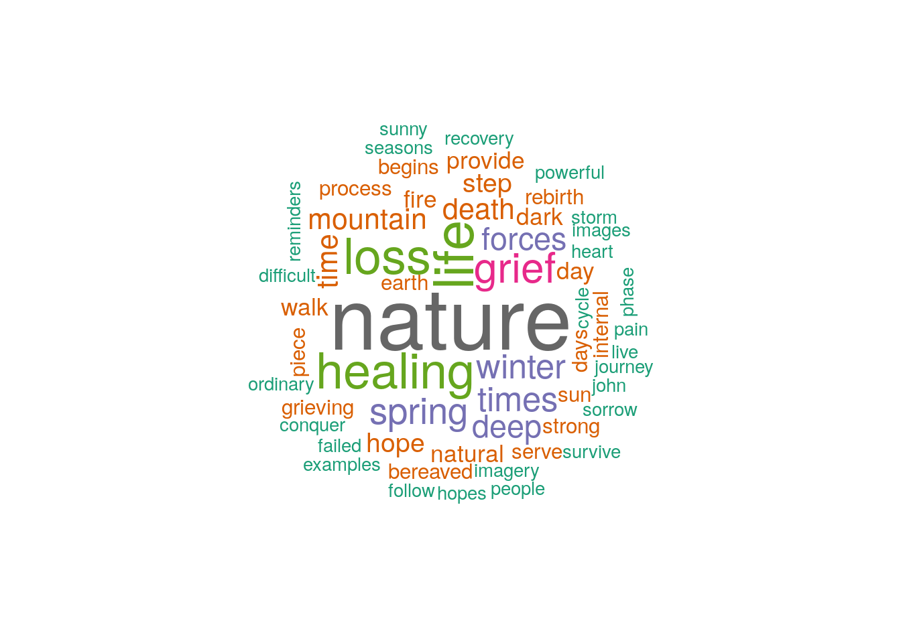
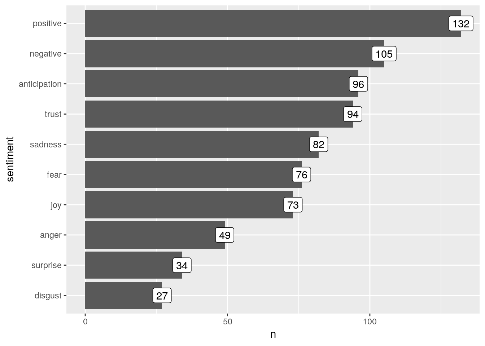
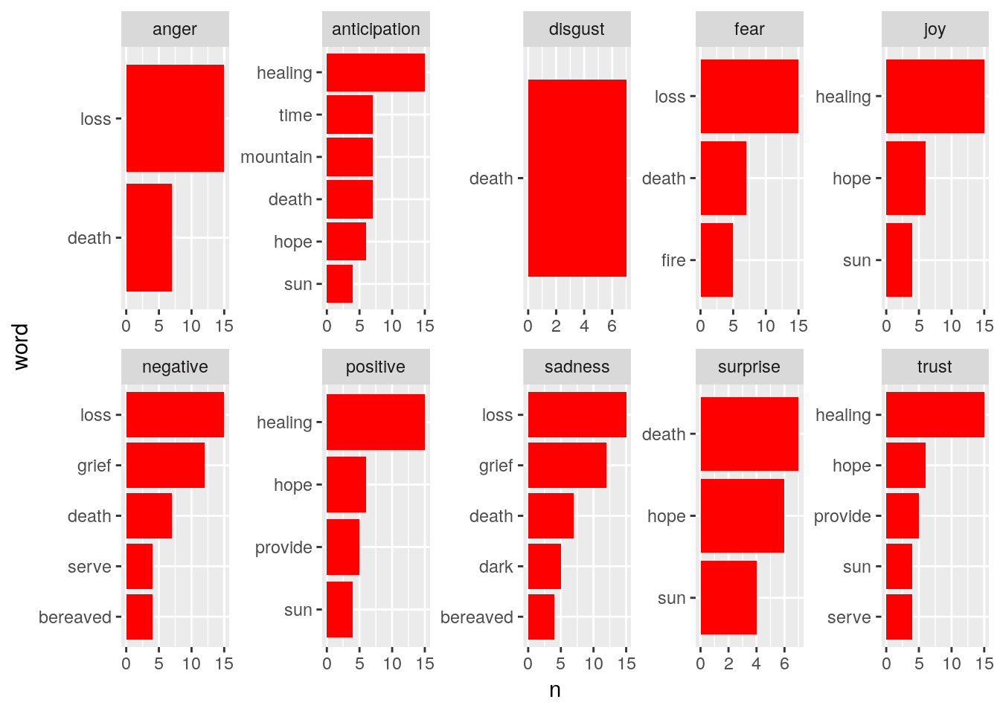

# Simple text processing with sentiment analysis


## Introduction

This is a very simple example of the sort of work flow involved with text processing. As an example I have used the text from this page obtained by googling nature and bereavement.

http://journeyofhearts.org/healing/nature.html

The page has been cut and pasted into a text file.


```r
library(wordcloud)
library(dplyr)
library(tidyr)
library(scales)
library(stringr)
library (readr)
library(tidytext)

options(scipen=999)
knitr::opts_chunk$set(echo=TRUE, warning=FALSE, message=FALSE)
```

## Reading in the data

The data from a simple text file can be read in using read_lines. Blank lines are then filtered out and the factor coerced into a character vector.


```r
d<-data.frame(text=read_lines("nature_healing.txt"))

d %>% filter(text != "") %>% mutate(text=as.character(text))->d

DT::datatable(d)
```

<!--html_preserve--><div id="htmlwidget-cb174893f74c8066f257" style="width:100%;height:auto;" class="datatables html-widget"></div>
<script type="application/json" data-for="htmlwidget-cb174893f74c8066f257">{"x":{"filter":"none","data":[["1","2","3","4","5","6","7","8","9","10","11","12","13","14","15","16","17","18","19","20","21","22","23","24","25","26","27","28","29","30","31","32","33","34","35","36","37","38","39","40","41","42","43","44","45","46","47","48","49","50","51","52","53","54","55","56","57","58","59","60","61","62","63","64","65","66","67","68","69","70","71","72","73","74","75","76","77","78","79","80","81","82","83","84","85","86","87","88","89","90","91","92","93","94","95","96","97","98","99","100","101","102","103","104","105","106","107","108","109","110","111","112","113","114","115","116","117","118","119","120","121","122","123","124","125","126","127","128","129","130","131","132","133","134","135","136","137","138","139","140","141","142","143","144","145","146","147","148","149","150","151","152"],["There is a healing quality to nature, which has been known for centuries be it taking time to smell the roses, meditating on a mountain, lying in a wildflower field, strolling by a meandering stream, or hiking in ancient redwood groves. Hippocrates, the father of modern medicine, recognized this powerful attribute in his humbling statement:","Nature cures—not the physician.","Hippocrates","People instinctively turn to outdoor and nature-loving activities as a way of relaxing and enhancing their well-being. Nature can aid in facilitating self-awareness and promoting healing. For many the outdoors is a source of inspiration, solace, guidance and regeneration.","Time spent outdoors can be restorative and healing. Whether running through a canyon, walking on the sunny beach, hiking through a fern-filled forest, scrambling over rocks along a creek side, watching the last few rays of the setting sun, strolling along a moonlit night, or just sitting breathing fresh clean air, being out in nature is one of the best prescriptions for overall health and encouraging healing.","            Above all, do not lose your desire to walk.","            Every day I walk myself into a state of well being,","            and walk away from every illness.","            I have walked myself into my best thoughts,","            and I know of no thought so burdensome","            that one cannot walk away from it.","Søren Kierkegaard","Nature provides us with a multitude of ordinary, reaffirming and renewing experiences—the sound of the first bird of spring, the sight of the early morning sun, the smell of ocean mist, or the feel of sand in between toes.","        One has to be alone, under the sky,","        Before everything falls into place and one finds","        his or her own place in the midst of it all.","        We have to have the humility to realize ourselves as part of nature.","Thomas Merton","Being in nature one becomes aware of the infinite circle of life. There is evidence of decay, destruction and death; there are also examples of rejuvenation, restoration, and renewal. The never-ending cycle of birth, life, death and rebirth can put life and death into perspective and impart a sense of constancy after experiencing a life changing loss or a death.","                Yea, I am one with all I see,","                With wind and wave, with pine and palm;","                Their very elements in me","                Are fused to make me what I am.","                Through me their common life-stream flows,","                And when I yield this human breath,","                In leaf and blossom, bud and rose,","                Live on I will….","                There is no Death.","Robert Service","The many unending cycles of nature provide real-life examples of hope after a loss and of rebirth following death and/or destruction illustrating that loss is part of life. Nature reminds us that time stops for no one. The earth rotates around the sun. The sun sets on one day, only to rise again on a new day. Spring returns after the dark clouds of winter. Sunny days of summer follow the spring rains.","Sad soul, take comfort nor forget,","The sunrise never failed us yet.","Celia Laighton Thaxter","The constancy of the seasons provide some stability when everything else may be crumbling. In the darkest of times, memories of better times—past winters melting into spring can sustain us and provide hope—that happy spring days filled with joy will once again emerge out of the gloom of winter.","                Like a crocus in the snow,","                I stand knee-deep in Winter","                Holding Springtime in my heart.","Joan Walsh Anglund","During the abundant dark days and difficult times that inevitably follow a significant loss, the grieving can utilize the ever-present power of nature for healing. Sometimes just simple words and unassuming imagery can serve as reminders of the strong natural forces around us and evoke the internal forces that exist deep within us. If the bereaved are able to look beyond their grief and become aware of the remarkable earth around us, these inner forces may surface and help provide them with the strength to survive the loss.","                In the depths of winter,","                I finally realized that deep within me","                there lay an Invincible Summer.","Albert Camus","Nature’s Healing Forces","Nature has strong regenerative capabilities to heal damage caused by fire, lightening, flood, earthquakes or blights. Looking closely amidst the ruins of fire or flood affected areas one can find signs of new growth and new life. Nature demonstrates the ability to survive despite strong forces that challenge her.","                If you watch how nature deals with adversity,","                continually renewing itself,","                you can’t help but learn.","Bernie Seigel, MD","In May 1980 Mount St. Helen’s erupted destroying an area 24 square miles. Scientists predicted the region would remain a dead zone for decades to come. Yet, only five years later after this natural devastation, a lupine bloomed at the base of the mountain, as a testimony to the tenacity and the regenerative forces of nature.","                Nature is always lovely, invincible, glad,","                Whatever is done and suffered by her creatures.","                All scars she heals,","                whether in rocks or water or sky or hearts.","John Muir","The giant sequoia trees have adapted to withstand fires by becoming fire-resistant. Black scars on the tree trunks serve as reminders those that have survived fire and lightening strikes. Fire is also a part of the sequoia’s life-cycle. Natural fires are needed to open up the forest, thin out the competing species and make way for the new seedlings.","Earth has no sorrow that earth cannot heal.","John Muir","Nature’s healing forces can serve as powerful recuperative images for those who have experienced a death or other significant loss. Images of the rebirth in nature can be useful as symbols for the strong internal forces, bringing hope of surviving the loss. From monumental newsworthy events to ordinary insignificant occurrences, one can witness the incredible destructive power and the amazing healing capabilities of nature and be reminded that:","                    Nature is the one place where miracles","                    not only happen,","                    but they happen all the time.","Thomas Wolfe","Nature as a Therapist","It is such a secret place,","the land of tears.","Antoine de Saint-Exupéry","Nature can become a place of refuge for difficult times. When life stresses start closing in, one can escape to the wilderness physically or mentally. Being in nature helps to clear one’s head of life’s demands and disruptive thoughts. This clarity of thought may lead to finding answers to life’s questions and discovering insights to life problems.","Look deep, deep into nature, and then","You will understand everything better.","Albert Einstein","Raising our conscious awareness and tuning into nature, we can begin to tap into her abundant healing powers. Nature can be utilized as an ever-present trusted therapist to assist in the healing journey, a source of solace, and a close friend who is always ready listen to share our grief and our tears during hard times. Nature can provide a place on can turn to in times of deep sorrow, a place to stretch the legs.","                When we need these healing times,","                there is nothing better than a good long walk.","                It is amazing","                how the rhythmic movements","                of the feet and legs","                are so intimately attached","                to cobweb cleaners in the brain.","Anne Wilson Schaef","Many of us find it difficult to see the blue skies beneath the passing gray storm clouds. It is true that if one hopes to see the rainbow, one must first live through the rain. Writer, speaker and author Helen Keller, who faced life being both visually and hearing challenged, shared her optimistic perspective on dealing with dark times:","Keep your face to the sunshine","and you cannot see the shadow.","Helen Keller","In nature one can discover many tangible, examples of powerful, natural imagery. Putting into words, verbally or in writing, the ordinary natural processes of the life cycle gives the grieving symbolism for rebirth and faith in the future. These images can help to instill hope in overcoming adversity and surviving loss.","                    Expect to have hope rekindled…","                    The dry seasons in life do not last.","                    The spring rains will come again.","Sarah Ban Breathnach","Grief descends like a winter snowstorm, covering everything in sight, in a mind-numbing blanket of sorrow. When a life-changing loss occurs, it is as if one has entered an eternal state of winter. Yet, the seasons that change year after year serve as constant reminders that nothing is permanent. After the long winter come the warm days of spring to melt away the enshrouding white blanket of grief. The once white landscape is altered turning into bright fields of multi-hued wildflowers, as the lands and animals awaken from their long winter’s sleep into springtime as if to tell us that:","                    Grief melts away","                    Like snow in May,","                    As if there were no such old thing.","George Herbert","Another effective nature imagery scene for dealing with loss is to envision a mountain of grief that must be climbed. The journey up the mountain begins with one small step, followed by another and another, until somehow, with time, the grieving ascend the mountain and reach the summit. Ultimately, those who reach the top of the mountain of grief do it by taking step after painful step.","                    What saves us is to take a step,","                    then another step.","                    It is always the same step,","                    but we have to take it.","Antoine de Saint-Exupéry","In the process fears about the climb, hopes about reaching the end of the journey, at first seemed insurmountable; but they are met and conquered. Coping with loss, it is our own internal grief response which must be faced. Sir Edmund Hillary, who climbed Mount Everest, points out:","It is not the mountains we conquer,","but ourselves.","Sir Edmund Hillary","or a variation on this quote:","                    You never conquer a mountain.","                    Mountains can't be conquered;","                    you conquer yourself","                    your hopes, your fears.","Jim Whitaker","Healing from Loss &amp; Grief","                I drop my head in my so empty hands","                abandoning myself to deep dark grief","                and know that with the passing time","                will come relief.","Norah Leney","During the healing phase of grief, the bereaved need to be reminded by those close to them, of all they have endured, commended for the monumental effort to face the pain from the loss and admired for coping with the intense, internal struggles.","                I never knew a night so black","                Light failed to follow on its track.","                I never knew a storm so gray","                it failed to have it’s clearing day.","John Kendrick Bangs","With many losses, the pain never entirely departs, rather it becomes a part of the bereaved, tucked away in a corner somewhere in the deep recesses of the heart. There it remains at a constant low level ache. As one begins the healing process, the pain lessens to a level that he/she can function. Hopefully in time, the loss and the grief are integrated and become barely perceptible. Life begins anew, but it is a life forever changed. The bereaved person has been transformed by the loss—like a caterpillar spinning a cocoon to hibernate during dark times before emerging as a butterfly in the spring. The grieving process usually ends when people realize that they will survive and focus their energy on living.","                He'd begun to wake up in the morning","                with something besides dread in his heart.","                Not exactly happiness,","                not eagerness for a new day,","                but a kind of urge to be eager,","                A longing to be happy.","Jon Hasser","The recovery phase begins slowly piece by piece.","            Piece by piece I re-enter the world.","            A new phase,","            a new body,","            a new voice.","            Birds console me by flying,","            Trees by growing,","            dogs by the warm patch they leave on the sofa,","            unknown people merely by performing their motions.","            It’s like a slow recovery from a sickness,","            this recovery of one’s self.","Tony Talbot","Elements of nature can aid in the healing process providing hope where there appears to be none, knowing that the dawn follows the darkness, sunny skies emerge after storms and spring follows winter.","                We must live through the dreary winter","                If we would value the spring;","                And the woods must be cold and silent","                Before the robins sing.","                The flowers must be buried in darkness","                Before they can bud and bloom,","                And the sweetest, warmest sunshine","                Comes after the storm and gloom.","Anonymous"]],"container":"<table class=\"display\">\n  <thead>\n    <tr>\n      <th> <\/th>\n      <th>text<\/th>\n    <\/tr>\n  <\/thead>\n<\/table>","options":{"order":[],"autoWidth":false,"orderClasses":false,"columnDefs":[{"orderable":false,"targets":0}]}},"evals":[],"jsHooks":[]}</script><!--/html_preserve-->

## Making a data frame consisting of just words

The tidytext package has functions to extract the words (tokens) and to remove stop words.


```r
library(SnowballC)
data(stop_words)
d %>% unnest_tokens(word, text)  %>% anti_join(stop_words) -> words
```

## Count the frequenciy of each word


```r
### Count the frequencies

words %>%
  group_by(word) %>%
  count() %>% arrange(-n) ->word_count

## Show as table
DT::datatable(word_count)
```

<!--html_preserve--><div id="htmlwidget-69c2818a3e5c16680346" style="width:100%;height:auto;" class="datatables html-widget"></div>
<script type="application/json" data-for="htmlwidget-69c2818a3e5c16680346">{"x":{"filter":"none","data":[["1","2","3","4","5","6","7","8","9","10","11","12","13","14","15","16","17","18","19","20","21","22","23","24","25","26","27","28","29","30","31","32","33","34","35","36","37","38","39","40","41","42","43","44","45","46","47","48","49","50","51","52","53","54","55","56","57","58","59","60","61","62","63","64","65","66","67","68","69","70","71","72","73","74","75","76","77","78","79","80","81","82","83","84","85","86","87","88","89","90","91","92","93","94","95","96","97","98","99","100","101","102","103","104","105","106","107","108","109","110","111","112","113","114","115","116","117","118","119","120","121","122","123","124","125","126","127","128","129","130","131","132","133","134","135","136","137","138","139","140","141","142","143","144","145","146","147","148","149","150","151","152","153","154","155","156","157","158","159","160","161","162","163","164","165","166","167","168","169","170","171","172","173","174","175","176","177","178","179","180","181","182","183","184","185","186","187","188","189","190","191","192","193","194","195","196","197","198","199","200","201","202","203","204","205","206","207","208","209","210","211","212","213","214","215","216","217","218","219","220","221","222","223","224","225","226","227","228","229","230","231","232","233","234","235","236","237","238","239","240","241","242","243","244","245","246","247","248","249","250","251","252","253","254","255","256","257","258","259","260","261","262","263","264","265","266","267","268","269","270","271","272","273","274","275","276","277","278","279","280","281","282","283","284","285","286","287","288","289","290","291","292","293","294","295","296","297","298","299","300","301","302","303","304","305","306","307","308","309","310","311","312","313","314","315","316","317","318","319","320","321","322","323","324","325","326","327","328","329","330","331","332","333","334","335","336","337","338","339","340","341","342","343","344","345","346","347","348","349","350","351","352","353","354","355","356","357","358","359","360","361","362","363","364","365","366","367","368","369","370","371","372","373","374","375","376","377","378","379","380","381","382","383","384","385","386","387","388","389","390","391","392","393","394","395","396","397","398","399","400","401","402","403","404","405","406","407","408","409","410","411","412","413","414","415","416","417","418","419","420","421","422","423","424","425","426","427","428","429","430","431","432","433","434","435","436","437","438","439","440","441","442","443","444","445","446","447","448","449","450","451","452","453","454","455","456","457","458","459","460","461","462","463","464","465","466","467","468","469","470","471","472","473","474","475","476","477","478","479","480","481","482","483","484","485","486","487","488","489","490","491","492","493","494","495","496","497","498","499","500","501","502","503","504","505","506","507","508","509","510","511","512","513","514","515","516","517","518","519","520","521","522","523","524","525","526","527","528","529","530","531","532","533","534","535","536","537","538","539","540","541","542","543","544","545","546","547","548","549","550","551","552","553","554","555","556","557","558","559","560","561","562","563","564","565","566","567","568","569","570","571","572","573","574","575","576","577","578","579","580","581","582","583","584","585","586","587","588","589","590","591","592","593","594"],["nature","life","healing","loss","grief","spring","times","winter","deep","forces","death","mountain","time","hope","step","dark","day","fire","natural","provide","walk","begins","bereaved","days","earth","grieving","internal","piece","process","rebirth","serve","strong","sun","conquer","cycle","difficult","examples","failed","follow","heart","hopes","imagery","images","john","journey","live","ordinary","pain","people","phase","powerful","recovery","reminders","seasons","sorrow","storm","sunny","survive","abundant","adversity","aid","albert","amazing","antoine","aware","awareness","black","blanket","bud","capabilities","changing","climbed","close","clouds","conquered","constancy","constant","coping","darkness","de","dealing","destruction","edmund","elements","emerge","exupéry","faced","fears","filled","fires","flood","forest","gloom","gray","happen","happy","head","heal","helen","hiking","hillary","hippocrates","invincible","it’s","keller","legs","level","life’s","lightening","monumental","morning","mount","mountains","muir","nature’s","night","one’s","outdoors","passing","perspective","power","rains","reach","realize","regenerative","reminded","renewing","rocks","saint","scars","sight","significant","sir","skies","sky","smell","snow","solace","source","springtime","stream","strolling","summer","sunshine","surviving","taking","tears","therapist","thomas","trees","warm","white","words","1980","24","abandoning","ability","ache","activities","adapted","admired","affected","air","altered","amidst","ancient","anew","anglund","animals","anne","anonymous","answers","appears","ascend","assist","attached","attribute","author","awaken","ban","bangs","barely","base","beach","begin","begun","beneath","bernie","bird","birds","birth","blights","bloom","bloomed","blossom","blue","body","brain","breath","breathing","breathnach","bright","bringing","burdensome","buried","butterfly","camus","can’t","canyon","caterpillar","caused","celia","centuries","challenge","challenged","change","changed","circle","clarity","clean","cleaners","clearing","climb","closely","closing","cobweb","cocoon","cold","comfort","commended","common","competing","conscious","console","continually","corner","covering","creatures","creek","crocus","crumbling","cures","cycles","damage","darkest","dawn","dead","deals","decades","decay","demands","demonstrates","departs","depths","descends","desire","destroying","destructive","devastation","discover","discovering","disruptive","dogs","dread","dreary","drop","dry","eager","eagerness","earthquakes","effective","effort","einstein","emerging","empty","encouraging","endured","energy","enhancing","enshrouding","enter","entered","envision","erupted","escape","eternal","events","everest","evidence","evoke","exist","expect","experienced","experiences","experiencing","facilitating","faith","falls","father","feel","feet","fern","field","fields","finally","finding","flowers","flows","flying","focus","forever","forget","fresh","friend","function","fused","future","george","giant","glad","groves","growing","growth","guidance","hands","happiness","hard","hasser","heals","health","hearing","hearts","helen’s","helps","herbert","hibernate","holding","hued","human","humbling","humility","illness","illustrating","impart","incredible","inevitably","infinite","insights","insignificant","inspiration","instill","instinctively","insurmountable","integrated","intense","intimately","jim","joan","jon","joy","kendrick","kierkegaard","knee","knowing","laighton","land","lands","landscape","lay","lead","leaf","learn","leave","leney","lessens","light","listen","living","longing","lose","losses","lovely","loving","low","lupine","lying","md","meandering","medicine","meditating","melt","melting","melts","memories","mentally","merton","met","midst","miles","mind","miracles","mist","modern","moonlit","motions","movements","multi","multitude","newsworthy","norah","numbing","occurrences","occurs","ocean","optimistic","outdoor","overcoming","painful","palm","past","patch","perceptible","performing","permanent","person","physically","physician","pine","powers","predicted","prescriptions","processes","promoting","providing","putting","quality","questions","quote","rain","rainbow","raising","rays","reaching","ready","reaffirming","real","realized","recesses","recognized","recuperative","redwood","refuge","regeneration","region","rejuvenation","rekindled","relaxing","relief","remain","remains","remarkable","reminds","renewal","resistant","response","restoration","restorative","returns","rhythmic","rise","robert","robins","rose","roses","rotates","ruins","running","sad","sand","sarah","saves","scene","schaef","scientists","scrambling","secret","seedlings","seigel","sense","sequoia","sequoia’s","service","sets","setting","shadow","share","shared","sickness","signs","silent","simple","sing","sitting","sleep","slow","slowly","snowstorm","sofa","søren","soul","sound","speaker","species","spent","spinning","square","st","stability","stand","start","statement","stops","storms","strength","stresses","stretch","strikes","struggles","suffered","summit","sunrise","surface","survived","sustain","sweetest","symbolism","symbols","talbot","tangible","tap","tenacity","testimony","thaxter","thin","toes","tony","top","track","transformed","tree","true","trunks","trusted","tucked","tuning","ultimately","unassuming","understand","unending","unknown","urge","utilize","utilized","variation","verbally","visually","voice","wake","walked","walking","walsh","warmest","watch","watching","water","wave","whitaker","wilderness","wildflower","wildflowers","wilson","wind","winter’s","winters","withstand","witness","wolfe","woods","world","writer","writing","yea","yield","zone"],[29,17,15,15,12,10,9,9,8,8,7,7,7,6,6,5,5,5,5,5,5,4,4,4,4,4,4,4,4,4,4,4,4,3,3,3,3,3,3,3,3,3,3,3,3,3,3,3,3,3,3,3,3,3,3,3,3,3,2,2,2,2,2,2,2,2,2,2,2,2,2,2,2,2,2,2,2,2,2,2,2,2,2,2,2,2,2,2,2,2,2,2,2,2,2,2,2,2,2,2,2,2,2,2,2,2,2,2,2,2,2,2,2,2,2,2,2,2,2,2,2,2,2,2,2,2,2,2,2,2,2,2,2,2,2,2,2,2,2,2,2,2,2,2,2,2,2,2,2,2,2,2,2,1,1,1,1,1,1,1,1,1,1,1,1,1,1,1,1,1,1,1,1,1,1,1,1,1,1,1,1,1,1,1,1,1,1,1,1,1,1,1,1,1,1,1,1,1,1,1,1,1,1,1,1,1,1,1,1,1,1,1,1,1,1,1,1,1,1,1,1,1,1,1,1,1,1,1,1,1,1,1,1,1,1,1,1,1,1,1,1,1,1,1,1,1,1,1,1,1,1,1,1,1,1,1,1,1,1,1,1,1,1,1,1,1,1,1,1,1,1,1,1,1,1,1,1,1,1,1,1,1,1,1,1,1,1,1,1,1,1,1,1,1,1,1,1,1,1,1,1,1,1,1,1,1,1,1,1,1,1,1,1,1,1,1,1,1,1,1,1,1,1,1,1,1,1,1,1,1,1,1,1,1,1,1,1,1,1,1,1,1,1,1,1,1,1,1,1,1,1,1,1,1,1,1,1,1,1,1,1,1,1,1,1,1,1,1,1,1,1,1,1,1,1,1,1,1,1,1,1,1,1,1,1,1,1,1,1,1,1,1,1,1,1,1,1,1,1,1,1,1,1,1,1,1,1,1,1,1,1,1,1,1,1,1,1,1,1,1,1,1,1,1,1,1,1,1,1,1,1,1,1,1,1,1,1,1,1,1,1,1,1,1,1,1,1,1,1,1,1,1,1,1,1,1,1,1,1,1,1,1,1,1,1,1,1,1,1,1,1,1,1,1,1,1,1,1,1,1,1,1,1,1,1,1,1,1,1,1,1,1,1,1,1,1,1,1,1,1,1,1,1,1,1,1,1,1,1,1,1,1,1,1,1,1,1,1,1,1,1,1,1,1,1,1,1,1,1,1,1,1,1,1,1,1,1,1,1,1,1,1,1,1,1,1,1,1,1,1,1,1,1,1,1,1,1,1,1,1,1,1,1,1,1,1,1,1,1,1,1,1,1,1,1,1,1,1,1,1,1,1,1,1,1,1,1,1,1,1,1,1,1,1]],"container":"<table class=\"display\">\n  <thead>\n    <tr>\n      <th> <\/th>\n      <th>word<\/th>\n      <th>n<\/th>\n    <\/tr>\n  <\/thead>\n<\/table>","options":{"columnDefs":[{"className":"dt-right","targets":2},{"orderable":false,"targets":0}],"order":[],"autoWidth":false,"orderClasses":false}},"evals":[],"jsHooks":[]}</script><!--/html_preserve-->


## Word cloud

Making a word cloud from the table of frequencies is easy using the word-cloud package.


```r
 wordcloud(word_count$word, word_count$n, random.order=FALSE, max.words = 100, colors=brewer.pal(8, "Dark2"), use.r.layout=TRUE)
```




## Find the sentiments associated with the words

This is the part that may not quite work as well as you might hope. There are various lexicons in the R package tidytext. These lexicons are simple tables with words and associated emotions, or scores. Some words can have several emotions associated with them. 


```r
# Get Lexicon
nrc <- sentiments %>%
  filter(lexicon == "nrc") %>%
  dplyr::select(word, sentiment)

## Join to words
words %>% inner_join(nrc, by = "word") -> word_sentiment
```


```r
DT::datatable(word_sentiment)
```

<!--html_preserve--><div id="htmlwidget-cb0c5db9eedc86043502" style="width:100%;height:auto;" class="datatables html-widget"></div>
<script type="application/json" data-for="htmlwidget-cb0c5db9eedc86043502">{"x":{"filter":"none","data":[["1","2","3","4","5","6","7","8","9","10","11","12","13","14","15","16","17","18","19","20","21","22","23","24","25","26","27","28","29","30","31","32","33","34","35","36","37","38","39","40","41","42","43","44","45","46","47","48","49","50","51","52","53","54","55","56","57","58","59","60","61","62","63","64","65","66","67","68","69","70","71","72","73","74","75","76","77","78","79","80","81","82","83","84","85","86","87","88","89","90","91","92","93","94","95","96","97","98","99","100","101","102","103","104","105","106","107","108","109","110","111","112","113","114","115","116","117","118","119","120","121","122","123","124","125","126","127","128","129","130","131","132","133","134","135","136","137","138","139","140","141","142","143","144","145","146","147","148","149","150","151","152","153","154","155","156","157","158","159","160","161","162","163","164","165","166","167","168","169","170","171","172","173","174","175","176","177","178","179","180","181","182","183","184","185","186","187","188","189","190","191","192","193","194","195","196","197","198","199","200","201","202","203","204","205","206","207","208","209","210","211","212","213","214","215","216","217","218","219","220","221","222","223","224","225","226","227","228","229","230","231","232","233","234","235","236","237","238","239","240","241","242","243","244","245","246","247","248","249","250","251","252","253","254","255","256","257","258","259","260","261","262","263","264","265","266","267","268","269","270","271","272","273","274","275","276","277","278","279","280","281","282","283","284","285","286","287","288","289","290","291","292","293","294","295","296","297","298","299","300","301","302","303","304","305","306","307","308","309","310","311","312","313","314","315","316","317","318","319","320","321","322","323","324","325","326","327","328","329","330","331","332","333","334","335","336","337","338","339","340","341","342","343","344","345","346","347","348","349","350","351","352","353","354","355","356","357","358","359","360","361","362","363","364","365","366","367","368","369","370","371","372","373","374","375","376","377","378","379","380","381","382","383","384","385","386","387","388","389","390","391","392","393","394","395","396","397","398","399","400","401","402","403","404","405","406","407","408","409","410","411","412","413","414","415","416","417","418","419","420","421","422","423","424","425","426","427","428","429","430","431","432","433","434","435","436","437","438","439","440","441","442","443","444","445","446","447","448","449","450","451","452","453","454","455","456","457","458","459","460","461","462","463","464","465","466","467","468","469","470","471","472","473","474","475","476","477","478","479","480","481","482","483","484","485","486","487","488","489","490","491","492","493","494","495","496","497","498","499","500","501","502","503","504","505","506","507","508","509","510","511","512","513","514","515","516","517","518","519","520","521","522","523","524","525","526","527","528","529","530","531","532","533","534","535","536","537","538","539","540","541","542","543","544","545","546","547","548","549","550","551","552","553","554","555","556","557","558","559","560","561","562","563","564","565","566","567","568","569","570","571","572","573","574","575","576","577","578","579","580","581","582","583","584","585","586","587","588","589","590","591","592","593","594","595","596","597","598","599","600","601","602","603","604","605","606","607","608","609","610","611","612","613","614","615","616","617","618","619","620","621","622","623","624","625","626","627","628","629","630","631","632","633","634","635","636","637","638","639","640","641","642","643","644","645","646","647","648","649","650","651","652","653","654","655","656","657","658","659","660","661","662","663","664","665","666","667","668","669","670","671","672","673","674","675","676","677","678","679","680","681","682","683","684","685","686","687","688","689","690","691","692","693","694","695","696","697","698","699","700","701","702","703","704","705","706","707","708","709","710","711","712","713","714","715","716","717","718","719","720","721","722","723","724","725","726","727","728","729","730","731","732","733","734","735","736","737","738","739","740","741","742","743","744","745","746","747","748","749","750","751","752","753","754","755","756","757","758","759","760","761","762","763","764","765","766","767","768"],["healing","healing","healing","healing","time","smell","smell","smell","mountain","lying","lying","lying","meandering","ancient","father","powerful","powerful","powerful","powerful","powerful","powerful","powerful","statement","statement","physician","physician","loving","loving","loving","aid","healing","healing","healing","healing","inspiration","inspiration","inspiration","solace","guidance","guidance","time","spent","restorative","restorative","restorative","restorative","healing","healing","healing","healing","sunny","sunny","sunny","sunny","beach","scrambling","sun","sun","sun","sun","sun","clean","clean","clean","healing","healing","healing","healing","lose","lose","lose","lose","lose","lose","illness","illness","illness","burdensome","burdensome","burdensome","sun","sun","sun","sun","sun","smell","smell","smell","sky","humility","humility","infinite","decay","decay","decay","destruction","destruction","death","death","death","death","death","death","death","renewal","birth","birth","birth","birth","birth","death","death","death","death","death","death","death","death","death","death","death","death","death","death","impart","impart","sense","constancy","constancy","loss","loss","loss","loss","death","death","death","death","death","death","death","pine","pine","blossom","blossom","death","death","death","death","death","death","death","provide","provide","real","real","hope","hope","hope","hope","hope","loss","loss","loss","loss","death","death","death","death","death","death","death","destruction","destruction","loss","loss","loss","loss","time","sun","sun","sun","sun","sun","sun","sun","sun","sun","sun","dark","sunny","sunny","sunny","sunny","comfort","comfort","comfort","comfort","forget","constancy","constancy","provide","provide","crumbling","crumbling","provide","provide","hope","hope","hope","hope","hope","happy","happy","happy","happy","joy","joy","gloom","gloom","abundant","abundant","dark","difficult","loss","loss","loss","loss","healing","healing","healing","healing","words","words","unassuming","serve","serve","bereaved","bereaved","grief","grief","remarkable","remarkable","remarkable","remarkable","provide","provide","strength","strength","survive","loss","loss","loss","loss","finally","finally","finally","finally","finally","finally","healing","healing","healing","healing","heal","heal","heal","damage","damage","damage","damage","fire","flood","fire","flood","growth","ability","survive","challenge","challenge","challenge","watch","watch","adversity","adversity","adversity","adversity","learn","destroying","destroying","destroying","destroying","devastation","devastation","devastation","devastation","devastation","base","mountain","testimony","tenacity","lovely","lovely","lovely","lovely","lovely","lovely","glad","glad","glad","sky","john","john","giant","withstand","withstand","withstand","fire","resistant","resistant","black","black","tree","tree","tree","tree","tree","tree","tree","serve","serve","fire","fire","sorrow","sorrow","sorrow","heal","heal","heal","john","john","healing","healing","healing","healing","serve","serve","powerful","powerful","powerful","powerful","powerful","powerful","powerful","experienced","experienced","death","death","death","death","death","death","death","loss","loss","loss","loss","hope","hope","hope","hope","hope","loss","loss","loss","loss","insignificant","insignificant","insignificant","witness","destructive","destructive","destructive","destructive","healing","healing","healing","healing","happen","happen","time","secret","land","saint","saint","saint","saint","saint","difficult","start","escape","escape","escape","escape","wilderness","wilderness","wilderness","lead","abundant","abundant","healing","healing","healing","healing","assist","assist","healing","healing","healing","healing","journey","journey","journey","journey","solace","friend","friend","friend","ready","share","share","share","share","grief","grief","provide","provide","sorrow","sorrow","sorrow","healing","healing","healing","healing","intimately","intimately","intimately","difficult","blue","gray","gray","storm","storm","true","true","true","writer","author","author","hearing","hearing","dark","sunshine","sunshine","powerful","powerful","powerful","powerful","powerful","powerful","powerful","words","words","faith","faith","faith","faith","hope","hope","hope","hope","hope","adversity","adversity","adversity","adversity","loss","loss","loss","loss","expect","expect","expect","expect","hope","hope","hope","hope","hope","ban","grief","grief","blanket","sorrow","sorrow","sorrow","loss","loss","loss","loss","change","serve","serve","constant","constant","white","white","white","white","blanket","grief","grief","white","white","white","white","grief","grief","effective","effective","loss","loss","loss","loss","mountain","grief","grief","journey","journey","journey","journey","mountain","time","mountain","ultimately","ultimately","top","top","top","mountain","grief","grief","painful","painful","painful","painful","painful","saint","saint","saint","saint","saint","journey","journey","journey","journey","insurmountable","insurmountable","insurmountable","loss","loss","loss","loss","grief","grief","sir","sir","sir","sir","quote","quote","quote","quote","mountain","healing","healing","healing","healing","loss","loss","loss","loss","grief","grief","dark","grief","grief","time","relief","healing","healing","healing","healing","grief","grief","bereaved","bereaved","effort","pain","pain","pain","loss","loss","loss","loss","intense","intense","intense","intense","intense","intense","intense","intense","black","black","track","storm","storm","gray","gray","john","john","pain","pain","pain","bereaved","bereaved","recesses","remains","remains","remains","remains","remains","constant","constant","level","level","ache","ache","healing","healing","healing","healing","pain","pain","pain","level","level","time","loss","loss","loss","loss","grief","grief","perceptible","bereaved","bereaved","loss","loss","loss","loss","dark","survive","focus","begun","dread","dread","dread","happiness","happiness","happiness","eagerness","eagerness","eagerness","eagerness","eager","eager","eager","eager","eager","longing","longing","happy","happy","happy","happy","recovery","console","console","flying","flying","patch","leave","leave","leave","unknown","unknown","unknown","recovery","sickness","sickness","sickness","sickness","recovery","aid","healing","healing","healing","healing","providing","providing","providing","providing","hope","hope","hope","hope","hope","knowing","dawn","dawn","dawn","dawn","dawn","darkness","darkness","darkness","darkness","sunny","sunny","sunny","sunny","dreary","dreary","cold","sing","sing","sing","sing","sing","buried","buried","buried","darkness","darkness","darkness","darkness","bloom","bloom","bloom","bloom","sunshine","sunshine","storm","storm","gloom","gloom","anonymous"],["anticipation","joy","positive","trust","anticipation","anger","disgust","negative","anticipation","anger","disgust","negative","negative","negative","trust","anger","anticipation","disgust","fear","joy","positive","trust","positive","trust","positive","trust","joy","positive","trust","positive","anticipation","joy","positive","trust","anticipation","joy","positive","positive","positive","trust","anticipation","negative","anticipation","joy","positive","trust","anticipation","joy","positive","trust","anticipation","joy","positive","surprise","joy","negative","anticipation","joy","positive","surprise","trust","joy","positive","trust","anticipation","joy","positive","trust","anger","disgust","fear","negative","sadness","surprise","fear","negative","sadness","fear","negative","sadness","anticipation","joy","positive","surprise","trust","anger","disgust","negative","positive","positive","trust","positive","fear","negative","sadness","anger","negative","anger","anticipation","disgust","fear","negative","sadness","surprise","positive","anticipation","fear","joy","positive","trust","anger","anticipation","disgust","fear","negative","sadness","surprise","anger","anticipation","disgust","fear","negative","sadness","surprise","positive","trust","positive","positive","trust","anger","fear","negative","sadness","anger","anticipation","disgust","fear","negative","sadness","surprise","negative","sadness","joy","positive","anger","anticipation","disgust","fear","negative","sadness","surprise","positive","trust","positive","trust","anticipation","joy","positive","surprise","trust","anger","fear","negative","sadness","anger","anticipation","disgust","fear","negative","sadness","surprise","anger","negative","anger","fear","negative","sadness","anticipation","anticipation","joy","positive","surprise","trust","anticipation","joy","positive","surprise","trust","sadness","anticipation","joy","positive","surprise","anticipation","joy","positive","trust","negative","positive","trust","positive","trust","negative","sadness","positive","trust","anticipation","joy","positive","surprise","trust","anticipation","joy","positive","trust","joy","positive","negative","sadness","joy","positive","sadness","fear","anger","fear","negative","sadness","anticipation","joy","positive","trust","anger","negative","positive","negative","trust","negative","sadness","negative","sadness","joy","positive","surprise","trust","positive","trust","positive","trust","positive","anger","fear","negative","sadness","anticipation","disgust","joy","positive","surprise","trust","anticipation","joy","positive","trust","joy","positive","trust","anger","disgust","negative","sadness","fear","fear","fear","fear","positive","positive","positive","anger","fear","negative","anticipation","fear","anger","fear","negative","sadness","positive","anger","fear","negative","sadness","anger","fear","negative","sadness","surprise","trust","anticipation","trust","positive","anticipation","joy","positive","sadness","surprise","trust","anticipation","joy","positive","positive","disgust","negative","fear","anticipation","fear","positive","fear","fear","negative","negative","sadness","anger","anticipation","disgust","joy","positive","surprise","trust","negative","trust","fear","fear","fear","negative","sadness","joy","positive","trust","disgust","negative","anticipation","joy","positive","trust","negative","trust","anger","anticipation","disgust","fear","joy","positive","trust","positive","trust","anger","anticipation","disgust","fear","negative","sadness","surprise","anger","fear","negative","sadness","anticipation","joy","positive","surprise","trust","anger","fear","negative","sadness","anger","negative","sadness","trust","anger","disgust","fear","negative","anticipation","joy","positive","trust","anticipation","anticipation","anticipation","trust","positive","anticipation","joy","positive","surprise","trust","fear","anticipation","anticipation","fear","negative","positive","anticipation","fear","sadness","positive","joy","positive","anticipation","joy","positive","trust","positive","trust","anticipation","joy","positive","trust","anticipation","fear","joy","positive","positive","joy","positive","trust","anticipation","anticipation","joy","positive","trust","negative","sadness","positive","trust","fear","negative","sadness","anticipation","joy","positive","trust","anticipation","fear","joy","fear","sadness","disgust","sadness","anger","negative","joy","positive","trust","positive","positive","trust","fear","negative","sadness","joy","positive","anger","anticipation","disgust","fear","joy","positive","trust","anger","negative","anticipation","joy","positive","trust","anticipation","joy","positive","surprise","trust","anger","fear","negative","sadness","anger","fear","negative","sadness","anticipation","positive","surprise","trust","anticipation","joy","positive","surprise","trust","negative","negative","sadness","trust","fear","negative","sadness","anger","fear","negative","sadness","fear","negative","trust","positive","trust","anticipation","joy","positive","trust","trust","negative","sadness","anticipation","joy","positive","trust","negative","sadness","positive","trust","anger","fear","negative","sadness","anticipation","negative","sadness","anticipation","fear","joy","positive","anticipation","anticipation","anticipation","anticipation","positive","anticipation","positive","trust","anticipation","negative","sadness","anger","disgust","fear","negative","sadness","anticipation","joy","positive","surprise","trust","anticipation","fear","joy","positive","fear","negative","sadness","anger","fear","negative","sadness","negative","sadness","positive","trust","positive","trust","anticipation","negative","positive","surprise","anticipation","anticipation","joy","positive","trust","anger","fear","negative","sadness","negative","sadness","sadness","negative","sadness","anticipation","positive","anticipation","joy","positive","trust","negative","sadness","negative","sadness","positive","fear","negative","sadness","anger","fear","negative","sadness","anger","disgust","fear","joy","negative","positive","surprise","trust","negative","sadness","anticipation","anger","negative","disgust","sadness","disgust","negative","fear","negative","sadness","negative","sadness","fear","disgust","fear","negative","positive","trust","positive","trust","positive","trust","negative","sadness","anticipation","joy","positive","trust","fear","negative","sadness","positive","trust","anticipation","anger","fear","negative","sadness","negative","sadness","positive","negative","sadness","anger","fear","negative","sadness","sadness","positive","positive","anticipation","anticipation","fear","negative","anticipation","joy","positive","anticipation","joy","positive","trust","anticipation","joy","positive","surprise","trust","anticipation","sadness","anticipation","joy","positive","trust","positive","positive","sadness","fear","positive","negative","negative","sadness","surprise","anticipation","fear","negative","positive","disgust","fear","negative","sadness","positive","positive","anticipation","joy","positive","trust","anticipation","joy","positive","trust","anticipation","joy","positive","surprise","trust","positive","anticipation","joy","positive","surprise","trust","anger","fear","negative","sadness","anticipation","joy","positive","surprise","negative","sadness","negative","anticipation","joy","positive","sadness","trust","fear","negative","sadness","anger","fear","negative","sadness","anticipation","joy","positive","trust","joy","positive","anger","negative","negative","sadness","negative"]],"container":"<table class=\"display\">\n  <thead>\n    <tr>\n      <th> <\/th>\n      <th>word<\/th>\n      <th>sentiment<\/th>\n    <\/tr>\n  <\/thead>\n<\/table>","options":{"order":[],"autoWidth":false,"orderClasses":false,"columnDefs":[{"orderable":false,"targets":0}]}},"evals":[],"jsHooks":[]}</script><!--/html_preserve-->

## Plotting the frequencies of the sentiments


```r
library(ggplot2)
word_sentiment %>% 
  group_by(sentiment) %>% 
  summarise(n=n()) %>% 
  arrange(n) %>% 
  mutate(sentiment = reorder(sentiment, n)) ->ws

ggplot(data=ws,aes(x=sentiment,y=n,label=n)) + 
  geom_bar(stat="identity") + 
  geom_label()  + 
  coord_flip()
```



## Words associated with each sentiment


```r
word_sentiment %>% 
  group_by(sentiment,word) %>% 
  count() %>% 
  filter(n>3) %>% 
  arrange(-n) %>% 
  ungroup() %>% 
  mutate(word = reorder(word, n)) %>% 
  ggplot(aes(x=word,y=n)) +
  geom_bar(stat="identity",fill="red") +
  facet_wrap(~ sentiment, scales = "free", ncol = 5) +
  coord_flip()
```



## Used in a questionaire context

Shorter pieces of text can be scored for usage of positive and negative terms in order to be used as a response variable in an statistical analysis. However be aware of the potential weaknesses of the lexicon used, and the potential for mis-scoring, especially when the terms are negated or taken out of context. 


## Example: One line per tweet

The word tokens are extracted from a data frame along with the covariates in the rows that contain text. So if shorter pieces of text are scored numerically the relationship between the scores and other covariates can be looked at. For example, here is the text of some of Donald Trump's recent tweets along with the number of times his followers have favourited them. Each tweet can be scored as being positive or negative.


```r
d<-read_csv("recent_tweets.csv")

d$text<-as.character(d$text)
d %>% select(id,text,favoriteCount,created, hour) ->d
DT::datatable(d)
```

<!--html_preserve--><div id="htmlwidget-dd1d122655b97c3d0819" style="width:100%;height:auto;" class="datatables html-widget"></div>
<script type="application/json" data-for="htmlwidget-dd1d122655b97c3d0819">{"x":{"filter":"none","data":[["1","2","3","4","5","6","7","8","9","10","11","12","13","14","15","16","17","18","19","20","21","22","23","24","25","26","27","28","29","30","31","32","33","34","35","36","37","38","39","40","41","42","43","44","45","46","47","48","49","50","51","52","53","54","55","56","57","58","59","60","61","62","63","64","65","66","67","68","69","70","71","72","73","74","75","76","77","78","79","80","81","82","83","84","85","86","87","88","89","90","91","92","93","94","95","96","97","98","99","100","101","102","103","104","105","106","107","108","109","110","111","112","113","114","115","116","117","118","119","120","121","122","123","124","125","126","127","128","129","130","131","132","133","134","135","136","137","138","139","140","141","142","143","144","145","146","147","148","149","150","151","152","153","154","155","156","157","158","159","160","161","162","163","164","165","166","167","168","169","170","171","172","173","174","175","176","177","178","179","180","181","182","183","184","185","186","187","188","189","190","191","192","193","194","195","196","197","198","199","200","201","202","203","204","205","206","207","208","209","210","211","212","213","214","215","216","217","218","219","220","221","222","223","224","225","226","227","228","229","230","231","232","233","234","235","236","237","238","239","240","241","242","243","244","245","246","247","248","249","250","251","252","253","254","255","256","257","258","259","260","261","262","263","264","265","266","267","268","269","270","271","272","273","274","275","276","277","278","279","280","281","282","283","284","285","286","287","288","289","290","291","292","293","294","295","296","297","298","299","300","301","302","303","304","305","306","307","308","309","310","311","312","313","314","315","316","317","318","319","320","321","322","323","324","325","326","327","328","329","330","331","332","333","334","335","336","337","338","339","340","341","342","343","344","345","346","347","348","349","350","351"],[1.10202066813527e+18,1.10200768158856e+18,1.10200437122575e+18,1.10200256511654e+18,1.10188026910622e+18,1.101839731762e+18,1.1018374992305e+18,1.10162017563861e+18,1.10158872725879e+18,1.10147647003426e+18,1.10147389935788e+18,1.10147208473e+18,1.10146914121363e+18,1.10146719082444e+18,1.10146444311492e+18,1.10134014150171e+18,1.10133134554292e+18,1.10133122165576e+18,1.1012897725286e+18,1.10128905706008e+18,1.10106580206786e+18,1.10078220851895e+18,1.10078184062375e+18,1.1006935194911e+18,1.10068708599913e+18,1.10068397489936e+18,1.10066647642241e+18,1.10058543121162e+18,1.1005841412744e+18,1.10041222766271e+18,1.10021149522322e+18,1.10018487446666e+18,1.1001275532038e+18,1.10012639172977e+18,1.10011040973698e+18,1.10010573245044e+18,1.1000507980154e+18,1.10004811438227e+18,1.10001723722895e+18,1.10001581551508e+18,1.1000126204411e+18,1.10000213928231e+18,1.10000003031917e+18,1.09999561130525e+18,1.09980371943524e+18,1.099800961089e+18,1.09972242405942e+18,1.09971345145746e+18,1.09968595007722e+18,1.09968440600293e+18,1.0996600440047e+18,1.09965664684078e+18,1.09965476353106e+18,1.09965112108847e+18,1.09951309365326e+18,1.09945913803844e+18,1.09939863994286e+18,1.09936646901037e+18,1.09936082759184e+18,1.09934114115206e+18,1.09908212552399e+18,1.0989762052384e+18,1.09895945129243e+18,1.09894845940572e+18,1.09874093458875e+18,1.09867639078072e+18,1.09861581851294e+18,1.09858758346923e+18,1.09762432915467e+18,1.09762350658036e+18,1.09759233140507e+18,1.09748825684801e+18,1.09748158133219e+18,1.09747308025397e+18,1.09746964204872e+18,1.09746488977646e+18,1.09735027118806e+18,1.09728084015602e+18,1.09724745500607e+18,1.09720142907123e+18,1.09720124819602e+18,1.09711749933686e+18,1.09711661227932e+18,1.09711381567265e+18,1.09710957524807e+18,1.09710347732965e+18,1.09698297910728e+18,1.09698040840163e+18,1.09692663370813e+18,1.09692470813258e+18,1.09685681581034e+18,1.09681233333318e+18,1.09654751629054e+18,1.09624682009797e+18,1.09624229956102e+18,1.09609941491617e+18,1.0960986224234e+18,1.09606028083931e+18,1.096056426534e+18,1.09585758734455e+18,1.09584538576609e+18,1.09584118765789e+18,1.09578750400179e+18,1.09569949344045e+18,1.09563822386128e+18,1.09552387968929e+18,1.09547072643657e+18,1.09546944793306e+18,1.0953608524825e+18,1.09516875637492e+18,1.09508089634281e+18,1.09504934620108e+18,1.09504311776035e+18,1.09499019850782e+18,1.09496405255882e+18,1.09494890965754e+18,1.09494004969785e+18,1.09493956148506e+18,1.09472481694126e+18,1.09142792747509e+18,1.09141723647518e+18,1.09140686336161e+18,1.0913625632024e+18,1.09133952193186e+18,1.09132913769918e+18,1.09132607832349e+18,1.09119108770272e+18,1.0911735361636e+18,1.09117025721616e+18,1.09112764372086e+18,1.09108874094732e+18,1.09105333111878e+18,1.0910291805219e+18,1.09099009704931e+18,1.0909871284803e+18,1.09098612880569e+18,1.09096705368994e+18,1.09096316194203e+18,1.09095701503855e+18,1.09095490759365e+18,1.09095332389584e+18,1.09095089120782e+18,1.09094700386821e+18,1.09094611649612e+18,1.09094401770826e+18,1.09073103629888e+18,1.09072992076089e+18,1.09060957700611e+18,1.09060829834319e+18,1.09057896364113e+18,1.09057772645984e+18,1.09057540029879e+18,1.09057397230604e+18,1.09057158677892e+18,1.09056601723809e+18,1.09045982419691e+18,1.0902446515782e+18,1.09007858874809e+18,1.08754196129531e+18,1.08749632071209e+18,1.08749441634707e+18,1.08747213323055e+18,1.08746938158677e+18,1.08740598747938e+18,1.08737446922255e+18,1.08737404680584e+18,1.08736988234435e+18,1.08721395895047e+18,1.08720016780216e+18,1.08719384375635e+18,1.08715911653823e+18,1.08715031807961e+18,1.08714981928046e+18,1.087147220972e+18,1.087147220972e+18,1.087051321512e+18,1.08705122331071e+18,1.08699511649622e+18,1.08699197659825e+18,1.08698756807442e+18,1.08698454785673e+18,1.08698060695579e+18,1.08697751022573e+18,1.08697459031065e+18,1.08697149972516e+18,1.08696658875297e+18,1.08673615205963e+18,1.08670199847974e+18,1.08662673983563e+18,1.08662183790218e+18,1.08660707930825e+18,1.0865970472293e+18,1.08658640358307e+18,1.08646446748183e+18,1.08645893700268e+18,1.08644683354157e+18,1.08643107828032e+18,1.08639555950476e+18,1.08630674104483e+18,1.0862921566739e+18,1.08629202574447e+18,1.08629178220226e+18,1.0862777059165e+18,1.08626543613881e+18,1.08626404428844e+18,1.08626200281577e+18,1.08625258808808e+18,1.08609669161332e+18,1.08609147816899e+18,1.08607470131354e+18,1.08591576800326e+18,1.08590069653962e+18,1.08551937522498e+18,1.08551527622815e+18,1.08520786422496e+18,1.08519452103655e+18,1.08516620609563e+18,1.08515698718326e+18,1.08515411010885e+18,1.08515104592223e+18,1.08514859361756e+18,1.08514428343751e+18,1.08493816051617e+18,1.08493640021296e+18,1.0848839958868e+18,1.08335877592546e+18,1.08335861131579e+18,1.08335815021498e+18,1.0833563268336e+18,1.0833538950307e+18,1.08321008377179e+18,1.08320760741276e+18,1.08309978401209e+18,1.08308385835725e+18,1.08302201157475e+18,1.08300198633167e+18,1.08285799703292e+18,1.08282339423472e+18,1.08264878531298e+18,1.08262701523526e+18,1.08262624998449e+18,1.08262326487743e+18,1.08248466321673e+18,1.08234730569989e+18,1.08228952633945e+18,1.08227027142643e+18,1.08226836508177e+18,1.08226283950151e+18,1.08225963622762e+18,1.08203255011205e+18,1.08193537391426e+18,1.08192826009365e+18,1.08189154524528e+18,1.08188350504964e+18,1.0817358986797e+18,1.0817337144372e+18,1.08172904627751e+18,1.08172592445704e+18,1.08171710817675e+18,1.08165809079215e+18,1.08165392733721e+18,1.08160305684699e+18,1.07904513406137e+18,1.0790424608007e+18,1.0790400522342e+18,1.07866464872606e+18,1.07863824956278e+18,1.07863402541212e+18,1.07863220521006e+18,1.0786257796705e+18,1.0784312312625e+18,1.0784127376031e+18,1.07840167893056e+18,1.0783962008424e+18,1.07839612661993e+18,1.07839005790664e+18,1.07837617184536e+18,1.07837540097431e+18,1.0782608141577e+18,1.07825896479671e+18,1.07802652002154e+18,1.07770523266527e+18,1.07754930144906e+18,1.07732912174579e+18,1.07731150261549e+18,1.0772557707256e+18,1.07725341135833e+18,1.07725013950345e+18,1.07724640755428e+18,1.07723126755976e+18,1.07722581032983e+18,1.07722321359843e+18,1.07721717832219e+18,1.07521086767811e+18,1.0751973958924e+18,1.07519378288533e+18,1.07515942696803e+18,1.07502100244122e+18,1.075018465357e+18,1.07501649898757e+18,1.07501175116549e+18,1.07500432456729e+18,1.07500107757615e+18,1.07499303683119e+18,1.07498981706109e+18,1.07477478142002e+18,1.07469710214238e+18,1.07465727897494e+18,1.07465097545612e+18,1.07440795650089e+18,1.07440311052368e+18,1.07440124385711e+18,1.07440122822495e+18,1.07433983435176e+18,1.07432344174932e+18,1.07431907676643e+18,1.07431315367945e+18,1.07100982057519e+18,1.07100662848754e+18,1.07100359802322e+18,1.07100111969711e+18,1.07087936943285e+18,1.07087766665452e+18,1.07087738186128e+18,1.07087522220576e+18,1.07084441391037e+18,1.07083708553853e+18,1.07072643464844e+18,1.07069882557101e+18,1.07052130265247e+18,1.07050426360689e+18,1.0703281361502e+18,1.07031598628758e+18,1.07031462973216e+18,1.07031288009507e+18,1.07030673909289e+18,1.07029919653896e+18,1.0702983605722e+18,1.07011092778835e+18,1.07011061562733e+18,1.06679350480491e+18,1.06679051794461e+18,1.06678876713304e+18,1.06678685464366e+18,1.06668968860028e+18,1.06668505764821e+18,1.06668214668385e+18,1.0666705507083e+18,1.06666594819367e+18,1.06648070004666e+18,1.06647892714368e+18],[null,"We’ve got NASA “rocking” again. Great activity and success. Congrats to SPACEX and all!","The brand new manuscript for a new book by failed lawyer Michael Cohen shows his testimony was a total lie! Pundits should only use it.","Virtually everything failed lawyer Michael Cohen said in his sworn testimony last week is totally contradicted in h…","Thank you marklevinshow!\n","Will be speaking at CPAC at 11:30 this morning. Record crowd, live broadcast. Enjoy!","Very proud of perhaps the greatest golf course anywhere in the world. Also, furthers U.K. relationship!","I have asked China to immediately remove all Tariffs on our agricultural products (including beef, pork, etc.) base…","I never like being misinterpreted, but especially when it comes to Otto Warmbier and his great family. Remember, I…","Michael Cohen’s book manuscript shows that he committed perjury on a scale not seen before. He must have forgotten…","...and the fraudulent and dishonest statements he made on Wednesday. No way, it’s time to stop this corrupt and ill…","Oh’ I see! Now that the 2 year Russian Collusion case has fallen apart, there was no Collusion except bye Crooked H…","Congress must demand the transcript of Michael Cohen’s new book, given to publishers a short time ago. Your heads w…","Wow, just revealed that Michael Cohen wrote a “love letter to Trump” manuscript for a new book that he was pushing.…","Great to be back from Vietnam, an amazing place. We had very substantive negotiations with Kim Jong Un - we know wh…","Today in Alaska, it was my great honor to visit with our brave men and women of the United States Military at Joint…",null,null,"I will be interviewed by seanhannity at 9:00 P.M. on FoxNews. Enjoy!","Everyone MUST watch the opening to TuckerCarlson - A Classic! foxnews","THANK YOU to our generous hosts in Hanoi this week: President Trong, Prime Minister Phuc, and the wonderful people…","Great meeting and dinner with Kim Jong Un in Hanoi, Vietnam tonight. Looking forward to continuing our discussions…","Great meetings and dinner tonight in Vietnam with Kim Jong Un of North Korea. Very good dialogue. Resuming tomorrow!","All false reporting (guessing) on my intentions with respect to North Korea. Kim Jong Un and I will try very hard t…","Fiat Chrysler will be adding more than 6,500 JOBS in Michigan (Detroit area), doubling its hourly workforce as part…","Michael Cohen was one of many lawyers who represented me (unfortunately). He had other clients also. He was just di…","I have now spent more time in Vietnam than Da Nang Dick Blumenthal, the third rate Senator from Connecticut (how is…","The Democrats should stop talking about what I should do with North Korea and ask themselves instead why they didn’…","Vietnam is thriving like few places on earth. North Korea would be the same, and very quickly, if it would denuclea…","Just arrived in Vietnam. Thank you to all of the people for the great reception in Hanoi. Tremendous crowds, and so much love!","Senate Democrats just voted against legislation to prevent the killing of newborn infant children. The Democrat pos…","If a deal is made with China, our great American Farmers will be treated better than they have ever been treated before!","Heading over to Vietnam for my meeting with Kim Jong Un. Looking forward to a very productive Summit!","China Trade Deal (and more) in advanced stages. Relationship between our two Countries is very strong. I have there…","It is my honor today to announce that Danny Burch, a United States citizen who has been held hostage in Yemen for 1…","Congratulations to DJohnsonPGA on his 20th PGA Tour WIN. Not only is Dustin a truly great golfer, he is a wonderfu…","Since my election as President the Dow Jones is up 43% and the NASDAQ Composite almost 50%. Great news for your 401…","“Why on earth would any Republican vote not to put up a Wall or against Border Security. Please explain that to me?” Varneyco","I hope our great Republican Senators don’t get led down the path of weak and ineffective Border Security. Without s…","Former Senator Harry Reid (he got thrown out) is working hard to put a good spin on his failed career. He led throu…","Meeting for breakfast with our Nation’s Governors - then off to Vietnam for a very important Summit with Kim Jong U…","Oil prices getting too high. OPEC, please relax and take it easy. World cannot take a price hike - fragile!","Be nice if Spike Lee could read his notes, or better yet not have to use notes at all, when doing his racist hit on…","We have a State of Emergency at our Southern Border. Border Patrol, our Military and local Law Enforcement are doin…","....productive talks, I will be delaying the U.S. increase in tariffs now scheduled for March 1. Assuming both side…","I am pleased to report that the U.S. has made substantial progress in our trade talks with China on important struc…","So funny to watch people who have failed for years, they got NOTHING, telling me how to negotiate with North Korea. But thanks anyway!","The only Collusion with the Russians was with Crooked Hillary Clinton and the Democratic National Committee...And,…","93% Approval Rating in the Republican Party. 52% Approval Rating overall! Not bad considering I get the most unfair…","Poll: Suburban women are coming back into the Republican Party in droves “because of the Wall and Border Security.…","Chairman Kim realizes, perhaps better than anyone else, that without nuclear weapons, his country could fast become…","President Xi of China has been very helpful in his support of my meeting with Kim Jong Un. The last thing China wan…","Very productive talks yesterday with China on Trade. Will continue today! I will be leaving for Hanoi, Vietnam, ear…","HOLD THE DATE! We will be having one of the biggest gatherings in the history of Washington, D.C., on July 4th. It…","So great being with you both in the Oval Office!","“There’s not one shred of evidence that this president’s done anything Constitutionally (or anything else) wrong.”…","The people of Venezuela stand at the threshold of history, ready to reclaim their country – and their future....","There is far more ENERGY on the Right than there is on the Left. That’s why we just won the Senate and why we will…","God Bless the people of Venezuela!","Great new book: “The Case For Trump” by Victor Davis Hanson, Hoover Senior Fellow.","I am pleased to announce that Kelly Knight Craft, our current Ambassador to Canada, is being nominated to be United…","A must read by KimStrassel!","Fake News is so bad for our Country!","Highly respected Senator Richard Burr, head of Senate Intelligence, said, after interviewing over 200 witnesses and…","We are here to honor the extraordinary contributions of African-Americans to every aspect of American Life, History…","Senator John Cornyn has done an outstanding job for the people of Texas. He is strong on Crime, the Border, the Sec…",".JussieSmollett - what about MAGA and the tens of millions of people you insulted with your racist and dangerous comments!? MAGA","THE WALL IS UNDER CONSTRUCTION RIGHT NOW!","The people of Venezuela are standing for FREEDOM and DEMOCRACY – and the United States of America is standing right by their side!","We are here to proclaim that a new day is coming in Latin America. In Venezuela and across the Western Hemisphere,…","Hope you are enjoying your President’s Day, our Country is making unprecedented progress!","“This was an illegal coup attempt on the President of the United States.” Dan Bongino on foxandfriends  True!","Great analysis by foxandfriends!","....There is a lot of explaining to do to the millions of people who had just elected a president who they really l…","Wow, so many lies by now disgraced acting FBI Director Andrew McCabe. He was fired for lying, and now his story get…","“After two years and interviewing more than two hundred witnesses, the Senate Intelligence Committee has NOT discov…","William Barr is arriving at a Justice Department that desperately needs an infusion of credibility, writes…","The Mueller investigation is totally conflicted, illegal and rigged! Should never have been allowed to begin, excep…","“These guys, the investigators, ought to be in jail. What they have done, working with the Obama intelligence agenc…",null,null,"THE RIGGED AND CORRUPT MEDIA IS THE ENEMY OF THE PEOPLE!","Nothing funny about tired Saturday Night Live on Fake News NBC! Question is, how do the Networks get away with thes…","52% Approval Rating, 93% in Republican Party ( a record )! Pretty amazing considering that 93% (also) of my press i…","Democrats in the Senate are still slow walking hundreds of highly qualified people wanting to come into government.…","Important meetings and calls on China Trade Deal, and more, today with my staff. Big progress being made on soooo m…","....The U.S. does not want to watch as these ISIS fighters permeate Europe, which is where they are expected to go.…","The United States is asking Britain, France, Germany and other European allies to take back over 800 ISIS fighters…","Trade negotiators have just returned from China where the meetings on Trade were very productive. Now at meetings w…","BUILDING THE WALL!",null,null,"Great job by law enforcement in Aurora, Illinois. Heartfelt condolences to all of the victims and their families. America is with you!","“Trying to use the 25th Amendment to try and circumvent the Election is a despicable act of unconstitutional power…","“After The Flight 93 Election, The Vote That Saved America - And What We Still Have To Lose,” by very talented Mich…","One year ago today, a horrific act of violence took the lives of 14 students and 3 educators in Parkland, Florida.…","Reviewing the funding bill with my team at the WhiteHouse!","....Many of the top FBI brass were fired, forced to leave, or left. McCabe’s wife received BIG DOLLARS from Clinton…","Disgraced FBI Acting Director Andrew McCabe pretends to be a “poor little Angel” when in fact he was a big part of…","California has been forced to cancel the massive bullet train project after having spent and wasted many billions o…",null,null,"Today, it was my great honor to address the MjrCitiesChiefs Association and MCSheriffs Conference in Washington,…","The Gallup Poll just announced that 69% of our great citizens expect their finances to improve next year, a 16 year high. Nice!","The Senate Intelligence Committee: THERE IS NO EVIDENCE OF COLLUSION BETWEEN THE TRUMP CAMPAIGN AND RUSSIA!","I want to thank all Republicans for the work you have done in dealing with the Radical Left on Border Security. Not…","Thank you to MSNBC!","Was just presented the concept and parameters of the Border Security Deal by hard working Senator Richard Shelby. L…","Beautiful evening in El Paso, Texas last night. God Bless the USA!","We are fighting for all Americans, from all backgrounds, of every age, race, religion, birthplace, color &amp;amp; creed. O…","Coal is an important part of our electricity generation mix and TVAnews should give serious consideration to all f…","40 years of corruption. 40 years of repression. 40 years of terror. The regime in Iran has produced only…",null,"Will be heading to El Paso very soon. Big speech on Border Security and much else tonight. Tremendous crowd! See you later!","The Democrats are so self righteous and ANGRY! Loosen up and have some fun. The Country is doing well!","The Democrats do not want us to detain, or send back, criminal aliens! This is a brand new demand. Crazy!","No president ever worked harder than me (cleaning up the mess I inherited)!","“Fact checkers have become Fake News.” JesseBWatters   So True!","The U.S. will soon control 100% of ISIS territory in Syria. CNN (do you believe this?).","National African American History Month is an occasion to rediscover the enduring stories of African Americans and…","Thank you to Senator Rob Portman and Senator Cory Gardner for the early and warm endorsement. We will ALL WIN in 2020 together!","Great news on Foxconn in Wisconsin after my conversation with Terry Gou!","JOBS, JOBS, JOBS!","Best January for the DOW in over 30 years. We have, by far, the strongest economy in the world!","....after 18 long years. Syria was loaded with ISIS until I came along. We will soon have destroyed 100% of the Cal…","I inherited a total mess in Syria and Afghanistan, the “Endless Wars” of unlimited spending and death. During my ca…","This Witch Hunt must end!","Nellie Ohr, the wife of DOJ official Bruce Ohr, was long ago investigating for pay (GPS Fusion) members of my famil…","Just out: The big deal, very mysterious Don jr telephone calls, after the innocent Trump Tower meeting, that the me…","Our great U.S. Border Patrol Agents made the biggest Fentanyl bust in our Country’s history. Thanks, as always, for a job well done!","Just concluded a great meeting with my Intel team in the Oval Office who told me that what they said on Tuesday at…",null,"Very sadly, Murder cases in Mexico in 2018 rose 33% from 2017, to 33,341. This is a big contributor to the Humanita…","Schumer and the Democrats are big fans of being weak and passive with Iran. They have no clue as to the danger they…","Looking for China to open their Markets not only to Financial Services, which they are now doing, but also to our M…","More troops being sent to the Southern Border to stop the attempted Invasion of Illegals, through large Caravans, i…","Democrats are becoming the Party of late term abortion, high taxes, Open Borders and Crime!","Republicans on the Homeland Security Committee are wasting their time. Democrats, despite all of the evidence, proo…","....China’s representatives and I are trying to do a complete deal, leaving NOTHING unresolved on the table. All of…","....meeting with their top leaders and representatives today in the Oval Office. No final deal will be made until m…","China’s top trade negotiators are in the U.S. meeting with our representatives. Meetings are going well with good i…","With Murders up 33% in Mexico, a record, why wouldn’t any sane person want to build a Wall! Construction has starte…","Lets just call them WALLS from now on and stop playing political games! A WALL is a WALL!","Large sections of WALL have already been built with much more either under construction or ready to go. Renovation…","So great to watch &amp;amp; listen to all these people who write books &amp;amp; talk about my presidential campaign and so many ot…","Spoke today with Venezuelan Interim President Juan Guaido to congratulate him on his historic assumption of the pre…","Dow just broke 25,000. Tremendous news!","....a source of potential danger and conflict. They are testing Rockets (last week) and more, and are coming very c…","The Intelligence people seem to be extremely passive and naive when it comes to the dangers of Iran. They are wrong…","“Three separate caravans marching to our Border. The numbers are tremendous.” foxandfriends","If the committee of Republicans and Democrats now meeting on Border Security is not discussing or contemplating a W…","...Time will tell what will happen with North Korea, but at the end of the previous administration, relationship wa…","....Fighting continues but the people of Afghanistan want peace in this never ending war. We will soon see if talks…","When I became President, ISIS was out of control in Syria &amp;amp; running rampant. Since then tremendous progress made, e…","Maduro willing to negotiate with opposition in Venezuela following U.S. sanctions and the cutting off of oil revenu…","“Our economy, right now, is the Gold Standard throughout the World.” IngrahamAngle  So true, and not even close!","A low level staffer that I hardly knew named Cliff Sims wrote yet another boring book based on made up stories and…","How does Da Nang Dick (Blumenthal) serve on the Senate Judiciary Committee when he defrauded the American people ab…","Looking like Nick Sandman &amp;amp; Covington Catholic students were treated unfairly with early judgements proving out to…","Democrats are kidding themselves (they don’t really believe it!) if they say you can stop Crime, Drugs, Human Traff…","Four people in Nevada viciously robbed and killed by an illegal immigrant who should not have been in our Country.…","If Nancy Pelosi thinks that Walls are “immoral,” why isn’t she requesting that we take down all of the existing Wal…","China posts slowest economic numbers since 1990 due to U.S. trade tensions and new policies. Makes so much sense fo…","Today, it was my great honor to visit the Martin Luther King Jr. Memorial with VP Mike Pence, in honor of MLKDay","Democrats campaigned on working within Washington and “getting things done!” How is that working out? 2020TAKEBACKTHEHOUSE","Today we celebrate Dr. Martin Luther King, Jr. for standing up for the self-evident truth Americans hold so dear, t…","Last year was the best year for American Manufacturing job growth since 1997, or 21 years. The previous administrat…","“No President in modern times has kept more promises than Donald Trump!” Thank you Bill Bennett SteveHiltonx","Curt Schilling deserves to be in the Baseball Hall of Fame. Great record, especially when under pressure and when i…","Congratulations to Bob Kraft, Bill Belichick, Tom Brady and the entire New England Patriots team on a great game an…","To all of the great people who are working so hard for your Country and not getting paid I say, THANK YOU - YOU ARE…","A truly great First Lady who doesn’t get the credit she deserves!","Thanks James!","Will do a fantastic job!","Will do a fantastic job!",null,"The Media is not giving us credit for the tremendous progress we have made with North Korea. Think of where we were…","Thank you David!","Don’t forget, we are building and renovating big sections of Wall right now. Moving quickly, and will cost far less…","Wow, just heard that my poll numbers with Hispanics has gone up 19%, to 50%. That is because they know the Border i…","Nancy, I am still thinking about the State of the Union speech, there are so many options - including doing it as p…","Nancy Pelosi has behaved so irrationally &amp;amp; has gone so far to the left that she has now officially become a Radical…","No, Amnesty is not a part of my offer. It is a 3 year extension of DACA. Amnesty will be used only on a much bigger…","Nancy Pelosi and some of the Democrats turned down my offer yesterday before I even got up to speak. They don’t see…","Be careful and try staying in your house. Large parts of the Country are suffering from  tremendous amounts of snow…","Always heard that as President, “it’s all about the economy!” Well, we have one of the best economies in the histor…",null,"I will be live from the White House at 4:00 P.M.","Mexico is doing NOTHING to stop the Caravan which is now fully formed and heading to the United States. We stopped…","Many people are saying that the Mainstream Media will have a very hard time restoring credibility because of the wa…","The Economy is one of the best in our history, with unemployment at a 50 year low, and the Stock Market ready to ag…",".newtgingrich just stated that there has been no president since Abraham Lincoln who has been treated worse or mor…","Will be leaving for Dover to be with the families of 4 very special people who lost their lives in service to our Country!","Fake News is truly the ENEMY OF THE PEOPLE!","Remember it was Buzzfeed that released the totally discredited “Dossier,” paid for by Crooked Hillary Clinton and t…",null,"Just a son who loves his Dad. Nice!","I will be making a major announcement concerning the Humanitarian Crisis on our Southern Border, and the Shutdown,…",null,"AMERICA FIRST!","MAKE AMERICA GREAT AGAIN!","Never seen the Republican Party so unified. No “Cave” on the issue of Border and National Security. A beautiful thi…","Kevin Corke, FoxNews “Don’t forget, Michael Cohen has already been convicted of perjury and fraud, and as recently…","Another big Caravan heading our way. Very hard to stop without a Wall!","“It’s the Democrats keeping everything closed.” JimInhofe  So true!","Why would Nancy Pelosi leave the Country with other Democrats on a seven day excursion when 800,000 great people ar…","Border rancher: “We’ve found prayer rugs out here. It’s unreal.”  Washington Examiner   People coming across the So…","Gregg Jarrett: “Mueller’s prosecutors knew the “Dossier” was the product of bias and deception.” It was a Fake, jus…","“In 2018 alone, 20,000 illegal aliens with criminal records were apprehended trying to cross the Border, and there…","Thank you to Amy Kremer, Women for Trump Co-Founder, for doing such a great interview with Martha MacCallum...and b…","So funny to watch Schumer groveling. He called for the firing of bad cop James Comey many times - UNTIL I FIRED HIM!","The Left has become totally unhinged. They no longer care what is Right for our Countrty!","It is becoming more and more obvious that the Radical Democrats are a Party of open borders and crime. They want no…","There are now 77 major or significant Walls built around the world, with 45 countries planning or building Walls. O…","Great being with the National Champion Clemson Tigers last night at the White House. Because of the Shutdown I serv…","Congratulations ClemsonFB!","Why is Nancy Pelosi getting paid when people who are working are not?","Polls are now showing that people are beginning to understand the Humanitarian Crisis and Crime at the Border. Numb…","A big new Caravan is heading up to our Southern Border from Honduras. Tell Nancy and Chuck that a drone flying arou…","Volkswagen will be spending 800 million dollars in Chattanooga, Tennessee. They will be making Electric Cars. Congr…","Just announced that Veterans unemployment has reached an 18 year low, really good news for our Vets and their famil…","The rank and file of the FBI are great people who are disgusted with what they are learning about Lyin’ James Comey…","For decades, politicians promised to secure the border, fix our trade deals, bring back our factories, get tough on…","Spoke w/ President Erdogan of Turkey to advise where we stand on all matters including our last two weeks of succes…","Getting ready to go on stage at the AFBF100 in New Orleans - packed house! I will try and match the great game pla…","MAKE AMERICA GREAT AGAIN!","Getting ready to leave for the Great State of Texas! MAGA","“Great support for Border Security and the Wall.” foxandfriends  Even greater than anyone would know! “Presidents…","There is GREAT unity with the Republicans in the House and Senate, despite the Fake News Media working in overdrive…","Cryin Chuck told his favorite lie when he used his standard sound bite that I “slammed the table &amp;amp; walked out of th…","Gave an OFF THE RECORD luncheon, somewhat of a White House tradition or custom, to network anchors yesterday - and…","The Mainstream Media has NEVER been more dishonest than it is now. NBC and MSNBC are going Crazy. They report stori…","Just left a meeting with Chuck and Nancy, a total waste of time. I asked what is going to happen in 30 days if I qu…","Thank you to all of America's brave police, deputies, sheriffs, and federal law enforcement on National Law Enforce…","Billions of dollars are sent to the State of California for Forest fires that, with proper Forest Management, would…","Our Country is doing so well in so many ways. Great jobs numbers, with a record setting December. We are rebuilding…","Thank you for soooo many nice comments regarding my Oval Office speech. A very interesting experience!",null,"Congratulations to a truly great football team, the Clemson Tigers, on an incredible win last night against a power…","Talks with China are going very well!","“The President is the biggest and best supporter of the Steel Industry in many years. We are now doing really well.…","Economic numbers looking REALLY good. Can you imagine if I had long term ZERO interest rates to play with like the…","Endless Wars, especially those which are fought out of judgement mistakes that were made many years ago, &amp;amp; those wh…","I am pleased to inform you that I will Address the Nation on the Humanitarian and National Security crisis on our S…","The Failing New York Times has knowingly written a very inaccurate story on my intentions on Syria. No different fr…","Congressman Adam Smith, the new Chairman of the House Armed Services Committee, just stated, “Yes, there is a provi…","....The Fake News Media in our Country is the real Opposition Party. It is truly the Enemy of the People! We must b…","...The Fake News will knowingly lie and demean in order make the tremendous success of the Trump Administration, an…","With all of the success that our Country is having, including the just released jobs numbers which are off the char…","V.P. Mike Pence and group had a productive meeting with the Schumer/Pelosi representatives today. Many details of B…","Our GREAT MILITARY has delivered justice for the heroes lost and wounded in the cowardly attack on the USS Cole. We…","Excited to see our friends in Egypt opening the biggest Cathedral in the Middle East. President El-Sisi is moving h…","....The only reason they do not want to build a Wall is that Walls Work! 99% of our illegal Border crossings will e…","“We simply cannot allow people to pour into the United States undetected, undocumented, unchecked...” Barrack Obama…",null,"Will be going to Camp David tomorrow morning for meetings on Border Security and many other topics with WhiteHouse senior staff.","AP-NORC POLL: “Immigration among the top concerns in 2019.” People want to stop drugs and criminals at the Border.…","“The number of employed Americans has now set a 14th record under President Trump. Over the year, average hourly ea…","“Jobs up big, plus 312,000. Record number working. Manufacturing best in 20 years (Previous administration said thi…","V.P. Mike Pence and team just left the White House. Briefed me on their meeting with the Schumer/Pelosi representat…","Drug makers and companies are not living up to their commitments on pricing. Not being fair to the consumer, or to our Country!","“Former NYTimes editor Jill Abramson rips paper's ‘unmistakably anti-Trump’ bias.”\n\nMs. Abramson is 100% correct.…","Just had a long and very good call with President Xi of China. Deal is moving along very well. If made, it will be…","I am in the White House waiting for the Democrats to come on over and make a deal on Border Security. From what I h…","The Mueller Angry Democrats recently deleted approximately 19,000 Text messages between FBI Agent Lisa Page and her…","Thank you to Sean Parnell for the nice comments on foxandfriends about the troops wonderful reaction to Melania an…",".....Honduras, Guatemala and El Salvador are doing nothing for the United States but taking our money. Word is that…",".....close the Southern Border. Bring our car industry back into the United States where it belongs. Go back to pre…","....The United States looses soooo much money on Trade with Mexico under NAFTA, over 75 Billion Dollars a year (not…","We will be forced to close the Southern Border entirely if the Obstructionist Democrats do not give us the money to…","CNN &amp;amp; others within the Fake News Universe were going wild about my signing MAGA hats for our military in Iraq and…","This isn’t about the Wall, everybody knows that a Wall will work perfectly (In Israel the Wall works 99.9%). This i…","Brad Blakeman: “The American people understand that we have been played by foreign actors who would rather have us…","I totally agree!","There is right now a full scale manhunt going on in California for an illegal immigrant accused of shooting and kil…","“Border Patrol Agents want the Wall.” Democrat’s say they don’t want the Wall (even though they know it is really n…","The reason the DACA for Wall deal didn’t get done was that a ridiculous court decision from the 9th Circuit allowed…","The Democrats OBSTRUCTION of the desperately needed Wall, where they almost all recently agreed it should be built,…","Have the Democrats finally realized that we desperately need Border Security and a Wall on the Southern Border. Nee…","Just returned from visiting our troops in Iraq and Germany. One thing is certain, we have incredible people represe…",".FLOTUS Melania and I were honored to visit our incredible troops at Al Asad Air Base in Iraq. GOD BLESS THE U.S.A…","I hope everyone, even the Fake News Media, is having a great Christmas! Our Country is doing very well. We are secu…","Merry Christmas!","I am in the Oval Office &amp;amp; just gave out a 115 mile long contract for another large section of the Wall in Texas. We…","Christmas Eve briefing with my team working on North Korea – Progress being made. Looking forward to my next summit…","I am all alone (poor me) in the White House waiting for the Democrats to come back and make a deal on desperately n…","Saudi Arabia has now agreed to spend the necessary money needed to help rebuild Syria, instead of the United States…","The Wall is different than the 25 Billion Dollars in Border Security. The complete Wall will be built with the Shut…","I never “lashed out” at the Acting Attorney General of the U.S., a man for whom I have great respect. This is a mad…","The only problem our economy has is the Fed. They don’t have a feel for the Market, they don’t understand necessary…","AMERICA IS RESPECTED AGAIN!","For all of the sympathizers out there of Brett McGurk remember, he was the Obama appointee who was responsible for…","....We are substantially subsidizing the Militaries of many VERY rich countries all over the world, while at the sa…","America is the greatest Country in the world and my job is to fight for ALL citizens, even those who have made mist…","The Democrats, are saying loud and clear that they do not want to build a Concrete Wall - but we are not building a…","Congratulations to MarthaMcSally on her appointment by Governor DougDucey as the Great new Senator from Arizona -…","“President Donald J. Trump’s Commission on School Safety examined ways to make our schools safe for all students an…","Michael Isikoff was the first to report Dossier allegations and now seriously doubts the Dossier claims. The whole…","....WILL NEVER BE PROVEN AND ARE LIKELY FALSE.”  Thank you to Michael Isikoff, Yahoo, for honesty. What this means…","Russia Dossier reporter now doubts dopey Christopher Steele’s claims! “When you get into the details of the Steele…","Illegal immigration costs the United States more than 200 Billion Dollars a year. How was this allowed to happen?","Facebook, Twitter and Google are so biased toward the Dems it is ridiculous! Twitter, in fact, has made it much mor…","I hope the people over at the Fed will read today’s Wall Street Journal Editorial before they make yet another mist…","Good luck today in court to General Michael Flynn. Will be interesting to see what he has to say, despite tremendou…","Biggest outrage yet in the long, winding and highly conflicted Mueller Witch Hunt is the fact that 19,000 demanded…","Today I am making good on my promise to defend our Farmers &amp;amp; Ranchers from unjustified trade retaliation by foreign…","Anytime you hear a Democrat saying that you can have good Border Security without a Wall, write them off as just an…","It is incredible that with a very strong dollar and virtually no inflation, the outside world blowing up around us,…","The DEDUCTIBLE which comes with ObamaCare is so high that it is practically not even useable! Hurts families badly.…","....The Russian Witch Hunt Hoax, started as the “insurance policy” long before I even got elected, is very bad for…","....a persecution of the President.”  Daniel Henninger, The Wall Street Journal. Thank you, people are starting to…","“It looks here as though General Flynn’s defenses are incidental to something larger which is for the prosecution t…","Required television watching is last weeks marthamaccallum interview with the wonderful wife of Rod Blagojevich an…","The Democrats policy of Child Seperation on the Border during the Obama Administration was far worse than the way w…","Judge Ken Starr, former Solicitor Generel &amp;amp; Independent Counsel, just stated that, after two years, “there is no ev…","At the request of many, I will be reviewing the case of a “U.S. Military hero,” Major Matt Golsteyn, who is charged…","Remember, Michael Cohen only became a “Rat” after the FBI did something which was absolutely unthinkable &amp;amp; unheard…","....Foundation be listed at the top of the Report? Will the scathing document written about Lyin’ James Comey, by t…",".....overturned, 9-0, in the United States Supreme Court. Doing same thing to people now. Will all of the substanti…","....Will Robert Mueller’s big time conflicts of interest be listed at the top of his Republicans only Report. Will…","Robert Mueller and Leakin’ Lyin’ James Comey are Best Friends, just one of many Mueller Conflicts of Interest. And…","Arizona, together with our Military and Border Patrol, is bracing for a massive surge at a NON-WALLED area. WE WILL…","FAKE NEWS - THE ENEMY OF THE PEOPLE!","Trish_Regan:  “Did the FBI follow protocol to obtain the FISA warrant? I don’t think so. The Dossier was opposition…","Jerome Corsi: ”This is not justice, this is not America. This is a political prosecution. The Special Prosecutor (C…","Statement from China: “The teams of both sides are now having smooth communications and good cooperation with each…","Does the Fake News Media ever mention the fact that Republicans, with the very important help of my campaign Rallie…","My thoughts and prayers are with the USMC crew members who were involved in a mid-air collision off the coast of J…","Without the phony Russia Witch Hunt, and with all that we have accomplished in the last almost two years (Tax &amp;amp; Reg…","Working hard, thank you!","Doug Wead, a truly great presidential historian, had a wonderful take on a very beautiful moment in history, the fu…","Hopefully OPEC will be keeping oil flows as is, not restricted. The World does not want to see, or need, higher oil prices!","Looking forward to being with the Bush family. This is not a funeral, this is a day of celebration for a great man…",".....considered to be the worst and most dangerous, addictive and deadly substance of them all. Last year over 77,0…","One of the very exciting things to come out of my meeting with President Xi of China is his promise to me to crimin…","Very strong signals being sent by China once they returned home from their long trip, including stops, from Argenti…",".....China had agreed to start “immediately” buying U.S. products.” business","“China officially echoed President Donald Trump’s optimism over bilateral trade talks. Chinese officials have begun…",".....China does not want Tariffs!","We are either going to have a REAL DEAL with China, or no deal at all - at which point we will be charging major Ta…","Clinton Foundation donations drop 42% - which shows that they illegally played the power game. They monetized their…","Europe has to pay their fair share for Military Protection. The European Union, for many years, has taken advantage…","General Anthony Tata: “President Trump is a man of his word &amp;amp; he said he was going to be tough on the Border, and h…","Mississippi, Vote for cindyhydesmith on Tuesday. Respected by all. We need her in Washington!. Thanks!","So great that oil prices are falling (thank you President T). Add that, which is like a big Tax Cut, to our other g…","Would be very SMART if Mexico would stop the Caravans long before they get to our Southern Border, or if originatin…","The large and violent French protests don’t take into account how badly the United States has been treated on Trade…","I will be in Gulfport and Tupelo, Mississippi, on Monday night doing two Rallies for Senator Hyde-Smith, who has a…","Victor Davis Hanson was a very good and interesting guest of Mark Levin on FoxNews. He wrote a highly touted book…","....All will stay in Mexico. If for any reason it becomes necessary, we will CLOSE our Southern Border. There is no…","Migrants at the Southern Border will not be allowed into the United States until their claims are individually appr…"],[44035,116653,49405,68140,65670,69226,54624,116478,116257,91530,118086,120769,81141,79564,90111,90428,50406,50380,60309,72949,139534,99164,128115,101377,122457,132107,159782,188464,108000,170641,203080,111833,109239,79675,155858,66412,117482,107462,116158,102675,76956,87524,156017,92543,106757,110921,163307,136121,170539,111196,77446,83800,92991,203467,120983,133401,107120,121871,205910,73176,119307,69399,93050,146407,120528,101151,223251,134414,111788,96318,155688,115243,60912,122677,143091,92783,71848,126373,138926,70499,59608,205897,113841,141752,109188,80509,88381,92853,108296,299231,138856,91861,130032,154177,75913,72505,102381,167562,146342,213200,81936,78591,75720,142745,154543,160348,98474,101123,116676,138919,88571,93245,98059,108364,151536,130089,193387,85494,106987,94632,117118,67772,102833,124801,99631,135585,84088,103120,115072,146434,87142,80928,90587,94581,73283,105079,144287,104555,61827,68724,67244,71995,115749,97264,136662,107067,123371,90043,94422,70279,113413,98663,80094,92883,89148,99825,123629,170779,166425,161221,153209,128949,101037,98608,93882,101716,113550,100095,78416,124321,190813,164393,94373,39488,39488,91229,102571,73774,138368,160760,101401,162643,94558,124570,127514,109115,98341,111241,138920,167414,116615,149156,105631,172085,144094,74241,114315,161517,76813,158076,159284,139896,83047,103659,77509,109649,94831,118203,104162,103036,145915,194600,178175,186866,164257,88461,212558,113072,117294,113855,119346,110814,140420,89189,63372,198306,101711,90016,87016,155589,122664,125635,251024,117360,125645,162547,228833,145856,133485,126433,102511,123785,150772,193681,109116,115550,129426,98285,134397,159388,161109,119662,152128,133913,249648,96890,97940,77469,83552,116348,135599,88978,143635,129229,113932,114327,167193,108552,101500,156292,181054,127695,85377,179374,145986,105777,82422,85100,131518,168963,224536,247135,502059,180461,88523,180201,155680,100648,87832,123890,155285,98555,106833,96767,98068,57544,45718,81382,75251,56679,91298,95259,69800,77182,75498,111530,132129,105552,89144,106166,87547,63710,56325,92748,82260,99464,125247,67868,58224,63574,85348,100780,143114,67012,59943,77905,109320,76711,117372,140320,72511,84360,124666,78446,65695,85242,62214,64460,70188,82683,119563,86504,83202,56884,109752,126605,75052,74591,60292,142711,163356],["2019-03-03T01:39:36Z","2019-03-03T00:48:00Z","2019-03-03T00:34:51Z","2019-03-03T00:27:40Z","2019-03-02T16:21:42Z","2019-03-02T13:40:37Z","2019-03-02T13:31:45Z","2019-03-01T23:08:11Z","2019-03-01T21:03:13Z","2019-03-01T13:37:09Z","2019-03-01T13:26:56Z","2019-03-01T13:19:44Z","2019-03-01T13:08:02Z","2019-03-01T13:00:17Z","2019-03-01T12:49:22Z","2019-03-01T04:35:26Z","2019-03-01T04:00:29Z","2019-03-01T03:59:59Z","2019-03-01T01:15:17Z","2019-03-01T01:12:26Z","2019-02-28T10:25:18Z","2019-02-27T15:38:24Z","2019-02-27T15:36:56Z","2019-02-27T09:45:59Z","2019-02-27T09:20:25Z","2019-02-27T09:08:03Z","2019-02-27T07:58:32Z","2019-02-27T02:36:29Z","2019-02-27T02:31:21Z","2019-02-26T15:08:14Z","2019-02-26T01:50:36Z","2019-02-26T00:04:49Z","2019-02-25T20:17:02Z","2019-02-25T20:12:25Z","2019-02-25T19:08:55Z","2019-02-25T18:50:20Z","2019-02-25T15:12:02Z","2019-02-25T15:01:23Z","2019-02-25T12:58:41Z","2019-02-25T12:53:02Z","2019-02-25T12:40:20Z","2019-02-25T11:58:41Z","2019-02-25T11:50:18Z","2019-02-25T11:32:45Z","2019-02-24T22:50:14Z","2019-02-24T22:39:17Z","2019-02-24T17:27:12Z","2019-02-24T16:51:33Z","2019-02-24T15:02:16Z","2019-02-24T14:56:08Z","2019-02-24T13:19:19Z","2019-02-24T13:05:49Z","2019-02-24T12:58:20Z","2019-02-24T12:43:52Z","2019-02-24T03:35:24Z","2019-02-24T00:01:00Z","2019-02-23T20:00:36Z","2019-02-23T17:52:46Z","2019-02-23T17:30:21Z","2019-02-23T16:12:07Z","2019-02-22T23:02:53Z","2019-02-22T16:01:59Z","2019-02-22T14:55:25Z","2019-02-22T14:11:44Z","2019-02-22T00:27:07Z","2019-02-21T20:10:38Z","2019-02-21T16:09:57Z","2019-02-21T14:17:45Z","2019-02-18T22:30:07Z","2019-02-18T22:26:51Z","2019-02-18T20:22:58Z","2019-02-18T13:29:25Z","2019-02-18T13:02:53Z","2019-02-18T12:29:07Z","2019-02-18T12:15:27Z","2019-02-18T11:56:34Z","2019-02-18T04:21:07Z","2019-02-17T23:45:13Z","2019-02-17T21:32:33Z","2019-02-17T18:29:40Z","2019-02-17T18:28:57Z","2019-02-17T12:56:09Z","2019-02-17T12:52:38Z","2019-02-17T12:41:31Z","2019-02-17T12:24:40Z","2019-02-17T12:00:26Z","2019-02-17T04:01:37Z","2019-02-17T03:51:24Z","2019-02-17T00:17:44Z","2019-02-17T00:10:04Z","2019-02-16T19:40:18Z","2019-02-16T16:43:32Z","2019-02-15T23:11:15Z","2019-02-15T03:16:23Z","2019-02-15T02:58:26Z","2019-02-14T17:30:39Z","2019-02-14T17:27:30Z","2019-02-14T14:55:09Z","2019-02-14T14:39:50Z","2019-02-14T01:29:43Z","2019-02-14T00:41:14Z","2019-02-14T00:24:33Z","2019-02-13T20:51:14Z","2019-02-13T15:01:31Z","2019-02-13T10:58:03Z","2019-02-13T03:23:41Z","2019-02-12T23:52:28Z","2019-02-12T23:47:23Z","2019-02-12T16:35:52Z","2019-02-12T03:52:33Z","2019-02-11T22:03:25Z","2019-02-11T19:58:03Z","2019-02-11T19:33:18Z","2019-02-11T16:03:01Z","2019-02-11T14:19:08Z","2019-02-11T13:18:57Z","2019-02-11T12:43:45Z","2019-02-11T12:41:49Z","2019-02-10T22:28:30Z","2019-02-01T20:07:50Z","2019-02-01T19:25:21Z","2019-02-01T18:44:08Z","2019-02-01T15:48:06Z","2019-02-01T14:16:32Z","2019-02-01T13:35:16Z","2019-02-01T13:23:07Z","2019-02-01T04:26:43Z","2019-02-01T03:16:58Z","2019-02-01T03:03:56Z","2019-02-01T00:14:37Z","2019-01-31T21:40:01Z","2019-01-31T19:19:19Z","2019-01-31T17:43:21Z","2019-01-31T15:08:03Z","2019-01-31T14:56:15Z","2019-01-31T14:52:17Z","2019-01-31T13:36:29Z","2019-01-31T13:21:01Z","2019-01-31T12:56:36Z","2019-01-31T12:48:13Z","2019-01-31T12:41:56Z","2019-01-31T12:32:16Z","2019-01-31T12:16:49Z","2019-01-31T12:13:17Z","2019-01-31T12:04:57Z","2019-01-30T21:58:38Z","2019-01-30T21:54:12Z","2019-01-30T13:56:00Z","2019-01-30T13:50:55Z","2019-01-30T11:54:21Z","2019-01-30T11:49:26Z","2019-01-30T11:40:11Z","2019-01-30T11:34:31Z","2019-01-30T11:25:02Z","2019-01-30T11:02:54Z","2019-01-30T04:00:56Z","2019-01-29T13:45:55Z","2019-01-29T02:46:02Z","2019-01-22T02:46:23Z","2019-01-21T23:45:02Z","2019-01-21T23:37:28Z","2019-01-21T22:08:55Z","2019-01-21T21:57:59Z","2019-01-21T17:46:05Z","2019-01-21T15:40:50Z","2019-01-21T15:39:09Z","2019-01-21T15:22:36Z","2019-01-21T05:03:01Z","2019-01-21T04:08:13Z","2019-01-21T03:43:06Z","2019-01-21T01:25:06Z","2019-01-21T00:50:08Z","2019-01-21T00:48:09Z","2019-01-21T00:37:50Z","2019-01-21T00:37:50Z","2019-01-20T18:16:46Z","2019-01-20T18:16:22Z","2019-01-20T14:33:25Z","2019-01-20T14:20:57Z","2019-01-20T14:03:26Z","2019-01-20T13:51:26Z","2019-01-20T13:35:46Z","2019-01-20T13:23:28Z","2019-01-20T13:11:51Z","2019-01-20T12:59:35Z","2019-01-20T12:40:04Z","2019-01-19T21:24:23Z","2019-01-19T19:08:41Z","2019-01-19T14:09:37Z","2019-01-19T13:50:09Z","2019-01-19T12:51:30Z","2019-01-19T12:11:38Z","2019-01-19T11:29:21Z","2019-01-19T03:24:49Z","2019-01-19T03:02:50Z","2019-01-19T02:14:44Z","2019-01-19T01:12:08Z","2019-01-18T22:51:00Z","2019-01-18T16:58:04Z","2019-01-18T16:00:07Z","2019-01-18T15:59:35Z","2019-01-18T15:58:37Z","2019-01-18T15:02:41Z","2019-01-18T14:13:56Z","2019-01-18T14:08:24Z","2019-01-18T14:00:17Z","2019-01-18T13:22:53Z","2019-01-18T03:03:24Z","2019-01-18T02:42:41Z","2019-01-18T01:36:01Z","2019-01-17T15:04:29Z","2019-01-17T14:04:35Z","2019-01-16T12:49:21Z","2019-01-16T12:33:04Z","2019-01-15T16:11:31Z","2019-01-15T15:18:30Z","2019-01-15T13:25:59Z","2019-01-15T12:49:21Z","2019-01-15T12:37:55Z","2019-01-15T12:25:45Z","2019-01-15T12:16:00Z","2019-01-15T11:58:52Z","2019-01-14T22:19:49Z","2019-01-14T22:12:49Z","2019-01-14T18:44:35Z","2019-01-10T13:43:54Z","2019-01-10T13:43:15Z","2019-01-10T13:41:25Z","2019-01-10T13:34:10Z","2019-01-10T13:24:30Z","2019-01-10T03:53:03Z","2019-01-10T03:43:13Z","2019-01-09T20:34:46Z","2019-01-09T19:31:29Z","2019-01-09T15:25:43Z","2019-01-09T14:06:09Z","2019-01-09T04:33:59Z","2019-01-09T02:16:29Z","2019-01-08T14:42:39Z","2019-01-08T13:16:09Z","2019-01-08T13:13:06Z","2019-01-08T13:01:15Z","2019-01-08T03:50:29Z","2019-01-07T18:44:41Z","2019-01-07T14:55:05Z","2019-01-07T13:38:34Z","2019-01-07T13:31:00Z","2019-01-07T13:09:03Z","2019-01-07T12:56:19Z","2019-01-06T21:53:57Z","2019-01-06T15:27:49Z","2019-01-06T14:59:33Z","2019-01-06T12:33:39Z","2019-01-06T12:01:42Z","2019-01-06T02:15:10Z","2019-01-06T02:06:29Z","2019-01-06T01:47:56Z","2019-01-06T01:35:32Z","2019-01-06T01:00:30Z","2019-01-05T21:05:59Z","2019-01-05T20:49:27Z","2019-01-05T17:27:18Z","2018-12-29T16:03:02Z","2018-12-29T15:52:24Z","2018-12-29T15:42:50Z","2018-12-28T14:51:07Z","2018-12-28T13:06:13Z","2018-12-28T12:49:26Z","2018-12-28T12:42:12Z","2018-12-28T12:16:40Z","2018-12-27T23:23:36Z","2018-12-27T22:10:07Z","2018-12-27T21:26:10Z","2018-12-27T21:04:24Z","2018-12-27T21:04:06Z","2018-12-27T20:39:59Z","2018-12-27T19:44:49Z","2018-12-27T19:41:45Z","2018-12-27T12:06:25Z","2018-12-27T11:59:04Z","2018-12-26T20:35:25Z","2018-12-25T23:18:44Z","2018-12-25T12:59:08Z","2018-12-24T22:24:13Z","2018-12-24T21:14:12Z","2018-12-24T17:32:44Z","2018-12-24T17:23:22Z","2018-12-24T17:10:22Z","2018-12-24T16:55:32Z","2018-12-24T15:55:22Z","2018-12-24T15:33:41Z","2018-12-24T15:23:22Z","2018-12-24T14:59:23Z","2018-12-19T02:07:01Z","2018-12-19T01:13:30Z","2018-12-19T00:59:08Z","2018-12-18T22:42:37Z","2018-12-18T13:32:34Z","2018-12-18T13:22:29Z","2018-12-18T13:14:40Z","2018-12-18T12:55:48Z","2018-12-18T12:26:18Z","2018-12-18T12:13:24Z","2018-12-18T11:41:27Z","2018-12-18T11:28:39Z","2018-12-17T21:14:10Z","2018-12-17T16:05:30Z","2018-12-17T13:27:16Z","2018-12-17T13:02:13Z","2018-12-16T20:56:33Z","2018-12-16T20:37:17Z","2018-12-16T20:29:52Z","2018-12-16T20:29:48Z","2018-12-16T16:25:51Z","2018-12-16T15:20:43Z","2018-12-16T15:03:22Z","2018-12-16T14:39:50Z","2018-12-07T11:53:34Z","2018-12-07T11:40:53Z","2018-12-07T11:28:50Z","2018-12-07T11:18:59Z","2018-12-07T03:15:12Z","2018-12-07T03:08:26Z","2018-12-07T03:07:18Z","2018-12-07T02:58:43Z","2018-12-07T00:56:18Z","2018-12-07T00:27:11Z","2018-12-06T17:07:29Z","2018-12-06T15:17:47Z","2018-12-06T03:32:22Z","2018-12-06T02:24:40Z","2018-12-05T14:44:48Z","2018-12-05T13:56:31Z","2018-12-05T13:51:07Z","2018-12-05T13:44:10Z","2018-12-05T13:19:46Z","2018-12-05T12:49:48Z","2018-12-05T12:46:28Z","2018-12-05T00:21:41Z","2018-12-05T00:20:27Z","2018-11-25T20:39:26Z","2018-11-25T20:27:34Z","2018-11-25T20:20:36Z","2018-11-25T20:13:00Z","2018-11-25T13:46:54Z","2018-11-25T13:28:30Z","2018-11-25T13:16:56Z","2018-11-25T12:30:51Z","2018-11-25T12:12:34Z","2018-11-24T23:56:27Z","2018-11-24T23:49:25Z"],[20,19,19,19,11,8,8,18,16,8,8,8,8,8,7,23,23,22,20,20,5,10,10,4,4,4,2,21,21,10,20,19,15,15,14,13,10,10,7,7,7,6,6,6,17,17,12,11,10,9,8,8,7,7,22,19,15,12,12,11,18,11,9,9,19,15,11,9,17,17,15,8,8,7,7,6,23,18,16,13,13,7,7,7,7,7,23,22,19,19,14,11,18,22,21,12,12,9,9,20,19,19,15,10,5,22,18,18,11,22,17,14,14,11,9,8,7,7,17,15,14,13,10,9,8,8,23,22,22,19,16,14,12,10,9,9,8,8,7,7,7,7,7,7,7,16,16,8,8,6,6,6,6,6,6,23,8,21,21,18,18,17,16,12,10,10,10,0,23,22,20,19,19,19,19,13,13,9,9,9,8,8,8,8,7,7,16,14,9,8,7,7,6,22,22,21,20,17,11,11,10,10,10,9,9,9,8,22,21,20,10,9,7,7,11,10,8,7,7,7,7,6,17,17,13,8,8,8,8,8,22,22,15,14,10,9,23,21,9,8,8,8,22,13,9,8,8,8,7,16,10,9,7,7,21,21,20,20,20,16,15,12,11,10,10,9,8,7,7,7,18,17,16,16,16,15,14,14,7,6,15,18,7,17,16,12,12,12,11,10,10,10,9,21,20,19,17,8,8,8,7,7,7,6,6,16,11,8,8,15,15,15,15,11,10,10,9,6,6,6,6,22,22,22,21,19,19,12,10,22,21,9,8,8,8,8,7,7,19,19,15,15,15,15,8,8,8,7,7,18,18]],"container":"<table class=\"display\">\n  <thead>\n    <tr>\n      <th> <\/th>\n      <th>id<\/th>\n      <th>text<\/th>\n      <th>favoriteCount<\/th>\n      <th>created<\/th>\n      <th>hour<\/th>\n    <\/tr>\n  <\/thead>\n<\/table>","options":{"columnDefs":[{"className":"dt-right","targets":[1,3,5]},{"orderable":false,"targets":0}],"order":[],"autoWidth":false,"orderClasses":false}},"evals":[],"jsHooks":[]}</script><!--/html_preserve-->

## Extracting the words


```r
data(stop_words)
d$text2<-d$text
d %>% select(hour, text2, id, favoriteCount,text) %>% 
  unnest_tokens(word, text) %>% 
  anti_join(stop_words) -> words
```


## Sentiment scores

This time using the affin lexicon. This produces scores between -4 and +4 for positive and negative 


```r
afin<-get_sentiments("afinn")
words %>% 
  inner_join(afin, by = "word") -> word_score
```

## Is there a relationship between the scores and the number of times the tweet is favourited?


```r
word_score %>% 
  group_by(id,text2) %>% summarise(n=n(),score=mean(score),favourited=mean(favoriteCount)) %>% ggplot(aes(x=score,y=favourited, label =text2)) + 
  geom_point() + 
  geom_smooth() ->g1
library(plotly)
ggplotly(g1)
```

<!--html_preserve--><div id="55a94b3b120c" style="width:672px;height:480px;" class="plotly html-widget"></div>
<script type="application/json" data-for="55a94b3b120c">{"x":{"data":[{"x":[1,-2,-1.75,0,-1,2,1,-1,2,1,0.5,2,-3,-1,-2,3.5,-1,2,-2,-3,0.5,-2.5,-2,0,1,2,-0.5,-3,4,-1,-2.5,-2.5,2,1,-2,3,2,-2.5,-1,-1,-1,1,2,-1,1.5,2,2,-3,1,-2.5,2,3,-0.5,1.66666666666667,-3,-1,-3,-2.5,1,3,-3,-1,-1,1,1,3.5,-3,-1,2,-0.666666666666667,1,-3,3,-0.4,2,-0.5,-2.5,-2,0,-2,1,3,3,2,-1,-2,2,-3,2,-1,1,1.5,-3,-0.5,-2.33333333333333,2,1,-3,2,-0.75,-3,-2.33333333333333,-1,2,-1,-2.66666666666667,2,-3,3,-2,-2.5,-3,-3,-2,0,-0.333333333333333,0,4,-1,2,4,-1,2,0,1,2,2.5,2,-3,-2,-4,-3,2,-1,2,0,-1.66666666666667,-2,-1,2,-1,-2,2,2,-2,-3,-1,-1.66666666666667,-2,-1,-2,-3,2,1.25,-0.5,-2,-2,0.5,-3,2,-1,2.5,2,-1.33333333333333,-1.66666666666667,-0.5,-3,2,0,1,2,2.33333333333333,-0.333333333333333,-1.5,-2,-0.5,0,0,2,1.5,-2.5,1.33333333333333,2,2,-3,2,1.5,3,-2,2,-0.25,1,2,1,-2,0,1,-1.5,-0.666666666666667,3,1.5,1.5,-2,3,-1,-4,-1,3,2,1.66666666666667,4,3.5,-1,-2,-2.25,-1,-2,2,2,-2,-2,2],"y":[163356,60292,75052,126605,109752,56884,86504,119563,64460,62214,85242,65695,78446,124666,84360,72511,140320,117372,76711,109320,59943,143114,85348,63574,58224,67868,99464,92748,56325,63710,106166,89144,105552,111530,75498,77182,69800,95259,91298,56679,81382,45718,57544,96767,106833,98555,155285,87832,155680,180201,88523,502059,247135,224536,131518,85100,82422,145986,179374,127695,181054,156292,101500,108552,167193,114327,113932,88978,135599,97940,133913,152128,119662,161109,134397,98285,129426,109116,193681,150772,102511,133485,228833,117360,251024,125635,155589,87016,90016,101711,89189,140420,110814,119346,113072,88461,186866,178175,194600,145915,104162,118203,109649,77509,103659,83047,139896,161517,114315,144094,172085,105631,149156,116615,167414,138920,127514,160760,138368,102571,39488,190813,124321,78416,100095,113550,101716,98608,153209,161221,170779,123629,99825,89148,92883,80094,94422,90043,123371,107067,115749,71995,67244,68724,104555,144287,105079,94581,90587,103120,135585,99631,124801,117118,85494,193387,130089,151536,93245,116676,101123,142745,75720,213200,146342,167562,72505,75913,130032,92853,80509,141752,113841,205897,126373,71848,143091,115243,155688,111788,223251,101151,120528,146407,93050,119307,205910,121871,133401,83800,170539,163307,110921,106757,92543,156017,87524,102675,116158,66412,155858,79675,203080,170641,188464,159782,101377,139534,60309,90428,90111,79564,81141,120769,118086,91530,116257,54624,69226,68140,49405,116653],"text":["~score:  1.0000000<br />~favourited: 163356<br />~text2: Migrants at the Southern Border will not be allowed into the United States until their claims are individually appr…","~score: -2.0000000<br />~favourited:  60292<br />~text2: Victor Davis Hanson was a very good and interesting guest of Mark Levin on FoxNews. He wrote a highly touted book…","~score: -1.7500000<br />~favourited:  75052<br />~text2: The large and violent French protests don’t take into account how badly the United States has been treated on Trade…","~score:  0.0000000<br />~favourited: 126605<br />~text2: Would be very SMART if Mexico would stop the Caravans long before they get to our Southern Border, or if originatin…","~score: -1.0000000<br />~favourited: 109752<br />~text2: So great that oil prices are falling (thank you President T). Add that, which is like a big Tax Cut, to our other g…","~score:  2.0000000<br />~favourited:  56884<br />~text2: Mississippi, Vote for cindyhydesmith on Tuesday. Respected by all. We need her in Washington!. Thanks!","~score:  1.0000000<br />~favourited:  86504<br />~text2: Europe has to pay their fair share for Military Protection. The European Union, for many years, has taken advantage…","~score: -1.0000000<br />~favourited: 119563<br />~text2: Clinton Foundation donations drop 42% - which shows that they illegally played the power game. They monetized their…","~score:  2.0000000<br />~favourited:  64460<br />~text2: “China officially echoed President Donald Trump’s optimism over bilateral trade talks. Chinese officials have begun…","~score:  1.0000000<br />~favourited:  62214<br />~text2: .....China had agreed to start “immediately” buying U.S. products.” business","~score:  0.5000000<br />~favourited:  85242<br />~text2: Very strong signals being sent by China once they returned home from their long trip, including stops, from Argenti…","~score:  2.0000000<br />~favourited:  65695<br />~text2: One of the very exciting things to come out of my meeting with President Xi of China is his promise to me to crimin…","~score: -3.0000000<br />~favourited:  78446<br />~text2: .....considered to be the worst and most dangerous, addictive and deadly substance of them all. Last year over 77,0…","~score: -1.0000000<br />~favourited: 124666<br />~text2: Looking forward to being with the Bush family. This is not a funeral, this is a day of celebration for a great man…","~score: -2.0000000<br />~favourited:  84360<br />~text2: Hopefully OPEC will be keeping oil flows as is, not restricted. The World does not want to see, or need, higher oil prices!","~score:  3.5000000<br />~favourited:  72511<br />~text2: Doug Wead, a truly great presidential historian, had a wonderful take on a very beautiful moment in history, the fu…","~score: -1.0000000<br />~favourited: 140320<br />~text2: Working hard, thank you!","~score:  2.0000000<br />~favourited: 117372<br />~text2: Without the phony Russia Witch Hunt, and with all that we have accomplished in the last almost two years (Tax &amp; Reg…","~score: -2.0000000<br />~favourited:  76711<br />~text2: My thoughts and prayers are with the USMC crew members who were involved in a mid-air collision off the coast of J…","~score: -3.0000000<br />~favourited: 109320<br />~text2: Does the Fake News Media ever mention the fact that Republicans, with the very important help of my campaign Rallie…","~score:  0.5000000<br />~favourited:  59943<br />~text2: Jerome Corsi: ”This is not justice, this is not America. This is a political prosecution. The Special Prosecutor (C…","~score: -2.5000000<br />~favourited: 143114<br />~text2: FAKE NEWS - THE ENEMY OF THE PEOPLE!","~score: -2.0000000<br />~favourited:  85348<br />~text2: Robert Mueller and Leakin’ Lyin’ James Comey are Best Friends, just one of many Mueller Conflicts of Interest. And…","~score:  0.0000000<br />~favourited:  63574<br />~text2: ....Will Robert Mueller’s big time conflicts of interest be listed at the top of his Republicans only Report. Will…","~score:  1.0000000<br />~favourited:  58224<br />~text2: .....overturned, 9-0, in the United States Supreme Court. Doing same thing to people now. Will all of the substanti…","~score:  2.0000000<br />~favourited:  67868<br />~text2: ....Foundation be listed at the top of the Report? Will the scathing document written about Lyin’ James Comey, by t…","~score: -0.5000000<br />~favourited:  99464<br />~text2: At the request of many, I will be reviewing the case of a “U.S. Military hero,” Major Matt Golsteyn, who is charged…","~score: -3.0000000<br />~favourited:  92748<br />~text2: The Democrats policy of Child Seperation on the Border during the Obama Administration was far worse than the way w…","~score:  4.0000000<br />~favourited:  56325<br />~text2: Required television watching is last weeks marthamaccallum interview with the wonderful wife of Rod Blagojevich an…","~score: -1.0000000<br />~favourited:  63710<br />~text2: “It looks here as though General Flynn’s defenses are incidental to something larger which is for the prosecution t…","~score: -2.5000000<br />~favourited: 106166<br />~text2: ....The Russian Witch Hunt Hoax, started as the “insurance policy” long before I even got elected, is very bad for…","~score: -2.5000000<br />~favourited:  89144<br />~text2: The DEDUCTIBLE which comes with ObamaCare is so high that it is practically not even useable! Hurts families badly.…","~score:  2.0000000<br />~favourited: 105552<br />~text2: It is incredible that with a very strong dollar and virtually no inflation, the outside world blowing up around us,…","~score:  1.0000000<br />~favourited: 111530<br />~text2: Today I am making good on my promise to defend our Farmers &amp; Ranchers from unjustified trade retaliation by foreign…","~score: -2.0000000<br />~favourited:  75498<br />~text2: Biggest outrage yet in the long, winding and highly conflicted Mueller Witch Hunt is the fact that 19,000 demanded…","~score:  3.0000000<br />~favourited:  77182<br />~text2: Good luck today in court to General Michael Flynn. Will be interesting to see what he has to say, despite tremendou…","~score:  2.0000000<br />~favourited:  69800<br />~text2: I hope the people over at the Fed will read today’s Wall Street Journal Editorial before they make yet another mist…","~score: -2.5000000<br />~favourited:  95259<br />~text2: Facebook, Twitter and Google are so biased toward the Dems it is ridiculous! Twitter, in fact, has made it much mor…","~score: -1.0000000<br />~favourited:  91298<br />~text2: Illegal immigration costs the United States more than 200 Billion Dollars a year. How was this allowed to happen?","~score: -1.0000000<br />~favourited:  56679<br />~text2: Russia Dossier reporter now doubts dopey Christopher Steele’s claims! “When you get into the details of the Steele…","~score: -1.0000000<br />~favourited:  81382<br />~text2: Michael Isikoff was the first to report Dossier allegations and now seriously doubts the Dossier claims. The whole…","~score:  1.0000000<br />~favourited:  45718<br />~text2: “President Donald J. Trump’s Commission on School Safety examined ways to make our schools safe for all students an…","~score:  2.0000000<br />~favourited:  57544<br />~text2: Congratulations to MarthaMcSally on her appointment by Governor DougDucey as the Great new Senator from Arizona -…","~score: -1.0000000<br />~favourited:  96767<br />~text2: America is the greatest Country in the world and my job is to fight for ALL citizens, even those who have made mist…","~score:  1.5000000<br />~favourited: 106833<br />~text2: ....We are substantially subsidizing the Militaries of many VERY rich countries all over the world, while at the sa…","~score:  2.0000000<br />~favourited:  98555<br />~text2: For all of the sympathizers out there of Brett McGurk remember, he was the Obama appointee who was responsible for…","~score:  2.0000000<br />~favourited: 155285<br />~text2: AMERICA IS RESPECTED AGAIN!","~score: -3.0000000<br />~favourited:  87832<br />~text2: I never “lashed out” at the Acting Attorney General of the U.S., a man for whom I have great respect. This is a mad…","~score:  1.0000000<br />~favourited: 155680<br />~text2: Saudi Arabia has now agreed to spend the necessary money needed to help rebuild Syria, instead of the United States…","~score: -2.5000000<br />~favourited: 180201<br />~text2: I am all alone (poor me) in the White House waiting for the Democrats to come back and make a deal on desperately n…","~score:  2.0000000<br />~favourited:  88523<br />~text2: Christmas Eve briefing with my team working on North Korea – Progress being made. Looking forward to my next summit…","~score:  3.0000000<br />~favourited: 502059<br />~text2: Merry Christmas!","~score: -0.5000000<br />~favourited: 247135<br />~text2: I hope everyone, even the Fake News Media, is having a great Christmas! Our Country is doing very well. We are secu…","~score:  1.6666667<br />~favourited: 224536<br />~text2: .FLOTUS Melania and I were honored to visit our incredible troops at Al Asad Air Base in Iraq. GOD BLESS THE U.S.A…","~score: -3.0000000<br />~favourited: 131518<br />~text2: Have the Democrats finally realized that we desperately need Border Security and a Wall on the Southern Border. Nee…","~score: -1.0000000<br />~favourited:  85100<br />~text2: The Democrats OBSTRUCTION of the desperately needed Wall, where they almost all recently agreed it should be built,…","~score: -3.0000000<br />~favourited:  82422<br />~text2: The reason the DACA for Wall deal didn’t get done was that a ridiculous court decision from the 9th Circuit allowed…","~score: -2.5000000<br />~favourited: 145986<br />~text2: There is right now a full scale manhunt going on in California for an illegal immigrant accused of shooting and kil…","~score:  1.0000000<br />~favourited: 179374<br />~text2: I totally agree!","~score:  3.0000000<br />~favourited: 127695<br />~text2: This isn’t about the Wall, everybody knows that a Wall will work perfectly (In Israel the Wall works 99.9%). This i…","~score: -3.0000000<br />~favourited: 181054<br />~text2: CNN &amp; others within the Fake News Universe were going wild about my signing MAGA hats for our military in Iraq and…","~score: -1.0000000<br />~favourited: 156292<br />~text2: We will be forced to close the Southern Border entirely if the Obstructionist Democrats do not give us the money to…","~score: -1.0000000<br />~favourited: 101500<br />~text2: ....The United States looses soooo much money on Trade with Mexico under NAFTA, over 75 Billion Dollars a year (not…","~score:  1.0000000<br />~favourited: 108552<br />~text2: .....close the Southern Border. Bring our car industry back into the United States where it belongs. Go back to pre…","~score:  1.0000000<br />~favourited: 167193<br />~text2: .....Honduras, Guatemala and El Salvador are doing nothing for the United States but taking our money. Word is that…","~score:  3.5000000<br />~favourited: 114327<br />~text2: Thank you to Sean Parnell for the nice comments on foxandfriends about the troops wonderful reaction to Melania an…","~score: -3.0000000<br />~favourited: 113932<br />~text2: The Mueller Angry Democrats recently deleted approximately 19,000 Text messages between FBI Agent Lisa Page and her…","~score: -1.0000000<br />~favourited:  88978<br />~text2: “Former NYTimes editor Jill Abramson rips paper's ‘unmistakably anti-Trump’ bias.”<br /><br />Ms. Abramson is 100% correct.…","~score:  2.0000000<br />~favourited: 135599<br />~text2: Drug makers and companies are not living up to their commitments on pricing. Not being fair to the consumer, or to our Country!","~score: -0.6666667<br />~favourited:  97940<br />~text2: AP-NORC POLL: “Immigration among the top concerns in 2019.” People want to stop drugs and criminals at the Border.…","~score:  1.0000000<br />~favourited: 133913<br />~text2: “We simply cannot allow people to pour into the United States undetected, undocumented, unchecked...” Barrack Obama…","~score: -3.0000000<br />~favourited: 152128<br />~text2: ....The only reason they do not want to build a Wall is that Walls Work! 99% of our illegal Border crossings will e…","~score:  3.0000000<br />~favourited: 119662<br />~text2: Excited to see our friends in Egypt opening the biggest Cathedral in the Middle East. President El-Sisi is moving h…","~score: -0.4000000<br />~favourited: 161109<br />~text2: Our GREAT MILITARY has delivered justice for the heroes lost and wounded in the cowardly attack on the USS Cole. We…","~score:  2.0000000<br />~favourited: 134397<br />~text2: With all of the success that our Country is having, including the just released jobs numbers which are off the char…","~score: -0.5000000<br />~favourited:  98285<br />~text2: ...The Fake News will knowingly lie and demean in order make the tremendous success of the Trump Administration, an…","~score: -2.5000000<br />~favourited: 129426<br />~text2: ....The Fake News Media in our Country is the real Opposition Party. It is truly the Enemy of the People! We must b…","~score: -2.0000000<br />~favourited: 109116<br />~text2: The Failing New York Times has knowingly written a very inaccurate story on my intentions on Syria. No different fr…","~score:  0.0000000<br />~favourited: 193681<br />~text2: I am pleased to inform you that I will Address the Nation on the Humanitarian and National Security crisis on our S…","~score: -2.0000000<br />~favourited: 150772<br />~text2: Endless Wars, especially those which are fought out of judgement mistakes that were made many years ago, &amp; those wh…","~score:  1.0000000<br />~favourited: 102511<br />~text2: “The President is the biggest and best supporter of the Steel Industry in many years. We are now doing really well.…","~score:  3.0000000<br />~favourited: 133485<br />~text2: Congratulations to a truly great football team, the Clemson Tigers, on an incredible win last night against a power…","~score:  3.0000000<br />~favourited: 228833<br />~text2: Thank you for soooo many nice comments regarding my Oval Office speech. A very interesting experience!","~score:  2.0000000<br />~favourited: 117360<br />~text2: Thank you to all of America's brave police, deputies, sheriffs, and federal law enforcement on National Law Enforce…","~score: -1.0000000<br />~favourited: 251024<br />~text2: Just left a meeting with Chuck and Nancy, a total waste of time. I asked what is going to happen in 30 days if I qu…","~score: -2.0000000<br />~favourited: 125635<br />~text2: The Mainstream Media has NEVER been more dishonest than it is now. NBC and MSNBC are going Crazy. They report stori…","~score:  2.0000000<br />~favourited: 155589<br />~text2: Cryin Chuck told his favorite lie when he used his standard sound bite that I “slammed the table &amp; walked out of th…","~score: -3.0000000<br />~favourited:  87016<br />~text2: There is GREAT unity with the Republicans in the House and Senate, despite the Fake News Media working in overdrive…","~score:  2.0000000<br />~favourited:  90016<br />~text2: “Great support for Border Security and the Wall.” foxandfriends  Even greater than anyone would know! “Presidents…","~score: -1.0000000<br />~favourited: 101711<br />~text2: Getting ready to leave for the Great State of Texas! MAGA","~score:  1.0000000<br />~favourited:  89189<br />~text2: Spoke w/ President Erdogan of Turkey to advise where we stand on all matters including our last two weeks of succes…","~score:  1.5000000<br />~favourited: 140420<br />~text2: For decades, politicians promised to secure the border, fix our trade deals, bring back our factories, get tough on…","~score: -3.0000000<br />~favourited: 110814<br />~text2: The rank and file of the FBI are great people who are disgusted with what they are learning about Lyin’ James Comey…","~score: -0.5000000<br />~favourited: 119346<br />~text2: Just announced that Veterans unemployment has reached an 18 year low, really good news for our Vets and their famil…","~score: -2.3333333<br />~favourited: 113072<br />~text2: Polls are now showing that people are beginning to understand the Humanitarian Crisis and Crime at the Border. Numb…","~score:  2.0000000<br />~favourited:  88461<br />~text2: Congratulations ClemsonFB!","~score:  1.0000000<br />~favourited: 186866<br />~text2: There are now 77 major or significant Walls built around the world, with 45 countries planning or building Walls. O…","~score: -3.0000000<br />~favourited: 178175<br />~text2: It is becoming more and more obvious that the Radical Democrats are a Party of open borders and crime. They want no…","~score:  2.0000000<br />~favourited: 194600<br />~text2: The Left has become totally unhinged. They no longer care what is Right for our Countrty!","~score: -0.7500000<br />~favourited: 145915<br />~text2: So funny to watch Schumer groveling. He called for the firing of bad cop James Comey many times - UNTIL I FIRED HIM!","~score: -3.0000000<br />~favourited: 104162<br />~text2: “In 2018 alone, 20,000 illegal aliens with criminal records were apprehended trying to cross the Border, and there…","~score: -2.3333333<br />~favourited: 118203<br />~text2: Gregg Jarrett: “Mueller’s prosecutors knew the “Dossier” was the product of bias and deception.” It was a Fake, jus…","~score: -1.0000000<br />~favourited: 109649<br />~text2: Why would Nancy Pelosi leave the Country with other Democrats on a seven day excursion when 800,000 great people ar…","~score:  2.0000000<br />~favourited:  77509<br />~text2: “It’s the Democrats keeping everything closed.” JimInhofe  So true!","~score: -1.0000000<br />~favourited: 103659<br />~text2: Another big Caravan heading our way. Very hard to stop without a Wall!","~score: -2.6666667<br />~favourited:  83047<br />~text2: Kevin Corke, FoxNews “Don’t forget, Michael Cohen has already been convicted of perjury and fraud, and as recently…","~score:  2.0000000<br />~favourited: 139896<br />~text2: Never seen the Republican Party so unified. No “Cave” on the issue of Border and National Security. A beautiful thi…","~score: -3.0000000<br />~favourited: 161517<br />~text2: I will be making a major announcement concerning the Humanitarian Crisis on our Southern Border, and the Shutdown,…","~score:  3.0000000<br />~favourited: 114315<br />~text2: Just a son who loves his Dad. Nice!","~score: -2.0000000<br />~favourited: 144094<br />~text2: Remember it was Buzzfeed that released the totally discredited “Dossier,” paid for by Crooked Hillary Clinton and t…","~score: -2.5000000<br />~favourited: 172085<br />~text2: Fake News is truly the ENEMY OF THE PEOPLE!","~score: -3.0000000<br />~favourited: 105631<br />~text2: Will be leaving for Dover to be with the families of 4 very special people who lost their lives in service to our Country!","~score: -3.0000000<br />~favourited: 149156<br />~text2: .newtgingrich just stated that there has been no president since Abraham Lincoln who has been treated worse or mor…","~score: -2.0000000<br />~favourited: 116615<br />~text2: The Economy is one of the best in our history, with unemployment at a 50 year low, and the Stock Market ready to ag…","~score:  0.0000000<br />~favourited: 167414<br />~text2: Many people are saying that the Mainstream Media will have a very hard time restoring credibility because of the wa…","~score: -0.3333333<br />~favourited: 138920<br />~text2: Mexico is doing NOTHING to stop the Caravan which is now fully formed and heading to the United States. We stopped…","~score:  0.0000000<br />~favourited: 127514<br />~text2: Be careful and try staying in your house. Large parts of the Country are suffering from  tremendous amounts of snow…","~score:  4.0000000<br />~favourited: 160760<br />~text2: Wow, just heard that my poll numbers with Hispanics has gone up 19%, to 50%. That is because they know the Border i…","~score: -1.0000000<br />~favourited: 138368<br />~text2: Don’t forget, we are building and renovating big sections of Wall right now. Moving quickly, and will cost far less…","~score:  2.0000000<br />~favourited: 102571<br />~text2: The Media is not giving us credit for the tremendous progress we have made with North Korea. Think of where we were…","~score:  4.0000000<br />~favourited:  39488<br />~text2: Will do a fantastic job!","~score: -1.0000000<br />~favourited: 190813<br />~text2: To all of the great people who are working so hard for your Country and not getting paid I say, THANK YOU - YOU ARE…","~score:  2.0000000<br />~favourited: 124321<br />~text2: Congratulations to Bob Kraft, Bill Belichick, Tom Brady and the entire New England Patriots team on a great game an…","~score:  0.0000000<br />~favourited:  78416<br />~text2: Curt Schilling deserves to be in the Baseball Hall of Fame. Great record, especially when under pressure and when i…","~score:  1.0000000<br />~favourited: 100095<br />~text2: “No President in modern times has kept more promises than Donald Trump!” Thank you Bill Bennett SteveHiltonx","~score:  2.0000000<br />~favourited: 113550<br />~text2: Last year was the best year for American Manufacturing job growth since 1997, or 21 years. The previous administrat…","~score:  2.5000000<br />~favourited: 101716<br />~text2: Today we celebrate Dr. Martin Luther King, Jr. for standing up for the self-evident truth Americans hold so dear, t…","~score:  2.0000000<br />~favourited:  98608<br />~text2: Today, it was my great honor to visit the Martin Luther King Jr. Memorial with VP Mike Pence, in honor of MLKDay","~score: -3.0000000<br />~favourited: 153209<br />~text2: Four people in Nevada viciously robbed and killed by an illegal immigrant who should not have been in our Country.…","~score: -2.0000000<br />~favourited: 161221<br />~text2: Democrats are kidding themselves (they don’t really believe it!) if they say you can stop Crime, Drugs, Human Traff…","~score: -4.0000000<br />~favourited: 170779<br />~text2: How does Da Nang Dick (Blumenthal) serve on the Senate Judiciary Committee when he defrauded the American people ab…","~score: -3.0000000<br />~favourited: 123629<br />~text2: A low level staffer that I hardly knew named Cliff Sims wrote yet another boring book based on made up stories and…","~score:  2.0000000<br />~favourited:  99825<br />~text2: “Our economy, right now, is the Gold Standard throughout the World.” IngrahamAngle  So true, and not even close!","~score: -1.0000000<br />~favourited:  89148<br />~text2: Maduro willing to negotiate with opposition in Venezuela following U.S. sanctions and the cutting off of oil revenu…","~score:  2.0000000<br />~favourited:  92883<br />~text2: When I became President, ISIS was out of control in Syria &amp; running rampant. Since then tremendous progress made, e…","~score:  0.0000000<br />~favourited:  80094<br />~text2: ....Fighting continues but the people of Afghanistan want peace in this never ending war. We will soon see if talks…","~score: -1.6666667<br />~favourited:  94422<br />~text2: The Intelligence people seem to be extremely passive and naive when it comes to the dangers of Iran. They are wrong…","~score: -2.0000000<br />~favourited:  90043<br />~text2: ....a source of potential danger and conflict. They are testing Rockets (last week) and more, and are coming very c…","~score: -1.0000000<br />~favourited: 123371<br />~text2: Dow just broke 25,000. Tremendous news!","~score:  2.0000000<br />~favourited: 107067<br />~text2: Spoke today with Venezuelan Interim President Juan Guaido to congratulate him on his historic assumption of the pre…","~score: -1.0000000<br />~favourited: 115749<br />~text2: Lets just call them WALLS from now on and stop playing political games! A WALL is a WALL!","~score: -2.0000000<br />~favourited:  71995<br />~text2: With Murders up 33% in Mexico, a record, why wouldn’t any sane person want to build a Wall! Construction has starte…","~score:  2.0000000<br />~favourited:  67244<br />~text2: China’s top trade negotiators are in the U.S. meeting with our representatives. Meetings are going well with good i…","~score:  2.0000000<br />~favourited:  68724<br />~text2: ....meeting with their top leaders and representatives today in the Oval Office. No final deal will be made until m…","~score: -2.0000000<br />~favourited: 104555<br />~text2: Republicans on the Homeland Security Committee are wasting their time. Democrats, despite all of the evidence, proo…","~score: -3.0000000<br />~favourited: 144287<br />~text2: Democrats are becoming the Party of late term abortion, high taxes, Open Borders and Crime!","~score: -1.0000000<br />~favourited: 105079<br />~text2: More troops being sent to the Southern Border to stop the attempted Invasion of Illegals, through large Caravans, i…","~score: -1.6666667<br />~favourited:  94581<br />~text2: Schumer and the Democrats are big fans of being weak and passive with Iran. They have no clue as to the danger they…","~score: -2.0000000<br />~favourited:  90587<br />~text2: Very sadly, Murder cases in Mexico in 2018 rose 33% from 2017, to 33,341. This is a big contributor to the Humanita…","~score: -1.0000000<br />~favourited: 103120<br />~text2: Nellie Ohr, the wife of DOJ official Bruce Ohr, was long ago investigating for pay (GPS Fusion) members of my famil…","~score: -2.0000000<br />~favourited: 135585<br />~text2: I inherited a total mess in Syria and Afghanistan, the “Endless Wars” of unlimited spending and death. During my ca…","~score: -3.0000000<br />~favourited:  99631<br />~text2: ....after 18 long years. Syria was loaded with ISIS until I came along. We will soon have destroyed 100% of the Cal…","~score:  2.0000000<br />~favourited: 124801<br />~text2: Best January for the DOW in over 30 years. We have, by far, the strongest economy in the world!","~score:  1.2500000<br />~favourited: 117118<br />~text2: Thank you to Senator Rob Portman and Senator Cory Gardner for the early and warm endorsement. We will ALL WIN in 2020 together!","~score: -0.5000000<br />~favourited:  85494<br />~text2: “Fact checkers have become Fake News.” JesseBWatters   So True!","~score: -2.0000000<br />~favourited: 193387<br />~text2: No president ever worked harder than me (cleaning up the mess I inherited)!","~score: -2.0000000<br />~favourited: 130089<br />~text2: The Democrats do not want us to detain, or send back, criminal aliens! This is a brand new demand. Crazy!","~score:  0.5000000<br />~favourited: 151536<br />~text2: The Democrats are so self righteous and ANGRY! Loosen up and have some fun. The Country is doing well!","~score: -3.0000000<br />~favourited:  93245<br />~text2: 40 years of corruption. 40 years of repression. 40 years of terror. The regime in Iran has produced only…","~score:  2.0000000<br />~favourited: 116676<br />~text2: Beautiful evening in El Paso, Texas last night. God Bless the USA!","~score: -1.0000000<br />~favourited: 101123<br />~text2: Was just presented the concept and parameters of the Border Security Deal by hard working Senator Richard Shelby. L…","~score:  2.5000000<br />~favourited: 142745<br />~text2: The Gallup Poll just announced that 69% of our great citizens expect their finances to improve next year, a 16 year high. Nice!","~score:  2.0000000<br />~favourited:  75720<br />~text2: Today, it was my great honor to address the MjrCitiesChiefs Association and MCSheriffs Conference in Washington,…","~score: -1.3333333<br />~favourited: 213200<br />~text2: California has been forced to cancel the massive bullet train project after having spent and wasted many billions o…","~score: -1.6666667<br />~favourited: 146342<br />~text2: Disgraced FBI Acting Director Andrew McCabe pretends to be a “poor little Angel” when in fact he was a big part of…","~score: -0.5000000<br />~favourited: 167562<br />~text2: ....Many of the top FBI brass were fired, forced to leave, or left. McCabe’s wife received BIG DOLLARS from Clinton…","~score: -3.0000000<br />~favourited:  72505<br />~text2: One year ago today, a horrific act of violence took the lives of 14 students and 3 educators in Parkland, Florida.…","~score:  2.0000000<br />~favourited:  75913<br />~text2: “After The Flight 93 Election, The Vote That Saved America - And What We Still Have To Lose,” by very talented Mich…","~score:  0.0000000<br />~favourited: 130032<br />~text2: Great job by law enforcement in Aurora, Illinois. Heartfelt condolences to all of the victims and their families. America is with you!","~score:  1.0000000<br />~favourited:  92853<br />~text2: The United States is asking Britain, France, Germany and other European allies to take back over 800 ISIS fighters…","~score:  2.0000000<br />~favourited:  80509<br />~text2: Important meetings and calls on China Trade Deal, and more, today with my staff. Big progress being made on soooo m…","~score:  2.3333333<br />~favourited: 141752<br />~text2: 52% Approval Rating, 93% in Republican Party ( a record )! Pretty amazing considering that 93% (also) of my press i…","~score: -0.3333333<br />~favourited: 113841<br />~text2: Nothing funny about tired Saturday Night Live on Fake News NBC! Question is, how do the Networks get away with thes…","~score: -1.5000000<br />~favourited: 205897<br />~text2: THE RIGGED AND CORRUPT MEDIA IS THE ENEMY OF THE PEOPLE!","~score: -2.0000000<br />~favourited: 126373<br />~text2: The Mueller investigation is totally conflicted, illegal and rigged! Should never have been allowed to begin, excep…","~score: -0.5000000<br />~favourited:  71848<br />~text2: William Barr is arriving at a Justice Department that desperately needs an infusion of credibility, writes…","~score:  0.0000000<br />~favourited: 143091<br />~text2: Wow, so many lies by now disgraced acting FBI Director Andrew McCabe. He was fired for lying, and now his story get…","~score:  0.0000000<br />~favourited: 115243<br />~text2: “This was an illegal coup attempt on the President of the United States.” Dan Bongino on foxandfriends  True!","~score:  2.0000000<br />~favourited: 155688<br />~text2: Hope you are enjoying your President’s Day, our Country is making unprecedented progress!","~score:  1.5000000<br />~favourited: 111788<br />~text2: The people of Venezuela are standing for FREEDOM and DEMOCRACY – and the United States of America is standing right by their side!","~score: -2.5000000<br />~favourited: 223251<br />~text2: .JussieSmollett - what about MAGA and the tens of millions of people you insulted with your racist and dangerous comments!? MAGA","~score:  1.3333333<br />~favourited: 101151<br />~text2: Senator John Cornyn has done an outstanding job for the people of Texas. He is strong on Crime, the Border, the Sec…","~score:  2.0000000<br />~favourited: 120528<br />~text2: We are here to honor the extraordinary contributions of African-Americans to every aspect of American Life, History…","~score:  2.0000000<br />~favourited: 146407<br />~text2: Highly respected Senator Richard Burr, head of Senate Intelligence, said, after interviewing over 200 witnesses and…","~score: -3.0000000<br />~favourited:  93050<br />~text2: Fake News is so bad for our Country!","~score:  2.0000000<br />~favourited: 119307<br />~text2: I am pleased to announce that Kelly Knight Craft, our current Ambassador to Canada, is being nominated to be United…","~score:  1.5000000<br />~favourited: 205910<br />~text2: God Bless the people of Venezuela!","~score:  3.0000000<br />~favourited: 121871<br />~text2: There is far more ENERGY on the Right than there is on the Left. That’s why we just won the Senate and why we will…","~score: -2.0000000<br />~favourited: 133401<br />~text2: “There’s not one shred of evidence that this president’s done anything Constitutionally (or anything else) wrong.”…","~score:  2.0000000<br />~favourited:  83800<br />~text2: President Xi of China has been very helpful in his support of my meeting with Kim Jong Un. The last thing China wan…","~score: -0.2500000<br />~favourited: 170539<br />~text2: 93% Approval Rating in the Republican Party. 52% Approval Rating overall! Not bad considering I get the most unfair…","~score:  1.0000000<br />~favourited: 163307<br />~text2: So funny to watch people who have failed for years, they got NOTHING, telling me how to negotiate with North Korea. But thanks anyway!","~score:  2.0000000<br />~favourited: 110921<br />~text2: I am pleased to report that the U.S. has made substantial progress in our trade talks with China on important struc…","~score:  1.0000000<br />~favourited: 106757<br />~text2: ....productive talks, I will be delaying the U.S. increase in tariffs now scheduled for March 1. Assuming both side…","~score: -2.0000000<br />~favourited:  92543<br />~text2: We have a State of Emergency at our Southern Border. Border Patrol, our Military and local Law Enforcement are doin…","~score:  0.0000000<br />~favourited: 156017<br />~text2: Be nice if Spike Lee could read his notes, or better yet not have to use notes at all, when doing his racist hit on…","~score:  1.0000000<br />~favourited:  87524<br />~text2: Oil prices getting too high. OPEC, please relax and take it easy. World cannot take a price hike - fragile!","~score: -1.5000000<br />~favourited: 102675<br />~text2: Former Senator Harry Reid (he got thrown out) is working hard to put a good spin on his failed career. He led throu…","~score: -0.6666667<br />~favourited: 116158<br />~text2: I hope our great Republican Senators don’t get led down the path of weak and ineffective Border Security. Without s…","~score:  3.0000000<br />~favourited:  66412<br />~text2: Congratulations to DJohnsonPGA on his 20th PGA Tour WIN. Not only is Dustin a truly great golfer, he is a wonderfu…","~score:  1.5000000<br />~favourited: 155858<br />~text2: It is my honor today to announce that Danny Burch, a United States citizen who has been held hostage in Yemen for 1…","~score:  1.5000000<br />~favourited:  79675<br />~text2: China Trade Deal (and more) in advanced stages. Relationship between our two Countries is very strong. I have there…","~score: -2.0000000<br />~favourited: 203080<br />~text2: Senate Democrats just voted against legislation to prevent the killing of newborn infant children. The Democrat pos…","~score:  3.0000000<br />~favourited: 170641<br />~text2: Just arrived in Vietnam. Thank you to all of the people for the great reception in Hanoi. Tremendous crowds, and so much love!","~score: -1.0000000<br />~favourited: 188464<br />~text2: The Democrats should stop talking about what I should do with North Korea and ask themselves instead why they didn’…","~score: -4.0000000<br />~favourited: 159782<br />~text2: I have now spent more time in Vietnam than Da Nang Dick Blumenthal, the third rate Senator from Connecticut (how is…","~score: -1.0000000<br />~favourited: 101377<br />~text2: All false reporting (guessing) on my intentions with respect to North Korea. Kim Jong Un and I will try very hard t…","~score:  3.0000000<br />~favourited: 139534<br />~text2: THANK YOU to our generous hosts in Hanoi this week: President Trong, Prime Minister Phuc, and the wonderful people…","~score:  2.0000000<br />~favourited:  60309<br />~text2: I will be interviewed by seanhannity at 9:00 P.M. on FoxNews. Enjoy!","~score:  1.6666667<br />~favourited:  90428<br />~text2: Today in Alaska, it was my great honor to visit with our brave men and women of the United States Military at Joint…","~score:  4.0000000<br />~favourited:  90111<br />~text2: Great to be back from Vietnam, an amazing place. We had very substantive negotiations with Kim Jong Un - we know wh…","~score:  3.5000000<br />~favourited:  79564<br />~text2: Wow, just revealed that Michael Cohen wrote a “love letter to Trump” manuscript for a new book that he was pushing.…","~score: -1.0000000<br />~favourited:  81141<br />~text2: Congress must demand the transcript of Michael Cohen’s new book, given to publishers a short time ago. Your heads w…","~score: -2.0000000<br />~favourited: 120769<br />~text2: Oh’ I see! Now that the 2 year Russian Collusion case has fallen apart, there was no Collusion except bye Crooked H…","~score: -2.2500000<br />~favourited: 118086<br />~text2: ...and the fraudulent and dishonest statements he made on Wednesday. No way, it’s time to stop this corrupt and ill…","~score: -1.0000000<br />~favourited:  91530<br />~text2: Michael Cohen’s book manuscript shows that he committed perjury on a scale not seen before. He must have forgotten…","~score: -2.0000000<br />~favourited: 116257<br />~text2: I never like being misinterpreted, but especially when it comes to Otto Warmbier and his great family. Remember, I…","~score:  2.0000000<br />~favourited:  54624<br />~text2: Very proud of perhaps the greatest golf course anywhere in the world. Also, furthers U.K. relationship!","~score:  2.0000000<br />~favourited:  69226<br />~text2: Will be speaking at CPAC at 11:30 this morning. Record crowd, live broadcast. Enjoy!","~score: -2.0000000<br />~favourited:  68140<br />~text2: Virtually everything failed lawyer Michael Cohen said in his sworn testimony last week is totally contradicted in h…","~score: -2.0000000<br />~favourited:  49405<br />~text2: The brand new manuscript for a new book by failed lawyer Michael Cohen shows his testimony was a total lie! Pundits should only use it.","~score:  2.0000000<br />~favourited: 116653<br />~text2: We’ve got NASA “rocking” again. Great activity and success. Congrats to SPACEX and all!"],"type":"scatter","mode":"markers","marker":{"autocolorscale":false,"color":"rgba(0,0,0,1)","opacity":1,"size":5.66929133858268,"symbol":"circle","line":{"width":1.88976377952756,"color":"rgba(0,0,0,1)"}},"hoveron":"points","showlegend":false,"xaxis":"x","yaxis":"y","hoverinfo":"text","frame":null},{"x":[-4,-3.89873417721519,-3.79746835443038,-3.69620253164557,-3.59493670886076,-3.49367088607595,-3.39240506329114,-3.29113924050633,-3.18987341772152,-3.08860759493671,-2.9873417721519,-2.88607594936709,-2.78481012658228,-2.68354430379747,-2.58227848101266,-2.48101265822785,-2.37974683544304,-2.27848101265823,-2.17721518987342,-2.07594936708861,-1.9746835443038,-1.87341772151899,-1.77215189873418,-1.67088607594937,-1.56962025316456,-1.46835443037975,-1.36708860759494,-1.26582278481013,-1.16455696202532,-1.06329113924051,-0.962025316455696,-0.860759493670886,-0.759493670886076,-0.658227848101266,-0.556962025316456,-0.455696202531646,-0.354430379746836,-0.253164556962025,-0.151898734177215,-0.0506329113924053,0.0506329113924053,0.151898734177215,0.253164556962025,0.354430379746836,0.455696202531645,0.556962025316456,0.658227848101266,0.759493670886076,0.860759493670886,0.962025316455696,1.06329113924051,1.16455696202532,1.26582278481013,1.36708860759494,1.46835443037975,1.56962025316456,1.67088607594937,1.77215189873418,1.87341772151899,1.9746835443038,2.07594936708861,2.17721518987342,2.27848101265823,2.37974683544304,2.48101265822785,2.58227848101266,2.68354430379747,2.78481012658228,2.88607594936709,2.9873417721519,3.08860759493671,3.18987341772152,3.29113924050633,3.39240506329114,3.49367088607595,3.59493670886076,3.69620253164557,3.79746835443038,3.89873417721519,4],"y":[136444.184012005,134906.967626618,133401.593296019,131938.964493095,130529.984690729,129185.557361808,127916.585979215,126733.974015836,125648.624944557,124671.442238261,123812.569030069,123024.089436594,122281.665019688,121598.508682691,120987.833328941,120463.011526686,120035.21251134,119690.4710594,119408.093150633,119167.384764804,118953.460206772,118866.520636736,118914.176819067,119049.284922518,119224.701115841,119393.281567787,119507.882447109,119598.644502195,119822.41614373,120051.347484571,120176.665284521,120481.960867727,120965.368344787,121515.576256684,122021.273144399,122371.147548915,122497.512581447,122638.075397467,122819.725247925,123008.06139825,123168.683113872,123267.18966022,123269.180302724,123140.254306813,122846.010937916,122345.272499693,121609.210894901,120688.62455334,119641.354145253,118525.24034088,117398.12381046,116317.845224236,115342.245252447,114529.164565335,113936.443833139,113621.923726101,113643.276300898,113920.878726247,114270.768973558,114570.600912886,114762.070415097,114942.706024012,115120.055311305,115295.842469982,115471.791693046,115649.627173502,115831.073104355,116017.85367861,116211.693089271,116414.315529343,116627.44519183,116852.806269736,117092.122956068,117347.119443828,117619.519926021,117911.048595653,118223.429645728,118558.387269249,118917.645659223,119302.929008654],"text":["~score: -4.00000000<br />~favourited: 136444.2","~score: -3.89873418<br />~favourited: 134907.0","~score: -3.79746835<br />~favourited: 133401.6","~score: -3.69620253<br />~favourited: 131939.0","~score: -3.59493671<br />~favourited: 130530.0","~score: -3.49367089<br />~favourited: 129185.6","~score: -3.39240506<br />~favourited: 127916.6","~score: -3.29113924<br />~favourited: 126734.0","~score: -3.18987342<br />~favourited: 125648.6","~score: -3.08860759<br />~favourited: 124671.4","~score: -2.98734177<br />~favourited: 123812.6","~score: -2.88607595<br />~favourited: 123024.1","~score: -2.78481013<br />~favourited: 122281.7","~score: -2.68354430<br />~favourited: 121598.5","~score: -2.58227848<br />~favourited: 120987.8","~score: -2.48101266<br />~favourited: 120463.0","~score: -2.37974684<br />~favourited: 120035.2","~score: -2.27848101<br />~favourited: 119690.5","~score: -2.17721519<br />~favourited: 119408.1","~score: -2.07594937<br />~favourited: 119167.4","~score: -1.97468354<br />~favourited: 118953.5","~score: -1.87341772<br />~favourited: 118866.5","~score: -1.77215190<br />~favourited: 118914.2","~score: -1.67088608<br />~favourited: 119049.3","~score: -1.56962025<br />~favourited: 119224.7","~score: -1.46835443<br />~favourited: 119393.3","~score: -1.36708861<br />~favourited: 119507.9","~score: -1.26582278<br />~favourited: 119598.6","~score: -1.16455696<br />~favourited: 119822.4","~score: -1.06329114<br />~favourited: 120051.3","~score: -0.96202532<br />~favourited: 120176.7","~score: -0.86075949<br />~favourited: 120482.0","~score: -0.75949367<br />~favourited: 120965.4","~score: -0.65822785<br />~favourited: 121515.6","~score: -0.55696203<br />~favourited: 122021.3","~score: -0.45569620<br />~favourited: 122371.1","~score: -0.35443038<br />~favourited: 122497.5","~score: -0.25316456<br />~favourited: 122638.1","~score: -0.15189873<br />~favourited: 122819.7","~score: -0.05063291<br />~favourited: 123008.1","~score:  0.05063291<br />~favourited: 123168.7","~score:  0.15189873<br />~favourited: 123267.2","~score:  0.25316456<br />~favourited: 123269.2","~score:  0.35443038<br />~favourited: 123140.3","~score:  0.45569620<br />~favourited: 122846.0","~score:  0.55696203<br />~favourited: 122345.3","~score:  0.65822785<br />~favourited: 121609.2","~score:  0.75949367<br />~favourited: 120688.6","~score:  0.86075949<br />~favourited: 119641.4","~score:  0.96202532<br />~favourited: 118525.2","~score:  1.06329114<br />~favourited: 117398.1","~score:  1.16455696<br />~favourited: 116317.8","~score:  1.26582278<br />~favourited: 115342.2","~score:  1.36708861<br />~favourited: 114529.2","~score:  1.46835443<br />~favourited: 113936.4","~score:  1.56962025<br />~favourited: 113621.9","~score:  1.67088608<br />~favourited: 113643.3","~score:  1.77215190<br />~favourited: 113920.9","~score:  1.87341772<br />~favourited: 114270.8","~score:  1.97468354<br />~favourited: 114570.6","~score:  2.07594937<br />~favourited: 114762.1","~score:  2.17721519<br />~favourited: 114942.7","~score:  2.27848101<br />~favourited: 115120.1","~score:  2.37974684<br />~favourited: 115295.8","~score:  2.48101266<br />~favourited: 115471.8","~score:  2.58227848<br />~favourited: 115649.6","~score:  2.68354430<br />~favourited: 115831.1","~score:  2.78481013<br />~favourited: 116017.9","~score:  2.88607595<br />~favourited: 116211.7","~score:  2.98734177<br />~favourited: 116414.3","~score:  3.08860759<br />~favourited: 116627.4","~score:  3.18987342<br />~favourited: 116852.8","~score:  3.29113924<br />~favourited: 117092.1","~score:  3.39240506<br />~favourited: 117347.1","~score:  3.49367089<br />~favourited: 117619.5","~score:  3.59493671<br />~favourited: 117911.0","~score:  3.69620253<br />~favourited: 118223.4","~score:  3.79746835<br />~favourited: 118558.4","~score:  3.89873418<br />~favourited: 118917.6","~score:  4.00000000<br />~favourited: 119302.9"],"type":"scatter","mode":"lines","name":"fitted values","line":{"width":3.77952755905512,"color":"rgba(51,102,255,1)","dash":"solid"},"hoveron":"points","showlegend":false,"xaxis":"x","yaxis":"y","hoverinfo":"text","frame":null},{"x":[-4,-3.89873417721519,-3.79746835443038,-3.69620253164557,-3.59493670886076,-3.49367088607595,-3.39240506329114,-3.29113924050633,-3.18987341772152,-3.08860759493671,-2.9873417721519,-2.88607594936709,-2.78481012658228,-2.68354430379747,-2.58227848101266,-2.48101265822785,-2.37974683544304,-2.27848101265823,-2.17721518987342,-2.07594936708861,-1.9746835443038,-1.87341772151899,-1.77215189873418,-1.67088607594937,-1.56962025316456,-1.46835443037975,-1.36708860759494,-1.26582278481013,-1.16455696202532,-1.06329113924051,-0.962025316455696,-0.860759493670886,-0.759493670886076,-0.658227848101266,-0.556962025316456,-0.455696202531646,-0.354430379746836,-0.253164556962025,-0.151898734177215,-0.0506329113924053,0.0506329113924053,0.151898734177215,0.253164556962025,0.354430379746836,0.455696202531645,0.556962025316456,0.658227848101266,0.759493670886076,0.860759493670886,0.962025316455696,1.06329113924051,1.16455696202532,1.26582278481013,1.36708860759494,1.46835443037975,1.56962025316456,1.67088607594937,1.77215189873418,1.87341772151899,1.9746835443038,2.07594936708861,2.17721518987342,2.27848101265823,2.37974683544304,2.48101265822785,2.58227848101266,2.68354430379747,2.78481012658228,2.88607594936709,2.9873417721519,3.08860759493671,3.18987341772152,3.29113924050633,3.39240506329114,3.49367088607595,3.59493670886076,3.69620253164557,3.79746835443038,3.89873417721519,4,4,4,3.89873417721519,3.79746835443038,3.69620253164557,3.59493670886076,3.49367088607595,3.39240506329114,3.29113924050633,3.18987341772152,3.08860759493671,2.9873417721519,2.88607594936709,2.78481012658228,2.68354430379747,2.58227848101266,2.48101265822785,2.37974683544304,2.27848101265823,2.17721518987342,2.07594936708861,1.9746835443038,1.87341772151899,1.77215189873418,1.67088607594937,1.56962025316456,1.46835443037975,1.36708860759494,1.26582278481013,1.16455696202532,1.06329113924051,0.962025316455696,0.860759493670886,0.759493670886076,0.658227848101266,0.556962025316456,0.455696202531645,0.354430379746836,0.253164556962025,0.151898734177215,0.0506329113924053,-0.0506329113924053,-0.151898734177215,-0.253164556962025,-0.354430379746836,-0.455696202531646,-0.556962025316456,-0.658227848101266,-0.759493670886076,-0.860759493670886,-0.962025316455696,-1.06329113924051,-1.16455696202532,-1.26582278481013,-1.36708860759494,-1.46835443037975,-1.56962025316456,-1.67088607594937,-1.77215189873418,-1.87341772151899,-1.9746835443038,-2.07594936708861,-2.17721518987342,-2.27848101265823,-2.37974683544304,-2.48101265822785,-2.58227848101266,-2.68354430379747,-2.78481012658228,-2.88607594936709,-2.9873417721519,-3.08860759493671,-3.18987341772152,-3.29113924050633,-3.39240506329114,-3.49367088607595,-3.59493670886076,-3.69620253164557,-3.79746835443038,-3.89873417721519,-4,-4],"y":[99982.3931045384,101238.311388186,102409.823232591,103496.012165644,104496.128478693,105409.963768665,106238.333160181,106983.666958783,107650.674738486,108246.972918785,108782.746478084,109214.280959058,109514.203501106,109692.460874367,109764.721776932,109753.783239103,109690.169232522,109579.155662995,109416.61901911,109198.265904314,108926.93497489,108746.244319211,108674.796441256,108660.270517753,108657.51470286,108632.770021678,108562.59817726,108495.895564087,108552.603648527,108602.20441532,108610.271103734,108779.577962852,108970.814971192,109027.447767426,108941.832291155,108828.019150716,108856.587755262,109165.553995049,109550.655702272,109769.013485676,109656.221874973,109181.230642535,108442.828163046,107616.435162476,106895.889728483,106409.931278838,106031.479755198,105713.024443259,105420.205690106,105115.405987763,104764.904341293,104349.765127602,103879.776917528,103405.247437797,103018.493231461,102840.407669946,102994.749209544,103407.108812564,103858.971331673,104224.21099917,104443.374222954,104585.95068074,104638.82627457,104583.758414758,104404.216395166,104087.050462519,103623.615349204,103010.073214672,102246.903917865,101337.905306192,100289.04296252,99107.4241734905,97800.5269354546,96375.6974480424,94839.8677366639,93199.4283230495,91460.1981368933,89627.4489711396,87705.9563650183,85700.0599614229,85700.0599614229,152905.798055884,150129.334953428,147489.325567359,144986.661154562,142622.668868257,140399.172115379,138318.541439613,136383.71897668,134598.188365982,132965.847421139,131490.725752494,130176.482260677,129025.634142548,128038.530859507,127212.203884485,126539.366990925,126007.926525205,125601.284348041,125299.461367284,125080.766607241,124916.990826603,124682.566615443,124434.64863993,124291.803392252,124403.439782256,124854.394434818,125653.081692873,126804.713587367,128285.92532087,130031.343279627,131935.074693996,133862.5026004,135664.224663422,137186.942034603,138280.613720549,138796.13214735,138664.07345115,138095.532442402,137353.148677905,136681.144352771,136247.109310825,136088.794793578,136110.596799885,136138.437407632,135914.275947114,135100.713997644,134003.704745941,132959.921718382,132184.343772602,131743.059465309,131500.490553821,131092.228638934,130701.393440304,130453.166716958,130153.793113896,129791.887528821,129438.299327282,129153.557196878,128986.79695426,128979.985438655,129136.503625293,129399.567282156,129801.786455805,130380.255790157,131172.239814268,132210.94488095,133504.556491014,135049.12653827,136833.89791413,138842.391582053,141095.911557737,143646.575150627,146484.28107289,149594.83879825,152961.15095495,156563.840902766,160381.916820546,164393.363359448,168575.623865049,172905.974919471,99982.3931045384],"text":["~score: -4.00000000<br />~favourited: 136444.2","~score: -3.89873418<br />~favourited: 134907.0","~score: -3.79746835<br />~favourited: 133401.6","~score: -3.69620253<br />~favourited: 131939.0","~score: -3.59493671<br />~favourited: 130530.0","~score: -3.49367089<br />~favourited: 129185.6","~score: -3.39240506<br />~favourited: 127916.6","~score: -3.29113924<br />~favourited: 126734.0","~score: -3.18987342<br />~favourited: 125648.6","~score: -3.08860759<br />~favourited: 124671.4","~score: -2.98734177<br />~favourited: 123812.6","~score: -2.88607595<br />~favourited: 123024.1","~score: -2.78481013<br />~favourited: 122281.7","~score: -2.68354430<br />~favourited: 121598.5","~score: -2.58227848<br />~favourited: 120987.8","~score: -2.48101266<br />~favourited: 120463.0","~score: -2.37974684<br />~favourited: 120035.2","~score: -2.27848101<br />~favourited: 119690.5","~score: -2.17721519<br />~favourited: 119408.1","~score: -2.07594937<br />~favourited: 119167.4","~score: -1.97468354<br />~favourited: 118953.5","~score: -1.87341772<br />~favourited: 118866.5","~score: -1.77215190<br />~favourited: 118914.2","~score: -1.67088608<br />~favourited: 119049.3","~score: -1.56962025<br />~favourited: 119224.7","~score: -1.46835443<br />~favourited: 119393.3","~score: -1.36708861<br />~favourited: 119507.9","~score: -1.26582278<br />~favourited: 119598.6","~score: -1.16455696<br />~favourited: 119822.4","~score: -1.06329114<br />~favourited: 120051.3","~score: -0.96202532<br />~favourited: 120176.7","~score: -0.86075949<br />~favourited: 120482.0","~score: -0.75949367<br />~favourited: 120965.4","~score: -0.65822785<br />~favourited: 121515.6","~score: -0.55696203<br />~favourited: 122021.3","~score: -0.45569620<br />~favourited: 122371.1","~score: -0.35443038<br />~favourited: 122497.5","~score: -0.25316456<br />~favourited: 122638.1","~score: -0.15189873<br />~favourited: 122819.7","~score: -0.05063291<br />~favourited: 123008.1","~score:  0.05063291<br />~favourited: 123168.7","~score:  0.15189873<br />~favourited: 123267.2","~score:  0.25316456<br />~favourited: 123269.2","~score:  0.35443038<br />~favourited: 123140.3","~score:  0.45569620<br />~favourited: 122846.0","~score:  0.55696203<br />~favourited: 122345.3","~score:  0.65822785<br />~favourited: 121609.2","~score:  0.75949367<br />~favourited: 120688.6","~score:  0.86075949<br />~favourited: 119641.4","~score:  0.96202532<br />~favourited: 118525.2","~score:  1.06329114<br />~favourited: 117398.1","~score:  1.16455696<br />~favourited: 116317.8","~score:  1.26582278<br />~favourited: 115342.2","~score:  1.36708861<br />~favourited: 114529.2","~score:  1.46835443<br />~favourited: 113936.4","~score:  1.56962025<br />~favourited: 113621.9","~score:  1.67088608<br />~favourited: 113643.3","~score:  1.77215190<br />~favourited: 113920.9","~score:  1.87341772<br />~favourited: 114270.8","~score:  1.97468354<br />~favourited: 114570.6","~score:  2.07594937<br />~favourited: 114762.1","~score:  2.17721519<br />~favourited: 114942.7","~score:  2.27848101<br />~favourited: 115120.1","~score:  2.37974684<br />~favourited: 115295.8","~score:  2.48101266<br />~favourited: 115471.8","~score:  2.58227848<br />~favourited: 115649.6","~score:  2.68354430<br />~favourited: 115831.1","~score:  2.78481013<br />~favourited: 116017.9","~score:  2.88607595<br />~favourited: 116211.7","~score:  2.98734177<br />~favourited: 116414.3","~score:  3.08860759<br />~favourited: 116627.4","~score:  3.18987342<br />~favourited: 116852.8","~score:  3.29113924<br />~favourited: 117092.1","~score:  3.39240506<br />~favourited: 117347.1","~score:  3.49367089<br />~favourited: 117619.5","~score:  3.59493671<br />~favourited: 117911.0","~score:  3.69620253<br />~favourited: 118223.4","~score:  3.79746835<br />~favourited: 118558.4","~score:  3.89873418<br />~favourited: 118917.6","~score:  4.00000000<br />~favourited: 119302.9","~score:  4.00000000<br />~favourited: 119302.9","~score:  4.00000000<br />~favourited: 119302.9","~score:  3.89873418<br />~favourited: 118917.6","~score:  3.79746835<br />~favourited: 118558.4","~score:  3.69620253<br />~favourited: 118223.4","~score:  3.59493671<br />~favourited: 117911.0","~score:  3.49367089<br />~favourited: 117619.5","~score:  3.39240506<br />~favourited: 117347.1","~score:  3.29113924<br />~favourited: 117092.1","~score:  3.18987342<br />~favourited: 116852.8","~score:  3.08860759<br />~favourited: 116627.4","~score:  2.98734177<br />~favourited: 116414.3","~score:  2.88607595<br />~favourited: 116211.7","~score:  2.78481013<br />~favourited: 116017.9","~score:  2.68354430<br />~favourited: 115831.1","~score:  2.58227848<br />~favourited: 115649.6","~score:  2.48101266<br />~favourited: 115471.8","~score:  2.37974684<br />~favourited: 115295.8","~score:  2.27848101<br />~favourited: 115120.1","~score:  2.17721519<br />~favourited: 114942.7","~score:  2.07594937<br />~favourited: 114762.1","~score:  1.97468354<br />~favourited: 114570.6","~score:  1.87341772<br />~favourited: 114270.8","~score:  1.77215190<br />~favourited: 113920.9","~score:  1.67088608<br />~favourited: 113643.3","~score:  1.56962025<br />~favourited: 113621.9","~score:  1.46835443<br />~favourited: 113936.4","~score:  1.36708861<br />~favourited: 114529.2","~score:  1.26582278<br />~favourited: 115342.2","~score:  1.16455696<br />~favourited: 116317.8","~score:  1.06329114<br />~favourited: 117398.1","~score:  0.96202532<br />~favourited: 118525.2","~score:  0.86075949<br />~favourited: 119641.4","~score:  0.75949367<br />~favourited: 120688.6","~score:  0.65822785<br />~favourited: 121609.2","~score:  0.55696203<br />~favourited: 122345.3","~score:  0.45569620<br />~favourited: 122846.0","~score:  0.35443038<br />~favourited: 123140.3","~score:  0.25316456<br />~favourited: 123269.2","~score:  0.15189873<br />~favourited: 123267.2","~score:  0.05063291<br />~favourited: 123168.7","~score: -0.05063291<br />~favourited: 123008.1","~score: -0.15189873<br />~favourited: 122819.7","~score: -0.25316456<br />~favourited: 122638.1","~score: -0.35443038<br />~favourited: 122497.5","~score: -0.45569620<br />~favourited: 122371.1","~score: -0.55696203<br />~favourited: 122021.3","~score: -0.65822785<br />~favourited: 121515.6","~score: -0.75949367<br />~favourited: 120965.4","~score: -0.86075949<br />~favourited: 120482.0","~score: -0.96202532<br />~favourited: 120176.7","~score: -1.06329114<br />~favourited: 120051.3","~score: -1.16455696<br />~favourited: 119822.4","~score: -1.26582278<br />~favourited: 119598.6","~score: -1.36708861<br />~favourited: 119507.9","~score: -1.46835443<br />~favourited: 119393.3","~score: -1.56962025<br />~favourited: 119224.7","~score: -1.67088608<br />~favourited: 119049.3","~score: -1.77215190<br />~favourited: 118914.2","~score: -1.87341772<br />~favourited: 118866.5","~score: -1.97468354<br />~favourited: 118953.5","~score: -2.07594937<br />~favourited: 119167.4","~score: -2.17721519<br />~favourited: 119408.1","~score: -2.27848101<br />~favourited: 119690.5","~score: -2.37974684<br />~favourited: 120035.2","~score: -2.48101266<br />~favourited: 120463.0","~score: -2.58227848<br />~favourited: 120987.8","~score: -2.68354430<br />~favourited: 121598.5","~score: -2.78481013<br />~favourited: 122281.7","~score: -2.88607595<br />~favourited: 123024.1","~score: -2.98734177<br />~favourited: 123812.6","~score: -3.08860759<br />~favourited: 124671.4","~score: -3.18987342<br />~favourited: 125648.6","~score: -3.29113924<br />~favourited: 126734.0","~score: -3.39240506<br />~favourited: 127916.6","~score: -3.49367089<br />~favourited: 129185.6","~score: -3.59493671<br />~favourited: 130530.0","~score: -3.69620253<br />~favourited: 131939.0","~score: -3.79746835<br />~favourited: 133401.6","~score: -3.89873418<br />~favourited: 134907.0","~score: -4.00000000<br />~favourited: 136444.2","~score: -4.00000000<br />~favourited: 136444.2"],"type":"scatter","mode":"lines","line":{"width":3.77952755905512,"color":"transparent","dash":"solid"},"fill":"toself","fillcolor":"rgba(153,153,153,0.4)","hoveron":"points","hoverinfo":"x+y","showlegend":false,"xaxis":"x","yaxis":"y","frame":null}],"layout":{"margin":{"t":26.2283105022831,"r":7.30593607305936,"b":40.1826484018265,"l":60.6392694063927},"plot_bgcolor":"rgba(235,235,235,1)","paper_bgcolor":"rgba(255,255,255,1)","font":{"color":"rgba(0,0,0,1)","family":"","size":14.6118721461187},"xaxis":{"domain":[0,1],"type":"linear","autorange":false,"range":[-4.4,4.4],"tickmode":"array","ticktext":["-4","-2","0","2","4"],"tickvals":[-4,-2,0,2,4],"categoryorder":"array","categoryarray":["-4","-2","0","2","4"],"nticks":null,"ticks":"outside","tickcolor":"rgba(51,51,51,1)","ticklen":3.65296803652968,"tickwidth":0.66417600664176,"showticklabels":true,"tickfont":{"color":"rgba(77,77,77,1)","family":"","size":11.689497716895},"tickangle":-0,"showline":false,"linecolor":null,"linewidth":0,"showgrid":true,"gridcolor":null,"gridwidth":0,"zeroline":false,"anchor":"y","title":"score","titlefont":{"color":"rgba(0,0,0,1)","family":"","size":14.6118721461187},"hoverformat":".2f"},"yaxis":{"domain":[0,1],"type":"linear","autorange":false,"range":[16359.45,525187.55],"tickmode":"array","ticktext":["100000","200000","300000","400000","500000"],"tickvals":[100000,200000,300000,400000,500000],"categoryorder":"array","categoryarray":["100000","200000","300000","400000","500000"],"nticks":null,"ticks":"outside","tickcolor":"rgba(51,51,51,1)","ticklen":3.65296803652968,"tickwidth":0.66417600664176,"showticklabels":true,"tickfont":{"color":"rgba(77,77,77,1)","family":"","size":11.689497716895},"tickangle":-0,"showline":false,"linecolor":null,"linewidth":0,"showgrid":true,"gridcolor":null,"gridwidth":0,"zeroline":false,"anchor":"x","title":"favourited","titlefont":{"color":"rgba(0,0,0,1)","family":"","size":14.6118721461187},"hoverformat":".2f"},"shapes":[{"type":"rect","fillcolor":null,"line":{"color":null,"width":0,"linetype":[]},"yref":"paper","xref":"paper","x0":0,"x1":1,"y0":0,"y1":1}],"showlegend":false,"legend":{"bgcolor":"rgba(255,255,255,1)","bordercolor":"transparent","borderwidth":1.88976377952756,"font":{"color":"rgba(0,0,0,1)","family":"","size":11.689497716895}},"hovermode":"closest","barmode":"relative"},"config":{"doubleClick":"reset","modeBarButtonsToAdd":[{"name":"Collaborate","icon":{"width":1000,"ascent":500,"descent":-50,"path":"M487 375c7-10 9-23 5-36l-79-259c-3-12-11-23-22-31-11-8-22-12-35-12l-263 0c-15 0-29 5-43 15-13 10-23 23-28 37-5 13-5 25-1 37 0 0 0 3 1 7 1 5 1 8 1 11 0 2 0 4-1 6 0 3-1 5-1 6 1 2 2 4 3 6 1 2 2 4 4 6 2 3 4 5 5 7 5 7 9 16 13 26 4 10 7 19 9 26 0 2 0 5 0 9-1 4-1 6 0 8 0 2 2 5 4 8 3 3 5 5 5 7 4 6 8 15 12 26 4 11 7 19 7 26 1 1 0 4 0 9-1 4-1 7 0 8 1 2 3 5 6 8 4 4 6 6 6 7 4 5 8 13 13 24 4 11 7 20 7 28 1 1 0 4 0 7-1 3-1 6-1 7 0 2 1 4 3 6 1 1 3 4 5 6 2 3 3 5 5 6 1 2 3 5 4 9 2 3 3 7 5 10 1 3 2 6 4 10 2 4 4 7 6 9 2 3 4 5 7 7 3 2 7 3 11 3 3 0 8 0 13-1l0-1c7 2 12 2 14 2l218 0c14 0 25-5 32-16 8-10 10-23 6-37l-79-259c-7-22-13-37-20-43-7-7-19-10-37-10l-248 0c-5 0-9-2-11-5-2-3-2-7 0-12 4-13 18-20 41-20l264 0c5 0 10 2 16 5 5 3 8 6 10 11l85 282c2 5 2 10 2 17 7-3 13-7 17-13z m-304 0c-1-3-1-5 0-7 1-1 3-2 6-2l174 0c2 0 4 1 7 2 2 2 4 4 5 7l6 18c0 3 0 5-1 7-1 1-3 2-6 2l-173 0c-3 0-5-1-8-2-2-2-4-4-4-7z m-24-73c-1-3-1-5 0-7 2-2 3-2 6-2l174 0c2 0 5 0 7 2 3 2 4 4 5 7l6 18c1 2 0 5-1 6-1 2-3 3-5 3l-174 0c-3 0-5-1-7-3-3-1-4-4-5-6z"},"click":"function(gd) { \n        // is this being viewed in RStudio?\n        if (location.search == '?viewer_pane=1') {\n          alert('To learn about plotly for collaboration, visit:\\n https://cpsievert.github.io/plotly_book/plot-ly-for-collaboration.html');\n        } else {\n          window.open('https://cpsievert.github.io/plotly_book/plot-ly-for-collaboration.html', '_blank');\n        }\n      }"}],"cloud":false},"source":"A","attrs":{"55a91ccf2678":{"x":{},"y":{},"label":{},"type":"scatter"},"55a95315aeaa":{"x":{},"y":{},"label":{}}},"cur_data":"55a91ccf2678","visdat":{"55a91ccf2678":["function (y) ","x"],"55a95315aeaa":["function (y) ","x"]},"highlight":{"on":"plotly_click","persistent":false,"dynamic":false,"selectize":false,"opacityDim":0.2,"selected":{"opacity":1}},"base_url":"https://plot.ly"},"evals":["config.modeBarButtonsToAdd.0.click"],"jsHooks":{"render":[{"code":"function(el, x) { var ctConfig = crosstalk.var('plotlyCrosstalkOpts').set({\"on\":\"plotly_click\",\"persistent\":false,\"dynamic\":false,\"selectize\":false,\"opacityDim\":0.2,\"selected\":{\"opacity\":1}}); }","data":null}]}}</script><!--/html_preserve-->


The answer seems to be no. Donald Trump's twitter followers don't care much whether he expresses positive or negative sentiments. By plotting out the results using plotly at least some of the text can be seen by hovering on the tweet. Trump scored the most favourite counts when he tweeted "Merry Christmas", which scored quite highly on the positivity index!

## Using Udpipe

The Udpipe package  has some powerful features for breaking down text into parts of speach.

There are some ideas in this tutorial.

https://towardsdatascience.com/easy-text-analysis-on-abc-news-headlines-b434e6e3b5b8
 

```r
library(udpipe)

#model <- udpipe_download_model(language = "english")
udmodel_english <- udpipe_load_model(file = 'english-ewt-ud-2.3-181115.udpipe')
dd<-udpipe_annotate(udmodel_english, words$word)
dd<-data.frame(dd)
```
## Nouns


```r
dd %>% group_by(upos,token) %>% 
  filter(upos=="NOUN") %>% 
  summarise(n=n()) %>% 
  arrange(-n) -> nouns

 wordcloud(nouns$token, nouns$n, random.order=FALSE, max.words = 100, colors=brewer.pal(8, "Dark2"), use.r.layout=TRUE)
```


## Verbs


```r
dd %>% group_by(upos,token) %>% 
  filter(upos=="VERB") %>% 
  summarise(n=n()) %>% 
  arrange(-n) %>% 
  filter(token!="republicans")-> verbs

 wordcloud(verbs$token, verbs$n, random.order=FALSE, max.words = 100, colors=brewer.pal(8, "Dark2"), use.r.layout=TRUE)
```


## Adjectives


```r
dd %>% group_by(upos,token) %>% 
  filter(upos=="ADJ") %>% 
  summarise(n=n()) %>% arrange(-n) %>% 
  filter(token!="southern")-> verbs

 wordcloud(verbs$token, verbs$n, random.order=FALSE, max.words = 100, colors=brewer.pal(8, "Dark2"), use.r.layout=TRUE)
```


