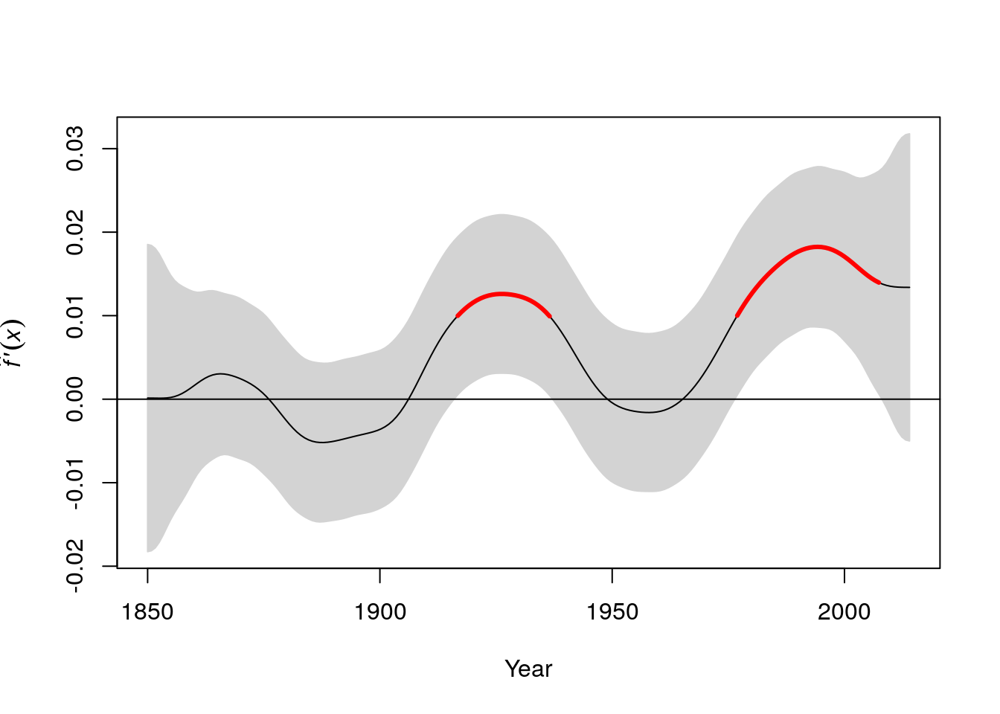

# Time series analysis: Climate data

Modelling time series presents a range of challenges. One of the most basic is deciding on the questions that we want to answer. A large proportion of the literature on time series modelling is devoted to the topic of prediction. For example models of financial time series are used in the stock market for short term prediction (extrapolation) in order to estimate possible prices of shares within hours or days of the current moment. The predictive precision of such models clearly decays with time. Financial models are less concerned with understanding the mechanistic component of the model and more concerned with the stochastic element, as this determines risk and uncertainty.

It is common for ecologists, climatologists and paleoecologists to ask whether there has been any consistent upward or downwards trend in a time series and aim to link this with underlying mechanisms. For example climate change is commonly reported in terms of change in temperature per decade, which implies a linear trend. However although a this simple model is useful as a generalisation, it would not be expected to fit real data very closely. Real time series are more complex. An overall trend towards higher temperatures does not imply that there may not be periods of temporary cooling. Furthermore any analysis has to face the additional challenges of periodicity and serial auto correlation. Some periodic effects, such as seasonality, are well defined and can be relatively cleanly extracted from a time series in order to be analysed. Other periodic effects, such as the influence of El Niño on climatic variables are more subtle and uncertain.

In order to look at the analysis of time series we will begin by using an excellent example of good practice provide by Gavin Simpson. Gavin Simpson is a key contributor to the vegan package in R and a sophisticated and practical minded data analyst. The original material is available in the form of weblogs from here

http://www.fromthebottomoftheheap.net/2011/06/11/global-warming-since-1995-now-significant/

http://www.fromthebottomoftheheap.net/2011/06/12/additive-modelling-and-the-hadcrut3v-global-mean-temperature-series/

http://www.fromthebottomoftheheap.net/2014/05/09/modelling-seasonal-data-with-gam/

Gavin Simpson provides code to download and reformat data found online. As this is rather tricky to run and may be vulnerable to changes in URLs (as in fact occurred) I have run all the code and added the data into the qecol package.


## Load the data

To load the data install (or re-install) the qecol package from github using devtools.


```r
# library(devtools)
#install_github("dgolicher/qecol")
```

Packages used in the analysis.


```r
rm(list=ls())
library(qecol)
library(mgcv)
library(nlme)
library(ggplot2)
library(reshape)
```


## Plot the time series for the hadcrut4 data set

The hadcrut4 data consist of annual global temperature anomalies compared to the mean global temperature in the years from 1961 to 1990. The data are supplied by the University of East Anglia global climate modelling group.


```r
data(hadcrut4)
ylab <- expression(Temperature~Anomaly~(1961-1990)~degree*C)
```


```r
g0<-ggplot(hadcrut4,aes(x=Year,y=Annual))
g1<-g0+geom_point()+geom_line()+ylab(ylab)
g1
```


There seems to be a very clear upward trend. 

Let's try fitting a simple linear model.


```r
g1+geom_smooth(method="lm")
```


```r
mod1<-lm(Annual~Year,data=hadcrut4)
summary(mod1)
```

```
## 
## Call:
## lm(formula = Annual ~ Year, data = hadcrut4)
## 
## Residuals:
##      Min       1Q   Median       3Q      Max 
## -0.34150 -0.11025 -0.00876  0.11406  0.40404 
## 
## Coefficients:
##               Estimate Std. Error t value Pr(>|t|)    
## (Intercept) -9.3342281  0.5028501  -18.56   <2e-16 ***
## Year         0.0047738  0.0002602   18.35   <2e-16 ***
## ---
## Signif. codes:  0 '***' 0.001 '**' 0.01 '*' 0.05 '.' 0.1 ' ' 1
## 
## Residual standard error: 0.1592 on 163 degrees of freedom
## Multiple R-squared:  0.6737,	Adjusted R-squared:  0.6717 
## F-statistic: 336.6 on 1 and 163 DF,  p-value: < 2.2e-16
```

The fit of the linear model is clearly very poor. It does not capture the changes in the trend over the long time period that the data represent.

A smoother relationship is needed.  We can try a gam.


```r
g1+geom_smooth(method="gam",formula=y~s(x))
```


```r
mod <- gam(Annual ~ s(Year, k = 20), data = hadcrut4)
```

This shows up periods in which the temperature has been stable, and also some periods in which the temperature has declined in addition to the more general upward trend.

However there may be a problem with serial temporal auto-correlation. Serial auto correlation occurs when anomalies can be predicted from a previous year's values. In this case the model may over fit and be too "wavy" as one of the key assumptions of a gam model is that the residuals are independently drawn from an identical distribution (iids). When this is not the case the model fitting algorithm will try too hard to find a curve that passes close to every data point. If the model formula allows for some serial auto correlation the underlying curve may be simpler in form.

## Example to explain serial autocorrelation

Gavin Simpson provides an example in which he simulates data with a known structure. The underlying relationship is a parabola. However data on either side of the line fall in groups with correlated residuals.


```r
set.seed(321)
n <- 100
time <- 1:n
xt <- time/n
Y <- (1280 * xt^4) * (1- xt)^4
y <- as.numeric(Y + arima.sim(list(ar = 0.3713), n = n))

plot(y~time)
lines(Y~time,col="red")
```


If we adjust a gam model with a few knots we can look at the auto correlation in the residuals.


```r
mod<-gam(y~s(time,k=5))
plot(mod,residuals=TRUE,pch=21,bg=2,cex=0.5)
```


```r
plot(residuals(mod),type="b")
abline(h=0,lwd=2,col=2)
```


Notice how the residuals cluster on each side of the line. If the previous residual is positive it is more likely that the next one will also be positive. This indicates lack of independence. They are "serially auto-correlated".

To understand more clearly how auto correlation works we will look at the lagged time series of the residuals. The first order lag is the time immediately preceding the present. If we plot the residuals against the lagged residuals and find that there is a linear relationship this indicates a first order auto correlation.


```r
pres_residuals<-residuals(mod)
lag_residuals<-pres_residuals[-length(pres_residuals)]
pres_residuals<-pres_residuals[-1]
df<-data.frame(pres_residuals,lag_residuals)
head(df)
```

```
##   pres_residuals lag_residuals
## 1     -1.0555271    -0.2219854
## 2     -0.4305369    -1.0555271
## 3      0.9734785    -0.4305369
## 4      0.2337716     0.9734785
## 5      2.2494336     0.2337716
## 6     -0.5634219     2.2494336
```

```r
g0<-ggplot(df,aes(x=pres_residuals,y=lag_residuals))
g0+geom_point()+geom_smooth(method="lm")
```


We can calculate to correlation coefficient for this.


```r
cor(pres_residuals,lag_residuals)
```

```
## [1] 0.3419599
```

We could continue to look at the relationship two time steps apart and more. However there is an easier way. R will calculate these for us and plot the correlation coefficients for us.


```r
acf(residuals(mod))
```


The problem with just looking at the auto correlation function is that the higher order auto-correlations are not independent of lower order effects. In order to control for this we can use the partial auto correlation function. This "partials out" the effects of lower order correlations leaving only the independent correlations.


```r
pacf(residuals(mod))
```


This suggests that an auto-regressive model form is needed as the acf is highly significant at lag one. The pcf suggests that higher order auto correlation is not occurring (which is in fact correct as it was not responsible for the simulated data.)

So fit three models to the data.


```r
m1 <- smooth.spline(xt, y)
m2 <- gam(y ~ s(xt, k = 20))
m3 <- gamm(y ~ s(xt, k = 20), correlation = corAR1(form = ~ time))
```

The estimated degrees of freedom (complexity of the underlying relationship) varies between the models.


```r
edf2 <- summary(m2)$edf
edf3 <- summary(m3$gam)$edf

plot(y ~ xt, xlab = expression(x[t]), ylab = expression(y[t]))
lines(Y ~ xt, lty = "dashed", lwd = 1)
lines(fitted(m1) ~ xt, lty = "solid", col = "darkolivegreen", lwd = 2)
lines(fitted(m2) ~ xt, lty = "solid", col = "red", lwd = 2)
lines(fitted(m3$lme) ~ xt, lty = "solid", col = "midnightblue", lwd = 2)
legend("topleft",
       legend = c("Truth",
       paste("Cubic spline (edf = ", round(m1$df, 2), ")", sep = ""),
       paste("AM (edf = ", round(edf2, 2), ")", sep = ""),
       paste("AM + AR(1) (edf = ", round(edf3, 2), ")", sep = "")),
       col = c("black", "darkgreen", "red", "midnightblue"),
       lty = c("dashed", rep("solid", 3)),
       lwd = c(1, rep(2, 3)),
       bty = "n", cex = 0.8)
```


## Accounting for serial autocorrelation in the real climate data

We need to fit a model in which the residuals may be serially correlated.

$y = \beta_0 + f_{\mathrm{trend}}(x) + \varepsilon, \quad \varepsilon \sim N(0, \sigma^2\mathbf{\Lambda})$

The inclusion of the correlation matrix in the model formula results in a change in the weighting of the residuals in order to account for the correlation structure. This acts to counter the tendency of the underlying smooth function to over fit.

The first step is to adjust a model with a limited number of knots that may represent a possible pattern. Gavin Simpson uses more knots in his initial model than I personally think should be used at this stage.


```r
test_mod <- gam(Annual ~ s(Year, k = 10), data = hadcrut4)
plot(test_mod, residuals = TRUE, pch = 19, cex = 0.75)
```


Now look at the acf and pacf functions.


```r
acf(residuals(test_mod))
```


```r
pacf(residuals(test_mod))
```


What you should be looking at is first how far back the auto correlation goes in terms of lags. However if we use the acf alone this could be misleading as the dependence on previous lags is not taken into account. The partial auto correlation function is needed. In this case there is significant auto correlation to lag one, and a possibly significant, but very weak, further effects at lag2. All others appear to be too weak to be important. So we can try building a first and second order auto correlation into the model.


```r
m1 <- gamm(Annual ~ s(Year, k = 30), data = hadcrut4)

m2 <- gamm(Annual ~ s(Year, k = 30), data = hadcrut4,correlation = corARMA(form = ~ Year, p = 1)) ## First order

m3 <- gamm(Annual ~ s(Year, k = 30), data = hadcrut4,correlation = corARMA(form = ~ Year, p = 2)) ## Second order
```


```r
anova(m1$lme, m2$lme, m3$lme)
```

```
##        Model df       AIC       BIC   logLik   Test   L.Ratio p-value
## m1$lme     1  4 -261.4864 -249.0626 134.7432                         
## m2$lme     2  5 -278.2396 -262.7099 144.1198 1 vs 2 18.753292  <.0001
## m3$lme     3  6 -278.8305 -260.1948 145.4152 2 vs 3  2.590839  0.1075
```

The model with a first order auto-regressive term is significantly better than the model with no serial auto correlation.


```r
plot(m2$gam, residuals = TRUE, pch = 19, cex = 0.75)
```


Gavin Simpson provides a very useful function to look at model diagnostics for a fitted GAMM.


```r
with(hadcrut4, tsDiagGamm(m2, timevar = Year, observed = Annual))
```


There seem to be no major problems.


```r
plot(Annual ~ Year, data = hadcrut4, type = "b", ylab = ylab)
pdat <- with(hadcrut4,
             data.frame(Year = seq(min(Year), max(Year),
                        length = 200)))
p1 <- predict(m1$gam, newdata = pdat)
p2 <- predict(m2$gam, newdata = pdat)
lines(p1 ~ Year, data = pdat, col = "red")
lines(p2 ~ Year, data = pdat, col = "blue")
legend("topleft",
       legend = c("Uncorrelated Errors","AR(1) Errors"),
       bty = "n", col = c("red","blue"), lty = 1)
```


The differences between the gam with and without auto correlation are actually quite minor so it would in fact have been OK to have ignored the serial auto correlation and relied on mgcv to select the number of knots for the GAM alone. However it would be bad practice to do this by default, as you may be asked to justify the assumption that there serial auto correlation in the residuals can be ignored.

## Analysing the significance of the slope

Gavin Simpson provides a very useful function for looking at local trends in a fitted model. In other words we may be interested in trying to detect periods in which significant upwards or downwards trends were taking place. We do that by looking at the slope of the fitted model (the first derivative of the values). Gavin Simpson's code achieves this though numerical, rather than analytically (there is no form for this) differentiation.


```r
m2.d <- Deriv(m2$gam, n = 200)
plot(m2.d, sizer = TRUE, alpha = 0.01)
```



I have changed the original function so that warming periods show up in red and cooling periods in blue, which is more logical. The grey bands are confidence intervals. So the function shows up periods in which there has been significant warming.

This can be placed on the original time series.


```r
plot(Annual ~ Year, data = hadcrut4, type = "b", ylab = ylab)
lines(p2 ~ Year, data = pdat)
CI <- confint(m2.d, alpha = 0.01)
S <- signifD(p2, m2.d$Year$deriv, CI$Year$upper, CI$Year$lower,
             eval = 0)
lines(S$incr ~ Year, data = pdat, lwd = 3, col = "red")
lines(S$decr ~ Year, data = pdat, lwd = 3, col = "blue")
```


## Seasonal data

The previous data set used mean annual temperatures. However raw climate data will clearly have a seasonal component. This is a predictable cyclical element that is distinct from any other auto correlation in the data.

The "cet" data set contains a long time series of data representing the mean monthly temperatures in Central England. 

GAM's can be used to break down the time series into two components. The 12 monthly seasonal component and the remaining trend.

$y = \beta_0 + f_{\mathrm{seasonal}}(x_1) + f_{\mathrm{trend}}(x_2) + \varepsilon, \quad \varepsilon \sim N(0, \sigma^2\mathbf{\Lambda})$

The spline used for the monthly trend is a cyclical spline. This makes sure that the start and end point match.


```r
data(cet)
cet<-cet[order(cet$Date),]

m <- gamm(Temperature ~ s(Month_n, bs = "cc", k = 12) + s(Year), data = cet)
```


```r
layout(matrix(1:2, ncol = 2))
plot(m$gam, scale = 0)
```


Details of how to account for serial auto correlation are included in Gavin Simpson's post.

http://www.fromthebottomoftheheap.net/2014/05/09/modelling-seasonal-data-with-gam/

I won't go through all this myself. However it is worth pointing out that serial auto correlation can only be detected in long time series. In this case the time series is longer than the previous one. There is a scaling issue. Once auto correlation is accounted for the result is much smoother in this time series than the last. Whether this is desirable or not is debatable and there are no clear answers.

## Seasonal decomposition by loess smoothing

Seasonal decomposition using loess is automated in an R function. This can be a very convenient way of looking at monthly time series.
We will work with the cet data after 1900. We need to form a time series object for this analysis. Look at the help pages on time series objects to understand this step. 


```r
data(cet)
cet<-cet[order(cet$Date),]

cet<-cet[format(cet$Date, "%Y")>1900,]
min(cet$Date)
```

```
## [1] "1901-01-15"
```

```r
cet_ts<-ts(cet$Temperature,start=1900,freq=12)
```


The stl functiondecomposes the time series into a seasonal, trend and irregular components. This is very convenient and easy to use. Loess smoothing produces similar looking results to splines. The downside is that loess does not have such a clear theoretical basis, so it is difficult to base the complexity of the curves on statistical criteria. 

There are two adjustable parameters that can change the results. The seasonal window (s.window) and the trend window (t.window). If the value of the t.window settings is 1 the algorithmn will extract each year's seasonal pattern independently and not smoth accross several years. If the setting is increased the seasonal pattern is averaged over several years. If the value is very large a single seasonal pattern is used over all years. 


```r
cet_stl<-stl(cet_ts,s.window=1,t.window=300)
plot(cet_stl)
```


```r
cet_stl<-stl(cet_ts,s.window=500,t.window=300)
plot(cet_stl)
```


```r
cet_stl<-stl(cet_ts,s.window=5,t.window=50)
plot(cet_stl)
```


```r
cet_stl<-stl(cet_ts,s.window=5,t.window=500)
plot(cet_stl)
```


It is not easy to decide on optimum settings for these parameters. They depend on the questions that are being asked. If you are interested in variability in seasonal patterns then the s.window parameter should be set to a low value. If you are interested in the annual trends over time then it may be set to a higher value. If the t.window setting is very large the trend will become linear.

The elements of this decomposition can be extracted from the fitted object and used seperately.


```r
plot(cet_stl$time.series[,2])
```


This should give some ideas regarding how time series can be analysed. As mentioned in the introduction, one of the most important elements in time series analysis is to ensure that the question being adressed is clearly stated and that uncertainties are made explicit. There is no single correct way to analyse these sort of data.

